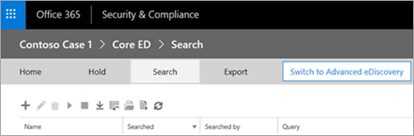
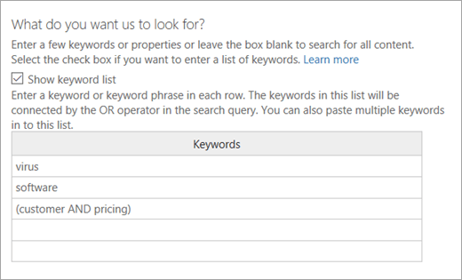

# <a name="manage-ediscovery-cases-in-the-security--compliance-center"></a><span data-ttu-id="ca569-103">在安全&合规中心管理电子数据展示案例</span><span class="sxs-lookup"><span data-stu-id="ca569-103">Manage eDiscovery cases in the Security & Compliance Center</span></span>

<span data-ttu-id="ca569-104">您可以在安全&合规中心中使用电子数据展示案例来控制谁可以在组织中创建、访问和管理电子数据展示案例。</span><span class="sxs-lookup"><span data-stu-id="ca569-104">You can use eDiscovery cases in the Security & Compliance Center to control who can create, access, and manage eDiscovery cases in your organization.</span></span> <span data-ttu-id="ca569-105">如果您的组织具有 Office 365 E5 订阅，您还可以使用电子数据展示案例通过使用 Office 365 高级电子数据展示来分析搜索结果。</span><span class="sxs-lookup"><span data-stu-id="ca569-105">If your organization has an Office 365 E5 subscription, you can also use eDiscovery cases to analyze search results by using Office 365 Advanced eDiscovery.</span></span>
  
<span data-ttu-id="ca569-106">电子数据展示案例允许您向案例添加成员、控制特定案例成员可以执行的操作类型、对与法律案例相关的内容位置进行保留，以及将多个内容搜索与单个案例相关联。</span><span class="sxs-lookup"><span data-stu-id="ca569-106">An eDiscovery case allows you to add members to a case, control what types of actions that specific case members can perform, place a hold on content locations relevant to a legal case, and associate multiple Content Searches with a single case.</span></span> <span data-ttu-id="ca569-107">您还可以导出与案例关联的任何内容搜索的结果，或在高级电子数据展示中准备用于分析的搜索结果。</span><span class="sxs-lookup"><span data-stu-id="ca569-107">You can also export the results of any Content Search that is associated with a case or prepare search results for analysis in Advanced eDiscovery.</span></span> <span data-ttu-id="ca569-108">电子数据展示案例是限制谁有权访问组织中特定法律案例的内容搜索和搜索结果的好方法。</span><span class="sxs-lookup"><span data-stu-id="ca569-108">eDiscovery cases are a good way to limit who has access to Content Searches and search results for a specific legal case in your organization.</span></span>
  
<span data-ttu-id="ca569-109">使用以下工作流在安全&合规中心和高级电子数据展示中设置和使用电子数据展示案例。</span><span class="sxs-lookup"><span data-stu-id="ca569-109">Use the following workflow to set up and use eDiscovery cases in the Security & Compliance Center and Advanced eDiscovery.</span></span>
  
[<span data-ttu-id="ca569-110">第 1 步：将电子数据展示权限分配给潜在案例成员</span><span class="sxs-lookup"><span data-stu-id="ca569-110">Step 1: Assign eDiscovery permissions to potential case members</span></span>](manage-ediscovery-cases.md#step1_1)
  
[<span data-ttu-id="ca569-111">第 2 步：创建新案例</span><span class="sxs-lookup"><span data-stu-id="ca569-111">Step 2: Create a new case</span></span>](manage-ediscovery-cases.md#step2_1)
  
[<span data-ttu-id="ca569-112">步骤 3：将成员添加到案例</span><span class="sxs-lookup"><span data-stu-id="ca569-112">Step 3: Add members to a case</span></span>](manage-ediscovery-cases.md#step2a_1)
  
[<span data-ttu-id="ca569-113">第 4 步：将内容位置置于保留状态</span><span class="sxs-lookup"><span data-stu-id="ca569-113">Step 4: Place content locations on hold</span></span>](manage-ediscovery-cases.md#step3_1)
  
[<span data-ttu-id="ca569-114">第 5 步：创建并运行与案例关联的内容搜索</span><span class="sxs-lookup"><span data-stu-id="ca569-114">Step 5: Create and run a Content Search associated with a case</span></span>](manage-ediscovery-cases.md#step4_1)
  
[<span data-ttu-id="ca569-115">步骤 6：导出与案例关联的内容搜索结果</span><span class="sxs-lookup"><span data-stu-id="ca569-115">Step 6: Export the results of a Content Search associated with a case</span></span>](manage-ediscovery-cases.md#step5_1)
  
[<span data-ttu-id="ca569-116">第 7 步：为高级电子数据展示准备搜索结果</span><span class="sxs-lookup"><span data-stu-id="ca569-116">Step 7: Prepare search results for Advanced eDiscovery</span></span>](manage-ediscovery-cases.md#step7_1)
  
[<span data-ttu-id="ca569-117">第 8 步：转到高级电子数据展示中的情况</span><span class="sxs-lookup"><span data-stu-id="ca569-117">Step 8: Go to the case in Advanced eDiscovery</span></span>](manage-ediscovery-cases.md#gotoAeD_1)
  
[<span data-ttu-id="ca569-118">（可选）第 9 步：关闭案例</span><span class="sxs-lookup"><span data-stu-id="ca569-118">(Optional) Step 9: Close a case</span></span>](manage-ediscovery-cases.md#closecase_1)
  
[<span data-ttu-id="ca569-119">（可选）步骤 10：重新打开已关闭的案例</span><span class="sxs-lookup"><span data-stu-id="ca569-119">(Optional) Step 10: Re-open a closed case</span></span>](manage-ediscovery-cases.md#reopencase_1)
  
[<span data-ttu-id="ca569-120">詳細資訊</span><span class="sxs-lookup"><span data-stu-id="ca569-120">More information</span></span>](manage-ediscovery-cases.md#moreinfo_1)
  
## <a name="step-1-assign-ediscovery-permissions-to-potential-case-members"></a><span data-ttu-id="ca569-121">第 1 步：将电子数据展示权限分配给潜在案例成员</span><span class="sxs-lookup"><span data-stu-id="ca569-121">Step 1: Assign eDiscovery permissions to potential case members</span></span>
<span data-ttu-id="ca569-122"><a name="step1_1"> </a></span><span class="sxs-lookup"><span data-stu-id="ca569-122"></span></span>

<span data-ttu-id="ca569-123">第一步是将适当的与电子数据展示相关的权限分配给用户，以便他们可以在步骤 2 中将其添加到电子数据展示案例中。</span><span class="sxs-lookup"><span data-stu-id="ca569-123">The first step is to assign the appropriate eDiscovery-related permissions to people so you can add them to an eDiscovery case in Step 2.</span></span> <span data-ttu-id="ca569-124">您必须是安全&合规性中心中的组织管理角色组（或分配角色管理角色）的成员，才能分配电子数据展示权限。</span><span class="sxs-lookup"><span data-stu-id="ca569-124">You have to be a member of the Organization Management role group (or be assigned the Role Management role) in the Security & Compliance Center to assign eDiscovery permissions.</span></span> <span data-ttu-id="ca569-125">下面的列表描述了安全&合规中心中与电子数据展示相关的角色组。</span><span class="sxs-lookup"><span data-stu-id="ca569-125">The following list describes the eDiscovery-related role groups in the Security & Compliance Center.</span></span>
  
- <span data-ttu-id="ca569-126">**审阅者**此角色组具有最严格的与电子数据展示相关的权限。</span><span class="sxs-lookup"><span data-stu-id="ca569-126">**Reviewer**This role group has the most restrictive eDiscovery-related permissions.</span></span> <span data-ttu-id="ca569-127">此组的成员只能查看和打开他们所安全&合规中心**中的电子数据展示**页面上的案件列表。</span><span class="sxs-lookup"><span data-stu-id="ca569-127">Members of this group can only see and open the list of the cases on the **eDiscovery** page in the Security & Compliance Center that they are members of.</span></span> <span data-ttu-id="ca569-128">他们无法创建案例、向案例添加成员、创建保留、创建搜索、导出搜索结果或为高级电子数据展示准备结果。</span><span class="sxs-lookup"><span data-stu-id="ca569-128">They can't create cases, add members to a case, create holds, create searches, export search results, or prepare results for Advanced eDiscovery.</span></span> <span data-ttu-id="ca569-129">但是，成员可以访问高级电子数据展示中的案例来执行分析任务。</span><span class="sxs-lookup"><span data-stu-id="ca569-129">However, members can access cases in Advanced eDiscovery to perform analysis tasks.</span></span> 
    
- <span data-ttu-id="ca569-130">**电子数据展示管理器**此角色组的成员可以创建和管理电子数据展示案例。</span><span class="sxs-lookup"><span data-stu-id="ca569-130">**eDiscovery Manager**Members of this role group can create and manage eDiscovery cases.</span></span> <span data-ttu-id="ca569-131">他们可以添加和删除成员、将内容位置置于保留状态、创建和编辑与案例关联的内容搜索、导出内容搜索的结果，以及准备搜索结果以在高级电子数据展示中进行分析。</span><span class="sxs-lookup"><span data-stu-id="ca569-131">They can add and remove members, place content locations on hold, create and edit Content Searches associated with a case, export the results of a Content Search, and prepare search results for analysis in Advanced eDiscovery.</span></span> <span data-ttu-id="ca569-132">此角色组中有两个子组。</span><span class="sxs-lookup"><span data-stu-id="ca569-132">There are two sub-groups in this role group.</span></span> <span data-ttu-id="ca569-133">这些子组之间的差异基于范围。</span><span class="sxs-lookup"><span data-stu-id="ca569-133">The difference between these subgroups is based on scope.</span></span>
    
  - <span data-ttu-id="ca569-134">**电子数据展示管理器**可以查看和管理他们创建或成为成员的电子数据展示案例。</span><span class="sxs-lookup"><span data-stu-id="ca569-134">**eDiscovery Manager**Can view and manage the eDiscovery cases they create or are a member of.</span></span> <span data-ttu-id="ca569-135">如果另一个电子数据展示管理器创建案例，但没有添加第二个电子数据展示管理器作为该案例的成员，则第二个电子数据展示管理器将无法在安全&合规中心**中的电子数据展示**页面上查看或打开该案例。</span><span class="sxs-lookup"><span data-stu-id="ca569-135">If another eDiscovery Manager creates a case but doesn't add a second eDiscovery Manager as a member of that case, the second eDiscovery Manager won't be able to view or open the case on the **eDiscovery** page in the Security & Compliance Center.</span></span> <span data-ttu-id="ca569-136">电子数据展示经理还可以访问其在高级电子数据展示中的情况以执行分析任务。</span><span class="sxs-lookup"><span data-stu-id="ca569-136">eDiscovery Managers can also access their cases in Advanced eDiscovery to perform analysis tasks.</span></span> 
    
  - <span data-ttu-id="ca569-137">**电子数据展示管理员**可以执行电子数据展示管理器可以执行的所有案例管理任务。</span><span class="sxs-lookup"><span data-stu-id="ca569-137">**eDiscovery Administrator**Can perform all case management tasks that an eDiscovery Manager can do.</span></span> <span data-ttu-id="ca569-138">此外，电子数据展示管理员可以：</span><span class="sxs-lookup"><span data-stu-id="ca569-138">Additionally, an eDiscovery Administrator can:</span></span>
    
  - <span data-ttu-id="ca569-139">檢視 [eDiscovery]\*\*\*\* 頁面上列出的所有案例。</span><span class="sxs-lookup"><span data-stu-id="ca569-139">View all cases that are listed on the **eDiscovery** page.</span></span> 
    
  - <span data-ttu-id="ca569-140">在将自身添加为案例成员后，管理组织中的任何电子数据展示案例。</span><span class="sxs-lookup"><span data-stu-id="ca569-140">Manage any eDiscovery case in the organization after they add themself as a member of the case.</span></span>
    
  - <span data-ttu-id="ca569-141">在高级电子数据展示中执行管理任务，例如处理案例数据以进行分析、配置案例设置以及从高级电子数据展示导出数据。</span><span class="sxs-lookup"><span data-stu-id="ca569-141">Perform administrative tasks in Advanced eDiscovery, such as processing case data for analysis, configuring case settings, and exporting data from Advanced eDiscovery.</span></span> <span data-ttu-id="ca569-142">这是因为在安全&合规中心担任电子数据展示管理员的人员会自动添加为高级电子数据展示中的管理员。</span><span class="sxs-lookup"><span data-stu-id="ca569-142">This is because a person who is an eDiscovery Administrator in the Security & Compliance Center is automatically added as an administrator in Advanced eDiscovery.</span></span>
    
    <span data-ttu-id="ca569-143">有关组织中可能需要电子数据展示管理员的原因，[请参阅"详细信息"](manage-ediscovery-cases.md#moreinfo_1)部分。</span><span class="sxs-lookup"><span data-stu-id="ca569-143">See the [More information](manage-ediscovery-cases.md#moreinfo_1) section for reasons why you may want an eDiscovery Administrator in your organization.</span></span> 
    
> [!IMPORTANT]
> <span data-ttu-id="ca569-144">如果某人不是这些与电子数据展示相关角色组之一的成员，或者不是分配了审阅者角色的角色组的成员，则不能将他们添加为电子数据展示案例的成员。</span><span class="sxs-lookup"><span data-stu-id="ca569-144">If a person isn't a member of one of these eDiscovery-related role groups, or isn't a member of a role group that's assigned the Reviewer role, you can't add them as a member of an eDiscovery case.</span></span> 
  
 <span data-ttu-id="ca569-145">**要分配电子数据展示权限：**</span><span class="sxs-lookup"><span data-stu-id="ca569-145">**To assign eDiscovery permissions:**</span></span>
  
1. <span data-ttu-id="ca569-146">移至 [https://protection.office.com](https://protection.office.com)。</span><span class="sxs-lookup"><span data-stu-id="ca569-146">Go to [https://protection.office.com](https://protection.office.com).</span></span>
    
2. <span data-ttu-id="ca569-147">使用公司或學校帳戶登入 Office 365。</span><span class="sxs-lookup"><span data-stu-id="ca569-147">Sign in to Office 365 using your work or school account.</span></span>
    
3. <span data-ttu-id="ca569-148">在"安全&合规性中心中，单击"**权限"，** 然后根据要分配的"电子数据展示"权限执行以下操作之一。</span><span class="sxs-lookup"><span data-stu-id="ca569-148">In the Security & Compliance Center, click **Permissions**, and then do one of the following based on the eDiscovery permissions that you want to assign.</span></span>
    
  - <span data-ttu-id="ca569-149">要分配审阅者权限，**请选择"审阅者**角色组"，**然后在"成员"** 旁边单击"**编辑"。**</span><span class="sxs-lookup"><span data-stu-id="ca569-149">To assign Reviewer permissions, select the **Reviewer** role group, and then next to **Members** click **Edit**.</span></span> <span data-ttu-id="ca569-150">**单击"选择成员"，** 单击"图标**添加**选择要添加到审阅者角色组的用户"，然后单击"**添加"。**</span><span class="sxs-lookup"><span data-stu-id="ca569-150">Click **Choose members**, click  **Add** select the user that you want to add to the Reviewer role group, and then click **Add**.</span></span>
    
  - <span data-ttu-id="ca569-151">要分配电子数据展示管理器权限，**请选择"电子数据展示管理器"** 角色组，**然后在"电子数据展示管理器"** 旁边单击"**编辑"。**</span><span class="sxs-lookup"><span data-stu-id="ca569-151">To assign eDiscovery Manager permissions, select the **eDiscovery Manager** role group, and then next to **eDiscovery Manager**, click **Edit**.</span></span> <span data-ttu-id="ca569-152">**单击"选择电子数据展示管理器"，**添加*，选择要添加为电子数据展示管理器的用户，然后单击"\*\*添加"。*\*</span><span class="sxs-lookup"><span data-stu-id="ca569-152">Click **Choose eDiscovery Manager**, click  \*\* Add \*\*, select the user that you want to add as an eDiscovery Manager, and then click **Add**.</span></span>
    
  - <span data-ttu-id="ca569-153">要分配电子数据展示管理员权限，**请选择"电子数据展示管理器"** 角色组，**然后在"电子数据展示管理员"** 旁边单击"**编辑"。**</span><span class="sxs-lookup"><span data-stu-id="ca569-153">To assign eDiscovery Administrator permissions, select the **eDiscovery Manager** role group, and then next to **eDiscovery Administrator**, click **Edit**.</span></span> <span data-ttu-id="ca569-154">**单击"选择电子数据展示管理员"，****添加"，** 选择要添加为电子数据展示管理员的用户，然后单击"**添加"。**</span><span class="sxs-lookup"><span data-stu-id="ca569-154">Click **Choose eDiscovery Administrator**, click  **Add**, select the user that you want to add as an eDiscovery Administrator, and then click **Add**.</span></span>
    
4. <span data-ttu-id="ca569-155">添加所有用户后，单击"**完成"，\*\*\*\*单击"保存"** 以将更改保存到角色组，然后单击"**关闭"。**</span><span class="sxs-lookup"><span data-stu-id="ca569-155">After you've added all the users, click **Done**, click **Save** to save the changes to the role group, and then click **Close**.</span></span>
    

  
## <a name="step-2-create-a-new-case"></a><span data-ttu-id="ca569-156">第 2 步：创建新案例</span><span class="sxs-lookup"><span data-stu-id="ca569-156">Step 2: Create a new case</span></span>
<span data-ttu-id="ca569-157"><a name="step2_1"> </a></span><span class="sxs-lookup"><span data-stu-id="ca569-157"></span></span>

<span data-ttu-id="ca569-158">下一步是创建新的"电子数据展示"案例。</span><span class="sxs-lookup"><span data-stu-id="ca569-158">The next step is to create a new eDiscovery case.</span></span> <span data-ttu-id="ca569-159">您必须是电子数据展示管理器角色组的成员才能创建电子数据展示案例。</span><span class="sxs-lookup"><span data-stu-id="ca569-159">You must be a member of the eDiscovery Managers role group to create eDiscovery cases.</span></span> <span data-ttu-id="ca569-160">如前所述，在安全&合规中心创建新案例后，如果您的组织具有 Office 365 E5 订阅，则您（和其他案例成员）将能够访问高级电子数据展示中的同一案例。</span><span class="sxs-lookup"><span data-stu-id="ca569-160">As previously explained, after you create a new case in the Security & Compliance Center, you (and other case members) will be able to access that same case in Advanced eDiscovery if you're organization has an Office 365 E5 subscription.</span></span>
  
1. <span data-ttu-id="ca569-161">移至 [https://protection.office.com](https://protection.office.com)。</span><span class="sxs-lookup"><span data-stu-id="ca569-161">Go to [https://protection.office.com](https://protection.office.com).</span></span>
    
2. <span data-ttu-id="ca569-162">使用公司或學校帳戶登入 Office 365。</span><span class="sxs-lookup"><span data-stu-id="ca569-162">Sign in to Office 365 using your work or school account.</span></span>
    
3. <span data-ttu-id="ca569-163">在安全&合规中心，**单击"电子数据**\>**展示"，****创建案例"。**</span><span class="sxs-lookup"><span data-stu-id="ca569-163">In the Security & Compliance Center, click **eDiscovery** \> **eDiscovery**, and then click  **Create a case**.</span></span>
    
4. <span data-ttu-id="ca569-164">在"**新建案例"** 页上，为案例指定名称，键入可选说明，然后单击"**保存"。**</span><span class="sxs-lookup"><span data-stu-id="ca569-164">On the **New Case** page, give the case a name, type an optional description, and then click **Save**.</span></span> <span data-ttu-id="ca569-165">请注意，案例名称在您的组织中必须是唯一的。</span><span class="sxs-lookup"><span data-stu-id="ca569-165">Note that the case name must be unique in your organization.</span></span>
    
    
  
    <span data-ttu-id="ca569-167">新案例显示在**电子数据展示**页上的案例列表中。</span><span class="sxs-lookup"><span data-stu-id="ca569-167">The new case is displayed in the list of cases on the **eDiscovery** page.</span></span> <span data-ttu-id="ca569-168">请注意，您可以将光标悬停在案例名称上，以显示有关案例的信息，包括案例的状态（**活动**或**已关闭）、** 案例说明（在上一步中创建）以及上次更改案例时，以及何时更改案例。谁改变了它。</span><span class="sxs-lookup"><span data-stu-id="ca569-168">Note that you can hover the cursor over a case name to display information about the case, including the status of the case ( **Active** or **Closed**), the description of the case (that was created in the previous step), and when the case was changed last and who changed it.</span></span>
    
    > [!TIP]
    > <span data-ttu-id="ca569-169">创建新案例后，您可以随时重命名它。</span><span class="sxs-lookup"><span data-stu-id="ca569-169">After you create a new case, you can rename it anytime.</span></span> <span data-ttu-id="ca569-170">只需单击**电子数据展示**页面上的案例名称即可。</span><span class="sxs-lookup"><span data-stu-id="ca569-170">Just click the name of the case on the **eDiscovery** page.</span></span> <span data-ttu-id="ca569-171">在"**管理此案例**弹出窗口"页上，更改"**名称"** 下框中显示的名称，然后保存更改。</span><span class="sxs-lookup"><span data-stu-id="ca569-171">On the **Manage this case** flyout page, change the name displayed in the box under **Name**, and then save the change.</span></span> 
  
## <a name="step-3-add-members-to-a-case"></a><span data-ttu-id="ca569-172">步骤 3：将成员添加到案例</span><span class="sxs-lookup"><span data-stu-id="ca569-172">Step 3: Add members to a case</span></span>
<span data-ttu-id="ca569-173"><a name="step2a_1"> </a></span><span class="sxs-lookup"><span data-stu-id="ca569-173"></span></span>

<span data-ttu-id="ca569-174">创建新案例后，下一步是向案例添加成员。</span><span class="sxs-lookup"><span data-stu-id="ca569-174">After you create a new case, the next step is to add members to the case.</span></span> <span data-ttu-id="ca569-175">如前所述，只有作为审阅者或电子数据展示管理器角色组成员的用户才能添加为案例的成员。</span><span class="sxs-lookup"><span data-stu-id="ca569-175">As previous explained, only users that are members of the Reviewer or eDiscovery Manager role groups can be added as a member of the case.</span></span> <span data-ttu-id="ca569-176">请注意，创建案例的电子数据展示管理器将自动添加为成员。</span><span class="sxs-lookup"><span data-stu-id="ca569-176">Note that the eDiscovery Manager who created the case is automatically added as a member.</span></span>
  
1. <span data-ttu-id="ca569-177">在"安全&合规中心"中，**单击"电子数据**\>**展示"** 以显示组织中的案件列表。</span><span class="sxs-lookup"><span data-stu-id="ca569-177">In the Security & Compliance Center, click **eDiscovery** \> **eDiscovery** to display the list of cases in your organization.</span></span> 
    
2. <span data-ttu-id="ca569-178">单击要向其添加成员的案例的名称。</span><span class="sxs-lookup"><span data-stu-id="ca569-178">Click the name of the case that you want to add members to.</span></span>
    
    <span data-ttu-id="ca569-179">将显示"**管理此案例**弹出窗口"页。</span><span class="sxs-lookup"><span data-stu-id="ca569-179">The **Manage this case** flyout page is displayed.</span></span> 
    
    
  
3. <span data-ttu-id="ca569-181">**在"管理成员"**单击"添加图标**添加"** 以将成员添加到案例中。</span><span class="sxs-lookup"><span data-stu-id="ca569-181">Under **Manage members**, click  **Add** to add members to the case.</span></span> 
    
4. <span data-ttu-id="ca569-182">在可添加为案例成员的人员列表中，单击要添加到案例的人员姓名旁边的复选框。</span><span class="sxs-lookup"><span data-stu-id="ca569-182">In the list of people who can be added as a member of the case, click the checkbox next to the name of the people you want to add to the case.</span></span>
    
    > [!TIP]
    > <span data-ttu-id="ca569-183">如果您有一个大型可以添加为成员的人员列表，**请使用"搜索"** 框搜索列表中的特定人员。</span><span class="sxs-lookup"><span data-stu-id="ca569-183">If you have a large list of people who can added as members, use the **Search** box to search for a specific person in the list.</span></span> 
  
5. <span data-ttu-id="ca569-184">选择要添加为组成员的人后，单击"**添加"。**</span><span class="sxs-lookup"><span data-stu-id="ca569-184">After you've selected the people to add as members of the group, click **Add**.</span></span>
    
    <span data-ttu-id="ca569-185">**在"管理此案例"** 中，**单击"保存"** 以保存新的案例成员列表。</span><span class="sxs-lookup"><span data-stu-id="ca569-185">In **Manage this case**, click **Save** to save the new list of case members.</span></span> 
    
6. <span data-ttu-id="ca569-186">**单击"保存"** 可保存案例成员的新列表。</span><span class="sxs-lookup"><span data-stu-id="ca569-186">Click **Save** to save the new list of case members.</span></span> 
  
## <a name="step-4-place-content-locations-on-hold"></a><span data-ttu-id="ca569-187">第 4 步：将内容位置置于保留状态</span><span class="sxs-lookup"><span data-stu-id="ca569-187">Step 4: Place content locations on hold</span></span>
<span data-ttu-id="ca569-188"><a name="step3_1"> </a></span><span class="sxs-lookup"><span data-stu-id="ca569-188"></span></span>

<span data-ttu-id="ca569-189">您可以使用电子数据展示案例创建保留，以保留可能与案例相关的内容。</span><span class="sxs-lookup"><span data-stu-id="ca569-189">You can use an eDiscovery case to create holds to preserve content that might be relevant to the case.</span></span> <span data-ttu-id="ca569-190">您可以对案例中作为保管人的人员的邮箱和 OneDrive 业务站点进行保留。</span><span class="sxs-lookup"><span data-stu-id="ca569-190">You can place a hold on the mailboxes and OneDrive for Business sites of people who are custodians in the case.</span></span> <span data-ttu-id="ca569-191">您还可以在 Office 365 组的组邮箱、SharePoint 站点和 OneDrive 业务站点上放置保留。</span><span class="sxs-lookup"><span data-stu-id="ca569-191">You can also place a hold on the group mailbox, SharePoint site, and OneDrive for Business site for an Office 365 Group.</span></span> <span data-ttu-id="ca569-192">同样，您可以在与 Microsoft Teams 关联的邮箱和站点上放置保留。</span><span class="sxs-lookup"><span data-stu-id="ca569-192">Similarly, you can place a hold on the mailbox and site that are associated with Microsoft Teams.</span></span> <span data-ttu-id="ca569-193">将内容位置置于保留状态时，内容将保留，直到从内容位置删除保留或删除保留。</span><span class="sxs-lookup"><span data-stu-id="ca569-193">When you place content locations on hold, content is held until you remove the hold from the content location or until you delete the hold.</span></span>
  
<span data-ttu-id="ca569-194">创建保留时，您有以下选项来限定在指定内容位置中保留的内容的范围：</span><span class="sxs-lookup"><span data-stu-id="ca569-194">When you create a hold, you have the following options to scope the content that is held in the specified content locations:</span></span>
  
- <span data-ttu-id="ca569-195">创建无限保留，其中所有内容都置于保留状态。</span><span class="sxs-lookup"><span data-stu-id="ca569-195">You create an infinite hold where all content is placed on hold.</span></span> <span data-ttu-id="ca569-196">或者，您可以创建基于查询的保留，其中仅将与搜索查询匹配的内容置于保留状态。</span><span class="sxs-lookup"><span data-stu-id="ca569-196">Alternatively, you can create a query-based hold where only content that matches a search query is placed on hold.</span></span>
    
- <span data-ttu-id="ca569-197">您可以指定日期范围，以仅保存该日期范围内发送、接收或创建的内容。</span><span class="sxs-lookup"><span data-stu-id="ca569-197">You can specify a date range to hold only the content that was sent, received, or created within that date range.</span></span> <span data-ttu-id="ca569-198">或者，您可以保留所有内容，而不管内容是何时发送、接收或创建。</span><span class="sxs-lookup"><span data-stu-id="ca569-198">Alternatively, you can hold all content regardless of when it was sent, received, or created.</span></span>
    
> [!NOTE]
> <span data-ttu-id="ca569-199">在组织中的所有电子数据展示案例中，最多可以有 10，000 个保留策略。</span><span class="sxs-lookup"><span data-stu-id="ca569-199">You can have a maximum of 10,000 hold policies across all eDiscovery cases in your organization.</span></span> 
  
<span data-ttu-id="ca569-200">要为电子数据展示案例创建保留：</span><span class="sxs-lookup"><span data-stu-id="ca569-200">To create a hold for an eDiscovery case:</span></span>
  
1. <span data-ttu-id="ca569-201">在"安全&合规中心"中，**单击"电子数据**\>**展示"** 以显示组织中的案件列表。</span><span class="sxs-lookup"><span data-stu-id="ca569-201">In the Security & Compliance Center, click **eDiscovery** \> **eDiscovery** to display the list of cases in your organization.</span></span> 
    
2. <span data-ttu-id="ca569-202">单击要创建保留的案例**旁边的"打开"。**</span><span class="sxs-lookup"><span data-stu-id="ca569-202">Click **Open** next to the case that you want to create the holds in.</span></span> 
    
3. <span data-ttu-id="ca569-203">在案例的**主页**上，**单击"保留"。**</span><span class="sxs-lookup"><span data-stu-id="ca569-203">On the **Home** page for the case, click **Hold**.</span></span>
    
    
  
4. <span data-ttu-id="ca569-205">在"**保留"** 页上，**单击"新建**</span><span class="sxs-lookup"><span data-stu-id="ca569-205">On the **Hold** page, click **New**.</span></span>
    
5. <span data-ttu-id="ca569-206">在"**创建新保留"** 页上，为保留指定名称。</span><span class="sxs-lookup"><span data-stu-id="ca569-206">On the **Create a new hold** page, give the hold a name.</span></span> <span data-ttu-id="ca569-207">保留的名称在您的组织中必须是唯一的。</span><span class="sxs-lookup"><span data-stu-id="ca569-207">The name of the hold must be unique in your organization.</span></span> 
    
6. <span data-ttu-id="ca569-208">选择要置于保留状态的内容位置。</span><span class="sxs-lookup"><span data-stu-id="ca569-208">Choose the content locations that you want to place on hold.</span></span> <span data-ttu-id="ca569-209">您可以将邮箱、站点和公用文件夹置于保留状态。</span><span class="sxs-lookup"><span data-stu-id="ca569-209">You can place mailboxes, sites, and public folders on hold.</span></span>
    
    
  
1. <span data-ttu-id="ca569-211">**邮箱\*\*\*\*单击"添加**图标"以指定要置于保留状态的邮箱。</span><span class="sxs-lookup"><span data-stu-id="ca569-211">**Mailboxes** Click **Add** to specify mailboxes to place on hold.</span></span> <span data-ttu-id="ca569-212">使用搜索框查找用户邮箱和通讯组（对组成员的邮箱进行保留）以置于保留状态。</span><span class="sxs-lookup"><span data-stu-id="ca569-212">Use the search box to find user mailboxes and distribution groups (to place a hold on the mailboxes of group members) to place on hold.</span></span> <span data-ttu-id="ca569-213">您还可以在 Office 365 组或 Microsoft 团队的关联邮箱上放置保留。</span><span class="sxs-lookup"><span data-stu-id="ca569-213">You can also place a hold on the associated mailbox for an Office 365 Group or a Microsoft Team.</span></span> 
    
    > [!NOTE]
    > <span data-ttu-id="ca569-214">当您**单击"添加图标"**以指定要置于保留状态的邮箱时，显示的邮箱选取器为空。</span><span class="sxs-lookup"><span data-stu-id="ca569-214">When you click **Add** to specify mailboxes to place on hold, the mailbox picker that's displayed is empty.</span></span> <span data-ttu-id="ca569-215">這項設計的目的是提升效能。</span><span class="sxs-lookup"><span data-stu-id="ca569-215">This is by design to enhance performance.</span></span> <span data-ttu-id="ca569-216">要将人员添加到此列表，请在搜索框中键入名称（至少 3 个字符），然后单击"**搜索**。</span><span class="sxs-lookup"><span data-stu-id="ca569-216">To add people to this list, type a name (a minimum of 3 characters) in the search box and click **Search**.</span></span> 
  
2. <span data-ttu-id="ca569-217">**网站\*\*\*\*单击"添加图标"**以指定"共享点"和"一个驱动器"，以便业务网站将其置于保留状态。</span><span class="sxs-lookup"><span data-stu-id="ca569-217">**Sites** Click **Add** to specify SharePoint and OneDrive for Business sites to place on hold.</span></span> <span data-ttu-id="ca569-218">键入要保留的每个网站的 URL。</span><span class="sxs-lookup"><span data-stu-id="ca569-218">Type the URL for each site that you want to place on hold.</span></span> <span data-ttu-id="ca569-219">您还可以为 Office 365 组或 Microsoft 团队添加 SharePoint 网站的 URL。</span><span class="sxs-lookup"><span data-stu-id="ca569-219">You can also add the URL for the SharePoint site for an Office 365 Group or a Microsoft Team.</span></span> 
    
    <span data-ttu-id="ca569-220">有关将 Office 365 组和 Microsoft 团队置于保留状态的提示，请参阅[详细信息](https://support.office.com/article/edea80d6-20a7-40fb-b8c4-5e8c8395f6da.aspx#moreinfo_1)部分。</span><span class="sxs-lookup"><span data-stu-id="ca569-220">See the [More information](https://support.office.com/article/edea80d6-20a7-40fb-b8c4-5e8c8395f6da.aspx#moreinfo_1) section for tips on putting Office 365 Groups and Microsoft Teams on hold.</span></span> 
    
    > [!NOTE]
    > <span data-ttu-id="ca569-221">在极少数情况下，用户的用户名 （UPN） 被更改，其 OneDrive 帐户的 URL 也将更改以合并新的 UPN。</span><span class="sxs-lookup"><span data-stu-id="ca569-221">In the rare case that a person's user principal name (UPN) is changed, the URL for their OneDrive account will also be changed to incorporate the new UPN.</span></span> <span data-ttu-id="ca569-222">如果发生这种情况，您必须通过添加用户的新 OneDrive URL 并删除旧 URL 来修改保留。</span><span class="sxs-lookup"><span data-stu-id="ca569-222">If this happens, you'll have to modify the hold by adding the user's new OneDrive URL and removing the old one.</span></span> 
  
3. <span data-ttu-id="ca569-223">**公用文件夹\*\*\*\*单击"保留所有公用文件夹"，** 将 Exchange 联机组织中的所有公用文件夹置于保留状态。</span><span class="sxs-lookup"><span data-stu-id="ca569-223">**Public folders** Click **Hold all public folders** to put all of the public folders in your Exchange Online organization on hold.</span></span> <span data-ttu-id="ca569-224">请注意，您无法选择要置于保留状态的特定公用文件夹。</span><span class="sxs-lookup"><span data-stu-id="ca569-224">Note that you can't choose specific public folders to put on hold.</span></span> <span data-ttu-id="ca569-225">如果不想对公用文件夹进行保留，请**保留"不保留任何公用文件夹"** 选项。</span><span class="sxs-lookup"><span data-stu-id="ca569-225">Leave the **Don't hold any public folders** option selected if you don't want to put a hold on public folders.</span></span> 
    
7. <span data-ttu-id="ca569-226">将内容位置添加到保留状态后，单击"**下一步"。**</span><span class="sxs-lookup"><span data-stu-id="ca569-226">When you're done adding content locations to the hold, click **Next**.</span></span>
    
8. <span data-ttu-id="ca569-227">要创建具有条件的基于查询的保留，请完成以下操作。</span><span class="sxs-lookup"><span data-stu-id="ca569-227">To create a query-based hold with conditions, complete the following.</span></span> <span data-ttu-id="ca569-228">否则，**只需单击"完成"** 即可保存所有内容。</span><span class="sxs-lookup"><span data-stu-id="ca569-228">Otherwise, just click **Finish** to hold all content.</span></span> 
    
    
  
    <span data-ttu-id="ca569-230">有关创建搜索查询和使用条件的详细信息，请参阅[关键字查询和内容搜索的搜索条件。](keyword-queries-and-search-conditions.md)</span><span class="sxs-lookup"><span data-stu-id="ca569-230">For more information about creating a search query and using conditions, see [Keyword queries and search conditions for Content Search](keyword-queries-and-search-conditions.md).</span></span>
    
1. <span data-ttu-id="ca569-231">**在"您希望我们查找什么"** 下的框中，在框中键入搜索查询，以便仅将满足搜索条件的内容置于保留状态。</span><span class="sxs-lookup"><span data-stu-id="ca569-231">In the box under **What do you want us to look for?**, type a search query in the box so that only the content that meets the search criteria is placed on hold.</span></span> <span data-ttu-id="ca569-232">您可以指定关键字、消息属性或文档属性（如文件名）。</span><span class="sxs-lookup"><span data-stu-id="ca569-232">You can specify keywords, message properties, or document properties, such as file names.</span></span> <span data-ttu-id="ca569-233">您还可以使用使用布尔运算符的更复杂的查询，如**AND、OR**或**NOT**。 \*\*\*\*</span><span class="sxs-lookup"><span data-stu-id="ca569-233">You can also use more complex queries that use a Boolean operator, such as **AND**, **OR**, or **NOT**.</span></span> <span data-ttu-id="ca569-234">如果关键字框为空，则位于指定内容位置的所有内容都将置于保留状态。</span><span class="sxs-lookup"><span data-stu-id="ca569-234">If you leave the keyword box empty, then all content located in the specified content locations will be placed on hold.</span></span> 
    
2. <span data-ttu-id="ca569-235">**在"条件"** 下，**单击"添加条件"** 以添加一个或多个条件以缩小保留的搜索查询范围。</span><span class="sxs-lookup"><span data-stu-id="ca569-235">Under **Conditions**, click **Add condition** to add one or more conditions to narrow the search query for the hold.</span></span> <span data-ttu-id="ca569-236">每个条件都会向创建保留时创建和运行的 KQL 搜索查询添加一个子句。</span><span class="sxs-lookup"><span data-stu-id="ca569-236">Each condition adds a clause to the KQL search query that is created and run when you create the hold.</span></span> <span data-ttu-id="ca569-237">例如，您可以指定日期范围，以便在日期范围内创建的电子邮件或网站文档置于保留状态。</span><span class="sxs-lookup"><span data-stu-id="ca569-237">For example you can specify a date range so that email or site documents that were created within the date ranged are placed on hold.</span></span> <span data-ttu-id="ca569-238">條件會以 **AND** 運算子的邏輯方式連接至關鍵字查詢 (在關鍵字方塊中指定)。</span><span class="sxs-lookup"><span data-stu-id="ca569-238">A condition is logically connected to the keyword query (specified in the keyword box) by the **AND** operator.</span></span> <span data-ttu-id="ca569-239">这意味着项必须满足关键字查询和要置于保留的条件。</span><span class="sxs-lookup"><span data-stu-id="ca569-239">That means that items have to satisfy both the keyword query and the condition to be placed on hold.</span></span> 
    
9. <span data-ttu-id="ca569-240">配置基于查询的保留后，**单击"完成"** 以创建保留。</span><span class="sxs-lookup"><span data-stu-id="ca569-240">After configuring a query-based hold, click **Finish** to create the hold.</span></span> 
  
### <a name="hold-statistics"></a><span data-ttu-id="ca569-241">保存统计信息</span><span class="sxs-lookup"><span data-stu-id="ca569-241">Hold statistics</span></span>

<span data-ttu-id="ca569-242">一段时间后，有关新保留的信息将显示在所选保留**的"保留"** 页上的详细信息窗格中。</span><span class="sxs-lookup"><span data-stu-id="ca569-242">After a while, information about the new hold is displayed in the details pane on the **Holds** page for the selected hold.</span></span> <span data-ttu-id="ca569-243">此信息包括处于保留状态的邮箱和网站的数量以及有关置于保留中的内容的统计信息，例如置于保留状态的项目的总数和大小以及上次计算保留统计信息的时间。</span><span class="sxs-lookup"><span data-stu-id="ca569-243">This information includes the number of mailboxes and sites on hold and statistics about the content that was placed on hold, such as the total number and size of items placed on hold and the last time the hold statistics were calculated.</span></span> <span data-ttu-id="ca569-244">这些保留统计信息可帮助您确定持有与电子数据展示案例相关的内容量。</span><span class="sxs-lookup"><span data-stu-id="ca569-244">These hold statistics help you identify how much content that's related to the eDiscovery case is being held.</span></span> 
  

  
<span data-ttu-id="ca569-246">请记住以下有关保留统计信息的事项：</span><span class="sxs-lookup"><span data-stu-id="ca569-246">Keep the following things in mind about hold statistics:</span></span>
  
- <span data-ttu-id="ca569-247">保留的项目总数指示置于保留状态的所有内容源中的项数。</span><span class="sxs-lookup"><span data-stu-id="ca569-247">The total number of items on hold indicates the number of items from all content sources that are placed on hold.</span></span> <span data-ttu-id="ca569-248">如果已创建基于查询的保留，则此统计信息将指示与查询匹配的项数。</span><span class="sxs-lookup"><span data-stu-id="ca569-248">If you've created a query-based hold, this statistic indicates the number of items that match the query.</span></span>
    
- <span data-ttu-id="ca569-249">保留的项目数还包括在内容位置中找到的未编制索引的项目。</span><span class="sxs-lookup"><span data-stu-id="ca569-249">The number of items on hold also includes unindexed items found in the content locations.</span></span> <span data-ttu-id="ca569-250">请注意，如果创建基于查询的保留，则内容位置中的所有未编制索引的项目都将置于保留状态。</span><span class="sxs-lookup"><span data-stu-id="ca569-250">Note that if you create a query-based hold, all unindexed items in the content locations are placed on hold.</span></span> <span data-ttu-id="ca569-251">这包括不符合基于查询的保留的搜索条件的未编制索引项，以及可能超出日期范围条件的未编制索引项。</span><span class="sxs-lookup"><span data-stu-id="ca569-251">This includes unindexed items that don't match the search criteria of a query-based hold and unindexed items that might fall outside of a date range condition.</span></span> <span data-ttu-id="ca569-252">这与运行内容搜索时的情况不同，在内容搜索中，搜索结果中不包含与搜索查询不匹配或被日期范围条件排除的未编制索引的项目。</span><span class="sxs-lookup"><span data-stu-id="ca569-252">This is different than what happens when you run a Content Search, in which unindexed items that don't match the search query or are excluded by a date range condition aren't included in the search results.</span></span> <span data-ttu-id="ca569-253">有关未编制索引的项目的详细信息，请参阅[Office 365 中内容搜索中的未编制索引项目。](partially-indexed-items-in-content-search.md)</span><span class="sxs-lookup"><span data-stu-id="ca569-253">For more information about unindexed items, see [Unindexed items in Content Search in Office 365](partially-indexed-items-in-content-search.md).</span></span>
    
- <span data-ttu-id="ca569-254">您可以通过**单击"更新统计信息"** 来重新运行计算当前保留项目数的搜索估计值，从而获取最新的保留统计信息。</span><span class="sxs-lookup"><span data-stu-id="ca569-254">You can get the latest hold statistics by clicking **Update statistics** to re-run a search estimate that calculates the current number of items on hold.</span></span> <span data-ttu-id="ca569-255">如有必要，单击工具栏**中的"刷新**以更新详细信息窗格中的保留统计信息。</span><span class="sxs-lookup"><span data-stu-id="ca569-255">If necessary, click **Refresh** in the toolbar to update the hold statistics in the details pane.</span></span> 
    
- <span data-ttu-id="ca569-256">保留项目的数量随时间而增加是正常的，因为邮箱或站点处于保留状态的用户通常会发送或接收新的电子邮件，并创建新的 SharePoint 和 OneDrive 业务文档。</span><span class="sxs-lookup"><span data-stu-id="ca569-256">It's normal for the number of items on hold to increase over time because users whose mailbox or site is on hold are typically sending or receiving new email message and creating new SharePoint and OneDrive for Business documents.</span></span>
  
## <a name="step-5-create-and-run-a-content-search-associated-with-a-case"></a><span data-ttu-id="ca569-257">第 5 步：创建并运行与案例关联的内容搜索</span><span class="sxs-lookup"><span data-stu-id="ca569-257">Step 5: Create and run a Content Search associated with a case</span></span>
<span data-ttu-id="ca569-258"><a name="step4_1"> </a></span><span class="sxs-lookup"><span data-stu-id="ca569-258"></span></span>

<span data-ttu-id="ca569-259">创建电子数据展示案例并将与案例相关的任何保管人置于保留状态后，您可以创建并运行与案例关联的一个或多个内容搜索。</span><span class="sxs-lookup"><span data-stu-id="ca569-259">After an eDiscovery case is created and any custodians related to the case are placed on hold, you can create and run one or more Content Searches that are associated with the case.</span></span> <span data-ttu-id="ca569-260">与案例关联的内容搜索未列在"安全&合规性中心"**的"搜索"** 页上。</span><span class="sxs-lookup"><span data-stu-id="ca569-260">Content Searches associated with a case aren't listed on the **Search** page in the Security & Compliance Center.</span></span> <span data-ttu-id="ca569-261">这意味着，与案例关联的内容搜索只能由也是电子数据展示管理器角色组成员的案例成员访问。</span><span class="sxs-lookup"><span data-stu-id="ca569-261">This means that Content Searches associated with a case can only be accessed by case members who are also members of the eDiscovery Manager role group.</span></span> 
  
1. <span data-ttu-id="ca569-262">在"安全&合规中心"中，**单击"电子数据**\>**展示"** 以显示组织中的案件列表。</span><span class="sxs-lookup"><span data-stu-id="ca569-262">In the Security & Compliance Center, click **eDiscovery** \> **eDiscovery** to display the list of cases in your organization.</span></span> 
    
2. <span data-ttu-id="ca569-263">单击要在要在其中创建内容搜索的案例**旁边的"打开"。**</span><span class="sxs-lookup"><span data-stu-id="ca569-263">Click **Open** next to the case that you want to create a Content Search in.</span></span> 
    
3. <span data-ttu-id="ca569-264">在案例的**主页**上，单击"**搜索"。**</span><span class="sxs-lookup"><span data-stu-id="ca569-264">On the **Home** page for the case, click **Search**.</span></span>
    
    
  
4. <span data-ttu-id="ca569-266">在"**搜索"** 页上，**单击"新建**</span><span class="sxs-lookup"><span data-stu-id="ca569-266">On the **Search** page, click **New**.</span></span>
    
5. <span data-ttu-id="ca569-267">在"**新建"搜索**页上，键入搜索的名称。</span><span class="sxs-lookup"><span data-stu-id="ca569-267">On the **New search** page, type a name for the search.</span></span> <span data-ttu-id="ca569-268">与案例关联的内容搜索必须具有 Office 365 组织内唯一的名称。</span><span class="sxs-lookup"><span data-stu-id="ca569-268">Content Searches associated with a case must have names that are unique within your Office 365 organization.</span></span> 
    
6. <span data-ttu-id="ca569-269">选择要搜索的内容位置。</span><span class="sxs-lookup"><span data-stu-id="ca569-269">Choose the content locations that you want to search.</span></span> <span data-ttu-id="ca569-270">您可以在同一搜索中搜索邮箱、网站和公用文件夹。</span><span class="sxs-lookup"><span data-stu-id="ca569-270">You can search mailboxes, sites, and public folders in the same search.</span></span>
    
    
  
1. <span data-ttu-id="ca569-272">**所有案例内容**选择此选项可搜索案例中已置于保留状态的所有内容位置。</span><span class="sxs-lookup"><span data-stu-id="ca569-272">**All case content**Select this option to search all the content locations that have been placed on hold in the case.</span></span> <span data-ttu-id="ca569-273">如果案例包含多个保留，则当您选择此选项时，将搜索所有保留中的内容位置。</span><span class="sxs-lookup"><span data-stu-id="ca569-273">If the case contains multiple holds, the content locations from all holds will be searched when you select this option.</span></span> <span data-ttu-id="ca569-274">此外，如果将内容位置置于基于查询的保留状态，则在运行在此步骤中创建的内容搜索时，将仅搜索处于保留状态的项目。</span><span class="sxs-lookup"><span data-stu-id="ca569-274">Additionally, if a content location was placed on a query-based hold, only the items that are on hold will be searched when you run the content search that you're creating in this step.</span></span> <span data-ttu-id="ca569-275">例如，如果用户被置于基于查询的案例保留状态，以保留在特定日期之前发送或创建的项，则仅使用内容搜索的搜索条件搜索这些项目。</span><span class="sxs-lookup"><span data-stu-id="ca569-275">For example, if a user was placed on query-based case hold that preserves items that were sent or created before a specific date, only those items would be searched by using the search criteria of the content search.</span></span> <span data-ttu-id="ca569-276">这是通过连接**AND**运算符的案例保留查询和内容搜索查询来实现的。</span><span class="sxs-lookup"><span data-stu-id="ca569-276">This is accomplished by connecting the case hold query and the content search query by an **AND** operator.</span></span> <span data-ttu-id="ca569-277">有关搜索案例内容的详细信息，请参阅本文末尾[的详细信息部分。](manage-ediscovery-cases.md#moreinfo_1)</span><span class="sxs-lookup"><span data-stu-id="ca569-277">See the [More information](manage-ediscovery-cases.md#moreinfo_1) section at the end of this article for more details about searching case content.</span></span> 
    
2. <span data-ttu-id="ca569-278">**随处搜索**选择此选项可搜索组织中的所有内容位置。</span><span class="sxs-lookup"><span data-stu-id="ca569-278">**Search everywhere**Select this option to search all content locations in your organization.</span></span> <span data-ttu-id="ca569-279">选择此选项时，可以选择搜索所有 Exchange 邮箱（包括所有 Office 365 组和 Microsoft 团队的邮箱）、所有 SharePoint 和一个业务站点的 OneDrive（包括所有 Office 365 组和 Microsoft 的网站团队）和所有公用文件夹。</span><span class="sxs-lookup"><span data-stu-id="ca569-279">When you select this option, you can choose to search all Exchange mailboxes (which includes the mailboxes for all Office 365 Groups and Microsoft Teams), all SharePoint and OneDrive for Business sites (which includes the sites for all Office 365 Groups and Microsoft Teams), and all public folders.</span></span>
    
3. <span data-ttu-id="ca569-280">**自定义位置选择**选择此选项可选择要搜索的邮箱和网站。</span><span class="sxs-lookup"><span data-stu-id="ca569-280">**Custom location selection**Select this option to select the mailboxes and sites that you want to search.</span></span> <span data-ttu-id="ca569-281">选择此选项时，邮箱和网站列表将预先填充在案例中置于保留状态的内容位置。</span><span class="sxs-lookup"><span data-stu-id="ca569-281">When you select this option, the list of mailboxes and sites is pre-populated with the content locations that are placed on hold within the case.</span></span> <span data-ttu-id="ca569-282">您还可以选择搜索组织中的所有公用文件夹。</span><span class="sxs-lookup"><span data-stu-id="ca569-282">You can also choose to search all public folders in your organization.</span></span>
    
    
  
    <span data-ttu-id="ca569-284">但是，如果选择此选项并搜索任何处于保留状态的内容位置，则来自基于查询的案例保留的任何查询将不会应用于搜索查询。</span><span class="sxs-lookup"><span data-stu-id="ca569-284">But if you select this option and search any content location that's on hold, any query from a query-based case hold won't be applied to the search query.</span></span> <span data-ttu-id="ca569-285">换句话说，将搜索位置中的所有内容，而不仅仅是基于查询的案例保留保留保留的内容。</span><span class="sxs-lookup"><span data-stu-id="ca569-285">In other words, all content in a location is searched, not just the content that is preserved by a query-based case hold.</span></span>
    
    <span data-ttu-id="ca569-286">您可以删除预先填充的案例内容位置或添加新的位置。</span><span class="sxs-lookup"><span data-stu-id="ca569-286">You can remove the pre-populated case content locations or add new ones.</span></span> <span data-ttu-id="ca569-287">如果选择此选项，您还可以灵活地搜索特定服务的所有内容位置（例如搜索所有 Exchange 邮箱），或者可以搜索服务的特定内容位置。</span><span class="sxs-lookup"><span data-stu-id="ca569-287">If you choose this option, you also have flexibility to search all content locations for a specific service (such as searching all Exchange mailboxes) or you can search specific content locations for a service.</span></span> <span data-ttu-id="ca569-288">您还可以选择是否搜索组织中的公用文件夹。</span><span class="sxs-lookup"><span data-stu-id="ca569-288">You can also choose whether or not to search the public folders in your organization.</span></span>
    
    <span data-ttu-id="ca569-289">在添加要搜索的内容位置时，请记住以下事项：</span><span class="sxs-lookup"><span data-stu-id="ca569-289">Keep these things in mind when adding content locations to search:</span></span>
    
  - <span data-ttu-id="ca569-290">当您**单击"添加**以指定要搜索的邮箱时，显示的邮箱选取器为空。</span><span class="sxs-lookup"><span data-stu-id="ca569-290">When you click **Add** to specify mailboxes to search, the mailbox picker that's displayed is empty.</span></span> <span data-ttu-id="ca569-291">這項設計的目的是提升效能。</span><span class="sxs-lookup"><span data-stu-id="ca569-291">This is by design to enhance performance.</span></span> <span data-ttu-id="ca569-292">要将收件人添加到此列表，请在搜索框中键入名称（至少 3 个字符），然后单击"**搜索**。</span><span class="sxs-lookup"><span data-stu-id="ca569-292">To add recipients to this list, type a name (a minimum of 3 characters) in the search box and click **Search**.</span></span>
    
  - <span data-ttu-id="ca569-293">您可以将非活动邮箱、Office 365 组、Microsoft 团队和通讯组添加到要搜索的邮箱列表中。</span><span class="sxs-lookup"><span data-stu-id="ca569-293">You can add inactive mailboxes, Office 365 Groups, Microsoft Teams, and distribution groups to the list of mailboxes to search.</span></span> <span data-ttu-id="ca569-294">不支持动态通讯组。</span><span class="sxs-lookup"><span data-stu-id="ca569-294">Dynamic distribution groups aren't supported.</span></span> <span data-ttu-id="ca569-295">如果添加 Office 365 组或 Microsoft 团队，则搜索组或团队邮箱;如果添加 Office 365 组或 Microsoft 团队，则将搜索组或团队邮箱。不搜索组成员的邮箱。</span><span class="sxs-lookup"><span data-stu-id="ca569-295">If you add Office 365 Groups or Microsoft Teams, the group or team mailbox is searched; the mailboxes of the group members aren't searched.</span></span>
    
  - <span data-ttu-id="ca569-296">如果不想在搜索中包含任何邮箱或网站，请选择**选择要搜索的特定邮箱**或**选择要搜索的特定网站，** 但不将邮箱或网站添加到列表中。</span><span class="sxs-lookup"><span data-stu-id="ca569-296">If you don't want to include any mailboxes or sites in a search, select **Choose specific mailboxes to search** or **Choose specific sites to search**, but don't add mailboxes or sites to the list.</span></span>
    
  - <span data-ttu-id="ca569-297">要添加网站，**请单击"添加**然后键入要搜索的每个网站的 URL。</span><span class="sxs-lookup"><span data-stu-id="ca569-297">To add sites click **Add** and then type the URL for each site that you want to search.</span></span> <span data-ttu-id="ca569-298">您还可以为 Office 365 组和 Microsoft 团队添加 SharePoint 站点的 URL。</span><span class="sxs-lookup"><span data-stu-id="ca569-298">You can also add the URL for the SharePoint site for Office 365 Groups and Microsoft Teams.</span></span> 
    
7. <span data-ttu-id="ca569-299">选择要搜索的内容位置后，单击"**下一步"。**</span><span class="sxs-lookup"><span data-stu-id="ca569-299">After you selected the content locations to search, click **Next**.</span></span>
    
8. <span data-ttu-id="ca569-300">在 [新搜尋]\*\*\*\* 頁面上，您可以新增關鍵字和條件來建立搜尋查詢。</span><span class="sxs-lookup"><span data-stu-id="ca569-300">On the **New search** page, you can add keywords and conditions to create the search query.</span></span> <br/><span data-ttu-id="ca569-301"></span><span class="sxs-lookup"><span data-stu-id="ca569-301"></span></span>
  
9. <span data-ttu-id="ca569-302">在 [您希望我們尋找什麼?]\*\*\*\* 下方的方塊，在方塊中輸入搜尋查詢。</span><span class="sxs-lookup"><span data-stu-id="ca569-302">In the box under **What do you want us to look for?**, type a search query in the box.</span></span> <span data-ttu-id="ca569-303">您可以指定關鍵字、例如傳送和接收日期的郵件屬性，或者例如檔案名稱或文件上次變更的日期的文件屬性。</span><span class="sxs-lookup"><span data-stu-id="ca569-303">You can specify keywords, message properties such as sent and received dates, or document properties such as file names or the date that a document was last changed.</span></span> <span data-ttu-id="ca569-304">您可以使用使用布尔运算符的更复杂的\*\*\*\* 查询，例如\*\*\*\* AND、OR、NEAR 或**ONEAR** \*\*\*\*。 \*\*\*\*</span><span class="sxs-lookup"><span data-stu-id="ca569-304">You can use a more complex queries that use a Boolean operator, such as **AND**, **OR**, **NOT**, **NEAR**, or **ONEAR**.</span></span> <span data-ttu-id="ca569-305">您还可以在文档中搜索敏感信息（如社会保险号），或搜索外部共享的文档。</span><span class="sxs-lookup"><span data-stu-id="ca569-305">You can also search for sensitive information (such as social security numbers) in documents, or search for documents that have been shared externally.</span></span> <span data-ttu-id="ca569-306">如果关键字框为空，则位于指定内容位置的所有内容都将包含在搜索结果中。</span><span class="sxs-lookup"><span data-stu-id="ca569-306">If you leave the keyword box empty, all content located in the specified content locations will be included in the search results.</span></span> 
    
10. <span data-ttu-id="ca569-307">您可以**单击"显示关键字列表"** 复选框，并在每行中键入关键字。</span><span class="sxs-lookup"><span data-stu-id="ca569-307">You can click the **Show keyword list** checkbox and the type a keyword in each row.</span></span> <span data-ttu-id="ca569-308">如果这样做，则每行上的关键字由所创建的搜索查询中的**OR**运算符连接。</span><span class="sxs-lookup"><span data-stu-id="ca569-308">If you do this, the keywords on each row are connected by the **OR** operator in the search query that's created.</span></span> 
    
    
  
    <span data-ttu-id="ca569-310">为什么要使用关键字列表？</span><span class="sxs-lookup"><span data-stu-id="ca569-310">Why use the keyword list?</span></span> <span data-ttu-id="ca569-311">您可以获取显示每个关键字匹配的项目数的统计信息。</span><span class="sxs-lookup"><span data-stu-id="ca569-311">You can get statistics that show how many items match each keyword.</span></span> <span data-ttu-id="ca569-312">这可以帮助您快速确定哪些关键字最有效（也是最不有效）。</span><span class="sxs-lookup"><span data-stu-id="ca569-312">This can help you quickly identify which keywords are the most (and least) effective.</span></span> <span data-ttu-id="ca569-313">您还可以在一行中使用关键字短语（用括号括起来）。</span><span class="sxs-lookup"><span data-stu-id="ca569-313">You can also use a keyword phrase (surrounded by parentheses) in a row.</span></span> <span data-ttu-id="ca569-314">有关搜索统计信息的详细信息，请参阅[查看内容搜索结果的关键字统计信息。](view-keyword-statistics-for-content-search.md)</span><span class="sxs-lookup"><span data-stu-id="ca569-314">For more information about search statistics, see [View keyword statistics for Content Search results](view-keyword-statistics-for-content-search.md).</span></span>
    
    <span data-ttu-id="ca569-315">有关使用关键字列表的详细信息，请参阅[详细信息。](run-a-content-search-in-the-security-and-compliance-center.md#moreinfo)</span><span class="sxs-lookup"><span data-stu-id="ca569-315">For more information about using the keywords list, see [More information](run-a-content-search-in-the-security-and-compliance-center.md#moreinfo).</span></span>
    
11. <span data-ttu-id="ca569-316">**单击"检查错误拼写错误查询"** 以检查查询是否不支持的字符以及可能未大写布尔运算符的查询。</span><span class="sxs-lookup"><span data-stu-id="ca569-316">Click **Check query for typos** to check your query for unsupported characters and for Boolean operators that might not be capitalized.</span></span> <span data-ttu-id="ca569-317">不支持的字符通常被隐藏，并且通常会导致搜索错误或返回意外的结果。</span><span class="sxs-lookup"><span data-stu-id="ca569-317">Unsupported characters are often hidden and typically cause a search error or return unintended results.</span></span> <span data-ttu-id="ca569-318">有关选中的不支持的字符的详细信息，请参阅[检查内容搜索查询是否存在错误。](check-your-content-search-query-for-errors.md)</span><span class="sxs-lookup"><span data-stu-id="ca569-318">For more information about the unsupported characters that are checked, see [Check your Content Search query for errors](check-your-content-search-query-for-errors.md).</span></span>
    
12. <span data-ttu-id="ca569-319">**在"条件"** 下，向搜索查询添加条件以缩小搜索范围并返回更精细的结果集。</span><span class="sxs-lookup"><span data-stu-id="ca569-319">Under **Conditions**, add conditions to a search query to narrow a search and return a more refined set of results.</span></span> <span data-ttu-id="ca569-320">每個條件會將一個子句新增至 KQL 搜尋查詢，當您啟動搜尋時便會建立並執行。</span><span class="sxs-lookup"><span data-stu-id="ca569-320">Each condition adds a clause to the KQL search query that is created and run when you start the search.</span></span> <span data-ttu-id="ca569-321">條件會以 **AND** 運算子的邏輯方式連接至關鍵字查詢 (在關鍵字方塊中指定)。</span><span class="sxs-lookup"><span data-stu-id="ca569-321">A condition is logically connected to the keyword query (specified in the keyword box) by the **AND** operator.</span></span> <span data-ttu-id="ca569-322">這表示結果中包含的項目必須同時滿足關鍵字查詢與條件。</span><span class="sxs-lookup"><span data-stu-id="ca569-322">That means that items have to satisfy both the keyword query and the condition to be included in the results.</span></span> <span data-ttu-id="ca569-323">這就是條件如何協助您縮小搜尋結果。</span><span class="sxs-lookup"><span data-stu-id="ca569-323">This is how conditions help to narrow your results.</span></span> 
    
    <span data-ttu-id="ca569-324">如需建立搜尋查詢和使用條件的相關資訊，請參閱 [Keyword queries for Content Search](keyword-queries-and-search-conditions.md)。</span><span class="sxs-lookup"><span data-stu-id="ca569-324">For more information about creating a search query and using conditions, see [Keyword queries for Content Search](keyword-queries-and-search-conditions.md).</span></span>
    
13. <span data-ttu-id="ca569-325">按一下 [搜尋]\*\*\*\* 以儲存搜尋設定並開始搜尋。</span><span class="sxs-lookup"><span data-stu-id="ca569-325">Click **Search** to save the search settings and start the search.</span></span> 
    
    <span data-ttu-id="ca569-326">已啟動搜尋。</span><span class="sxs-lookup"><span data-stu-id="ca569-326">The search is started.</span></span> <span data-ttu-id="ca569-327">一段时间后，搜索结果的估计值将显示在详细信息窗格中。</span><span class="sxs-lookup"><span data-stu-id="ca569-327">After a while, an estimate of the search results is displayed in the details pane.</span></span> <span data-ttu-id="ca569-328">估计包括与搜索条件匹配的项目的总大小和数量。</span><span class="sxs-lookup"><span data-stu-id="ca569-328">The estimate includes the total size and number of items that matched the search criteria.</span></span> <span data-ttu-id="ca569-329">搜索估计还包括搜索的内容位置中未编制索引的项目数。</span><span class="sxs-lookup"><span data-stu-id="ca569-329">The search estimate also includes the number of the unindexed items in the content locations that were searched.</span></span> <span data-ttu-id="ca569-330">不符合搜尋準則的未建立索引的項目數會包含在詳細資料窗格中顯示的搜尋統計資料。</span><span class="sxs-lookup"><span data-stu-id="ca569-330">The number of unindexed items that don't meet the search criteria will be included in the search statistics displayed in the details pane.</span></span> <span data-ttu-id="ca569-331">如果未编制索引的项目与搜索查询匹配（因为其他消息或文档属性满足搜索条件），则该项将不会包含在未编制索引的项目的估计数量中。</span><span class="sxs-lookup"><span data-stu-id="ca569-331">If an unindexed item matches the search query (because other message or document properties meet the search criteria), it won't be included in the estimated number of unindexed items.</span></span> <span data-ttu-id="ca569-332">如果搜索条件排除了未编制索引的项目，则也不会将其包括在未编制索引的项目的估计值中。</span><span class="sxs-lookup"><span data-stu-id="ca569-332">If an unindexed item is excluded by the search criteria, it also won't be included in the estimate of unindexed items.</span></span>
    
    <span data-ttu-id="ca569-333">在搜尋完成之後，您可以預覽搜尋結果。</span><span class="sxs-lookup"><span data-stu-id="ca569-333">After the search is completed, you can preview the search results.</span></span> <span data-ttu-id="ca569-334">如有必要，**单击"刷新**图标以更新详细信息窗格中的信息。</span><span class="sxs-lookup"><span data-stu-id="ca569-334">If necessary, click **Refresh** to update the information in the details pane.</span></span> 
  
## <a name="step-6-export-the-results-of-a-content-search-associated-with-a-case"></a><span data-ttu-id="ca569-335">步骤 6：导出与案例关联的内容搜索结果</span><span class="sxs-lookup"><span data-stu-id="ca569-335">Step 6: Export the results of a Content Search associated with a case</span></span>
<span data-ttu-id="ca569-336"><a name="step5_1"> </a></span><span class="sxs-lookup"><span data-stu-id="ca569-336"></span></span>

<span data-ttu-id="ca569-337">成功运行搜索后，可以导出搜索结果。</span><span class="sxs-lookup"><span data-stu-id="ca569-337">After a search is successfully run, you can export the search results.</span></span> <span data-ttu-id="ca569-338">导出搜索结果时，邮箱项目将下载在 PST 文件中或作为单个邮件。</span><span class="sxs-lookup"><span data-stu-id="ca569-338">When you export search results, mailbox items are downloaded in PST files or as individual messages.</span></span> <span data-ttu-id="ca569-339">当您从 SharePoint 和 OneDrive 导出业务网站的内容时，将导出本机 Office 文档和其他文档的副本。</span><span class="sxs-lookup"><span data-stu-id="ca569-339">When you export content from SharePoint and OneDrive for Business sites, copies of native Office documents and other documents are exported.</span></span> <span data-ttu-id="ca569-340">还会导出包含每个搜索结果信息的清单文件（以 XML 格式）。</span><span class="sxs-lookup"><span data-stu-id="ca569-340">A manifest file (in XML format) that contains information about every search result is also exported.</span></span>
  
<span data-ttu-id="ca569-341">您可以导出[导出与案例关联的单个搜索的结果，](manage-ediscovery-cases.md#singlesearch_1)也可以导出[导出与案例关联的多个搜索的结果。](manage-ediscovery-cases.md#multiplesearches_1)</span><span class="sxs-lookup"><span data-stu-id="ca569-341">You can export the results of a [Export the results of a single search associated with a case](manage-ediscovery-cases.md#singlesearch_1) or you can export the results of [Export the results of multiple searches associated with a case](manage-ediscovery-cases.md#multiplesearches_1).</span></span>
  
### <a name="export-the-results-of-a-single-search-associated-with-a-case"></a><span data-ttu-id="ca569-342">导出与案例关联的单个搜索的结果</span><span class="sxs-lookup"><span data-stu-id="ca569-342">Export the results of a single search associated with a case</span></span>
<span data-ttu-id="ca569-343"><a name="singlesearch_1"> </a></span><span class="sxs-lookup"><span data-stu-id="ca569-343"></span></span>

1. <span data-ttu-id="ca569-344">在"安全&合规中心"中，**单击"电子数据**\>**展示"** 以显示组织中的案件列表。</span><span class="sxs-lookup"><span data-stu-id="ca569-344">In the Security & Compliance Center, click **eDiscovery** \> **eDiscovery** to display the list of cases in your organization.</span></span> 
    
2. <span data-ttu-id="ca569-345">单击要导出搜索的案例**旁边的"打开"。**</span><span class="sxs-lookup"><span data-stu-id="ca569-345">Click **Open** next to the case that you want to export search from.</span></span> 
    
3. <span data-ttu-id="ca569-346">在案例的**主页**上，单击"**搜索"。**</span><span class="sxs-lookup"><span data-stu-id="ca569-346">On the **Home** page for the case, click **Search**.</span></span>
    
4. <span data-ttu-id="ca569-347">在案例搜索列表中，单击要导出搜索结果的搜索，**单击"导出****然后单击"导出结果"。**</span><span class="sxs-lookup"><span data-stu-id="ca569-347">In the list of searches for the case, click the search that you want to export search results from, click **Export**, and then click **Export the results**.</span></span>
    
    <span data-ttu-id="ca569-348">**将显示"导出"搜索结果**页。</span><span class="sxs-lookup"><span data-stu-id="ca569-348">The **Export search results** page is displayed.</span></span> <span data-ttu-id="ca569-349">导出与案例关联的内容搜索的结果的工作流与导出**内容搜索**页上的搜索结果相同。</span><span class="sxs-lookup"><span data-stu-id="ca569-349">The workflow to export the results from a Content Search associated with a case is that same as exporting the search results for a search on the **Content search** page.</span></span> <span data-ttu-id="ca569-350">有关分步说明，请参阅[从安全&合规性中心导出搜索结果。](export-search-results.md)</span><span class="sxs-lookup"><span data-stu-id="ca569-350">For step-by-step instructions, see [Export search results from the Security & Compliance Center](export-search-results.md).</span></span>
    
    > [!NOTE]
    > <span data-ttu-id="ca569-351">导出搜索结果时，您可以选择启用重复数据消除，以便仅导出电子邮件的一个副本，即使搜索的邮箱中可能有多个相同邮件的实例。</span><span class="sxs-lookup"><span data-stu-id="ca569-351">When you export search results, you have the option to enable de-duplication so that only one copy of an email message is exported even though multiple instances of the same message might have been found in the mailboxes that were searched.</span></span> <span data-ttu-id="ca569-352">有关重复数据消除以及如何识别重复数据项目的详细信息，请参阅[电子数据展示搜索结果中的重复数据消除。](de-duplication-in-ediscovery-search-results.md)</span><span class="sxs-lookup"><span data-stu-id="ca569-352">For more information about de-duplication and how duplicate items are identified, see [De-duplication in eDiscovery search results](de-duplication-in-ediscovery-search-results.md).</span></span> 
  
5. <span data-ttu-id="ca569-353">启动导出后，单击"**导出"** 以显示该案例存在的导出作业列表。</span><span class="sxs-lookup"><span data-stu-id="ca569-353">After you start the export, click **Export** to display the list of export jobs that exist for that case.</span></span> 
    
    
  
    <span data-ttu-id="ca569-355">您可能需要**单击"刷新**来更新导出作业的列表以显示刚刚创建的导出作业。</span><span class="sxs-lookup"><span data-stu-id="ca569-355">You might have to click **Refresh** to update the list of export jobs to display the export job that you just created.</span></span> <span data-ttu-id="ca569-356">请注意，导出作业的名称与相应的内容搜索具有相同的名称，并附加了搜索名称末尾的 **#Export。**</span><span class="sxs-lookup"><span data-stu-id="ca569-356">Note that export jobs have the same name as the corresponding Content Search with **_Export** appended to the end of search name.</span></span> 
    
6. <span data-ttu-id="ca569-357">单击您刚刚创建的导出作业，在详细信息窗格中显示状态信息。</span><span class="sxs-lookup"><span data-stu-id="ca569-357">Click the export job that you just created to display status information in the details pane.</span></span> <span data-ttu-id="ca569-358">此信息包括已传输到 Microsoft 云中的 Azure 存储区域的项目的百分比。</span><span class="sxs-lookup"><span data-stu-id="ca569-358">This information includes the percentage of items that have been transferred to an Azure storage area in the Microsoft cloud.</span></span>
    
    <span data-ttu-id="ca569-359">传输所有项目后，**单击"下载导出的结果"** 将搜索结果下载到本地计算机。</span><span class="sxs-lookup"><span data-stu-id="ca569-359">After all items have been transferred, click **Download exported results** to download the search results to your local computer.</span></span> <span data-ttu-id="ca569-360">有关详细信息，请参阅[安全&合规性中心导出搜索结果](export-search-results.md)中的步骤 2</span><span class="sxs-lookup"><span data-stu-id="ca569-360">For more information, see Step 2 in [Export search results from the Security & Compliance Center](export-search-results.md)</span></span>
    
### <a name="export-the-results-of-multiple-searches-associated-with-a-case"></a><span data-ttu-id="ca569-361">导出与案例关联的多个搜索的结果</span><span class="sxs-lookup"><span data-stu-id="ca569-361">Export the results of multiple searches associated with a case</span></span>
<span data-ttu-id="ca569-362"><a name="multiplesearches_1"> </a></span><span class="sxs-lookup"><span data-stu-id="ca569-362"></span></span>

<span data-ttu-id="ca569-363">作为导出与案例关联的单个内容搜索结果的替代方法，您可以在单个导出中导出来自同一案例的多个搜索结果。</span><span class="sxs-lookup"><span data-stu-id="ca569-363">As an alternative to exporting the results of a single Content Search associated with a case, you can export the results of multiple searches from the same case in a single export.</span></span> <span data-ttu-id="ca569-364">导出多个搜索的结果比一次导出一个搜索更快、更容易。</span><span class="sxs-lookup"><span data-stu-id="ca569-364">Exporting the results of multiple searches is faster and easier than exporting the results one search at a time.</span></span>
  
> [!NOTE]
> <span data-ttu-id="ca569-365">如果其中一个搜索配置为搜索所有案例内容，则无法导出多个搜索的结果。</span><span class="sxs-lookup"><span data-stu-id="ca569-365">You can't export the results of multiple searches if one of those searches was configured to search all case content.</span></span> <span data-ttu-id="ca569-366">仅导出多个搜索的结果，以便搜索与电子数据展示案例关联的搜索。</span><span class="sxs-lookup"><span data-stu-id="ca569-366">only export the results of multiple searches for searches that are associated with an eDiscovery case.</span></span> <span data-ttu-id="ca569-367">您无法导出安全&合规**中心"内容搜索**页上列出的多个搜索的结果。</span><span class="sxs-lookup"><span data-stu-id="ca569-367">You can't export the results of multiple searches listed on the **Content search** page in the Security & Compliance Center.</span></span> 
  
1. <span data-ttu-id="ca569-368">在"安全&合规中心"中，**单击"电子数据**\>**展示"** 以显示组织中的案件列表。</span><span class="sxs-lookup"><span data-stu-id="ca569-368">In the Security & Compliance Center, click **eDiscovery** \> **eDiscovery** to display the list of cases in your organization.</span></span> 
    
2. <span data-ttu-id="ca569-369">单击要导出搜索的案例**旁边的"打开"。**</span><span class="sxs-lookup"><span data-stu-id="ca569-369">Click **Open** next to the case that you want to export search from.</span></span> 
    
3. <span data-ttu-id="ca569-370">在案例的**主页**上，单击"**搜索"。**</span><span class="sxs-lookup"><span data-stu-id="ca569-370">On the **Home** page for the case, click **Search**.</span></span>
    
4. <span data-ttu-id="ca569-371">在案例的搜索列表中，选择要导出搜索结果的两个或多个搜索。</span><span class="sxs-lookup"><span data-stu-id="ca569-371">In the list of searches for the case, select two or more searches that you want to export search results from.</span></span>
    
    > [!NOTE]
    > <span data-ttu-id="ca569-372">要选择多个搜索，请在单击每个搜索时按**Ctrl。**</span><span class="sxs-lookup"><span data-stu-id="ca569-372">To select multiple searches, press **Ctrl** as you click each search.</span></span> <span data-ttu-id="ca569-373">或者，您可以通过单击第一个搜索、按住**Shift**键，然后单击最后一个搜索来选择多个相邻搜索。</span><span class="sxs-lookup"><span data-stu-id="ca569-373">Or you can select multiple adjacent searches by clicking the first search, holding down the **Shift** key, and then clicking the last search.</span></span> 
  
5. <span data-ttu-id="ca569-374">选择搜索后，**单击"导出****然后单击"导出结果"。**</span><span class="sxs-lookup"><span data-stu-id="ca569-374">After you select the searches, click **Export**, and then click **Export the results**.</span></span>
    
6. <span data-ttu-id="ca569-375">将显示 [导出*n*个搜索的搜索结果] 页面，其中*n*是要为其导出结果的搜索数。</span><span class="sxs-lookup"><span data-stu-id="ca569-375">The \*\*Export the search results for  *n*  searches \*\* page is displayed, where  *n*  is the number of searches that you're exporting results for.</span></span> <span data-ttu-id="ca569-376">请注意，您必须为导出作业指定名称。</span><span class="sxs-lookup"><span data-stu-id="ca569-376">Note that you'll have to give the export job a name.</span></span> 
    
    <span data-ttu-id="ca569-377">导出与案例关联的多个内容搜索的结果的工作流与导出单个搜索的搜索结果相同。</span><span class="sxs-lookup"><span data-stu-id="ca569-377">The workflow to export the results from multiple content searches associated with a case is the same as exporting the search results for a single search.</span></span> <span data-ttu-id="ca569-378">有关分步说明，请参阅[从安全&合规性中心导出搜索结果。](export-search-results.md)</span><span class="sxs-lookup"><span data-stu-id="ca569-378">For step-by-step instructions, see [Export search results from the Security & Compliance Center](export-search-results.md).</span></span>
    
    > [!NOTE]
    > <span data-ttu-id="ca569-379">导出与案例关联的多个搜索的搜索结果时，您还可以选择启用重复数据消除，以便即使可能在同一邮件中找到多个实例，也只能导出电子邮件的一个副本。在一个或多个搜索中搜索的邮箱。</span><span class="sxs-lookup"><span data-stu-id="ca569-379">When you export search results from multiple searches associated with a case, you also have the option to enable de-duplication so that only one copy of an email message is exported even though multiple instances of the same message might have been found in the mailboxes that were searched in one or more of the searches.</span></span> <span data-ttu-id="ca569-380">有关重复数据消除以及如何识别重复数据项目的详细信息，请参阅[电子数据展示搜索结果中的重复数据消除。](de-duplication-in-ediscovery-search-results.md)</span><span class="sxs-lookup"><span data-stu-id="ca569-380">For more information about de-duplication and how duplicate items are identified, see [De-duplication in eDiscovery search results](de-duplication-in-ediscovery-search-results.md).</span></span> 
  
7. <span data-ttu-id="ca569-381">启动导出后，**单击"导出"** 以显示针对该情况的导出作业的列表。</span><span class="sxs-lookup"><span data-stu-id="ca569-381">After you start the export, click **Export** to display the list of export jobs that for that case.</span></span> 
    
    
  
    <span data-ttu-id="ca569-383">您可能需要**单击"刷新**来更新导出作业的列表以显示刚刚创建的导出作业。</span><span class="sxs-lookup"><span data-stu-id="ca569-383">You might have to click **Refresh** to update the list of export jobs to display the export job that you just created.</span></span> <span data-ttu-id="ca569-384">请注意，导出作业中包含的搜索列**在"搜索"** 列中。</span><span class="sxs-lookup"><span data-stu-id="ca569-384">Note that the searches that were included in the export job are listed in the **Searches** column.</span></span> 
    
8. <span data-ttu-id="ca569-385">单击您刚刚创建的导出作业，在详细信息窗格中显示状态信息。</span><span class="sxs-lookup"><span data-stu-id="ca569-385">Click the export job that you just created to display status information in the details pane.</span></span> <span data-ttu-id="ca569-386">此信息包括已传输到 Microsoft 云中的 Azure 存储区域的项目的百分比。</span><span class="sxs-lookup"><span data-stu-id="ca569-386">This information includes the percentage of items that have been transferred to an Azure storage area in the Microsoft cloud.</span></span>
    
9. <span data-ttu-id="ca569-387">传输所有项目后，**单击"下载导出的结果"** 将搜索结果下载到本地计算机。</span><span class="sxs-lookup"><span data-stu-id="ca569-387">After all items have been transferred, click **Download exported results** to download the search results to your local computer.</span></span> <span data-ttu-id="ca569-388">有关详细信息，请参阅[安全&合规性中心导出搜索结果](export-search-results.md)中的步骤 2</span><span class="sxs-lookup"><span data-stu-id="ca569-388">For more information, see Step 2 in [Export search results from the Security & Compliance Center](export-search-results.md)</span></span>
    
#### <a name="more-information-about-exporting-the-results-of-multiple-searches"></a><span data-ttu-id="ca569-389">有关导出多个搜索结果的详细信息</span><span class="sxs-lookup"><span data-stu-id="ca569-389">More information about exporting the results of multiple searches</span></span>

- <span data-ttu-id="ca569-390">导出多个搜索的结果时，使用**OR**运算符组合来自所有搜索的搜索查询，然后启动组合搜索。</span><span class="sxs-lookup"><span data-stu-id="ca569-390">When you export the results of multiple searches, the search queries from all the searches are combined by using **OR** operators, and then the combined search is started.</span></span> <span data-ttu-id="ca569-391">合并搜索的估计结果将显示在所选导出作业的详细信息窗格中。</span><span class="sxs-lookup"><span data-stu-id="ca569-391">The estimated results of the combined search are displayed in the details pane of the selected export job.</span></span> <span data-ttu-id="ca569-392">然后，搜索结果将传输到 Microsoft 云中的 Azure 存储区域。</span><span class="sxs-lookup"><span data-stu-id="ca569-392">The search results are then transferred to the Azure storage area in the Microsoft cloud.</span></span> <span data-ttu-id="ca569-393">传输的状态也会显示在详细信息窗格中。</span><span class="sxs-lookup"><span data-stu-id="ca569-393">The status of the transfer is also displayed in the details pane.</span></span> <span data-ttu-id="ca569-394">如前所述，在传输所有搜索结果后，您可以将它们下载到本地计算机。</span><span class="sxs-lookup"><span data-stu-id="ca569-394">As previously stated, after all the search results have been transferred, you can download them to your local computer.</span></span> 
    
- <span data-ttu-id="ca569-395">要导出的所有搜索的搜索查询中的最大关键字数为 500。</span><span class="sxs-lookup"><span data-stu-id="ca569-395">The maximum number of keywords from the search queries for all searches that you want to export is 500.</span></span> <span data-ttu-id="ca569-396">（这是单个内容搜索的相同限制）。</span><span class="sxs-lookup"><span data-stu-id="ca569-396">(this is the same limit for a single Content Search).</span></span> <span data-ttu-id="ca569-397">这是因为导出作业使用**OR**运算符合并所有搜索查询。</span><span class="sxs-lookup"><span data-stu-id="ca569-397">That's because the export job combines all the search queries by using the **OR** operator.</span></span> <span data-ttu-id="ca569-398">如果超过此限制，将返回错误。</span><span class="sxs-lookup"><span data-stu-id="ca569-398">If you exceed this limit, an error will be returned.</span></span> <span data-ttu-id="ca569-399">在这种情况下，您必须导出来自较少搜索的结果，或简化要导出的搜索的搜索查询。</span><span class="sxs-lookup"><span data-stu-id="ca569-399">In this case, you'll have to export the results from fewer searches or simplify the search queries of the searches that you want to export.</span></span> 
    
- <span data-ttu-id="ca569-400">导出的搜索结果按找到项目的内容源进行组织。</span><span class="sxs-lookup"><span data-stu-id="ca569-400">The search results that are exported are organized by the content source the item was found in.</span></span> <span data-ttu-id="ca569-401">这意味着导出结果中的内容源可能具有由不同搜索返回的项目。</span><span class="sxs-lookup"><span data-stu-id="ca569-401">That means a content source in the export results might have items returned by different searches.</span></span> <span data-ttu-id="ca569-402">例如，如果您选择为每个邮箱导出一个 PST 文件中的电子邮件，则 PST 文件可能具有来自多个搜索的结果。</span><span class="sxs-lookup"><span data-stu-id="ca569-402">For example, if you chose to export email messages in one PST file for each mailbox, the PST file might have results from multiple searches.</span></span>
    
- <span data-ttu-id="ca569-403">如果导出的多个搜索返回来自同一内容位置的同一电子邮件项目或文档，则只会导出该项目的一个副本。</span><span class="sxs-lookup"><span data-stu-id="ca569-403">If the same email item or document from the same content location is returned by more than one of the searches that you export, only one copy of the item will be exported.</span></span>
    
- <span data-ttu-id="ca569-404">创建多个搜索后，无法编辑导出。</span><span class="sxs-lookup"><span data-stu-id="ca569-404">You can't edit an export for multiple searches after you create it.</span></span> <span data-ttu-id="ca569-405">例如，无法从导出中添加或删除搜索。</span><span class="sxs-lookup"><span data-stu-id="ca569-405">For example, you can't add or remove searches from the export.</span></span> <span data-ttu-id="ca569-406">您必须创建新的导出作业才能更改导出的搜索结果。</span><span class="sxs-lookup"><span data-stu-id="ca569-406">You'll have to create a new export job to change which search results are exported.</span></span> <span data-ttu-id="ca569-407">创建导出作业后，您只能将结果下载到计算机、重新启动导出或删除导出作业。</span><span class="sxs-lookup"><span data-stu-id="ca569-407">After a export job is created, you only can download the results to a computer, restart the export, or delete the export job.</span></span>
    
- <span data-ttu-id="ca569-408">如果重新启动导出，对构成导出作业的搜索查询的任何更改都不会影响将检索的搜索结果。</span><span class="sxs-lookup"><span data-stu-id="ca569-408">If you restart the export, any changes to the queries of the searches that make up the export job won't affect the search results that will be retrieved.</span></span> <span data-ttu-id="ca569-409">重新启动导出时，将再次运行创建导出作业时运行的相同联合搜索查询作业。</span><span class="sxs-lookup"><span data-stu-id="ca569-409">When you restart an export, the same combined search query job that was run when the export job was created will be run again.</span></span>
    
- <span data-ttu-id="ca569-410">如果在电子数据展示案例中**从"导出"** 页重新启动导出，则传输到 Azure 存储区域的搜索结果将覆盖之前的结果;如果从"导出"一文中，则将覆盖之前的结果。之前有传输的结果将不能下载。</span><span class="sxs-lookup"><span data-stu-id="ca569-410">If you restart an export from the **Exports** page in an eDiscovery case, the search results that are transferred to the Azure storage area will overwrite the previous results; the previous results there were transferred won't be available to be downloaded.</span></span> 
    
- <span data-ttu-id="ca569-411">准备高级电子数据展示中多个搜索分析的结果不可用。</span><span class="sxs-lookup"><span data-stu-id="ca569-411">Preparing the results of multiple searches for analysis in Advanced eDiscovery isn't available.</span></span> <span data-ttu-id="ca569-412">您只能在高级电子数据展示中准备单个搜索分析的结果。</span><span class="sxs-lookup"><span data-stu-id="ca569-412">You can only prepare the results of a single search for analysis in Advanced eDiscovery.</span></span>
  
## <a name="step-7-prepare-search-results-for-advanced-ediscovery"></a><span data-ttu-id="ca569-413">第 7 步：为高级电子数据展示准备搜索结果</span><span class="sxs-lookup"><span data-stu-id="ca569-413">Step 7: Prepare search results for Advanced eDiscovery</span></span>
<span data-ttu-id="ca569-414"><a name="step7_1"> </a></span><span class="sxs-lookup"><span data-stu-id="ca569-414"></span></span>

<span data-ttu-id="ca569-415">如果您的组织具有 Office 365 E5 订阅，则可以准备与"高级电子数据展示"中分析案例关联的内容搜索结果。</span><span class="sxs-lookup"><span data-stu-id="ca569-415">If your organization has an Office 365 E5 subscription, you can prepare the results of Content Searches associated with a case for analysis in Advanced eDiscovery.</span></span> <span data-ttu-id="ca569-416">准备搜索结果后，可以转到高级电子数据展示（请参阅[步骤 8：转到高级电子数据展示中的案例），](manage-ediscovery-cases.md#gotoAeD_1)并处理搜索结果数据，以便在高级电子数据展示中进行进一步分析。</span><span class="sxs-lookup"><span data-stu-id="ca569-416">After you prepare search results, you can go to Advanced eDiscovery (see [Step 8: Go to the case in Advanced eDiscovery](manage-ediscovery-cases.md#gotoAeD_1)) and process the search result data for further analysis in Advanced eDiscovery.</span></span>
  
<span data-ttu-id="ca569-417">当您为高级电子数据展示准备搜索结果时，光学字符识别 （OCR） 功能会自动从图像中提取文本。</span><span class="sxs-lookup"><span data-stu-id="ca569-417">When you prepare search results for Advanced eDiscovery, optical character recognition (OCR) functionality automatically extracts text from images.</span></span> <span data-ttu-id="ca569-418">OCR 支持松散文件、电子邮件附件和嵌入图像。</span><span class="sxs-lookup"><span data-stu-id="ca569-418">OCR is supported for loose files, email attachments, and embedded images.</span></span> <span data-ttu-id="ca569-419">这允许您将高级电子数据展示的文本分析功能（近重复、电子邮件线程、主题和预测编码）应用于图像文件中的任何文本。</span><span class="sxs-lookup"><span data-stu-id="ca569-419">This allows you to apply the text analytic capabilities of Advanced eDiscovery (near-duplicates, email threading, themes, and predictive coding) to any text in image files.</span></span>
  
> [!NOTE]
> <span data-ttu-id="ca569-420">要使用高级电子数据展示分析用户的数据，必须为该用户（数据的保管人）分配 Office 365 E5 许可证。</span><span class="sxs-lookup"><span data-stu-id="ca569-420">To analyze a user's data using Advanced eDiscovery, the user (the custodian of the data) must be assigned an Office 365 E5 license.</span></span> <span data-ttu-id="ca569-421">或者，可以为具有 Office 365 E1 或 E3 许可证的用户分配高级电子数据展示独立许可证。</span><span class="sxs-lookup"><span data-stu-id="ca569-421">Alternatively, users with an Office 365 E1 or E3 license can be assigned an Advanced eDiscovery standalone license.</span></span> <span data-ttu-id="ca569-422">分配给案例并使用高级电子数据展示分析数据的管理员和合规官不需要 E5 许可证。</span><span class="sxs-lookup"><span data-stu-id="ca569-422">Administrators and compliance officers who are assigned to cases and use Advanced eDiscovery to analyze data don't need an E5 license.</span></span> 
  
1. <span data-ttu-id="ca569-423">在"安全&合规中心"中，**单击"电子数据**\>**展示"** 以显示组织中的案件列表。</span><span class="sxs-lookup"><span data-stu-id="ca569-423">In the Security & Compliance Center, click **eDiscovery** \> **eDiscovery** to display the list of cases in your organization.</span></span> 
    
2. <span data-ttu-id="ca569-424">单击**要**准备搜索结果以在高级电子数据展示中进行分析的案例旁边打开。</span><span class="sxs-lookup"><span data-stu-id="ca569-424">Click **Open** next to the case that you want to prepare search results for analysis in Advanced eDiscovery.</span></span> 
    
3. <span data-ttu-id="ca569-425">在案例的**主页**上，单击"**搜索"，** 然后选择搜索。</span><span class="sxs-lookup"><span data-stu-id="ca569-425">On the **Home** page for the case, click **Search**, and then select the search.</span></span>
    
4. <span data-ttu-id="ca569-426">在详细信息窗格中，**在"使用高级电子数据展示分析结果"** 下，**单击"准备结果进行分析"。**</span><span class="sxs-lookup"><span data-stu-id="ca569-426">In the details pane, under **Analyze results with Advanced eDiscovery**, click **Prepare results for analysis**.</span></span>
    
5. <span data-ttu-id="ca569-427">在**準備供分析的結果**的頁面上，執行下列動作︰ </span><span class="sxs-lookup"><span data-stu-id="ca569-427">On the **Prepare results for analysis** page, do the following:</span></span> 
    
  - <span data-ttu-id="ca569-428">选择在高级电子数据展示中准备索引项、索引和未编制索引的项目，或仅准备未编制索引的项目进行分析。</span><span class="sxs-lookup"><span data-stu-id="ca569-428">Choose to prepare indexed items, indexed and unindexed items, or only unindexed items for analysis in Advanced eDiscovery.</span></span>
    
  - <span data-ttu-id="ca569-429">选择是否包括在 SharePoint 上找到的满足搜索条件的所有文档版本。</span><span class="sxs-lookup"><span data-stu-id="ca569-429">Choose whether to include all versions of documents found on SharePoint that met the search criteria.</span></span> <span data-ttu-id="ca569-430">這個選項只在搜尋內容來源包含網站時才會出現。</span><span class="sxs-lookup"><span data-stu-id="ca569-430">This option appears only if the content sources for the search includes sites.</span></span>
    
  - <span data-ttu-id="ca569-431">指定是否要在准备过程完成且数据准备好在高级电子数据展示中处理时向人员发送（或复制）通知消息。</span><span class="sxs-lookup"><span data-stu-id="ca569-431">Specify whether you want a notification message sent (or copied) to a person when the preparation process is completed and the data is ready to be processed in Advanced eDiscovery.</span></span>
    
6. <span data-ttu-id="ca569-432">按一下 [準備]\*\*\*\*。</span><span class="sxs-lookup"><span data-stu-id="ca569-432">Click **Prepare**.</span></span>
    
    <span data-ttu-id="ca569-433">搜索结果准备使用高级电子数据展示进行分析。</span><span class="sxs-lookup"><span data-stu-id="ca569-433">The search results are prepared for analysis with Advanced eDiscovery.</span></span>
    
7. <span data-ttu-id="ca569-434">在详细信息窗格中，**单击"检查准备状态"** 以显示有关准备过程的信息。</span><span class="sxs-lookup"><span data-stu-id="ca569-434">In the details pane, click **Check preparation status** to display information about the preparation process.</span></span> <span data-ttu-id="ca569-435">准备过程完成后，您可以转到高级电子数据展示中的案例来处理数据进行分析。</span><span class="sxs-lookup"><span data-stu-id="ca569-435">When the preparation process is finished, you can go to the case in Advanced eDiscovery to process the data for analysis.</span></span> 
  
## <a name="step-8-go-to-the-case-in-advanced-ediscovery"></a><span data-ttu-id="ca569-436">第 8 步：转到高级电子数据展示中的情况</span><span class="sxs-lookup"><span data-stu-id="ca569-436">Step 8: Go to the case in Advanced eDiscovery</span></span>
<span data-ttu-id="ca569-437"><a name="gotoAeD_1"> </a></span><span class="sxs-lookup"><span data-stu-id="ca569-437"></span></span>

<span data-ttu-id="ca569-438">在安全&合规中心创建案例后，可以转到高级电子数据展示中的同一案例。</span><span class="sxs-lookup"><span data-stu-id="ca569-438">After you create a case in the Security & Compliance Center, you can go to the same case in Advanced eDiscovery.</span></span>
  
<span data-ttu-id="ca569-439">若要移至進階電子文件探索中的案例：</span><span class="sxs-lookup"><span data-stu-id="ca569-439">To go to a case in Advanced eDiscovery:</span></span>
  
1. <span data-ttu-id="ca569-440">在"安全&合规中心"中，**单击"电子数据**\>**展示"** 以显示组织中的案件列表。</span><span class="sxs-lookup"><span data-stu-id="ca569-440">In the Security & Compliance Center, click **eDiscovery** \> **eDiscovery** to display the list of cases in your organization.</span></span> 
    
2. <span data-ttu-id="ca569-441">单击"在高级电子数据展示"中要转到的案例旁边**打开。**</span><span class="sxs-lookup"><span data-stu-id="ca569-441">Click **Open** next to the case that you want to go to in Advanced eDiscovery.</span></span> 
    
3. <span data-ttu-id="ca569-442">在案例**的主页**上，单击"**切换到高级电子数据展示"。**</span><span class="sxs-lookup"><span data-stu-id="ca569-442">On the **Home** page for the case, click **Switch to Advanced eDiscovery**.</span></span>
    
    
  
    <span data-ttu-id="ca569-444">将显示"**连接到高级电子数据展示**进度栏"。</span><span class="sxs-lookup"><span data-stu-id="ca569-444">The **Connecting to Advanced eDiscovery** progress bar is displayed.</span></span> <span data-ttu-id="ca569-445">当您连接到高级电子数据展示时，页面上将显示容器列表。</span><span class="sxs-lookup"><span data-stu-id="ca569-445">When you're connected to Advanced eDiscovery, a list of containers is displayed on the page.</span></span> 
    
    
  
    <span data-ttu-id="ca569-447">这些容器表示您在步骤 7 中的高级电子数据展示中为分析准备的搜索结果。</span><span class="sxs-lookup"><span data-stu-id="ca569-447">These containers represent the search results that you prepared for analysis in Advanced eDiscovery in Step 7.</span></span> <span data-ttu-id="ca569-448">请注意，在安全&合规性中心的情况下，容器的名称与内容搜索具有相同的名称。</span><span class="sxs-lookup"><span data-stu-id="ca569-448">Note that the name of the container has the same name as Content Search in the case in the Security & Compliance Center.</span></span> <span data-ttu-id="ca569-449">列表中的容器是您准备的容器。</span><span class="sxs-lookup"><span data-stu-id="ca569-449">The containers in the list are the ones that you prepared.</span></span> <span data-ttu-id="ca569-450">如果其他用户为高级电子数据展示准备了搜索结果，则相应的容器将不会包含在列表中。</span><span class="sxs-lookup"><span data-stu-id="ca569-450">If a different user prepared search results for Advanced eDiscovery, the corresponding containers won't be included in the list.</span></span>
    
4. <span data-ttu-id="ca569-451">要将搜索结果数据从容器加载到高级电子数据展示中的案例，请选择一个容器并单击"**处理"。**</span><span class="sxs-lookup"><span data-stu-id="ca569-451">To load the search result data from a container to the case in Advanced eDiscovery, select a container and click **Process**.</span></span>
    
    <span data-ttu-id="ca569-452">有关如何处理容器的信息，请参阅[在 Office 365 高级电子数据展示 中运行进程模块并加载数据。](run-the-process-module-and-load-data-in-advanced-ediscovery.md)</span><span class="sxs-lookup"><span data-stu-id="ca569-452">For information about how to process containers, see [Run the Process module and load data in Office 365 Advanced eDiscovery](run-the-process-module-and-load-data-in-advanced-ediscovery.md).</span></span>
    
> [!TIP]
> <span data-ttu-id="ca569-453">**单击"切换到电子数据展示"** 以返回安全&合规中心中的同一案例。</span><span class="sxs-lookup"><span data-stu-id="ca569-453">Click **Switch to eDiscovery** to go back to the same case in the Security & Compliance Center.</span></span> 
  
## <a name="optional-step-9-close-a-case"></a><span data-ttu-id="ca569-454">（可选）第 9 步：关闭案例</span><span class="sxs-lookup"><span data-stu-id="ca569-454">(Optional) Step 9: Close a case</span></span>
<span data-ttu-id="ca569-455"><a name="closecase_1"> </a></span><span class="sxs-lookup"><span data-stu-id="ca569-455"></span></span>

<span data-ttu-id="ca569-456">电子数据展示案例支持的法律案例或调查完成后，您可以关闭该案例。</span><span class="sxs-lookup"><span data-stu-id="ca569-456">When the legal case or investigation supported by an eDiscovery case is completed, you can close the case.</span></span> <span data-ttu-id="ca569-457">以下是关闭案例时发生的情况：</span><span class="sxs-lookup"><span data-stu-id="ca569-457">Here's what happens when you close a case:</span></span>
  
- <span data-ttu-id="ca569-458">如果案例包含保留状态的任何内容位置，则这些保留将被关闭。</span><span class="sxs-lookup"><span data-stu-id="ca569-458">If the case contains any content locations on hold, those holds will be turned off.</span></span> <span data-ttu-id="ca569-459">这可能会导致用户或自动过程（如删除策略）永久删除或清除内容。</span><span class="sxs-lookup"><span data-stu-id="ca569-459">This might result in content being permanently deleted or purged, either by the user or by an automated process, such as a deletion policy.</span></span>
    
- <span data-ttu-id="ca569-460">关闭案例只会关闭与该案例关联的保留。</span><span class="sxs-lookup"><span data-stu-id="ca569-460">Closing a case only turns off the holds that are associated with that case.</span></span> <span data-ttu-id="ca569-461">如果其他保留位于内容位置（如诉讼保留）。</span><span class="sxs-lookup"><span data-stu-id="ca569-461">If other holds are place on a content location (such as a Litigation Hold.</span></span> <span data-ttu-id="ca569-462">a 保留策略或来自其他电子数据展示案例的保留）这些保留仍将保留。</span><span class="sxs-lookup"><span data-stu-id="ca569-462">a Preservation Policy, or a hold from a different eDiscovery case) those holds will still be maintained.</span></span>
    
- <span data-ttu-id="ca569-463">该案例仍列在安全&合规中心中的电子数据展示页面上。</span><span class="sxs-lookup"><span data-stu-id="ca569-463">The case is still listed on the eDiscovery page in the Security & Compliance Center.</span></span> <span data-ttu-id="ca569-464">保留已关闭案例的详细信息、保留、搜索和成员。</span><span class="sxs-lookup"><span data-stu-id="ca569-464">The details, holds, searches, and members of a closed case are retained.</span></span>
    
- <span data-ttu-id="ca569-465">您可以在案例关闭后对其进行编辑。</span><span class="sxs-lookup"><span data-stu-id="ca569-465">You can edit a case after it's closed.</span></span> <span data-ttu-id="ca569-466">例如，您可以在高级电子数据展示中添加或删除成员、创建搜索、导出搜索结果并准备用于分析的搜索结果。</span><span class="sxs-lookup"><span data-stu-id="ca569-466">For example, you can add or removing members, create searches, export search results, and prepare search result for analysis in Advanced eDiscovery.</span></span> <span data-ttu-id="ca569-467">活动案例和已结束案例之间的主要区别是，当案例关闭时，保留将关闭。</span><span class="sxs-lookup"><span data-stu-id="ca569-467">The primary difference between active and closed cases is that holds are turned off when a case is closed.</span></span>
    
<span data-ttu-id="ca569-468">要关闭案例：</span><span class="sxs-lookup"><span data-stu-id="ca569-468">To close a case:</span></span>
  
1. <span data-ttu-id="ca569-469">在"安全&合规中心"中，**单击"电子数据**\>**展示"** 以显示组织中的案件列表。</span><span class="sxs-lookup"><span data-stu-id="ca569-469">In the Security & Compliance Center, click **eDiscovery** \> **eDiscovery** to display the list of cases in your organization.</span></span> 
    
2. <span data-ttu-id="ca569-470">单击要关闭的案例的名称。</span><span class="sxs-lookup"><span data-stu-id="ca569-470">Click the name of the case that you want to close.</span></span>
    
    <span data-ttu-id="ca569-471">将显示"**管理此案例**弹出窗口"页。</span><span class="sxs-lookup"><span data-stu-id="ca569-471">The **Manage this case** flyout page is displayed.</span></span> 
    
3. <span data-ttu-id="ca569-472">**在"管理案例状态"**删除查看**按钮"关闭案例。**</span><span class="sxs-lookup"><span data-stu-id="ca569-472">Under **Manage case status**, click  **Close case**.</span></span>
    
4. <span data-ttu-id="ca569-473">在"**详细信息"** 页上，**单击"关闭大小写"。**</span><span class="sxs-lookup"><span data-stu-id="ca569-473">On the **Details** page, click **Close case**.</span></span>
    
    <span data-ttu-id="ca569-474">将显示一条警告，指出与案例关联的保留将被关闭。</span><span class="sxs-lookup"><span data-stu-id="ca569-474">A warning is displayed saying that the holds associated with the case will be turned off.</span></span>
    
5. <span data-ttu-id="ca569-475">**单击"是"** 以关闭案例。</span><span class="sxs-lookup"><span data-stu-id="ca569-475">Click **Yes** to close the case.</span></span> 
    
    <span data-ttu-id="ca569-476">"**管理此案例**弹出窗口"页上的状态**从"活动"\*\*\*\*更改为"已关闭"。**</span><span class="sxs-lookup"><span data-stu-id="ca569-476">The status on the **Manage this case** flyout page is changed from **Active** to **Closing**.</span></span>
    
6. <span data-ttu-id="ca569-477">关闭**管理此案例**。</span><span class="sxs-lookup"><span data-stu-id="ca569-477">Close **Manage this case**.</span></span>
    
7. <span data-ttu-id="ca569-478">在"**电子数据展示"****刷新"图标"刷新**以更新已关闭案例的状态。</span><span class="sxs-lookup"><span data-stu-id="ca569-478">On the **eDiscovery** page, click  **Refresh** to update the status of the closed case.</span></span> <span data-ttu-id="ca569-479">完成关闭过程可能需要长达 60 分钟。</span><span class="sxs-lookup"><span data-stu-id="ca569-479">It might take up to 60 minutes for the closing process to complete.</span></span> 
    
    <span data-ttu-id="ca569-480">该过程完成后，案例的状态将**更改为"在电子数据展示"** 页上**关闭。**</span><span class="sxs-lookup"><span data-stu-id="ca569-480">When the process is complete, the status of the case is changed to **Close** on the **eDiscovery** page.</span></span> <span data-ttu-id="ca569-481">再次单击案例的名称以显示"**管理此案例**弹出窗口"页，其中包含有关案例何时关闭以及何时关闭案例的信息。</span><span class="sxs-lookup"><span data-stu-id="ca569-481">Click the name of the case again to display the **Manage this case** flyout page, which contains information about when the case was closed and who closed it.</span></span> 
  
## <a name="optional-step-10-re-open-a-closed-case"></a><span data-ttu-id="ca569-482">（可选）步骤 10：重新打开已关闭的案例</span><span class="sxs-lookup"><span data-stu-id="ca569-482">(Optional) Step 10: Re-open a closed case</span></span>
<span data-ttu-id="ca569-483"><a name="reopencase_1"> </a></span><span class="sxs-lookup"><span data-stu-id="ca569-483"></span></span>

<span data-ttu-id="ca569-484">当您重新打开案例时，任何在案例关闭时就位的情况不会自动恢复。</span><span class="sxs-lookup"><span data-stu-id="ca569-484">When you re-open a case, any holds that were in place when the case was closed won't be automatically reinstated.</span></span> <span data-ttu-id="ca569-485">重新打开案例后，您必须**转到"保留"** 页并打开以前的保留。</span><span class="sxs-lookup"><span data-stu-id="ca569-485">After the case is re-opened, you'll have to go to the **Hold** page and turn on the previous holds.</span></span> <span data-ttu-id="ca569-486">要打开"保持"，请选择它，然后单击"在详细信息窗格中**打开它"。**</span><span class="sxs-lookup"><span data-stu-id="ca569-486">To turn a hold on, select it and click **Turn it on** in the details pane.</span></span> 
  
1. <span data-ttu-id="ca569-487">在"安全&合规中心"中，**单击"电子数据**\>**展示"** 以显示组织中的案件列表。</span><span class="sxs-lookup"><span data-stu-id="ca569-487">In the Security & Compliance Center, click **eDiscovery** \> **eDiscovery** to display the list of cases in your organization.</span></span> 
    
2. <span data-ttu-id="ca569-488">单击要重新打开的案例的名称。</span><span class="sxs-lookup"><span data-stu-id="ca569-488">Click the name of the case that you want to re-open.</span></span>
    
    <span data-ttu-id="ca569-489">将显示"**管理此案例**弹出窗口"页。</span><span class="sxs-lookup"><span data-stu-id="ca569-489">The **Manage this case** flyout page is displayed.</span></span> 
    
3. <span data-ttu-id="ca569-490">**在"管理案例状态"** 下，**单击"重新打开案例"。**</span><span class="sxs-lookup"><span data-stu-id="ca569-490">Under **Manage case status**, click **Reopen case**.</span></span>
    
    <span data-ttu-id="ca569-491">将显示一条警告，指出与案例关闭时关联的保留不会自动打开。</span><span class="sxs-lookup"><span data-stu-id="ca569-491">A warning is displayed saying that the holds that were associated with the case when it was close won't be turned on automatically.</span></span>
    
4. <span data-ttu-id="ca569-492">**单击"是"** 以重新打开案例。</span><span class="sxs-lookup"><span data-stu-id="ca569-492">Click **Yes** to re-open the case.</span></span> 
    
    <span data-ttu-id="ca569-493">**"管理此案例**弹出窗口"页上的状态**从"已关闭"\*\*\*\*更改为"活动"。**</span><span class="sxs-lookup"><span data-stu-id="ca569-493">The status on the **Manage this case** flyout page is changed from **Closed** to **Active**.</span></span>
    
5. <span data-ttu-id="ca569-494">关闭**管理此案例**。</span><span class="sxs-lookup"><span data-stu-id="ca569-494">Close **Manage this case**.</span></span>
    
6. <span data-ttu-id="ca569-495">在"**电子数据展示"****刷新"图标"刷新**以更新重新打开的案例的状态。</span><span class="sxs-lookup"><span data-stu-id="ca569-495">On the **eDiscovery** page, click  **Refresh** to update the status of the re-opened case.</span></span> <span data-ttu-id="ca569-496">重新打开过程可能需要长达 60 分钟才能完成。</span><span class="sxs-lookup"><span data-stu-id="ca569-496">It might take up to 60 minutes for the re-opening process to complete.</span></span> 
    
    <span data-ttu-id="ca569-497">该过程完成后，案例的状态在**电子数据展示**页面上**更改为"活动"。**</span><span class="sxs-lookup"><span data-stu-id="ca569-497">When the process is complete, the status of the case is changed to **Active** on the **eDiscovery** page.</span></span> 
  
## <a name="more-information"></a><span data-ttu-id="ca569-498">詳細資訊</span><span class="sxs-lookup"><span data-stu-id="ca569-498">More information</span></span>
<span data-ttu-id="ca569-499"><a name="moreinfo_1"> </a></span><span class="sxs-lookup"><span data-stu-id="ca569-499"></span></span>

- <span data-ttu-id="ca569-500">**电子数据展示案例或与电子数据展示案例关联的保留是否有任何限制？** 下表列出了电子数据展示案例和案例保留的限制。</span><span class="sxs-lookup"><span data-stu-id="ca569-500">**Are there any limits for eDiscovery cases or holds associated with an eDiscovery case?** The following table lists the limits for eDiscovery cases and case holds.</span></span>
    
|<span data-ttu-id="ca569-501">**限制说明**</span><span class="sxs-lookup"><span data-stu-id="ca569-501">**Description of limit**</span></span>|<span data-ttu-id="ca569-502">**限制**</span><span class="sxs-lookup"><span data-stu-id="ca569-502">**Limit**</span></span>|
|:-----|:-----|
|<span data-ttu-id="ca569-503">组织的最大案例数</span><span class="sxs-lookup"><span data-stu-id="ca569-503">Maximum number of cases for an organization</span></span>  <br/> |<span data-ttu-id="ca569-504">無限制</span><span class="sxs-lookup"><span data-stu-id="ca569-504">No limit</span></span>  <br/> |
|<span data-ttu-id="ca569-505">组织的最大案例保留数</span><span class="sxs-lookup"><span data-stu-id="ca569-505">Maximum number of case holds for an organization</span></span>  <br/> |<span data-ttu-id="ca569-506">10,000</span><span class="sxs-lookup"><span data-stu-id="ca569-506">10,000</span></span>  <br/> |
|<span data-ttu-id="ca569-507">单个案例保留中的最大邮箱数</span><span class="sxs-lookup"><span data-stu-id="ca569-507">Maximum number of mailboxes in a single case hold</span></span>  <br/> |<span data-ttu-id="ca569-508">1,000</span><span class="sxs-lookup"><span data-stu-id="ca569-508">1,000</span></span>  <br/> |
|<span data-ttu-id="ca569-509">单个案例保留中业务站点的最大 SharePoint 和 OneDrive 数量</span><span class="sxs-lookup"><span data-stu-id="ca569-509">Maximum number of SharePoint and OneDrive for Business sites in a single case hold</span></span>  <br/> |<span data-ttu-id="ca569-510">100</span><span class="sxs-lookup"><span data-stu-id="ca569-510">100</span></span>  <br/> |
   
- <span data-ttu-id="ca569-511">**在高级电子数据展示的案例管理页面上创建的案例如何？** 您可以通过单击安全&合规中心**中电子数据展示**页面底部的链接来访问较旧的高级电子数据展示案例的列表。</span><span class="sxs-lookup"><span data-stu-id="ca569-511">**What about cases that were created on the case management page in Advanced eDiscovery?** You can access a list of older Advanced eDiscovery cases by clicking the link at the bottom on the **eDiscovery** page in the Security & Compliance Center.</span></span> <span data-ttu-id="ca569-512">但是，要在较旧的案例中执行任何工作，您必须联系 Office 365 支持，并要求将案例移至安全&合规中心的新电子数据展示案例。</span><span class="sxs-lookup"><span data-stu-id="ca569-512">However, to do any work in an older case, you have to contact Office 365 Support and request that the case be moved to a new eDiscovery case in the Security & Compliance Center.</span></span> 
    
- <span data-ttu-id="ca569-513">**为什么要创建电子数据展示管理员？** 如前所述，电子数据展示管理员是电子数据展示管理器角色组的成员，可以查看和访问组织中的所有电子数据展示案例。</span><span class="sxs-lookup"><span data-stu-id="ca569-513">**Why create an eDiscovery Administrator?** As previously explained, an eDiscovery Administrator is member of the eDiscovery Manager role group who can view and access all eDiscovery cases in your organization.</span></span> <span data-ttu-id="ca569-514">这种访问所有电子数据展示案例的能力有两个重要目的：</span><span class="sxs-lookup"><span data-stu-id="ca569-514">This ability to access all the eDiscovery cases has two important purposes:</span></span>
    
  - <span data-ttu-id="ca569-515">如果身為 eDiscovery 案例唯一成員的人員離開您的組織，沒有任何人 (包括「組織管理」角色群組的成員或「eDiscovery 管理員」角色群組的其他成員) 可以存取該 eDiscovery 案例，因為他們不是案例的成員。</span><span class="sxs-lookup"><span data-stu-id="ca569-515">If a person who is the only member of an eDiscovery case leaves your organization, no one (including members of the Organization Management role group or another member of the eDiscovery Manager role group) can access that eDiscovery case because they aren't a member of a case.</span></span> <span data-ttu-id="ca569-516">在此情況下，完全無法存取案例的資料。</span><span class="sxs-lookup"><span data-stu-id="ca569-516">In this situation, there would be no way to access the data in the case.</span></span> <span data-ttu-id="ca569-517">但是，由于电子数据展示管理员可以访问组织中的所有电子数据展示案例，因此他们可以在安全&合规中心查看案例，并将自己或其他电子数据展示管理器添加为案例的成员。</span><span class="sxs-lookup"><span data-stu-id="ca569-517">But because an eDiscovery Administrator can access all eDiscovery cases in the organization, they can view the case in the Security & Compliance Center and add themselves or another eDiscovery manager as a member of the case.</span></span>
    
  - <span data-ttu-id="ca569-518">由于电子数据展示管理员可以查看和访问所有电子数据展示案例，因此他们可以审核和监督所有案例和相关的内容搜索。</span><span class="sxs-lookup"><span data-stu-id="ca569-518">Because an eDiscovery Administrator can view and access all eDiscovery cases, they can audit and oversee all cases and associated Content Searches.</span></span> <span data-ttu-id="ca569-519">這有助於防止內容搜尋或 eDiscovery 案例的任何誤用。</span><span class="sxs-lookup"><span data-stu-id="ca569-519">This can help to prevent any misuse of Content Searches or eDiscovery cases.</span></span> <span data-ttu-id="ca569-520">由于电子数据展示管理员可以访问内容搜索结果中的潜在敏感信息，因此应限制电子数据展示管理员的人数。</span><span class="sxs-lookup"><span data-stu-id="ca569-520">And because eDiscovery Administrators can access potentially sensitive information in the results of a Content Search, you should limit the number of people who are eDiscovery Administrators.</span></span>
    
    <span data-ttu-id="ca569-521">最后，如前所述，安全&合规性中心中的电子数据展示管理员将自动添加为高级电子数据展示中的管理员。</span><span class="sxs-lookup"><span data-stu-id="ca569-521">Finally, as previous explained, eDiscovery Administrators in the Security & Compliance Center are automatically added as administrators in Advanced eDiscovery.</span></span> <span data-ttu-id="ca569-522">这意味着作为电子数据展示管理员的人员可以在高级电子数据展示中执行管理任务，例如设置用户、创建案例和向案例添加数据。</span><span class="sxs-lookup"><span data-stu-id="ca569-522">That means a person who is an eDiscovery Administrator can perform administrative tasks in Advanced eDiscovery, such as setting up users, creating cases, and adding data to cases.</span></span>
    
- <span data-ttu-id="ca569-523">**将内容位置置于保留状态的许可要求是什么？** 通常，组织需要 Office 365 E3 订阅或更高版本才能将内容位置置于保留状态。</span><span class="sxs-lookup"><span data-stu-id="ca569-523">**What are the licensing requirements to place content locations on hold?** In general, organizations require an Office 365 E3 subscription or higher to place content locations on hold.</span></span> <span data-ttu-id="ca569-524">要将邮箱置于保留状态，需要交换联机计划 2 许可证。</span><span class="sxs-lookup"><span data-stu-id="ca569-524">To place mailboxes on hold, an Exchange Online Plan 2 license is required.</span></span> <span data-ttu-id="ca569-525">有关详细信息，请参阅此[常见问题解答。](https://support.office.com/article/9d1a29ae-b7b4-4a27-9c8c-84289023dcae.aspx#Q5)</span><span class="sxs-lookup"><span data-stu-id="ca569-525">For more information, see this [FAQ](https://support.office.com/article/9d1a29ae-b7b4-4a27-9c8c-84289023dcae.aspx#Q5).</span></span>

- <span data-ttu-id="ca569-526">**关于在步骤 5 中搜索所有案例内容，您还应了解哪些内容？** 如前所述，您可以搜索案例中已置于保留状态的内容位置。</span><span class="sxs-lookup"><span data-stu-id="ca569-526">**What else should you know about searching all case content in Step 5?** As previously explained, you can search the content locations that have been placed on hold in the case.</span></span> <span data-ttu-id="ca569-527">执行此操作时，只有符合保留条件的内容是搜索。</span><span class="sxs-lookup"><span data-stu-id="ca569-527">When you do this, only the content that matches the hold criteria is search.</span></span> <span data-ttu-id="ca569-528">如果没有保留条件，则搜索所有内容。</span><span class="sxs-lookup"><span data-stu-id="ca569-528">If there is no hold criteria, all content is searched.</span></span> <span data-ttu-id="ca569-529">如果内容处于基于查询的保留状态，则仅返回与保留条件匹配的内容（从步骤 4 中放置的保留中）和搜索条件（来自步骤 5 中的搜索）与搜索结果一起返回。</span><span class="sxs-lookup"><span data-stu-id="ca569-529">If contents are on a query-based hold, only the content that matches both hold criteria (from the hold placed in Step 4) and the search criteria (from the search in Step 5) is returned with the search results.</span></span>
    
    <span data-ttu-id="ca569-530">以下是搜索所有案例内容时需要记住的一些其他事项：</span><span class="sxs-lookup"><span data-stu-id="ca569-530">Here are some other things to keep in mind when searching all case content:</span></span>
    
  - <span data-ttu-id="ca569-531">如果内容位置是同一案例中多个保留的一部分，则当您使用"所有案例内容"选项搜索该内容位置**时，OR**运算符将合并保留查询。</span><span class="sxs-lookup"><span data-stu-id="ca569-531">If a content location is part of multiple holds within the same case, the hold queries are combined by an **OR** operator when you search that content location using the all case content option.</span></span> <span data-ttu-id="ca569-532">同样，如果内容位置是两个不同的保留的一部分，其中一个是基于查询的，另一个是无限保留（所有内容都置于保留状态），则所有内容都将由于无限保留而进行搜索。</span><span class="sxs-lookup"><span data-stu-id="ca569-532">Similarly, if a content location is part of two different holds, where one is query-based and the other is an infinite hold (where all content is placed on hold), then all content will be search because of the infinite hold.</span></span> 
    
  - <span data-ttu-id="ca569-533">如果内容搜索针对案例，并且已将其配置为搜索所有案例内容，然后更改保留（通过添加或删除内容位置或更改保留查询），则搜索配置会随这些更改进行更新。</span><span class="sxs-lookup"><span data-stu-id="ca569-533">If a content search is for a case and you've configured it to search all case content and then you change a hold (by adding or removing a content location or changing the hold query), the search configuration is updated with those changes.</span></span> <span data-ttu-id="ca569-534">但是，您必须在更改保留以更新搜索结果后重新运行搜索。</span><span class="sxs-lookup"><span data-stu-id="ca569-534">However, you have to re-run the search after the hold is changed to update the search results.</span></span>
    
  - <span data-ttu-id="ca569-535">如果在电子数据展示案例中的内容位置放置了多个案例保留，并且您选择搜索所有案例内容，则该搜索查询的最大关键字数为 500。</span><span class="sxs-lookup"><span data-stu-id="ca569-535">If multiple case holds are placed on a content location in an eDiscovery case and you select to search all case content, the maximum number of keywords for that search query is 500.</span></span> <span data-ttu-id="ca569-536">这是因为内容搜索使用**OR**运算符合并了所有基于查询的保留。</span><span class="sxs-lookup"><span data-stu-id="ca569-536">That's because the content search combines all the query-based holds by using the **OR** operator.</span></span> <span data-ttu-id="ca569-537">如果组合保留查询和内容搜索查询中有超过 500 个关键字，则搜索邮箱中的所有内容，而不仅仅是与任何基于查询的案例保留的内容匹配的内容。</span><span class="sxs-lookup"><span data-stu-id="ca569-537">If there are more than 500 keywords in the combined hold queries and the content search query, then all content in the mailbox is searched, not just that content that matches the any of query-based case holds.</span></span> 
    
  - <span data-ttu-id="ca569-538">如果案例保留的状态**为"打开"，** 则在打开保留时仍可以搜索案例内容位置。</span><span class="sxs-lookup"><span data-stu-id="ca569-538">If a case hold has a status of **Turning on**, you can still search the case content locations while the hold is being turned on.</span></span>
    
  - <span data-ttu-id="ca569-539">如前所述，如果搜索配置为搜索所有案例内容，则如果要导出多个搜索的结果，则不能包含该搜索。</span><span class="sxs-lookup"><span data-stu-id="ca569-539">As previously stated, if a search is configured to search all case content, then you can't include that search if you want to export the results of multiple searches.</span></span> <span data-ttu-id="ca569-540">如果搜索配置为搜索所有案例内容，则必须导出该单个搜索的结果。</span><span class="sxs-lookup"><span data-stu-id="ca569-540">If a search is configured to search all case content, then you'll have to export the results of that single search.</span></span>
    
- <span data-ttu-id="ca569-541">**对 Office 365 组和微软团队进行保留怎么样？**</span><span class="sxs-lookup"><span data-stu-id="ca569-541">**What about placing a hold on Office 365 Groups and Microsoft Teams?**</span></span> <span data-ttu-id="ca569-542">微软团队基于 Office 365 组构建。</span><span class="sxs-lookup"><span data-stu-id="ca569-542">Microsoft Teams are built on Office 365 Groups.</span></span> <span data-ttu-id="ca569-543">因此，在电子数据展示案例中将其置于保留状态是非常类似的。</span><span class="sxs-lookup"><span data-stu-id="ca569-543">Therefore, placing them on hold in an eDiscovery case is very similar.</span></span> <span data-ttu-id="ca569-544">将 Office 365 组和 Microsoft 团队置于保留状态时，请记住以下事项。</span><span class="sxs-lookup"><span data-stu-id="ca569-544">Keep the following things in mind when placing Office 365 Groups and Microsoft Teams on hold.</span></span> 
    
  - <span data-ttu-id="ca569-545">要将位于 Office 365 组和 Microsoft Teams 中的内容置于保留状态，必须指定与组或团队关联的邮箱和 SharePoint 网站。</span><span class="sxs-lookup"><span data-stu-id="ca569-545">To place content located in Office 365 Groups and Microsoft Teams on hold, you have to specify the mailbox and SharePoint site that associated with a group or team.</span></span>
    
  - <span data-ttu-id="ca569-546">在联机交换中运行**Get-Unified 组**cmdlet 以查看 Office 365 组或 Microsoft 团队的属性。</span><span class="sxs-lookup"><span data-stu-id="ca569-546">Run the **Get-UnifiedGroup** cmdlet in Exchange Online to view properties for an Office 365 Group or Microsoft Team.</span></span> <span data-ttu-id="ca569-547">这是获取与 Office 365 组或 Microsoft 团队关联的网站的 URL 的好方法。</span><span class="sxs-lookup"><span data-stu-id="ca569-547">This is a good way to get the URL for the site that's associated with an Office 365 Group or a Microsoft Team.</span></span> <span data-ttu-id="ca569-548">例如，以下命令显示名为高级领导团队的 Office 365 组选定的属性：</span><span class="sxs-lookup"><span data-stu-id="ca569-548">For example, the following command displays selected properties for an Office 365 Group named Senior Leadership Team:</span></span> 
    
  ```
  Get-UnifiedGroup "Senior Leadership Team" | FL DisplayName,Alias,PrimarySmtpAddress,SharePointSiteUrl
  DisplayName            : Senior Leadership Team
  Alias                  : seniorleadershipteam
  PrimarySmtpAddress     : seniorleadershipteam@contoso.onmicrosoft.com
  SharePointSiteUrl      : https://contoso.sharepoint.com/sites/seniorleadershipteam
  
  ```

    > [!NOTE]
    > <span data-ttu-id="ca569-549">要运行**Get-UnifiedGroup** cmdlet，您必须在 Exchange 联机中分配仅查看收件人角色，或者成为分配了"仅查看收件人"角色的角色组的成员。</span><span class="sxs-lookup"><span data-stu-id="ca569-549">To run the **Get-UnifiedGroup** cmdlet, you have to be assigned the View-Only Recipients role in Exchange Online or be a member of a role group that's assigned the View-Only Recipients role.</span></span> 
  
  - <span data-ttu-id="ca569-550">搜索用户的邮箱时，不会搜索用户是其成员的任何 Office 365 组或 Microsoft Team。</span><span class="sxs-lookup"><span data-stu-id="ca569-550">When a user's mailbox is searched, any Office 365 Group or Microsoft Team that the user is a member of won't be searched.</span></span> <span data-ttu-id="ca569-551">同样，当您放置 Office 365 组或 Microsoft Team 保留时，只有组邮箱和组站点处于保留状态;否则，将保留组邮箱和组网站。除非显式将其添加到保留中，否则组成员的业务网站的邮箱和 OneDrive 不会将其置于保留状态。</span><span class="sxs-lookup"><span data-stu-id="ca569-551">Similarly, when you place an Office 365 Group or Microsoft Team hold, only the group mailbox and group site are placed on hold; the mailboxes and OneDrive for Business sites of group members aren't placed on hold unless you explicitly add them to the hold.</span></span> <span data-ttu-id="ca569-552">因此，如果出于法律原因需要将 Office 365 组或 Microsoft 团队置于保留状态，请考虑为组和团队成员添加相同保留的邮箱和针对业务网站的 OneDrive。</span><span class="sxs-lookup"><span data-stu-id="ca569-552">Therefore, if you the need to place an Office 365 Group or Microsoft Team on hold for a legal reasons, consider adding the mailboxes and OneDrive for Business sites for group and team members on the same hold.</span></span>
    
  - <span data-ttu-id="ca569-553">要获取 Office 365 组或 Microsoft 团队成员的列表，可以在 Microsoft 365 管理中心**的"主页\>组"** 页上查看属性。</span><span class="sxs-lookup"><span data-stu-id="ca569-553">To get a list of the members of a Office 365 Group or Microsoft Team, you can view the properties on the **Home \> Groups** page in the Microsoft 365 admin center.</span></span> <span data-ttu-id="ca569-554">或者，您可以在 Exchange 在线电源外壳中运行以下命令：</span><span class="sxs-lookup"><span data-stu-id="ca569-554">Alternatively, you can run the following command in Exchange Online PowerShell:</span></span> 
    
  ```
  Get-UnifiedGroupLinks <group or team name> -LinkType Members | FL DisplayName,PrimarySmtpAddress 
  ```

    > [!NOTE]
    > <span data-ttu-id="ca569-555">要运行**Get-UnifiedGroupLinks** cmdlet，您必须在 Exchange 联机中分配仅查看收件人角色，或者成为分配了"仅查看收件人"角色的角色组的成员。</span><span class="sxs-lookup"><span data-stu-id="ca569-555">To run the **Get-UnifiedGroupLinks** cmdlet, you have to be assigned the View-Only Recipients role in Exchange Online or be a member of a role group that's assigned the View-Only Recipients role.</span></span> 
  
  - <span data-ttu-id="ca569-556">属于 Microsoft Teams 频道的对话存储在与 Microsoft 团队关联的邮箱中。</span><span class="sxs-lookup"><span data-stu-id="ca569-556">Conversations that are part of a Microsoft Teams channel are stored in the mailbox that's associated with the Microsoft Team.</span></span> <span data-ttu-id="ca569-557">同样，团队成员在通道中共享的文件存储在团队的 SharePoint 网站上。</span><span class="sxs-lookup"><span data-stu-id="ca569-557">Similarly, files that team members share in a channel are stored on the team's SharePoint site.</span></span> <span data-ttu-id="ca569-558">因此，您必须将 Microsoft Team 邮箱和 SharePoint 网站置于保留状态，才能在通道中保留对话和文件。</span><span class="sxs-lookup"><span data-stu-id="ca569-558">Therefore, you have to place the Microsoft Team mailbox and SharePoint site on hold to retain conversations and files in a channel.</span></span>
    
    <span data-ttu-id="ca569-559">或者，作为 Microsoft Teams 中聊天列表一部分的对话存储在参与聊天的用户的邮箱中。</span><span class="sxs-lookup"><span data-stu-id="ca569-559">Alternatively, conversations that are part of the Chat list in Microsoft Teams are stored in the mailbox of the user's who participate in the chat.</span></span> <span data-ttu-id="ca569-560">用户在聊天对话中共享的文件存储在共享该文件的用户的 OneDrive 业务网站中。</span><span class="sxs-lookup"><span data-stu-id="ca569-560">And files that a user shares in Chat conversations are stored in the OneDrive for Business site of the user who shares the file.</span></span> <span data-ttu-id="ca569-561">因此，您必须将单个用户邮箱和一个业务网站的 OneDrive 置于保留状态，才能在"聊天"列表中保留对话和文件。</span><span class="sxs-lookup"><span data-stu-id="ca569-561">Therefore, you have to place the individual user mailboxes and OneDrive for Business sites on hold to retain conversations and files in the Chat list.</span></span> <span data-ttu-id="ca569-562">因此，除了将团队邮箱（和网站）置于保留状态之外，最好对 Microsoft 团队成员的邮箱进行保留。</span><span class="sxs-lookup"><span data-stu-id="ca569-562">That's why it's a good idea to place a hold on the mailboxes of members of a Microsoft Team in addition to placing the team mailbox (and site) on hold.</span></span>
    
    > [!IMPORTANT]
    > <span data-ttu-id="ca569-563">参与 Microsoft Teams 中"聊天"列表中的对话的用户必须具有 Exchange Online（基于云的）邮箱，以便在将邮箱置于电子数据展示保留状态时保留聊天对话。</span><span class="sxs-lookup"><span data-stu-id="ca569-563">Users who participate in conversations that are part of the Chat list in Microsoft Teams must have an Exchange Online (cloud-based) mailbox in order to retain chat conversations when the mailbox is placed on an eDiscovery hold.</span></span> <span data-ttu-id="ca569-564">这是因为作为聊天列表一部分的对话存储在聊天参与者的基于云的邮箱中。</span><span class="sxs-lookup"><span data-stu-id="ca569-564">That's because conversations that are part of the Chat list are stored in the cloud-based mailboxes of the chat participants.</span></span> <span data-ttu-id="ca569-565">如果聊天参与者没有 Exchange Online 邮箱，您将无法保留聊天对话。</span><span class="sxs-lookup"><span data-stu-id="ca569-565">If a chat participant doesn't have an Exchange Online mailbox, you won't be able to retain chat conversations.</span></span> <span data-ttu-id="ca569-566">例如，在 Exchange 混合部署中，具有本地邮箱的用户可能能够参与 Microsoft Teams 中"聊天"列表的一部分的对话。</span><span class="sxs-lookup"><span data-stu-id="ca569-566">For example, in an Exchange hybrid deployment, users with an on-premises mailbox might be able to participate in conversations that are part of the Chat list in Microsoft Teams.</span></span> <span data-ttu-id="ca569-567">但是，在这种情况下，无法保留这些对话中的内容，因为用户没有基于云的邮箱。</span><span class="sxs-lookup"><span data-stu-id="ca569-567">However in this case, content from these conversation can't be retained because the users don't have cloud-based mailboxes.</span></span> 
  
  - <span data-ttu-id="ca569-568">每个 Microsoft 团队或团队渠道都包含一个用于记笔记和协作的 Wiki。</span><span class="sxs-lookup"><span data-stu-id="ca569-568">Every Microsoft Team or team channel contains a Wiki for note-taking and collaboration.</span></span> <span data-ttu-id="ca569-569">Wiki 内容会自动保存到具有 .mht 格式的文件。</span><span class="sxs-lookup"><span data-stu-id="ca569-569">The Wiki content is automatically saved to a file with a .mht format.</span></span> <span data-ttu-id="ca569-570">此文件存储在团队 SharePoint 网站上的团队 Wiki 数据文档库中。</span><span class="sxs-lookup"><span data-stu-id="ca569-570">This file is stored in the Teams Wiki Data document library on the team's SharePoint site.</span></span> <span data-ttu-id="ca569-571">通过将团队的 SharePoint 网站置于保留状态，可以将 Wiki 中的内容置于保留状态。</span><span class="sxs-lookup"><span data-stu-id="ca569-571">You can place the content in the Wiki on hold by placing the team's SharePoint site on hold.</span></span>
    
    > [!NOTE]
    > <span data-ttu-id="ca569-572">2017 年 6 月 22 日发布了为 Microsoft 团队或团队渠道保留 Wiki 内容的功能（当您将团队的 SharePoint 网站置于保留状态时）。</span><span class="sxs-lookup"><span data-stu-id="ca569-572">The capability to retain Wiki content for a Microsoft Team or team channel (when you place the team's SharePoint site on hold) was released on June 22, 2017.</span></span> <span data-ttu-id="ca569-573">如果团队网站处于保留状态，则从该日期开始将保留 Wiki 内容。</span><span class="sxs-lookup"><span data-stu-id="ca569-573">If a team site is on hold, the Wiki content will be retained starting on that date.</span></span> <span data-ttu-id="ca569-574">但是，如果团队网站处于保留状态，并且 Wiki 内容在 2017 年 6 月 22 日之前被删除，则 Wiki 内容不会保留。</span><span class="sxs-lookup"><span data-stu-id="ca569-574">However, if a team site is on hold and the Wiki content was deleted before June 22, 2017, the Wiki content was not retained.</span></span> 
  
- <span data-ttu-id="ca569-575">**如何查找企业网站的 OneDrive URL？**</span><span class="sxs-lookup"><span data-stu-id="ca569-575">**How do I find the URL for OneDrive for Business sites?**</span></span> <span data-ttu-id="ca569-576">要收集组织中 OneDrive 商业网站 URL 的列表，以便可以将其添加到与电子数据展示案例关联的保留或搜索[中，请参阅创建组织中所有 OneDrive 位置的列表。](https://support.office.com/article/8e200cb2-c768-49cb-88ec-53493e8ad80a)</span><span class="sxs-lookup"><span data-stu-id="ca569-576">To collect a list of the URLs for the OneDrive for Business sites in your organization so you can add them to a hold or search associated with an eDiscovery case, see [Create a list of all OneDrive locations in your organization](https://support.office.com/article/8e200cb2-c768-49cb-88ec-53493e8ad80a).</span></span> <span data-ttu-id="ca569-577">本文中的此脚本将创建一个文本文件，其中包含所有 OneDrive 网站的列表。</span><span class="sxs-lookup"><span data-stu-id="ca569-577">This script in this article creates a text file that contains a list of all OneDrive sites.</span></span> <span data-ttu-id="ca569-578">要运行此脚本，您必须安装和使用 SharePoint 联机管理命令行程序。</span><span class="sxs-lookup"><span data-stu-id="ca569-578">To run this script, you'll have to install and use the SharePoint Online Management Shell.</span></span> <span data-ttu-id="ca569-579">请务必将组织的 MySite 域的 URL 追加到要搜索的每个 OneDrive 站点。</span><span class="sxs-lookup"><span data-stu-id="ca569-579">Be sure to append the URL for your organization's MySite domain to each OneDrive site that you want to search.</span></span> <span data-ttu-id="ca569-580">这是包含所有 OneDrive 的域;例如， `https://contoso-my.sharepoint.com`.</span><span class="sxs-lookup"><span data-stu-id="ca569-580">This is the domain that contains all your OneDrive; for example,  `https://contoso-my.sharepoint.com`.</span></span> <span data-ttu-id="ca569-581">下面是用户 OneDrive 站点的 URL 示例： `https://contoso-my.sharepoint.com/personal/sarad_contoso_onmicrosoft.com`。</span><span class="sxs-lookup"><span data-stu-id="ca569-581">Here's an example of a URL for a user's OneDrive site:  `https://contoso-my.sharepoint.com/personal/sarad_contoso_onmicrosoft.com`.</span></span>
