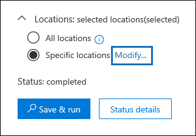
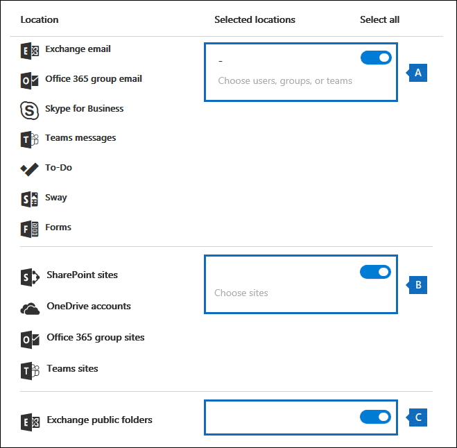

# <a name="manage-gdpr-data-subject-requests-with-the-dsr-case-tool-in-the-security--compliance-center"></a><span data-ttu-id="06ae4-105">使用安全&合规中心的 DSR 案例工具管理 GDPR 数据主题请求</span><span class="sxs-lookup"><span data-stu-id="06ae4-105">Manage GDPR data subject requests with the DSR case tool in the Security & Compliance Center</span></span>

<span data-ttu-id="06ae4-106">欧盟一般数据保护条例 （GDPR） 旨在保护和启用个人在欧盟 （EU） 内的隐私权。</span><span class="sxs-lookup"><span data-stu-id="06ae4-106">The EU General Data Protection Regulation (GDPR) is about protecting and enabling individuals' privacy rights inside the European Union (EU).</span></span> <span data-ttu-id="06ae4-107">GDPR 赋予欧盟个人（称为数据主体）访问、检索、更正、擦除和限制处理其个人数据的权利。</span><span class="sxs-lookup"><span data-stu-id="06ae4-107">The GDPR gives individuals in the European Union (known as data subjects) the right to access, retrieve, correct, erase, and restrict processing of their personal data.</span></span> <span data-ttu-id="06ae4-108">根据 GDPR，个人数据是指与已识别或可识别的自然人有关的任何信息。</span><span class="sxs-lookup"><span data-stu-id="06ae4-108">Under the GDPR, personal data means any information relating to an identified or identifiable natural person.</span></span> <span data-ttu-id="06ae4-109">人员向其组织发出正式请求，要求其对其个人数据执行操作，称为数据主体请求或 DSR。</span><span class="sxs-lookup"><span data-stu-id="06ae4-109">A formal request by a person to their organization to take an action on their personal data is called a Data Subject Request or DSR.</span></span> <span data-ttu-id="06ae4-110">有关响应 Office 365 中数据的 DSR 的详细信息，请参阅[Office 365 数据主题请求指南](https://go.microsoft.com/fwlink/?linkid=871169 )。</span><span class="sxs-lookup"><span data-stu-id="06ae4-110">For detailed information about responding to DSRs for data in Office 365, see [Office 365 Data Subject Request Guide](https://go.microsoft.com/fwlink/?linkid=871169 ).</span></span>
  
<span data-ttu-id="06ae4-111">要管理针对组织中的人员提交的 DSR 的调查，可以使用安全&合规中心中的 DSR 案例工具查找存储在以下位置的内容：</span><span class="sxs-lookup"><span data-stu-id="06ae4-111">To manage investigations in response to a DSR submitted by a person in your organization, you can use the DSR case tool in the Security & Compliance Center to find content stored in:</span></span>
  
- <span data-ttu-id="06ae4-112">组织中的任何用户邮箱。</span><span class="sxs-lookup"><span data-stu-id="06ae4-112">Any user mailbox in your organization.</span></span> <span data-ttu-id="06ae4-113">这包括 Skype 业务对话和 Microsoft 团队中的一对一聊天</span><span class="sxs-lookup"><span data-stu-id="06ae4-113">This includes Skype for Business conversations and one-to-one chats in Microsoft Teams</span></span>
    
- <span data-ttu-id="06ae4-114">与 Office 365 组关联的所有邮箱和 Microsoft 团队中的所有团队邮箱</span><span class="sxs-lookup"><span data-stu-id="06ae4-114">All mailboxes associated with an Office 365 Group and all team mailboxes in Microsoft Teams</span></span>
    
- <span data-ttu-id="06ae4-115">貴組織中所有的 Sharepoint 網站和商務用 OneDrive 帳戶</span><span class="sxs-lookup"><span data-stu-id="06ae4-115">All SharePoint Online sites and OneDrive for Business accounts in your organization</span></span>
    
- <span data-ttu-id="06ae4-116">组织中的所有团队网站和 Office 365 组网站</span><span class="sxs-lookup"><span data-stu-id="06ae4-116">All Teams sites and Office 365 Group sites in your organization</span></span>
    
- <span data-ttu-id="06ae4-117">Exchange Online 中的所有公用資料夾</span><span class="sxs-lookup"><span data-stu-id="06ae4-117">All public folders in Exchange Online</span></span>
    
<span data-ttu-id="06ae4-118">使用 DSR 案例工具，您可以：</span><span class="sxs-lookup"><span data-stu-id="06ae4-118">Using the DSR case tool you can:</span></span>
  
- <span data-ttu-id="06ae4-119">針對每一個 DSR 調查建立個別案例。</span><span class="sxs-lookup"><span data-stu-id="06ae4-119">Create a separate case for each DSR investigation.</span></span>
    
- <span data-ttu-id="06ae4-120">通过将人员添加为案例的成员，控制谁有权访问 DSR 案例;只有成员可以访问案例，并且只能在安全&合规中心**DSR 案例**页上的案例列表中查看其案例。</span><span class="sxs-lookup"><span data-stu-id="06ae4-120">Control who has access to the DSR case by adding people as members of the case; only members can access the case and can only see their cases in the list of cases on the **DSR cases** page in the Security & Compliance Center.</span></span> <span data-ttu-id="06ae4-121">此外，您还可以为同一案例的不同成员分配不同的权限。</span><span class="sxs-lookup"><span data-stu-id="06ae4-121">Also, you can assign different permissions to different members of the same case.</span></span> <span data-ttu-id="06ae4-122">例如，您可以允许某些成员仅查看案例和搜索结果，并允许其他成员创建搜索和导出搜索结果。</span><span class="sxs-lookup"><span data-stu-id="06ae4-122">For example, you can allow some members to only view the case and search results and allow other members to create searches and export search results.</span></span> 
    
- <span data-ttu-id="06ae4-123">使用内置搜索搜索由特定数据主体创建或上传的所有内容。</span><span class="sxs-lookup"><span data-stu-id="06ae4-123">Use the built-in search to search for all content created or uploaded by a specific data subject.</span></span>
    
- <span data-ttu-id="06ae4-124">可以选择修改内置搜索查询并重新运行搜索以缩小搜索结果范围。</span><span class="sxs-lookup"><span data-stu-id="06ae4-124">Optionally revise the built-in search query and rerun the search to narrow the search results.</span></span>
    
- <span data-ttu-id="06ae4-125">添加与 DSR 案例关联的其他内容搜索。</span><span class="sxs-lookup"><span data-stu-id="06ae4-125">Add other content searches associated with the DSR case.</span></span> <span data-ttu-id="06ae4-126">这包括创建从 Office 漫游服务返回部分索引项和系统生成的日志的搜索。</span><span class="sxs-lookup"><span data-stu-id="06ae4-126">This includes creating searches that return partially indexed items and system-generated logs from the Office Roaming Service.</span></span>
    
- <span data-ttu-id="06ae4-127">导出数据以响应 DSR 访问或导出请求。</span><span class="sxs-lookup"><span data-stu-id="06ae4-127">Export data in response to a DSR access or export request.</span></span>
    
- <span data-ttu-id="06ae4-128">DSR 调查过程完成后删除案例。</span><span class="sxs-lookup"><span data-stu-id="06ae4-128">Delete cases when the DSR investigation process is complete.</span></span> <span data-ttu-id="06ae4-129">这将删除与案例关联的所有搜索和导出作业。</span><span class="sxs-lookup"><span data-stu-id="06ae4-129">This removes all searches and export jobs associated with the case.</span></span>
    
<span data-ttu-id="06ae4-130">以下是使用 DSR 案例工具管理 DSR 调查的高级流程：</span><span class="sxs-lookup"><span data-stu-id="06ae4-130">Here's the high-level process for using the DSR case tool to manage DSR investigations:</span></span>
  
[<span data-ttu-id="06ae4-131">第 1 步：将电子数据展示权限分配给潜在案例成员</span><span class="sxs-lookup"><span data-stu-id="06ae4-131">Step 1: Assign eDiscovery permissions to potential case members</span></span>](#step-1-assign-ediscovery-permissions-to-potential-case-members)

[<span data-ttu-id="06ae4-132">步骤 2：创建 DSR 案例并添加成员</span><span class="sxs-lookup"><span data-stu-id="06ae4-132">Step 2: Create a DSR case and add members</span></span>](#step-2-create-a-dsr-case-and-add-members)

[<span data-ttu-id="06ae4-133">步骤 3：运行搜索查询</span><span class="sxs-lookup"><span data-stu-id="06ae4-133">Step 3: Run the search query</span></span>](#step-3-run-the-search-query)

[<span data-ttu-id="06ae4-134">第 4 步：导出数据</span><span class="sxs-lookup"><span data-stu-id="06ae4-134">Step 4: Export the data</span></span>](#step-4-export-the-data)

[<span data-ttu-id="06ae4-135">（可选）第 5 步：修改内置搜索查询</span><span class="sxs-lookup"><span data-stu-id="06ae4-135">(Optional) Step 5: Revise the built-in search query</span></span>](#optional-step-5-revise-the-built-in-search-query)

[<span data-ttu-id="06ae4-136">有关使用 DSR 案例工具的详细信息</span><span class="sxs-lookup"><span data-stu-id="06ae4-136">More information about using the DSR case tool</span></span>](#more-information-about-using-the-dsr-case-tool)
  
> [!IMPORTANT]
> <span data-ttu-id="06ae4-137">我们的工具可以帮助管理员执行 DSR 访问或导出请求，使他们能够利用 DSR 案例工具中找到的内置搜索和导出功能。</span><span class="sxs-lookup"><span data-stu-id="06ae4-137">Our tools can help admins perform DSR access or export requests by enabling them to utilize the built-in search and export functionality found in the DSR case tool.</span></span> <span data-ttu-id="06ae4-138">该工具有助于促进以最佳方法导出与数据主体提交的 DSR 请求相关的数据。</span><span class="sxs-lookup"><span data-stu-id="06ae4-138">The tool helps to facilitate a best-effort method to export data that's relevant to a DSR request submitted by a data subject.</span></span> <span data-ttu-id="06ae4-139">但是，请务必注意，搜索结果可能因数据主体或所执行的管理员操作而异，这些操作可能会影响项目是否被视为用于导出目的的"个人数据"。</span><span class="sxs-lookup"><span data-stu-id="06ae4-139">However, it's important to note that search results can vary based on the data subject or the admin actions taken that may impact whether or not an item would be deemed as "personal data" for export purposes.</span></span> <span data-ttu-id="06ae4-140">例如，如果数据主体是最后一个修改未创建的文件的人，则可能不会在搜索结果中返回该文件。</span><span class="sxs-lookup"><span data-stu-id="06ae4-140">For example, if the data subject was the last person to modify a file they didn't create, the file might not be returned in the search results.</span></span> <span data-ttu-id="06ae4-141">同样，管理员可以导出数据，而不包括部分索引的项目或 SharePoint 文档的所有版本。</span><span class="sxs-lookup"><span data-stu-id="06ae4-141">Similarly, an admin could export data without including partially indexed items or all versions of SharePoint documents.</span></span> <span data-ttu-id="06ae4-142">因此，所提供的工具有助于促进访问和导出数据请求;但是，结果受特定的管理员和数据主体使用方案的约束。</span><span class="sxs-lookup"><span data-stu-id="06ae4-142">Therefore, the tools provided can help facilitate accessing and exporting data requests; however, the results are subject to specific admin and data subject usage scenarios.</span></span> 
  
## <a name="step-1-assign-ediscovery-permissions-to-potential-case-members"></a><span data-ttu-id="06ae4-143">第 1 步：将电子数据展示权限分配给潜在案例成员</span><span class="sxs-lookup"><span data-stu-id="06ae4-143">Step 1: Assign eDiscovery permissions to potential case members</span></span>

<span data-ttu-id="06ae4-144">默认情况下，Office 365 全局管理员可以访问安全&合规性中心的 DSR 案例工具。</span><span class="sxs-lookup"><span data-stu-id="06ae4-144">By default, an Office 365 global administrator can access the DSR case tool in the Security & Compliance Center.</span></span> <span data-ttu-id="06ae4-145">根据设计，其他用户（如数据隐私官、人力资源经理或参与 DSR 调查的其他人员）无权访问 DSR 案例工具，并且必须分配适当的权限才能访问该工具。</span><span class="sxs-lookup"><span data-stu-id="06ae4-145">By design, other users such as a data privacy officer, a human resources manager, or other people involved in DSR investigations don't have access to the DSR case tool and will have to be assigned the appropriate permissions to access the tool.</span></span> <span data-ttu-id="06ae4-146">最简单的方法是转到安全&合规性中心**的权限页，** 并将用户添加到电子数据展示管理器角色组。</span><span class="sxs-lookup"><span data-stu-id="06ae4-146">The easiest way to do this is to go to the **Permissions** page in the Security & Compliance Center and add users to the eDiscovery Manager role group.</span></span> <span data-ttu-id="06ae4-147">您还必须分配这些权限，以便可以将它们添加为在步骤 2 中创建的 DSR 案例的成员。</span><span class="sxs-lookup"><span data-stu-id="06ae4-147">You also have to assign these permissions so you can add them as members of the DSR case that you create in Step 2.</span></span> 
  
<span data-ttu-id="06ae4-148">有关分步说明，请参阅在 Office [365 安全&合规性中心中分配电子数据展示权限。](assign-ediscovery-permissions.md)</span><span class="sxs-lookup"><span data-stu-id="06ae4-148">For step-by-step instructions, see [Assign eDiscovery permissions in the Office‍ 365 Security & Compliance Center](assign-ediscovery-permissions.md).</span></span>
  
> [!NOTE]
> <span data-ttu-id="06ae4-149">默认情况下，Office 365 全局管理员（或安全&合规性中心中的组织管理角色组的其他成员没有导出内容搜索结果的必要权限（请参阅本文中的步骤 4）。</span><span class="sxs-lookup"><span data-stu-id="06ae4-149">By default, an Office 365 global administrator (or other members of the Organization Management role group in the Security & Compliance Center don't have the necessary permissions to export Content Search results (see Step 4 in this article).</span></span> <span data-ttu-id="06ae4-150">要解决此问题，管理员可以将自身添加为电子数据展示管理器角色组的成员。</span><span class="sxs-lookup"><span data-stu-id="06ae4-150">To address this, an admin can add themselves as a member of the eDiscovery Manager role group.</span></span> 
  
## <a name="step-2-create-a-dsr-case-and-add-members"></a><span data-ttu-id="06ae4-151">步骤 2：创建 DSR 案例并添加成员</span><span class="sxs-lookup"><span data-stu-id="06ae4-151">Step 2: Create a DSR case and add members</span></span>

<span data-ttu-id="06ae4-152">下一步是创建 DSR 案例。</span><span class="sxs-lookup"><span data-stu-id="06ae4-152">The next step is to create a DSR case.</span></span> <span data-ttu-id="06ae4-153">创建案例时，可以选择启动内置搜索，也可以在不启动搜索的情况下创建案例。</span><span class="sxs-lookup"><span data-stu-id="06ae4-153">When you create a case, you can choose to start the built-in search or you can create the case without starting the search.</span></span> <span data-ttu-id="06ae4-154">以下过程指示您在不启动搜索的情况下创建案例，然后演示如何向案例添加成员。</span><span class="sxs-lookup"><span data-stu-id="06ae4-154">The following procedure instructs you to create the case without starting the search and then show you how to add members to the case.</span></span>
  
1. <span data-ttu-id="06ae4-155">使用工作[https://protection.office.com](https://protection.office.com)或学校帐户转到 Office 365 并登录。</span><span class="sxs-lookup"><span data-stu-id="06ae4-155">Go to [https://protection.office.com](https://protection.office.com) and sign in to Office 365 using your work or school account.</span></span> 
    
2. <span data-ttu-id="06ae4-156">在安全&合规中心，单击**数据隐私**\>**数据主题请求，****新建 DSR 案例"。**</span><span class="sxs-lookup"><span data-stu-id="06ae4-156">In the Security & Compliance Center, click **Data privacy** \> **Data subject requests**, and then click  **New DSR case**.</span></span>
    
3. <span data-ttu-id="06ae4-157">在"**新建 DSR 案例**弹出窗口"页上，为案例指定名称，键入可选说明，然后单击"**下一步"。**</span><span class="sxs-lookup"><span data-stu-id="06ae4-157">On the **New DSR case** flyout page, give the case a name, type an optional description, and then click **Next**.</span></span> <span data-ttu-id="06ae4-158">案例的名称在您的组织中必须是唯一的。</span><span class="sxs-lookup"><span data-stu-id="06ae4-158">The name of the case must be unique in your organization.</span></span>
    
    > [!TIP]
    > <span data-ttu-id="06ae4-159">请考虑添加新案例的名称和/或说明中提交 DSR 请求的人员的姓名。</span><span class="sxs-lookup"><span data-stu-id="06ae4-159">Consider adding the name of the person who submitted the DSR request that you're investigating in the name and/or description of the new case.</span></span> <span data-ttu-id="06ae4-160">请注意，只有此案例的成员（以及电子数据展示管理员）才能**在"数据主题请求"** 页上的案例列表中看到案例。</span><span class="sxs-lookup"><span data-stu-id="06ae4-160">Note that only members of this case (and eDiscovery Administrators) will be able to see the case in the list of cases on the **Data subject requests** page.</span></span> 
  
4. <span data-ttu-id="06ae4-161">在"**请求详细信息"** 页上，**在"数据主题"（提交此请求的人员）** 下，选择要查找的人员并导出数据，然后单击"**下一步"。**</span><span class="sxs-lookup"><span data-stu-id="06ae4-161">On the **Request details** page, under **Data subject (the person who filed this request)**, select the person that you want to find and export data for and then click **Next**.</span></span>
    
5. <span data-ttu-id="06ae4-162">在"**确认案例设置"** 页上，您可以更改案例名称和说明，并选择其他数据主题。</span><span class="sxs-lookup"><span data-stu-id="06ae4-162">On the **Confirm your case settings** page, you can change the case name and description, and select a different data subject.</span></span> <span data-ttu-id="06ae4-163">否则，**单击"保存"。**</span><span class="sxs-lookup"><span data-stu-id="06ae4-163">Otherwise, click **Save**.</span></span>
    
    <span data-ttu-id="06ae4-164">将显示一个页面，确认已创建新的 DSR 案例。</span><span class="sxs-lookup"><span data-stu-id="06ae4-164">A page is displayed that confirms the new DSR case has been created.</span></span>
    
    
  
    <span data-ttu-id="06ae4-166">此时，您可以执行两项操作之一：</span><span class="sxs-lookup"><span data-stu-id="06ae4-166">At this point, you can do one of two things:</span></span>
    
    <span data-ttu-id="06ae4-167">a.</span><span class="sxs-lookup"><span data-stu-id="06ae4-167">a.</span></span> <span data-ttu-id="06ae4-168">**单击"显示搜索结果"** 将启动搜索。</span><span class="sxs-lookup"><span data-stu-id="06ae4-168">Clicking **Show me search results** starts the search.</span></span> <span data-ttu-id="06ae4-169">这是默认选择。</span><span class="sxs-lookup"><span data-stu-id="06ae4-169">This is the default selection.</span></span> <span data-ttu-id="06ae4-170">在步骤 3 中讨论在选择此选项时运行的内置搜索以及返回的结果。</span><span class="sxs-lookup"><span data-stu-id="06ae4-170">The built-in search that's run when you select this option and the results that are returned are discussed in Step 3.</span></span>
    
    <span data-ttu-id="06ae4-171">b.</span><span class="sxs-lookup"><span data-stu-id="06ae4-171">b.</span></span> <span data-ttu-id="06ae4-172">**单击"完成"** 将关闭新的 DSR 案例，而无需启动内置搜索。</span><span class="sxs-lookup"><span data-stu-id="06ae4-172">Clicking **Finish** closes the new DSR case without starting the built-in search.</span></span> <span data-ttu-id="06ae4-173">选择此选项时，新的 DSR 案例**将显示在"数据主题请求"** 页上。</span><span class="sxs-lookup"><span data-stu-id="06ae4-173">When you select this option, the new DSR case is displayed on the **Data subject requests** page.</span></span>
    
6. <span data-ttu-id="06ae4-174">单击"**完成"，** 以便可以转到新的 DSR 案例并向其添加成员。</span><span class="sxs-lookup"><span data-stu-id="06ae4-174">Click **Finish** so that you can go in to the new DSR case and add members to it.</span></span> 
    
7. <span data-ttu-id="06ae4-175">在"**数据主题请求"** 页上，单击您创建的 DSR 案例的名称。</span><span class="sxs-lookup"><span data-stu-id="06ae4-175">On the **Data subject requests** page, click the name of the DSR case that you created.</span></span> 
    
8. <span data-ttu-id="06ae4-176">在"**管理此案例**弹出窗口"页上，**在"管理成员"** 下**单击"添加"。**</span><span class="sxs-lookup"><span data-stu-id="06ae4-176">On the **Manage this case** flyout page, under **Manage members**, click **Add**.</span></span> 
    
    <span data-ttu-id="06ae4-177">**在"用户"** 下，将显示分配了相应电子数据展示权限的人员列表。</span><span class="sxs-lookup"><span data-stu-id="06ae4-177">Under **Users**, a list of people that are assigned the appropriate eDiscovery permissions is displayed.</span></span> <span data-ttu-id="06ae4-178">您向步骤 1 中分配了电子数据展示权限的人员将显示在此列表中。</span><span class="sxs-lookup"><span data-stu-id="06ae4-178">The people you assigned eDiscovery permissions to in Step 1 will be displayed in this list.</span></span> 
    
9. <span data-ttu-id="06ae4-179">选择要添加为 DSR 案例成员的人，**单击"添加"，** 然后保存更改。</span><span class="sxs-lookup"><span data-stu-id="06ae4-179">Select the people to add as members of the DSR case, click **Add**, and then save your changes.</span></span>
    
    <span data-ttu-id="06ae4-180">还可以通过单击"**管理角色组"\*\*\*\*下的"添加"** 将角色组添加为 DSR 案例的成员。</span><span class="sxs-lookup"><span data-stu-id="06ae4-180">You can also add role groups as members of DSR case by clicking **Add** under **Manage role groups**.</span></span> 
    
## <a name="step-3-run-the-search-query"></a><span data-ttu-id="06ae4-181">步骤 3：运行搜索查询</span><span class="sxs-lookup"><span data-stu-id="06ae4-181">Step 3: Run the search query</span></span>

<span data-ttu-id="06ae4-182">创建 DSR 案例并添加成员后，下一步是运行与案例关联的内置搜索。</span><span class="sxs-lookup"><span data-stu-id="06ae4-182">After you create a DSR case and add members, the next step is to run the built-in search that's associated with the case.</span></span> <span data-ttu-id="06ae4-183">此默认搜索查询执行以下操作：</span><span class="sxs-lookup"><span data-stu-id="06ae4-183">This default search query does the following things:</span></span>
  
- <span data-ttu-id="06ae4-184">搜索组织中的所有邮箱，以寻找数据主体发送或接收的所有电子邮件项目。</span><span class="sxs-lookup"><span data-stu-id="06ae4-184">Searches all mailboxes in your organization for all email items that were sent or received by the data subject.</span></span> <span data-ttu-id="06ae4-185">这是*通过使用"参与者"* 电子邮件属性实现的，该属性在电子邮件中搜索所有人员字段中的数据主题。</span><span class="sxs-lookup"><span data-stu-id="06ae4-185">This is accomplished by using the  *Participants*  email property, which searches for the data subject in all the people fields in an email message.</span></span> <span data-ttu-id="06ae4-186">此属性返回数据主体位于"**来自、\*\*\*\*到、CC"\*\*\*\*\*\*\*\*和"密件抄**送"字段中的项。</span><span class="sxs-lookup"><span data-stu-id="06ae4-186">This property returns items in which the data subject is in the **From**, **To**, **CC**, and **BCC** fields.</span></span> <span data-ttu-id="06ae4-187">交换联机中的公用文件夹也会搜索数据主体发送或接收的邮件。</span><span class="sxs-lookup"><span data-stu-id="06ae4-187">Public folders in Exchange Online are also searched for messages sent or received by the data subject.</span></span> 
    
- <span data-ttu-id="06ae4-188">搜索组织中的所有网站，以搜索数据主体创建或上载的文档和项目。</span><span class="sxs-lookup"><span data-stu-id="06ae4-188">Searches all sites in your organization for documents and items created or uploaded by the data subject.</span></span> <span data-ttu-id="06ae4-189">这是通过使用以下站点属性实现的：</span><span class="sxs-lookup"><span data-stu-id="06ae4-189">This is accomplished by using the following site properties:</span></span>
    
  - <span data-ttu-id="06ae4-190">*"作者"* 属性返回在 Office 文档中的作者字段中列出数据主题的项目。</span><span class="sxs-lookup"><span data-stu-id="06ae4-190">The  *Author*  property returns items where the data subject is listed in the author field in Office documents.</span></span> <span data-ttu-id="06ae4-191">即使文档由其他人复制和上载，此值也会保留。</span><span class="sxs-lookup"><span data-stu-id="06ae4-191">This value persists, even if the document is copied and uploaded by someone else.</span></span> 
    
  - <span data-ttu-id="06ae4-192">*"CreatedBy"* 属性返回由数据主体创建或上载的项。</span><span class="sxs-lookup"><span data-stu-id="06ae4-192">The  *CreatedBy*  property returns items that were created or uploaded by the data subject.</span></span> 
    
<span data-ttu-id="06ae4-193">以下是在创建 DSR 案例时自动创建的内置搜索的关键字查询的外观。</span><span class="sxs-lookup"><span data-stu-id="06ae4-193">Here's what the keyword query looks like for the built-in search that gets automatically created when you create a DSR case.</span></span>
  
```
participants:"<email address>" OR author:"<display name>" OR createdby:"<display name>"
```

<span data-ttu-id="06ae4-194">例如，如果数据主体的名称为 Ina Leonte，则关键字查询如下所示：</span><span class="sxs-lookup"><span data-stu-id="06ae4-194">For example, if the name of the data subject is Ina Leonte, the keyword query would look like this:</span></span>
  
```
participants:"ina@contoso.com" OR author:"Ina Leonte" OR createdby:"Ina Leonte"
```

 <span data-ttu-id="06ae4-195">**要运行 DSR 案例的内置搜索：**</span><span class="sxs-lookup"><span data-stu-id="06ae4-195">**To run the built-in search for a DSR case:**</span></span>
  
1. <span data-ttu-id="06ae4-196">在安全&合规性中心中，**单击"数据隐私**\>**数据主题请求"，** 然后单击在步骤 2 中创建的 DSR 案例**旁边的"打开"。**</span><span class="sxs-lookup"><span data-stu-id="06ae4-196">In the Security & Compliance Center, click **Data privacy** \> **Data subject requests**, and then click **Open** next to the DSR case that you created in Step 2.</span></span> 
    
    <span data-ttu-id="06ae4-197">单击页面顶部**的"搜索"** 选项卡，然后单击创建 DSR 案例时创建的内置搜索旁边的复选框。</span><span class="sxs-lookup"><span data-stu-id="06ae4-197">Click the **Search** tab at the top of the page, and then click the checkbox next to the built-in search that was created when you created the DSR case.</span></span> <span data-ttu-id="06ae4-198">搜索的名称与 DSR 大小写相同。</span><span class="sxs-lookup"><span data-stu-id="06ae4-198">The search has the same name as the DSR case.</span></span> 
    
2. <span data-ttu-id="06ae4-199">在搜索弹出窗口中，**单击"打开查询"。**</span><span class="sxs-lookup"><span data-stu-id="06ae4-199">In the search flyout page, click **Open query**.</span></span>
    
    <span data-ttu-id="06ae4-200">打开查询时，搜索将启动，并将很快完成。</span><span class="sxs-lookup"><span data-stu-id="06ae4-200">When you open the query, the search is started and will complete in a few moments.</span></span> 
    
3. <span data-ttu-id="06ae4-201">搜索完成后，**单击"预览结果"** 以预览搜索结果。</span><span class="sxs-lookup"><span data-stu-id="06ae4-201">When the search is complete, click **Preview results** to preview the search results.</span></span> <span data-ttu-id="06ae4-202">有关详细信息，请参阅[预览搜索结果。](content-search.md#preview-search-results)</span><span class="sxs-lookup"><span data-stu-id="06ae4-202">For more information, see [Preview search results](content-search.md#preview-search-results).</span></span>
    
    > [!TIP]
    > <span data-ttu-id="06ae4-203">您还可以查看搜索查询统计信息，以查看搜索返回的邮箱和网站项目数，以及包含与搜索查询匹配的项目的顶级内容位置。</span><span class="sxs-lookup"><span data-stu-id="06ae4-203">You can also view the search query statistics to see the number of mailbox and site items that are returned by the search, and the top content locations that contain items that match the search query.</span></span> <span data-ttu-id="06ae4-204">有关详细信息，请参阅[查看有关搜索 的信息和统计信息。](content-search.md#view-information-and-statistics-about-a-search)</span><span class="sxs-lookup"><span data-stu-id="06ae4-204">For more information, see [View information and statistics about a search](content-search.md#view-information-and-statistics-about-a-search).</span></span> 
  
<span data-ttu-id="06ae4-205">您可以编辑内置搜索查询，更改搜索的内容位置，然后重新运行搜索。</span><span class="sxs-lookup"><span data-stu-id="06ae4-205">You can edit the built-in search query, change the content locations that are searched, and then rerun the search.</span></span> <span data-ttu-id="06ae4-206">有关详细信息，请参阅[步骤 5。](#optional-step-5-revise-the-built-in-search-query)</span><span class="sxs-lookup"><span data-stu-id="06ae4-206">See [Step 5](#optional-step-5-revise-the-built-in-search-query) for more information.</span></span> 
  
## <a name="step-4-export-the-data"></a><span data-ttu-id="06ae4-207">第 4 步：导出数据</span><span class="sxs-lookup"><span data-stu-id="06ae4-207">Step 4: Export the data</span></span>

<span data-ttu-id="06ae4-208">运行内置搜索后，可以导出搜索结果。</span><span class="sxs-lookup"><span data-stu-id="06ae4-208">After you run the built-in search, you can export the search results.</span></span> <span data-ttu-id="06ae4-209">或者，在导出数据之前，您可能需要修改查询以减少搜索结果数。</span><span class="sxs-lookup"><span data-stu-id="06ae4-209">Alternatively, before you export the data, you may want to revise the query to reduce the number of search results.</span></span> <span data-ttu-id="06ae4-210">有关缩小搜索结果的详细信息，请参阅步骤 5。</span><span class="sxs-lookup"><span data-stu-id="06ae4-210">See Step 5 for more information about narrowing the search results.</span></span>
  
<span data-ttu-id="06ae4-211">导出搜索结果时，邮箱项目可以下载在 PST 文件中或作为单个邮件。</span><span class="sxs-lookup"><span data-stu-id="06ae4-211">When you export search results, mailbox items can be downloaded in PST files or as individual messages.</span></span> <span data-ttu-id="06ae4-212">从 SharePoint 和 OneDrive 帐户导出内容时，将导出本机 Office 文档和其他文档的副本。</span><span class="sxs-lookup"><span data-stu-id="06ae4-212">When you export content from SharePoint and OneDrive accounts, copies of native Office documents and other documents are exported.</span></span> <span data-ttu-id="06ae4-213">搜索结果中包含包含有关每个导出项的信息的结果文件。</span><span class="sxs-lookup"><span data-stu-id="06ae4-213">A results file that contains information about every exported item is included with the search results.</span></span> <span data-ttu-id="06ae4-214">有关导出的详细信息，请参阅[导出内容搜索结果](export-search-results.md)。</span><span class="sxs-lookup"><span data-stu-id="06ae4-214">For more detailed information about exporting, see [Export Content Search results](export-search-results.md).</span></span>
  
> [!NOTE]
> <span data-ttu-id="06ae4-215">默认情况下，Office 365 全局管理员（或安全&合规性中心中的组织管理角色组的其他成员）没有导出内容搜索结果的必要权限。</span><span class="sxs-lookup"><span data-stu-id="06ae4-215">By default, an Office 365 global administrator (or other members of the Organization Management role group in the Security & Compliance Center) don't have the necessary permissions to export Content Search results.</span></span> <span data-ttu-id="06ae4-216">要解决此问题，管理员可以将自身添加为电子数据展示管理器角色组的成员。</span><span class="sxs-lookup"><span data-stu-id="06ae4-216">To address this, an admin can add themselves as a member of the eDiscovery Manager role group.</span></span> 
  
<span data-ttu-id="06ae4-217">用于导出数据的计算机必须满足以下系统要求：</span><span class="sxs-lookup"><span data-stu-id="06ae4-217">The computer you use to export data has to meet the following system requirements:</span></span>
  
- <span data-ttu-id="06ae4-218">32 位或 64 位版本的 Windows 7 和更高版本</span><span class="sxs-lookup"><span data-stu-id="06ae4-218">32-bit or 64-bit versions of Windows 7 and later versions</span></span>
    
- <span data-ttu-id="06ae4-219">微软 .NET 框架 4.7</span><span class="sxs-lookup"><span data-stu-id="06ae4-219">Microsoft .NET Framework 4.7</span></span>
    
- <span data-ttu-id="06ae4-220">支援的瀏覽器：</span><span class="sxs-lookup"><span data-stu-id="06ae4-220">A supported browser:</span></span>
    
  - <span data-ttu-id="06ae4-221">Microsoft Edge</span><span class="sxs-lookup"><span data-stu-id="06ae4-221">Microsoft Edge</span></span>
    
    <span data-ttu-id="06ae4-222">或</span><span class="sxs-lookup"><span data-stu-id="06ae4-222">Or</span></span>
    
  - <span data-ttu-id="06ae4-223">微软互联网浏览器10及更高版本</span><span class="sxs-lookup"><span data-stu-id="06ae4-223">Microsoft Internet Explorer 10 and later versions</span></span>
    
    > [!NOTE]
    > <span data-ttu-id="06ae4-224">Microsoft 不会为 ClickOnce 应用程序制造第三方扩展程序或加载项。</span><span class="sxs-lookup"><span data-stu-id="06ae4-224">Microsoft doesn't manufacture third-party extensions or add-ons for ClickOnce applications.</span></span> <span data-ttu-id="06ae4-225">不支持使用不支持的浏览器导出带有第三方扩展或加载项的数据。</span><span class="sxs-lookup"><span data-stu-id="06ae4-225">Exporting data using an unsupported browser with third-party extensions or add-ons isn't supported.</span></span> 
  
 <span data-ttu-id="06ae4-226">**要从 DSR 案例中的内置搜索导出数据，应：**</span><span class="sxs-lookup"><span data-stu-id="06ae4-226">**To export data from the built-in search in a DSR case:**</span></span>
  
1. <span data-ttu-id="06ae4-227">在"安全&合规性中心"中，**单击"数据隐私**\>**数据主题请求"，** 然后单击要导出数据的 DSR 案例**旁边的"打开"。**</span><span class="sxs-lookup"><span data-stu-id="06ae4-227">In the Security & Compliance Center, click **Data privacy** \> **Data subject requests**, and then click **Open** next to the DSR case that you want to export data from.</span></span> 
    
2. <span data-ttu-id="06ae4-228">单击页面顶部**的"搜索"** 选项卡，然后单击创建 DSR 案例时创建的内置搜索旁边的复选框。</span><span class="sxs-lookup"><span data-stu-id="06ae4-228">Click the **Search** tab at the top of the page, and then click the checkbox next to the built-in search that was created when you created the DSR case.</span></span> <span data-ttu-id="06ae4-229">或者单击另一个搜索以导出该搜索中的数据。</span><span class="sxs-lookup"><span data-stu-id="06ae4-229">Or click another search to export data from that search.</span></span> 
    
3. <span data-ttu-id="06ae4-230">在搜索弹出窗口页上，**搜索结果"图标"更多"，** 然后从下拉列表中**选择"导出结果"。**</span><span class="sxs-lookup"><span data-stu-id="06ae4-230">On the search flyout page, click  **More**, and then select **Export results** from the drop-down list.</span></span> 
    
4. <span data-ttu-id="06ae4-231">在"**导出结果"** 页上，为 DSR 导出请求选择以下建议选项。</span><span class="sxs-lookup"><span data-stu-id="06ae4-231">On the **Export results** page, select the following recommended options for DSR export requests.</span></span> 
    
    
  
    <span data-ttu-id="06ae4-233">a.</span><span class="sxs-lookup"><span data-stu-id="06ae4-233">a.</span></span> <span data-ttu-id="06ae4-234">**在"输出选项"** 下，选择第**一个选项（所有项（不包括具有无法识别格式、已加密或由于其他原因未编制索引**的项目）以仅导出索引项。</span><span class="sxs-lookup"><span data-stu-id="06ae4-234">Under **Output options**, select the first option (**All items, excluding ones that have ones that have an unrecognized format, are encrypted, or weren't indexed for other reasons**) to export indexed items only.</span></span> <span data-ttu-id="06ae4-235">您不希望从内置搜索中导出部分索引项的原因是，来自其他用户的部分索引项也将导出。</span><span class="sxs-lookup"><span data-stu-id="06ae4-235">The reason you don't want to export partially indexed items from the built-in search is because partially indexed items from other users will also be exported.</span></span> <span data-ttu-id="06ae4-236">要仅导出数据主题的部分索引项，我们建议您创建单独的搜索。</span><span class="sxs-lookup"><span data-stu-id="06ae4-236">To export only the partially indexed items for the data subject, we recommend that you create a separate search.</span></span> <span data-ttu-id="06ae4-237">有关详细信息，请参阅在"有关使用 DSR 案例工具的详细信息"部分中[导出部分索引的项目。](#exporting-partially-indexed-items)</span><span class="sxs-lookup"><span data-stu-id="06ae4-237">For more information, see [Exporting partially indexed items](#exporting-partially-indexed-items) in the "More information about using the DSR case tool" section.</span></span>
    
    <span data-ttu-id="06ae4-238">b.</span><span class="sxs-lookup"><span data-stu-id="06ae4-238">b.</span></span> <span data-ttu-id="06ae4-239">在"**导出交换内容为"** 下，选择第三个选项，**一个 PST 文件，其中包含单个文件夹中的所有邮件。**</span><span class="sxs-lookup"><span data-stu-id="06ae4-239">Under **Export Exchange content as**, select the third option, **One PST file containing all messages in a single folder**.</span></span> <span data-ttu-id="06ae4-240">由于某些结果可能针对源自其他用户邮箱的项目，因此此选项仅将项目列在单个文件夹中而不指示实际邮箱，并且是下一个项目中建议重复复制结果时使用的最佳选项.</span><span class="sxs-lookup"><span data-stu-id="06ae4-240">Because some of the results may be for items that originated in another user's mailbox, this option just lists the item in a single folder without indicating the actual mailbox and is the best option to use when you de-duplicate the results as recommended in the next item.</span></span> <span data-ttu-id="06ae4-241">此选项还允许数据主体按时间顺序审阅项目（项目按发送日期排序），而无需为每个项目导航原始邮箱文件夹结构。</span><span class="sxs-lookup"><span data-stu-id="06ae4-241">This option also lets the data subject review items in chronological order (items are sorted by sent date) without having to navigate the original mailbox folder structure for each item.</span></span>
    
    <span data-ttu-id="06ae4-242">c.</span><span class="sxs-lookup"><span data-stu-id="06ae4-242">c.</span></span> <span data-ttu-id="06ae4-243">选择**启用重复数据消除**选项以排除重复邮件。</span><span class="sxs-lookup"><span data-stu-id="06ae4-243">Select **Enable de-duplication** option to excludes duplicate email messages.</span></span> <span data-ttu-id="06ae4-244">我们建议使用此选项，因为内置搜索会搜索组织中的所有邮箱。</span><span class="sxs-lookup"><span data-stu-id="06ae4-244">We recommend this option because the built-in search searches all mailboxes in your organization.</span></span> <span data-ttu-id="06ae4-245">因此，如果在搜索的邮箱中找到同一邮件的多个副本，则此选项意味着将仅导出邮件的一个副本。</span><span class="sxs-lookup"><span data-stu-id="06ae4-245">So if multiple copies of the same message are found in the mailboxes that were searched, this option means that only one copy of a message will be exported.</span></span> <span data-ttu-id="06ae4-246">此选项将一起导出单个文件夹中一个 PST 文件中的邮件，从而为 DSR 导出请求带来最佳的用户体验。</span><span class="sxs-lookup"><span data-stu-id="06ae4-246">This option, together will exporting messages in one PST file in a single folder, results in the best user experience for DSR export requests.</span></span> <span data-ttu-id="06ae4-247">结果.csv 导出报告列出了找到重复消息的所有位置。</span><span class="sxs-lookup"><span data-stu-id="06ae4-247">The Results.csv export report lists all locations where duplicate messages were found.</span></span>
    
    <span data-ttu-id="06ae4-248">或者，**您可以选择"包括 SharePoint 文档版本"** 选项以导出所有版本的 SharePoint 和 OneDrive 文档。</span><span class="sxs-lookup"><span data-stu-id="06ae4-248">Optionally, you can select **Include versions for SharePoint documents** option to export all versions of SharePoint and OneDrive documents.</span></span> <span data-ttu-id="06ae4-249">这要求为文档库打开版本控制。</span><span class="sxs-lookup"><span data-stu-id="06ae4-249">This requires that versioning is turned on for document libraries.</span></span> <span data-ttu-id="06ae4-250">此选项有助于确保导出所有相关数据。</span><span class="sxs-lookup"><span data-stu-id="06ae4-250">This option helps to ensure that all relevant data is exported.</span></span>
    
5. <span data-ttu-id="06ae4-251">选择导出设置后，单击"**导出"。**</span><span class="sxs-lookup"><span data-stu-id="06ae4-251">After you choose the export settings, click **Export**.</span></span>
    
    <span data-ttu-id="06ae4-252">搜索结果已准备好用于下载，这意味着它们将上载到 Microsoft 云中组织的 Azure 存储区域。</span><span class="sxs-lookup"><span data-stu-id="06ae4-252">The search results are prepared for downloading, which means they're uploaded to the Azure Storage area for your organization in the Microsoft cloud.</span></span> <span data-ttu-id="06ae4-253">后续步骤将演示如何将此数据下载到本地计算机。</span><span class="sxs-lookup"><span data-stu-id="06ae4-253">The next steps show you how to download this data to your local computer.</span></span>
    
6. <span data-ttu-id="06ae4-254">单击"**导出"** 选项卡以显示您创建的导出作业。</span><span class="sxs-lookup"><span data-stu-id="06ae4-254">Click the **Export** tab to display the export job you created.</span></span> <span data-ttu-id="06ae4-255">导出作业的名称与相应的搜索同名，**将 #Export**追加到搜索名称的末尾。</span><span class="sxs-lookup"><span data-stu-id="06ae4-255">Export jobs have the same name as the corresponding search with **_Export** appended to the end of search name.</span></span> 
    
7. <span data-ttu-id="06ae4-256">单击刚刚创建的导出作业以显示导出弹出窗口页。</span><span class="sxs-lookup"><span data-stu-id="06ae4-256">Click the export job that you just created to display the export flyout page.</span></span> <span data-ttu-id="06ae4-257">此页显示有关搜索的信息，例如要导出的项目的大小和总数，以及已传输到 Azure 存储区域的项目的百分比。</span><span class="sxs-lookup"><span data-stu-id="06ae4-257">This page shows information about the search, such as the size and total number of items to be exported, and the percentage of the items that have been transferred to an Azure storage area.</span></span> <span data-ttu-id="06ae4-258">**单击"刷新"** 以更新上载状态信息。</span><span class="sxs-lookup"><span data-stu-id="06ae4-258">Click **Refresh** to update the upload status information.</span></span> 
    
8. <span data-ttu-id="06ae4-259">**在"导出键"** 下，**单击"复制到剪贴板"。**</span><span class="sxs-lookup"><span data-stu-id="06ae4-259">Under **Export key**, click **Copy to clipboard**.</span></span> <span data-ttu-id="06ae4-260">在步骤 11 中使用此密钥下载搜索结果。</span><span class="sxs-lookup"><span data-stu-id="06ae4-260">You use this key in step 11 to download the search results.</span></span>
    
9. <span data-ttu-id="06ae4-261">单击导出弹出窗口"页面顶部**的"下载结果"。**</span><span class="sxs-lookup"><span data-stu-id="06ae4-261">Click  **Download results** at the top of the export flyout page.</span></span> 
    
10. <span data-ttu-id="06ae4-262">在页面底部的弹出窗口中，**单击"打开"** 以打开 Microsoft Office **365 电子数据展示导出工具**。</span><span class="sxs-lookup"><span data-stu-id="06ae4-262">In the pop-up window at the bottom of the page, click **Open** to open the **Microsoft Office 365 eDiscovery Export Tool**.</span></span> <span data-ttu-id="06ae4-263">首次下载搜索结果时将安装**电子数据展示导出工具。**</span><span class="sxs-lookup"><span data-stu-id="06ae4-263">The **eDiscovery Export Tool** will be installed the first time you download search results.</span></span> 
    
11. <span data-ttu-id="06ae4-264">在**电子数据展示导出工具**中，将步骤 8 中复制的导出密钥粘贴到相应的框中。</span><span class="sxs-lookup"><span data-stu-id="06ae4-264">In the **eDiscovery Export Tool**, paste the export key that you copied in step 8 in the appropriate box.</span></span>
    
12. <span data-ttu-id="06ae4-265">按一下 [瀏覽]\*\*\*\* 以指定搜尋結果檔案要下載到的位置。</span><span class="sxs-lookup"><span data-stu-id="06ae4-265">Click **Browse** to specify the location where you want to download the search result files.</span></span> 
    
    > [!NOTE]
    > <span data-ttu-id="06ae4-266">由于磁盘活动量大（读取和写入），您应该将搜索结果下载到本地磁盘驱动器;因此，应将搜索结果下载到本地磁盘驱动器。不要将它们下载到映射的网络驱动器或其他网络位置。</span><span class="sxs-lookup"><span data-stu-id="06ae4-266">Due to the high amount of disk activity (reads and writes), you should download search results to a local disk drive; don't download them to a mapped network drive or other network location.</span></span> 
  
13. <span data-ttu-id="06ae4-267">按一下 [開始]\*\*\*\* 將搜尋結果下載至您的電腦。</span><span class="sxs-lookup"><span data-stu-id="06ae4-267">Click **Start** to download the search results to your computer.</span></span> 
    
    <span data-ttu-id="06ae4-268">**电子数据展示导出工具**显示有关导出过程的状态信息，包括要下载的剩余项目的数量（和大小）的估计值。</span><span class="sxs-lookup"><span data-stu-id="06ae4-268">The **eDiscovery Export Tool** displays status information about the export process, including an estimate of the number (and size) of the remaining items to be downloaded.</span></span> <span data-ttu-id="06ae4-269">导出过程完成后，可以访问这些文件下载位置中的文件。</span><span class="sxs-lookup"><span data-stu-id="06ae4-269">When the export process is complete, you can access the files in the location where they were downloaded.</span></span> <span data-ttu-id="06ae4-270">有关下载内容搜索结果时包含的报告的详细信息，请参阅"导出内容搜索结果"中[的详细信息](export-search-results.md#more-information)部分。</span><span class="sxs-lookup"><span data-stu-id="06ae4-270">For more information about the reports that included when you download Content Search results, see the [More information](export-search-results.md#more-information) section in "Export Content Search results".</span></span> 
    
<span data-ttu-id="06ae4-271">导出数据后，搜索结果和导出报告位于与 DSR 案例同名的文件夹中。</span><span class="sxs-lookup"><span data-stu-id="06ae4-271">After the data is exported, the search results and export reports are located in a folder that has the same name as the DSR case.</span></span> <span data-ttu-id="06ae4-272">包含邮箱项目的 PST 文件位于名为**Exchange**的子文件夹中。</span><span class="sxs-lookup"><span data-stu-id="06ae4-272">The PST files that contain mailbox items are located in a subfolder named **Exchange**.</span></span> <span data-ttu-id="06ae4-273">来自站点的文档和其他项目位于名为**SharePoint**的子文件夹中。</span><span class="sxs-lookup"><span data-stu-id="06ae4-273">Documents and other items from sites are located in a subfolder named **SharePoint**.</span></span> 
  
## <a name="optional-step-5-revise-the-built-in-search-query"></a><span data-ttu-id="06ae4-274">（可选）第 5 步：修改内置搜索查询</span><span class="sxs-lookup"><span data-stu-id="06ae4-274">(Optional) Step 5: Revise the built-in search query</span></span>

<span data-ttu-id="06ae4-275">运行内置搜索后，可以对其进行修改以缩小范围以返回更少的搜索结果。</span><span class="sxs-lookup"><span data-stu-id="06ae4-275">After you run the built-in search, you can revise it to narrow the scope to return fewer search results.</span></span> <span data-ttu-id="06ae4-276">可以通过向查询添加条件来执行此操作。</span><span class="sxs-lookup"><span data-stu-id="06ae4-276">You can do this by adding conditions to the query.</span></span> <span data-ttu-id="06ae4-277">条件在逻辑上连接到**AND**运算符的关键字查询。</span><span class="sxs-lookup"><span data-stu-id="06ae4-277">A condition is logically connected to the keyword query by the **AND** operator.</span></span> <span data-ttu-id="06ae4-278">这意味着要在搜索结果中返回，项目必须满足关键字查询和您添加的任何条件。</span><span class="sxs-lookup"><span data-stu-id="06ae4-278">That means to be returned in the search results, items must satisfy both the keyword query and any conditions you add.</span></span> <span data-ttu-id="06ae4-279">这就是条件有助于缩小结果范围的方式。</span><span class="sxs-lookup"><span data-stu-id="06ae4-279">This is how conditions help to narrow the results.</span></span> <span data-ttu-id="06ae4-280">如果向搜索查询添加两个或多个唯一条件（指定不同属性的条件），则这些条件由**AND**运算符在逻辑上连接。</span><span class="sxs-lookup"><span data-stu-id="06ae4-280">If you add two or more unique conditions to a search query (conditions that specify different properties), those conditions are logically connected by the **AND** operator.</span></span> <span data-ttu-id="06ae4-281">这意味着仅返回满足所有条件的项目（除了关键字查询）。</span><span class="sxs-lookup"><span data-stu-id="06ae4-281">That means only items that satisfy all the conditions (in addition to the keyword query) are returned.</span></span> <span data-ttu-id="06ae4-282">如果将多个值（用逗号或分号分隔）添加到单个条件，则 OR**运算符将**连接这些值。</span><span class="sxs-lookup"><span data-stu-id="06ae4-282">If you add multiple values (separated by commas or semi-colons) to a single condition, those values are connected by the **OR** operator.</span></span> <span data-ttu-id="06ae4-283">这意味着如果项包含条件中属性的任何指定值，则返回项。</span><span class="sxs-lookup"><span data-stu-id="06ae4-283">That means items are returned if they contain any of the specified values for the property in the condition.</span></span> 
  
<span data-ttu-id="06ae4-284">下面是一些可以添加到 DSR 案例的内置搜索查询的条件的示例。</span><span class="sxs-lookup"><span data-stu-id="06ae4-284">Here are some examples of the conditions that you can add to the built-in search query of a DSR case.</span></span> <span data-ttu-id="06ae4-285">搜索查询中使用的实际属性的名称将显示括号。</span><span class="sxs-lookup"><span data-stu-id="06ae4-285">The name of the actual property used in a search query is shown parentheses.</span></span>
  
- <span data-ttu-id="06ae4-286">**文件类型`filetype`（ ）** = 指定文档或文件的扩展名。</span><span class="sxs-lookup"><span data-stu-id="06ae4-286">**File type ( `filetype`)** – Specifies the extension of a document or file.</span></span> <span data-ttu-id="06ae4-287">使用此条件可以搜索由特定 Office 应用程序（如 Word、Excel 和 OneNote）创建的文档和文件。</span><span class="sxs-lookup"><span data-stu-id="06ae4-287">Use this condition to search for documents and files created by specific Office applications, such as Word, Excel, and OneNote.</span></span> 
    
- <span data-ttu-id="06ae4-288">**消息类型`kind`（ ）** = 指定要搜索的电子邮件项的类型。</span><span class="sxs-lookup"><span data-stu-id="06ae4-288">**Message type ( `kind`)** – Specifies the type of email item to search for.</span></span> <span data-ttu-id="06ae4-289">例如，您可以使用语法`kind:email OR kind:im`仅返回电子邮件和 Skype 进行业务对话或 Microsoft Teams 中的一对一聊天。</span><span class="sxs-lookup"><span data-stu-id="06ae4-289">For example, you can use the syntax  `kind:email OR kind:im` to return only email messages and Skype for Business conversations or one-to-one chats in Microsoft Teams.</span></span> 
    
- <span data-ttu-id="06ae4-290">**符合性标记`compliancetag`（ ）** = 指定分配给电子邮件或文档的标签。</span><span class="sxs-lookup"><span data-stu-id="06ae4-290">**Compliance tag (`compliancetag`)** – Specifies a label assigned to an email message or a document.</span></span> <span data-ttu-id="06ae4-291">此条件返回使用特定标签分类的项。</span><span class="sxs-lookup"><span data-stu-id="06ae4-291">This condition returns items that are classified with a specific label.</span></span> <span data-ttu-id="06ae4-292">标签用于对电子邮件和文档进行分类，以便进行数据治理，并根据标签定义的分类强制实施保留规则。</span><span class="sxs-lookup"><span data-stu-id="06ae4-292">Labels are used to classify email and documents for data governance and enforce retention rules based on the classification defined by the label.</span></span> <span data-ttu-id="06ae4-293">这是 DSR 调查的一个有用条件，因为您的组织可能使用标签对与数据隐私相关的内容或包含个人数据或敏感信息的内容进行分类。</span><span class="sxs-lookup"><span data-stu-id="06ae4-293">This is a useful condition for DSR investigations because your organization may be using labels to classify content related to data privacy or that contains personal data or sensitive information.</span></span> <span data-ttu-id="06ae4-294">对于此条件的值，请使用完整的标签名称或标签名称的第一部分与通配符。</span><span class="sxs-lookup"><span data-stu-id="06ae4-294">For the value of this condition, use the complete label name or the first part of the label name with a wildcard.</span></span> <span data-ttu-id="06ae4-295">有关详细信息，请参阅[Office 365 中的标签概述。](labels.md)</span><span class="sxs-lookup"><span data-stu-id="06ae4-295">For more information, see [Overview of labels in Office 365](labels.md).</span></span>
    
<span data-ttu-id="06ae4-296">有关 DSR 案例工具中所有可用条件的列表和说明，请参阅"关键字查询和内容搜索搜索条件"一文中的[搜索条件。](keyword-queries-and-search-conditions.md#search-conditions)</span><span class="sxs-lookup"><span data-stu-id="06ae4-296">For a list and description of all the conditions available in the DSR case tool, see [Search conditions](keyword-queries-and-search-conditions.md#search-conditions) in the "Keyword queries and search conditions for Content Search" article.</span></span> 
  
### <a name="changing-the-content-locations-that-are-searched"></a><span data-ttu-id="06ae4-297">更改搜索的内容位置</span><span class="sxs-lookup"><span data-stu-id="06ae4-297">Changing the content locations that are searched</span></span>

<span data-ttu-id="06ae4-298">除了修改 DSR 案例的内置搜索外，您还可以更改搜索的内容位置。</span><span class="sxs-lookup"><span data-stu-id="06ae4-298">In addition to revising the built-in search for a DSR case, you can also change the content locations that are searched.</span></span> <span data-ttu-id="06ae4-299">如前所述，内置搜索搜索组织中的每个邮箱和站点以及任何 Exchange Online 公用文件夹。</span><span class="sxs-lookup"><span data-stu-id="06ae4-299">As previously explained, the built-in search searches every mailbox and site in the organization, and any Exchange Online public folders.</span></span> <span data-ttu-id="06ae4-300">例如，您可以将搜索范围缩小到仅搜索数据主体的邮箱和 OneDrive 帐户以及选定的 SharePoint 网站。</span><span class="sxs-lookup"><span data-stu-id="06ae4-300">For example, you could narrow the search to only search the data subject's mailbox and OneDrive account and selected SharePoint sites.</span></span> <span data-ttu-id="06ae4-301">如果选择搜索特定网站，则必须添加要搜索的每个网站。</span><span class="sxs-lookup"><span data-stu-id="06ae4-301">If you choose to search specific sites, you have to add each site that you want to search.</span></span>
  
<span data-ttu-id="06ae4-302">要修改要搜索的内容位置，请进行以下修改：</span><span class="sxs-lookup"><span data-stu-id="06ae4-302">To modify the content locations to search:</span></span>
  
1. <span data-ttu-id="06ae4-303">打开要更改内容位置的内置搜索。</span><span class="sxs-lookup"><span data-stu-id="06ae4-303">Open the built-in search that you want to change the content locations for.</span></span>
    
2. <span data-ttu-id="06ae4-304">在搜索查询中，**在"位置"** 下单击"**特定位置"** 选项**旁边的"修改"。**</span><span class="sxs-lookup"><span data-stu-id="06ae4-304">In the search query, under **Locations**, click **Modify** next to the **Specific locations** option.</span></span> 
    
    
  
    <span data-ttu-id="06ae4-306">将显示"**修改位置**弹出窗口"页。</span><span class="sxs-lookup"><span data-stu-id="06ae4-306">The **Modify locations** flyout page is displayed.</span></span> <span data-ttu-id="06ae4-307">下面是内置搜索中的内容位置的说明，以及有关修改搜索位置的一些信息。</span><span class="sxs-lookup"><span data-stu-id="06ae4-307">Here's a description of the content locations in the built-in search and some information about modifying the locations that are searched.</span></span> 
    
    
  
    <span data-ttu-id="06ae4-309">a.</span><span class="sxs-lookup"><span data-stu-id="06ae4-309">a.</span></span> <span data-ttu-id="06ae4-310">选择"在弹出窗口页顶部选择**邮箱**中的所有"下切换，表示搜索所有邮箱。</span><span class="sxs-lookup"><span data-stu-id="06ae4-310">The toggle under **Select all** in mailbox section at the top of the flyout page is selected, which indicates that all mailboxes are searched.</span></span> <span data-ttu-id="06ae4-311">要缩小搜索范围，请单击"切换"以取消选择搜索，然后单击"**选择用户、组或团队"** 并选择要搜索的特定邮箱。</span><span class="sxs-lookup"><span data-stu-id="06ae4-311">To narrow the scope of the search, click the toggle to unselect it, and then click **Choose users, groups, or teams** and choose specific mailboxes to search.</span></span>
    
    <span data-ttu-id="06ae4-312">b.</span><span class="sxs-lookup"><span data-stu-id="06ae4-312">b.</span></span> <span data-ttu-id="06ae4-313">选择"在弹出窗口页面中间的"**选择网站"** 部分下进行切换，表示搜索所有网站。</span><span class="sxs-lookup"><span data-stu-id="06ae4-313">The toggle under **Select all** in the sites section in the middle of the flyout page is selected, which indicates that all sites are searched.</span></span> <span data-ttu-id="06ae4-314">要将搜索范围缩小到选定的网站，您将取消选择切换，然后单击"**选择网站"。**</span><span class="sxs-lookup"><span data-stu-id="06ae4-314">To narrow the search to selected sites, you would unselect the toggle and then click **Choose sites**.</span></span> <span data-ttu-id="06ae4-315">您必须添加要搜索的每个特定网站，包括数据主体的 OneDrive 帐户。</span><span class="sxs-lookup"><span data-stu-id="06ae4-315">You have to add each specific site that you want to search, including the data subject's OneDrive account.</span></span>
    
    <span data-ttu-id="06ae4-316">c.</span><span class="sxs-lookup"><span data-stu-id="06ae4-316">c.</span></span> <span data-ttu-id="06ae4-317">选择 Exchange 公用文件夹部分中的切换，这意味着将搜索所有 Exchange 公用文件夹。</span><span class="sxs-lookup"><span data-stu-id="06ae4-317">The toggle in the Exchange public folders section is selected, which means all Exchange public folders are searched.</span></span> <span data-ttu-id="06ae4-318">您只能搜索所有 Exchange 公用文件夹，或者不能搜索它们。</span><span class="sxs-lookup"><span data-stu-id="06ae4-318">You can only search all Exchange public folders or none of them.</span></span> <span data-ttu-id="06ae4-319">您无法选择要搜索的特定搜索。</span><span class="sxs-lookup"><span data-stu-id="06ae4-319">You can't choose specific ones to search.</span></span>
    
3. <span data-ttu-id="06ae4-320">如果修改内置搜索中的内容位置，**请单击"保存&amp;运行"** 以重新启动搜索。</span><span class="sxs-lookup"><span data-stu-id="06ae4-320">If you modify the content locations in the built-in search, click **Save &amp; run** to restart the search.</span></span> 

> [!NOTE]
> <span data-ttu-id="06ae4-321">搜索所有邮箱位置或特定邮箱时，导出搜索结果时，将包含来自其他 Office 365 应用程序的数据，这些应用程序已保存到用户邮箱中。</span><span class="sxs-lookup"><span data-stu-id="06ae4-321">When you search all mailbox locations or just specific mailboxes, data from other Office 365 applications that's saved to user mailboxes is included when you export the results of the search.</span></span> <span data-ttu-id="06ae4-322">此数据不会包含在估计搜索结果中，并且无法预览。</span><span class="sxs-lookup"><span data-stu-id="06ae4-322">This data won't be included in the estimated search results and isn't available for preview.</span></span> <span data-ttu-id="06ae4-323">但是，当您导出和下载搜索结果时，它包含在内。</span><span class="sxs-lookup"><span data-stu-id="06ae4-323">But it's included when you export and download the search results.</span></span> <span data-ttu-id="06ae4-324">有关详细信息，请参阅[存储在 Exchange 联机邮箱 中的内容，](what-is-stored-in-exo-mailbox.md)请参阅在用户邮箱中存储数据的应用程序。</span><span class="sxs-lookup"><span data-stu-id="06ae4-324">For more information the applications that store data in a user's mailbox, see [Content stored in Exchange Online mailboxes](what-is-stored-in-exo-mailbox.md).</span></span>
  
## <a name="more-information-about-using-the-dsr-case-tool"></a><span data-ttu-id="06ae4-325">有关使用 DSR 案例工具的详细信息</span><span class="sxs-lookup"><span data-stu-id="06ae4-325">More information about using the DSR case tool</span></span>

<span data-ttu-id="06ae4-326">以下各节包含有关使用 DSR 案例工具响应 DSR 导出请求的详细信息。</span><span class="sxs-lookup"><span data-stu-id="06ae4-326">The following sections contain more information about using the DSR case tool to respond to DSR export requests.</span></span>
  
[<span data-ttu-id="06ae4-327">从办公室漫游服务导出数据</span><span class="sxs-lookup"><span data-stu-id="06ae4-327">Exporting data from the Office Roaming Service</span></span>](#exporting-data-from-the-office-roaming-service)

[<span data-ttu-id="06ae4-328">导出部分索引项</span><span class="sxs-lookup"><span data-stu-id="06ae4-328">Exporting partially indexed items</span></span>](#exporting-partially-indexed-items)

[<span data-ttu-id="06ae4-329">从 Microsoft 团队和 Office 365 组搜索和导出数据</span><span class="sxs-lookup"><span data-stu-id="06ae4-329">Searching and exporting data from Microsoft Teams and Office 365 Groups</span></span>](#searching-and-exporting-data-from-microsoft-teams-and-office-365-groups)

[<span data-ttu-id="06ae4-330">搜索 Exchange 公用文件夹</span><span class="sxs-lookup"><span data-stu-id="06ae4-330">Searching Exchange public folders</span></span>](#searching-exchange-public-folders)
  
### <a name="exporting-data-from-the-office-roaming-service"></a><span data-ttu-id="06ae4-331">从办公室漫游服务导出数据</span><span class="sxs-lookup"><span data-stu-id="06ae4-331">Exporting data from the Office Roaming Service</span></span>

<span data-ttu-id="06ae4-332">您可以使用 DSR 案例工具搜索和导出 Office 漫游服务生成的使用情况数据。</span><span class="sxs-lookup"><span data-stu-id="06ae4-332">You can use the DSR case tool to search for and export usage data that's generated by the Office Roaming Service.</span></span> <span data-ttu-id="06ae4-333">漫游是一种存储与 Office 相关的设置的服务，例如 Office 主题、自定义词典、语言设置、开发人员模式和自动更正。</span><span class="sxs-lookup"><span data-stu-id="06ae4-333">Roaming is a service that stores Office-related settings, such as Office theme, custom dictionary, language settings, developer mode, and auto correct.</span></span> 
    
<span data-ttu-id="06ae4-334">Office 漫游服务中的数据存储在数据主体的邮箱中，位于 Exchange 联机邮箱的非人际邮件（非 IPM）子树中的隐藏文件夹中。</span><span class="sxs-lookup"><span data-stu-id="06ae4-334">The data from the Office Roaming service is stored in a data subject's mailbox in a hidden folder located in a non-interpersonal message (non-IPM) subtree of Exchange Online mailboxes.</span></span> <span data-ttu-id="06ae4-335">这意味着当用户使用 Outlook 或其他邮件客户端访问其邮箱时，数据会从用户视图中隐藏。</span><span class="sxs-lookup"><span data-stu-id="06ae4-335">This means that the data is hidden from the user's view when they use Outlook or other mail clients to access their mailbox.</span></span> <span data-ttu-id="06ae4-336">有关隐藏文件夹的详细信息，请参阅[MAPI 隐藏文件夹](https://go.microsoft.com/fwlink/?linkid=872758)。</span><span class="sxs-lookup"><span data-stu-id="06ae4-336">For more information about hidden folders, see [MAPI Hidden Folders](https://go.microsoft.com/fwlink/?linkid=872758).</span></span>
  
<span data-ttu-id="06ae4-337">您可以创建单独的内容搜索（并将其与 DSR 案例关联），以在数据主体的邮箱中返回 Office 漫游服务使用情况数据。</span><span class="sxs-lookup"><span data-stu-id="06ae4-337">You can create a separate content search (and associate it with a DSR case) that returns the Office Roaming Service usage data in the data subject's mailbox.</span></span> <span data-ttu-id="06ae4-338">此数据不包括在搜索统计信息中，并且无法预览。</span><span class="sxs-lookup"><span data-stu-id="06ae4-338">This data isn't included in the search statistics and it won't be available for preview.</span></span> <span data-ttu-id="06ae4-339">但是，您可以导出它，然后将其交给数据主体以响应 DSR 导出请求。</span><span class="sxs-lookup"><span data-stu-id="06ae4-339">But you can export it and then give it to the data subject in response to a DSR export request.</span></span>
  
<span data-ttu-id="06ae4-340">从 Office 漫游服务导出数据时，数据将保存到**位于"应用程序数据根"** 文件夹中的单独文件夹中，该文件夹位于包含数据主体电子邮件地址名称的文件夹下。</span><span class="sxs-lookup"><span data-stu-id="06ae4-340">When you export data from the Office Roaming Service, the data is saved to a separate folder that's located in the **ApplicationDataRoot** folder, which is under a folder that is name with the data subject's email address.</span></span> <span data-ttu-id="06ae4-341">此数据导出为 JSON 文件，这些文件是类似于 XML 或 TXT 文件的人类可读文本文件，附加到电子邮件。</span><span class="sxs-lookup"><span data-stu-id="06ae4-341">This data is exported as JSON files, which are human-readable text files similar to XML or TXT files, that are attached to email messages.</span></span> <span data-ttu-id="06ae4-342">目前，此文件夹使用全局唯一标识符 （GUID）： **1caee58f-eb14-4a6b-9339-1fe2ddf6692b**命名。</span><span class="sxs-lookup"><span data-stu-id="06ae4-342">Currently, this folder is named with the globally unique identifier (GUID): **1caee58f-eb14-4a6b-9339-1fe2ddf6692b**.</span></span> <span data-ttu-id="06ae4-343">在 DSR 案例工具的未来版本中，GUID 将替换为实际应用程序的名称。</span><span class="sxs-lookup"><span data-stu-id="06ae4-343">In future versions of the DSR case tool, the GUID will be replaced with the name of the actual application.</span></span> 

   
 <span data-ttu-id="06ae4-344">**要搜索和导出办公室漫游服务数据：**</span><span class="sxs-lookup"><span data-stu-id="06ae4-344">**To search for and export Office Roaming Service data:**</span></span>
  
1. <span data-ttu-id="06ae4-345">在"安全&合规性中心"中，**单击"数据隐私**\>**数据主题请求"，** 然后单击要导出其使用数据的数据主题的 DSR 案例**旁边的"打开"。**</span><span class="sxs-lookup"><span data-stu-id="06ae4-345">In the Security & Compliance Center, click **Data privacy** \> **Data subject requests**, and then click **Open** next to the DSR case for the data subject that you want to export usage data for.</span></span> 
    
2. <span data-ttu-id="06ae4-346">单击页面**顶部的"搜索"****引导式搜索"。**</span><span class="sxs-lookup"><span data-stu-id="06ae4-346">Click the **Search** tab at the top of the page, and then click  **Guided search**.</span></span>
    
3. <span data-ttu-id="06ae4-347">**单击"在搜索**名称上**取消"。**</span><span class="sxs-lookup"><span data-stu-id="06ae4-347">Click **Cancel** on the **Name your search** page.</span></span> 
    
4. <span data-ttu-id="06ae4-348">在"**类型"** 条件下**的"搜索查询"** 下，**选中"Office 漫游服务"** 旁边的复选框。</span><span class="sxs-lookup"><span data-stu-id="06ae4-348">Under **Search query**, in the **Type** condition, select the check box next to **Office Roaming Service**.</span></span> 
    
    
  
    <span data-ttu-id="06ae4-350">**Type**条件（是电子邮件类）应该是搜索查询中的唯一项。</span><span class="sxs-lookup"><span data-stu-id="06ae4-350">The **Type** condition (which are email message classes) should be the only item in the search query.</span></span> <span data-ttu-id="06ae4-351">您可以删除**关键字**框或将其留空。</span><span class="sxs-lookup"><span data-stu-id="06ae4-351">You can delete the **Keywords** box or leave it blank.</span></span> 
    
5. <span data-ttu-id="06ae4-352">在"**位置"** 下，请确保**选择了"特定位置"，** 然后单击"**修改"。**</span><span class="sxs-lookup"><span data-stu-id="06ae4-352">Under **Locations**, make sure that **Specific locations** is selected, and then click **Modify**.</span></span>
    
6. <span data-ttu-id="06ae4-353">**在"修改位置**弹出窗口"页面（邮箱部分）的顶部，单击"**选择用户、组或团队"。**</span><span class="sxs-lookup"><span data-stu-id="06ae4-353">On top part of the **Modify locations** flyout page (the mailbox section), click **Choose users, groups, or teams**.</span></span>
    
7. <span data-ttu-id="06ae4-354">在"**编辑位置"** 页上，单击"**选择用户、组或团队"，** 选择数据主体的邮箱，然后保存您的选择。</span><span class="sxs-lookup"><span data-stu-id="06ae4-354">On the **Edit locations** page, click **Choose users, groups, or teams**, choose the data subject's mailbox, and then save your selection.</span></span> 
    
8. <span data-ttu-id="06ae4-355">**单击"&运行，** 然后命名搜索并保存它。</span><span class="sxs-lookup"><span data-stu-id="06ae4-355">Click **Save & run**, and then name the search and save it.</span></span>
    
    <span data-ttu-id="06ae4-356">已啟動搜尋。</span><span class="sxs-lookup"><span data-stu-id="06ae4-356">The search is started.</span></span>
    
 <span data-ttu-id="06ae4-357">**要导出办公室漫游服务数据：**</span><span class="sxs-lookup"><span data-stu-id="06ae4-357">**To export Office Roaming Service data:**</span></span>
  
1. <span data-ttu-id="06ae4-358">完成您在上一步中创建的搜索后，单击页面顶部**的"搜索"** 选项卡，然后单击搜索旁边的复选框。</span><span class="sxs-lookup"><span data-stu-id="06ae4-358">When the search that you created in the previous step is complete, click the **Search** tab at the top of the page, and then click the checkbox next to the search.</span></span> <span data-ttu-id="06ae4-359">您可能需要**单击"刷新刷新"** 才能显示搜索。</span><span class="sxs-lookup"><span data-stu-id="06ae4-359">You may have to click  **Refresh** to display the search.</span></span> 
    
2. <span data-ttu-id="06ae4-360">在搜索弹出窗口页上，**搜索结果"图标"更多"，** 然后从下拉列表中**选择"导出结果"。**</span><span class="sxs-lookup"><span data-stu-id="06ae4-360">On the search flyout page, click  **More**, and then select **Export results** from the drop-down list.</span></span> 
    
3. <span data-ttu-id="06ae4-361">在"**导出结果"** 页上，选择用于导出使用情况数据的建议选项。</span><span class="sxs-lookup"><span data-stu-id="06ae4-361">On the **Export results** page, select the recommended options to export usage data.</span></span> 
    
    
  
    <span data-ttu-id="06ae4-363">a.</span><span class="sxs-lookup"><span data-stu-id="06ae4-363">a.</span></span> <span data-ttu-id="06ae4-364">**在"输出选项"** 下，选择第**一个选项（所有项（不包括具有无法识别格式、已加密或由于其他原因未编制索引**的项目）以仅导出索引项。</span><span class="sxs-lookup"><span data-stu-id="06ae4-364">Under **Output options**, select the first option (**All items, excluding ones that have ones that have an unrecognized format, are encrypted, or weren't indexed for other reasons**) to export indexed items only.</span></span>
    
    <span data-ttu-id="06ae4-365">b.</span><span class="sxs-lookup"><span data-stu-id="06ae4-365">b.</span></span> <span data-ttu-id="06ae4-366">在"**导出交换内容为"** 下，选择第二个选项，**一个包含所有消息的 PST 文件。**</span><span class="sxs-lookup"><span data-stu-id="06ae4-366">Under **Export Exchange content as**, select the second option, **One PST file containing all messages**.</span></span>
    
    <span data-ttu-id="06ae4-367">c.</span><span class="sxs-lookup"><span data-stu-id="06ae4-367">c.</span></span> <span data-ttu-id="06ae4-368">保持未选中其余导出选项。</span><span class="sxs-lookup"><span data-stu-id="06ae4-368">Leave the remaining export options unselected.</span></span>
    
4. <span data-ttu-id="06ae4-369">选择导出设置后，单击"**导出"。**</span><span class="sxs-lookup"><span data-stu-id="06ae4-369">After you choose the export settings, click **Export**.</span></span>
    
    <span data-ttu-id="06ae4-370">搜索结果已准备好用于下载，这意味着它们将上载到 Microsoft 云中组织的 Azure 存储区域。</span><span class="sxs-lookup"><span data-stu-id="06ae4-370">The search results are prepared for downloading, which means they're uploaded to the Azure storage area for your organization in the Microsoft cloud.</span></span> <span data-ttu-id="06ae4-371">后续步骤将演示如何将此数据下载到本地计算机。</span><span class="sxs-lookup"><span data-stu-id="06ae4-371">The next steps show you how to download this data to your local computer.</span></span>
    
5. <span data-ttu-id="06ae4-372">单击"**导出"** 选项卡以显示您创建的导出作业。</span><span class="sxs-lookup"><span data-stu-id="06ae4-372">Click the **Export** tab to display the export job you created.</span></span> <span data-ttu-id="06ae4-373">导出作业的名称与相应的搜索同名，**将 _Export**追加追加到搜索名称的末尾。</span><span class="sxs-lookup"><span data-stu-id="06ae4-373">The export jobs have the same name as the corresponding search with **_Export** appended to the end of search name.</span></span> 
    
6. <span data-ttu-id="06ae4-374">单击刚刚创建的导出作业以显示导出弹出窗口页。</span><span class="sxs-lookup"><span data-stu-id="06ae4-374">Click the export job that you just created to display the export flyout page.</span></span> 
    
7. <span data-ttu-id="06ae4-375">**在"导出键"** 下，**单击"复制到剪贴板"。**</span><span class="sxs-lookup"><span data-stu-id="06ae4-375">Under **Export key**, click **Copy to clipboard**.</span></span> <span data-ttu-id="06ae4-376">在步骤 10 中使用此密钥下载搜索结果。</span><span class="sxs-lookup"><span data-stu-id="06ae4-376">You use this key in step 10 to download the search results.</span></span>
    
8. <span data-ttu-id="06ae4-377">单击导出弹出窗口"页面顶部**的"下载结果"。**</span><span class="sxs-lookup"><span data-stu-id="06ae4-377">Click  **Download results** at the top of the export flyout page.</span></span> 
    
9. <span data-ttu-id="06ae4-378">在页面底部的弹出窗口中，**单击"打开"** 以打开 Microsoft Office **365 电子数据展示导出工具**。</span><span class="sxs-lookup"><span data-stu-id="06ae4-378">In the pop-up window at the bottom of the page, click **Open** to open the **Microsoft Office 365 eDiscovery Export Tool**.</span></span> <span data-ttu-id="06ae4-379">首次下载搜索结果时将安装**电子数据展示导出工具。**</span><span class="sxs-lookup"><span data-stu-id="06ae4-379">The **eDiscovery Export Tool** will be installed the first time you download search results.</span></span> 
    
10. <span data-ttu-id="06ae4-380">在 [電子文件探索匯出工具]\*\*\*\* 中，於適當的方塊中貼上您在步驟 7 中所複製的匯出金鑰。</span><span class="sxs-lookup"><span data-stu-id="06ae4-380">In the **eDiscovery Export Tool**, paste the export key that you copied in step 7 in the appropriate box.</span></span>
    
11. <span data-ttu-id="06ae4-381">按一下 [瀏覽]\*\*\*\* 以指定搜尋結果檔案要下載到的位置。</span><span class="sxs-lookup"><span data-stu-id="06ae4-381">Click **Browse** to specify the location where you want to download the search result files.</span></span> 
    
    > [!NOTE]
    > <span data-ttu-id="06ae4-382">由于磁盘活动量大（读取和写入），您应该将搜索结果下载到本地磁盘驱动器;因此，应将搜索结果下载到本地磁盘驱动器。不要将它们下载到映射的网络驱动器或其他网络位置。</span><span class="sxs-lookup"><span data-stu-id="06ae4-382">Due to the high amount of disk activity (reads and writes), you should download search results to a local disk drive; don't download them to a mapped network drive or other network location.</span></span> 
  
12. <span data-ttu-id="06ae4-383">按一下 [開始]\*\*\*\* 將搜尋結果下載至您的電腦。</span><span class="sxs-lookup"><span data-stu-id="06ae4-383">Click **Start** to download the search results to your computer.</span></span> 
    
    <span data-ttu-id="06ae4-384">**电子数据展示导出工具**显示有关导出过程的状态信息，包括要下载的剩余项目的数量（和大小）的估计值。</span><span class="sxs-lookup"><span data-stu-id="06ae4-384">The **eDiscovery Export Tool** displays status information about the export process, including an estimate of the number (and size) of the remaining items to be downloaded.</span></span> <span data-ttu-id="06ae4-385">导出过程完成后，您可以在 Outlook 中打开 Exchange PST 文件，然后**转到"应用程序数据根"** 文件夹以访问漫游服务的子文件夹。</span><span class="sxs-lookup"><span data-stu-id="06ae4-385">When the export process is complete, you can open the Exchange PST file in Outlook and then go to the **ApplicationDataRoot** folder to access the subfolder for the Roaming service.</span></span> 
    
    <span data-ttu-id="06ae4-386">如前所述，包含使用情况数据的 JSON 文件附加到消息。</span><span class="sxs-lookup"><span data-stu-id="06ae4-386">As previously explained, the JSON files that contain usage data are attached to messages.</span></span> <span data-ttu-id="06ae4-387">要查看 JSON 文件，请单击一条消息，然后打开附加的 JSON 文件。</span><span class="sxs-lookup"><span data-stu-id="06ae4-387">To view a JSON file, click a message and then open the attached JSON file.</span></span> 
  
### <a name="exporting-partially-indexed-items"></a><span data-ttu-id="06ae4-388">导出部分索引项</span><span class="sxs-lookup"><span data-stu-id="06ae4-388">Exporting partially indexed items</span></span>

<span data-ttu-id="06ae4-389">我们建议您不要从创建 DSR 案例时创建的内置搜索中导出部分索引项（也称为未编制索引项）。</span><span class="sxs-lookup"><span data-stu-id="06ae4-389">We recommend that you don't export partially indexed items (also called unindexed items) from the built-in search that's created when you create a DSR case.</span></span> <span data-ttu-id="06ae4-390">这是因为搜索结果很可能包括组织中其他用户的部分索引项，而不仅仅是数据主题的部分索引项）。</span><span class="sxs-lookup"><span data-stu-id="06ae4-390">That's because the search results will more than likely include partially indexed items for other users in your organization, and not just partially indexed items for the data subject).</span></span> <span data-ttu-id="06ae4-391">相反，我们建议您创建一个单独的内容搜索，该搜索与 DSR 案例相关联，该案例旨在仅导出与数据主题相关的部分索引项。</span><span class="sxs-lookup"><span data-stu-id="06ae4-391">Instead, we recommend that you create a separate Content Search that's associated with the DSR case that's designed to export only the partially indexed items related to the data subject.</span></span> 
  
<span data-ttu-id="06ae4-392">下面是导出部分索引项的高级过程。</span><span class="sxs-lookup"><span data-stu-id="06ae4-392">Here's a high-level process to export partially indexed items.</span></span> <span data-ttu-id="06ae4-393">导出后，您可以查看它们以确定项目是否响应 DSR 访问或导出请求。</span><span class="sxs-lookup"><span data-stu-id="06ae4-393">After they're export, you can review them to determine if an item is responsive to a DSR access or export request.</span></span>
  
1. <span data-ttu-id="06ae4-394">打开 DSR 案例**并在"搜索"** 页上创建搜索。</span><span class="sxs-lookup"><span data-stu-id="06ae4-394">Open the DSR case and create a search on the **Search** page.</span></span> 
    
2. <span data-ttu-id="06ae4-395">使用以下条件配置搜索查询和要搜索的内容位置：</span><span class="sxs-lookup"><span data-stu-id="06ae4-395">Use the following criteria for configuring the search query and the content locations to search:</span></span>
    
    - <span data-ttu-id="06ae4-396">使用空/空关键字查询。</span><span class="sxs-lookup"><span data-stu-id="06ae4-396">Use an empty/blank keyword query.</span></span> <span data-ttu-id="06ae4-397">这将返回要搜索的内容位置中的所有项目。</span><span class="sxs-lookup"><span data-stu-id="06ae4-397">This returns all items in the content locations that are searched.</span></span>
    
    - <span data-ttu-id="06ae4-398">仅搜索数据主体的 Exchange 联机邮箱及其 OneDrive 帐户。</span><span class="sxs-lookup"><span data-stu-id="06ae4-398">Search only the data subject's Exchange Online mailbox and their OneDrive account.</span></span>
    
3. <span data-ttu-id="06ae4-399">运行搜索并完成搜索后，可以导出和下载搜索结果（如[步骤 4](#step-4-export-the-data)中所述）。</span><span class="sxs-lookup"><span data-stu-id="06ae4-399">After you run the search and it completes, you can export and download the search results (as described in [Step 4](#step-4-export-the-data)).</span></span> <span data-ttu-id="06ae4-400">使用以下设置导出部分索引项。</span><span class="sxs-lookup"><span data-stu-id="06ae4-400">Use the following settings to export partially indexed items.</span></span> 
    
    - <span data-ttu-id="06ae4-401">**在"输出选项"** 下，选择第三**个选项（仅具有无法识别的格式、已加密或由于其他原因未编制索引**的项目）以仅导出部分索引项。</span><span class="sxs-lookup"><span data-stu-id="06ae4-401">Under **Output options**, select the third option (**Only items that have an unrecognized format, are encrypted, or weren't indexed for other reasons**) to export partially indexed items only.</span></span>
    
    - <span data-ttu-id="06ae4-402">在"**导出交换"内容下，** 您可以根据您的首选项选择任何选项。</span><span class="sxs-lookup"><span data-stu-id="06ae4-402">Under **Export Exchange content as**, you can select any option based on your preferences.</span></span> 
    
    - <span data-ttu-id="06ae4-403">选择**SharePoint 文档的"包括版本"** 选项将导出文档的版本，如果版本已部分编制索引。</span><span class="sxs-lookup"><span data-stu-id="06ae4-403">Selecting the **Include versions for SharePoint documents** option exports versions of documents if a version is partially indexed.</span></span> 
    
<span data-ttu-id="06ae4-404">有关部分索引项的详细信息，请参阅：</span><span class="sxs-lookup"><span data-stu-id="06ae4-404">For more information about partially indexed items, see:</span></span> 
  
- [<span data-ttu-id="06ae4-405">位於 Office 365 中內容搜尋的已局部編製索引項目</span><span class="sxs-lookup"><span data-stu-id="06ae4-405">Partially indexed items in Content Search in Office 365</span></span>](partially-indexed-items-in-content-search.md)

- [<span data-ttu-id="06ae4-406">导出部分索引项</span><span class="sxs-lookup"><span data-stu-id="06ae4-406">Exporting partially indexed items</span></span>](export-search-results.md#exporting-partially-indexed-items)
    
### <a name="searching-and-exporting-data-from-microsoft-teams-and-office-365-groups"></a><span data-ttu-id="06ae4-407">从 Microsoft 团队和 Office 365 组搜索和导出数据</span><span class="sxs-lookup"><span data-stu-id="06ae4-407">Searching and exporting data from Microsoft Teams and Office 365 Groups</span></span>

<span data-ttu-id="06ae4-408">作为 Microsoft Teams 中聊天列表一部分的对话（称为团队聊天或一对一聊天）存储在参与聊天的用户的 Exchange 联机邮箱中。</span><span class="sxs-lookup"><span data-stu-id="06ae4-408">Conversations that are part of the Chat list in Microsoft Teams (called Team chats or one-to-one chats) are stored in the Exchange Online mailbox of the users who participate in the chats.</span></span> <span data-ttu-id="06ae4-409">此外，一个人在一对一聊天中共享的文件存储在共享文件的 OneDrive 帐户中。</span><span class="sxs-lookup"><span data-stu-id="06ae4-409">Also, the files a person shares in a one-to-one chat are stored in the OneDrive account of the person who shares the file.</span></span> <span data-ttu-id="06ae4-410">由于内置搜索搜索搜索组织中的所有邮箱和 OneDrive 帐户，因此在聊天会话中共享的团队聊天和文档（创建或上载的数据主题）将通过在 DSR 案例中的内置搜索进行返回。</span><span class="sxs-lookup"><span data-stu-id="06ae4-410">Because the built-in search searches all mailboxes and OneDrive accounts in the organization, team chats and documents shared in a chat session (that the data subject created or uploaded) are returned by built-in search in a DSR case.</span></span>
  
<span data-ttu-id="06ae4-411">或者，作为 Teams 频道（也称为通道消息）的会话存储在与团队关联的邮箱中。</span><span class="sxs-lookup"><span data-stu-id="06ae4-411">Alternatively, conversations that are part of a Teams channel (also called channel messages) are stored in the mailbox that's associated with a team.</span></span> <span data-ttu-id="06ae4-412">数据主体参与的这些类型的对话也会由内置搜索返回，因为将搜索与 Teams 关联的所有邮箱。</span><span class="sxs-lookup"><span data-stu-id="06ae4-412">These types of conversations that the data subject participated in are also returned by the built-in search because all mailboxes associated with Teams are searched.</span></span> <span data-ttu-id="06ae4-413">此外，数据主体在 Teams 通道中共享的文件存储在团队的 SharePoint 网站上。</span><span class="sxs-lookup"><span data-stu-id="06ae4-413">Additionally, files that a data subject shares in a Teams channel are stored on the team's SharePoint site.</span></span> <span data-ttu-id="06ae4-414">数据主体创建或上载的文件由 DSR 案例中的内置搜索返回，因为与 Teams 关联的网站包含在搜索中。</span><span class="sxs-lookup"><span data-stu-id="06ae4-414">Files created or uploaded by the data subject are returned by the built-in search in a DSR case because the sites associated with Teams are included in the search.</span></span>
  
<span data-ttu-id="06ae4-415">同样，与 Office 365 组对应的邮箱和 SharePoint 站点也包含在内置搜索中。</span><span class="sxs-lookup"><span data-stu-id="06ae4-415">Similarly, mailboxes and SharePoint sites that correspond to an Office 365 Group are also included in the built-in search.</span></span> <span data-ttu-id="06ae4-416">这意味着返回数据主体发送或接收的电子邮件以及数据主体创建或上载的文件。</span><span class="sxs-lookup"><span data-stu-id="06ae4-416">This means that email messages sent or received by the data subject and files created or uploaded by the data subject are returned.</span></span> 
  
<span data-ttu-id="06ae4-417">有关使用内容搜索搜索在 Microsoft 团队和 Office 365 组中搜索项目或了解如何获取成员列表的详细信息，请参阅[Office 365 中的内容搜索中的"](content-search.md#searching-microsoft-teams-and-office-365-groups)搜索 Microsoft 团队和 Office 365 组"部分。</span><span class="sxs-lookup"><span data-stu-id="06ae4-417">For more information about using Content Search to search for items in Microsoft Teams and Office 365 Groups or to see how to get a list of members, see the "Searching Microsoft Teams and Office 365 Groups" section in [Content Search in Office 365](content-search.md#searching-microsoft-teams-and-office-365-groups).</span></span> 
  
### <a name="searching-exchange-public-folders"></a><span data-ttu-id="06ae4-418">搜索 Exchange 公用文件夹</span><span class="sxs-lookup"><span data-stu-id="06ae4-418">Searching Exchange public folders</span></span>

<span data-ttu-id="06ae4-419">DSR 案例中的内置搜索将仅返回数据主题发送到已启用邮件的公用文件夹的电子邮件或其他人发送到公用文件夹并复制数据主题的邮件。</span><span class="sxs-lookup"><span data-stu-id="06ae4-419">The built-in search in a DSR case will only return email messages that the data subject sent to a mail-enabled public folder or messages that someone else sent to a public folder and also copied the data subject.</span></span> <span data-ttu-id="06ae4-420">它不返回数据主题发布到公用文件夹的邮件。</span><span class="sxs-lookup"><span data-stu-id="06ae4-420">It doesn't return messages that the data subject posted to a public folder.</span></span> <span data-ttu-id="06ae4-421">要搜索数据主体发布到公用文件夹的项目，可以创建单独的内容搜索，以搜索数据主体发布到公用文件夹的任何项目。</span><span class="sxs-lookup"><span data-stu-id="06ae4-421">To search for items that the data subject posted to a public folder, you can create a separate create a separate Content Search that searches for any item posted to a public folder by the data subject.</span></span>
  
<span data-ttu-id="06ae4-422">下面是一个高级过程，用于搜索数据主题发布到公用文件夹的项目。</span><span class="sxs-lookup"><span data-stu-id="06ae4-422">Here's a high-level process to search for items that the data subject posted to a public folder.</span></span> 
  
1. <span data-ttu-id="06ae4-423">打开 DSR 案例**并在"搜索"** 页上创建搜索。</span><span class="sxs-lookup"><span data-stu-id="06ae4-423">Open the DSR case and create a search on the **Search** page.</span></span> 
    
2. <span data-ttu-id="06ae4-424">使用以下条件配置搜索查询和要搜索的内容位置：</span><span class="sxs-lookup"><span data-stu-id="06ae4-424">Use the following criteria for configuring the search query and the content locations to search:</span></span>
    
  - <span data-ttu-id="06ae4-425">在"**关键字"** 框中，使用以下搜索查询：</span><span class="sxs-lookup"><span data-stu-id="06ae4-425">In the **Keywords** box, use the following search query:</span></span> 
    
    ```
    itemclass:ipm.post AND "<email address of the data subject>"
    ```

  - <span data-ttu-id="06ae4-426">搜索所有 Exchange 公用文件夹</span><span class="sxs-lookup"><span data-stu-id="06ae4-426">Search all Exchange public folders</span></span>
    
  - <span data-ttu-id="06ae4-427">运行搜索并完成搜索后，可以导出和下载搜索结果（如[步骤 4](#step-4-export-the-data)中所述）。</span><span class="sxs-lookup"><span data-stu-id="06ae4-427">After you run the search and it completes, you can export and download the search results (as described in [Step 4](#step-4-export-the-data)).</span></span> <span data-ttu-id="06ae4-428">使用以下设置导出部分索引项。</span><span class="sxs-lookup"><span data-stu-id="06ae4-428">Use the following settings to export partially indexed items.</span></span> 
