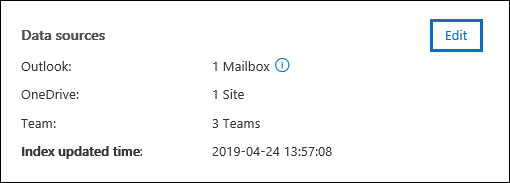

# 在高級 eDiscovery 案例中管理保管人

在高級 eDiscovery 案例中，[**來源**] 索引標籤上的「保管人」頁面包含已新增至此案例的所有保管人清單。 在您將保管人新增至案例後，會自動從 Azure Active Directory 收集每個保管人的詳細資訊，並在高級 eDiscovery 中查看。

## 查看保管人詳細資料

若要查看有關保管人的詳細資料，請按一下 [**保管人**] 索引標籤上的 [管理員] 清單。隨即會顯示飛出的頁面，並包含下列管理員的相關資訊：

- 連絡人資訊

  - **顯示名稱**-顯示在保管人的通訊錄中的名稱。 這通常是管理員的名字、中間名首字母和姓氏的組合。
  
   - **Mail/SMTP** -保管人的主要 SMTP 位址，例如，brianj@contoso.onmicrosoft.com。 也會列出保管人的使用者主要名稱（UPN）。

  - **Title** -保管人的職稱。

  - **部門**-保管人運作所在部門的名稱。

  - **Manager** -保管人的管理員。 指定的管理員會收到此管理員的任何升級通訊。
  
- 位置資訊

  - **City** -保管人所在的城市。

  - **State** -保管人位址中的省或市。

  - **國家/地區**-保管人所在的國家/地區。

  - **Office** -在保管人公司地點的辦公室地點。

- 案例資訊

  - **保留狀態**-表示是否已將保管人置於暫止狀態。 

  - **通訊狀態**：指出是否已簽發保管人的持有者通知。 如果保管人已發出通知，則會**發佈**此屬性的值。 如果保管人尚未發出通知，則狀態會**取消發佈**。 

  - **狀態**-案例內管理員的狀態。 **Active**的狀態表示保管人是案例的一部分。 如果從案例中發佈保管人，則狀態會變更為 [已**發放**]。 

- 資料來源和索引資訊

    - **資料來源**-顯示與保管人相關聯且屬於案例一部分之資料來源（信箱、網站及小組）的計數和類型。

    - **索引更新時間**-指出上次觸發高級索引工作的時間與日期。 此屬性也會指出高級索引處理常式目前的進行時間。

## 編輯保管人

在您的案例進展中，您可能會發現在您的案例中，可能會有與特定保管人相關的其他資料來源 &。 在其他情況下，您可能會想要移除某些已複查並視為不相關的資料來源。

若要更新與保管人相關聯的資料來源：

1. 請移至**eDiscovery > Advanced ediscovery** ，然後開啟案例。
  
2. 按一下 [**來源**] 索引標籤。
  
3. 在 [**保管人**] 頁面上，從清單中選取管理員，然後按一下彈出頁面上的 [**編輯**]。

    
  
4. 按一下 **[選擇資料來源**] 索引標籤，以變更保管人的 Exchange 信箱和 OneDrive 帳戶的設定，然後按一下 **[選擇資料來源**]。
  
5. 按一下 [**選取其他資料來源**] 索引標籤，新增或移除與保管人管理員相關聯的小組、SharePoint 或 Exchange 信箱。 

    如需與保管人相關聯之資料來源的詳細資訊，請參閱[Add 保管人 to a case](add-custodians-to-case.md#step-3-associate-additional-data-sources-to-a-custodian)中的「步驟3：將其他資料來源與保管人關聯。」。 
  
6. 按一下 [**放置 custodial 保留**]，以啟用或停用保管人的保留。

## 重新索引保管人資料

在大部分法律調查的 eDiscovery 工作流程中，在將保管人新增至合法案例後，會搜尋保管人資料的子集。 由於非常大的檔案大小或可能的資料損毀，與管理員相關聯之資料來源中的某些專案可能會進行部分編制索引。 使用高級 eDiscovery 中的[高級索引](indexing-custodian-data.md)功能時，可以根據需要重新建立這些專案的索引，以自動修正部分的索引項目目。

當系統管理員新增至案例時，位於與保管人相關之資料來源中的資料會自動重新編制索引（由高級索引處理常式）。 這表示您可以就地保留資料，而不需要下載並修復資料，然後離線搜尋）。 不過，在法律案例的生命週期中，可能會與保管人產生關聯的新資料來源。 在此情況下，您可以重新執行「高級索引處理常式」以修正任何已部分索引的專案，並更新保管人資料的索引，以重新建立保管人的資料索引。

觸發重新編制索引處理常式來處理部分索引的專案：

1. 請移至**eDiscovery > Advanced ediscovery** ，然後開啟案例。

2. 按一下 [**來源**] 索引標籤。

3. 在 [**保管人**] 頁面上，選取必須重新編制索引其資料的保管人。

4. 在飛入頁面上，按一下 [**更新索引**]。

   隨即會顯示一個對話方塊，指出已經建立索引工作。

重新索引保管人資料是長期執行的程式;所建立的對應工作稱為**重新編制索引的保管人資料**。 您可以在 [**索引工作狀態**] 欄中監控狀態，以追蹤 [**工作**] 索引標籤或 [**保管人**] 索引標籤上的進度。

如需詳細資訊，請參閱：

- [使用處理錯誤](processing-data-for-case.md)

- [管理工作](managing-jobs-ediscovery20.md)

## 從案例發行管理員

在關閉案例的情況下，保管人會遭到發佈，但管理員已不再需要保留內容的情況，或當保管人視為不再與案例相關時。 

發佈系統管理員之後，如果您發佈了保留通知，就會將發行通知傳送給系統管理員。 此外，已移除與保管人相關聯之資料來源的任何保留。 如果系統管理員是置於無訊息*保留狀態*（未發佈任何合法保留通知），將不會傳送發行通知，但是會移除與該保管人相關聯之資料來源上的任何保留。

若要發行管理員： 

1. 請移至**eDiscovery > Advanced ediscovery** ，然後開啟案例。

2. 按一下 [**來源**] 索引標籤。

3. 在 [**保管人**] 頁面上，選取從案例發行的保管人。

4. 在飛入頁面上，按一下 [**發行管理員**]。

   隨即會顯示 [警告] 頁面，說明如果保留是放在與保管人相關聯的資料來源上，保留將會被移除，而且與不同的高級 eDiscovery 案例關聯的任何其他保留仍會適用。 包括其他類型的保留和保留功能（例如 Microsoft 365 保留原則）。

5. 按一下 **[是]** 確認您要釋放保管人。 

    在 [**保管人**] 索引標籤上，此使用者的狀態會設定為 [已**發放**]，而且飛入頁面上的 [**保留] 狀態**會變更為**False**。 

> [!NOTE]
> 在幾個法律案例中，管理員可能會同時參與。 當保管人從案例發行時，其他重要專案的保留和通知將不會受到影響。

## 大量編輯保管人

您可以使用大量編輯器同時編輯多個保管人。 若要這麼做，只要在 [**保管人**] 索引標籤上選取兩個或多個保管人，即可顯示大量編輯器，然後按一下其中一個工作。

