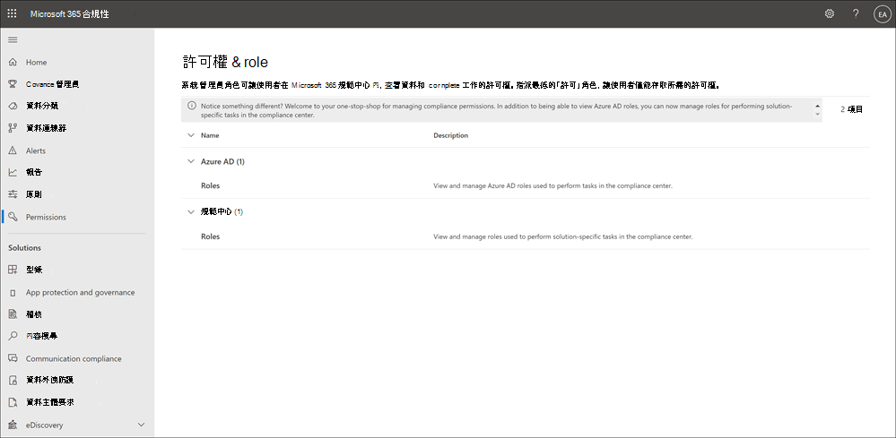

# Microsoft 365 規範中心的許可權

Microsoft 365 規範中心最近已更新，而且現在支援在 Microsoft 365 中執行規范工作的使用者直接管理許可權。 此更新表示您不再需要使用 Office 365 安全性 & 相容性中心來管理規範解決方案的許可權。 您可以使用「Microsoft 365 規範中心」中的 [新增 **許可權**] 頁面，管理使用者在裝置管理、資料遺失防護、eDiscovery、有問必答風險管理、保留及許多其他功能等功能方面的許可權。 使用者可以只執行您明確授與其存取權的相容性工作。

若要在「Microsoft 365 規範中心」中查看 [**許可權**] 索引標籤，使用者必須是全域系統管理員或必須被指派 *角色管理* 角色 (角色只會指派給「*組織管理*」角色群組) 。 *角色管理* 角色可讓使用者查看、建立及修改角色群組。

Microsoft 365 規範中心的許可權是以以角色為基礎的存取控制 (RBAC) 許可權模型為基礎。 RBAC 是大多數 Microsoft 365 服務所使用的相同許可權模型，因此，如果您熟悉這些服務中的許可權結構，則必須熟悉 Microsoft 365 規範中心的許可權。 請務必記住，在 Microsoft 365 規範中心管理的許可權不會涵蓋每個個別服務所需的擁有權限。 您仍需要在系統管理中心中管理特定服務的特定服務特定許可權。 例如，如果您需要指派許可權進行封存、審核和保留原則，您必須在 Exchange 系統管理中心中管理這些許可權。

## 成員、角色和角色群組的關係

角色授與許可權，以執行一組任務;例如，案例管理角色可讓使用者使用 eDiscovery 案例。

角色群組是一組角色，可讓使用者在 Microsoft 365 規範中心以外的相容性解決方案中執行其工作。 例如，將使用者新增至「 *有問必答風險管理* 」角色群組、指定的系統管理員、分析員、調查人員和審計員，都是針對單一群組中所需的「內部使用者風險管理」許可權進行設定。 Microsoft 365 規範中心包含每個規範解決方案的任務和功能的預設角色群組，您必須將這些人員指派給他們。 一般來說，建議您視需要將個別使用者新增為預設符合性角色群組的成員。

## 在 Microsoft 365 規範中心使用功能時所需的許可權

若要查看 Microsoft 365 規範中心所有可用的預設角色群組，以及預設指派給角色群組的角色，請參閱[安全性 & 規範中心中的許可權](/microsoft-365/security/office-365-security/permissions-in-the-security-and-compliance-center)。

管理 Microsoft 365 規範中心的許可權只會讓使用者能夠存取 Microsoft 365 規範中心內提供的相容性功能。 如果您想要將許可權授與 Microsoft 365 規範中心以外的其他功能，例如 Exchange 郵件流程規則 (也稱為傳輸規則) ，您必須使用 Exchange 系統管理中心。

## Microsoft 365 規範中心內的 Azure 角色

出現在  >  [Microsoft 365 規範中心 **許可權**] 頁面之 [Azure AD **角色**] 區段中的角色是 Azure Active Directory 角色。 這些角色的設計符合組織 IT 群組中的各個職位，進而能輕鬆地為人員提供完成工作所需的所有權限。 您可以透過選取系統管理員角色並查看 [角色] 面板詳細資料，來查看目前指派給每個角色的使用者。 若要管理 Azure AD 角色的成員，請選取 [管理 Azure AD 中的成員]。 此選項會將您重新導向 Azure 管理入口網站。

|角色|描述|
|:---|:----------|
|**全域管理員**|可以存取所有 Microsoft 365 服務中的所有系統管理功能。 只有全域管理員才能指派其他系統管理員角色。 如需詳細資訊，請參閱[全域系統管理員／公司系統管理員](/azure/active-directory/roles/permissions-reference#global-administrator--company-administrator)。|
|**合規性資料管理員**|可以追蹤 Microsoft 365 中的組織資料，確保其受到保護，並深入了解任何問題以協助降低風險。 如需詳細資訊，請參閱[合規性資料系統管理員](/azure/active-directory/roles/permissions-reference#compliance-data-administrator)。|
|**合規性系統管理員**|可幫助您的組織遵守任何法規要求、管理電子文件探索案例，並維護 Microsoft 365 各個位置、身分和應用程式的資料監管原則。 如需詳細資訊，請參閱 [合規性系統管理員](/azure/active-directory/roles/permissions-reference#compliance-administrator)。|
|**安全性操作員**|可檢視、調查和回應 Microsoft 365 使用者、裝置和內容所受的主動威脅。 如需詳細資訊，請參閱 [安全性運算子](/azure/active-directory/roles/permissions-reference#security-operator)。|
|**安全性讀取者**|可檢視和調查 Microsoft 365 使用者、裝置和內容所受的主動威脅，但是 (與安全性運算子不同) 他們沒有透過採取行動而回應的權限。 如需詳細資訊，請參閱 [安全性讀取者](/azure/active-directory/roles/permissions-reference#security-reader)。|
|**安全性系統管理員**|可透過管理安全性原則、檢視 Microsoft 365 各項產品的安全性分析和報告，以及在威脅環境中保持最新速度，來控制組織的整體安全性。 如需詳細資訊，請參閱 [安全性系統管理員](/azure/active-directory/roles/permissions-reference#security-administrator)。|
|**全域讀取者**|**全域系統管理員** 角色的唯讀版本。 在 Microsoft 365 中檢視所有設定和管理資訊。 如需詳細資訊，請參閱 [全域讀取者](/azure/active-directory/roles/permissions-reference#global-reader)。|
|**攻擊模擬系統管理員**|建立及管理攻擊類比的建立、啟動/排程類比，以及檢查類比結果。 如需詳細資訊，請參閱 [攻擊模擬管理員](/azure/active-directory/roles/permissions-reference#attack-simulation-administrator)。|
|**攻擊負載編寫者**|建立攻擊負載，但不是實際啟動或排程。 如需詳細資訊，請參閱 [攻擊負載作者](/azure/active-directory/roles/permissions-reference#attack-payload-author)。|
|

## 將使用者新增至符合性角色群組

完成下列步驟，將使用者新增至符合性角色群組：

1. 使用 Microsoft 365 組織中系統管理員帳戶的認證，登入[Microsoft 365 規範中心](https://compliance.microsoft.com/permissions)的 [許可權] 區域。
2. 在 Microsoft 365 規範中心] 中，移至 [**許可權**]。 選取在 Microsoft 365 中查看及管理符合性角色的連結。
3. 展開 [ **規範中心** ] 區段，然後選取 [ **角色**]。
4. 在 [ **規範中心角色** ] 頁面上，選取您要新增使用者的符合性角色群組，然後選取 [詳細資料] 窗格中的 [ **編輯角色群組** ]。
5. 在左側瀏覽窗格中選取 **[選擇成員]**，然後選取 **[編輯]**。
6. 選取 **[新增]**，然後針對所有要新增至角色群組的使用者勾選核取方塊。
7. 選取 **[新增]**，然後選取 **[完成]**。
8. 選取 **[儲存]** 以將使用者新增至角色群組。 選取 **[關閉]** 以完成步驟。

## 從符合性角色群組中移除使用者

完成下列步驟以從符合性角色群組中移除使用者：

1. 使用 Microsoft 365 組織中系統管理員帳戶的認證，登入[Microsoft 365 規範中心](https://compliance.microsoft.com/permissions)的 [許可權] 區域。
2. 在 Microsoft 365 規範中心] 中，移至 [**許可權**]。 選取在 Microsoft 365 中查看及管理符合性角色的連結。
3. 展開 [規範中心] 區段，然後選取 [ **角色**]。
4. 在 [ **規範中心角色** ] 頁面上，選取您要從中移除使用者的符合性角色群組，然後在詳細資料窗格中選取 [ **編輯角色群組** ]。
5. 在左側瀏覽窗格中選取 **[選擇成員]**，然後選取 **[編輯]**。
6. 選取 [ **移除** ]，然後選取您要從角色群組中移除之所有使用者的核取方塊。
7. 選取 [ **移除**]，然後選取 [ **完成**]。
8. 選取 [ **儲存** ] 以從角色群組中移除使用者。 選取 **[關閉]** 以完成步驟。
