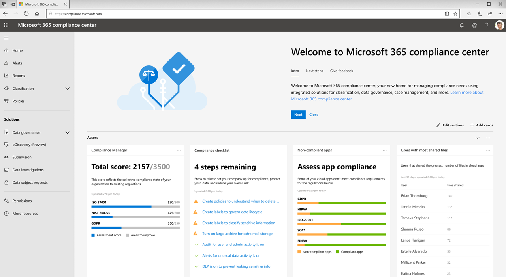

# 全新 Microsoft 365 合规性中心概述

## 概觀

如果您对组织的合规性状况感兴趣，您会喜欢新的[Microsoft 365 合规性中心。](https://compliance.microsoft.com) Microsoft 365 合规性中心提供了对组织合规性需求所需的数据和工具的轻松访问。 

阅读本文，了解 Microsoft 365 合规性中心、[如何获取它、](#how-do-i-get-this)[常见问题](#frequently-asked-questions)以及[后续步骤。](#next-steps)

## 欢迎来到微软365合规性

当您第一次转到 Microsoft 365 合规性中心时，您会收到以下欢迎消息：

欢迎横幅为您提供了一些关于如何入门的提示，下一步以及邀请您向我们提供反馈。

## 评估部分

主页**上的"评估"** 部分可一目了然地显示您的组织在[数据保护和合规性](protect-access-to-data-and-services.md)方面的表现。

从这里，您可以转到 Microsoft 合规性分数卡，该卡片将转到[合规性管理器，](meet-data-protection-and-regulatory-reqs-using-microsoft-cloud.md)您可以在其中查看或编辑配置，并可能提高总体合规性分数。

您将看到其他卡片，例如显示组织云应用合规性的卡片，另一张显示有关具有共享文件的用户的数据，以及指向[云应用安全](https://docs.microsoft.com/cloud-app-security/)或其他工具的链接，您可以在其中浏览数据。

## "保护"部分

主页**上的"保护"** 部分包含卡片，这些卡片提供有关[标签、](labels.md)[数据丢失防护 （DLP）、](data-loss-prevention-policies.md)正在使用的第三方应用、共享文件、影子 IT 应用等的高级信息。 

每张卡片都有一个指向报告的链接或其他信息，您可以在其中了解更多信息。

## "响应"部分

主页**上的"响应"** 部分显示您需要查看并可能采取行动的[警报](/security/office-365-security/alerts.md)和[待处理处置。](disposition-reviews.md)

卡片（如[活动警报](/security/office-365-security/alerts.md)卡）包含指向页面的链接，您可以在其中查看更详细的信息，如严重性、状态、类别等。

 

## 轻松导航到更多合规性特性和功能

除了主页上的卡片链接外，您还可以在屏幕左侧找到一个导航窗格，让您轻松访问[警报、](/security/office-365-security/alerts.md)[报告、](reports-in-security-and-compliance.md)[策略、](alert-policies.md)合规性解决方案等。 

|  |  |
|---------|---------|
|  |   转到**警报**以查看和解析[警报](/security/office-365-security/alerts.md)  访问**报告**以查看有关[标签使用情况和保留、DLP](sensitivity-labels.md)[策略匹配和覆盖、](view-the-dlp-reports.md)[共享文件、](https://docs.microsoft.com/cloud-app-security/file-filters)[正在使用的第三方应用](https://docs.microsoft.com/cloud-app-security/discovered-apps)等数据。  展开"**分类"** 部分以访问[标签、](labels.md)[标签策略、](sensitivity-labels.md#what-label-policies-can-do)[敏感信息类型](what-the-sensitive-information-types-look-for.md)和[标签分析。](view-label-activity-for-documents.md)  转到"**策略"** 以查看[警报](/security/office-365-security/alerts.md)并访问[DLP](data-loss-prevention-policies.md)和[保留](retention-policies.md)策略。   **使用"解决方案"** 部分中的链接访问组织的合规性解决方案。 這些包括：  [数据治理>处置](disposition-reviews.md) [eDiscovery](overview-ediscovery-20.md) [监督](supervision-policies.md) [数据调查](overview-data-investigations.md) [資料主體要求](manage-gdpr-data-subject-requests-with-the-dsr-case-tool.md)        |

## 我怎样才能得到这个？

- 如果您还没有新的 Microsoft 365 合规性中心，您很快就会拥有它。 [新的 Microsoft 365 合规性中心](/security/office-365-security/microsoft-security-and-compliance.md#microsoft-365-compliance-center)现已正式推出。

- 要访问 Microsoft 365 合规性中心（作为全局管理员或合规性管理员，请[https://compliance.microsoft.com](https://compliance.microsoft.com)转到并登录）。 

- 要了解有关要求的详细信息，请参阅[必需的许可证和权限。](/security/office-365-security/microsoft-security-and-compliance.md#required-licenses-and-permissions)

## 常見問題集

### 为什么我被带到 Office 365 安全&合规性中心执行某些任务，例如定义某些策略？

我们仍在开发 Microsoft 365 合规性中心，我们将在未来几个月添加更多功能和解决方案。 同时，在 Office 365 安全&合规中心 （ ）[https://protection.office.com](https://protection.office.com)中必须执行一些任务。 在这些情况下，将自动引导您到可以执行手头任务的位置，例如创建或编辑监督策略。

### 为什么我看不到新的 Microsoft 365 合规性中心呢？

首先，请确保您具有适当的[许可证和权限。](/security/office-365-security/microsoft-security-and-compliance.md#required-licenses-and-permissions) 然后，在 登录。 [https://compliance.microsoft.com](https://compliance.microsoft.com) 如果您尚未看到新的合规中心，您很快就会看到它。

### 我的某些合规性功能在 Microsoft 365 合规性中心不可用。 What do I do?

我们仍在向 Microsoft 365 合规性中心添加功能。 如果找不到某些内容（如审核日志搜索），请使用 Office 365 安全&合规性中心 （[https://protection.office.com](https://protection.office.com)）。 您的配置将自动保存在现有的 Office 365 安全&合规性中心和新的 Microsoft 365 合规性中心中。

要转到该点，在 Microsoft 365 合规性中心，在屏幕左侧的导航窗格中，**选择"更多资源"，** 然后在**Office 365 安全&合规性中心**下，**选择"打开"。**

## 後續步驟

- **查看您的 Microsoft 合规性分数，** 并使用合规性管理器来提高您的分数。 要了解更多信息，请参阅[使用合规性管理器，以帮助满足使用 Microsoft 云服务时的数据保护和法规要求。](meet-data-protection-and-regulatory-reqs-using-microsoft-cloud.md)

- **查看组织的数据丢失防护策略，** 并根据需要进行必要的调整。 要了解更多信息，请参阅[数据丢失防护策略概述](data-loss-prevention-policies.md)。 

- **熟悉并设置微软云应用程序安全。** 请参阅[快速入门：开始使用微软云应用安全](https://docs.microsoft.com/cloud-app-security/getting-started-with-cloud-app-security)软件。  

- **经常访问您的 Microsoft 365 合规性中心，** 并确保查看可能出现的任何警报或潜在风险。 转到[https://compliance.microsoft.com](https://compliance.microsoft.com)并登录。