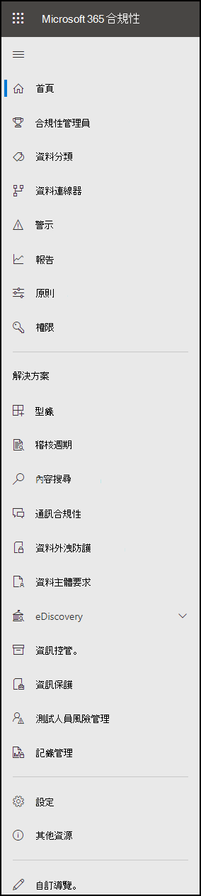

# Microsoft 365 合規性中心

如果您對組織的合規性狀況感興趣，您會喜歡 [Microsoft 365 規範中心](https://compliance.microsoft.com)。 Microsoft 365 規範中心可讓您輕鬆存取所需的資料和工具，以管理您組織的合規性需求。

請閱讀本文以瞭解 Microsoft 365 規範中心、[如何取得](#how-do-i-get-the-compliance-center)[問題、常見問題解答](#frequently-asked-questions)及[後續步驟](#next-steps)。

## 歡迎使用 Microsoft 365 合規性

當您第一次移至 Microsoft 365 規範中心時，您會 greeted 下列歡迎訊息：

歡迎使用橫幅提供一些有關如何開始使用的指標，以及下一個步驟和邀請，讓我們提供意見反應。

## 卡片區段

當您第一次造訪 Microsoft 365 規範中心時，首頁上的 [卡片] 區段會顯示您的組織如何處理資料相容性、可供組織使用的解決方案，以及任何使用中警示的摘要。

在這裡，您可以：

- 回顧 **Microsoft 合規性管理員** 卡片，它會讓您加入 [合規性管理員](compliance-manager.md) 解決方案。 合規性管理員會協助簡化管理規範的方式。 它會計算以風險為基礎的分數，以衡量所做的建議動作，以協助降低資料保護和法規標準的風險。 它還提供工作流程功能及內建的控制項對應，以協助您有效地執行改進動作。

    

- 回顧新的 **方案目錄** 卡，它會連結至 [整合解決方案](microsoft-365-solution-catalog.md) 的集合，以協助您管理端對端的符合性案例。 方案的功能和工具可能包含原則、警示、報告等的組合。

    

- 複查使用中的 **警示** 卡，其中包含最 [活躍的提醒](alert-policies.md) 摘要，並包含可讓您查看更詳細資訊的連結，例如嚴重性、狀態、類別等。

    

您也可以使用 [ **新增卡** ] 功能來新增額外的卡片，例如一個顯示組織的雲端應用程式相容性的卡片，另一個顯示含共用檔案之使用者的資料，並 [提供可流覽](https://docs.microsoft.com/cloud-app-security/) 資料的其他工具連結。

## 便於流覽更具法規遵從性功能和功能

除了首頁上的卡片連結之外，您還可以在畫面左邊看到一個功能窗格，讓您輕鬆存取您的 [提醒](../security/office-365-security/alerts.md)、 [報表](reports-in-security-and-compliance.md)、 [原則](alert-policies.md)、規範解決方案等等。 若要新增或移除自訂導覽窗格的選項，請使用功能窗格上的 [ **自訂導覽** 控制項]。 這會開啟 [ **自訂導覽窗格]** 設定，讓您可以設定要顯示在功能窗格中的專案。

|  |  |
|---------|---------|
|  | 選取 [ **首頁** ] 以回到 Microsoft 365 規範中心主頁。   請造訪 **合規性管理員** 以檢查您的合規性分數，並開始管理組織的 [合規性](compliance-manager.md) 。    選取 [ **資料分類** ] 區段，以存取 [trainable 的分類](classifier-learn-about.md)器、 [機密資訊類型實體定義](sensitive-information-type-entity-definitions.md)、內容及 [活動](data-classification-activity-explorer.md) 瀏覽器。    選取 [ **資料連線器** ]，以設定在 Microsoft 365 訂閱中匯入和封存資料的 [連接器](archiving-third-party-data.md) 。    移至 **提醒** 以查看及解決 [通知](alert-policies.md)   就診 **報告** 以查看 [標籤使用狀況和保留](sensitivity-labels.md)的相關資料、 [DLP 原則比對和覆寫](view-the-dlp-reports.md)、 [共用](https://docs.microsoft.com/cloud-app-security/file-filters)檔案、 [使用中的協力廠商應用程式](https://docs.microsoft.com/cloud-app-security/discovered-apps)等等。    移至 [ **原則** ] 以設定管理資料、管理裝置和接收 [提醒](../security/office-365-security/alerts.md)的原則。 您也可以存取您的 [DLP](data-loss-prevention-policies.md) 和 [保留](retention.md) 原則。   選取 [ **許可權** ]，以管理您組織中能夠存取 Microsoft 365 規範中心的人員，以查看內容和完成工作。    使用 [ **解決方案** ] 區段中的連結，以存取組織的合規性解決方案。 包括：    [型錄](microsoft-365-solution-catalog.md)   探索、深入瞭解及開始使用可供您組織使用的智慧相容性和風險管理解決方案。    [審計](search-the-audit-log-in-security-and-compliance.md)   使用審核記錄檔，調查常見的支援和合規性問題。    [內容搜尋](search-for-content.md)   使用內容搜尋，以在 Exchange 信箱、SharePoint 網站中的檔、OneDrive 位置，以及 Microsoft 團隊和商務用 Skype 中的立即訊息交談，快速尋找電子郵件。    [通訊合規性](communication-compliance.md)   自動捕獲不適當的郵件、調查可能的原則違規和採取補救措施，以盡可能降低通訊風險。    [資料調查](overview-data-investigations.md)   跨內容位置進行搜尋，以在 Microsoft 365 中識別敏感、惡意或誤放的資料，因此您可以調查並修復任何事件，例如資料外泄。    [資料外洩防護](data-loss-prevention-policies.md)   在整個組織中、雲端和裝置上，偵測機密內容的使用和共用，並協助防止意外的資料遺失。    [資料主體要求](manage-gdpr-data-subject-requests-with-the-dsr-case-tool.md)   尋找及匯出使用者的個人資料，以協助您回應一般資料保護法規 (GDPR) 的資料主體要求。    [eDiscovery](overview-ediscovery-20.md)   請展開此區段，以使用核心和高級 eDiscovery，保留、收集、審閱、分析和匯出以回應組織內部和外部調查的內容。    [資訊管理](manage-information-governance.md)   使用功能來管理您的內容生命週期，以匯入、儲存和分類業務關鍵型資料，這樣您就可以保留您所需要的專案，並刪除您不需要的專案。    [資訊保護](information-protection.md)   探索、分類及保護整個組織中其整個生命週期的敏感和業務關鍵型內容。    [有問必答風險管理](insider-risk-management.md)   偵測整個組織的危險活動，以協助您快速識別、調查和採取對內部使用者風險和威脅的動作。    [記錄管理](records-management.md)   自動化和簡化組織中法規、法律和業務關鍵型記錄的保留排程。

## 如何取得規範中心？

- 如果您已沒有新的 Microsoft 365 規範中心，您很快就會有。 Microsoft 365 規範中心通常可供 Microsoft 365 SKU 客戶使用。

- 若要流覽 Microsoft 365 規範中心，請以全域管理員、合規性管理員或合規性資料管理員的身分登 [https://compliance.microsoft.com](https://compliance.microsoft.com) 入。

## 常見問題集

**為什麼我會進入安全性 & 合規性中心，以完成一些工作，例如定義特定原則？**

我們仍在開發 Microsoft 365 規範中心，我們會在今後的幾個月內新增更多功能和解決方案。 同時，必須在安全性 & 規範中心 () 中完成一些工作 [https://protection.office.com](https://protection.office.com) 。 在這種情況下，您將會自動定向至您可以在其中完成工作的位置，例如建立或編輯監督原則。

**為什麼我還沒有看到新的 Microsoft 365 規範中心？**

首先，請確定您有適當的授權和許可權。 然後，在中登入 [https://compliance.microsoft.com](https://compliance.microsoft.com) 。 如果您還沒有看到新的規範中心，您很快就會有。

**Microsoft 365 規範中心無法使用我的一些規範功能。我該怎麼辦？**

我們仍在 Microsoft 365 規範中心新增功能。 如果您找不到任何專案（例如審計記錄搜尋），請使用安全性 & 合規性中心 ([https://protection.office.com](https://protection.office.com)) 。 您的設定會同時儲存在現有的安全性 & 規範中心及新的 Microsoft 365 合規性中心內。

若要移至那裡，請在 Microsoft 365 規範中心的畫面左側的功能窗格中，選擇 [ **其他資源** ]，然後在 [ **Office 365 安全性 & 規範中心** ] 底下，選擇 [ **開啟** ]。

## 後續步驟

- **請造訪 Microsoft 合規性管理員** 以查看您的合規性分數，並開始管理組織的合規性。 若要深入瞭解，請參閱 [合規性管理員](compliance-manager.md)。

- **設定「有問必答風險管理」原則** ，協助將內部風險降至最低，並讓您偵測、調查和採取行動，以應對組織中的危險活動。 請參閱「 [有問必答風險管理](insider-risk-management.md)」。

- 請 **複查您組織的資料遺失防護原則** ，並視需要進行必要的變更。 若要深入瞭解，請參閱 [資料遺失防護原則一覽](data-loss-prevention-policies.md)。

- **深入瞭解並設定 Microsoft Cloud App Security** 。 請參閱 [快速入門： Microsoft Cloud App Security 快速入門](https://docs.microsoft.com/cloud-app-security/getting-started-with-cloud-app-security)。

- **深入瞭解及建立通訊相容性原則** ，以快速找出並修正公司行為準則原則違規。 請參閱 [Microsoft 365 中的通訊法規遵從性](communication-compliance.md)。

- 請 **經常造訪您的 Microsoft 365 合規性中心** ，並務必複查所引發的任何警示或潛在風險。 移至 [https://compliance.microsoft.com](https://compliance.microsoft.com) 並登入。
