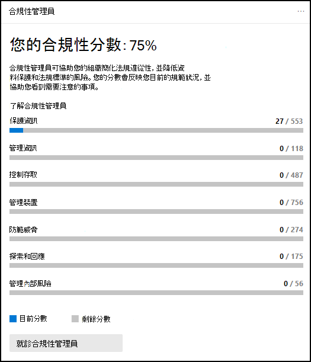

# Microsoft 365 合規性中心Microsoft 365 compliance center

如果您對組織的合規性狀況感興趣，您會喜歡 [Microsoft 365 規範中心](https://compliance.microsoft.com)。If you're interested in your organization's compliance posture, you're going to love the [Microsoft 365 compliance center](https://compliance.microsoft.com). Microsoft 365 規範中心可讓您輕鬆存取所需的資料和工具，以管理您組織的合規性需求。The Microsoft 365 compliance center provides easy access to the data and tools you need to manage to your organization's compliance needs.

請閱讀本文以瞭解 Microsoft 365 規範中心、[如何取得](#how-do-i-get-the-compliance-center)[問題、常見問題解答](#frequently-asked-questions)及[後續步驟](#next-steps)。Read this article to get acquainted with the Microsoft 365 compliance center, [how to get it](#how-do-i-get-the-compliance-center), [frequently asked questions](#frequently-asked-questions), and your [next steps](#next-steps).

## 歡迎使用 Microsoft 365 合規性Welcome to Microsoft 365 compliance

當您第一次移至 Microsoft 365 規範中心時，您會 greeted 下列歡迎訊息：When you go to your Microsoft 365 compliance center for the first time, you're greeted with the following welcome message:

歡迎使用橫幅提供一些有關如何開始使用的指標，以及下一個步驟和邀請，讓我們提供意見反應。The welcome banner gives you some pointers on how to get started, with next steps, and an invitation for you to give us feedback.

## 卡片區段Card section

當您第一次造訪 Microsoft 365 規範中心時，首頁上的 [卡片] 區段會顯示您的組織如何處理資料相容性、可供組織使用的解決方案，以及任何使用中警示的摘要。When you first visit the Microsoft 365 compliance center, the card section on the home page shows you at a glance how your organization is doing with data compliance, what solutions are available for your organization, and a summary of any active alerts.

在這裡，您可以：From here, you can:

- 回顧 **Microsoft 合規性管理員** 卡片，它會讓您加入 [合規性管理員](compliance-manager.md) 解決方案。Review the **Microsoft Compliance Manager** card, which leads you to the [Compliance Manager](compliance-manager.md) solution. 合規性管理員會協助簡化管理規範的方式。Compliance Manager helps simplify the way you manage compliance. 它會計算以風險為基礎的分數，以衡量所做的建議動作，以協助降低資料保護和法規標準的風險。It calculates a risk-based score measuring your progress toward completing recommended actions that help reduce risks around data protection and regulatory standards. 它還提供工作流程功能及內建的控制項對應，以協助您有效地執行改進動作。It also provides workflow capabilities and built-in control mapping to help you efficiently carry out improvement actions.

    

- 回顧新的 **方案目錄** 卡，它會連結至 [整合解決方案](microsoft-365-solution-catalog.md) 的集合，以協助您管理端對端的符合性案例。Review the new **Solution catalog** card, which links to collections of [integrated solutions](microsoft-365-solution-catalog.md) you can use to help you manage end-to-end compliance scenarios. 方案的功能和工具可能包含原則、警示、報告等的組合。A solution's capabilities and tools might include a combination of policies, alerts, reports, and more.

    

- 複查使用中的 **警示** 卡，其中包含最 [活躍的提醒](alert-policies.md) 摘要，並包含可讓您查看更詳細資訊的連結，例如嚴重性、狀態、類別等。Review the **Active alerts** card, which includes a summary of the most [active alerts](alert-policies.md) and includes a link where you can view more detailed information, such as Severity, Status, Category, and more.

    

您也可以使用 [ **新增卡** ] 功能來新增額外的卡片，例如一個顯示組織的雲端應用程式相容性的卡片，另一個顯示含共用檔案之使用者的資料，並 [提供可流覽](https://docs.microsoft.com/cloud-app-security/) 資料的其他工具連結。You can also use the **Add cards** feature to add additional cards, such as one showing your organization's cloud app compliance, and another showing data about users with shared files, with links to [Cloud App Security](https://docs.microsoft.com/cloud-app-security/) or other tools where you can explore data.

## 便於流覽更具法規遵從性功能和功能Easy navigation to more compliance features and capabilities

除了首頁上的卡片連結之外，您還可以在畫面左邊看到一個功能窗格，讓您輕鬆存取您的 [提醒](../security/office-365-security/alerts.md)、 [報表](reports-in-security-and-compliance.md)、 [原則](alert-policies.md)、規範解決方案等等。In addition to links in cards on the home page, you'll see a navigation pane on the left side of the screen that gives you easy access to your [alerts](../security/office-365-security/alerts.md), [reports](reports-in-security-and-compliance.md), [policies](alert-policies.md), compliance solutions, and more. 若要新增或移除自訂導覽窗格的選項，請使用功能窗格上的 [ **自訂導覽** 控制項]。To add or remove options for a customized navigation pane, use the **Customize navigation** control on the navigation pane. 這會開啟 [ **自訂導覽窗格]** 設定，讓您可以設定要顯示在功能窗格中的專案。This opens the **Customize your navigation pane** settings so you can configure which items appear in the navigation pane.

|  |  |
|---------|---------|
|  | 選取 [ **首頁** ] 以回到 Microsoft 365 規範中心主頁。Select **Home** to return to the Microsoft 365 compliance center main page.   請造訪 **合規性管理員** 以檢查您的合規性分數，並開始管理組織的 [合規性](compliance-manager.md) 。Visit **Compliance Manager** to check your compliance score and start [managing compliance](compliance-manager.md) for your organization.    選取 [ **資料分類** ] 區段，以存取 [trainable 的分類](classifier-learn-about.md)器、 [機密資訊類型實體定義](sensitive-information-type-entity-definitions.md)、內容及 [活動](data-classification-activity-explorer.md) 瀏覽器。Select the **Data classification** section to access [trainable classifiers](classifier-learn-about.md), [Sensitive information type entity definitions](sensitive-information-type-entity-definitions.md), content and [activity](data-classification-activity-explorer.md) explorers.    選取 [ **資料連線器** ]，以設定在 Microsoft 365 訂閱中匯入和封存資料的 [連接器](archiving-third-party-data.md) 。Select **Data connectors** to [configure connectors](archiving-third-party-data.md) to import and archive data in your Microsoft 365 subscription.    移至 **提醒** 以查看及解決 [通知](alert-policies.md)Go to **Alerts** to view and resolve [alerts](alert-policies.md)   就診 **報告** 以查看 [標籤使用狀況和保留](sensitivity-labels.md)的相關資料、 [DLP 原則比對和覆寫](view-the-dlp-reports.md)、 [共用](https://docs.microsoft.com/cloud-app-security/file-filters)檔案、 [使用中的協力廠商應用程式](https://docs.microsoft.com/cloud-app-security/discovered-apps)等等。Visit **Reports** to view data about [label usage and retention](sensitivity-labels.md), [DLP policy matches and overrides](view-the-dlp-reports.md), [shared files](https://docs.microsoft.com/cloud-app-security/file-filters), [third-party apps in use](https://docs.microsoft.com/cloud-app-security/discovered-apps), and more.    移至 [ **原則** ] 以設定管理資料、管理裝置和接收 [提醒](../security/office-365-security/alerts.md)的原則。Go to **Policies** to set up policies to govern data, manage devices, and receive [alerts](../security/office-365-security/alerts.md). 您也可以存取您的 [DLP](data-loss-prevention-policies.md) 和 [保留](retention.md) 原則。You can also access your [DLP](data-loss-prevention-policies.md) and [retention](retention.md) policies.   選取 [ **許可權** ]，以管理您組織中能夠存取 Microsoft 365 規範中心的人員，以查看內容和完成工作。Select **Permissions** to manage who in your organization has access to the Microsoft 365 compliance center to view content and complete tasks.    使用 [ **解決方案** ] 區段中的連結，以存取組織的合規性解決方案。Use the links in the **Solutions** section to access your organization's compliance solutions. 包括：These include:    [型錄Catalog](microsoft-365-solution-catalog.md)   探索、深入瞭解及開始使用可供您組織使用的智慧相容性和風險管理解決方案。Discover, learn about, and start using the intelligent compliance and risk management solutions available to your organization.    [稽核Audit](search-the-audit-log-in-security-and-compliance.md)   使用審核記錄檔，調查常見的支援和合規性問題。Use the Audit log to investigate common support and compliance issues.    [內容搜尋Content search](search-for-content.md)   使用內容搜尋，以在 Exchange 信箱、SharePoint 網站中的檔、OneDrive 位置，以及 Microsoft 團隊和商務用 Skype 中的立即訊息交談，快速尋找電子郵件。Use Content search to quickly find email in Exchange mailboxes, documents in SharePoint sites and OneDrive locations, and instant messaging conversations in Microsoft Teams and Skype for Business.    [通訊合規性Communication compliance](communication-compliance.md)   自動捕獲不適當的郵件、調查可能的原則違規和採取補救措施，以盡可能降低通訊風險。Minimize communication risks by automatically capturing inappropriate messages, investigating possible policy violations, and taking steps to remediate.    [資料外洩防護Data loss prevention](data-loss-prevention-policies.md)   在整個組織中、雲端和裝置上，偵測機密內容的使用和共用，並協助防止意外的資料遺失。Detect sensitive content as it's used and shared throughout your organization, in the cloud and on devices, and helps prevent accidental data loss.    [資料主體要求Data subject requests](manage-gdpr-data-subject-requests-with-the-dsr-case-tool.md)   尋找及匯出使用者的個人資料，以協助您回應一般資料保護法規 (GDPR) 的資料主體要求。Find and export a user's personal data to help you respond to data subject requests for the General Data Protection Regulation (GDPR).    [eDiscoveryeDiscovery](overview-ediscovery-20.md)   請展開此區段，以使用核心和高級 eDiscovery，保留、收集、審閱、分析和匯出以回應組織內部和外部調查的內容。Expand this section to use the core and Advanced eDiscovery for preserving, collecting, reviewing, analyzing, and exporting content that's responsive to your organization's internal and external investigations.    [資訊控管Information governance](manage-information-governance.md)   使用功能來管理您的內容生命週期，以匯入、儲存和分類業務關鍵型資料，這樣您就可以保留您所需要的專案，並刪除您不需要的專案。Manage your content lifecycle using features to import, store, and classify business-critical data so you can keep what you need and delete what you don't.    [資訊保護Information protection](information-protection.md)   探索、分類及保護整個組織中其整個生命週期的敏感和業務關鍵型內容。Discover, classify, and protect sensitive and business-critical content throughout its lifecycle across your organization.    [測試人員風險管理Insider risk management](insider-risk-management.md)   偵測整個組織的危險活動，以協助您快速識別、調查和採取對內部使用者風險和威脅的動作。Detect risky activity across your organization to help you quickly identify, investigate, and take action on insider risks and threats.    [記錄管理Records management](records-management.md)   自動化和簡化組織中法規、法律和業務關鍵型記錄的保留排程。Automate and simplify the retention schedule for regulatory, legal and business-critical records in your organization.

## 如何取得規範中心？How do I get the compliance center?

- 如果您已沒有新的 Microsoft 365 規範中心，您很快就會有。If you don't have the new Microsoft 365 compliance center already, you'll have it soon. Microsoft 365 規範中心通常可供 Microsoft 365 SKU 客戶使用。The Microsoft 365 compliance center is generally available now to Microsoft 365 SKU customers.

- 若要流覽 Microsoft 365 規範中心，請以全域管理員、合規性管理員或合規性資料管理員的身分登 [https://compliance.microsoft.com](https://compliance.microsoft.com) 入。To visit the Microsoft 365 compliance center, as a global administrator, compliance administrator, or compliance data administrator go to [https://compliance.microsoft.com](https://compliance.microsoft.com) and sign in.

## 常見問題集Frequently asked questions

**為什麼我會進入安全性 & 合規性中心，以完成一些工作，例如定義特定原則？****Why am I taken to the Security & Compliance Center to complete some tasks, such as defining certain policies?**

我們仍在開發 Microsoft 365 規範中心，我們會在今後的幾個月內新增更多功能和解決方案。We're still developing the Microsoft 365 compliance center, and we add more functionality and solutions over the coming months. 同時，必須在安全性 & 規範中心 () 中完成一些工作 [https://protection.office.com](https://protection.office.com) 。In the meantime, there are a few tasks that must be completed in the Security & Compliance Center ([https://protection.office.com](https://protection.office.com)). 在這種情況下，您將會自動定向至您可以在其中完成工作的位置，例如建立或編輯監督原則。In those cases, you'll be directed automatically to the location where you can complete the task at hand, such as creating or editing a supervision policy.

**為什麼我還沒有看到新的 Microsoft 365 規範中心？****Why don't I see the new Microsoft 365 compliance center yet?**

首先，請確定您有適當的授權和許可權。First, make sure that you have the appropriate licenses and permissions. 然後，在中登入 [https://compliance.microsoft.com](https://compliance.microsoft.com) 。Then, sign in at [https://compliance.microsoft.com](https://compliance.microsoft.com). 如果您還沒有看到新的規範中心，您很快就會有。If you don't see the new compliance center yet, you'll have it soon.

**Microsoft 365 規範中心無法使用我的一些規範功能。我該怎麼辦？****Some of my compliance features aren't available in the Microsoft 365 compliance center. What do I do?**

我們仍在 Microsoft 365 規範中心新增功能。We're still adding functionality to the Microsoft 365 compliance center. 如果您找不到任何專案（例如審計記錄搜尋），請使用安全性 & 合規性中心 ([https://protection.office.com](https://protection.office.com)) 。If you can't find something, such as audit log search, use the Security & Compliance Center ([https://protection.office.com](https://protection.office.com)). 您的設定會同時儲存在現有的安全性 & 規範中心及新的 Microsoft 365 合規性中心內。Your configurations are saved in both the existing Security & Compliance Center and in the new Microsoft 365 compliance center automatically.

若要移至那裡，請在 Microsoft 365 規範中心的畫面左側的功能窗格中，選擇 [ **其他資源**]，然後在 [ **Office 365 安全性 & 規範中心**] 底下，選擇 [ **開啟**]。To go there, in the Microsoft 365 compliance center, in the navigation pane on the left side of the screen, choose **More resources**, and then, under **Office 365 Security & Compliance Center**, choose **Open**.

## 後續步驟Next steps

- **請造訪 Microsoft 合規性管理員** 以查看您的合規性分數，並開始管理組織的合規性。**Visit Microsoft Compliance Manager** to see your compliance score and start managing compliance for your organization. 若要深入瞭解，請參閱 [合規性管理員](compliance-manager.md)。To learn more, see [Compliance Manager](compliance-manager.md).

- **設定「有問必答風險管理」原則** ，協助將內部風險降至最低，並讓您偵測、調查和採取行動，以應對組織中的危險活動。**Configure insider risk management policies** to help minimize internal risks and enable you to detect, investigate, and take action for risky activities in your organization. 請參閱「 [有問必答風險管理](insider-risk-management.md)」。See [Insider risk management](insider-risk-management.md).

- 請 **複查您組織的資料遺失防護原則**，並視需要進行必要的變更。**Review your organization's data loss prevention policies** and make required changes as necessary. 若要深入瞭解，請參閱 [資料遺失防護原則一覽](data-loss-prevention-policies.md)。To learn more about, see [Overview of data loss prevention policies](data-loss-prevention-policies.md).

- **深入瞭解並設定 Microsoft Cloud App Security**。**Get acquainted with and set up Microsoft Cloud App Security**. 請參閱 [快速入門： Microsoft Cloud App Security 快速入門](https://docs.microsoft.com/cloud-app-security/getting-started-with-cloud-app-security)。See [Quickstart: Get started with Microsoft Cloud App Security](https://docs.microsoft.com/cloud-app-security/getting-started-with-cloud-app-security).

- **深入瞭解及建立通訊相容性原則** ，以快速找出並修正公司行為準則原則違規。**Learn about and create communication compliance policies** to quickly identify and remediate corporate code-of-conduct policy violations. 請參閱 [Microsoft 365 中的通訊法規遵從性](communication-compliance.md)。See [Communication compliance in Microsoft 365](communication-compliance.md).

- 請 **經常造訪您的 Microsoft 365 合規性中心**，並務必複查所引發的任何警示或潛在風險。**Visit your Microsoft 365 compliance center often**, and make sure to review any alerts or potential risks that arise. 移至 [https://compliance.microsoft.com](https://compliance.microsoft.com) 並登入。Go to [https://compliance.microsoft.com](https://compliance.microsoft.com) and sign in.
