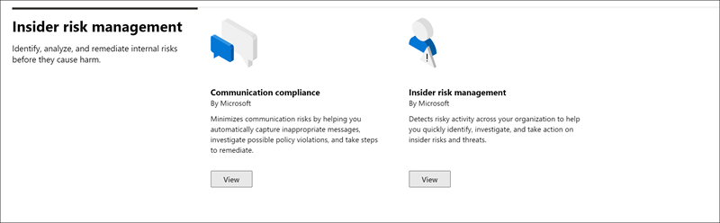

# Microsoft 365 解決方案目錄

您是否在尋找一種快速開始使用 Microsoft 365 中的合規性工作的方式？ 請參閱 [Microsoft 365 解決方案目錄](https://compliance.microsoft.com/solutioncatalog) ，以探索、學習並快速開始使用合規性和風險管理解決方案。

Microsoft 365 的規範解決方案是整合功能的集合，您可以用來協助您管理端對端的符合性案例。 方案的功能和工具可能包含原則、警示、報告等的組合。

請閱讀本文，以瞭解 Microsoft 365 規範中心中的新方案目錄、 [如何取得這](#how-do-i-get-this)項 [問題、常見問題解答](#frequently-asked-questions)，以及您的 [後續步驟](#next-steps)。

## 目錄組織

方案目錄會分成包含 Microsoft 365 訂閱中每個相容性解決方案的資訊卡片的區段。 每個區段都包含依合規性區域分組的解決方案卡。

當您選取 [方案卡的 **視圖** ] 時，您將會看到相容性解決方案的詳細資訊，以及如何開始使用。 這項資訊包括：概述、預先設定需求、學習資源、可讓您將名片固定至功能窗格的控制項，以及以連結、電子郵件或 Microsoft 團隊訊息的方式共用方案的選項。

## 資訊保護 & 控管區段

「 **資訊保護 &** 控管」一節將告訴您如何使用 Microsoft 365 合規性解決方案來保護和管理組織中的資料。

在這裡，您將會看到下列解決方案的卡片：

- [資料遺失防護](data-loss-prevention-policies.md)：偵測機密內容在整個組織、雲端和裝置上都使用及共用，並協助防止意外的資料遺失。
- [資訊](manage-information-governance.md)控管：使用解決方案來管理內容週期，以匯入、儲存和分類重要業務資料，這樣您就可以保留您所需要的專案，並刪除您不需要的專案。
- [資訊保護](information-protection.md)：透過整個組織的整個生命週期探索、分類及保護機密和業務關鍵型內容。
- [記錄管理](records-management.md)：使用智慧分類，以自動化和簡化組織中法規、法律和業務關鍵型記錄的保留排程。

## 「內幕人員風險管理」區段

首頁上的「 **內幕風險管理** 」區段顯示您的組織如何識別、分析和採取動作，使其不會造成損害。

在這裡，您將會看到下列解決方案的卡片：

- [通訊相容性](communication-compliance.md)：協助您自動捕獲不適當的郵件、調查可能的原則違規，並採取步驟來減少損害，以降低通訊風險。
- [有問必答風險管理](insider-risk-management.md)：偵測組織中的危險活動，以協助您快速識別、調查和採取對內部使用者風險和威脅的動作。

## 探索 & 回應區段

首頁上的「 **探索 & 回應** 」一節將告訴您，您的組織可以快速尋找、調查和回應相關資料的相容性問題。

在這裡，您將會看到下列解決方案的卡片：

- [審核](search-the-audit-log-in-security-and-compliance.md)：記錄組織中的使用者和系統管理員活動，以便您可以搜尋審核記錄，並調查所有位置和服務上的完整活動清單。
- [資料調查](overview-data-investigations.md)：跨內容位置進行搜尋，以找出跨 Microsoft 365 位置的敏感、惡意或誤放資料，讓您可以調查和修正任何事件，例如資料外泄。
- [資料主體要求](manage-gdpr-data-subject-requests-with-the-dsr-case-tool.md)：尋找及匯出使用者的個人資料，以協助您回應 GDPR 的資料主體要求。
- [eDiscovery](manage-legal-investigations.md)
    - [核心 eDiscovery](ediscovery-cases.md)：搜尋內容位置，以識別、保留和匯出資料，以回應法律查詢要求和 eDiscovery 案例。
    - [Advanced ediscovery](overview-ediscovery-20.md)：提供智慧分析和機器學習功能，以協助您進一步分析與探索要求相關的資料，以建立 eDiscovery 的功能。

## 如何取得此功能？

若要流覽 Microsoft 365 方案目錄，請移至 [https://compliance.microsoft.com](https://compliance.microsoft.com) 並以全域管理員、合規性管理員或規範資料管理員的身分登入。 在螢幕左側的功能窗格中選取 [ **目錄** ]，以開啟 [目錄] 首頁。

## 常見問題集

**為什麼我看不到 Microsoft 365 方案目錄？**

首先，請確定您有適當的授權和許可權。 然後， [https://compliance.microsoft.com](https://compliance.microsoft.com) 以全域系統管理員、合規性管理員或合規性資料管理員的身分登入。

**[方案目錄] 頁面上所列的某些符合性功能無法在 Microsoft 365 規範中心內使用。我該怎麼辦？**

我們永遠致力於將新功能新增至 Microsoft 365 規範中心和方案目錄。 如果您找不到流覽區域中的特定解決方案，當您的訂閱可使用此方案時，便可供存取。

如果您正在尋找現有的規範解決方案，但它無法在 Microsoft 365 規範中心中使用，您可以前往使用現有安全性與 &amp; 合規性中心的解決方案 [https://protection.office.com](https://protection.office.com) 。 或者，您可以在 Microsoft 365 規範中心的左側導覽中，按一下 [ **更多資源** ] 索引標籤，然後選取 [Office 365 安全性與合規性中心卡]。  

## 後續步驟

- **請造訪 Microsoft 合規性管理員** ，協助您瞭解組織遵循重要標準和規定的狀態。 它提供您可以採取以加強整體符合性狀況的建議動作，並提供工作流程功能，協助您有效地執行這些動作。 若要深入瞭解，請參閱 [合規性管理員](compliance-manager.md)。

- **設定「有問必答風險管理」原則** ，協助將內部風險降至最低，並讓您偵測、調查和採取行動，以應對組織中的危險活動。 請參閱「 [有問必答風險管理](insider-risk-management.md)」。

- **深入瞭解及建立通訊相容性原則** ，以快速找出並修正公司行為準則原則違規。 請參閱 [通訊相容性](communication-compliance.md)。

- **Microsoft 資訊保護** ，請參閱 microsoft 365 解決方案如何協助您探索、分類及保護機密資訊的任何位置或傳播。
    - **深入瞭解並設定 Microsoft Cloud App Security** 。 請參閱 [快速入門： Microsoft Cloud App Security 快速入門](https://docs.microsoft.com/cloud-app-security/getting-started-with-cloud-app-security)。
    - **立即開始使用類元** 。 分類內容，然後將其標示，使其受到保護和正確處理是資訊保護訓練科目的開始位置。 請參閱 [瞭解 trainable 的分類 (預覽) ](classifier-learn-about.md)。

- 請 **經常造訪您的 Microsoft 365 方案目錄** ，並務必查看新的解決方案，以協助您符合規範的需求。 在 [https://compliance.microsoft.com](https://compliance.microsoft.com) 左功能窗格中登入，然後選取 [ **目錄** ]。
