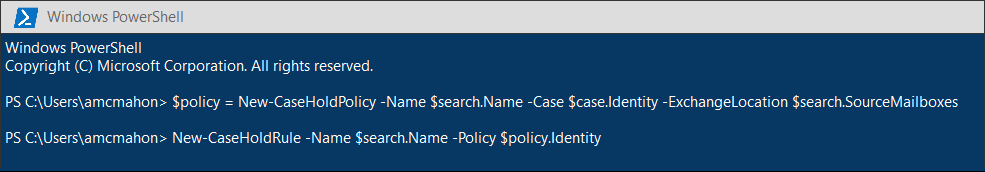

# <a name="migrate-legacy-ediscovery-searches-and-holds-to-the-microsoft-365-compliance-center"></a>將舊版 eDiscovery 搜尋和保留遷移至 Microsoft 365 規範中心

Microsoft 365 合規性中心提供 eDiscovery 使用的改善體驗，包括：更高的可靠性、更好的效能，以及許多針對 eDiscovery 工作流程量身定做的功能，包括案例以查看內容和分析，以協助挑選資料進行審核，例如接近重複的群組、電子郵件執行緒、主題分析和預測編碼。

為了協助客戶利用新的和改善的功能，本文提供如何將 In-Place eDiscovery 搜尋和保留從 Exchange 系統管理中心遷移至 Microsoft 365 規範中心的基本指導方針。

> [!NOTE]
> 因為有許多不同的案例，本文提供將搜尋和保留轉換至 Microsoft 365 規範中心中核心 eDiscovery 案例的一般指導方針。 使用 eDiscovery 案例不一定是必要的，但是會讓您指派許可權來控制哪些人員可以存取您組織中的 eDiscovery 案例，以增加額外的安全性層級。

## <a name="before-you-begin"></a>開始之前

- 您必須是 Security & 合規性中心內 eDiscovery 管理員角色群組的成員，才可執行本文所述的 PowerShell 命令。 您也必須是 Exchange 系統管理中心內「探索管理」角色群組的成員。

- 本文提供如何建立 eDiscovery 暫止功能的指導方針。 保留原則會透過非同步處理常式套用至信箱。 建立 eDiscovery 暫止功能時，您必須同時建立 CaseHoldPolicy 和 New-caseholdrule，否則不會建立保留，也不會將內容位置置於保留狀態。

## <a name="step-1-connect-to-exchange-online-powershell-and-security--compliance-center-powershell"></a>步驟1：連線至 Exchange Online PowerShell 及安全性 & 規範中心 PowerShell

第一步是連線至 Exchange Online PowerShell 及安全性 & 規範中心 PowerShell。 您可以複製下列腳本，將其貼到 PowerShell 視窗，然後執行它。 系統會提示您輸入您要連線之組織的認證。 

```powershell
$UserCredential = Get-Credential
$sccSession = New-PSSession -ConfigurationName Microsoft.Exchange -ConnectionUri https://ps.compliance.protection.outlook.com/powershell-liveid -Credential $UserCredential -Authentication Basic -AllowRedirection
Import-PSSession $sccSession -DisableNameChecking
$exoSession = New-PSSession -ConfigurationName Microsoft.Exchange -ConnectionUri https://ps.outlook.com/powershell-liveid/ -Credential $UserCredential -Authentication Basic -AllowRedirection
Import-PSSession $exoSession -AllowClobber -DisableNameChecking
```

在此 PowerShell 會話中，您必須執行下列步驟中的命令。

## <a name="step-2-get-a-list-of-in-place-ediscovery-searches-by-using-get-mailboxsearch"></a>步驟2：使用 Get-MailboxSearch 取得 In-Place eDiscovery 搜尋的清單

驗證之後，您可以執行 **Get-MailboxSearch** Cmdlet，以取得 In-Place eDiscovery 搜尋的清單。 將下列命令複製並貼到 PowerShell，然後執行它。 會列出搜尋的清單，以及其名稱及任何 In-Place 保留狀態。

```powershell
Get-MailboxSearch
```

Cmdlet 輸出會類似下列所示：


## <a name="step-3-get-information-about-the-in-place-ediscovery-searches-and-in-place-holds-you-want-to-migrate"></a>步驟3：取得 In-Place eDiscovery 搜尋的相關資訊，以及您要遷移的 In-Place 封存

同樣，您會使用 **Get-MailboxSearch** Cmdlet，但這次是取得搜尋的屬性。 您可以將這些屬性儲存在變數中供日後使用。 下列範例會將 **Get-MailboxSearch** Cmdlet 的結果儲存在變數中，然後顯示該搜尋的屬性。

```powershell
$search = Get-MailboxSearch -Identity "Search 1"
```

```powershell
$search | FL
```

這兩個命令的輸出會類似下列所示：


> [!NOTE]
> 在此範例中 In-Place 保留期間 (*ItemHoldPeriod：無限制*) 。 這是 eDiscovery 和法律調查案例的常見功能。 如果保留期間的值與無限期不同，原因可能是因為保留是用於保留案例中的內容。 建議您使用 [New-RetentionCompliancePolicy](/powershell/module/exchange/new-retentioncompliancepolicy) 和 [New-RetentionComplianceRule](/powershell/module/exchange/new-retentioncompliancerule) 保留內容，而不是在安全性 & 規範中心中使用 eDiscovery Cmdlet PowerShell 進行保留案例。 使用這些 Cmdlet 的結果會類似使用 **New-CaseHoldPolicy** 和 **New-CaseHoldRule**，但您可以指定保留期間和保留動作，例如在保留期間到期時刪除內容。 此外，使用保留指令程式不需要您將保留封存與 eDiscovery 案例產生關聯。

## <a name="step-4-create-a-case-in-the-microsoft-365-compliance-center"></a>步驟4：在 Microsoft 365 規範中心建立案例

若要建立 eDiscovery 保留，您必須建立 eDiscovery 案例以關聯保留。 下列範例會使用您選擇的名稱建立 eDiscovery 案例。 我們會將新案例的屬性儲存在變數中供日後使用。 `$case | FL`您可以在建立案例後執行命令，以查看這些屬性。

```powershell
$case = New-ComplianceCase -Name "[Case name of your choice]"
```


## <a name="step-5-create-the-ediscovery-hold"></a>步驟5：建立電子檔保存暫止

在建立案例之後，您可以建立保留，並將它與您在上一個步驟中建立的情況關聯。 請務必記住，您必須建立案例保留原則及案例保留規則。 如果您建立案例保留原則之後未建立案例保留規則，將不會建立 eDiscovery 保留，也不會保留任何內容。

執行下列命令，以重新建立您要遷移的 eDiscovery 保留。 這些範例會使用您要遷移之步驟3中 In-Place 保留的屬性。 第一個命令會建立新的案例保留原則，並將屬性儲存至變數。 第二個命令會建立對應的案例保留規則。

```powershell
$policy = New-CaseHoldPolicy -Name $search.Name -Case $case.Identity -ExchangeLocation $search.SourceMailboxes
```

```powershell
New-CaseHoldRule -Name $search.Name -Policy $policy.Identity
```



## <a name="step-6-verify-the-ediscovery-hold"></a>步驟6：確認 eDiscovery 暫止

若要確認建立保留沒有問題，請確認已成功保留分配狀態。 「分配」表示已將保留套用至上一個步驟中 *ExchangeLocation* 參數所指定的所有內容位置。 若要這麼做，您可以執行 **Get-CaseHoldPolicy** Cmdlet。 因為儲存至您在上一個步驟中建立的 *$policy* 變數的屬性不會在變數中自動更新，所以您需要重新執行 Cmdlet，以確認分配是否成功。 若要成功發佈案例保留原則，可能需要5分鐘到24小時的時間。

執行下列命令，確認已成功發佈 eDiscovery 封存。

```powershell
Get-CaseHoldPolicy -Identity $policy.Identity | Select name, DistributionStatus
```

*DistributionStatus* 屬性的 **Success** 值表示已成功將保留放在內容位置上。 如果分配尚未完成，則會顯示 [ **未決** ] 的值。


## <a name="step-7-create-the-search"></a>步驟7：建立搜尋

最後一個步驟是重新建立您在步驟3中識別的搜尋，並將它與案例建立關聯。 在您建立搜尋之後，您可以使用 **Start-ComplianceSearch** Cmdlet 來執行它，或稍後執行它。

```powershell
New-ComplianceSearch -Name $search.Name -ExchangeLocation $search.SourceMailboxes -ContentMatchQuery $search.SearchQuery -Case $case.name
```


## <a name="step-8-verify-the-case-hold-and-search-in-the-microsoft-365-compliance-center"></a>步驟8：確認案例、保留及搜尋 Microsoft 365 規範中心

若要確定所有專案設定正確，請移至 Microsoft 365 規範中心 [https://compliance.microsoft.com](https://compliance.microsoft.com) ，然後按一下 [ **EDiscovery > Core**]。


您在步驟3中建立的案例會列在 **核心 eDiscovery** 頁面上。 開啟案例，然後注意您在 [ **保留** ] 索引標籤的 [步驟 4] 中所建立的保留。您可以按一下 [保留] 以查看詳細資料，包括保留所用的信箱數目及發行狀態。


您在步驟7中建立的搜尋列在 eDiscovery 案例的 [搜尋] 索引標籤上的 [ **搜尋** ] 索引標籤上。


如果您遷移的是 In-Place eDiscovery 搜尋，但沒有將其與 eDiscovery 案例產生關聯，它會列在 Microsoft 365 規範中心的 [內容搜尋] 頁面上。

## <a name="more-information"></a>其他資訊

- 如需 Exchange 系統管理中心中 In-Place eDiscovery & 保留的詳細資訊，請參閱：
  
  - [就地電子文件](/exchange/security-and-compliance/in-place-ediscovery/in-place-ediscovery)

  - [就地保留與訴訟資料暫留](/exchange/security-and-compliance/in-place-and-litigation-holds)

- 如需本文中所用 PowerShell Cmdlet 的詳細資訊，請參閱：

  - [Get-MailboxSearch](/powershell/module/exchange/get-mailboxsearch)
  
  - [新 Get-compliancecase](/powershell/module/exchange/new-compliancecase)

  - [New-CaseHoldPolicy](/powershell/module/exchange/new-caseholdpolicy)
  
  - [New-CaseHoldRule](/powershell/module/exchange/new-caseholdrule)

  - [Get-CaseHoldPolicy](/powershell/module/exchange/get-caseholdpolicy)
  
  - [New-ComplianceSearch](/powershell/module/exchange/new-compliancesearch)

  - [Start-ComplianceSearch](/powershell/module/exchange/start-compliancesearch)

- 如需 Microsoft 365 規範中心的詳細資訊，請參閱 [microsoft 365 規範中心概述](microsoft-365-compliance-center.md)。