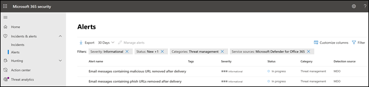

# 適用於 Office 365 的 Microsoft Defender 中的新警示原則

適用於 Office 365 的 Microsoft Defender 引進了與傳遞後偵測相關的全新改良警示原則。 這包括與自動化調查與回應 (AIR) 劇本相關聯的增強功能。 此外，我們正在修改六個預設警示原則的嚴重性分類，以更符合這些警示對貴組織的影響。

## 傳遞後偵測

在適用於 Office 365 的 Microsoft Defender 零時差自動清除 (ZAP) 將郵件從信箱移除之後，我們將引進四個新的與傳遞後偵測相關的預設警示原則。 這四個新的警示原則將取代涵蓋 ZAP 案例的兩個現有預設警示原則，並提供組織有關基礎偵測和相關指示器的增強詳細資料。 這些警示 (以及會從這些警示觸發的 AIR 劇本) 會正確捕捉電子郵件和實體的威脅，包括 URL 指向惡意檔案或檔案是否包含惡意 URL。

下表列出將移除的新警示原則和現有的警示原則。 請參閱[對貴組織有何影響](#how-this-will-affect-your-organization)一節，以了解有關推出的詳細資訊。

| 新增或現有的警示原則 | 警示原則名稱 | 警示原則識別碼|
|:-----------------------------|:----------------|:--------------|
| 新增| **傳遞後移除包含惡意 URL 的電子郵件訊息**   | 8e6ba277-ef39-404e-aaf1-294f6d9a2b88 |
| 新增| **傳遞後移除包含惡意檔案的電子郵件訊息**  | 4b1820ec-39dc-45f3-abf6-5ee80df51fd2 |
| 新增| **已傳遞來自行銷活動的電子郵件訊息，稍後再移除** | c8522cbb-9368-4e25-4ee9-08d8d899dfab |
| 新增|**傳送後即移除的電子郵件訊息**                | b8f6b088-5487-4c70-037c-08d8d71a43fe |
| 現有 (將移除)| **傳遞後移除包含網路釣魚 URL 的電子郵件訊息**| EA8169FA-0678-4751-8854-AEBEA7ADECEB |
| 現有 (將移除)| **傳遞後移除包含惡意郵件的電子郵件訊息**| 0179B3F7-3FDA-40C3-8F24-278563978DBB |
||||

## 警示嚴重性增強功能

下表識別正在修改其嚴重性分類的預設警示原則。我們正在變更這些警示原則的嚴重性分類，以更符合貴組織的潛在風險和影響，以及協助安全性小組排定由這些警示所產生的警示優先順序。

| 提醒| 警示原則識別碼| 舊嚴重性| 新嚴重性  |
|:----------|:---------------|:------------|:--------------|
| **可疑的電子郵件轉寄活動**| BFD48F06-0865-41A6-85FF-ADB746423EBF | 中| 高|
| **使用者報告為惡意郵件或網路釣魚的電子郵件** | B26A5770-0C38-434A-9380-3A3C2C27BBB3 | 參考 | 低|
| **報告為網路釣魚的電子郵件異常增加** | A00D8C62-9320-4EEA-A7E5-966B9AC09558 | 高| 中 |
| **系統管理員提交結果已完成** | AE9B83DD-6039-4EA9-B675-6B0AC3BF4A41 | 低| 參考 |
| **建立轉寄/重新導向規則** | D59A8FD4-1272-41EE-9408-86F7BCF72479 | 低| 參考 |
| e **探索搜尋已啟動或匯出**| 6FDC5710-3998-47F0-AFBB-57CEFD7378AE | 中| 參考 |
|||||

## 何時會進行這些變更

下表指出新警示原則何時開始觸發傳遞後警示。 資料表也會識別兩個現有警示原則的移除時間。

| 警示原則| 日期 |
|:------------|:-----|
| **傳遞後移除包含惡意 URL 的電子郵件** (新) | 警示將於 2021 年 4 月 11 日開始觸發|
| **傳遞後移除包含惡意檔案的電子郵件** (新) | 警示將於 2021 年 4 月 11 日開始觸發 |
| **已傳遞來自行銷活動的電子郵件訊息，稍後再移除** (新) | 警示將於 2021 年 5 月 28 日開始觸發|
| **已傳遞惡意電子郵件，稍後再移除** (新) | 警示將於 2021 年 5 月 28 日開始觸發|
| **傳遞後移除包含網路釣魚 URL 的電子郵件訊息** (現有，將會移除)| 警示原則將於 2021 年 5 月 28 日移除。 請參閱[對於這些變更所需做的準備](#what-you-need-to-do-to-prepare-for-these-changes)章節。|
| **傳遞後移除包含惡意程式碼的電子郵件** (現有，將會移除) | 警示原則將於 2021 年 5 月 28 日移除。 請參閱[對於這些變更所需做的準備](#what-you-need-to-do-to-prepare-for-these-changes)章節。 |
|||

警示嚴重性變更將於 2021 年 5 月 14 日推出至所有組織。

## 這對您的組織有何影響

新的警示將會開始引發，並觸發貴組織中上述日期的 AIR 調查。 為了降低對已操作這兩個要移除之警示的安全性組織的影響，您將看到現有警示原則所觸發的警示，*以及* 新警示原則在 2021 年 4 月 5 日到 2021 年 5 月 28 日之間所觸發的警示。 這是為了提供安全性小組處理所需變更的時間。 為了協助安全性小組在短期間增加警示量，現有的警示和新警示都會相關聯至相同的 AIR 調查，並相關聯至相同的事件。 更具體來說，這包括警示、AIR 調查和事件的下列行為：

- **警示**：根據設計，您將看到現有與新警示的下列警示組：

  - **在傳遞後移除包含網路釣魚 URL 的電子郵件** 以及 **在傳遞後移除包含惡意 URL 的電子郵件訊息**

  - **在傳遞後移除包含惡意程式碼的電子郵件** 以及 **傳遞後移除包含惡意檔案的電子郵件訊息**

  

   如需管理這些警示組的資訊，請參閱[對於這些變更所需做的準備](#what-you-need-to-do-to-prepare-for-these-changes)章節。

- **AIR 調查**：警示會相關聯至單一 AIR 調查，其中一個警示分類為「觸發」，另一個則分類為「重複」。

  

- **事件**：這兩個警示將相互關聯到相同的事件

  

## 對於這些變更所需做的準備

您所需做的準備取決於貴組織使用這些警示的方式。 如果您已經操作警示，且透過 API、警示電子郵件通知或在 Office 365 安全性與合規性中心 (`https://protection.office.com/viewalerts`) 或 Microsoft 資訊安全中心 (`https://security.microsoft.com/viewalerts`) 使用或使用警示，您必須修改您的工作流程。

**如果您尚未操作這些警示，您可以執行下列其中一項操作：**

- 停用下列警示原則 (其即將移除) 以減少貴組織的警示數量：

  - **傳遞後移除包含網路釣魚 URL 的電子郵件訊息**

  - **傳遞後移除包含惡意郵件的電子郵件訊息**

- 什麼也不做。我們將在 2021 年 5 月 28 日停用現有的警示原則。

**如果您已經操作這些警示：**

- 開始將耗用新警示排入工作流程中，以因應現有的警示原則於 2021 年 5 月 28 日移除。 如果您的票證系統中有自訂邏輯、收到警示電子郵件通知的安全性信箱，或相依於警示名稱或警示原則識別碼 (CorrelationId) 的 SIEM 解決方案，您必須修改邏輯以配合變更。

  > [!NOTE]
  > 警示、調查及事件中的資訊並未變更。 事實上，這項資訊已經過增強，並包含與其相關聯之威脅的其他詳細資料。

- 完成修改之後，您可以停用現有的警示原則，以減少貴組織的警示數量：

  - **傳遞後移除包含網路釣魚 URL 的電子郵件訊息**

  - **傳遞後移除包含惡意郵件的電子郵件訊息**

  或者，您可以讓這些警示原則保持啟用，直到我們於 2021 年 5 月 28 日加以刪除為止。
