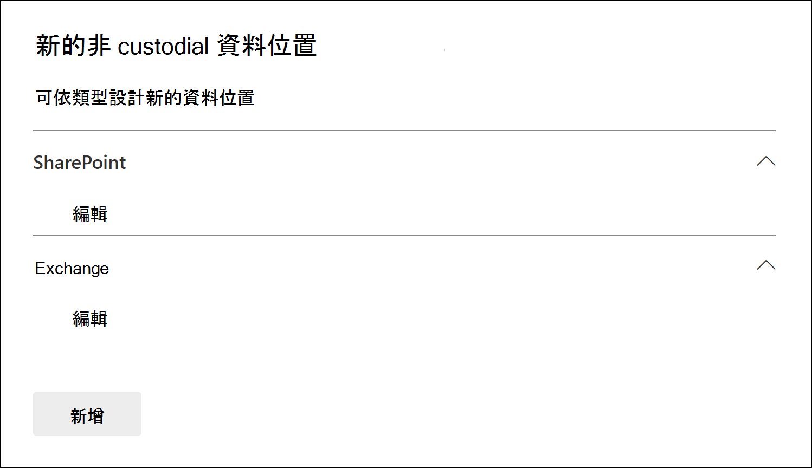

# 將非 custodial 資料來源新增至 Advanced eDiscovery 案例

在 Advanced eDiscovery 案例中，它不一定會符合您在案例中將 Microsoft 365 資料來源與系統管理員相關聯的需求。 不過，您可能還需要將該資料與案例產生關聯，以便進行搜尋、將其新增至審閱集合，以及加以分析和審閱。 Advanced eDiscovery 中的功能稱為「*非 custodial 資料來源*」，可讓您將資料新增至案例，而不需將其關聯至保管人。 它也會將相同的 Advanced eDiscovery 功能套用至可用於與保管人相關聯之資料的非 custodial 資料。 您可以套用至非 custodial 資料的兩個最實用專案是保留，並使用 [高級索引](indexing-custodian-data.md)進行處理。

## 新增非 custodial 的資料來源

請遵循下列步驟，在 Advanced eDiscovery 案例中新增及管理非 custodial 的資料來源。

1. 在 [ **Advanced eDiscovery** ] 首頁上，按一下您要新增資料的案例。

2. 按一下 [**資料來源**] 索引標籤，然後按一下 [**新增資料來源**  >  **新增資料位置**]。

3. 在 [ **新增非 custodial 資料位置** ] 飛入頁面上，選擇您想要新增至案例的資料來源。 您可以展開 **SharePoint** 或 **Exchange** 區段，然後按一下 [**編輯**]，以新增多個信箱和網站。

   

   - **SharePoint** -按一下 [**編輯**] 以新增網站。 選取清單中的網站，或在搜尋列中輸入網站的 URL，即可搜尋網站。 選取您要新增為非保管人資料來源的網站，然後按一下 [ **新增**]。

   - **Exchange** -按一下 [**編輯**] 以新增信箱。 在信箱或通訊群組的搜尋方塊中，輸入名稱或別名 (至少三個字元) 。 選取您要新增為非保管人資料來源的信箱，然後按一下 [ **新增**]。

   > [!NOTE]
   > 您可以使用 **SharePoint** 和 **Exchange** 區段，將與小組或 Yammer 群組相關聯的網站和信箱新增為非 custodial 資料來源。 您必須另外新增與小組或 Yammer 群組相關聯的信箱與網站。

4. 在您新增非 custodial 資料來源之後，您可以選擇將這些位置置於保留狀態。 選取或取消選取資料來源旁的 [ **保留** ] 核取方塊，以置於保留狀態。

5. 在 [**新增非 custodial 資料位置**] 彈出頁面的底部 **，按一下 [** 新增]，將資料來源新增至案例。

   您新增的每個非 custodial 資料來源都會列在 [ **資料來源** ] 頁面上。 非 custodial 資料來源是由 [**來源類型**] 欄中的 [**資料位置**] 值所識別。

   ![[資料來源] 索引標籤上的非 custodial 資料來源](../media/NonCustodialDataSources2.png)

在將非 custodial 資料來源新增至案例之後，會建立名為 *索引標籤非 custodial 資料* 的作業，並顯示在案例的 [ **工作** ] 索引標籤上。 在建立工作之後，起始的高級索引處理常式和資料來源都會重新編制索引。

## 管理非 custodial 資料來源的保留

在非 custodial 資料來源上進行保留後，會自動建立包含案例的非 custodial 資料來源的保留原則。 當您將其他非 custodial 資料來源置於保留狀態時，會將它們新增至此保留原則。

1. 開啟 Advanced eDiscovery 案例，然後選取 [**保留**] 索引標籤。

2. 按一下 [ **NCDSHold \<GUID\>**]，其中 GUID 值是唯一的案例。

   飛入頁面顯示暫止的非 custodial 資料來源的資訊和統計資料。

   ![[非 custodial 資料來源保留] 的飛出頁面會顯示 [統計資料]](../media/NonCustodialDataSourcesHoldFlyout.png)

3. 按一下 [ **編輯保留** ]，以查看置於保留狀態的非 custodial 資料來源，並執行下列管理工作：

   - 在 [ **位置** ] 頁面上，您可以從保留中移除非 custodial 資料來源，將其解除。 釋放資料來源並不會從案例中移除非 custodial 資料來源。 它只會移除放在資料來源上的保留。

   - 在 [ **查詢** ] 頁面上，您可以編輯 [保留]，以在案例中建立套用至所有 tha 非 custodial 資料來源的查詢型保留。
