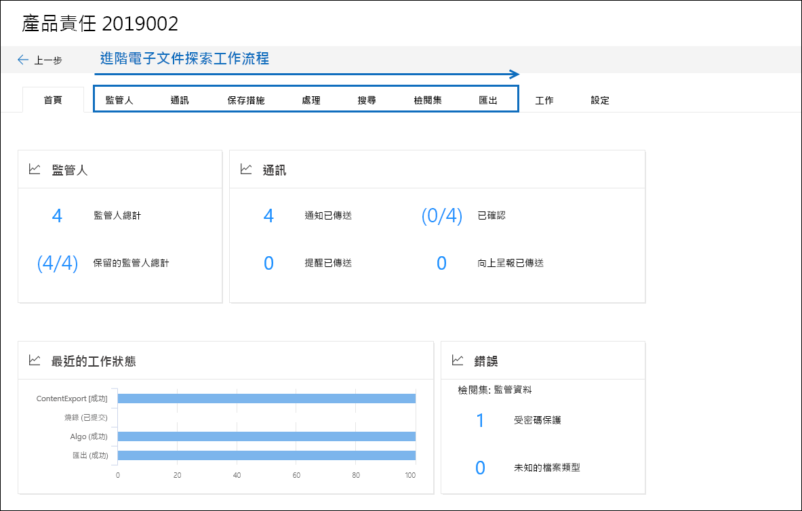

# Microsoft 365 中的高級 eDiscovery 解決方案概述Overview of the Advanced eDiscovery solution in Microsoft 365

Microsoft 365 中的「高級 eDiscovery 解決方案」是以 Office 365 中現有的 eDiscovery 和分析功能為基礎。The Advanced eDiscovery solution in Microsoft 365 builds on the existing eDiscovery and analytics capabilities in Office 365. 這個新的解決方案稱為「 *高級 eDiscovery*」，提供了端對端工作流程，可保留、收集、審閱、分析及匯出回應組織內部和外部調查的內容。This new solution, called *Advanced eDiscovery*, provides an end-to-end workflow to preserve, collect, review, analyze, and export content that's responsive to your organization's internal and external investigations. 它也可讓法律團隊管理整個法律封存通知工作流程，以與案例中的保管人進行通訊。It also lets legal teams manage the entire legal hold notification workflow to communicate with custodians involved in a case. 

> [!NOTE]
> 「高級 eDiscovery」需要 Office 365 或 Microsoft 365 E5 Enterprise 訂閱。Advanced eDiscovery requires an Office 365 or Microsoft 365 E5 Enterprise subscription. 如需有關高級 eDiscovery 授權的詳細資訊，請參閱 [Microsoft 365 授權指南以取得安全性 & 合規性](https://docs.microsoft.com/office365/servicedescriptions/microsoft-365-service-descriptions/microsoft-365-tenantlevel-services-licensing-guidance/microsoft-365-security-compliance-licensing-guidance#advanced-ediscovery)。For more information about Advanced eDiscovery licensing, see [Microsoft 365 licensing guidance for security & compliance](https://docs.microsoft.com/office365/servicedescriptions/microsoft-365-service-descriptions/microsoft-365-tenantlevel-services-licensing-guidance/microsoft-365-security-compliance-licensing-guidance#advanced-ediscovery).

## 與 EDRM 對齊Alignment with EDRM

Advanced eDiscovery 的內建工作流程會與「電子探索」參考模型 (EDRM) 所述的 eDiscovery 程式對齊。The built-in workflow of Advanced eDiscovery aligns with the eDiscovery process outlined by the Electronic Discovery Reference Model (EDRM). 

 (圖像來源 edrm.net。(Image source courtesy of edrm.net. 來源影像可在 [創造性 Commons 歸屬 3.0 Unported 授權] 下取得。 ) The source image was made available under Creative Commons Attribution 3.0 Unported License.)

在高層次上，以下是 Advanced eDiscovery 如何支援 EDRM 工作流程的方式：At a high level, here's how Advanced eDiscovery supports the EDRM workflow:

- **識別。****Identification.** 在您找出調查中潛在感興趣的人員之後，您可以將其新增為保管人 (也稱為「 *資料保管人*」，因為它們可能具有與調查) 相關的資訊，以供高級 eDiscovery 案例使用。After you identify potential persons of interest in an investigation, you can add them as custodians (also called *data custodians*, because they may possess information that's relevant to the investigation) to an Advanced eDiscovery case. 將使用者新增為保管人後，就很容易保留、收集和審查保管人檔。After users are added as custodians, it's easy to preserve, collect, and review custodian documents.

- **保存。****Preservation.** 為了保留及保護與調查相關的資料，「高級 eDiscovery」可讓您在案例中對保管人相關聯的資料來源進行合法保留。To preserve and protect data that's relevant to an investigation, Advanced eDiscovery lets you place a legal hold on the data sources associated with the custodians in a case. 您也可以將非 custodial 資料置於保留狀態。You can also place non-custodial data on hold. Advanced eDiscovery 也有內建的通訊工作流程，因此您可以將法律封存通知傳送給保管人，並追蹤其確認。Advanced eDiscovery also has a built-in communications workflow so you can send legal hold notifications to custodians and track their acknowledgments.

- **收集。****Collection.** 在您識別 (和保留) 與調查相關的資料來源之後，您可以在高級 eDiscovery 搜尋中使用內建的搜尋工具，並從 custodial 資料來源中收集即時資料， (和非 custodial 的資料來源（如果適用) 可能與案例相關）。After you identified (and preserved) the data sources relevant to the investigation, you can use the built-in search tool in Advanced eDiscovery search for and collect live data from the custodial data sources (and non-custodial data sources, if applicable) that may be relevant to the case.

- **處理。****Processing.** 在您收集所有與案例相關的資料之後，下一步是處理它以進一步複查和分析。After you've collected all data relevant to the case, the next step is process it for further review and analysis. 在 [Advanced eDiscovery] 中，您在集合階段中所識別的就地資料會複製到 Azure 存放位置， (稱為「 *複查集* 」) ，可為您提供案例資料的靜態視圖。In Advanced eDiscovery, the in-place data that you identified in the collection phase is copied to an Azure Storage location (called a *review set*), which provides you with a static view of the case data. 
 
- **檢討。****Review.** 將資料新增至審閱集後，您就可以查看特定的檔，並執行另一個查詢，將資料降至與案例最為相關的資料。After data has been added to a review set, you can view specific documents and run another queries to reduce the data to what is most relevant to the case. 此外，還可以批註及標記特定檔。Also, can annotate and tag specific documents.
 
- **分析。****Analysis.** 「高級 eDiscovery」提供整合式分析工具，可協助您進一步剔除您決定不與調查相關的複查集的資料。Advanced eDiscovery provides integrated analytics tool that helps you further cull data from the review set that you determine isn't relevant to the investigation. 除了減少相關資料的數量之外，高級 eDiscovery 也可協助您組織內容，讓審查程式更輕鬆且更有效率，以節省法律考評成本。In addition to reducing the volume of relevant data, Advance eDiscovery also helps you save legal review costs by letting you organize content to make the review process easier and more efficient.

- **生產** 及 **簡報。****Production** and **Presentation.** 當您準備好時，您可以從審閱集中匯出檔，以進行法律考評。When you're ready, you can export documents from a review set for legal review. 您可以以原生格式或以 EDRM 指定的格式匯出檔，以便將其匯入協力廠商的審閱應用程式。You can export documents in their native format or in an EDRM-specified format so they can be imported into third-party review applications.

## 高級 eDiscovery 工作流程Advanced eDiscovery workflow

下列各節將說明在高級 eDiscovery 中內建工作流程中的每個步驟。The following sections describe each step in the built-in workflow in Advanced eDiscovery. 下列螢幕擷取畫面顯示名為*Product 債務 2019002*之案例的 [**首頁**] 索引標籤。The following screenshot shows the **Home** tab of a case named *Product Liability 2019002*. 附注頁面頂端的工作流程索引標籤會被排序，以與 EDRM 處理常式對齊。Note the workflow tabs at the top of the page are sequenced to align with the EDRM process. 

如需有關在高級 eDiscovery 中的端對端工作流程的詳細資訊，請參閱這段 [Microsoft 的機械影片](https://go.microsoft.com/fwlink/?linkid=2066133)。For more information about the end-to-end workflow in Advanced eDiscovery, see this [Microsoft Mechanics video](https://go.microsoft.com/fwlink/?linkid=2066133).

## 管理保管人和非 custodial 資料來源Managing custodians and non-custodial data sources

使用 [ **來源** ] 索引標籤，新增及管理您已在案例中識別為感興趣的人員，以及其他可能未與保管人相關聯的資料來源。Use the **Sources** tab to add and manage the people that you've identified as persons of interest in the case and other data sources that may not be associated with a custodian. 當您新增保管人或非 custodial 資料來源時，您可以快速執行諸如對保管人和非 custodial 資料來源進行合法保留、與保管人進行通訊，以及搜尋保管人和非 custodial 資料來源的動作，以收集與案例相關的內容。When you add custodians or non-custodial data sources, you can quickly perform actions like placing a legal hold on custodian and non-custodial data sources, communicating with custodians, and searching custodian and non-custodial data sources to collect content that's relevant to the case. 隨著案例的進展，您可以輕鬆地新增保管人或非 custodial 日期來源，或從案例發行。As the case progresses, it's easy to add new custodians or non-custodial date sources or release them from the case. 如需詳細資訊，請參閱 [Advanced eDiscovery 中的使用保管人](managing-custodians.md)。For more information, see [Work with custodians in Advanced eDiscovery](managing-custodians.md).

## 管理合法保留通知Managing legal hold notifications

在案例中，使用 [ **通訊** ] 索引標籤來管理與保管人進行通訊的處理常式。Use the **Communications** tab to manage the process of communicating with the custodians in the case. 法律保留通知會指示保管人保留與案例相關的任何內容。A legal hold notice instructs custodians to preserve any content that's relevant to the case. 法律團隊必須能夠追蹤由保管人接收、讀取及認可的通知。Legal teams must be able to track the notices that have been received, read, and acknowledged by custodians. 「高級 eDiscovery」中的通訊工作流程可讓您建立及傳送初始通知、提醒、發行通知，以及在保管人無法認可保留通知時進行升級。The communications workflow in Advanced eDiscovery allows you to create and send initial notifications, reminders, release notices, and escalations if custodians fail to acknowledge a hold notification. 如需詳細資訊，請參閱使用 [高級 eDiscovery 中的通訊](managing-custodian-communications.md)。For more information, see [Work with communications in Advanced eDiscovery](managing-custodian-communications.md).

## 管理內容保留Managing content preservation

當您將系統管理員新增至案例時，您可以在 custodial 資料上進行保留。When you add a custodian to a case, you can place a hold on custodial data. 使用 [ **保留** ] 索引標籤可管理您新增保管人時所建立的保留，以及管理與案例相關聯的其他法律保留;例如，您可以識別並對非 custodial 資料來源進行保留。Use the **Holds** tab to manage the hold created when you add custodians, and to manage other legal holds associated with the case; for example, you can identify and place a hold on non-custodial data sources. 您也可以編輯案例中的任何保留，並讓它成為查詢型保留，只保留符合查詢的內容。You can also edit any hold in the case and make it a query-based hold to preserve only the content that matches the query. 例如，您可以將日期範圍新增至保留，只保留在特定日期範圍內建立的內容。For example, you could add a date range to the hold so that only content created within a specific date ranged in preserved. 您也可以取得暫止內容的統計資料，並在不再與案例相關後移除保留，或加以刪除。You can also get statistics on content that's on hold, remove the hold after it's no longer relevant to the case, or delete it. 如需詳細資訊，請參閱 [Manage 封存 In Advanced eDiscovery](managing-holds.md)。For more information, see [Manage holds in Advanced eDiscovery](managing-holds.md).

## 索引保管人資料Indexing custodian data

當您將保管人和對應的 custodial 資料來源新增至案例時，來自保管人資料來源的任何已編制索引的專案都會由稱為「 *高級索引*」的處理常式重新編制索引。When you add a custodian and the corresponding custodial data sources to a case, any partially indexed item from a custodian data source is re-indexed by a process called *Advanced indexing*. 這可讓您執行搜尋來收集資料時，custodial 內容（如影像、不支援的檔案類型，以及其他可能未編制索引的內容，以完全可供搜尋）。This allows custodial content such as images, unsupported file types, and other potentially unindexed content to be fully searchable when you run searches to collect data for the case. 使用 [ **處理** ] 索引標籤，監控高級索引的狀態，並使用稱為「 *錯誤修正*」的處理常式修正處理錯誤。Use the **Processing** tab to monitor the status of Advanced indexing and fix processing errors by using a process called *error remediation*. 如需詳細資訊，請參閱 [在高級 eDiscovery 中修正處理錯誤](processing-data-for-case.md)。For more information, see [Fix processing errors in Advanced eDiscovery](processing-data-for-case.md).

## 收集案例資料Collecting case data

使用 [ **搜尋** ] 索引標籤來建立搜尋，以搜尋與案例相關之內容的就地 custodial 和非 custodial 資料來源。Use the **Searches** tab to create searches to search the in-place custodial and non-custodial data sources for content relevant to the case. 您可以使用關鍵字和) 條件來建立及執行查詢型搜尋 (，以識別一組與案例相關的電子郵件訊息和檔，以及您想要在 eDiscovery 工作流程的後續步驟中進一步複查及分析的檔。You can create and run query-based searches (using keywords and conditions) to identify a set of email messages and documents that are relevant to the case and that you want to further review and analyze in subsequent steps in the eDiscovery workflow. 您可以建立一個或多個與案例相關聯的搜尋。You can create one or more searches associated with the case. 您也可以使用搜尋工具來預覽範例檔，並查看搜尋統計資料，以協助您優化和改善搜尋結果。You can also use the search tool to preview sample documents and view search statistics to help you refine and improve the search results. 當您認為搜尋結果包含與案例相關的所有資料時，您可以將搜尋結果新增至審閱集，以便進一步複查、分析和剔除。After you're satisfied the search results contain the all data relevant to the case, you add the search results to a review set for further review, analysis, and culling. 如需詳細資訊，請參閱 [在高級 eDiscovery 中收集案例的資料](collecting-data-for-ediscovery.md)。For more information, see [Collect data for a case in Advanced eDiscovery](collecting-data-for-ediscovery.md).

## 檢查及分析案例資料Reviewing and analyzing case data

使用 [ **檢查集合** ] 索引標籤，以複查及分析您從即時系統收集的內容，並將其新增至審閱集。Use the **Review sets** tab to review and analyze the content that you've collected from the live system and added to a review set. 「 *審閱集* 」是該資料的靜態集合，也就是該資料 (的離線副本，也就是您在 eDiscovery 工作流程的先前階段中所收集的資料) 的離線副本 (和可用的非 custodial 資料) 。A *review set* is a static collection of that data (in other words, an offline copy of data) of custodial data (and if applicable, non-custodial data) that you collected in the previous phase of the eDiscovery workflow. 當您將搜尋結果新增至審閱集時，會觸發從容器提取檔案、解壓縮中繼資料及提取文字的程式。When you add search results to a review set, a process is triggered that extracts files from containers, extracts metadata, and extracts text. 完成此程式後，系統會為所有從保管人收集的資料建立新的索引，並將其新增至審閱集。When this process is complete, the system builds a new index of all the data collected from custodians and adds it to the review set. 將資料新增至審閱集之後，您可以執行更多的查詢來縮小案例資料、以文字形式或原生檔案格式查看資料，以及在審閱集中批註、標記密文及標記檔。After the data is added to the review set, you can run more queries to narrow the case data, view data as text or in the native file format, and annotate, redact, and tag documents in the review set. 您也可以執行高級分析，例如識別檔重複、電子郵件執行緒及主題。You can also perform advanced analytics such as identify document duplication, email threading, and themes. 在您只 culled 資料與案例相關的資料之後，您可以直接下載檔案或連同檔案中繼資料、批註及任何標記一起匯出。After you've culled the data to only what is relevant to the case, you can either download documents directly or export them along with file metadata, annotations, and any tags. 如需詳細資訊，請參閱：For more information, see:

- [檢視檢閱集中的文件View documents in a review set](view-documents-in-review-set.md)

- [查詢檢視集中的資料Query the data in a review set](review-set-search.md)

- [標記檢閱集中的文件Tag documents in a review set](tagging-documents.md)

- [分析審閱集中的資料Analyze data in a review set](analyzing-data-in-review-set.md)

## 匯出資料以供審閱及簡報Exporting data for review and presentation

在您從複查集匯出資料後，請使用 [ **匯出** ] 索引標籤來管理匯出工作，並從審閱集中下載資料。After you export the data from a review set, use the **Exports** tab to manage an export job and download data from a review set. 當您匯出審閱集時，會將資料上傳至 Microsoft 提供的 Azure 存放位置， (或您的組織所管理的 Azure 儲存體位置) 。When you export a review set, the data is uploaded to a Microsoft-provided Azure Storage location (or an Azure Storage location managed by your organization). 將其上傳至 Azure 後，它就可以下載到本機電腦。After it's uploaded to Azure, it's then and available to download to a local computer. 您可以在 [ **匯出** ] 索引標籤上，取得下載匯出資料所需的儲存評估金鑰。如需詳細資訊，請參閱 [在高級電子檔探索中匯出案例資料](exporting-data-ediscover20.md)。You can obtain the storage assess key necessary to download the exported data on the **Exports** tab. For more information, see [Export case data in Advanced eDiscovery](exporting-data-ediscover20.md).

## 管理工作Managing jobs

使用 [ **工作** ] 索引標籤，針對您已啟動的案例相關工作，監視長期執行的處理常式。Use the **Jobs** tab to monitor long-running processes for case-related tasks that you've initiated. 工作範例包括與重設索引、搜尋及匯出案例資料相關的範例。Examples of jobs include ones related to reindexing, searching, and exporting case data. 例如，如果您在包含許多資料來源的 [ **搜尋** ] 索引標籤上建立搜尋，該搜尋程式的狀態將會顯示在 [ **工作** ] 索引標籤上。如需詳細資訊，請參閱 [在高級 eDiscovery 中管理工作](managing-jobs-ediscovery20.md)。For example, if you create a search on the **Searches** tab that includes many data sources, the status of this search process will be displayed on the **Jobs** tab. For more information, see [Manage jobs in Advanced eDiscovery](managing-jobs-ediscovery20.md).

## 設定案例設定Configuring case settings

使用 [ **設定** ] 索引標籤來設定全案例設定。Use the **Settings** tab to configure case-wide settings. 這包括新增成員至案例、關閉或刪除案例，以及設定搜尋及分析設定。This includes adding members to a case, closing or deleting a case, and configuring search and analytics settings.
