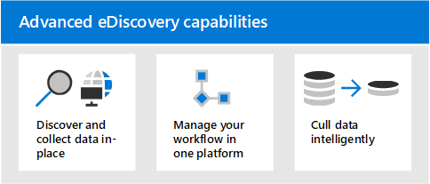

# Microsoft 365 Advanced eDiscovery 概述

Microsoft 365 中的「高級 eDiscovery 解決方案」是以現有的 Microsoft eDiscovery 和分析功能為基礎。 Advanced eDiscovery 提供端對端的工作流程，可保留、收集、分析、審閱、分析及匯出回應組織內部和外部調查的內容。 它也可讓法律團隊管理整個法律封存通知工作流程，以與案例中的保管人進行通訊。

## 高級 eDiscovery 功能

「高級 eDiscovery」可協助您的組織透過發現其所在的資料來回應法律問題或內部調查。 您可以透過找出感興趣的人員及其資料來源，以無縫方式套用保留以保留資料，然後管理合法暫止通訊程式，以順利管理 eDiscovery 工作流程。 透過從來源收集資料，您可以搜尋即時的 Microsoft 365 平臺，以快速找到您需要的專案。 智慧、機器學習功能（如深入索引、電子郵件執行緒及近期重複偵測）也可協助您將大量資料降至相關的資料集。

下列各節說明這些高級 eDiscovery 功能可如何協助您的組織。

### 探索及收集就地資料

傳統上，依賴多個協力廠商 eDiscovery 解決方案的組織，需要從 Microsoft 365 複製大量的資料以處理，並必須存放重複的資料。 這項必要條件可增加尋找相關資料的時間，以及管理多個解決方案的風險、成本和複雜性。

Microsoft 365 中的「高級 eDiscovery」可讓您探索來源中的資料，並保持在您的 Microsoft 365 安全性和合規性界限內。  透過從即時系統收集資料，「高級 eDiscovery」可減少回到來源的摩擦，並減少需要找出遺失內容的不必要工作，這通常是在傳統 eDiscovery 解決方案中的日誌記錄滯後時發生。

在團隊、Yammer、SharePoint Online、商務 OneDrive 和 Exchange Online 中，資料的原生搜尋與收集功能會進一步增強資料探索。 例如，「高級 eDiscovery」：

- 重新建立小組交談 (，而不是傳回從交談) 中的個別郵件。

- 透過電子郵件訊息和團隊聊天中的連結或新式附件，收集與使用者共用的雲端式內容。

- 具有數百個非 Microsoft 365 檔案類型的內建支援。

- 會收集協力廠商來源的資料 (例如 Bloomberg、Facebook、寬限時間及縮放會議) ，這些會議是透過 [資料連線器](archiving-third-party-data.md)匯入和封存于 Microsoft 365。

### 在單一平臺中管理 eDiscovery 工作流程

「高級 eDiscovery」可協助您減少所需依賴的 eDiscovery 解決方案數目。 它提供簡化的端對端工作流程，所有這些工作流程都會在 Microsoft 365 內進行。 「高級 eDiscovery」會透過自動將唯一和共用資料來源對應至 (稱為 *保管人*) 的相關人員，以及在收集資料以進行分析和審閱之前，先提供報表和分析，以減少識別及收集相關資訊來源的摩擦。

此外，Microsoft Graph APIs 可協助您自動化 eDiscovery 工作流程，並擴充自訂解決方案的高級 eDiscovery。

### 智慧挑選資料

Advanced eDiscovery 中的智慧機學習功能可協助您減少要檢查的資料量。 這些智慧功能可協助您減少及挑選大量的資料至相關集。 例如，內建的審閱集查詢可識別重複的重複專案，以協助只為唯一的內容篩選。 這項功能可大幅減少要檢查的資料量。

其他機器學習功能可進一步精煉及識別使用智慧標籤和技術協助審閱工具（如相關性模組）的相關資料。

## 使用電子探索參考模型的高級 eDiscovery 對齊方式

Microsoft 365 中的高級 eDiscovery 內建的內建工作流程，會與「電子探索參考模型」所述的 eDiscovery 程式（ (EDRM) ）對齊。

 (圖像來源 edrm.net。 來源影像可在 [創造性 Commons 歸屬 3.0 Unported 授權] 下取得。 ) 

在高層次上，以下是 Advanced eDiscovery 如何支援 EDRM 工作流程的方式：

- **識別。** 在您找出調查中潛在感興趣的人員之後，您可以將其新增為保管人 (也稱為「 *資料保管人*」，因為它們可能具有與調查) 相關的資訊，以供高級 eDiscovery 案例使用。 將使用者新增為保管人後，就很容易保留、收集和審查保管人檔。

- **保存。** 為了保留及保護與調查相關的資料，「高級 eDiscovery」可讓您在案例中對保管人相關聯的資料來源進行合法保留。 您也可以將非 custodial 資料置於保留狀態。 Advanced eDiscovery 也有內建的通訊工作流程，因此您可以將法律封存通知傳送給保管人，並追蹤其確認。

- **收集。** 在您識別 (和保留) 與調查相關的資料來源之後，您可以在高級 eDiscovery 搜尋中使用內建的搜尋工具，並從 custodial 資料來源中收集即時資料， (和非 custodial 的資料來源（如果適用) 可能與案例相關）。

- **處理。** 在您收集所有與案例相關的資料之後，下一步是處理它以進一步複查和分析。 在 [Advanced eDiscovery] 中，您在集合階段中所識別的就地資料會複製到 Azure 存放位置， (稱為「 *複查集* 」) ，可為您提供案例資料的靜態視圖。 

- **檢討。** 將資料新增至審閱集後，您就可以查看特定的檔，並執行額外的查詢，將資料縮小至與案例最為相關的資料。 此外，還可以批註及標記特定檔。

- **分析。** 「高級 eDiscovery」提供整合式分析工具，可協助您進一步剔除您決定不與調查相關的複查集的資料。 除了減少相關資料的數量之外，高級 eDiscovery 也可協助您組織內容，讓審查程式更輕鬆且更有效率，以節省法律考評成本。

- **生產** 及 **簡報。** 當您準備好時，您可以從審閱集中匯出檔，以進行法律考評。 您可以以原生格式或以 EDRM 指定的格式匯出檔，以便將其匯入協力廠商的審閱應用程式。

## 訂閱與授權

「高級 eDiscovery」的授權需要適當的組織訂閱和每一使用者授權。

- **組織訂閱：** 若要存取 Microsoft 365 規範中心的高級 eDiscovery，您的組織必須具備下列其中一項：

  - Microsoft 365 E5 或 Office 365 E5 訂閱
  
  - 含 E5 合規性附加元件的 Microsoft 365 E3 訂閱

  - 具有 E5 電子檔探索和審核附加元件的 Microsoft 365 E3 訂閱

  如果您沒有現有的 Microsoft 365 E5 計畫，且想要嘗試使用 Advanced eDiscovery，您可以 [將 microsoft 365 新增](https://docs.microsoft.com/office365/admin/try-or-buy-microsoft-365) 至現有的訂閱，或註冊 Microsoft 365 E5 的 [試用版](https://www.microsoft.com/microsoft-365/enterprise) 。

- **每位使用者授權：** 若要在預先 eDiscovery 案例中將使用者新增為系統管理員，該使用者必須根據您的組織訂閱，被指派下列其中一個授權：

  - Microsoft 365：使用者必須被指派 Microsoft 365 E5 授權、E5 相容性附加元件授權或 E5 eDiscovery 和審核附加元件授權。

  - Office 365：使用者必須獲指派 Office 365 E5 授權。

   如需如何指派授權的詳細資訊，請參閱 [將授權指派給使用者](https://docs.microsoft.com/microsoft-365/admin/manage/assign-licenses-to-users)。

> [!NOTE]
> 使用者只需要 E5 授權 (或適當的附加元件授權) ，以在高級 eDiscovery 案例中新增為保管人。 IT 系統管理員、eDiscovery 管理員、律師、paralegals 或調查人員，使用高級 eDiscovery 來管理案例及審閱案例資料，不需要 E5 或附加元件授權。

## 開始使用進階電子文件探索

開始使用高級 eDiscovery 有兩個快速快捷的步驟。

|步驟  |描述  |
|:---------|:---------|
|[設定進階電子文件探索](get-started-with-advanced-ediscovery.md)| 驗證訂閱和授權需求之後，您可以指派許可權並設定全組織的設定，以開始使用「高級 eDiscovery」。|
|[建立及管理案例](create-and-manage-advanced-ediscoveryv2-case.md) | 建立案例以管理組織中所有法律和其他調查類型的高級 eDiscovery 工作流程。|
|||

## 高級 eDiscovery 架構

以下是一種高級 eDiscovery 架構圖表，顯示單一地理位置環境和多地理位置環境中的端對端工作流程，以及與 [EDRM](#advanced-ediscovery-alignment-with-the-electronic-discovery-reference-model)對齊的端對端資料流程。

[以影像形式查看](../media/solutions-architecture-center/m365-advanced-ediscovery-architecture.png)

[下載為 PDF 檔案](https://download.microsoft.com/download/d/1/c/d1ce536d-9bcf-4d31-b75b-fcf0dc560665/m365-advanced-ediscovery-architecture.pdf)

[下載為 Visio 檔案](https://download.microsoft.com/download/d/1/c/d1ce536d-9bcf-4d31-b75b-fcf0dc560665/m365-advanced-ediscovery-architecture.vsdx)
