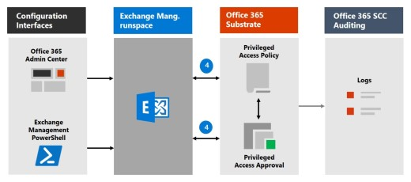

# Office 365 的 Privileged Access ManagementPrivileged access management in Office 365

「特權存取管理」可讓您透過 Office 365 中的版權管理工作進行精細存取控制。Privileged access management allows granular access control over privileged admin tasks in Office 365. 它可協助保護您的組織，避免因使用現有的許可權系統管理員帳戶存取機密資料或存取重要的設定設定而遭到破壞。It can help protect your organization from breaches that use existing privileged admin accounts with standing access to sensitive data or access to critical configuration settings. 「特權存取管理」要求使用者要求即時存取，以透過高範圍和時間限制的核准工作流程來完成提升和特權的工作。Privileged access management requires users to request just-in-time access to complete elevated and privileged tasks through a highly scoped and time-bounded approval workflow. 這項設定可讓使用者有足夠的存取權，而不會影響敏感性資料或關鍵設定設定的暴露。This configuration gives users just-enough-access to perform the task at hand, without risking exposure of sensitive data or critical configuration settings. 啟用 Office 365 中的「特殊許可權存取管理」可讓您的組織以零擁有的許可權運作，並提供防禦受影響的系統管理存取弱點。Enabling privileged access management in Office 365 allows your organization to operate with zero standing privileges and provide a layer of defense against standing administrative access vulnerabilities.

如需整合客戶加密箱和特權存取管理工作流程的快速流覽，請參閱此[客戶密碼箱及 Office 365 中的特殊許可權存取管理](https://go.microsoft.com/fwlink/?linkid=2066800)。For a quick overview of the integrated Customer Lockbox and privileged access management workflow, see this [Customer Lockbox and privileged access management in Office 365 video](https://go.microsoft.com/fwlink/?linkid=2066800).

## 保護層Layers of protection

「特權存取管理」會補充 Office 365 安全性架構中的其他資料和存取功能保護。Privileged access management complements other data and access feature protections within the Office 365 security architecture. 在安全性整合式和分層方法的一部分中包含特殊許可權存取管理，可提供一種安全性模型，以最大化保護機密資訊和 Office 365 設定設定。Including privileged access management as part of an integrated and layered approach to security provides a security model that maximizes protection of sensitive information and Office 365 configuration settings. 如圖所示，「特權存取管理」會以 Office 365 資料的原生加密，以及 Office 365 服務的角色型存取控制安全性模型，來建立保護。As shown in the diagram, privileged access management builds on the protection provided with native encryption of Office 365 data and the role-based access control security model of Office 365 services. 與[AZURE AD 特權身分識別管理](https://docs.microsoft.com/azure/active-directory/active-directory-privileged-identity-management-configure)搭配使用時，這兩個功能會在不同的範圍內，提供即時存取的存取控制。When used with [Azure AD Privileged Identity Management](https://docs.microsoft.com/azure/active-directory/active-directory-privileged-identity-management-configure), these two features provide access control with just-in-time access at different scopes.

Office 365 中的「特權存取管理」會在工作層級定義及設定範圍，而 Azure AD 許可權身分識別管理會在**角色\*\*\*\*層級套用**保護，具有執行多項工作的能力。Privileged access management in Office 365 is defined and scoped at the **task** level, while Azure AD Privileged Identity Management applies protection at the **role** level with the ability to execute multiple tasks. Azure AD 特權身分識別管理主要允許管理 AD 角色和角色群組的存取，而 Office 365 中的特殊訪問管理則只適用于任務層級。Azure AD Privileged Identity Management primarily allows managing accesses for AD roles and role groups, while privileged access management in Office 365 applies only at the task level.

- **在已使用 AZURE AD 特權身分識別管理的情況下，啟用 Office 365 中的特殊許可權存取管理：** 在 Office 365 中新增「特殊許可權存取管理」，可提供另一個細微的保護和核查功能層級的許可權，以存取 Office 365 資料。**Enabling privileged access management in Office 365 while already using Azure AD Privileged Identity Management:** Adding privileged access management in Office 365 provides another granular layer of protection and audit capabilities for privileged access to Office 365 data.

- **啟用 AZURE AD 特權身分識別管理，但已使用 Office 365 中的特殊許可權存取管理：** 將 Azure AD 特權身分識別管理新增至 Office 365 中的特殊許可權存取管理，可將許可權存取權擴充為主要由使用者角色或身分識別所定義的 Office 365 以外的資料。**Enabling Azure AD Privileged Identity Management while already using privileged access management in Office 365:**  Adding Azure AD Privileged Identity Management to privileged access management in Office 365 can extend privileged access to data outside of Office 365 that's primarily defined by user roles or identity.  

## 特殊許可權存取管理架構和處理流程Privileged access management architecture and process flow

下列每個程式會流程概要說明許可權存取的架構，以及它如何與 Office 365 基底、Office 365 審核和 Exchange 管理工作空間互動。Each of the following process flows outline the architecture of privileged access and how it interacts with the Office 365 substrate, Office 365 auditing, and the Exchange Management runspace.

### 步驟1：設定特權存取原則Step 1: Configure a privileged access policy

當您使用[Microsoft 365 系統管理中心](https://admin.microsoft.com)或 Exchange Management PowerShell 來設定特權存取原則時，您會定義原則和許可權存取功能程式，以及 Office 365 基底中的原則屬性。When you configure a privileged access policy with the [Microsoft 365 admin center](https://admin.microsoft.com) or the Exchange Management PowerShell, you define the policy and the privileged access feature processes and the policy attributes in the Office 365 substrate. 活動記錄在 Office 365 安全性與合規性中心。The activities are logged in the Office 365 Security and Compliance Center. 現在原則已啟用，可以處理核准的傳入要求。The policy is now enabled and ready to handle incoming requests for approvals.

### 步驟2：存取要求Step 2: Access request

在[Microsoft 365 系統管理中心](https://admin.microsoft.com)或 Exchange 管理 PowerShell 中，使用者可以要求存取提升或特權的工作。In the [Microsoft 365 admin center](https://admin.microsoft.com) or with the Exchange Management PowerShell, users can request access to elevated or privileged tasks. 「特權存取」功能會將要求傳送至 Office 365 基體，以根據設定的許可權存取原則進行處理，並在 Office 365 安全性和合規性中心記錄中記錄活動。The privileged access feature sends the request to the Office 365 substrate for processing against the configured privilege access policy and records the Activity in the Office 365 Security and Compliance Center logs.

### 步驟3：存取權核准Step 3: Access approval

會產生核准要求，並以電子郵件將擱置的要求通知以電子郵件傳送給核准者。An approval request is generated and the pending request notification is emailed to approvers. 若核准，會以核准方式處理許可權存取要求，而且工作便可完成。If approved, the privileged access request is processed as an approval and the task is ready to be completed. 若拒絕，任務會遭到封鎖，而且不會將存取權授與要求者。If denied, the task is blocked and no access is granted to the requestor. 要求核准或透過電子郵件訊息的拒絕通知要求者。The requestor is notified of the request approval or denial via email message.

### 步驟4：存取處理Step 4: Access processing

針對核准的要求，該工作會由 Exchange 管理工作空間處理。For an approved request, the task is processed by the Exchange Management runspace. 會對照特權存取原則檢查核准，並由 Office 365 基體處理。The approval is checked against the privileged access policy and processed by the Office 365 substrate. 工作的所有活動都會記錄在 Office 365 安全性與合規性中心。All activity for the task is logged in the Office 365 Security and Compliance Center.

## 常見問題集Frequently asked questions

### 哪些 SKUs 可以使用 Office 365 中的特殊許可權存取？What SKUs can use privileged access in Office 365?

針對廣泛的 Microsoft 365 和 Office 365 訂閱和附加元件，客戶可以使用「特權存取管理」。Privileged access management is available for customers for a wide selection of Microsoft 365 and Office 365 subscriptions and add-ons. 如需詳細資訊，請參閱[入門的特殊許可權存取管理](privileged-access-management-configuration.md)。See [Get started with privileged access management](privileged-access-management-configuration.md) for details.

### 許可權存取是否支援 Office 365 工作負載超過 Exchange？When will privileged access support Office 365 workloads beyond Exchange?

在其他 Office 365 工作負載中，將會立即提供一些特殊的存取管理功能。Privileged access management will be available in other Office 365 workloads soon. 如需詳細資訊，請造訪[Microsoft 365 藍圖](https://www.microsoft.com/microsoft-365/roadmap)。Visit the [Microsoft 365 Roadmap](https://www.microsoft.com/microsoft-365/roadmap) for more details.

### 我的組織需要超過30個許可權存取原則，是否要增加這種限制？My organization needs more than 30 privileged access policies, will this limit be increased?

是的，每個 Office 365 組織目前的30個許可權存取原則目前限制為 [功能藍圖]。Yes, raising the current limit of 30 privileged access policies per Office 365 organization is on the feature roadmap.

### 我必須是全域系統管理員，才能管理 Office 365 中的許可權存取？Do I need to be a Global Admin to manage privileged access in Office 365?

否，您需要將 Exchange 角色管理角色指派給在 Office 365 中管理許可權存取的帳戶。No, you need the Exchange Role Management role assigned to accounts that manage privileged access in Office 365. 如果您不想將角色管理角色設定為獨立帳戶許可權，全域系統管理員角色預設會包含此角色，且可管理特殊許可權存取。If you don't want to configure the Role Management role as a stand-alone account permission, the Global Administrator role includes this role by default and can manage privileged access. 包含在核准者群組中的使用者，不需要成為全域系統管理員，或已將角色管理角色指派給使用 PowerShell 複查及核准要求。Users included in an approvers' group don't need to be a Global Admin or have the Role Management role assigned to review and approve requests with PowerShell.

### Office 365 中的特殊許可權存取管理與客戶密碼箱的關聯方式？How is privileged access management in Office 365 related to Customer Lockbox?

[客戶加密箱](https://docs.microsoft.com/office365/admin/manage/customer-lockbox-requests)允許 Microsoft 存取資料時，組織的存取控制層級。[Customer Lockbox](https://docs.microsoft.com/office365/admin/manage/customer-lockbox-requests) allows a level of access control for organizations when Microsoft accesses data. Office 365 中的「特權存取管理」可讓組織內所有 Office 365 特權工作的精確存取控制。Privileged access management in Office 365 allows granular access control within an organization for all Office 365 privileged tasks.

## 準備好開始使用了嗎？Ready to get started?

開始設定[組織的特殊許可權存取管理](privileged-access-management-configuration.md)。Start [configuring your organization for privileged access management](privileged-access-management-configuration.md).

## 深入了解Learn more

[互動式指南：透過特殊存取管理來監控和控制系統管理員工作Interactive guide: Monitor and control administrator tasks with privileged access management](https://content.cloudguides.com/guides/Privileged%20Access%20Management)
