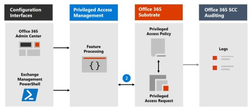
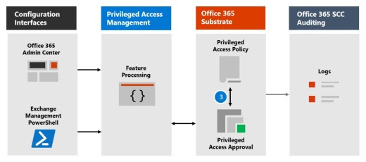

# Office 365 的 Privileged Access Management

「特權存取管理」可讓您透過 Office 365 中的版權管理工作進行精細存取控制。 它可協助保護您的組織，避免因使用現有的許可權系統管理員帳戶存取機密資料或存取重要的設定設定而遭到破壞。 「特權存取管理」要求使用者要求即時存取，以透過高範圍和時間限制的核准工作流程來完成提升和特權的工作。 這項設定可讓使用者有足夠的存取權，而不會影響敏感性資料或關鍵設定設定的暴露。 啟用 Office 365 中的「特殊許可權存取管理」可讓您的組織以零擁有的許可權運作，並提供防禦受影響的系統管理存取弱點。

如需整合客戶加密箱和特權存取管理工作流程的快速流覽，請參閱此[客戶密碼箱及 Office 365 中的特殊許可權存取管理](https://go.microsoft.com/fwlink/?linkid=2066800)。

## 保護層

「特權存取管理」會補充 Office 365 安全性架構中的其他資料和存取功能保護。 在安全性整合式和分層方法的一部分中包含特殊許可權存取管理，可提供一種安全性模型，以最大化保護機密資訊和 Office 365 設定設定。 如圖所示，「特權存取管理」會以 Office 365 資料的原生加密，以及 Office 365 服務的角色型存取控制安全性模型，來建立保護。 與[AZURE AD 特權身分識別管理](https://docs.microsoft.com/azure/active-directory/active-directory-privileged-identity-management-configure)搭配使用時，這兩個功能會在不同的範圍內，提供即時存取的存取控制。

Office 365 中的「特權存取管理」會在工作層級定義及設定範圍，而 Azure AD 許可權身分識別管理會在**角色****層級套用**保護，具有執行多項工作的能力。 Azure AD 特權身分識別管理主要允許管理 AD 角色和角色群組的存取，而 Office 365 中的特殊訪問管理則只適用于任務層級。

- **在已使用 AZURE AD 特權身分識別管理的情況下，啟用 Office 365 中的特殊許可權存取管理：** 在 Office 365 中新增「特殊許可權存取管理」，可提供另一個細微的保護和核查功能層級的許可權，以存取 Office 365 資料。

- **啟用 AZURE AD 特權身分識別管理，但已使用 Office 365 中的特殊許可權存取管理：** 將 Azure AD 特權身分識別管理新增至 Office 365 中的特殊許可權存取管理，可將許可權存取權擴充為主要由使用者角色或身分識別所定義的 Office 365 以外的資料。  

## 特殊許可權存取管理架構和處理流程

下列每個程式會流程概要說明許可權存取的架構，以及它如何與 Office 365 基底、Office 365 審核和 Exchange 管理工作空間互動。

### 步驟1：設定特權存取原則

當您使用[Microsoft 365 系統管理中心](https://admin.microsoft.com)或 Exchange Management PowerShell 來設定特權存取原則時，您會定義原則和許可權存取功能程式，以及 Office 365 基底中的原則屬性。 活動記錄在 Office 365 安全性與合規性中心。 現在原則已啟用，可以處理核准的傳入要求。

### 步驟2：存取要求

在[Microsoft 365 系統管理中心](https://admin.microsoft.com)或 Exchange 管理 PowerShell 中，使用者可以要求存取提升或特權的工作。 「特權存取」功能會將要求傳送至 Office 365 基體，以根據設定的許可權存取原則進行處理，並在 Office 365 安全性和合規性中心記錄中記錄活動。

### 步驟3：存取權核准

會產生核准要求，並以電子郵件將擱置的要求通知以電子郵件傳送給核准者。 若核准，會以核准方式處理許可權存取要求，而且工作便可完成。 若拒絕，任務會遭到封鎖，而且不會將存取權授與要求者。 要求核准或透過電子郵件訊息的拒絕通知要求者。

### 步驟4：存取處理

針對核准的要求，該工作會由 Exchange 管理工作空間處理。 會對照特權存取原則檢查核准，並由 Office 365 基體處理。 工作的所有活動都會記錄在 Office 365 安全性與合規性中心。

## 常見問題集

### 哪些 SKUs 可以使用 Office 365 中的特殊許可權存取？

針對廣泛的 Microsoft 365 和 Office 365 訂閱和附加元件，客戶可以使用「特權存取管理」。 如需詳細資訊，請參閱[入門的特殊許可權存取管理](privileged-access-management-configuration.md)。

### 許可權存取是否支援 Office 365 工作負載超過 Exchange？

在其他 Office 365 工作負載中，將會立即提供一些特殊的存取管理功能。 如需詳細資訊，請造訪[Microsoft 365 藍圖](https://www.microsoft.com/microsoft-365/roadmap)。

### 我的組織需要超過30個許可權存取原則，是否要增加這種限制？

是的，每個 Office 365 組織目前的30個許可權存取原則目前限制為 [功能藍圖]。

### 我必須是全域系統管理員，才能管理 Office 365 中的許可權存取？

否，您需要將 Exchange 角色管理角色指派給在 Office 365 中管理許可權存取的帳戶。 如果您不想將角色管理角色設定為獨立帳戶許可權，全域系統管理員角色預設會包含此角色，且可管理特殊許可權存取。 包含在核准者群組中的使用者，不需要成為全域系統管理員，或已將角色管理角色指派給使用 PowerShell 複查及核准要求。

### Office 365 中的特殊許可權存取管理與客戶密碼箱的關聯方式？

[客戶加密箱](https://docs.microsoft.com/office365/admin/manage/customer-lockbox-requests)允許 Microsoft 存取資料時，組織的存取控制層級。 Office 365 中的「特權存取管理」可讓組織內所有 Office 365 特權工作的精確存取控制。

## 準備好開始使用了嗎？

開始設定[組織的特殊許可權存取管理](privileged-access-management-configuration.md)。

## 深入了解

[互動式指南：透過特殊存取管理來監控和控制系統管理員工作](https://content.cloudguides.com/guides/Privileged%20Access%20Management)
