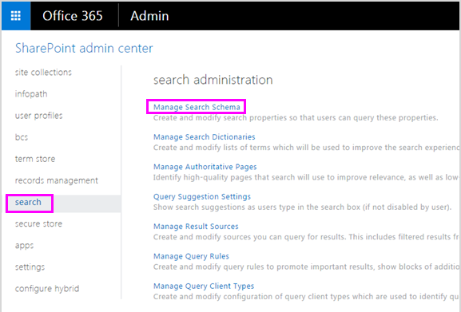

# <a name="create-a-dlp-policy-to-protect-documents-with-fci-or-other-properties"></a><span data-ttu-id="d985e-103">建立 DLP 原則來保護具有 FCI 或其他屬性的文件</span><span class="sxs-lookup"><span data-stu-id="d985e-103">Create a DLP policy to protect documents with FCI or other properties</span></span>

<span data-ttu-id="d985e-104">在 Microsoft 365 中，您可以使用資料遺失防護（DLP）原則來識別、監視和保護機密資訊。</span><span class="sxs-lookup"><span data-stu-id="d985e-104">In Microsoft 365, you can use a data loss prevention (DLP) policy to identify, monitor, and protect sensitive information.</span></span> <span data-ttu-id="d985e-105">許多組織已使用 Windows Server 檔分類基礎結構（FCI）中的分類屬性、SharePoint 中的檔案屬性或協力廠商系統所套用的檔案屬性，來識別及分類敏感資訊的程式。</span><span class="sxs-lookup"><span data-stu-id="d985e-105">Many organizations already have a process to identify and classify sensitive information by using the classification properties in Windows Server File Classification Infrastructure (FCI), the document properties in SharePoint, or the document properties applied by a third-party system.</span></span> <span data-ttu-id="d985e-106">如果這會描述您的組織，您可以建立 DLP 原則，以辨識 Windows Server FCI 或其他系統已套用至檔的屬性，如此便能在具有特定 FCI 或其他屬性值的 Office 檔上強制執行 DLP 原則。</span><span class="sxs-lookup"><span data-stu-id="d985e-106">If this describes your organization, you can create a DLP policy that recognizes the properties that have been applied to documents by Windows Server FCI or other system, so that the DLP policy can be enforced on Office documents with specific FCI or other property values.</span></span>
  

  
<span data-ttu-id="d985e-108">例如，您的組織可能會使用 Windows Server FCI，透過個人身分識別資訊（PII）來識別檔，例如社會保險號碼，然後根據檔中找到之 PII 的類型和數量，將 [**個人身分識別資訊**] 屬性設定為 [**高**]、[**適中**]、[**低**]、[**公用**] 或 [**不是 PII** ]。</span><span class="sxs-lookup"><span data-stu-id="d985e-108">For example, your organization might use Windows Server FCI to identify documents with personally identifiable information (PII) such as social security numbers, and then classify the document by setting the **Personally Identifiable Information** property to **High**, **Moderate**, **Low**, **Public**, or **Not PII** based on the type and number of occurrences of PII found in the document.</span></span> <span data-ttu-id="d985e-109">在 Microsoft 365 中，您可以建立一個 DLP 原則，識別具有該屬性設定為特定值的檔，例如 [**高**] 和 [**中**]，然後採取諸如封鎖對這些檔案的存取等動作。</span><span class="sxs-lookup"><span data-stu-id="d985e-109">In Microsoft 365, you can create a DLP policy that identifies documents that have that property set to specific values, such as **High** and **Medium**, and then takes an action such as blocking access to those files.</span></span> <span data-ttu-id="d985e-110">如果屬性設定為 [**低**] （例如傳送電子郵件通知），相同的原則可以有另一個規則採用其他的動作。</span><span class="sxs-lookup"><span data-stu-id="d985e-110">The same policy can have another rule that takes a different action if the property is set to **Low**, such as sending an email notification.</span></span> <span data-ttu-id="d985e-111">如此一來，DLP 便會與 Windows Server FCI 整合，並協助保護從 Windows Server 檔案伺服器上傳或共用至 Microsoft 365 的 Office 檔。</span><span class="sxs-lookup"><span data-stu-id="d985e-111">In this way, DLP integrates with Windows Server FCI and can help protect Office documents uploaded or shared to Microsoft 365 from Windows Server-based file servers.</span></span>
  
<span data-ttu-id="d985e-112">DLP 原則只會尋找特定的屬性名稱/值對。</span><span class="sxs-lookup"><span data-stu-id="d985e-112">A DLP policy simply looks for a specific property name/value pair.</span></span> <span data-ttu-id="d985e-113">只要屬性具有對應的 managed 屬性 SharePoint 搜尋，就可以使用任何檔案屬性。</span><span class="sxs-lookup"><span data-stu-id="d985e-113">Any document property can be used, as long as the property has a corresponding managed property for SharePoint search.</span></span> <span data-ttu-id="d985e-114">例如，SharePoint 網站集合可能會使用名為「**客戶**」之必要欄位的「**行程報告**」內容類型。</span><span class="sxs-lookup"><span data-stu-id="d985e-114">For example, a SharePoint site collection might use a content type named **Trip Report** with a required field named **Customer**.</span></span> <span data-ttu-id="d985e-115">每當人員建立行程報告時，他們必須輸入客戶名稱。</span><span class="sxs-lookup"><span data-stu-id="d985e-115">Whenever a person creates a trip report, they must enter the customer name.</span></span> <span data-ttu-id="d985e-116">您也可以在 DLP 原則中使用此屬性名稱/值組（例如，如果您想要在**客戶**欄位包含**Contoso**時，封鎖外部使用者存取檔的規則）。</span><span class="sxs-lookup"><span data-stu-id="d985e-116">This property name/value pair can also be used in a DLP policy — for example, if you want a rule that blocks access to the document for external users when the **Customer** field contains **Contoso**.</span></span>
  
<span data-ttu-id="d985e-117">請注意，如果您想要將 DLP 原則套用至特定 Microsoft 365 標籤的內容，您不應該遵循這裡的步驟。</span><span class="sxs-lookup"><span data-stu-id="d985e-117">Note that if you want to apply your DLP policy to content with specific Microsoft 365 labels, you should not follow the steps here.</span></span> <span data-ttu-id="d985e-118">請改為了解如何[使用保留標籤做為 DLP 原則中的條件](data-loss-prevention-policies.md#using-a-retention-label-as-a-condition-in-a-dlp-policy)。</span><span class="sxs-lookup"><span data-stu-id="d985e-118">Instead, learn how to [Using a retention label as a condition in a DLP policy](data-loss-prevention-policies.md#using-a-retention-label-as-a-condition-in-a-dlp-policy).</span></span>
  
## <a name="before-you-create-the-dlp-policy"></a><span data-ttu-id="d985e-119">建立 DLP 原則之前</span><span class="sxs-lookup"><span data-stu-id="d985e-119">Before you create the DLP policy</span></span>

<span data-ttu-id="d985e-120">您必須先在 SharePoint 系統管理中心建立 managed 屬性，才能使用 DLP 原則中的 Windows Server FCI 屬性或其他屬性。</span><span class="sxs-lookup"><span data-stu-id="d985e-120">Before you can use a Windows Server FCI property or other property in a DLP policy, you need to create a managed property in the SharePoint admin center.</span></span> <span data-ttu-id="d985e-121">原因如下。</span><span class="sxs-lookup"><span data-stu-id="d985e-121">Here's why.</span></span>
  
<span data-ttu-id="d985e-122">在 SharePoint Online 和商務 OneDrive 中，搜尋索引會透過編目您網站上的內容來建立。</span><span class="sxs-lookup"><span data-stu-id="d985e-122">In SharePoint Online and OneDrive for Business, the search index is built up by crawling the content on your sites.</span></span> <span data-ttu-id="d985e-123">編目程式會以編目屬性的形式挑選檔中的內容和中繼資料。</span><span class="sxs-lookup"><span data-stu-id="d985e-123">The crawler picks up content and metadata from the documents in the form of crawled properties.</span></span> <span data-ttu-id="d985e-124">搜尋架構可協助編目程式決定要挑選的內容和中繼資料。</span><span class="sxs-lookup"><span data-stu-id="d985e-124">The search schema helps the crawler decide what content and metadata to pick up.</span></span> <span data-ttu-id="d985e-125">中繼資料的範例包括作者及檔的標題。</span><span class="sxs-lookup"><span data-stu-id="d985e-125">Examples of metadata are the author and the title of a document.</span></span> <span data-ttu-id="d985e-126">不過，若要將檔中的內容和中繼資料取得搜尋索引，編目屬性必須對應至 managed 屬性。</span><span class="sxs-lookup"><span data-stu-id="d985e-126">However, to get the content and metadata from the documents into the search index, the crawled properties must be mapped to managed properties.</span></span> <span data-ttu-id="d985e-127">只有 managed 屬性會保留在索引中。</span><span class="sxs-lookup"><span data-stu-id="d985e-127">Only managed properties are kept in the index.</span></span> <span data-ttu-id="d985e-128">例如，與 author 相關的編目屬性會對應至與 author 相關的 managed 屬性。</span><span class="sxs-lookup"><span data-stu-id="d985e-128">For example, a crawled property related to author is mapped to a managed property related to author.</span></span>
  
<span data-ttu-id="d985e-129">這一點很重要，因為 DLP 會使用搜尋編目程式來識別和分類您網站上的機密資訊，然後將該機密資訊儲存在搜尋索引的安全部分。</span><span class="sxs-lookup"><span data-stu-id="d985e-129">This is important because DLP uses the search crawler to identify and classify sensitive information on your sites, and then store that sensitive information in a secure portion of the search index.</span></span> <span data-ttu-id="d985e-130">當您將檔上傳至 Office 365 時，SharePoint 會根據檔案屬性，自動建立編目屬性。</span><span class="sxs-lookup"><span data-stu-id="d985e-130">When you upload a document to Office 365, SharePoint automatically creates crawled properties based on the document properties.</span></span> <span data-ttu-id="d985e-131">不過，若要使用 DLP 原則中的 FCI 或其他屬性，該編目屬性必須對應至 managed 屬性，這樣該屬性的內容就會保留在索引中。</span><span class="sxs-lookup"><span data-stu-id="d985e-131">But to use an FCI or other property in a DLP policy, that crawled property needs to be mapped to a managed property so that content with that property is kept in the index.</span></span>
  
<span data-ttu-id="d985e-132">如需搜尋及 managed 屬性的詳細資訊，請參閱[Manage the search schema in SharePoint Online](https://go.microsoft.com/fwlink/p/?LinkID=627454)。</span><span class="sxs-lookup"><span data-stu-id="d985e-132">For more information on search and managed properties, see [Manage the search schema in SharePoint Online](https://go.microsoft.com/fwlink/p/?LinkID=627454).</span></span>
  
### <a name="step-1-upload-a-document-with-the-needed-property-to-office-365"></a><span data-ttu-id="d985e-133">步驟1：將具有必要屬性的檔上傳至 Office 365</span><span class="sxs-lookup"><span data-stu-id="d985e-133">Step 1: Upload a document with the needed property to Office 365</span></span>

<span data-ttu-id="d985e-134">您必須先將檔上傳至您要在 DLP 原則中參考的屬性。</span><span class="sxs-lookup"><span data-stu-id="d985e-134">You first need to upload a document with the property that you want to reference in your DLP policy.</span></span> <span data-ttu-id="d985e-135">Microsoft 365 會偵測屬性，並自動從該屬性建立編目屬性。</span><span class="sxs-lookup"><span data-stu-id="d985e-135">Microsoft 365 will detect the property and automatically create a crawled property from it.</span></span> <span data-ttu-id="d985e-136">在下一個步驟中，您將建立 managed 屬性，然後將 managed 屬性對應至此編目屬性。</span><span class="sxs-lookup"><span data-stu-id="d985e-136">In the next step, you'll create a managed property, and then map the managed property to this crawled property.</span></span>
  
### <a name="step-2-create-a-managed-property"></a><span data-ttu-id="d985e-137">步驟2：建立 managed 屬性</span><span class="sxs-lookup"><span data-stu-id="d985e-137">Step 2: Create a managed property</span></span>

1. <span data-ttu-id="d985e-138">登入 Microsoft 365 系統管理中心。</span><span class="sxs-lookup"><span data-stu-id="d985e-138">Sign in to the Microsoft 365 admin center.</span></span>
    
2. <span data-ttu-id="d985e-139">在左側導覽中，選擇 [系統**管理中心**] \> **SharePoint**。</span><span class="sxs-lookup"><span data-stu-id="d985e-139">In the left navigation, choose **Admin centers** \> **SharePoint**.</span></span> <span data-ttu-id="d985e-140">You're now in the SharePoint admin center.</span><span class="sxs-lookup"><span data-stu-id="d985e-140">You're now in the SharePoint admin center.</span></span>
    
3. <span data-ttu-id="d985e-141">在左側導覽中，選擇**search** \> [搜尋**管理**] 頁面上的 [搜尋] [ \> **管理搜尋架構**]。</span><span class="sxs-lookup"><span data-stu-id="d985e-141">In the left navigation, choose **search** \> on the **search administration** page \> **Manage Search Schema**.</span></span>
    
    
  
4. <span data-ttu-id="d985e-143">在 [ **Managed 屬性**] 頁面的 [ \> **新增 managed 屬性**]。</span><span class="sxs-lookup"><span data-stu-id="d985e-143">On the **Managed Properties** page \> **New Managed Property**.</span></span>
    
    
  
5. <span data-ttu-id="d985e-145">輸入屬性的名稱和描述。</span><span class="sxs-lookup"><span data-stu-id="d985e-145">Enter a name and description for the property.</span></span> <span data-ttu-id="d985e-146">此名稱會顯示在您的 DLP 原則中。</span><span class="sxs-lookup"><span data-stu-id="d985e-146">This name is what will appear in your DLP policies.</span></span>
    
6. <span data-ttu-id="d985e-147">針對 [**類型**]，選擇 [**文字**]。</span><span class="sxs-lookup"><span data-stu-id="d985e-147">For **Type**, choose **Text**.</span></span> 
    
7. <span data-ttu-id="d985e-148">在 [**主要特性**] 底下，選取 [可**查詢**及可**檢索**]。</span><span class="sxs-lookup"><span data-stu-id="d985e-148">Under **Main characteristics**, select **Queryable** and **Retrievable**.</span></span>
    
8. <span data-ttu-id="d985e-149">在 [對應至編目屬性] 底下 **，** \> **新增對應**。</span><span class="sxs-lookup"><span data-stu-id="d985e-149">Under **Mappings to crawled properties** \> **Add a mapping**.</span></span>
    
9. <span data-ttu-id="d985e-150">在 [編目**屬性選項**] 對話方塊中 \> ，尋找並選取對應至您將在 DLP 原則 OK 中使用的 Windows Server FCI 屬性或其他屬性的編目屬性 \> \*\* \*\*。</span><span class="sxs-lookup"><span data-stu-id="d985e-150">In the **crawled property selection** dialog box \> find and select the crawled property that corresponds to the Windows Server FCI property or other property that you will use in your DLP policy \> **OK**.</span></span>
    
    
  
10. <span data-ttu-id="d985e-152">在頁面底部的 \> **[確定]**。</span><span class="sxs-lookup"><span data-stu-id="d985e-152">At the bottom of the page \> **OK**.</span></span>
    
## <a name="create-a-dlp-policy-that-uses-an-fci-property-or-other-property"></a><span data-ttu-id="d985e-153">建立使用 FCI 屬性或其他屬性的 DLP 原則</span><span class="sxs-lookup"><span data-stu-id="d985e-153">Create a DLP policy that uses an FCI property or other property</span></span>

<span data-ttu-id="d985e-154">在此範例中，組織在其 Windows 伺服器型檔案伺服器上使用 FCI;具體而言，他們使用的是名為**個人身分識別資訊**的 FCI 分類屬性，其可能的值為**High**、**適中**、**低**、**公有**和**非 PII**。</span><span class="sxs-lookup"><span data-stu-id="d985e-154">In this example, an organization is using FCI on its Windows Server-based file servers; specifically, they're using the FCI classification property named **Personally Identifiable Information** with possible values of **High**, **Moderate**, **Low**, **Public**, and **Not PII**.</span></span> <span data-ttu-id="d985e-155">現在，他們想要在 Office 365 的 DLP 原則中利用其現有的 FCI 分類。</span><span class="sxs-lookup"><span data-stu-id="d985e-155">Now they want to leverage their existing FCI classification in their DLP policies in Office 365.</span></span>
  
<span data-ttu-id="d985e-156">首先，他們會依照上述步驟，在 SharePoint Online 中建立 managed 屬性，該屬性會對應至自動從 FCI 屬性建立的編目屬性。</span><span class="sxs-lookup"><span data-stu-id="d985e-156">First, they follow the steps above to create a managed property in SharePoint Online, which maps to the crawled property created automatically from the FCI property.</span></span>
  
<span data-ttu-id="d985e-157">接下來，他們會建立一個 DLP 原則，其中兩個規則都使用條件**檔案屬性包含下列任一值**：</span><span class="sxs-lookup"><span data-stu-id="d985e-157">Next, they create a DLP policy with two rules that both use the condition **Document properties contain any of these values**:</span></span>
  
- <span data-ttu-id="d985e-158">**FCI PII 內容-高、適中**第一個規則會限制存取檔如果 FCI 分類屬性**個人識別資訊**等於**高**或**適中**，而且檔與組織外部人員共用。</span><span class="sxs-lookup"><span data-stu-id="d985e-158">**FCI PII content - High, Moderate** The first rule restricts access to the document if the FCI classification property **Personally Identifiable Information** equals **High** or **Moderate** and the document is shared with people outside the organization.</span></span> 
    
- <span data-ttu-id="d985e-159">**FCI PII 內容-低**第二個規則會在 FCI 分類屬性**個人識別資訊**等於**低**，且與組織外部人員共用檔時，將通知傳送給檔擁有者。</span><span class="sxs-lookup"><span data-stu-id="d985e-159">**FCI PII content - Low** The second rule sends a notification to the document owner if the FCI classification property **Personally Identifiable Information** equals **Low** and the document is shared with people outside the organization.</span></span> 
    
### <a name="create-the-dlp-policy-by-using-powershell"></a><span data-ttu-id="d985e-160">使用 PowerShell 建立 DLP 原則</span><span class="sxs-lookup"><span data-stu-id="d985e-160">Create the DLP policy by using PowerShell</span></span>

<span data-ttu-id="d985e-161">請注意，[安全性與合規性中心] 的 UI 中暫時無法使用 [條件**檔案屬性] 這兩個值** &amp; ，但您仍然可以使用 PowerShell 來使用此條件。</span><span class="sxs-lookup"><span data-stu-id="d985e-161">Note that the condition **Document properties contain any of these values** is temporarily not available in the UI of the Security &amp; Compliance Center, but you can still use this condition by using PowerShell.</span></span> <span data-ttu-id="d985e-162">您可以使用 `New\Set\Get-DlpCompliancePolicy` Cmdlet 來使用 DLP 原則，並搭配參數使用 Cmdlet， `New\Set\Get-DlpComplianceRule` `ContentPropertyContainsWords` 以新增條件**檔案屬性包含這些值中的任何一個**。</span><span class="sxs-lookup"><span data-stu-id="d985e-162">You can use the  `New\Set\Get-DlpCompliancePolicy` cmdlets to work with a DLP policy, and use the  `New\Set\Get-DlpComplianceRule` cmdlets with the  `ContentPropertyContainsWords` parameter to add the condition **Document properties contain any of these values**.</span></span>
  
<span data-ttu-id="d985e-163">如需這些 Cmdlet 的詳細資訊，請參閱[安全性 &amp; 規範中心 Cmdlet](https://go.microsoft.com/fwlink/?LinkID=799772&amp;clcid=0x409)。</span><span class="sxs-lookup"><span data-stu-id="d985e-163">For more information on these cmdlets, see [Security &amp; Compliance Center cmdlets](https://go.microsoft.com/fwlink/?LinkID=799772&amp;clcid=0x409).</span></span>
  
1. [<span data-ttu-id="d985e-164">&amp;使用遠端 PowerShell 連接至安全規範中心</span><span class="sxs-lookup"><span data-stu-id="d985e-164">Connect to the Security &amp; Compliance Center using remote PowerShell</span></span>](https://go.microsoft.com/fwlink/?LinkID=799771&amp;clcid=0x409)
    
2. <span data-ttu-id="d985e-165">使用建立原則 `New-DlpCompliancePolicy` 。</span><span class="sxs-lookup"><span data-stu-id="d985e-165">Create the policy by using  `New-DlpCompliancePolicy`.</span></span>

<span data-ttu-id="d985e-166">以下是建立套用至所有位置之 DLP 原則的 PowerShell 範例。</span><span class="sxs-lookup"><span data-stu-id="d985e-166">Here is a PowerShell example that creates a DLP policy that applies to all locations.</span></span>

```powershell
New-DlpCompliancePolicy -Name FCI_PII_policy -ExchangeLocation All -SharePointLocation All -OneDriveLocation All -Mode Enable
```

3. <span data-ttu-id="d985e-167">使用 `New-DlpComplianceRule` 其中一個規則是**低**值的規則，而另一個規則是用於**高低**值，以建立上述的兩個規則**Moderate** 。</span><span class="sxs-lookup"><span data-stu-id="d985e-167">Create the two rules described above by using  `New-DlpComplianceRule`, where one rule is for the **Low** value, and another rule is for the **High** and **Moderate** values.</span></span> 
    
    <span data-ttu-id="d985e-168">以下是建立這兩個規則的 PowerShell 範例。</span><span class="sxs-lookup"><span data-stu-id="d985e-168">Here is a PowerShell example that creates these two rules.</span></span> <span data-ttu-id="d985e-169">請注意，屬性名稱/值對會以引號括住，屬性名稱可以指定多個以逗號分隔的多個值，不含空格，例如`"<Property1>:<Value1>,<Value2>","<Property2>:<Value3>,<Value4>"....`</span><span class="sxs-lookup"><span data-stu-id="d985e-169">Note that the property name/value pairs are enclosed in quotation marks, and a property name may specify multiple values separated by commas with no spaces, like  `"<Property1>:<Value1>,<Value2>","<Property2>:<Value3>,<Value4>"....`</span></span>

```powershell
New-DlpComplianceRule -Name FCI_PII_content-High,Moderate -Policy FCI_PII_policy -AccessScope NotInOrganization -BlockAccess $true -ContentPropertyContainsWords "Personally Identifiable Information:High,Moderate" -Disabled $falseNew-DlpComplianceRule -Name FCI_PII_content-Low -Policy FCI_PII_policy -AccessScope NotInOrganization -BlockAccess $false -ContentPropertyContainsWords "Personally Identifiable Information:Low" -Disabled $false -NotifyUser Owner
```

    Note that Windows Server FCI includes many built-in properties, including **Personally Identifiable Information** used in this example. The possible values for each property can be different for every organization. The **High**, **Moderate**, and **Low** values used here are only an example. For your organization, you can view the Windows Server FCI classification properties with their possible values in the file Server Resource Manager on the Windows Server-based file server. For more information, see [Create a classification property](https://go.microsoft.com/fwlink/p/?LinkID=627456).
    
<span data-ttu-id="d985e-170">當您完成時，您的原則應該會有兩個新規則，都使用**檔案屬性包含這些值的任何**條件。</span><span class="sxs-lookup"><span data-stu-id="d985e-170">When you finish, your policy should have two new rules that both use the **Document properties contain any of these values** condition.</span></span> <span data-ttu-id="d985e-171">請注意，此條件不會出現在 UI 中，但會顯示其他條件、動作和設定。</span><span class="sxs-lookup"><span data-stu-id="d985e-171">Note that this condition won't appear in the UI, though the other conditions, actions, and settings will appear.</span></span>
  
<span data-ttu-id="d985e-172">一個規則會封鎖**個人身分識別資訊**屬性等於**High**或**適中**的內容存取權。</span><span class="sxs-lookup"><span data-stu-id="d985e-172">One rule blocks access to content where the **Personally Identifiable Information** property equals **High** or **Moderate**.</span></span> <span data-ttu-id="d985e-173">第二個規則會傳送有關**個人身分識別資訊**屬性等於**Low**的內容通知。</span><span class="sxs-lookup"><span data-stu-id="d985e-173">A second rule sends a notification about content where the **Personally Identifiable Information** property equals **Low**.</span></span>
  

  
## <a name="after-you-create-the-dlp-policy"></a><span data-ttu-id="d985e-175">建立 DLP 原則之後</span><span class="sxs-lookup"><span data-stu-id="d985e-175">After you create the DLP policy</span></span>

<span data-ttu-id="d985e-176">執行上述各節中的步驟，會建立一個 DLP 原則，它會使用該屬性快速偵測內容，但只有在新上傳該內容時（即內容的索引），或是該內容已經過編輯（這樣就會重新編制內容）。</span><span class="sxs-lookup"><span data-stu-id="d985e-176">Doing the steps in the previous sections will create a DLP policy that will quickly detect content with that property, but only if that content is newly uploaded (so that the content's indexed), or if that content is old but just edited (so that the content's re-indexed).</span></span>
  
<span data-ttu-id="d985e-177">若要在任何地方使用該屬性偵測內容，您可能想要手動要求您的文件庫、網站或網站集合重新編制索引，以便 DLP 原則知道具有該屬性的所有內容。</span><span class="sxs-lookup"><span data-stu-id="d985e-177">To detect content with that property everywhere, you may want to manually request that your library, site, or site collection be re-indexed, so that the DLP policy is aware of all the content with that property.</span></span> <span data-ttu-id="d985e-178">在 [SharePoint 線上] 中，會根據定義的編目排程自動編目內容。</span><span class="sxs-lookup"><span data-stu-id="d985e-178">In SharePoint Online, content is automatically crawled based on a defined crawl schedule.</span></span> <span data-ttu-id="d985e-179">編目程式會挑選自上次編目後已變更的內容，並更新索引。</span><span class="sxs-lookup"><span data-stu-id="d985e-179">The crawler picks up content that has changed since the last crawl and updates the index.</span></span> <span data-ttu-id="d985e-180">如果您需要 DLP 原則在下一個排程編目之前保護內容，您可以採取下列步驟。</span><span class="sxs-lookup"><span data-stu-id="d985e-180">If you need your DLP policy to protect content before the next scheduled crawl, you can take these steps.</span></span>
  
> [!CAUTION]
> <span data-ttu-id="d985e-181">重新編制網站索引可能會導致搜尋系統負載大幅。</span><span class="sxs-lookup"><span data-stu-id="d985e-181">Re-indexing a site can cause a massive load on the search system.</span></span> <span data-ttu-id="d985e-182">除非您的案例絕對需要，否則不要重新建立網站索引。</span><span class="sxs-lookup"><span data-stu-id="d985e-182">Don't re-index your site unless your scenario absolutely requires it.</span></span> 
  
<span data-ttu-id="d985e-183">如需詳細資訊，請參閱[手動要求網站、文件庫或清單進行編目和重新建立索引](https://go.microsoft.com/fwlink/p/?LinkID=627457)。</span><span class="sxs-lookup"><span data-stu-id="d985e-183">For more information, see [Manually request crawling and re-indexing of a site, a library or a list](https://go.microsoft.com/fwlink/p/?LinkID=627457).</span></span>
  
### <a name="re-index-a-site-optional"></a><span data-ttu-id="d985e-184">重新建立網站索引（選用）</span><span class="sxs-lookup"><span data-stu-id="d985e-184">Re-index a site (optional)</span></span>

1. <span data-ttu-id="d985e-185">在網站上，選擇 [**設定**] （右上角的齒輪圖示） \> **網站設定**。</span><span class="sxs-lookup"><span data-stu-id="d985e-185">On the site, choose **Settings** (gear icon in upper right) \> **Site Settings**.</span></span>
    
2. <span data-ttu-id="d985e-186">在 [**搜尋**] 底下，選擇 [**搜尋及離線可用性**重新 \> **索引網站**]。</span><span class="sxs-lookup"><span data-stu-id="d985e-186">Under **Search**, choose **Search and offline availability** \> **Reindex site**.</span></span>
    
## <a name="more-information"></a><span data-ttu-id="d985e-187">詳細資訊</span><span class="sxs-lookup"><span data-stu-id="d985e-187">More information</span></span>

- [<span data-ttu-id="d985e-188">資料外洩防護原則概觀</span><span class="sxs-lookup"><span data-stu-id="d985e-188">Overview of data loss prevention policies</span></span>](data-loss-prevention-policies.md)
    
- [<span data-ttu-id="d985e-189">從範本建立 DLP 原則</span><span class="sxs-lookup"><span data-stu-id="d985e-189">Create a DLP policy from a template</span></span>](create-a-dlp-policy-from-a-template.md)
    
- [<span data-ttu-id="d985e-190">傳送通知並顯示 DLP 原則的原則秘訣</span><span class="sxs-lookup"><span data-stu-id="d985e-190">Send notifications and show policy tips for DLP policies</span></span>](use-notifications-and-policy-tips.md)
    
- [<span data-ttu-id="d985e-191">DLP 原則範本包含哪些內容</span><span class="sxs-lookup"><span data-stu-id="d985e-191">What the DLP policy templates include</span></span>](what-the-dlp-policy-templates-include.md)
    
- [<span data-ttu-id="d985e-192">敏感性資訊類型實體定義</span><span class="sxs-lookup"><span data-stu-id="d985e-192">Sensitive information type entity definitions</span></span>](sensitive-information-type-entity-definitions.md)
