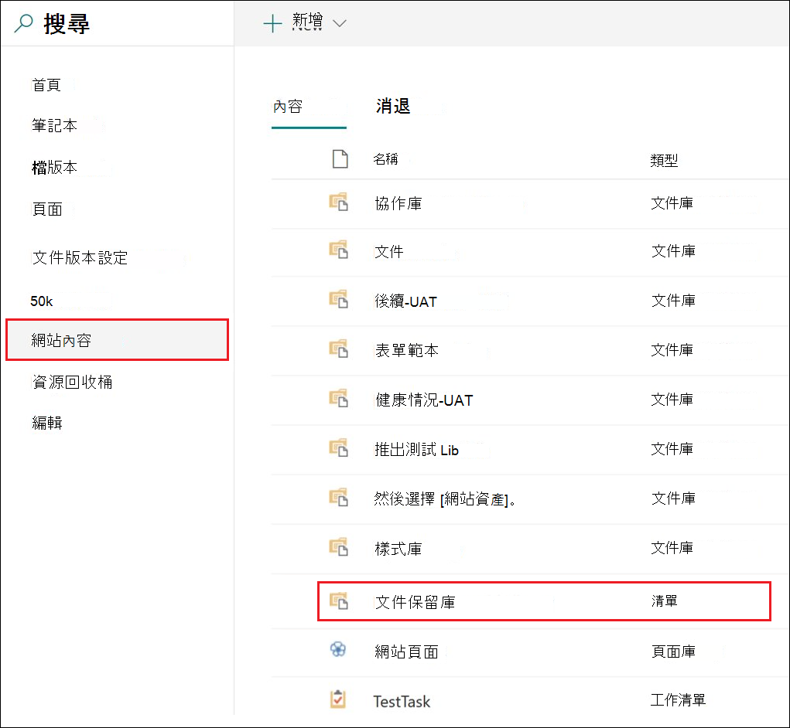

# 使用記錄版本設定來更新儲存在 SharePoint 或 OneDrive 中的記錄

>*[Microsoft 365 安全性與合規性的授權指引](https://aka.ms/ComplianceSD)。*

將文件標示為 [記錄](records.md) 的功能，以及限制可對記錄執行的動作，是任何記錄管理解決方案的重要目標。 不過，可能也會需要共同作業，讓人員建立後續的版本。

例如，您將銷售合約標示為記錄，但是之後需要使用新的條款來更新合約，並將最新的版本標示為新記錄，同時保留前一份記錄版本。 針對這些類型的案例，SharePoint 和 OneDrive 支援*記錄版本設定*。 OneNote 筆記本資料夾不支援記錄版本設定。

若要使用記錄版本設定，請先 [為文件加上標籤並將它標示為記錄](declare-records.md)。 此時，保留標籤旁會顯示名為 [記錄狀態]** 的文件內容，而初始記錄狀態會是 [鎖定]****。 

您現在可以執行下列動作：

  - **解除鎖定和鎖定記錄狀態內容，持續編輯並將文件的個別版本保留為記錄。** 只有當 [記錄狀態]**** 內容設為 [鎖定]**** 時，才會保留記錄的新版本。 這個鎖定和解除鎖定的切換，可降低保留不必要文件版本和複本的風險。

  - **將記錄自動儲存在位於網站集合內的就地記錄儲存庫中。** SharePoint 和 OneDrive 中的每個網站集合會在其 [文件保留庫] 中保留內容。 記錄版本會儲存在此文件庫的 [記錄] 資料夾中。

  - **維護包含所有版本的長青文件。** 根據預設，每個 SharePoint 和 OneDrive 文件在項目功能表上都會有版本歷程記錄。 在這個版本歷程記錄中，您可以輕鬆查看記錄的版本，並檢視這些文件。

如果任何文件的保留標籤會將項目標示為記錄，則會自動提供記錄版本設定。 當使用者透過 [詳細資料] 窗格檢視文件內容時，系統會將 [記錄狀態]**** 從 [鎖定]**** 切換為 [解除鎖定]****。 此動作會在 [文件保留庫] 的 [記錄] 資料夾中建立記錄，該記錄將在保留期的剩餘時間內保留在其中。 

文件解除鎖定後，任何擁有標準編輯權限的使用者都可以編輯該檔案。 不過，使用者無法刪除檔案，因為它仍是記錄。 編輯完成後，使用者就可以將 [記錄狀態]**** 從 [解除鎖定]**** 切換為 [鎖定]****，這會在此狀態中防止進一步編輯。
  

![標記為記錄之文件的 [記錄狀態] 內容](../media/recordversioning8.png)

## 鎖定和解除鎖定記錄

將會將內容標示為記錄的保留標籤套用至文件之後，具有 [參與] 權限或更低權限等級的任何使用者都可以解除鎖定記錄或鎖定已解除鎖定的記錄。
  

當使用者解鎖記錄後，會發生下列動作：

1. 如果目前的網站集合沒有文件保留庫，則會建立一個。

2. 如果 [文件保留庫] 沒有 [記錄] 資料夾，則會建立一個。

3. [複製到]**** 動作會將最新版本的文件複製到 [記錄] 資料夾中。 [複製到]**** 動作只會包含最新版本，而不包含先前的版本。 複製的文件現在被視為文件的記錄版本，其檔案名稱的格式為：\[標題 GUID 版本\#\]

4. 在 [記錄] 資料夾中建立的複本會新增到原始文件的版本歷程記錄中，而這個版本則會在 [註解] 欄位中顯示**記錄**一詞。

5. 原始文件是可以編輯但無法刪除的新版本。 [文件庫] 欄位 [項目是一筆記錄]**** 仍然會顯示 [是]**** 值，因為文件仍是記錄，即使現在可以編輯。

當使用者鎖定記錄後，就不能再次編輯原始檔案。 但是，解鎖記錄的動作會將版本複製到 [文件保留庫] 中的 [記錄] 資料夾中。

## 記錄版本

每次使用者解鎖記錄時，系統會將最新版本複製到 [文件保留庫] 的 [記錄] 資料夾中，而該版本則會在版本歷程記錄的 [註解]**** 欄位中包含 [記錄]**** 的值。
  

![在 [文件保留庫] 中顯示的記錄](../media/recordversioning10.png)

若要查看版本歷程記錄，請選取文件庫中的文件，然後按一下項目功能表中的 [版本歷程記錄]****。

## 記錄的儲存位置

記錄會儲存在網站集合中，頂層網站中 [文件保留庫] 的 [記錄] 資料夾。 在頂層網站的左側導覽中，選擇 [網站內容]**** \> [文件保留庫]****。
  

  

![[文件保留庫] 中的記錄資料夾](../media/recordversioning12.png)

只有網站集合系統管理員才能看到 [文件保留庫]。 此外，預設不存在 [文件保留庫]。 只有在網站集中第一次刪除具有保留標籤或保留原則的內容時，才會建立。

## 搜尋記錄版本設定事件的稽核記錄

鎖定和解鎖記錄的動作會記錄在稽核記錄中。 您可以搜尋 [已將記錄狀態變更為「鎖定」]**** 和 [已將記錄狀態變更為「未鎖定」]**** 的特定活動，其位於 [安全性與合規性中心]**** 的 [稽核記錄搜尋]**** 頁面上，[檔案與頁面活動] 區段的 [活動]**** 下拉式清單中。
  

如需搜尋這些活動的詳細資訊，請參閱[在安全性與合規性中心搜尋稽核記錄](search-the-audit-log-in-security-and-compliance.md#file-and-page-activities)中的「檔案和頁面活動」一節。

## 後續步驟

若要將內容標示為記錄，請參閱 [使用保留標籤宣告記錄](declare-records.md)。

若要了解記錄的處置，請參閱[內容處置](disposition.md)。
