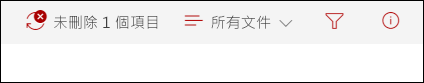
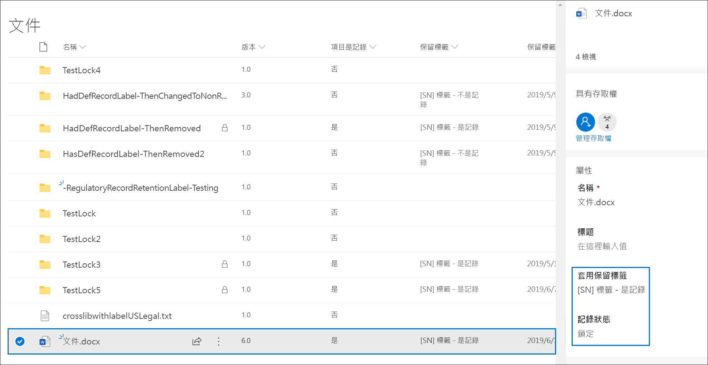
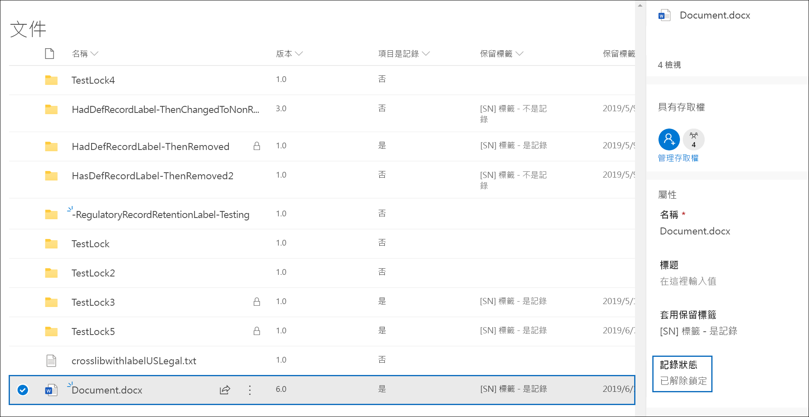
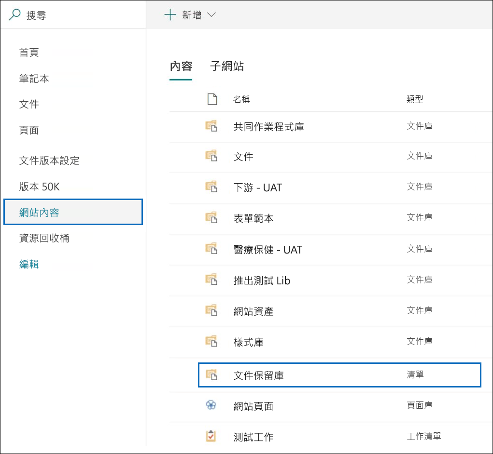
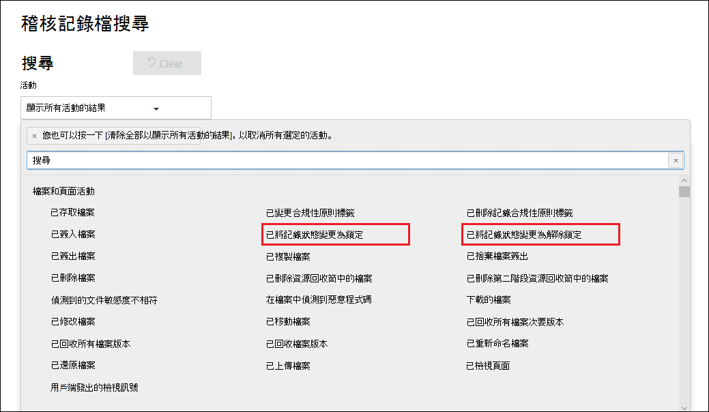

# 記錄概觀

>*[Microsoft 365 安全性與合規性的授權指引](https://aka.ms/ComplianceSD)。*

在 Microsoft 365 中記錄管理可協助組織遵守公司政策、法律和法規義務，同時降低風險和法律責任。

將內容宣告為記錄的更深一層意義為：

- 項目會變成不可改變的 (無法修改或刪除記錄)

- 關於項目的其他活動會予以記錄

- 在記錄規定的保留期限結束後，會將記錄丟棄。

您可以使用[保留標籤](labels.md)將內容分類為記錄。 建立保留標籤來宣告記錄後，您可以[發佈](labels.md#how-retention-labels-work-with-retention-label-policies)這些標籤 (讓使用者使用這些標籤將內容分類為記錄)，或[自動套用這些標籤](labels.md#applying-a-retention-label-automatically-based-on-conditions)將您想要的內容分類為記錄。 透握使用保留標籤來宣告記錄，您就可以在 Office 365 中實作單一且一致的記錄管理策略，而其他記錄管理功能 (例如 [記錄中心]) 只能套用至 SharePoint 內容。

請記住以下關於記錄的事實：

  - **記錄是不可改變的。** 除了 SharePoint 和商務用 OneDrive，也可以將內容宣告為記錄的保留標籤套用到 Exchange 中的內容。 不過，[記錄版本設定](#record-versioning)僅適用於 SharePoint 和 OneDrive，而不適用於 Exchange。

    在 Exchange 中，標示為記錄的內容在最後刪除之前是不可改變的。 如果將 Exchange 項目標示為記錄，會發生四件事：

    - 無法永久刪除此項目。

    - 無法編輯此項目。

    - 無法變更此標籤。

    - 無法移除此標籤。

  - **記錄和資料夾。** 您可以將保留標籤套用至 Exchange、SharePoint 或 OneDrive 中的資料夾。 如果資料夾已被標示為記錄，當您將項目移至該資料夾時，該項目也會被標示為記錄。 即使您將項目移出資料夾，該項目仍會繼續標示為記錄。

    此外，如果您將套用到資料夾的記錄標籤 (在 SharePoint 和 OneDrive 中) 變更為未將內容宣告為記錄的保留標籤，則該資料夾中的項目會保留其現有的記錄標籤。

    如需將保留標籤套用至 SharePoint 和 OneDrive 資料夾的詳細資訊，請參閱[將預設的保留標籤套用至 SharePoint 文件庫、資料夾或文件組的所有內容](labels.md#applying-a-default-retention-label-to-all-content-in-a-sharepoint-library-folder-or-document-set)。

  - **無法刪除記錄**。 如果使用者嘗試刪除 Exchange 中的記錄，該項目會移到 [可復原的項目] 資料夾中，如[保留原則如何就地使用內容](retention-policies.md#content-in-mailboxes-and-public-folders)中所述。

    如果使用者嘗試刪除 SharePoint 中的記錄，您會看到無法刪除該項目的錯誤，且該項目仍會保留在文件庫中。

    

    如果使用者嘗試刪除 OneDrive 中的記錄，該項目會移到 [文件保留庫] 中，如 [保留原則如何就地使用內容](retention-policies.md#content-in-onedrive-accounts-and-sharepoint-sites)中所述。

  - **無法移除記錄標籤。** 將記錄標籤套用到某個項目後，只有該位置的系統管理員 (例如 SharePoint 網站的網站集合系統管理員) 可以移除該記錄標籤。

## 使用 [保留標籤] 宣告記錄

當您建立保留標籤時，可以選擇使用保留標籤將內容分類為記錄。 若要將內容聲明為記錄，請遵循下列步驟：

1. 建立保留標籤。 在 Microsoft 365 合規性中心中，移至 [記錄管理]**** \> [檔案計畫]****。 在 [檔案計畫]**** 頁面上，按一下 [建立標籤]****。

2. 在精靈的 [標籤設定]**** 頁面上，選擇設定保留標籤的選項，將內容宣告為記錄。 

   ![按一下 [使用標籤以將內容分類為「記錄」] 核取方塊](../media/recordversioning6.png)

3. [發佈](labels.md#how-retention-labels-work-with-retention-label-policies)或[自動套用](labels.md#applying-a-retention-label-automatically-based-on-conditions)保留標籤到 SharePoint 網站和/或 OneDrive 帳戶。

### 將保留標籤套用至內容

針對 Exchange，任何有信箱寫入存取權的使用者都可以將記錄標籤套用至電子郵件訊息。 對於 SharePoint 和 OneDrive 中的內容，預設 [成員] 群組 ([參與] 權限等級) 中的任何使用者都能將記錄標籤套用到內容。 套用標籤後，只有網站集合系統管理員可以移除或變更該記錄標籤。 如先前所述，將內容分類成記錄的保留標籤可自動套用至內容。

當您將記錄標籤套用至 SharePoint 網站或 OneDrive 帳戶上的文件後，就會顯示以下內容。
  

## 記錄版本設定

記錄管理的重要部分是可將文件宣告為記錄，且該記錄是不可改變的。 同時，如果人們需要建立後續版本，則記錄的不變性可防止在文件上進行共同作業。 例如，您將銷售合約宣告為記錄，但是之後需要使用新的條款來更新合約，並將最新的版本宣告為新記錄，同時保留前一份記錄版本。 針對這些類型的案例，SharePoint Online 和商務用 OneDrive 現在支援*記錄版本設定*。 不支援 OneNote 筆記本資料夾。

若要使用記錄版本設定，第一個步驟是使用 Microsoft 365 合規性中心來建立和發佈保留標籤，以將記錄向所有 SharePoint 網站和/或 OneDrive 帳戶宣告，或將記錄發佈至特定 SharePoint 網站和/或 OneDrive 帳戶。 下一個步驟是將已發佈的保留記錄標籤套用至文件。 完成此動作之後，保留標籤旁會顯示名為 [記錄狀態]** 的文件內容，而初始記錄狀態會是 [鎖定]****。 這個時候可以執行下列動作：

  - **解鎖並鎖定 [記錄狀態] 內容，持續編輯並將文件的個別版本宣告為記錄。** 當 [記錄狀態]**** 內容設定為 [鎖定]**** 時，只會保留宣告為記錄的版本。 這可降低保留不必要文件版本和複本的風險。

  - **將記錄自動儲存在位於網站集合內的就地記錄儲存庫中。** SharePoint 和 OneDrive 中的每個網站集合會在其 [文件保留庫] 中保留內容。 記錄版本會儲存在此文件庫的 [記錄] 資料夾中。

  - **維護包含所有版本的長青文件。** 根據預設，每個 SharePoint 和 OneDrive 文件在項目功能表上都會有版本歷程記錄。 在這個版本歷程記錄中，您可以輕鬆查看記錄的版本，並檢視這些文件。

如果任何文件的保留標籤會將項目宣告為記錄，則會自動提供記錄版本設定。 當使用者透過 [詳細資料] 窗格查看文件內容時，系統會將 [記錄狀態]**** 從 [鎖定]**** 切換為 [解除鎖定]****。 只要按一下就能在 [文件保留庫] 的 [記錄] 資料夾中建立記錄，該記錄將在保留期的剩餘時間內保留在其中。 文件解除鎖定後，任何擁有權限的使用者都可以編輯該檔案。 不過，使用者無法刪除檔案，因為這是已宣告的記錄。 完成必要的變更之後，使用者就可以將 [記錄狀態]**** 從 [已解鎖]**** 切換為 [鎖定]****，這樣文件就會再次宣告為記錄，且無法編輯。
  

![標記為記錄之文件的 [記錄狀態] 內容](../media/recordversioning8.png)

> [!NOTE]
> 記錄版本設定要求每位有權編輯在 SharePoint 網站或 OneDrive 帳戶中被宣告為記錄的內容的使用者，都必須獲得 Office 365 Enterprise E5 授權。 具有唯讀存取權的使用者不需要此授權。

### 鎖定和解除鎖定記錄

當您將記錄標籤指派給文件之後，具有 [參與] 權限或更低權限等級的所有使用者都可以解除鎖定記錄或鎖定已解鎖的記錄。
  

當使用者解鎖記錄後，會發生下列動作：

1. 如果目前的網站集合沒有文件保留庫，則會建立一個。

2. 如果 [文件保留庫] 沒有 [記錄] 資料夾，則會建立一個。

3. [複製到]**** 動作會將最新版本的文件複製到 [記錄] 資料夾中。 [複製到]**** 動作只會包含最新版本，而不包含先前的版本。 複製的文件現在被視為文件的記錄版本，其檔案名稱的格式為：\[標題 GUID 版本\#\]

4. 在 [記錄] 資料夾中建立的複本會新增到原始文件的版本歷程記錄中，而這個版本則會在 [註解] 欄位中顯示 [記錄]**** 這兩個字。

5. 原始文件是可以編輯 (但無法刪除) 的新版本。 [文件庫] 欄位 [項目是一筆記錄]**** 仍然會顯示 [是]**** 值，因為文件仍被視為記錄，即使現在可以編輯。

當使用者鎖定記錄後，就不能再次編輯原始檔案。 但是，解鎖記錄的動作會將版本複製到 [文件保留庫] 中的 [記錄] 資料夾中。

### 記錄版本

每次使用者解鎖記錄時，系統會將最新版本複製到 [文件保留庫] 的 [記錄] 資料夾中，而該版本則會在版本歷程記錄的 [註解]**** 欄位中包含 [記錄]**** 的值。
  

![在 [文件保留庫] 中顯示的記錄](../media/recordversioning10.png)

若要查看版本歷程記錄，請選取文件庫中的文件，然後按一下項目功能表中的 [版本歷程記錄]****。

### 記錄的儲存位置

記錄會儲存在網站集合中，頂層網站中 [文件保留庫] 的 [記錄] 資料夾。 在頂層網站的左側瀏覽中，選擇 [網站內容]**** \> [文件保留庫]****。
  

  

![[文件保留庫] 中的記錄資料夾](../media/recordversioning12.png)

只有網站集合系統管理員才能看到 [文件保留庫]。 此外，預設不存在 [文件保留庫]。 只有在網站集中第一次刪除具有保留標籤或保留原則的內容時，才會建立。

### 搜尋記錄版本設定事件的稽核記錄

鎖定和解鎖記錄的動作會記錄在稽核記錄中。 您可以搜尋 [已將記錄狀態變更為「鎖定」]**** 和 [已將記錄狀態變更為「未鎖定」]**** 的特定活動，其位於 [安全性與合規性中心]**** 的 [稽核記錄搜尋]**** 頁面上，[檔案與頁面活動] 區段的 [活動]**** 下拉式清單中。
  

如需搜尋這些活動的詳細資訊，請參閱[在安全性與合規性中心搜尋稽核記錄](search-the-audit-log-in-security-and-compliance.md#file-and-page-activities)中的「檔案和頁面活動」一節。
