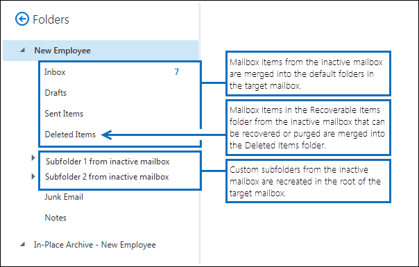

# <a name="restore-an-inactive-mailbox"></a>還原非作用中的信箱

非使用中的信箱 (是一種虛刪除的信箱) ，用來在離開組織之後保留離職員工的電子郵件。 如果另一位員工承擔已離開員工的工作責任，或是該員工回到您的組織，有兩種方式可以讓使用者使用非使用中信箱的內容：

- **還原非使用中的信箱** 如果另一位員工承擔已離開員工的工作責任，或是其他使用者需要存取非使用中信箱的內容，您可以還原 (或合併) 非使用中信箱的內容到現有的信箱。 您也可以從非使用中的信箱還原封存。 還原後，非作用中的信箱會保留並保留為非使用中的信箱。 本主題說明還原非使用中信箱的程式。

- **復原非使用中的信箱** 如果已離開員工回到您的組織，或是聘用新的員工來承擔已離開員工的工作責任，您可以復原非使用中信箱的內容。 這個方法會將非使用中的信箱轉換成包含非使用中信箱內容的新信箱。 它會復原之後，非使用中的信箱不存在。 如需逐步程式，請參閱[復原 Office 365 中的非使用中信箱](recover-an-inactive-mailbox.md)。

如需還原和復原非使用中信箱之差異的詳細資訊，請參閱本文中的 [詳細資訊](#more-information) 一節。

> [!NOTE]
> 您無法復原或還原已設定為自動展開封存的非使用中信箱。 如果您需要從自動展開封存的非使用中信箱復原資料，請使用內容搜尋來匯出信箱中的資料，然後匯入至另一個信箱。 如需相關指示，請參閱下列主題：
>
> - [內容搜尋](content-search.md)
> - [匯出內容搜尋結果](export-search-results.md)

## <a name="requirements-to-restore-an-inactive-mailbox"></a>還原非使用中信箱的需求

- 您必須使用 Exchange Online PowerShell 還原非使用中的信箱。 您無法使用 Exchange 系統管理中心 (EAC) 。 如需逐步指示，請參閱[連線到 Exchange Online PowerShell](/powershell/exchange/connect-to-exchange-online-powershell)。

- 在 Exchange Online PowerShell 中執行下列命令，以取得組織中非使用中信箱的身分識別資訊。

  ```powershell
  Get-Mailbox -InactiveMailboxOnly | Format-List Name,DistinguishedName,ExchangeGuid,PrimarySmtpAddress
  ```

  使用由此命令傳回的資訊，還原特定的非使用中信箱。

- 如需非使用中信箱的相關資訊，請參閱[Office 365 中的非使用中信箱](inactive-mailboxes-in-office-365.md)。

## <a name="restore-inactive-mailboxes"></a>還原非使用中的信箱

使用 **New-MailboxRestoreRequest** Cmdlet 搭配  _SourceMailbox_ 及  _TargetMailbox_ 參數，將非使用中信箱的內容還原到現有信箱。 如需使用此 Cmdlet 的詳細資訊，請參閱 [New-MailboxRestoreRequest](/powershell/module/exchange/new-mailboxrestorerequest)。

1. 建立包含非使用中信箱之屬性的變數。

   ```powershell
   $InactiveMailbox = Get-Mailbox -InactiveMailboxOnly -Identity <identity of inactive mailbox>
   ```

   > [!IMPORTANT]
   > 在上述命令中，使用 **DistinguishedName** 或 **ExchangeGUID** 屬性的值來識別非使用中的信箱。 這兩個屬性對於組織中的每個信箱都是唯一的，而使用中和非使用中的信箱可能會有相同的主要 SMTP 位址。

2. 將非使用中信箱的內容還原到現有的信箱。 非使用中信箱的內容 (來源信箱) 會合並至現有信箱 (目標信箱) 中的對應資料夾。

   ```powershell
   New-MailboxRestoreRequest -SourceMailbox $InactiveMailbox.DistinguishedName -TargetMailbox newemployee@contoso.com -AllowLegacyDNMismatch
   ```

   或者，您也可以指定要從非使用中的信箱還原內容之目標信箱中的最上層資料夾。 如果指定的目的檔案夾或目的檔案夾結構尚未存在於目標信箱中，則會在還原程式期間建立。

   此範例會將非使用中信箱的信箱專案及子資料夾，複製到目標信箱的最上層資料夾結構中名為 "非使用中信箱" 的資料夾。

   ```powershell
   New-MailboxRestoreRequest -SourceMailbox $InactiveMailbox.DistinguishedName -TargetMailbox newemployee@contoso.com -TargetRootFolder "Inactive Mailbox" -AllowLegacyDNMismatch
   ```

## <a name="restore-the-archive-from-an-inactive-mailbox"></a>從非使用中的信箱還原封存

如果非使用中的信箱具有封存信箱，您也可以將它還原到現有信箱的封存信箱。 若要從非使用中的信箱還原封存，您必須新增 _SourceIsArchive_ 和 _TargetIsArchive_ 切換至用來還原非使用中信箱的命令。

1. 建立包含非使用中信箱之屬性的變數。

   ```powershell
   $InactiveMailbox = Get-Mailbox -InactiveMailboxOnly -Identity <identity of inactive mailbox>
   ```

   > [!NOTE]
   > 在上述命令中，使用 **DistinguishedName** 或 **ExchangeGUID** 屬性的值來識別非使用中的信箱。 這兩個屬性對於組織中的每個信箱都是唯一的，而使用中和非使用中的信箱可能會有相同的主要 SMTP 位址。

2. 將封存的內容從非使用中的信箱還原到現有信箱的封存 (來源封存)  (目標封存) 。 在此範例中，會將來源封存的內容複寫到目標信箱的封存中名為「非使用中信箱封存」的資料夾。

   ```powershell
   New-MailboxRestoreRequest -SourceMailbox $InactiveMailbox.DistinguishedName -SourceIsArchive -TargetMailbox newemployee@contoso.com -TargetIsArchive -TargetRootFolder "Inactive Mailbox Archive" -AllowLegacyDNMismatch
   ```

## <a name="more-information"></a>其他資訊

- **復原和還原非使用中信箱的主要差異為何？** 當您復原非使用中的信箱時，信箱基本上會轉換為新的信箱、非使用中信箱的內容和資料夾結構會保留，而且信箱會連結至新的使用者帳戶。 復原之後，非使用中的信箱不再存在，對新信箱中的內容所做的任何變更，都會影響原始在非使用中信箱中的內容。 相反地，當您還原非使用中的信箱時，內容只會複製到另一個信箱。 非使用中的信箱會保留並保持非作用中的信箱。 對目標信箱中的內容所做的任何變更，都不會影響保留在非使用中信箱的原始內容。 使用 [內容搜尋工具](content-search.md)仍可搜尋非使用中的信箱，其內容可以還原至另一個信箱，也可以在日後復原或刪除。

- **如何找到非作用中的信箱？** 若要取得組織中非使用中信箱的清單，並顯示還原非使用中信箱的有用資訊，您可以執行此命令。

  ```powershell
  Get-Mailbox -InactiveMailboxOnly | Format-List Name,PrimarySMTPAddress,DistinguishedName,ExchangeGUID,LegacyExchangeDN,ArchiveStatus
  ```

- **使用訴訟暫止或 Microsoft 365 保留原則，保留非使用中的信箱內容。** 如果您想要在還原非使用中的信箱時保留其狀態，您可以將目標信箱設定為[訴訟暫](create-a-litigation-hold.md)止，或套用[Microsoft 365 保留原則](retention.md)，再還原非使用中的信箱。 這會在還原至目標信箱後，避免永久刪除非作用中信箱中的任何專案。

- **在還原非使用中的信箱之前，請先在目標信箱上啟用保留功能。** 由於非使用中信箱的信箱專案可能是舊的，因此您可以考慮在還原非使用中的信箱之前，先在目標信箱上啟用保留功能。 當您將信箱設為保留狀態時，將不會處理指派給它的保留原則，除非已移除保留狀態，或保留期間到期。 這可讓目標信箱的擁有者管理非使用中信箱的舊郵件。 否則，保留原則可能會刪除舊專案 (或將專案移至封存信箱（如果已啟用，則會根據為目標信箱設定的保留設定）已到期) 。 如需詳細資訊，請參閱[在 Exchange Online 中將信箱設為保留狀態](/exchange/security-and-compliance/messaging-records-management/mailbox-retention-hold)。

- **AllowLegacyDNMismatch 參數會執行什麼動作？** 在上述範例中，若要還原非使用中的信箱， **AllowLegacyDNMismatch** 參數會用於允許將非使用中的信箱還原至不同的目標信箱。 在一般還原案例中，目標是還原來源與目標信箱相同信箱的內容。 所以根據預設， **New-MailboxRestoreRequest** 指令程式會檢查，以確保來源和目標信箱上 **LegacyExchangeDN** 屬性的值相同。 這有助於防止您不小心將來源信箱還原至錯誤的目標信箱。 如果您嘗試在未使用 **AllowLegacyDNMismatch** 參數的情況下還原非使用中的信箱，當來源和目標信箱的 **LegacyExchangeDN** 屬性值不同時，此命令可能會失敗。

- **您可以搭配使用 New-MailboxRestoreRequest Cmdlet 的其他參數，針對非使用中的信箱執行不同的還原案例。** 例如，您可以執行此命令，將非使用中信箱的封存還原至目標信箱的主要信箱。

  ```powershell
  New-MailboxRestoreRequest -SourceMailbox <inactive mailbox> -SourceIsArchive -TargetMailbox <target mailbox> -TargetRootFolder "Inactive Mailbox Archive" -AllowLegacyDNMismatch
  ```

  您也可以執行下列命令，將非使用中的主要信箱還原到目標信箱的封存中。

  ```powershell
  New-MailboxRestoreRequest -SourceMailbox <inactive mailbox> -TargetMailbox <target mailbox> -TargetIsArchive -TargetRootFolder "Inactive Mailbox" -AllowLegacyDNMismatch
  ```

- **TargetRootFolder 參數的功能為何？** 如先前所述，您可以使用 **TargetRootFolder** 參數來指定資料夾結構頂端的資料夾 (也稱為根) 的目標信箱中，以還原非使用中信箱的內容。 如果您未使用此參數，則非使用中信箱的信箱專案會合並至目標信箱的對應預設資料夾，而且會在目標信箱的根目錄中重新建立自訂資料夾。 下列圖例會強調不使用和使用 **TargetRootFolder** 參數之間的差異。

  **未使用 TargetRootFolder 參數時，目標信箱中的資料夾階層**

  

  **使用 TargetRootFolder 參數時，目標信箱中的資料夾階層**

  