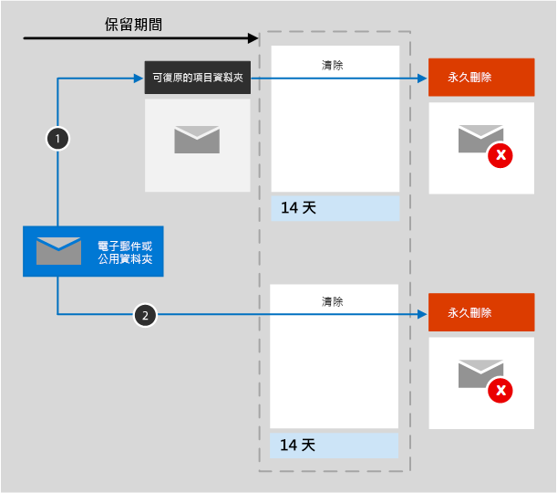

# 了解 Exchange 的保留原則

本文中的資訊可補充[了解保留原則](retention-policies.md)，因為其包含 Exchange 專用的資訊。

## 保留原則如何與 Exchange 位置搭配使用

對於使用者的信箱、行事曆和其他項目，保留原則會在信箱層級套用。

對於公用資料夾，保留原則會套用在資料夾層級套用，而不是信箱層級。 

信箱和公用資料夾都是使用 [可復原的項目] 資料夾來保留項目。 已獲指派電子文件探索權限的人員可以檢視其他使用者的 [可復原的項目] 資料夾中的項目。
  
當使用者從 [刪除的郵件] 資料夾以外的資料夾刪除郵件時，根據預設，會將該郵件移至 [刪除的郵件] 資料夾。 當使用者從 [刪除的郵件] 資料夾中刪除項目時，郵件會移至 [可復原的項目] 資料夾。 不過，使用者可以將任何資料夾中的項目虛刪除 (Shift+Delete)，這會略過 [刪除的郵件] 資料夾，並將項目移至 [可復原的項目] 資料夾中。
  
將保留原則套用至 Exchange 位置時，計時器工作會定期評估 [可復原的項目] 資料夾中的項目。 如果項目不符合至少一個保留原則的規則，則會永久刪除 [可復原的項目] 資料夾中的項目 (也就是「實刪除」)。

計時器工作最多可能需要七天才能執行，且 Exchange 位置必須包含至少 10 MB。
  
當使用者嘗試變更信箱項目的內容時 (例如主旨、內文、附件、寄件者和收件者，或是傳送或接收郵件的日期)，在認可變更之前，會先將原始項目的複本儲存至 [可復原的項目] 資料夾。 後續每次變更都會執行此動作。 在保留期間結束時，系統會永久刪除 [可復原的項目] 資料夾中的複本。

將保留原則指派至信箱或公用資料夾後，內容的路徑會取決於保留設定為保留和刪除、僅保留或僅刪除。

當保留設定為保留和刪除時：

1. **如果使用者在保留期間修改或永久刪除項目** (按 SHIFT+DELETE 或從 [刪除的郵件] 刪除)：系統會將項目移動 (或複製 - 在編輯的情況下) 到 [可復原的項目] 資料夾。 計時器工作會在此處定期執行，並識別保留期間已過期的項目，而且會在保留期間結束的 14 天內永久刪除這些項目。 請注意，14 天是預設的設定，但最多可設定為 30 天。

2. **如果未在保留期間修改或刪除項目**：系統會在信箱中的所有資料夾上定期執行相同程序，找到保留期間已過期的項目，並在保留期間結束的 14 天內永久刪除這些項目。 請注意，14 天是預設的設定，但最多可設定為 30 天。 

當保留設定為僅保留或僅刪除時，內容路徑為保留和刪除的變化：

### 僅保留保留設定的內容路徑

1. 在保留期間，**如果項目遭修改或刪除**：則會在 [可復原的項目] 資料夾中建立原始項目的複本，並保留到保留期間結束時，然後在該項目到期後 14 天內永久刪除 [可復原的項目] 資料夾中的複本。 

2. 在保留期間，**如果未修改或刪除項目**：保留期間前後沒有任何變化；項目仍會保留在其原始位置。

### 僅刪除保留設定的內容路徑

1. **如果未在保留期間刪除項目**：在保留原則中設定的期間結束時，系統會將項目移至 [可復原的項目] 資料夾。 

2. **如果在保留期間刪除項目**：系統會立即將項目移至 [可復原的項目] 資料夾。 如果使用者從該處刪除項目或清空 [可復原的項目] 資料夾，就會永久刪除項目。 否則，系統會在項目在 [可復原的項目] 資料夾中保留 14 天後永久刪除。 

## 從保留原則中排除特定類型的 Exchange 項目

您可以使用 PowerShell，在保留原則設定為僅保留時，從保留原則中排除特定類型的 Exchange 項目。 例如，您可以排除語音信箱訊息、IM 交談，與信箱中的其他商務用 Skype Online 內容。 您也可以排除行事曆、筆記和工作項目。 此功能僅在使用 PowerShell 時才可供使用；當您在 Microsoft 365 合規性中心使用精靈建立保留原則時，無法使用此功能。
  
若要在保留原則中排除您選取的 Exchange 項目類型，請使用 [New-RetentionComplianceRule](https://docs.microsoft.com/powershell/module/exchange/new-retentioncompliancerule) 和 [Set-RetentionComplianceRule](https://docs.microsoft.com/powershell/module/exchange/set-retentioncompliancerule) Cmdlet 搭配 `ExcludedItemClasses` 參數。

若要使用保留原則 Cmdlet，您必須先[連線至安全性與合規性中心 Powershell](https://docs.microsoft.com/powershell/exchange/connect-to-scc-powershell?view=exchange-ps)。

## 當使用者離開組織時 

如果組織中的使用者離職，且保留原則中包含使用者的信箱，在刪除使用者的 Microsoft 365 帳戶後，信箱會變成非作用中的信箱。 在變成非作用的狀態之前，非作用中信箱的內容仍受限於信箱上所設之任何保留原則，且內容可供電子文件探索搜尋。 如需詳細資訊，請參閱 [Exchange Online 中的非作用中信箱](inactive-mailboxes-in-office-365.md)。 

## 如何為 Exchange 設定保留原則

按照 [建立及設定保留原則] 和 [選擇位置]**** 精靈頁面中的指示進行，選取下列其中一個選項：

- **僅將原則套用到 Exchange 電子郵件、公用資料夾、Office 365 群組、OneDrive 及 SharePoint 文件中的內容**

- **[讓我選擇特定位置]** > **[Exchange 電子郵件]**、**[Exchange 公開資料夾]**，和 **[Office 365 群組]**。

即使 Microsoft 365 群組有 Exchange 信箱，包含整個 **Exchange 電子郵件**位置的保留原則並不會包含 Microsoft 365 群組信箱中的內容。 若要保留這些信箱中的內容，請選取 **[Office 365 群組]** 位置。
