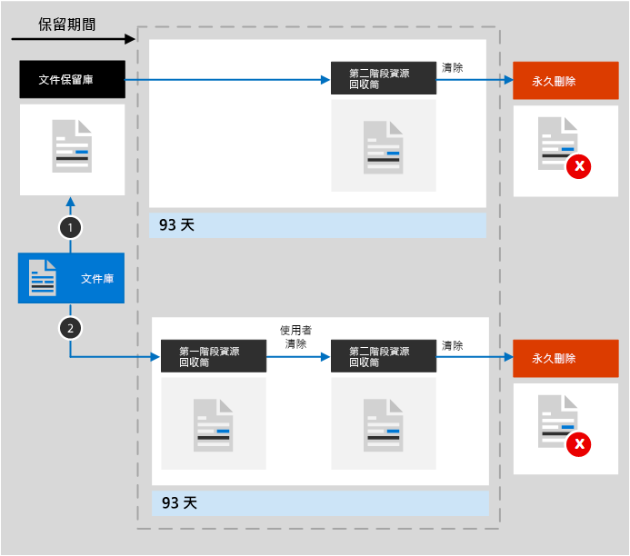

# 瞭解 SharePoint 和 OneDrive 的保留功能Learn about retention for SharePoint and OneDrive

>*[Microsoft 365 安全性與合規性的授權指引](/office365/servicedescriptions/microsoft-365-service-descriptions/microsoft-365-tenantlevel-services-licensing-guidance/microsoft-365-security-compliance-licensing-guidance)。**[Microsoft 365 licensing guidance for security & compliance](/office365/servicedescriptions/microsoft-365-service-descriptions/microsoft-365-tenantlevel-services-licensing-guidance/microsoft-365-security-compliance-licensing-guidance).*

本文中的資訊補充了[瞭解保留功能](retention.md)的資訊，因為其資訊涵蓋了 SharePoint 和 OneDrive 專用的資訊。The information in this article supplements [Learn about retention](retention.md) because it has information that's specific to SharePoint and OneDrive.

若為其他工作負載，請參閱：For other workloads, see:

- [了解 Microsoft Teams 保留Learn about retention for Microsoft Teams](retention-policies-teams.md)
- [了解 Yammer 的保留Learn about retention for Yammer](retention-policies-yammer.md)
- [了解 Exchange 的保留Learn about retention for Exchange](retention-policies-exchange.md)

## 保留與刪除包含的內容What's included for retention and deletion

透过應用保留原则或保留標籤，可以保留 SharePoint 或 OneDrive 網站中储存的所有檔案。All files stored in SharePoint or OneDrive sites can be retained by applying a retention policy or retention label. 

可以删除以下檔案：The following files can be deleted:

- 使用保留原则時：文件庫中的所有檔案包括任何自動建立的 SharePoint 文件庫，如 **網站資產**。When you use a retention policy: All files in document libraries, which include any automatically created SharePoint document libraries, such as **Site Assets**.
    
- 使用保留標籤時：所有文件庫中的所有檔案，以及根層級不在資料夾中的所有檔案。When you use retention labels: All files in all document libraries, and all files at the root level that aren't in a folder.
    
> [!TIP]
> 當您將[帶有自動套用原則的査詢用於保留標籤](apply-retention-labels-automatically.md#auto-apply-labels-to-content-with-keywords-or-searchable-properties)時，可以使用以下項目排除指定文件庫：`NOT(DocumentLink:"<URL to document library>")`When you use a [query with an auto-apply policy for a retention label](apply-retention-labels-automatically.md#auto-apply-labels-to-content-with-keywords-or-searchable-properties), you can exclude specific document libraries by using the following entry: `NOT(DocumentLink:"<URL to document library>")`

清單項目不受保留原則支援，但受保留標籤支援 (系統清單中的項目除外)。List items are not supported by retention policies but are supported by retention labels with the exception of items in system lists. 這些是 SharePoint 用來管理系統的隱藏清單，並包括主版頁面目錄、解決方案目錄及資料來源。These are hidden lists used by SharePoint to manage the system and include the master page catalog, solution catalog, and data sources. 當您將保留標籤套用至具有文件附件的支援清單項目時：When you apply a retention label to a supported list item that has a document attachment:
- 針對標準保留標籤 (不將項目宣告為記錄)：For a standard retention label (doesn't declare the item to be a record):
    - 文件附件不會自動繼承標籤的保留設定，但是可以獨立標記。The document attachment doesn't automatically inherit the retention settings of the label, but can be labeled independently.
- 針對將項目宣告為記錄的保留標籤：For a retention label that declares the item a record: 
    - 如果文件尚未標記，文件附件會自動從標籤繼承保留設定。The document attachment automatically inherits the retention settings from the label if the document isn't already labeled.

來自保留原則和保留標籤的保留設定，均不適用包含文件庫、清單及資料夾的組織結構。Retention settings from both retention policies and retention labels do not apply to organizing structures that include libraries, lists, and folders.

針對保留原則和自動套用標籤原則：SharePoint 網站必須編制索引，才能套用保留設定。For retention policies and auto-apply label policies: SharePoint sites must be indexed for the retention settings to be applied. 不過，如果 SharePoint 文件庫中的項目設定為不在搜尋結果中顯示，此設定就不會將這些檔案從保留設定中排除。However, if items in SharePoint document libraries are configured to not appear in search results, this configuration doesn't exclude files from the retention settings.

## 保留功能在 SharePoint 以及 [OneDrive] 中的運作方式。How retention works for SharePoint and OneDrive

若要儲存需要保留的內容，SharePoint 和 OneDrive 會建立一個文件保留庫 (如果尚不存在)。To store content that needs to be retained, SharePoint and OneDrive create a Preservation Hold library if one doesn't exist. 您可以在網站集合的頂層網站中的 [網站內容] 頁面上檢視此文件庫。You can view this library on the **Site contents** page in the top-level site of the site collection. 文件保留庫僅供網站集合系統管理員檢視，大部分的使用者都無法檢視。Most users can't view the Preservation Hold library because it's visible only to site collection administrators.

SharePoint 中具有標準保留標籤的項目 (不宣告該項目為記錄) 不需要文件保留庫，因為這些項目保留在其原始位置。Items in SharePoint that have a standard retention label (doesn't declare the item to be a record) don't need the Preservation Hold library because these items remain in their original location. 設定套用的保留標籤以保留內容時，SharePoint 會封鎖使用者删除項目，而在編輯項目時，SharePoint 版本設定會保留舊版本。SharePoint prevents users from deleting items when the applied retention label is configured to retain the content, and SharePoint versioning preserves older versions when items are edited. 但對於其他案例，在必須保留項目時使用文件保留庫：But for other scenarios, the Preservation Hold library is used when items must be retained:
- OneDrive 中具有標準保留標籤的項目Items in OneDrive that have standard retention labels
- SharePoint 或 OneDrive 中的項目具有宣告為記錄之保留標籤，並且該項目已解鎖以進行編輯Items in SharePoint or OneDrive that have retention labels that declares them a record, and the item is unlocked for editing
- 受保留原則限制的項目Items that are subject to retention policies

若要在使用者嘗試變更或删除此內容時保留此內容，將檢查自套用保留設定後內容是否已變更。To retain this content when a user attempts to change or delete it, a check is made whether the content's been changed since the retention settings were applied. 如果這是套用原則後的第一次變更，檔案的內容會先被複製到 [文件保留庫]，然後允許使用者變更或刪除原始內容。If this is the first change since the retention settings were applied, the content is copied to the Preservation Hold library, which allows the person to change or delete the original content. 您可以將網站集合中的任何內容，複製到 [文件保留庫]，不需套用保留設定。Any content in a site collection can be copied to the Preservation Hold library, independently from retention settings.
  
計時器工作會定期清理 [文件保留庫]。A timer job periodically cleans up the Preservation Hold library. 針對在文件保留庫中超過 30 天的內容，此工作會將設有保留設置的所有查詢內容進行比較。For content that has been in the Preservation Hold library for more than 30 days, this job compares the content to all queries used by the retention settings for that content. 比其設定的保留期間更舊的內容稍後會從文件保留庫中刪除，以及從原始位置刪除 (如果仍然存在)。Content that is older than their configured retention period is then deleted from the Preservation Hold library, and the original location if it is still there. 此計時器工作每 7 天執行一次，這表示與最少 30 天一起，最多可能需要 37 天才能從文件保留庫刪除內容。This timer job runs every seven days, which means that together with the minimal 30 days, it can take up to 37 days for content to be deleted from the Preservation Hold library.

當檔案保留在文件保留庫中時，系統管理員將無法刪除內容的 SharePoint 網站或 OneDrive 帳戶。While files are retained in the Preservation Hold library, administrators won't be able to delete the content's SharePoint site or OneDrive account.

將檔案複製到文件保留庫的這個行為，會套用到在套用保留設定時存在的內容。This behavior for copying files into the Preservation Hold library applies to content that exists when the retention settings were applied. 此外，針對保留原則，任何在納入原則後的新增或建立在網站的新內容都將會保留在文件保留庫中。In addition, for retention policies, any new content that's created or added to the site after it was included in the policy will be retained in the Preservation Hold library. 不過，新內容在第一次編輯時並不會複製到文件保留庫，而只有在刪除時才會。However, new content isn't copied to the Preservation Hold library the first time it's edited, only when it's deleted. 若要保留檔案的所有版本，您必須開啟[版本設定](#how-retention-works-with-document-versions)。To retain all versions of a file, you must turn on [versioning](#how-retention-works-with-document-versions).
  
如果使用者嘗試删除要保留的文件庫、清單、資料夾或網站，則會收到錯誤訊息。Users see an error message if they try to delete a library, list, folder, or site that's subject to retention. 如果首先移動或删除資料夾中要保留的任何檔案，則他們可以删除資料夾。They can delete a folder if they first move or delete any files in the folder that are subject to retention.

> [!NOTE]
> 因為文件保留庫僅在需要時建立，而非在套用保留原則或保留標籤時，所以要使其正常運作，必須首先編輯或删除受保留限制的項目。Because the Preservation Hold library is created only when it's needed, and not when you apply a retention policy or retention label, to see this working, you must first edit or delete an item that's subject to retention. 然後瀏覽到文件保留庫以檢視保留的副本。Then browse to the Preservation Hold library to view the retained copy.
  
將保留原則指派至 OneDrive 帳戶或 SharePoint 網站後，內容的路徑會根據保留原則為保留和刪除、僅保留或僅刪除。After retention settings are assigned to content in a OneDrive account or SharePoint site, the paths the content takes depend on whether the retention settings are to retain and delete, to retain only, or delete only.

當保留設定為保留和刪除時：When the retention settings are to retain and delete:

  
1. 若已在保留期間 **修改或刪除內容**，即會在文件保留庫中建立指派保留設定時即存在之原始內容的複本。**If the content is modified or deleted** during the retention period, a copy of the original content as it existed when the retention settings were assigned is created in the Preservation Hold library. 此時，計時器工作會識別保留期間已過期的項目。There, the timer job identifies items whose retention period has expired. 這些項目會移到第二階段資源回收筒，並在 93 天結束時永久刪除。Those items are moved to the second-stage Recycle Bin, where they're permanently deleted at the end of 93 days. 使用者看不到第二階段資源回收筒 (只能看到第一階段資源回收筒)，但網站集合管理員可以檢視並從該處還原內容。The second-stage Recycle Bin is not visible to end users (only the first-stage Recycle Bin is), but site collection admins can view and restore content from there.

    > [!NOTE]
    > 為了防止意外的資料遺失，我們不再永久刪除保留文件庫中的內容。To help prevent inadvertent data loss, we no longer permanently delete content from the Preservation Hold library. 相反地，我們只會從資源回收筒中永久刪除內容。因此，來自保留文件庫的所有內容，現在將會移至第二階段資源回收筒。Instead, we permanently delete content only from the Recycle Bin, so all content from the Preservation Hold library now goes through the second-stage Recycle Bin.
    
2. **如果未在保留期間修改或刪除內容**，計時器工作會在保留期間結束時將此內容移至第一階段資源回收筒。**If the content is not modified or deleted** during the retention period, the timer job moves this content to the first-stage Recycle Bin at the end of the retention period. 如果使用者從此處刪除內容，或清空此資源回收筒 (也就是清除)，則會將文件移至第二階段資源回收筒。If a user deletes the content from there or empties this Recycle Bin (also known as purging), the document is moved to the second-stage Recycle Bin. 93 天保留期間涵蓋了第一和第二階段資源回收筒。93 天結束時，則會從文件所在的任何位置永久刪除文件 (無論是第一或第二階段資源回收筒)。A 93-day retention period spans both the first- and second-stage recycle bins. At the end of 93 days, the document is permanently deleted from wherever it resides, in either the first-stage or second-stage Recycle Bin. 系統並未對資源回收筒編製索引，因此無法提供搜尋。The Recycle Bin is not indexed and therefore unavailable for searching. 如此一來，電子文件探索搜尋就找不到可放置保留的資源回收筒內容。As a result, an eDiscovery search can't find any Recycle Bin content on which to place a hold.

當保留設定為僅保留或僅刪除時，內容路徑為保留和刪除的變化：When the retention settings are retain-only, or delete-only, the contents paths are variations of retain and delete:

### 僅保留保留設定的內容路徑Content paths for retain-only retention settings

1. 在保留期間，**如果內容已修改或刪除**：原始文件的複本會在文件保留庫內建立，並保留到保留期間結束時，然後文件保留庫內的複本會移至第二階段資源回收筒，並在 93 天後永久刪除。**If the content is modified or deleted** during the retention period: A copy of the original document is created in the Preservation Hold library and retained until the end of the retention period, when the copy in the Preservation Hold library is moved to the second-stage Recycle Bin and is permanently deleted after 93 days.

2. 在保留期間，**如果未修改或刪除內容**：保留期間前後沒有任何變化；文件仍會保留在其原始位置。**If the content is not modified or deleted** during the retention period: Nothing happens before and after the retention period; the document remains in its original location.

### 僅刪除保留設定的內容路徑Content paths for delete-only retention settings

1. **如果在設定的保留期間刪除內容**：文件會移至第一階段資源回收筒。**If the content is deleted** during the configured period: The document is moved to first-stage Recycle Bin. 如果使用者從此處刪除文件，或清空此資源回收筒，則會將文件移至第二階段資源回收筒。If a user deletes the document from there or empties this Recycle Bin, the document is moved to the second-stage Recycle Bin. 93 天保留期間涵蓋了第一和第二階段資源回收筒。93 天結束時，則會從文件所在的任何位置永久刪除文件 (無論是第一或第二階段資源回收筒)。A 93-day retention period spans both the first-stage and second-stage recycle bins. At the end of 93 days, the document is permanently deleted from wherever it resides, in either the first-stage or second-stage Recycle Bin. 如果在設定的期間修改內容，則在保留期間後會遵循相同的刪除路徑。If the content is modified during the configured period, it follows the same deletion path after the configured period.

2. **如果未在設定的保留期間刪除內容**：在設定的保留期間結束時，系統會將文件移至第一階段資源回收筒。**If the content is not deleted** during the configured period: At the end of the configured period in the retention policy, the document is moved to the first-stage Recycle Bin. 如果使用者從此處刪除文件，或清空此資源回收筒 (也就是清除)，則會將文件移至第二階段資源回收筒。If a user deletes the document from there or empties this Recycle Bin (also known as purging), the document is moved to the second-stage Recycle Bin. 93 天保留期間涵蓋了第一和第二階段資源回收筒。93 天結束時，則會從文件所在的任何位置永久刪除文件 (無論是第一或第二階段資源回收筒)。A 93-day retention period spans both the first-stage and second-stage recycle bins. At the end of 93 days, the document is permanently deleted from wherever it resides, in either the first-stage or second-stage Recycle Bin. 系統並未對資源回收筒編製索引，因此無法提供搜尋。The Recycle Bin is not indexed and therefore unavailable for searching. 如此一來，電子文件探索搜尋就找不到可放置保留的資源回收筒內容。As a result, an eDiscovery search can't find any Recycle Bin content on which to place a hold.

## OneNote 内容保留功能的運作方式How retention works for OneNote content

將保留原則套用至包含 OneNote 內容的位置時，在幕後，不同的 OneNote 區段上是個別的檔案。When you apply a retention policy to a location that includes OneNote content, behind the scenes, the different OneNote sections are individual files. 這意味著將根據您指定的保留設定分別保留和删除每個區段。This means that each section will be individually retained and deleted, according to the retention settings you specify.

## 保留如何與文件版本搭配使用How retention works with document versions

版本設定是 SharePoint 和 OneDrive 中所有文件清單和文件庫的功能。Versioning is a feature of all document lists and libraries in SharePoint and OneDrive. 根據預設，版本設定會最少保留 500 個主要版本，不過您可以增加此限制。By default, versioning retains a minimum of 500 major versions, although you can increase this limit. 如需詳細資訊，請參閱[啟用和設定清單或文件庫的版本設定](https://support.office.com/article/1555d642-23ee-446a-990a-bcab618c7a37)和[版本設定如何在清單和文件庫中運作](https://support.microsoft.com/office/how-versioning-works-in-lists-and-libraries-0f6cd105-974f-44a4-aadb-43ac5bdfd247)。For more information, see [Enable and configure versioning for a list or library](https://support.office.com/article/1555d642-23ee-446a-990a-bcab618c7a37) and [How versioning works in lists and libraries](https://support.microsoft.com/office/how-versioning-works-in-lists-and-libraries-0f6cd105-974f-44a4-aadb-43ac5bdfd247).
  
當具有版本的文件受限於保留該內容的保留設定，複製到文件保留庫的版本，會以個別項目的形式存在。When a document with versions is subject to retention settings to retain that content, versions that get copied to the Preservation Hold library exist as a separate item. 如果在保留期間結束時將保留設定設為刪除：If the retention settings are configured to delete at the end of the retention period:

- 如果保留期間是依照內容建立的時間作為計算基礎，則每個版本的有效期限皆與原始檔案相同。If the retention period is based on when the content was created, each version has the same expiration date as the original document. 原始檔案及其不同的版本檔案皆會同時過期。The original document and its versions all expire at the same time.

- 如果保留期間是依照內容的前次修改時間作為計算基礎，當原始檔案每次進行編修時就會產生不同的版本，其有效期限也就隨之不同。If the retention period is based on when the content was last modified, each version has its own expiration date based on when the original document was modified to create that version. 原始文件及其版本的有效期限皆是獨立分開計算的。The original document and its versions expire independently of each other.

> [!NOTE]
> 電子文件探索工具無法搜尋這些保留版本的 SharePoint 和 OneDrive 文件。The retained versions of these SharePoint and OneDrive documents are not searchable by eDiscovery tools.

當保留動作是要刪除文件時，將根據目前的版本，同時刪除不在文件保留庫中的所有版本。When the retention action is to delete the document, all versions not in the Preservation Hold library are deleted at the same time according to the current version.

對於受限於保留原則 (或電子文件探索保留) 的項目，會忽略文件庫的版本設定限制，直到達到文件的保留期間 (或電子文件探索保留釋出) 為止。For items that are subject to a retention policy (or an eDiscovery hold), the versioning limits for the document library are ignored until the retention period of the document is reached (or the eDiscovery hold is released). 在此案例中，不會自動清除舊的版本，且會防止使用者刪除版本。In this scenario, old versions are not automatically purged and users are prevented from deleting versions.

如果內容未受限於保留原則 (或電子文件探索保留)，那些保留標籤就不會發生此情況。That's not the case for retention labels when the content isn't subject to a retention policy (or an eDiscovery hold). 相反地，會採用版本設定限制，以便可自動刪除較舊的版本以容納新版本，但使用者仍無法刪除版本。Instead, the versioning limits are honored so that older versions are automatically deleted to accommodate new versions, but users are still prevented from deleting versions.

## 當使用者離開組織時When a user leaves the organization

**SharePoint**：**SharePoint**:

如果組織中的使用者離職，該使用者建立的任何內容將不受到影響，因為 SharePoint 被視為共同作業環境，與使用者的信箱或 OneDrive 帳戶不同。When a user leaves your organization, any content created by that user is not affected because SharePoint is considered a collaborative environment, unlike a user's mailbox or OneDrive account.

**OneDrive**：**OneDrive**:

如果組織中的使用者離職，任何受限於保留原則或含有保留標籤的檔案，在原則或標籤的保留期間內都會予以保留。If a user leaves your organization, any files that are subject to a retention policy or has a retention label will remain for the duration of the policy or label. 在此期間，所有的共用存取權都持續有效。During that time period, all sharing access continues to work. 當保留期間到期時，內容會移至 [網站集合資源回收筒] 中，且只有系統管理員可以存取這些檔案。如果保留原則將文件檔案標示為一份記錄，這些檔案會一直保留直到保留期間結束，之後便會將它們永久刪除。When the retention period expires, content moves into the Site Collection Recycle Bin and is not accessible to anyone except the admin. If a document is marked by a retention label as a record, the document will not be deleted until the retention period is over, after which time the content is permanently deleted.

## 配置指導方針Configuration guidance

如果您才剛開始在 Microsoft 365 中進行設定保留，請參閱 [開始使用保留原則及保留標籤](get-started-with-retention.md)。If you're new to configuring retention in Microsoft 365, see [Get started with retention policies and retention labels](get-started-with-retention.md).

如果您已準備好設定 Exchange 的保留原則或保留標籤，請參閱下列指示:If you're ready to configure a retention policy or retention label for Exchange, see the following instructions:
- [建立及設定保留原則Create and configure retention policies](create-retention-policies.md)
- [建立保留標籤，並在應用程式中使用這些標籤Create retention labels and apply them in apps](create-apply-retention-labels.md)
- [自動將保留標籤套用到內容Apply a retention label to content automatically](apply-retention-labels-automatically.md)