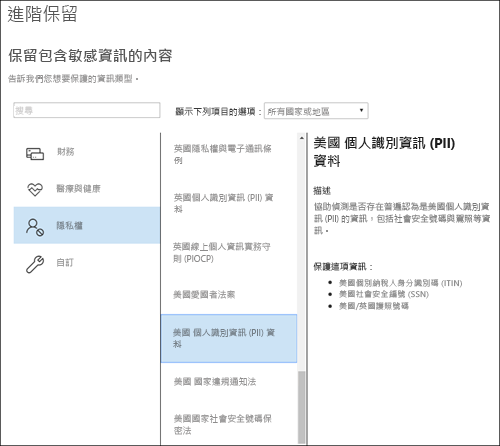

# 保留原則概觀Overview of retention policies

對大多數組織來說，其資料 (電子郵件、文件、即時訊息等) 的數量和複雜性日益增加。有效管理或控管此資訊至關重要，因為您需要：For most organizations, the volume and complexity of their data is increasing daily — email, documents, instant messages, and more. Effectively managing or governing this information is important because you need to:
  
- **主動遵守產業規範和內部原則**，因此您需要將某些內容至少保留一段時間，例如，Sarbanes-Oxley 法案可能會要求您將某些類型的內容保留七年。**Comply proactively with industry regulations and internal policies** that require you to retain content for a minimum period of time — for example, the Sarbanes-Oxley Act might require you to retain certain types of content for seven years. 
    
- **降低發生訴訟或安全性漏洞的風險**，方法為永久刪除您不再需要保留的舊內容。**Reduce your risk in the event of litigation or a security breach** by permanently deleting old content that you're no longer required to keep. 
    
- **協助貴組織有效分享知識並提高靈活度**，方法為確保使用者只使用目前和相關的內容。**Help your organization to share knowledge effectively and be more agile** by ensuring that your users work only with content that's current and relevant to them. 
    
保留原則可協助您實現所有這些目標。管理內容通常需要下列兩個動作：A retention policy can help you achieve all of these goals. Managing content commonly requires two actions:
  
- **保留**內容，以便無法在保留期間結束之前將其永久刪除。**Retaining** content so that it can't be permanently deleted before the end of the retention period. 
    
- 在保留期間結束之前，永久**刪除**內容。**Deleting** content permanently at the end of the retention period. 
    
透過保留原則，您可以：With a retention policy, you can:
  
- 主動決定是否要保留內容、刪除內容，還是兩者 (保留然後刪除內容)。Decide proactively whether to retain content, delete content, or both — retain and then delete the content.
    
- 將單一原則套用到整個組織或套用到特定位置或使用者。Apply a single policy to the entire organization or specific locations or users.
    
- 將原則套用到所有內容或套用到符合特定條件的內容，例如包含特定關鍵字或[特定類型的敏感性資訊](what-the-sensitive-information-types-look-for.md)的內容。Apply a policy to all content or content meeting certain conditions, such as content containing specific keywords or [specific types of sensitive information](what-the-sensitive-information-types-look-for.md).
    
當內容受限於保留原則時，人員可以繼續編輯及使用的內容，一樣不會變更，因為內容保留在其原始位置。但在某人編輯或刪除受限於原則的內容時，將會有複本儲存至安全位置，在原則仍然有效時會持續進行保留。When content is subject to a retention policy, people can continue to edit and work with the content as if nothing's changed because the content is retained in place, in its original location. But if someone edits or deletes content that's subject to the policy, a copy is saved to a secure location where it's retained while the policy is in effect.
  
最後，有些組織必須遵守法規，例如證券交易委員會 (SEC) 法規 17a-4，要求在保留原則開啟之後，不能關閉或執行較不嚴格的限制。若要滿足這個需求，您可以使用「保留鎖定」。原則鎖定之後，任何人 (包括系統管理員) 均無法關閉原則或降低原則的限制性。Finally, some organizations have to comply with regulations such as Securities and Exchange Commission (SEC) Rule 17a-4, which requires that after a retention policy is turned on, it cannot be turned off or made less restrictive. To meet this requirement, you can use Preservation Lock. After a policy's been locked, no one (including an administrator) can turn off the policy or make it less restrictive.
  
您可以在以下位置建立和管理保留原則：You create and manage retention policies on the:

- [Microsoft 365 合規性中心](https://compliance.microsoft.com/)的 [原則]\*\*\*\* 頁面。**Policies** page in the [Microsoft 365 compliance center](https://compliance.microsoft.com/).
- [Office 365 安全性與合規性中心](https://protection.office.com/) 的 [資訊控管]\*\*\*\* 下的 [保留]\*\*\*\* 頁面。&amp;**Retention** page under **Information governance** in the [Office 365 Security &amp; Compliance Center](https://protection.office.com/).

**如果您想要在永久刪除內容之前檢視內容**，請考慮改用[保留標籤](labels.md)，而非保留原則。**If you want the ability to review content before it's permanently deleted,** consider using [retention labels](labels.md) instead of a retention policy. 建立保留標籤時，您可以設定[處置檢閱](disposition-reviews.md)，在保留期間結束時檢閱其內容。When you create a retention label, you can set up a [disposition review](disposition-reviews.md) to review the content at the end of its retention period.

## 保留原則如何就地使用內容How a retention policy works with content in place

當您在保留原則中包括網站或信箱這類的位置時，內容仍會留在其原始位置。使用者可以繼續使用其文件或郵件，一樣不會變更。但在他們編輯或刪除原則中包含的內容時，系統會保留內容的複本，與您套用原則時存在的內容相同。When you include a location such as a site or mailbox in a retention policy, the content remains in its original location. People can continue to work with their documents or mail as if nothing's changed. But if they edit or delete content that's included in the policy, a copy of the content as it existed when you applied the policy is retained.
  
針對 SharePoint 網站集合，當使用者編輯或刪除原始內容時，原始內容的複本會保留在文件保留庫。針對電子郵件和公用資料夾，複本會保留在 [可復原的項目] 資料夾中。大部分人員看不到這些安全位置和保留內容。使用保留原則時，人員甚至不知道其內容受到原則約束。For SharePoint site collections, a copy of the original content is retained in the Preservation Hold library when users edit or delete it. For email and public folders, the copy is retained in the Recoverable Items folder. These secure locations and the retained content are not visible to most people. With a retention policy, people do not even need to know that their content is subject to the policy.
  
附註：Notes:
  
- 小組（交談）的內容會儲存在 Exchange 中，其中會根據訊息類型（電子郵件或交談）套用原則。Teams (chat) content is stored in Exchange, where the policy is applied based on message type (email or conversation).
    
- 套用到 Office 365 群組的保留原則同時包含群組信箱和網站。A retention policy applied to an Office 365 group includes both the group mailbox and site.

- 文件保留庫會佔用網站的儲存空間配額。The Preservation Hold library consumes storage quota for the site.
    
### OneDrive 帳戶和 SharePoint 網站中的內容Content in OneDrive accounts and SharePoint sites

保留原則會在網站集合層級套用。A retention policy is applied at the level of a site collection. 當您在保留原則中包含 SharePoint 網站集合或 OneDrive 帳戶時，會建立文件保留庫 (如果不存在)。When you include a SharePoint site collection or OneDrive account in a retention policy, a Preservation Hold library is created, if one doesn't exist. 您可以在網站集合的頂層網站中的 [網站內容]\*\*\*\* 頁面上檢視此文件庫。You can view this library on the **Site contents** page in the top-level site of the site collection. 文件保留庫僅供網站集合系統管理員檢視，大部分的使用者都無法檢視。Most users can't view the Preservation Hold library because it's visible only to site collection administrators.
  
如有使用者嘗試變更或刪除受限於保留原則的站台內容，保留原則會先檢查內容在套用原則後是否有所變更。If a person attempts to change or delete content in a site that's subject to a retention policy, first the policy checks whether the content's been changed since the policy was applied. 如果這是套用原則後的第一次變更，保留原則會先將內容複製到文件保留庫，然後允許使用者變更或刪除原始內容。If this is the first change since the policy was applied, the retention policy copies the content to the Preservation Hold library, and then allows the person to change or delete the original content. 網站集合中的任何內容都可複製到文件保留庫，即使內容不符合保留原則所使用的查詢篩選器亦然。Any content in the site collection can be copied to the Preservation Hold library, even if the content does not match the query used by the retention policy.
  
接著，計時器工作會清除文件保留庫。Then a timer job cleans up the Preservation Hold library. 計時器工作會定期執行，並比較文件保留庫中的所有內容與站台上之保留原則所使用的所有查詢。The timer job runs periodically and compares all content in the Preservation Hold library to all queries used by the retention policies on the site. 除非內容至少符合一項查詢，否則計時器工作將從文件保留庫中永久刪除該內容。Unless content matches at least one of the queries, the timer job permanently deletes the content from the Preservation Hold library.
  
前述機制適用於在套用保留原則時即存在的內容。除此之外，任何在網站納入保留原則後才在網站集合中建立或新增的內容，在刪除之後仍將保留。不過，新內容在第一次編輯時並不會複製到文件保留庫，而只有在刪除時才會。若要保留所有檔案版本，您必須開啟版本設定 — 請參閱以下關於版本的章節。The previous applies to content that exists when the retention policy is applied. In addition, any new content that's created or added to the site collection after it was included in the policy will be retained after deletion. However, new content isn't copied to the Preservation Hold library the first time it's edited, only when it's deleted. To retain all versions of a file, you need to turn on versioning — see the below section on versioning.
  
請注意，如果使用者嘗試刪除受保留原則保護的文件庫、清單、資料夾或網站，則會收到錯誤。Note that a user receives an error if they try to delete a library, list, folder, or site that's subject to a retention policy. 如果先移動或刪除受到原則保護之資料夾中的檔案，那麼使用者就可以刪除該資料夾。A user can delete a folder if they first move or delete any files in the folder that are subject to the policy. 此外，只有當需要將第一個項目複製到文件庫，而非在建立保留原則時，才會建立保留文件庫。Also, the Preservation Hold library is created only when the first item needs to be copied to the library and not when you create the retention policy. 因此，若要測試原則，您必須先編輯或刪除受限於原則的網站中的文件，然後瀏覽至文件保留庫以檢視保留的複本。Therefore, to test your policy, you first need to edit or delete a document in a site subject to the policy, and then browse to the Preservation Hold library to view the retained copy.
  
將保留原則指派給 OneDrive 帳戶或 SharePoint 網站之後，內容可以依循下列兩個途徑之一：After a retention policy is assigned to a OneDrive account or SharePoint site, content can follow one of two paths:

  
1. 若已在保留期間**修改或刪除內容**，即會在文件保留庫中建立指派保留原則時即存在之原始內容的複本。**If the content is modified or deleted** during the retention period, a copy of the original content as it existed when the retention policy was assigned is created in the Preservation Hold library. 計時器工作會在此處定期執行，找到保留期間已過期的項目，並將這些項目移至第二階段資源回收桶，會在 93 天結束時予以永久刪除。There, a timer job runs periodically and identifies items whose retention period has expired, and those items are moved to the second-stage Recycle Bin, where they're permanently deleted at the end of 93 days. 使用者看不到第二階段資源回收筒 (只能看到第一階段資源回收筒)，但網站集合管理員可以檢視並從該處還原內容。The second-stage Recycle Bin is not visible to end users (only the first-stage Recycle Bin is), but site collection admins can view and restore content from there.

    > [!NOTE]
    > 我們最近已變更從保留文件庫中刪除內容的方式。We've recently changed how content is deleted from the Preservation Hold library. 為了防止意外的資料遺失，我們不再永久刪除保留文件庫中的內容。To help prevent inadvertent data loss, we no longer permanently delete content from the Preservation Hold library. 相反地，我們只會從資源回收筒中永久刪除內容。因此，來自保留文件庫的所有內容，現在將會移至第二階段資源回收筒。Instead, we permanently delete content only from the Recycle Bin, so all content from the Preservation Hold library now goes through the second-stage Recycle Bin.
    
2. 若內容在保留期間**未修改或刪除**，在保留期間結束時會將內容移至第一階段資源回收筒。**If the content is not modified or deleted** during the retention period, it's moved to the first-stage Recycle Bin at the end of the retention period. 如果使用者從此處刪除內容，或清空此資源回收筒 (也就是清除)，則會將文件移至第二階段資源回收筒。If a user deletes the content from there or empties this Recycle Bin (also known as purging), the document is moved to the second-stage Recycle Bin. 93 天保留期間涵蓋了第一和第二階段資源回收筒。93 天結束時，則會從文件所在的任何位置永久刪除文件 (無論是第一或第二階段資源回收筒)。A 93-day retention period spans both the first- and second-stage recycle bins. At the end of 93 days, the document is permanently deleted from wherever it resides, in either the first- or second-stage Recycle Bin. 資源回收筒未使用，因此搜尋在此處找不到內容。The Recycle Bin is not used and therefore searches do not find content there. 也就是說，電子文件探索保留在資源回收筒中找不到可保留的任何內容。This means that an eDiscovery hold can't locate any content in the Recycle Bin to hold it. 
    
### 信箱與公用資料夾中的內容Content in mailboxes and public folders

對於使用者的信箱、行事曆和其他項目，保留原則會在信箱層級套用。對於公用資料夾，保留原則會套用在資料夾層級套用，而不是信箱層級。信箱和公用資料夾都是使用 [可復原的項目] 資料夾來保留項目。已指派 eDiscovery 權限的人員可以檢視其他使用者的 [可復原的項目] 資料夾中的項目。 For a user's mail, calendar, and other items, a retention policy is applied at the level of a mailbox. For a public folder, a retention policy is applied at the folder level, not the mailbox level. Both a mailbox and a public folder use the Recoverable Items folder to retain items. Only people whom have been assigned eDiscovery permissions can view items in another user's Recoverable Items folder.
  
根據預設，當使用者刪除 [刪除的郵件] 資料夾以外的資料夾中的郵件時，該郵件會移至 [刪除的郵件] 資料夾。當使用者刪除 [刪除的郵件] 資料夾中的項目時，郵件會移至 [可復原的項目] 資料夾。此外，使用者可以將任何資料夾中的項目虛刪除 (SHIFT+DELETE)，這會略過 [刪除的郵件] 資料夾，並將項目直接移至 [可復原的項目] 資料夾。By default, when a person deletes a message in a folder other than the Deleted Items folder, the message is moved to the Deleted Items folder. When a person deletes an item in the Deleted Items folder, the message is moved to the Recoverable Items folder. In addition, a person can soft delete an item (SHIFT+DELETE) in any folder, which bypasses the Deleted Items folder and moves the item directly to the Recoverable Items folder.
  
程序會定期評估 [可復原的項目] 資料夾中的項目。如果項目不符合至少一個保留原則的規則，則系統會從 [可復原的項目] 資料夾中永久刪除項目 (也稱為硬刪除)。A process periodically evaluates items in the Recoverable Items folder. If an item doesn't match the rules of at least one retention policy, the item is permanently deleted (also called hard deleted) from the Recoverable Items folder.
  
當有人嘗試變更信箱項目的特定內容時 (例如主旨、內文、附件、寄件者和收件者，或是傳送或接收郵件的日期)，在認可變更之前，會先將原始項目的複本儲存至 [可復原的項目] 資料夾。When a person attempts to change certain properties of a mailbox item — such as the subject, body, attachments, senders and recipients, or date sent or received for a message — a copy of the original item is saved to the Recoverable Items folder before the change is committed. 後續每次變更都會執行此動作。This action happens for each subsequent change. 在保留期間結束時，系統會永久刪除 [可復原的項目] 資料夾中的複本。At the end of the retention period, copies in the Recoverable Items folder are permanently deleted.
  
將保留原則指派給信箱或公用資料夾之後，內容可以依循下列兩個途徑之一：After a retention policy is assigned to a mailbox or public folder, content can follow one of two paths:

1. 在保留期間，**如果使用者已永久修改或刪除項目** (按 SHIFT+DELETE 或從 [刪除的郵件] 中刪除)，則項目會移至 (或在編輯的情況下複製到) [可復原的項目] 資料夾。在那裡，此程序會定期執行，並識別其保留期間已過期的項目，而且會在保留期間結束後的 14 天內永久刪除這些項目。請注意，14 天是預設設定，但它最多可設為 30 天。**If the item is modified or permanently deleted** by the user (either SHIFT+DELETE or deleted from Deleted Items) during the retention period, the item is moved (or copied, in the case of edit) to the Recoverable Items folder. There, a process runs periodically and identifies items whose retention period has expired, and these items are permanently deleted within 14 days of the end of the retention period. Note that 14 days is the default setting, but it can be configured up to 30 days.
    
2. 若未在保留期間**修改或刪除項目**，即會在信箱中的所有資料夾上定期執行相同程序，找到保留期間已過期的項目，並在保留期間結束的 14 天內永久刪除這些項目。**If the item is not modified or deleted** during the retention period, the same process runs periodically on all folders in the mailbox and identifies items whose retention period has expired, and these items are permanently deleted within 14 days of the end of the retention period. 請注意，14 天是預設的設定，最多可設定為 30 天。Note that 14 days is the default setting, but it can be configured up to 30 days. 

### 當使用者離開組織時When a user leaves the organization

**Exchange****Exchange** 

如果組織中的使用者離職，且保留原則中包含使用者的信箱，在刪除使用者的 Office 365 帳戶後，信箱會變成非作用中的信箱。If a user leaves your organization and the user's mailbox is included in a retention policy, the mailbox becomes an inactive mailbox when the user's Office 365 account is deleted. 在變成非作用的狀態之前，非作用中信箱的內容仍受限於信箱上所設之任何保留原則，且內容可供 eDiscovery 搜尋。The contents of an inactive mailbox are still subject to any retention policy that was placed on the mailbox before it was made inactive, and the contents are available to an eDiscovery search. 如需詳細資訊，請參閱 [Exchange Online 中的非作用中信箱](inactive-mailboxes-in-office-365.md)。For more information, see [Inactive mailboxes in Exchange Online](inactive-mailboxes-in-office-365.md).

**OneDrive****OneDrive**

如果組織中的使用者離職，任何受保留原則管制或含有保留標籤的檔案，在原則或標籤的保留期間內都會予以保留。If a user leaves your organization, any files subject to a retention policy or containing retention labels will remain for the duration of the policy or label. 在此期間，所有的共用存取權都持續有效。During that time period, all sharing access continues to work. 當保留期間到期時，內容會移至 [網站集合資源回收筒] 中，且除了系統管理員以外的任何人都無法存取。如果保留原則將文件將標記為記錄，在保留期間結束前，不會刪除文件，保留期間結束後則會永久刪除。When the retention period expires, content moves into the Site Collection Recycle Bin and is not accessible to anyone except the admin. If a document is marked by a retention policy as a record, it will not be deleted until the retention period is over, after which time the content is permanently deleted.

**SharePoint****SharePoint**

如果組織中的使用者離職，該使用者建立的任何內容將不受到影響，因為 SharePoint 被視為共同作業環境，與使用者的信箱或 OneDrive 帳戶不同。When a user leaves your organization, any content created by that user is not affected because SharePoint is considered a collaborative environment, unlike a user's mailbox or OneDrive account.

## 保留原則如何使用網站集合中的文件版本How a retention policy works with document versions in a site collection

版本設定是 SharePoint Online 和商務用 OneDrive 中所有文件庫的功能。Versioning is a feature of all document libraries in SharePoint Online and OneDrive for Business. 根據預設，版本設定會最少保留 500 個主要版本，不過您可以增加此限制。By default, versioning retains a minimum of 500 major versions, though you can increase this limit. 如需詳細資訊，請參閱[啟用和設定清單或文件庫的版本設定](https://support.office.com/article/1555d642-23ee-446a-990a-bcab618c7a37)。For more information, see [Enable and configure versioning for a list or library](https://support.office.com/article/1555d642-23ee-446a-990a-bcab618c7a37).
  
保留原則 (會保留內容而非僅刪除的保留原則) 會保留 SharePoint 網站集合或 OneDrive 帳戶中文件的所有版本。A retain policy (retention policy that retains content instead of delete-only) retains all versions of a document in a SharePoint site collection or OneDrive account. 受限於保留或保留原則的文件首次遭到編輯時，就會將原始文件版本複製到保留文件庫。When a document subject to a hold or retain policy is edited for the first time, a version of the original document is copied to the Preservation Hold library. 如果已啟用版本設定，受限於保留或保留原則的文件遭到刪除時，就會將所有版本複製到保留文件庫。When a document subject to a hold or retain policy is deleted, all versions are copied to the Preservation Hold library if versioning is enabled. 文件保留庫中的每個文件版本都會存在為個別的項目，並有其自己的保留期間：Each version of a document in the Preservation Hold library exists as a separate item with its own retention period:
  
- 如果保留原則是以建立內容的時間為基礎，則每個版本都有與原始文件相同的到期日。原始文件及其版本都在相同時間到期。If the retention policy is based on when the content was created, each version has the same expiration date as the original document. The original document and its versions all expire at the same time.
    
- 如果保留原則根據內容的前次修改時間，則每個版本都有自己的到期日，而此到期日根據為了建立該版本而修改原始文件的時間。原始文件及其版本彼此單獨到期。If the retention policy is based on when the content was last modified, each version has its own expiration date based on when the original document was modified to create that version. The original documents and its versions expire independently of each other.

> [!NOTE]
> 電子文件探索工具無法搜尋保留版本的 SharePoint 和 OneDrive 文件。The preserved versions of SharePoint and OneDrive documents are not searchable by eDiscovery tools.

## 將內容保留特定的一段時間Retaining content for a specific period of time

透過保留原則，您可以無限期保留內容，或將內容保留特定數天、數月或數年。With a retention policy, you can retain content indefinitely or for a specific number of days, months, or years. 保留內容的持續時間是從內容的存留期起算，而不是從套用保留原則的時間起算。The duration for how long content is retained is calculated from the age of the content, not from when the retention policy is applied. 您可以選擇存留期是否要根據內容建立的時間，或前次修改的時間 (針對 OneDrive 和 SharePoint)。You can choose whether the age is based on when the content was created or (for OneDrive and SharePoint) when it was last modified.
  
例如，如果您想要將網站集合中的內容自從前次前次修改後保留七年，而且該網站集合中的某文件已有六年未曾修改，則若該文件後續仍未修改，則只會再保留一年。如果該文件重新編輯，則其存留期將會從新的前次修改日期算起，因而會再保留七年。For example, if you want to retain content in a site collection for seven years since it was last modified, and a document in that site collection hasn't been modified in six years, the document will be retained for only another year if it's not modified. If the document is edited again, the age of the document is calculated from the new last modified date, and it will be retained for another seven years.
  
同樣地，如果您想要將信箱中的內容保留七年，而且六年前已傳送某訊息，則該訊息只會保留一年。對於 Exchange 內容，時間一律根據接收或傳送的日期 (它們是相同的)。根據前次修改時間保留內容僅適用於 OneDrive 和 SharePoint 中的網站內容。Similarly, if you want to retain content in a mailbox for seven years, and a message was sent six years ago, the message will be retained for only one year. For Exchange content, the age is always based on the date received or sent (they are the same). Retaining content based on when it was last modified applies only to site content in OneDrive and SharePoint.
  
您可以選擇是否要在保留期間結束時永久刪除內容。You can choose whether you want the content to be permanently deleted at the end of the retention period. 保留原則也可以刪除舊內容而不予以保留。A retention policy can also delete old content without retaining it. 請參閱下一節。See the next section.
  

  
## 刪除早於特定存留期的內容Deleting content that's older than a specific age

保留原則可以保留然後刪除內容，或刪除舊內容而不保留它。A retention policy can both retain and then delete content, or delete old content without retaining it.
  
如果您的保留原則刪 內容，請務必了解，文件刪除原則所指定的期限並不是從指派原則的時間算起，而是從建立或修改內容的時間算起。If your retention policy deletes content, it's important to understand that the time period specified for a retention policy is calculated from the time when the content was created or modified, not the time since the policy was assigned.
  

  
例如，假設您建立三年後刪除內容的保留原則，然後將該原則指派給所有 OneDrive 帳戶，其中包含許多四或五年前建立的內容。在此情況下，第一次指派保留原則後，很快就會刪除大量的內容。基於這個原因，**刪除內容的保留原則可以對您的內容產生相當大的影響**。For example, suppose that you create a retention policy that deletes content after three years, and then assign that policy to all OneDrive accounts, which contain a lot of content that was created four or five years ago. In this case, a lot of content will be deleted soon after assigning the retention policy for the first time. For this reason, **a retention policy that deletes content can have a considerable impact on your content**. 
  
因此，在第一次將保留原則指派給網站集合之前，您應先考量現有內容的存留期，以及原則對該內容可能造成的影響。您也可以在指派新原則之前先與使用者溝通，讓他們有時間評估可能的影響。請注意，只在您建立保留原則之前，檢閱其設定時才會出現此警告。Therefore, before you assign a retention policy to a site collection for the first time, you should first consider the age of the existing content and how the policy may impact that content. You may also want to communicate the new policy to your users before assigning it, to give them time to assess the possible impact. Note this warning that appears when you review the settings for your retention policy just before creating it.
  

  
## 只將原則套用到符合特定條件之內容的進階設定Advanced settings that apply a policy only to content that meets certain conditions

保留原則可以套用至其包含之位置中的所有內容，或您可以選擇只將保留原則套用到包含特定關鍵字或[特定類型的敏感資訊](what-the-sensitive-information-types-look-for.md)的內容。A retention policy can apply to all content in the locations that it includes, or you can choose to apply a retention policy only to content that contains specific keywords or [specific types of sensitive information](what-the-sensitive-information-types-look-for.md).
  

  
### 保留包含特定關鍵字的內容Retain content that contains specific keywords

您可以只將保留原則套用至符合特定條件的內容，然後只對該內容採取保留動作。可使用的條件現在支援將保留原則套用至包含特定字詞或片語的內容。您可以使用 AND、OR、NOT 等搜尋運算子來精簡查詢。如需這些運算子的詳細資訊，請參閱[內容搜尋的關鍵字查詢和搜尋條件](keyword-queries-and-search-conditions.md)。You can apply a retention policy only to content that satisfies certain conditions, and then take retention actions on just that content. The conditions available now support applying a retention policy to content that contains specific words or phrases. You can refine your query by using search operators like AND, OR, and NOT. For more information on these operators, see [Keyword queries and search conditions for Content Search](keyword-queries-and-search-conditions.md).
  
即將推出對新增可搜尋屬性 (例如 **subject:**) 的支援。Support for adding searchable properties (for example, **subject:**) is coming soon.
  
查詢型保留會使用搜尋索引來識別內容。Query-based retention uses the search index to identify content.
  

  
### 保留包含敏感資訊的內容Retain content that contains sensitive information

您也可以只將保留原則套用至包含[特定類型的敏感資訊](what-the-sensitive-information-types-look-for.md)的內容。例如，您可以選擇只將唯一的保留需求套用至包含個人識別資訊 (PII) 的內容，例如納稅人身分識別碼、社會安全編號或護照號碼。You can also apply a retention policy only to content that contains [specific types of sensitive information](what-the-sensitive-information-types-look-for.md). For example, you can choose to apply unique retention requirements only to content that contains personally identifiable information (PII) such as taxpayer identification numbers, social security numbers, or passport numbers.
  

  
附註：Notes:
  
- 敏感資訊的進階保留不適用於 Exchange 公用資料夾或商務用 Skype，因為這些位置不支援敏感資訊類型。Advanced retention for sensitive information doesn't apply to Exchange public folders or Skype for Business because those locations don't support sensitive information types.
    
- 您應該了解 Exchange Online 會使用郵件流程規則 (也稱為傳輸規則) 來識別敏感資訊，因此這僅適用於傳輸中的郵件，不適用於已儲存在信箱中的所有項目。對於 Exchange Online，這表示保留原則可以識別敏感資訊，並只對在原則套用至信箱**之後**收到的訊息採取保留動作。(請注意，上一節所述的查詢型保留並沒有這項限制，因為它會使用搜尋索引來識別內容)。You should understand that Exchange Online uses mail flow rules (also known as transport rules) to identify sensitive information, so this works only on messages in transit — not on all items already stored in a mailbox. For Exchange Online, this means that a retention policy can identify sensitive information and take retention actions only on messages that are received **after** the policy is applied to the mailbox. (Note that query-based retention described in the previous section doesn't have this limitation because it uses the search index to identify content.) 
    
## 將保留原則套用到整個組織或特定位置Applying a retention policy to an entire organization or specific locations

您可以輕鬆地將保留原則套用到整個組織、整個位置，或只套用到特定位置或使用者。You can easily apply a retention policy to an entire organization, entire locations, or only to specific locations or users.
  
### 全組織原則Org-wide policy

保留原則最強大的功能之一，就是它可套用至 Office 365 中的各個位置，包括：One of the most powerful features of a retention policy is that it can apply to locations across Office 365, including:
  
- Exchange 電子郵件Exchange email
    
- SharePoint 網站集合SharePoint site collections
    
- OneDrive 帳戶OneDrive accounts
    
- Office 365 群組 (適用群組信箱和相關聯的 SharePoint 網站中的內容)。Office 365 groups (applies to content in the group's mailbox and associated SharePoint site.)
    
- Exchange 公用資料夾Exchange public folders
    

全組織保留原則的其他重要功能包含：Other important features of an org-wide retention policy include:
  
- 原則可以包含的信箱或網站數目沒有任何限制。There is no limit to the number of mailboxes or sites the policy can include.
    
- 對於 Exchange，在套用原則後建立的任何新信箱都會自動繼承此原則。For Exchange, any new mailbox created after the policy is applied will automatically inherit the policy.
  
### 套用到整個組織的原則A policy that applies to entire locations

當您選擇位置時，您可以輕鬆地包含或排除整個位置，例如 Exchange 電子郵件或 OneDrive 帳戶。When you choose locations, you can easily include or exclude an entire location, such as Exchange email or OneDrive accounts. 若要這麼做，請將該位置的 [狀態]\*\*\*\* 切換到開啟或關閉。To do so, toggle the **Status** of that location on or off. 
  
如同全組織原則一般，若原則套用到整個位置的任何組合，則原則可以包含的信箱或網站數目沒有限制。例如，如果原則包含所有 Exchange 電子郵件和所有 SharePoint 網站，則所有網站和信箱都會包含在內，無論有多少。對於 Exchange，套用原則後建立的任何新信箱都會自動繼承此原則。Like an org-wide policy, if a policy applies to any combination of entire locations, there is no limit to the number of mailboxes or sites the policy can include. For example, if a policy includes all Exchange email and all SharePoint sites, all sites and mailboxes will be included, no matter how many. And for Exchange, any new mailbox created after the policy is applied will automatically inherit the policy.

### 具有特定包含或排除的原則A policy with specific inclusions or exclusions

您也可以將保留原則套用至特定使用者、Office 365 群組或網站。若要這麼做，請將該位置的 [狀態]\*\*\*\* 切換為開啟，然後使用連結來包含或排除特定使用者、Office 365 群組或網站。You can also apply a retention policy to specific users, Office 365 groups, or sites. To do so, toggle the **Status** of that location on, and then use the links to include or exclude specific users, Office 365 groups, or sites. 
  
不過請注意，包含或排除超過 1,000 個特定位置的保留原則有下列限制：However, note that the following limits exist for a retention policy that includes or excludes over 1,000 specific locations:
  
- 這類保留原則最多可包含 1,000 個信箱和 100 個網站集合。Such a retention policy can contain no more than 1,000 mailboxes and 100 site collections.
    
- 一個租用戶最多可包含 10,000 個保留原則。A tenant can contain no more than 10,000 retention policies.
    
雖然有這些限制，但請了解您可以套用全組織原則或套用到整個位置的原則來超過這些限制。Although these limits exist, understand that you can get over these limits by applying either an org-wide policy or a policy that applies to entire locations.
  
### Skype 位置Skype locations

不同於 Exchange 電子郵件，您無法將 Skype 位置的狀態切換為開啟以包含所有使用者，但當您開啟該位置時，可以手動選擇您想要保留其交談的使用者：Unlike Exchange email, you can't toggle the status of the Skype location on to include all users, but when you turn on that location, you then manually choose the users whose conversations you want to retain:

  
當您選取 [選擇使用者]\*\*\*\* 時，您可以選取欄標題中的 [名稱]\*\*\*\* 方塊，快速包含所有使用者。When you select **Choose users**, you can quickly include all users by selecting the **Name** box in the column header. 不過，請務必了解，會將每個使用者算成原則中的一個特定包含。However, it's important to understand that each user counts as a specific inclusion in the policy. 因此，如果您包含超過 1,000 個使用者，則會套用上一節提及的限制。Therefore, if you include over 1,000 users, the limits noted in the previous section apply. 在這裡選取所有 Skype 使用者，和整個組織的原則能夠根據預設包含所有 Skype 使用者並不一樣。Selecting all Skype users here is not the same as if an org-wide policy were able to include all Skype users by default. 
  

  
請注意，**交談歷程記錄** (Outlook 中的資料夾) 是與 Skype 封存無關的功能。使用者可以關閉**交談歷程記錄**，但會執行 Skype 的封存，方法為將 Skype 交談的複本儲存在使用者無法存取但 eDiscovery 可以使用的隱藏資料夾中。Note that **Conversation History**, a folder in Outlook, is a feature that has nothing to do with Skype archiving. **Conversation History** can be turned off by the end user, but archiving for Skype is done by storing a copy of Skype conversations in a hidden folder that is inaccessible to the user but available to eDiscovery.

### SharePoint 位置SharePoint locations

您的保留原則可以保留 SharePoint 通訊網站中的內容、未透過 Office 365 群組所連線的小組網站以及傳統網站。Your retention policy can retain content in SharePoint communication sites, team sites that aren't connected by Office 365 groups, and classic sites. 此選項不支援由 Office 365 群組所連線的小組網站，而是改用 **Office 365 群組**位置。Team sites connected by Office 365 groups aren't supported with this option and instead, use the **Office 365 groups** locations.

如果您指定不受支援的網站，保留原則會忽略這些網站。If you specify sites that aren't supported, these are ignored by the retention policy.

當您為 SharePoint 網站指定位置時，您不需要存取網站的權限，而在 [編輯位置]\*\*\*\* 頁面上指定 URL 時也不會進行驗證。When you specify your locations for SharePoint sites, you don't need permissions to access the site and no validation is done at the time you specify the URL on the **Edit locations** page. 不過，網站必須編制索引，而在精靈結尾將會檢查您指定的網站是否存在。However, the sites must be indexed and the sites you specify are checked that they exist at the end of the wizard.

如果此檢查失敗，您會看到一則訊息，指出您輸入的 URL 驗證失敗，且精靈不會建立保留原則，直到驗證檢查通過為止。If this check fails, you see a message that validation failed for the URL you entered, and the wizard won't create the retention policy until the validation check passes. 如果您看到這則訊息，請返回精靈變更 URL 或移除網站。If you see this message, go back in the wizard to change the URL or remove the site.

### Teams 位置Teams locations

您可以使用保留原則來保留 Teams 中的聊天和通道訊息。Teams 聊天儲存在涉及聊天的每個使用者之信箱的隱藏資料夾中，而 Teams 通道訊息則儲存在團隊的群組信箱中類似的隱藏資料夾中。不過，請務必了解 Teams 會使用 Azure 提供的聊天服務，其中也會儲存此資料，而且根據預設這項服務會永遠儲存該資料。基於這個原因，我們強烈建議您使用 Teams 位置來保留和刪除 Teams 資料。使用 Teams 位置會同時從 Exchange 信箱和基礎 Azure 提供的聊天服務中永久刪除資料。如需詳細資訊，請參閱 [Microsoft Teams 中的安全性及合規性概觀](https://go.microsoft.com/fwlink/?linkid=871258)。You can use a retention policy to retain chats and channel messages in Teams. Teams chats are stored in a hidden folder in the mailbox of each user included in the chat, and Teams channel messages are stored in a similar hidden folder in the group mailbox for the team. However, it's important to understand that Teams uses an Azure-powered chat service that also stores this data, and by default this service stores the data forever. For this reason, we strongly recommend that you use the Teams location to retain and delete Teams data. Using the Teams location will permanently delete data from both the Exchange mailboxes and the underlying Azure-powered chat service. For more information, see [Overview of security and compliance in Microsoft Teams](https://go.microsoft.com/fwlink/?linkid=871258).
  
套用至 Exchange 或 Office 365 群組位置內使用者或群組信箱的保留原則不會影響 Teams 聊天與頻道訊息。Teams chats and channel messages are not affected by retention policies applied to user or group mailboxes in the Exchange or Office 365 groups locations. 即使 Teams 聊天與頻道訊息會儲存在 Exchange 中，也只會受到套用至 Teams 位置的保留原則影響。Even though Teams chats and channel messages are stored in Exchange, they're affected only by a retention policy that's applied to the Teams location.

> [!NOTE]
> 如果使用者包含在保留 Teams 資料之使用中的保留原則，則不允許刪除這類使用者的信箱，因為資料的儲存必須保留。If a user is included in an active retention policy that retains Teams data, then deleting a mailbox of such a user is not allowed since the storage of the data needs to be retained. 若要刪除這類使用者的信箱，系統管理員必須先從保留原則中將該使用者排除。To delete a mailbox of such a user, the admin needs to exclude the user from the retention policy first.
  
將保留原則指派給團隊之後，交談和頻道訊息可以依循下列兩個途徑之一：After a retention policy is assigned to a team, chat and channel messages can follow one of two paths:

1. 如果使用者在保留期間**修改或刪除聊天或頻道訊息**，則會將該訊息移動 (或如果是編輯的情況下，則為複製) 至 SubstrateHolds 資料夾 (這是每個使用者或群組信箱中的隱藏資料夾)，並儲存在此資料夾中，直到保留期間到期為止。**If a chat or channel message is modified or deleted** by the user during the retention period, the message is moved (or copied, in the case of edit) to the SubstrateHolds folder (which is a hidden folder in every user or group mailbox) and is stored in this folder until the retention period expires. 訊息會在保留期間到期當日永久刪除。Messages are permanently deleted on the day the retention period expires.

2. 如果在保留期間**未刪除某個聊天或頻道訊息**，則該訊息會在保留期間到期後的一天內 (可能需要 0 到 24 小時的時間) 移至 SubstrateHolds 資料夾。**If a chat or channel message isn't deleted** during the retention period, the message is moved to the SubstrateHolds folder within one day after the retention period expires (it takes from 0 to 24 hours). 訊息會在移至 SubstrateHolds 資料夾的一天後永久刪除。The message is permanently deleted one day after it is moved to the SubstrateHolds folder. 

> [!NOTE]
> SubstrateHolds 資料夾中的訊息可供電子文件探索工具搜尋。Messages in the SubstrateHolds folder are searchable by eDiscovery tools. 永久刪除某個訊息後，電子文件探索搜尋中就不會傳回該訊息。After a message is permanently deleted, it won't be returned in an eDiscovery search.

我們正持續努力將 Teams 中的保留功能最佳化，計劃在未來幾個月推出新功能。We're continuously working on optimizing retention functionality in Teams, and we plan to release new features in the coming months. 在此同時，請留意以下所述的一些限制：In the meantime, here are a few limitations to be aware of:
  
- **Teams 需要個別的保留原則**。**Teams require a separate retention policy**. 當您建立保留原則並將 Teams 位置切換為開啟時，其他所有位置都會切換為關閉。When you create a retention policy and toggle on the Teams location, all other locations toggle off. 包含 Teams 的保留原則只能包含 Teams 位置，不可包含其他位置。A retention policy that includes Teams can include only Teams and no other locations. 
    
- **Teams 不包含在全組織原則中**。**Teams aren't included in an org-wide policy**. 如果建立全組織原則，則不會包含 Teams，因為它們需要個別的保留原則。If you create an org-wide policy, Teams are not included because they require a separate retention policy. 
    
- **Teams 不支援進階保留**。**Teams doesn't support advanced retention**. 建立保留原則時，如果您選擇 [只將原則套用到符合特定條件之內容的進階設定]，則 Teams 位置無法使用。When you create a retention policy, if you choose the [Advanced settings that apply a policy only to content that meets certain conditions](#advanced-settings-that-apply-a-policy-only-to-content-that-meets-certain-conditions), the Teams location is not available. 目前，Teams 中的保留會套用至所有聊天及頻道訊息內容。At this time, retention in Teams applies to all of the chat and channel message content. 

- **不支援私人頻道中的 Teams 內容**。**Teams content in private channels isn't supported**. 目前，為 Teams 建立的保留原則不適用私人頻道訊息。At this time, retention policies created for Teams don't apply to private channel messages. 只有標準通道中的訊息會受限於為 Teams 建立的保留原則。Only messages in standard channels are subject to a retention policy created for Teams. 私人頻道推出保留原則的支援近期會推出。Support for retention policies for private channels is coming soon. 
    
- **Teams 最多可能需要三天的時間來清理到期的訊息**。**Teams may take up to three days to clean up expired messages**. 保留期間到期時，套用至 Teams 的保留原則將會刪除聊天和頻道訊息。A retention policy applied to Teams will delete chat and channel messages when the retention period expires. 不過，要清理並永久刪除這些訊息最多可能需要三天的時間。However, it may take up to three days to clean up these messages and permanently delete them. 同時，聊天和頻道訊息在保留期間到期後以及當訊息永久刪除時，仍可透過電子文件探索工具進行搜尋。Also, chat and channel messages will be searchable with eDiscovery tools during the time after the retention period expires and when messages are permanently deleted.

   > [!NOTE]
   > 過去，保留原則無法刪除少於 30 天的 Teams 內容，我們已移除此限制。It used to be true that a retention policy couldn't delete Teams content that's less than 30 days old, but we've removed this limitation. 現在 Teams 內容的保留期間，可以是您選擇的任何天數，也可以是一天這麼短的時間。Now the retention period for Teams content can be any number of days you choose and as short as one day. 如果您確實有一天的保留期間，在保留期間到期後，於永久刪除訊息之前，可能需要最長 3 天的時間。If you do have a retention period of one day, it will take up to three days after the retention period expires before messages are permanently deleted.
    
在 Teams 聊天中共用的檔案會儲存在共用檔案之使用者的 OneDrive 帳戶中。In Teams, files that are shared in chat are stored in the OneDrive account of the user who shared the file. 上傳至頻道的檔案則會儲存在團隊的 SharePoint 網站中。Files that are uploaded into channels are stored in the SharePoint site for the team. 因此，若要保留或刪除 Teams 中的檔案，您需要建立一個套用至 OneDrive 和 Office 365 群組位置的保留原則。Therefore, to retain or delete files in Teams, you need to create a retention policy that applies to OneDrive and Office 365 Group locations. 如果您想要將原則套用到特定使用者或團隊在 Teams 中共用的檔案，您可以選擇 OneDrive 或 Office 365 群組位置，並包含特定的使用者或團隊。If you want to apply a policy to the files shared in Teams of just a specific user or team, you can choose the OneDrive or Office 365 Group locations and include the specific user or team.
  
套用到 Teams 的保留原則可以使用[保留鎖定](#locking-a-retention-policy)。A retention policy that applies to Teams can use [Preservation Lock](#locking-a-retention-policy).
  

  
> [!NOTE]
> 如果您在組織中建立 Skype 或 Teams 位置的保留原則，當使用者在 Outlook 電腦版用戶端中檢視信箱資料夾的內容時，其中一個原則會顯示為預設資料夾原則。If you create retention policies for Skype or Teams locations in your organization, one of those policies is shown as the default folder policy when a user views the properties of a mailbox folder in the Outlook desktop client. 這是 Outlook 中顯示不正確的問題，並且是[已知問題](https://support.microsoft.com/help/4491013/outlook-client-displays-teams-or-skype-for-business-retention-policies)。This is an incorrect display issue in Outlook and [a known issue](https://support.microsoft.com/help/4491013/outlook-client-displays-teams-or-skype-for-business-retention-policies). 應顯示為預設資料夾原則的是套用至資料夾的信箱保留原則。What should be displayed as the default folder policy is the mailbox retention policy that's applied to the folder. Skype 或 Teams 保留原則不會套用至使用者的信箱。The Skype or Teams retention policy is not applied to the user's mailbox.  

### Office 365 群組的位置Office 365 groups locations

若要保留 Office 365 群組的內容，您需要使用 Office 365 群組位置。To retain content for an Office 365 group, you need to use the Office 365 groups location. 即使 Office 365 群組有 Exchange 信箱，包含整個 Exchange 位置的保留原則並不會包含 Office 365 群組信箱中的內容。Even though an Office 365 group has an Exchange mailbox, a retention policy that includes the entire Exchange location won't include content in Office 365 group mailboxes. 套用到 Office 365 群組的保留原則同時包含群組信箱和網站。A retention policy applied to an Office 365 group includes both the group mailbox and site. 套用至 Office 365 群組的保留原則可保護由 Office 365 群組所建立的資源，其中包括 Microsoft Teams。A retention policy applied to an Office 365 group protects the resources created by an Office 365 group, which would include Microsoft Teams.

此外，無法使用 Exchange 位置來包含或排除特定群組信箱。In addition, it's not possible to use the Exchange location to include or exclude a specific group mailbox. 雖然 Exchange 位置最初允許選取群組信箱，但是當您嘗試儲存保留原則時，您會收到 "RemoteGroupMailbox" 不是Exchange 位置的有效選項錯誤訊息。Although the Exchange location initially allows a group mailbox to be selected, when you try to save the retention policy, you receive an error that "RemoteGroupMailbox" is not a valid selection for the Exchange location. 

## 從保留原則中排除特定類型的 Exchange 項目Excluding specific types of Exchange items from a retention policy
您可以使用 PowerShell，從保留原則中排除特定類型的 Exchange 項目。例如，您可以排除語音信箱訊息、 IM 交談，以及信箱中的其他 商務用 Skype Online 內容。您也可以排除行事曆、附註和工作項目。僅使用 PowerShell 才能提供此功能；建立保留原則時，無法在 UI 中提供它。By using PowerShell, you can exclude specific types of Exchange items from a retention policy. For example, you can exclude voicemail messages, IM conversations, and other Skype for Business Online content in mailboxes. You can also exclude calendar, note, and task items. This capability is available only by using PowerShell; it's not available in the UI when you create a retention policy.
  
若要使用此功能，請使用 `New-RetentionComplianceRule` 和 `Set-RetentionComplianceRule` Cmdlet 的 `ExcludedItemClasses` 參數。To do this, use the  `ExcludedItemClasses` parameter of the  `New-RetentionComplianceRule` and  `Set-RetentionComplianceRule` cmdlets.

## 鎖定保留原則Locking a retention policy
有些組織可能需要遵守由監管機構定義的法規，例如證券交易委員會 (SEC) 法規 17a-4，要求在保留原則開啟之後，不能關閉或執行較不嚴格的限制。使用「保留鎖定」，您可以鎖定原則，讓任何人 (包括系統管理員) 均無法關閉原則或執行較不嚴格的限制。Some organizations may need to comply with rules defined by regulatory bodies such as the Securities and Exchange Commission (SEC) Rule 17a-4, which requires that after a retention policy is turned on, it cannot be turned off or made less restrictive. With Preservation Lock, you can lock the policy so that no one — including the administrator — can turn off the policy or make it less restrictive.
  
鎖定原則之後，任何人均無法關閉它，或從原則中移除位置。也不能修改或刪除在保留期間受限於原則的內容。鎖定原則之後，修改保留原則的唯一方式是藉由在其中新增位置，或延長其持續時間。鎖定的原則可以增加或擴充，但是無法減少或關閉。After a policy's been locked, no one can turn it off or remove locations from the policy. And it's not possible to modify or delete content that's subject to the policy during the retention period. After the policy's been locked, the only ways you can modify the retention policy are by adding locations to it or extending its duration. A locked policy can be increased or extended, but it can't be reduced or turned off.
  
因此，在您鎖定保留原則之前，**務必**了解您組織的合規性需求，並且**不要鎖定原則**，除非您確定它是您需要的原則。Therefore, before you lock a retention policy, it's **critical** that you understand your organization's compliance requirements, and that **you do not lock a policy** until you're certain that's what you need.

### 使用 PowerShell 鎖定保留原則Lock a retention policy by using PowerShell
  
您僅可以使用 PowerShell 鎖定保留原則。You can lock a retention policy only by using PowerShell.

第一，[連接到 Office 365 安全性與合規性中心 PowerShell](https://docs.microsoft.com/powershell/exchange/office-365-scc/connect-to-scc-powershell/connect-to-scc-powershell?view=exchange-ps)。First, [connect to Office 365 Security & Compliance Center PowerShell](https://docs.microsoft.com/powershell/exchange/office-365-scc/connect-to-scc-powershell/connect-to-scc-powershell?view=exchange-ps).

第二，若要檢視您的保留原則清單，並尋找您想要鎖定的原則名稱，請執行 `Get-RetentionCompliancePolicy`。Second, to view a list of your retention policies and find the name of the policy that you want to lock, run `Get-RetentionCompliancePolicy`.

第三，若要在保留原則上放置保留鎖定，請執行 `Set-RetentionCompliancePolicy` 時將 `RestrictiveRetention` 參數設為 True。Third, to place a Preservation Lock on the retention policy, run `Set-RetentionCompliancePolicy` with the `RestrictiveRetention` parameter set to true. 例如：For example:

`Set-RetentionCompliancePolicy -Identity "<Name of Policy>" – RestrictiveRetention $true`

執行 Cmdlet 之後，您會看到確認提示。請選擇 [全部同意]\*\*\*\*。After you run that cmdlet, you see a confirmation prompt. Choose **Yes to All**.

保留鎖定現在放置於保留原則上。A Preservation Lock is now placed on the retention policy. 如果您執行 `Get-RetentionCompliancePolicy`，`RestrictiveRetention` 參數會設為 true。If you run `Get-RetentionCompliancePolicy`, the `RestrictiveRetention` parameter is set to true. 例如：For example:

`Get-RetentionCompliancePolicy -Identity "<Name of Policy>" |Fl`

  
## 發佈保留原則Releasing a retention policy

您可以隨時關閉或刪除保留原則。You can turn off or delete a retention policy at any time. 當您這麼做時，保留在文件保留庫中的任何 SharePoint 或 OneDrive 的內容不會立即永久被刪除。When you do so, any SharePoint or OneDrive content that's being retained in the Preservation Hold library is not immediately and permanently deleted. 相反地，為了防止意外的資料遺失，我們有 30 天的寬限期，在這期間，保留文件庫中不會發生該原則的內容到期，因此，如有需要，您可以在這裡還原任何內容。Instead, to help prevent inadvertent data loss, there is a 30-day grace period, during which content expiration for that policy does not happen in the Preservation Hold library, so that you can restore any content from there, if needed. 您也可以在寬限期期間再次開啟保留原則，這麼一來，將不會刪除該原則的內容。You can also turn on the retention policy again during the grace period, and no content will be deleted for that policy.

SharePoint 和 OneDrive 中的此 30 天寬限期與 Exchange 中的 30 天延遲保留對應。This 30-day grace period in SharePoint and OneDrive corresponds to the 30-day delay hold in Exchange. 如需詳細資訊，請參閱[管理延遲保留信箱](identify-a-hold-on-an-exchange-online-mailbox.md#managing-mailboxes-on-delay-hold)。For more information, see [Managing mailboxes on delay hold](identify-a-hold-on-an-exchange-online-mailbox.md#managing-mailboxes-on-delay-hold).

## 原則保留，哪一個優先？The principles of retention, or what takes precedence?

很有可能內容會套用多個保留原則，這些原則各有不同的動作 (保留、刪除或兩者) 和保留期間。哪一個優先？請放心，最低限度，由一個原則保留的內容不會被另一個原則永久刪除。It's possible or even likely that content might have several retention policies applied to it, each with a different action (retain, delete, or both) and retention period. What takes precedence? At the highest level, rest assured that content being retained by one policy can't be permanently deleted by another policy.
  

  
若要了解不同的保留原則如何套用至內容，請記住以下保留原則：To understand how different retention policies are applied to content, keep these principles of retention in mind:
  
1. **保留優先於刪除。****Retention wins over deletion.** 假設某個保留原則會在 3 年後刪除 Exchange 電子郵件，但另一個保留原則會將 Exchange 電子郵件保留 5 年再刪除。Suppose that one retention policy says to delete Exchange email after three years, but another retention policy says to retain Exchange email for five years and then delete it. 任何到達 3 年的內容會遭到刪除，並從使用者的檢視畫面隱藏，但仍會保留再 [可復原的項目] 資料夾中，直到內容到達 5 年，才會遭永久刪除。Any content that reaches three years old will be deleted and hidden from the users' view, but still retained in the Recoverable Items folder until the content reaches five years old, when it is permanently deleted. 
    
2. **最長保留期間優先。****The longest retention period wins.** 如果內容受多個用於保留內容的原則所限制，系統會將該內容保留最長的保留期間。If content is subject to multiple policies that retain content, it will be retained until the end of the longest retention period. 
    
3. **明確包含優先於隱含包含。****Explicit inclusion wins over implicit inclusion.** 也就是說：This means: 
    
    1. 如果包含保留設定的標籤是由使用者手動指派至項目 (例如 Exchange 電子郵件或 OneDrive 文件)，則該標籤會優先於在網站或信箱層級指派的原則，以及文件庫指派的預設標籤。If a label with retention settings is manually assigned by a user to an item, such as an Exchange email or OneDrive document, that label takes precedence over both a policy assigned at the site or mailbox level and a default label assigned by the document library. 例如，如果明確標籤會保留 10 年，但網站指派的原則只會保留 5 年，則標籤會優先於原則。For example, if the explicit label says to retain for 10 years, but the policy assigned to the site says to retain for only five years, the label takes precedence. 自動套用的標籤會被視為隱含，而不是明確，因為這類標籤是由 Office 365 自動套用。Auto-applied labels are considered implicit, not explicit, because they're applied automatically by Office 365.
    
    2. 如果保留原則包含特定位置 (例如特定使用者的信箱或商務用 OneDrive 帳戶)，則此原則優先於其他套用至所有使用者信箱或商務用 OneDrive 帳戶但未特地包含該使用者信箱的保留原則。If a retention policy includes a specific location, such as a specific user's mailbox or OneDrive for Business account, that policy takes precedence over another retention policy that applies to all users' mailboxes or OneDrive for Business accounts but doesn't specifically include that user's mailbox.
    
4. **最短刪除期間優先。** 同樣地，如果內容套用多個刪除內容的原則 (無保留)，則會在最短保留期間結束時刪除。**The shortest deletion period wins.** Similarly, if content's subject to multiple policies that delete content (with no retention), it will be deleted at the end of the shortest retention period. 
    
了解保留原則從上到下的仲裁流程：如果所有原則或標籤套用的規則都在同一個層級，則流程會移到下一個層級來決定套用規則的優先順序。Understand that the principles of retention work as a tie-breaking flow from top to bottom: If the rules applied by all policies or labels are the same at one level, the flow moves down to the next level to determine precedence for which rule is applied.
  
最後，保留原則或標籤無法永久刪除 eDiscovery 保留的任何內容。保留解除時，這些內容便再度符合上述的清理程序。Finally, a retention policy or label cannot permanently delete any content that's on hold for eDiscovery. When the hold is released, the content again becomes eligible for the cleanup process described above.
  
## 使用保留原則，而不是這些功能Use a retention policy instead of these features

您可以輕鬆地將單一保留原則套用到整個組織，以及 Office 365 中的多個位置 (包括 Exchange Online、SharePoint Online、商務用 OneDrive 和 Office 365 群組)。A single retention policy can easily apply to an entire organization and locations across Office 365, including Exchange Online, SharePoint Online, OneDrive for Business, and Office 365 groups. 如果您需要保留或刪除 Office 365 任何位置中的內容，建議您使用保留原則。If you need to retain or delete content anywhere in Office 365, we recommend that you use a retention policy. (您也可以使用標籤搭配保留設定。(You can also use labels with retention settings. 如需詳細資訊，請參閱[標籤概觀](labels.md)。)For more information, see [Overview of labels](labels.md).)
  
有一些之前用來保留或刪除 Office 365 中的內容的其他功能。There are several other features that have previously been used to retain or delete content in Office 365. 如下所示。These are listed below. 這些功能會隨著保留原則和保留標籤繼續運作。These features will continue to work side by side with retention policies and retention labels. 但建議您使用保留原則或標籤 (而非所有這些功能) 來進行資訊控管。But moving forward, for information governance, we recommend that you use a retention policy or labels instead of all of these features. 保留原則是唯一可以同時保留及刪除 Office 365 中的內容之功能。A retention policy is the only feature that can both retain and delete content across Office 365.
  
### Exchange OnlineExchange Online

- [管理 Office 365 安全性與合規性中心的 eDiscovery 案例](https://support.office.com/article/edea80d6-20a7-40fb-b8c4-5e8c8395f6da) (eDiscovery 保留)[Manage eDiscovery cases in the Office 365 Security &amp; Compliance Center](https://support.office.com/article/edea80d6-20a7-40fb-b8c4-5e8c8395f6da) (eDiscovery hold) 
    
- [就地保留與訴訟暫止](https://go.microsoft.com/fwlink/?linkid=846124) (eDiscovery 保留)[In-Place Hold and Litigation Hold](https://go.microsoft.com/fwlink/?linkid=846124) (eDiscovery hold) 

- [如何找出位於 Exchange Online 信箱的保留類型How to identify the type of hold placed on an Exchange Online mailbox](identify-a-hold-on-an-exchange-online-mailbox.md)
    
- [保留標記和保留原則](https://go.microsoft.com/fwlink/?linkid=846125)，又稱為[郵件記錄管理 (MRM)](https://go.microsoft.com/fwlink/?linkid=846126) (僅限刪除)[Retention tags and retention policies](https://go.microsoft.com/fwlink/?linkid=846125), also known as [messaging records management (MRM)](https://go.microsoft.com/fwlink/?linkid=846126) (Deletion only) 
    
### SharePoint Online 和商務用 OneDriveSharePoint Online and OneDrive for Business

- [管理 Office 365 安全性與合規性中心的 eDiscovery 案例](https://support.office.com/article/edea80d6-20a7-40fb-b8c4-5e8c8395f6da) (eDiscovery 保留)[Manage eDiscovery cases in the Office 365 Security &amp; Compliance Center](https://support.office.com/article/edea80d6-20a7-40fb-b8c4-5e8c8395f6da) (eDiscovery hold) 
    
- [在 eDiscovery 中心將內容新增至案例及保留來源](https://support.office.com/article/54d70de9-1ec2-4325-84f3-aeb588554479) (eDiscovery 保留)[Add content to a case and place sources on hold in the eDiscovery Center](https://support.office.com/article/54d70de9-1ec2-4325-84f3-aeb588554479) (eDiscovery hold) 
    
- [文件刪除原則的概觀](https://support.office.com/article/55e8d858-f278-482b-a198-2e62d6a2e6e5) (僅限刪除)[Overview of document deletion policies](https://support.office.com/article/55e8d858-f278-482b-a198-2e62d6a2e6e5) (Deletion only) 
    
- [設定就地記錄管理](https://support.office.com/article/7707a878-780c-4be6-9cb0-9718ecde050a) (保留)[Configuring in place records management](https://support.office.com/article/7707a878-780c-4be6-9cb0-9718ecde050a) (Retention) 
    
- [網站關閉及刪除的使用原則](https://support.office.com/article/a8280d82-27fd-48c5-9adf-8a5431208ba5) (僅限刪除)[Use policies for site closure and deletion](https://support.office.com/article/a8280d82-27fd-48c5-9adf-8a5431208ba5) (Deletion only) 
    
- [資料管理原則](intro-to-info-mgmt-policies.md) (僅限刪除)[Information management policies](intro-to-info-mgmt-policies.md) (Deletion only) 
    
如果您之前曾為了資訊控管而使用任何電子文件探索保留，您應為主動合規性改用保留原則。If you've previously used any of the eDiscovery holds for the purpose of information governance, you should instead use a retention policy for proactive compliance. 您應僅對電子文件探索使用保留。You should use a hold only for eDiscovery.
  
### 保留原則會覆寫資訊管理原則Retention policies override information management policies

在 SharePoint 網站中，您可能會使用[資訊管理原則](intro-to-info-mgmt-policies.md)來保留內容。In SharePoint sites, you may be using [information management policies](intro-to-info-mgmt-policies.md) to retain content. 如果您將保留原則套用至已對清單或文件庫使用內容類型原則或資訊管理原則的站台，這些原則將會被忽略，而保留原則會有效用。If you apply a retention policy to a site that already uses content type policies or information management policies for a list or library, those policies are ignored while the retention policy is in effect. 
  
## 保留原則發生了什麼情況？What happened to preservation policies?

如果您過去使用的是保留原則 (preservation policy)，該原則現已自動轉換為只使用保留動作的保留原則 (retention policy)，該原則即不會刪除內容。If you were using a preservation policy, that policy has been automatically converted to a retention policy that uses only the retain action — the policy won't delete content. 保留原則將繼續運作，並保留您的內容，而不會要求您進行任何變更。The preservation policy continues to work and preserve your content without requiring any changes from you. 您可以在 [Microsoft 365 合規性中心](https://compliance.microsoft.com/)的 [原則]\*\*\*\* 頁面，或在[安全性與合規性中心](https://protection.office.com/) 的 [資訊控管]\*\*\*\* 下的 [保留]\*\*\*\* 頁面上尋找這些原則。&amp;You can find these policies on the **Policies** page in the [Microsoft 365 compliance center](https://compliance.microsoft.com/), or on the **Retention** page under **Information governance** in the [Security &amp; Compliance Center](https://protection.office.com/). 您可以編輯保留原則以變更保留期間，但您不能進行其他變更，例如新增或移除位置。You can edit a preservation policy to change the retention period, but you can't make other changes, such as adding or removing locations. 
  
## 權限Permissions

您的合規性團隊中負責建立保留原則的成員必須具備[安全性與合規性中心](https://protection.office.com/)的權限。&amp;Members of your compliance team who will create retention policies need permissions to the [Security &amp; Compliance Center](https://protection.office.com/). 根據預設，租用戶系統管理員將可存取此位置，並且可直接讓法務人員與其他人存取[安全性&amp;與合規性中心](https://protection.office.com/)，而不需要為其提供租用戶系統管理員的所有權限。若要這麼做，我們建議您：移至[安全性&amp;與合規性中心](https://protection.office.com/)的 **[權限]** 頁面、編輯 **[合規性系統管理員]** 角色群組，並將該成員新增到該角色群組。By default, your tenant admin has access to this location and can give compliance officers and other people access to the [Security &amp; Compliance Center](https://protection.office.com/), without giving them all the permissions of a tenant admin. To do this, we recommend that you go to the **Permissions** page of the [Security &amp; Compliance Center](https://protection.office.com/), edit the **Compliance Administrator** role group, and add members to that role group. 
  
如需詳細資訊，請參閱[授與使用者存取 Office 365 安全性與合規性中心的權限](https://docs.microsoft.com/microsoft-365/security/office-365-security/grant-access-to-the-security-and-compliance-center) (部分機器翻譯)。For more information, see [Give users access to the Office 365 Security & Compliance Center](https://docs.microsoft.com/microsoft-365/security/office-365-security/grant-access-to-the-security-and-compliance-center). 

需要這些權限才能建立及套用保留原則。原則強制執行不需要內容的存取權。These permissions are required only to create and apply a retention policy. Policy enforcement does not require access to the content.

## 詳細資訊More information

- [標籤概觀Overview of labels](labels.md)
- [SharePoint Online 限制SharePoint Online Limits](https://docs.microsoft.com/office365/servicedescriptions/sharepoint-online-service-description/sharepoint-online-limits)
- [Microsoft Teams 的限制和規格Limits and specifications for Microsoft Teams](https://docs.microsoft.com/microsoftteams/limits-specifications-teams) 
    
