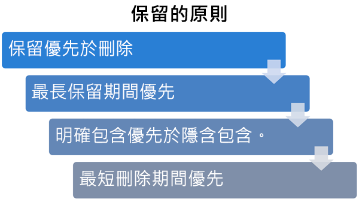

# 了解保留原則

>*[Microsoft 365 安全性與合規性的授權指引](https://aka.ms/ComplianceSD)。*

For most organizations, the volume and complexity of their data is increasing daily—email, documents, instant messages, and more. Effectively managing or governing this information is important because you need to:
  
- **主動遵守產業規範和內部原則**，因此您需要將某些內容至少保留一段時間，例如，Sarbanes-Oxley 法案可能會要求您將某些類型的內容保留七年。 
    
- **降低發生訴訟或安全性漏洞的風險**，方法為永久刪除您不再需要保留的舊內容。 
    
- **協助貴組織有效分享知識並提高靈活度**，方法為確保使用者只使用目前和相關的內容。 
    
A retention policy can help you achieve all of these goals. Managing content commonly requires two actions:
  
- **保留**內容，以便無法在保留期間結束之前將其永久刪除。 
    
- 在保留期間結束之前，永久**刪除**內容。 
    
透過保留原則，您可以：
  
- 主動決定是否要保留內容、刪除內容，還是兩者，即保留然後刪除內容。
    
- 將單一原則套用到整個組織或套用到特定位置或使用者。
    
- 將原則套用到所有內容或套用到符合特定條件的內容，例如包含關鍵字或[敏感性資訊類型](what-the-sensitive-information-types-look-for.md)的內容。
    
When content is subject to a retention policy, people can continue to edit and work with the content as if nothing's changed. The content is retained in place, in its original location. But if someone edits or deletes content that's subject to the retention policy, a copy of the original content is saved to a secure location where it's retained while the retention policy for that content is in effect. For more information, see the [How a retention policy works with content in place](#how-a-retention-policy-works-with-content-in-place) section on this page
  
此外，某些組織必須遵守美國證券交易委員會 (SEC) 規定 17a-4 等法規。 這項法規要求在開啟保留原則之後，不能關閉該原則或執行較不嚴格的限制。 若要滿足這個需求，您可以使用**保留鎖定**。 原則保留鎖定之後，任何人 (包括系統管理員) 均無法關閉保留原則或執行較不嚴格的限制。 如需詳細資訊，請參閱此頁面上的[使用保留鎖定以符合法規需求](#use-preservation-lock-to-comply-with-regulatory-requirements)一節。

## 保留原則如何與就地內容搭配使用

當您在保留原則中包含網站或信箱等位置時，內容會維持在其原本的位置。 若未發生任何變更，人員可以繼續使用其文件或郵件。 但如果人員編輯或刪除保留原則中包含的內容，則會保留您套用原則時即存在的內容複本。
  
- 對於 SharePoint 和 OneDrive 網站：複本會保留在**文件保留庫**中。 請注意，文件保留庫會佔用網站的儲存空間配額。

- 對於電子郵件和公用資料夾：複本會保留在 [可復原的項目]**** 資料夾中。 

- 針對 Teams 內容：複本會保留在 Exchange [可復原的項目]**** 資料夾中。

- 若為 Microsoft 365 群組 ([先前稱為 Office 365 群組](https://techcommunity.microsoft.com/t5/microsoft-365-blog/office-365-groups-will-become-microsoft-365-groups/ba-p/1303601))： 
    - 群組信箱會保留在 Exchange [可復原的項目]**** 資料夾中。
    - 任何網站內容都會保留在 [文件保留庫]**** 中。

> [!NOTE]
> [文件保留庫] 會佔用不受網站儲存空間配額限制的儲存空間。 當您對 SharePoint 和 Microsoft 365 群組使用保留原則時，可能需要增加您的儲存空間。
> 
大部分的人員無法檢視這些安全的位置和保留的內容。 透過保留原則，人員甚至不需要知道其內容受限於原則。

如需有關保留原則如何搭配不同工作負載使用的詳細資訊，請參閱下列文章：

- [了解 SharePoint 和 OneDrive 的保留原則](retention-policies-sharepoint.md)
- [了解 Microsoft Teams 的保留原則](retention-policies-teams.md)
- [了解 Exchange 的保留原則](retention-policies-exchange.md)

## 系統會優先處理保留原則嗎？

內容有可能套用多個會進行不同動作 (保留、刪除或保留然後刪除) 且保留期間不同的保留原則。 哪個的優先順序較高？ 在最高層級中，某個保留原則所保留的內容無法被另一個保留原則永久刪除。
  

  
若要了解不同的保留原則如何套用至內容，請記住以下保留原則：
  
1. **保留優先於刪除。** 假設某個保留原則設定在 3 年後刪除 Exchange 電子郵件，但另一個保留原則設定將 Exchange 電子郵件保留 5 年再刪除。 任何到達 3 年的內容會遭到刪除，並從使用者的檢視畫面隱藏，但仍會保留再 [可復原的項目] 資料夾中，直到內容到達 5 年，才會遭永久刪除。 
    
2. **最長保留期間優先。** 如果內容受多個用於保留內容的保留原則所限制，系統會將該內容保留最長的保留期間。 
    
3. **明確包含優先於隱含包含。** 也就是說： 
    
    1. 如果包含保留設定的保留標籤是由使用者手動指派至項目 (例如 Exchange 電子郵件或 OneDrive 文件)，則該保留標籤會優先於在網站或信箱層級指派的保留原則，以及文件庫指派的預設保留標籤。 例如，如果明確保留標籤設定要保留內容 10 年，但對網站指派的保留原則設定為保留內容 5 年，則保留標籤會優先於原則。 自動套用的保留標籤會被視為隱含，而非明確，因為這類標籤是由 Microsoft 365 自動套用。
    
    2. 如果保留原則包含特定位置 (例如特定使用者的信箱或 OneDrive 帳戶)，則該保留原則會優先於其他套用至所有使用者信箱或 OneDrive 帳戶但未特地包含該使用者信箱的保留原則。
    
4. **最短刪除期間優先。** 同樣地，如果內容受限於會刪除內容但不帶保留期間的多個保留原則，則會在最短刪除期間結束時刪除該內容。 
    
了解保留原則從上到下的仲裁流程：如果所有保留原則或保留標籤套用的規則都在同一個層級，則流程會移到下一個層級來決定套用規則的優先順序。
  
最終，保留原則或保留標籤無法永久刪除任何電子文件探索保留的內容。 將保留釋出時，該內容會再次符合上述的清理程序資格。

## 使用保留鎖定以符合法規需求

有些組織可能需要遵守由控管機構定義的法規，例如證券交易委員會 (SEC) 規定 17a-4，要求在保留原則開啟之後，不能關閉或執行較不嚴格的限制。 

「保留鎖定」可確保您的組織能夠符合這類法規需求，因為它會鎖定保留原則，使得沒有任何人 (包括系統管理員) 可以關閉原則或降低限制。
  
鎖定保留原則時：

- 沒有人可以關閉它
- 可以新增位置但不能移除位置 
- 不能在保留期間修改或刪除受限於原則的內容
- 您可以延長保留期間，但不能減少保留期間

總而言之，鎖定的保留原則可以增加或延長，但是不能減少或關閉。
  
> [!IMPORTANT]
> 在您鎖定保留原則之前，務必了解影響，並確認您的組織是否需要符合合規性需求。

## 釋出保留原則

如果您的保留原則沒有保留鎖定，則可以隨時關閉或刪除保留原則。 

當您這麼做時，保留在文件保留庫中的任何 SharePoint 或 OneDrive 的內容不會立即永久被刪除。 相反地，為了防止意外的資料遺失，我們有 30 天的寬限期，在這期間，保留文件庫中不會發生該原則的內容到期，因此，如有需要，您可以在這裡還原任何內容。 此外，您無法在寬限期期間手動刪除此內容。

您可以在寬限期期間再次開啟保留原則，這麼一來，將不會刪除該原則的內容。

SharePoint 和 OneDrive 中的此 30 天寬限期與 Exchange 中的 30 天延遲保留對應。 如需詳細資訊，請參閱[管理延遲保留信箱](identify-a-hold-on-an-exchange-online-mailbox.md#managing-mailboxes-on-delay-hold)。

## 使用保留原則，而非較舊的功能

您可以輕鬆地將單一保留原則套用到整個組織，以及 Microsoft 365 中的多個位置，包括 Exchange Online、SharePoint Online、OneDrive 和 Microsoft 365 群組。 如果您需要保留或刪除 Microsoft 365 任何位置中的內容，建議您使用保留原則，並選擇性地使用[保留標籤](labels.md)來加以補充。
  
如果您先前曾使用其他設定來保留或刪除 Microsoft 365 中的內容，該設定會繼續搭配保留原則和保留標籤運作。 不過，建議您今後改為使用保留原則和保留標籤。 它們提供單一機制來集中管理 Microsoft 365 內容的保留與刪除。

您可能已使用的舊版功能：
  
**來自 Exchange Online 的舊版功能：**

- [就地保留與訴訟暫止](https://go.microsoft.com/fwlink/?linkid=846124) (電子文件探索保留) 

- [如何找出位於 Exchange Online 信箱的保留類型](identify-a-hold-on-an-exchange-online-mailbox.md)
    
- [保留標記和保留原則](https://go.microsoft.com/fwlink/?linkid=846125)，又稱為[通訊記錄管理 (MRM)](https://go.microsoft.com/fwlink/?linkid=846126) (僅刪除)
    
另請參閱[舊版電子文件探索工具淘汰](legacy-ediscovery-retirement.md)。

**來自 SharePoint 和 OneDrive 的舊版功能：**

- [在電子文件探索中心將內容新增至案例及保留來源](https://docs.microsoft.com/SharePoint/governance/add-content-to-a-case-and-place-sources-on-hold-in-the-ediscovery-center) (電子文件探索保留) 
    
- [文件刪除原則](https://support.office.com/article/Create-a-document-deletion-policy-in-SharePoint-Server-2016-4fe26e19-4849-4eb9-a044-840ab47458ff) (僅刪除)
    
- [設定就地記錄管理](https://support.office.com/article/7707a878-780c-4be6-9cb0-9718ecde050a) (僅保留) 
    
- [網站關閉及刪除的使用原則](https://support.microsoft.com/zh-TW/office/use-policies-for-site-closure-and-deletion-a8280d82-27fd-48c5-9adf-8a5431208ba5) (僅刪除) 
    
- [資訊管理原則](intro-to-info-mgmt-policies.md) (僅刪除)
     
如果您之前曾為了資訊控管而使用任何電子文件探索保留，若要獲得主動合規性，請改為使用保留原則。 僅對保留使用電子文件探索。
  
### 保留原則和 SharePoint 內容類型原則或資訊管理原則

如果您已設定 SharePoint 網站的內容類型原則或資訊管理原則，以保留清單或文件庫的內容，當保留原則生效時，會忽略這些原則。 
  
### 保留原則會轉換為保留原則

如果您過去使用保留原則來保留信箱、SharePoint 或 OneDrive 網站或公用資料夾中的資料：該原則會自動轉換成僅使用保留動作的保留原則 (該原則不會刪除內容)。 您不需要進行任何變更，就能獲得與您設定保留原則相同的效果。

您可以在 [Microsoft 365 合規性中心](https://compliance.microsoft.com/)的 [原則]**** 頁面，或在[安全性與合規性中心](https://protection.office.com/) 的 [資訊控管]**** 下的 [保留]**** 頁面上尋找任何設定的保留原則。&amp; 您可以編輯保留原則以變更保留期間，但您不能進行其他變更，例如新增或移除位置。 

## 相關資訊

- [了解保留標籤](labels.md)
- [SharePoint Online 限制](https://docs.microsoft.com/office365/servicedescriptions/sharepoint-online-service-description/sharepoint-online-limits)
- [Microsoft Teams 的限制和規格](https://docs.microsoft.com/microsoftteams/limits-specifications-teams) 
- [符合美國證券交易委員會 (SEC) 規定 17A-4](use-exchange-online-to-comply-with-sec-rule-17a-4.md)

## 後續步驟

如果您已準備好建立保留原則，請參閱[建立及設定保留原則](create-retention-policies.md)。

