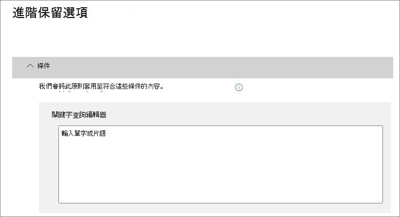

# 保留原則概觀

>*[Microsoft 365 安全性與合規性的授權指引](https://aka.ms/ComplianceSD)。*

對大多數組織來說，其資料 (電子郵件、文件、即時訊息等) 的數量和複雜性日益增加。有效管理或控管此資訊至關重要，因為您需要：
  
- **主動遵守產業規範和內部原則**，因此您需要將某些內容至少保留一段時間，例如，Sarbanes-Oxley 法案可能會要求您將某些類型的內容保留七年。 
    
- **降低發生訴訟或安全性漏洞的風險**，方法為永久刪除您不再需要保留的舊內容。 
    
- **協助貴組織有效分享知識並提高靈活度**，方法為確保使用者只使用目前和相關的內容。 
    
保留原則可協助您實現所有這些目標。管理內容通常需要下列兩個動作：
  
- **保留**內容，以便無法在保留期間結束之前將其永久刪除。 
    
- 在保留期間結束之前，永久**刪除**內容。 
    
透過保留原則，您可以：
  
- 主動決定是否要保留內容、刪除內容，還是兩者 (保留然後刪除內容)。
    
- 將單一原則套用到整個組織或套用到特定位置或使用者。
    
- 將原則套用到所有內容或套用到符合特定條件的內容，例如包含特定關鍵字或[特定類型的敏感性資訊](what-the-sensitive-information-types-look-for.md)的內容。
    
當內容受限於保留原則時，人員可以繼續編輯及使用的內容，一樣不會變更，因為內容保留在其原始位置。但在某人編輯或刪除受限於原則的內容時，將會有複本儲存至安全位置，在原則仍然有效時會持續進行保留。
  
最後，有些組織必須遵守法規，例如證券交易委員會 (SEC) 法規 17a-4，要求在保留原則開啟之後，不能關閉或執行較不嚴格的限制。若要滿足這個需求，您可以使用「保留鎖定」。原則鎖定之後，任何人 (包括系統管理員) 均無法關閉原則或降低原則的限制性。
  
您可以從 [Microsoft 365 合規性中心](https://compliance.microsoft.com/)建立及管理保留原則：[原則]****  >  [資料]****  >  [保留]****

您也可以使用 [解決方案]****  >  [資訊控管]****  >  [保留]**** 索引標籤瀏覽至 Microsoft 365 合規性中心的相同位置。 

**如果您想要在永久刪除內容之前檢視內容**，請考慮改用[保留標籤](labels.md)，而非保留原則。 建立保留標籤時，您可以設定[處置檢閱](disposition-reviews.md)，在保留期間結束時檢閱其內容。

## 保留原則如何就地使用內容

當您在保留原則中包括網站或信箱這類的位置時，內容仍會留在其原始位置。使用者可以繼續使用其文件或郵件，一樣不會變更。但在他們編輯或刪除原則中包含的內容時，系統會保留內容的複本，與您套用原則時存在的內容相同。
  
針對 SharePoint 網站集合，當使用者編輯或刪除原始內容時，原始內容的複本會保留在文件保留庫。針對電子郵件和公用資料夾，複本會保留在 [可復原的項目] 資料夾中。大部分人員看不到這些安全位置和保留內容。使用保留原則時，人員甚至不知道其內容受到原則約束。
  
附註：
  
- 小組（交談）的內容會儲存在 Exchange 中，其中會根據訊息類型（電子郵件或交談）套用原則。
    
- 套用到 Office 365 群組的保留原則同時包含群組信箱和網站。

- 文件保留庫會佔用網站的儲存空間配額。
    
### OneDrive 帳戶和 SharePoint 網站中的內容

保留原則會在網站集合層級套用。 當您在保留原則中包含 SharePoint 網站集合或 OneDrive 帳戶時，系統會使用文件保留庫來保留文件。 如果此文件保留庫還不存在，系統會自動建立。 您可以在網站集合的頂層網站中的 [網站內容]**** 頁面上檢視此文件庫。 文件保留庫僅供網站集合系統管理員檢視，大部分的使用者都無法檢視。
  
如有使用者嘗試變更或刪除受限於保留和刪除或僅保留的站台內容，保留原則會先檢查內容在套用原則後是否有所變更。 如果這是套用原則後的第一次變更，保留原則會先將內容複製到文件保留庫，然後允許使用者變更或刪除原始內容。 網站集合中的任何內容都可複製到文件保留庫，即使內容不符合保留原則所使用的查詢篩選器亦然。

將內容複製到文件保留庫適用於在套用保留原則時即存在的內容。 除此之外，任何在網站集合納入保留原則後才在網站集合中建立或新增的內容，在刪除之後仍將保留。 不過，新內容在第一次編輯時並不會複製到文件保留庫，而只有在刪除時才會。 若要保留檔案的所有版本，請按照下列[章節](#how-a-retention-policy-works-with-document-versions-in-a-site-collection)所述開啟版本設定。
  
請注意，如果使用者嘗試刪除受保留原則保護的文件庫、清單、資料夾或網站，則會收到錯誤。 如果先移動或刪除受到原則保護之資料夾中的檔案，那麼使用者就可以刪除該資料夾。 此外，只有當需要將第一個項目複製到文件庫，而非在建立保留原則時，才會建立保留文件庫。 因此，若要測試原則，您必須先編輯或刪除受限於原則的網站中的文件，然後瀏覽至文件保留庫以檢視保留的複本。
  
將保留原則指派至 OneDrive 帳戶或 SharePoint 網站後，內容的路徑會根據保留原則為保留和刪除、僅保留或僅刪除。

當保留原則為保留和刪除時：

  
1. 若已在保留期間**修改或刪除內容**：即會在文件保留庫中建立指派保留原則時即存在之原始內容的複本。 系統會定期執行計時器工作，並識別保留期間已過期的項目。 然後，這些項目會移到第二階段資源回收筒，並在 93 天結束時永久刪除。 使用者看不到第二階段資源回收筒 (只能看到第一階段資源回收筒)，但網站集合管理員可以檢視並從該處還原內容。

    > [!NOTE]
    > 為了防止資料意外遺失，系統永遠不會從保留文件保留庫自動刪除內容，但會移至第二階段資源回收筒。 這時，如果需要，可在 93 天的寬限期內復原此內容。
    
2. 若內容在保留期間**未修改或刪除**，在保留期間結束時會將內容移至第一階段資源回收筒。 如果使用者從此處刪除內容，或清空此資源回收筒 (也就是清除)，則會將文件移至第二階段資源回收筒。 93 天保留期間涵蓋了第一和第二階段資源回收筒。93 天結束時，則會從文件所在的任何位置永久刪除文件 (無論是第一或第二階段資源回收筒)。 系統並未對資源回收筒編製索引，因此無法提供搜尋。 如此一來，電子文件探索搜尋就找不到可放置保留的資源回收筒內容。

2. 若內容在保留期間**未修改或刪除**：在保留期間結束時，系統會將文件移至第一階段資源回收筒。 如果使用者從此處刪除文件，或清空此資源回收筒 (也就是清除)，則會將文件移至第二階段資源回收筒。 93 天保留期間涵蓋了第一和第二階段資源回收筒。93 天結束時，則會從文件所在的任何位置永久刪除文件 (無論是第一或第二階段資源回收筒)。 系統並未對資源回收筒編製索引，因此無法提供搜尋。 如此一來，電子文件探索搜尋就找不到可放置保留的資源回收筒內容。 

當保留原則為僅保留或僅刪除時，內容路徑為保留和刪除的變化：

#### 「僅保留」保留原則的內容路徑

1. 在保留期間，**如果內容已修改或刪除**：原始文件的複本會在文件保留庫內建立，並保留到保留期間結束時，然後文件保留庫內的複本會移至第二階段資源回收筒，並在 93 天後永久刪除。

2. 在保留期間，**如果未修改或刪除內容**：保留期間前後沒有任何變化；文件仍會保留在其原始位置。

#### 「僅刪除」保留原則的內容路徑

1. 在保留期間，**如果內容遭刪除**：文件會移至第一階段資源回收筒。 如果使用者從此處刪除文件，或清空此資源回收筒，則會將文件移至第二階段資源回收筒。 93 天保留期間涵蓋了第一和第二階段資源回收筒。93 天結束時，則會從文件所在的任何位置永久刪除文件 (無論是第一或第二階段資源回收筒)。 如果內容在保留期間修改，內容會在過期後遵循相同的刪除路徑。

2. 若內容在保留期間**未刪除**：在保留期間結束時，系統會將文件移至第一階段資源回收筒。 若內容在保留期間遭刪除，文件會立即移至第一階段資源回收筒。 如果使用者從此處刪除文件，或清空此資源回收筒 (也就是清除)，則會將文件移至第二階段資源回收筒。 93 天保留期間涵蓋了第一和第二階段資源回收筒。93 天結束時，則會從文件所在的任何位置永久刪除文件 (無論是第一或第二階段資源回收筒)。 系統並未對資源回收筒編製索引，因此無法提供搜尋。 如此一來，電子文件探索搜尋就找不到可放置保留的資源回收筒內容。

### 信箱與公用資料夾中的內容

對於使用者的信箱、行事曆和其他項目，保留原則會在信箱層級套用。對於公用資料夾，保留原則會套用在資料夾層級套用，而不是信箱層級。信箱和公用資料夾都是使用 [可復原的項目] 資料夾來保留項目。已指派電子文件探索權限的人員可以檢視其他使用者的 [可復原的項目] 資料夾中的項目。
  
根據預設，當使用者刪除 [刪除的郵件] 資料夾以外的資料夾中的郵件時，該郵件會移至 [刪除的郵件] 資料夾。當使用者刪除 [刪除的郵件] 資料夾中的項目時，郵件會移至 [可復原的項目] 資料夾。此外，使用者可以將任何資料夾中的項目虛刪除 (SHIFT+DELETE)，這會略過 [刪除的郵件] 資料夾，並將項目直接移至 [可復原的項目] 資料夾。
  
程序會定期評估 [可復原的項目] 資料夾中的項目。如果項目不符合至少一個保留原則的規則，則系統會從 [可復原的項目] 資料夾中永久刪除項目 (也稱為硬刪除)。
  
當有人嘗試變更信箱項目的特定內容時 (例如主旨、內文、附件、寄件者和收件者，或是傳送或接收郵件的日期)，在認可變更之前，會先將原始項目的複本儲存至 [可復原的項目] 資料夾。 後續每次變更都會執行此動作。 在保留期間結束時，系統會永久刪除 [可復原的項目] 資料夾中的複本。
  
當保留原則為保留和刪除時：

1. 在保留期間，**如果使用者已永久修改或刪除項目** (按 SHIFT+DELETE 或從 [刪除的郵件] 中刪除)，則項目會移至 (或在編輯的情況下複製到) [可復原的項目] 資料夾。在那裡，此程序會定期執行，並識別其保留期間已過期的項目，而且會在保留期間結束後的 14 天內永久刪除這些項目。請注意，14 天是預設設定，但它最多可設為 30 天。
    
2. 若未在保留期間**修改或刪除項目**，即會在信箱中的所有資料夾上定期執行相同程序，找到保留期間已過期的項目，並在保留期間結束的 14 天內永久刪除這些項目。 請注意，14 天是預設的設定，最多可設定為 30 天。 當保留原則為僅保留或僅刪除時，內容路徑為保留和刪除的變化：

#### 「僅保留」保留原則的內容路徑

1. 在保留期間，**如果項目遭修改或刪除**：則會在 [可復原的項目] 資料夾中建立原始項目的複本，並保留到保留期間結束時，然後在該項目到期後 14 天內永久刪除 [可復原的項目] 資料夾中的複本。 

2. 在保留期間，**如果未修改或刪除項目**：保留期間前後沒有任何變化；項目仍會保留在其原始位置。

#### 「僅刪除」保留原則的內容路徑

1. 在保留期間，**如果項目未刪除**：在保留期間結束時，系統會將項目移至 [可復原的項目] 資料夾。 

2. 在保留期間，**如果項目遭到刪除**，項目會立即移至 [可復原的項目] 資料夾。 如果使用者從該處刪除項目或清空 [可復原的項目] 資料夾，就會永久刪除項目。 否則，系統會在項目在 [可復原的項目] 資料夾中保留 14 天後永久刪除。 

### 當使用者離開組織時

**Exchange** 

如果組織中的使用者離職，且保留原則中包含使用者的信箱，在刪除使用者的 Office 365 帳戶後，信箱會變成非作用中的信箱。 在變成非作用的狀態之前，非作用中信箱的內容仍受限於信箱上所設之任何保留原則，且內容可供電子文件探索搜尋。 如需詳細資訊，請參閱 [Exchange Online 中的非作用中信箱](inactive-mailboxes-in-office-365.md)。

**OneDrive**

如果組織中的使用者離職，任何受保留原則管制或含有保留標籤的檔案，在原則或標籤的保留期間內都會予以保留。 在此期間，所有的共用存取權都持續有效。 當保留期間到期時，內容會移至 [網站集合資源回收筒] 中，且除了系統管理員以外的任何人都無法存取。如果保留原則將文件將標記為記錄，在保留期間結束前，不會刪除文件，保留期間結束後則會永久刪除。

**SharePoint**

如果組織中的使用者離職，該使用者建立的任何內容將不受到影響，因為 SharePoint 被視為共同作業環境，與使用者的信箱或 OneDrive 帳戶不同。

## 保留原則如何使用網站集合中的文件版本

版本設定是 SharePoint Online 和商務用 OneDrive 中所有文件庫的功能。 根據預設，版本設定會最少保留 500 個主要版本，不過您可以增加此限制。 如需詳細資訊，請參閱[啟用和設定清單或文件庫的版本設定](https://support.office.com/article/1555d642-23ee-446a-990a-bcab618c7a37)。
  
保留原則 (會保留內容而非僅刪除的保留原則) 會保留 SharePoint 網站集合或 OneDrive 帳戶中文件的所有版本。 受限於保留或保留原則的文件首次遭到編輯時，就會將原始文件版本複製到保留文件庫。 如果已啟用版本設定，受限於保留或保留原則的文件遭到刪除時，就會將所有版本複製到保留文件庫。 文件保留庫中的每個文件版本都會存在為個別的項目，並有其自己的保留期間：
  
- 如果保留原則是以建立內容的時間為基礎，則每個版本都有與原始文件相同的到期日。原始文件及其版本都在相同時間到期。
    
- 如果保留原則根據內容的前次修改時間，則每個版本都有自己的到期日，而此到期日根據為了建立該版本而修改原始文件的時間。原始文件及其版本彼此單獨到期。

> [!NOTE]
> 電子文件探索工具無法搜尋保留版本的 SharePoint 和 OneDrive 文件。

## 將內容保留特定的一段時間

透過保留原則，您可以無限期保留內容，或將內容保留特定數天、數月或數年。 保留內容的持續時間是從內容的存留期起算，而不是從套用保留原則的時間起算。 您可以選擇存留期是否要根據內容建立的時間，或前次修改的時間 (針對 OneDrive 和 SharePoint)。
  
例如，如果您想要將網站集合中的內容自從前次前次修改後保留七年，而且該網站集合中的某文件已有六年未曾修改，則若該文件後續仍未修改，則只會再保留一年。如果該文件重新編輯，則其存留期將會從新的前次修改日期算起，因而會再保留七年。
  
同樣地，如果您想要將信箱中的內容保留七年，而且六年前已傳送某訊息，則該訊息只會保留一年。對於 Exchange 內容，時間一律根據接收或傳送的日期 (它們是相同的)。根據前次修改時間保留內容僅適用於 OneDrive 和 SharePoint 中的網站內容。
  
您可以選擇是否要在保留期間結束時永久刪除內容。 保留原則也可以刪除舊內容而不予以保留。 請參閱下一節。
  

  
## 刪除早於特定存留期的內容

保留原則可以保留然後刪除內容，或刪除舊內容而不保留它。
  
如果您的保留原則刪 內容，請務必了解，文件刪除原則所指定的期限並不是從指派原則的時間算起，而是從建立或修改內容的時間算起。
  

  
例如，假設您建立三年後刪除內容的保留原則，然後將該原則指派給所有 OneDrive 帳戶，其中包含許多四或五年前建立的內容。在此情況下，第一次指派保留原則後，很快就會刪除大量的內容。基於這個原因，**刪除內容的保留原則可以對您的內容產生相當大的影響**。 
  
因此，在第一次將保留原則指派給網站集合之前，您應先考量現有內容的存留期，以及原則對該內容可能造成的影響。您也可以在指派新原則之前先與使用者溝通，讓他們有時間評估可能的影響。請注意，只在您建立保留原則之前，檢閱其設定時才會出現此警告。
  

  
## 只將原則套用到符合特定條件之內容的進階設定

保留原則可以套用至其包含之位置中的所有內容，或您可以選擇只將保留原則套用到包含特定關鍵字或[特定類型的敏感資訊](what-the-sensitive-information-types-look-for.md)的內容。
  

  
### 保留包含特定關鍵字的內容

您可以只將保留原則套用至符合特定條件的內容，然後只對該內容採取保留動作。可使用的條件現在支援將保留原則套用至包含特定字詞或片語的內容。您可以使用 AND、OR、NOT 等搜尋運算子來精簡查詢。如需這些運算子的詳細資訊，請參閱[內容搜尋的關鍵字查詢和搜尋條件](keyword-queries-and-search-conditions.md)。
  
即將推出對新增可搜尋屬性 (例如 **subject:**) 的支援。
  
查詢型保留會使用搜尋索引來識別內容。
  

  
### 保留包含敏感資訊的內容

您也可以只將保留原則套用至包含[特定類型的敏感資訊](what-the-sensitive-information-types-look-for.md)的內容。例如，您可以選擇只將唯一的保留需求套用至包含個人識別資訊 (PII) 的內容，例如納稅人身分識別碼、社會安全編號或護照號碼。
  

  
附註：
  
- 敏感資訊的進階保留不適用於 Exchange 公用資料夾或商務用 Skype，因為這些位置不支援敏感資訊類型。
    
- 您應該了解 Exchange Online 會使用郵件流程規則 (也稱為傳輸規則) 來識別敏感資訊，因此這僅適用於傳輸中的郵件，不適用於已儲存在信箱中的所有項目。對於 Exchange Online，這表示保留原則可以識別敏感資訊，並只對在原則套用至信箱**之後**收到的訊息採取保留動作。(請注意，上一節所述的查詢型保留並沒有這項限制，因為它會使用搜尋索引來識別內容)。 
    
## 將保留原則套用到整個組織或特定位置

您可以輕鬆地將保留原則套用到整個組織、整個位置，或只套用到特定位置或使用者。
  
### 全組織原則

保留原則最強大的功能之一，就是它可套用至 Office 365 中的各個位置，包括：
  
- Exchange 電子郵件
    
- SharePoint 網站集合
    
- OneDrive 帳戶
    
- Office 365 群組 (適用群組信箱和相關聯的 SharePoint 網站中的內容)。
    
- Exchange 公用資料夾
    

全組織保留原則的其他重要功能包含：
  
- 原則可以包含的信箱或網站數目沒有任何限制。
    
- 對於 Exchange，在套用原則後建立的任何新信箱都會自動繼承此原則。
  
### 套用到整個組織的原則

當您選擇位置時，您可以輕鬆地包含或排除整個位置，例如 Exchange 電子郵件或 OneDrive 帳戶。 若要這麼做，請將該位置的 [狀態]**** 切換到開啟或關閉。 
  
如同全組織原則一般，若原則套用到整個位置的任何組合，則原則可以包含的信箱或網站數目沒有限制。例如，如果原則包含所有 Exchange 電子郵件和所有 SharePoint 網站，則所有網站和信箱都會包含在內，無論有多少。對於 Exchange，套用原則後建立的任何新信箱都會自動繼承此原則。

### 具有特定包含或排除的原則

您也可以將保留原則套用至特定使用者、Office 365 群組或網站。若要這麼做，請將該位置的 [狀態]**** 切換為開啟，然後使用連結來包含或排除特定使用者、Office 365 群組或網站。 
  
不過請注意，包含或排除超過 1,000 個特定位置的保留原則有下列限制：
  
- 這類保留原則最多可包含 1,000 個信箱和 100 個網站集合。
    
- 一個租用戶最多可包含 10,000 個保留原則。
    
雖然有這些限制，但請了解您可以套用全組織原則或套用到整個位置的原則來超過這些限制。
  
### Skype 位置

不同於 Exchange 電子郵件，您無法將 Skype 位置的狀態切換為開啟以包含所有使用者，但當您開啟該位置時，可以手動選擇您想要保留其交談的使用者：

  
當您選取 [選擇使用者]**** 時，您可以選取欄標題中的 [名稱]**** 方塊，快速包含所有使用者。 不過，請務必了解，會將每個使用者算成原則中的一個特定包含。 因此，如果您包含超過 1,000 個使用者，則會套用上一節提及的限制。 在這裡選取所有 Skype 使用者，和整個組織的原則能夠根據預設包含所有 Skype 使用者並不一樣。 
  

  
請注意，**交談歷程記錄** (Outlook 中的資料夾) 是與 Skype 封存無關的功能。使用者可以關閉**交談歷程記錄**，但會執行 Skype 的封存，方法為將 Skype 交談的複本儲存在使用者無法存取但電子文件探索可以使用的隱藏資料夾中。

### SharePoint 位置

您的保留原則可以保留 SharePoint 通訊網站中的內容、未透過 Office 365 群組所連線的小組網站以及傳統網站。 此選項不支援由 Office 365 群組所連線的小組網站，而是改用 **Office 365 群組**位置。

如果您指定不受支援的網站，保留原則會忽略這些網站。

當您為 SharePoint 網站指定位置時，您不需要存取網站的權限，而在 [編輯位置]**** 頁面上指定 URL 時也不會進行驗證。 不過，網站必須編制索引，而在精靈結尾將會檢查您指定的網站是否存在。

如果此檢查失敗，您會看到一則訊息，指出您輸入的 URL 驗證失敗，且精靈不會建立保留原則，直到驗證檢查通過為止。 如果您看到這則訊息，請返回精靈變更 URL 或移除網站。

### Teams 位置

> [!NOTE]
> 我們尚未支援設定保留個人頻道訊息。 但支援保留私人頻道中的共用檔案。

您可以使用保留原則來保留 Teams 中的聊天和通道訊息。Teams 聊天儲存在涉及聊天的每個使用者之信箱的隱藏資料夾中，而 Teams 通道訊息則儲存在團隊的群組信箱中類似的隱藏資料夾中。不過，請務必了解 Teams 會使用 Azure 提供的聊天服務，其中也會儲存此資料，而且根據預設這項服務會永遠儲存該資料。基於這個原因，我們強烈建議您使用 Teams 位置來保留和刪除 Teams 資料。使用 Teams 位置會同時從 Exchange 信箱和基礎 Azure 提供的聊天服務中永久刪除資料。如需詳細資訊，請參閱 [Microsoft Teams 中的安全性及合規性概觀](https://go.microsoft.com/fwlink/?linkid=871258)。
  
套用至 Exchange 或 Office 365 群組位置內使用者或群組信箱的保留原則不會影響 Teams 聊天與頻道訊息。 即使 Teams 聊天與頻道訊息會儲存在 Exchange 中，也只會受到套用至 Teams 位置的保留原則影響。

> [!NOTE]
> 如果使用者包含在保留 Teams 資料的作用中保留原則中，且您刪除了包含在此原則中使用者的信箱，若要保留此資料，該信箱會轉換成[非作用中信箱](inactive-mailboxes-in-office-365.md)。 如果您不需要為使用者保留這個資料，請在刪除其信箱之前先將該使用者從保留原則排除。
  
將保留原則指派給團隊之後，交談和頻道訊息可以依循下列兩個途徑之一：

1. 如果使用者在保留期間**修改或刪除聊天或頻道訊息**，則會將該訊息移動 (或如果是編輯的情況下，則為複製) 至 SubstrateHolds 資料夾 (這是每個使用者或群組信箱中的隱藏資料夾)，並儲存在此資料夾中，直到保留期間到期為止。 訊息會在保留期間到期當日永久刪除。

2. 如果在保留期間**未刪除某個聊天或頻道訊息**，則該訊息會在保留期間到期後的一天內 (可能需要 0 到 24 小時的時間) 移至 SubstrateHolds 資料夾。 訊息會在移至 SubstrateHolds 資料夾的一天後永久刪除。 

> [!NOTE]
> SubstrateHolds 資料夾中的訊息可供電子文件探索工具搜尋。 永久刪除某個訊息後，電子文件探索搜尋中就不會傳回該訊息。

我們正持續努力將 Teams 中的保留功能最佳化，計劃在未來幾個月推出新功能。 在此同時，請留意以下所述的一些限制：
  
- **Teams 需要個別的保留原則**。 當您建立保留原則並將 Teams 位置切換為開啟時，其他所有位置都會切換為關閉。 包含 Teams 的保留原則只能包含 Teams 位置，不可包含其他位置。 
    
- **Teams 不包含在全組織原則中**。 如果建立全組織原則，則不會包含 Teams，因為它們需要個別的保留原則。 
    
- **Teams 不支援進階保留**。 建立保留原則時，如果您選擇 [只將原則套用到符合特定條件之內容的進階設定]，則 Teams 位置無法使用。 目前，Teams 中的保留會套用至所有聊天及頻道訊息內容。 

- **不支援私人頻道中的 Teams 內容**。 目前，為 Teams 建立的保留原則不適用私人頻道訊息。 只有標準通道中的訊息會受限於為 Teams 建立的保留原則。 私人頻道推出保留原則的支援近期會推出。 
    
- **Teams 最多可能需要三天的時間來清理到期的訊息**。 保留期間到期時，套用至 Teams 的保留原則將會刪除聊天和頻道訊息。 不過，要清理並永久刪除這些訊息最多可能需要三天的時間。 同時，聊天和頻道訊息在保留期間到期後以及當訊息永久刪除時，仍可透過電子文件探索工具進行搜尋。

   > [!NOTE]
   > 過去，保留原則無法刪除少於 30 天的 Teams 內容，我們已移除此限制。 現在 Teams 內容的保留期間，可以是您選擇的任何天數，也可以是一天這麼短的時間。 如果您確實有一天的保留期間，在保留期間到期後，於永久刪除訊息之前，可能需要最長 3 天的時間。
    
在 Teams 聊天中共用的檔案會儲存在共用檔案之使用者的 OneDrive 帳戶中。 上傳至頻道的檔案則會儲存在團隊的 SharePoint 網站中。 因此，若要保留或刪除 Teams 中的檔案，您需要建立一個套用至 OneDrive 和 Office 365 群組位置的保留原則。 如果您想要將原則套用到特定使用者或團隊在 Teams 中共用的檔案，您可以選擇 OneDrive 或 Office 365 群組位置，並包含特定的使用者或團隊。
  
套用到 Teams 的保留原則可以使用[保留鎖定](#locking-a-retention-policy)。
  

  
> [!NOTE]
> 如果您在組織中建立 Skype 或 Teams 位置的保留原則，當使用者在 Outlook 電腦版用戶端中檢視信箱資料夾的內容時，其中一個原則會顯示為預設資料夾原則。 這是 Outlook 中顯示不正確的問題，並且是[已知問題](https://support.microsoft.com/help/4491013/outlook-client-displays-teams-or-skype-for-business-retention-policies)。 應顯示為預設資料夾原則的是套用至資料夾的信箱保留原則。 Skype 或 Teams 保留原則不會套用至使用者的信箱。  

### Office 365 群組的位置

若要保留 Office 365 群組的內容，您需要使用 Office 365 群組位置。 即使 Office 365 群組有 Exchange 信箱，包含整個 Exchange 位置的保留原則並不會包含 Office 365 群組信箱中的內容。 套用到 Office 365 群組的保留原則同時包含群組信箱和網站。 套用至 Office 365 群組的保留原則可保護由 Office 365 群組所建立的資源，其中包括 Microsoft Teams。

此外，無法使用 Exchange 位置來包含或排除特定群組信箱。 雖然 Exchange 位置最初允許選取群組信箱，但是當您嘗試儲存保留原則時，您會收到 "RemoteGroupMailbox" 不是Exchange 位置的有效選項錯誤訊息。 

## 從保留原則中排除特定類型的 Exchange 項目
您可以使用 PowerShell，從保留原則中排除特定類型的 Exchange 項目。例如，您可以排除語音信箱訊息、 IM 交談，以及信箱中的其他 商務用 Skype Online 內容。您也可以排除行事曆、附註和工作項目。僅使用 PowerShell 才能提供此功能；建立保留原則時，無法在 UI 中提供它。
  
若要使用此功能，請使用 `New-RetentionComplianceRule` 和 `Set-RetentionComplianceRule` Cmdlet 的 `ExcludedItemClasses` 參數。

## 鎖定保留原則
有些組織可能需要遵守由監管機構定義的法規，例如證券交易委員會 (SEC) 法規 17a-4，要求在保留原則開啟之後，不能關閉或執行較不嚴格的限制。使用「保留鎖定」，您可以鎖定原則，讓任何人 (包括系統管理員) 均無法關閉原則或執行較不嚴格的限制。
  
鎖定原則之後，任何人均無法關閉它，或從原則中移除位置。也不能修改或刪除在保留期間受限於原則的內容。鎖定原則之後，修改保留原則的唯一方式是藉由在其中新增位置，或延長其持續時間。鎖定的原則可以增加或擴充，但是無法減少或關閉。
  
因此，在您鎖定保留原則之前，**務必**了解您組織的合規性需求，並且**不要鎖定原則**，除非您確定它是您需要的原則。

### 使用 PowerShell 鎖定保留原則
  
您僅可以使用 PowerShell 鎖定保留原則。

第一，[連接到 Office 365 安全性與合規性中心 PowerShell](https://docs.microsoft.com/powershell/exchange/office-365-scc/connect-to-scc-powershell/connect-to-scc-powershell?view=exchange-ps)。

第二，若要檢視您的保留原則清單，並尋找您想要鎖定的原則名稱，請執行 `Get-RetentionCompliancePolicy`。

第三，若要在保留原則上放置保留鎖定，請執行 `Set-RetentionCompliancePolicy` 時將 `RestrictiveRetention` 參數設為 True。 例如：

`Set-RetentionCompliancePolicy -Identity "<Name of Policy>" – RestrictiveRetention $true`

執行 Cmdlet 之後，您會看到確認提示。請選擇 [全部同意]****。

保留鎖定現在放置於保留原則上。 如果您執行 `Get-RetentionCompliancePolicy`，`RestrictiveRetention` 參數會設為 true。 例如：

`Get-RetentionCompliancePolicy -Identity "<Name of Policy>" |Fl`

  
## 發佈保留原則

您可以隨時關閉或刪除保留原則。 當您這麼做時，保留在文件保留庫中的任何 SharePoint 或 OneDrive 的內容不會立即永久被刪除。 相反地，為了防止意外的資料遺失，我們有 30 天的寬限期，在這期間，保留文件庫中不會發生該原則的內容到期，因此，如有需要，您可以在這裡還原任何內容。 您也可以在寬限期期間再次開啟保留原則，這麼一來，將不會刪除該原則的內容。

SharePoint 和 OneDrive 中的此 30 天寬限期與 Exchange 中的 30 天延遲保留對應。 如需詳細資訊，請參閱[管理延遲保留信箱](identify-a-hold-on-an-exchange-online-mailbox.md#managing-mailboxes-on-delay-hold)。

## 原則保留，哪一個優先？

很有可能內容會套用多個保留原則，這些原則各有不同的動作 (保留、刪除或兩者) 和保留期間。哪一個優先？請放心，最低限度，由一個原則保留的內容不會被另一個原則永久刪除。
  

  
若要了解不同的保留原則如何套用至內容，請記住以下保留原則：
  
1. **保留優先於刪除。** 假設某個保留原則會在 3 年後刪除 Exchange 電子郵件，但另一個保留原則會將 Exchange 電子郵件保留 5 年再刪除。 任何到達 3 年的內容會遭到刪除，並從使用者的檢視畫面隱藏，但仍會保留再 [可復原的項目] 資料夾中，直到內容到達 5 年，才會遭永久刪除。 
    
2. **最長保留期間優先。** 如果內容受多個用於保留內容的原則所限制，系統會將該內容保留最長的保留期間。 
    
3. **明確包含優先於隱含包含。** 也就是說： 
    
    1. 如果包含保留設定的標籤是由使用者手動指派至項目 (例如 Exchange 電子郵件或 OneDrive 文件)，則該標籤會優先於在網站或信箱層級指派的原則，以及文件庫指派的預設標籤。 例如，如果明確標籤會保留 10 年，但網站指派的原則只會保留 5 年，則標籤會優先於原則。 自動套用的標籤會被視為隱含，而不是明確，因為這類標籤是由 Office 365 自動套用。
    
    2. 如果保留原則包含特定位置 (例如特定使用者的信箱或商務用 OneDrive 帳戶)，則此原則優先於其他套用至所有使用者信箱或商務用 OneDrive 帳戶但未特地包含該使用者信箱的保留原則。
    
4. **最短刪除期間優先。** 同樣地，如果內容套用多個刪除內容的原則 (無保留)，則會在最短保留期間結束時刪除。 
    
了解保留原則從上到下的仲裁流程：如果所有原則或標籤套用的規則都在同一個層級，則流程會移到下一個層級來決定套用規則的優先順序。
  
最後，保留原則或標籤無法永久刪除電子文件探索保留的任何內容。保留解除時，這些內容便再度符合上述的清理程序。
  
## 使用保留原則，而不是這些功能

您可以輕鬆地將單一保留原則套用到整個組織，以及 Office 365 中的多個位置 (包括 Exchange Online、SharePoint Online、商務用 OneDrive 和 Office 365 群組)。 如果您需要保留或刪除 Office 365 任何位置中的內容，建議您使用保留原則。 (您也可以使用標籤搭配保留設定。 如需詳細資訊，請參閱[標籤概觀](labels.md)。)
  
有一些之前用來保留或刪除 Office 365 中的內容的其他功能。 如下所示。 這些功能會隨著保留原則和保留標籤繼續運作。 但建議您使用保留原則或標籤 (而非所有這些功能) 來進行資訊控管。 保留原則是唯一可以同時保留及刪除 Office 365 中的內容之功能。
  
### Exchange Online

- [管理 Office 365 安全性與合規性中心的電子文件探索案例](https://support.office.com/article/edea80d6-20a7-40fb-b8c4-5e8c8395f6da) (電子文件探索保留) 
    
- [就地保留與訴訟暫止](https://go.microsoft.com/fwlink/?linkid=846124) (電子文件探索保留) 

- [如何找出位於 Exchange Online 信箱的保留類型](identify-a-hold-on-an-exchange-online-mailbox.md)
    
- [保留標記和保留原則](https://go.microsoft.com/fwlink/?linkid=846125)，又稱為[郵件記錄管理 (MRM)](https://go.microsoft.com/fwlink/?linkid=846126) (僅限刪除) 
    
### SharePoint Online 和商務用 OneDrive

- [管理 Office 365 安全性與合規性中心的電子文件探索案例](https://support.office.com/article/edea80d6-20a7-40fb-b8c4-5e8c8395f6da) (電子文件探索保留) 
    
- [在電子文件探索中心將內容新增至案例及保留來源](https://support.office.com/article/54d70de9-1ec2-4325-84f3-aeb588554479) (電子文件探索保留) 
    
- [文件刪除原則的概觀](https://support.office.com/article/55e8d858-f278-482b-a198-2e62d6a2e6e5) (僅限刪除) 
    
- [設定就地記錄管理](https://support.office.com/article/7707a878-780c-4be6-9cb0-9718ecde050a) (保留) 
    
- [網站關閉及刪除的使用原則](https://support.office.com/article/a8280d82-27fd-48c5-9adf-8a5431208ba5) (僅限刪除) 
    
- [資料管理原則](intro-to-info-mgmt-policies.md) (僅限刪除) 
    
如果您之前曾為了資訊控管而使用任何電子文件探索保留，您應為主動合規性改用保留原則。 您應僅對電子文件探索使用保留。
  
### 保留原則會覆寫資訊管理原則

在 SharePoint 網站中，您可能會使用[資訊管理原則](intro-to-info-mgmt-policies.md)來保留內容。 如果您將保留原則套用至已對清單或文件庫使用內容類型原則或資訊管理原則的站台，這些原則將會被忽略，而保留原則會有效用。 
  
## 保留原則發生了什麼情況？

如果您過去使用的是保留原則 (preservation policy)，該原則現已自動轉換為只使用保留動作的保留原則 (retention policy)，該原則即不會刪除內容。 保留原則將繼續運作，並保留您的內容，而不會要求您進行任何變更。 您可以在 [Microsoft 365 合規性中心](https://compliance.microsoft.com/)的 [原則]**** 頁面，或在[安全性與合規性中心](https://protection.office.com/) 的 [資訊控管]**** 下的 [保留]**** 頁面上尋找這些原則。&amp; 您可以編輯保留原則以變更保留期間，但您不能進行其他變更，例如新增或移除位置。 

## 尋找保留原則的 PowerShell Cmdlet

若要使用保留原則 Cmdlet：
  
1. [連接到 Office 365 安全性與合規性中心 PowerShell](https://docs.microsoft.com/powershell/exchange/office-365-scc/connect-to-scc-powershell/connect-to-scc-powershell)
    
2. 使用這些 Office 365 安全性與合規性中心 Cmdlet：
    
    - [Get-RetentionCompliancePolicy](https://docs.microsoft.com/powershell/module/exchange/policy-and-compliance-retention/get-retentioncompliancepolicy)
    
    - [New-RetentionCompliancePolicy](https://docs.microsoft.com/powershell/module/exchange/policy-and-compliance-retention/new-retentioncompliancepolicy)
    
    - [Remove-RetentionCompliancePolicy](https://docs.microsoft.com/powershell/module/exchange/policy-and-compliance-retention/remove-retentioncompliancepolicy)
    
    - [Set-RetentionCompliancePolicy](https://docs.microsoft.com/powershell/module/exchange/policy-and-compliance-retention/set-retentioncompliancepolicy)
    
    - [Get-RetentionComplianceRule](https://docs.microsoft.com/powershell/module/exchange/policy-and-compliance-retention/get-retentioncompliancerule)
    
    - [New-RetentionComplianceRule](https://docs.microsoft.com/powershell/module/exchange/policy-and-compliance-retention/new-retentioncompliancerule)
    
    - [Remove-RetentionComplianceRule](https://docs.microsoft.com/powershell/module/exchange/policy-and-compliance-retention/remove-retentioncompliancerule)
    
    - [Set-RetentionComplianceRule](https://docs.microsoft.com/powershell/module/exchange/policy-and-compliance-retention/set-retentioncompliancerule)

## 權限

您的合規性團隊中負責建立保留原則的成員必須具備[安全性與合規性中心](https://protection.office.com/)的權限。&amp; 根據預設，租用戶系統管理員將可存取此位置，並且可直接讓法務人員與其他人存取[安全性&amp;與合規性中心](https://protection.office.com/)，而不需要為其提供租用戶系統管理員的所有權限。若要這麼做，我們建議您：移至[安全性&amp;與合規性中心](https://protection.office.com/)的 **[權限]** 頁面、編輯 **[合規性系統管理員]** 角色群組，並將該成員新增到該角色群組。 
  
如需詳細資訊，請參閱[授與使用者存取 Office 365 安全性與合規性中心的權限](https://docs.microsoft.com/microsoft-365/security/office-365-security/grant-access-to-the-security-and-compliance-center) (部分機器翻譯)。 

需要這些權限才能建立及套用保留原則。原則強制執行不需要內容的存取權。

## 詳細資訊

- [Microsoft Teams 中的保留原則](/microsoftteams/retention-policies#using-powershell )
- [標籤概觀](labels.md)
- [SharePoint Online 限制](https://docs.microsoft.com/office365/servicedescriptions/sharepoint-online-service-description/sharepoint-online-limits)
- [Microsoft Teams 的限制和規格](https://docs.microsoft.com/microsoftteams/limits-specifications-teams) 
    
