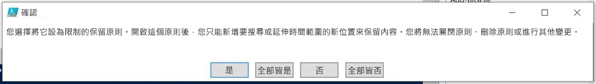

# <a name="use-preservation-lock-to-restrict-changes-to-retention-policies-and-retention-label-policies"></a><span data-ttu-id="c9e3c-103">使用「保留鎖定」來限制變更保留原則和保留標籤原則</span><span class="sxs-lookup"><span data-stu-id="c9e3c-103">Use Preservation Lock to restrict changes to retention policies and retention label policies</span></span>

><span data-ttu-id="c9e3c-104">*[Microsoft 365 安全性與合規性的授權指引](https://aka.ms/ComplianceSD)。*</span><span class="sxs-lookup"><span data-stu-id="c9e3c-104">*[Microsoft 365 licensing guidance for security & compliance](https://aka.ms/ComplianceSD).*</span></span>

<span data-ttu-id="c9e3c-105">「保留鎖定」可確保您的組織能夠符合這類法規需求，因為它會鎖定保留原則或保留標籤原則，使得沒有任何人 (包括系統管理員) 可以關閉原則、刪除原則或降低限制。</span><span class="sxs-lookup"><span data-stu-id="c9e3c-105">Preservation Lock locks a retention policy or retention label policy so that no one—including a global admin—can turn off the policy, delete the policy, or make it less restrictive.</span></span> <span data-ttu-id="c9e3c-106">可能有法規需求需要此設定，並有助於防範惡意系統管理員。</span><span class="sxs-lookup"><span data-stu-id="c9e3c-106">This configuration might be needed for regulatory requirements and can help safeguard against rogue administrators.</span></span>

<span data-ttu-id="c9e3c-107">鎖定保留原則時：</span><span class="sxs-lookup"><span data-stu-id="c9e3c-107">When a retention policy is locked:</span></span>

- <span data-ttu-id="c9e3c-108">任何人都不能停用或刪除原則</span><span class="sxs-lookup"><span data-stu-id="c9e3c-108">No one can disable the policy or delete it</span></span>
- <span data-ttu-id="c9e3c-109">可以新增位置但不能移除位置</span><span class="sxs-lookup"><span data-stu-id="c9e3c-109">Locations can be added but not removed</span></span>
- <span data-ttu-id="c9e3c-110">您可以延長保留期間，但不能減少保留期間</span><span class="sxs-lookup"><span data-stu-id="c9e3c-110">You can extend the retention period but not decrease it</span></span>

<span data-ttu-id="c9e3c-111">鎖定保留標籤原則時：</span><span class="sxs-lookup"><span data-stu-id="c9e3c-111">When a retention label policy is locked:</span></span>

- <span data-ttu-id="c9e3c-112">任何人都不能停用或刪除原則</span><span class="sxs-lookup"><span data-stu-id="c9e3c-112">No one can disable the policy or delete it</span></span>
- <span data-ttu-id="c9e3c-113">可以新增位置但不能移除位置</span><span class="sxs-lookup"><span data-stu-id="c9e3c-113">Locations can be added but not removed</span></span>
- <span data-ttu-id="c9e3c-114">可以新增標籤但不能移除標籤</span><span class="sxs-lookup"><span data-stu-id="c9e3c-114">Labels can be added but not removed</span></span>

<span data-ttu-id="c9e3c-115">總的來説，鎖定的保留原則可以增加或延長，但是不能減少或關閉。</span><span class="sxs-lookup"><span data-stu-id="c9e3c-115">In summary, a locked policy can be increased or extended, but it can't be reduced or turned off.</span></span>

> [!IMPORTANT]
> <span data-ttu-id="c9e3c-116">在您鎖定保留原則或保留標籤原則之前，請務必了解其影響，並確認您的組織是否需要它。</span><span class="sxs-lookup"><span data-stu-id="c9e3c-116">Before you lock a retention policy or retention label policy, it's critical that you understand the impact and confirm whether it's required for your organization.</span></span> <span data-ttu-id="c9e3c-117">例如，可能需要它來滿足法規需求。</span><span class="sxs-lookup"><span data-stu-id="c9e3c-117">For example, it might be needed to meet regulatory requirements.</span></span> <span data-ttu-id="c9e3c-118">套用保留鎖定之後，系統管理員將無法停用或刪除保留原則。</span><span class="sxs-lookup"><span data-stu-id="c9e3c-118">Administrators won't be able to disable or delete these policies after the preservation lock is applied.</span></span>

<span data-ttu-id="c9e3c-119">請在您建立[保留原則](create-retention-policies.md)，或[發佈](create-apply-retention-labels.md)或[自動套用](apply-retention-labels-automatically.md)保留標籤原則之後，再設定保留鎖定。</span><span class="sxs-lookup"><span data-stu-id="c9e3c-119">Configure Preservation Lock after you've created a [retention policy](create-retention-policies.md), or a retention label policy that you [publish](create-apply-retention-labels.md) or [auto-apply](apply-retention-labels-automatically.md).</span></span> 

> [!NOTE]
> <span data-ttu-id="c9e3c-120">鎖定標籤原則不會妨礙系統管理員縮短包含在鎖定原則中的標籤的保留期。</span><span class="sxs-lookup"><span data-stu-id="c9e3c-120">Locking a label policy doesn't prevent an administrator from reducing the retention period in a label that is included in the locked policy.</span></span> <span data-ttu-id="c9e3c-121">當您設定標籤以將項目標記為[監管記錄](records-management.md#records)時，可以滿足該要求和其他限制。</span><span class="sxs-lookup"><span data-stu-id="c9e3c-121">That requirement, with other restrictions, can be met when you configure a label to mark items as a [regulatory record](records-management.md#records).</span></span>

## <a name="how-to-lock-a-retention-policy-or-retention-label-policy"></a><span data-ttu-id="c9e3c-122">如何鎖定保留原則或保留標籤原則</span><span class="sxs-lookup"><span data-stu-id="c9e3c-122">How to lock a retention policy or retention label policy</span></span>

<span data-ttu-id="c9e3c-123">如果您需要使用保留鎖定，您必須使用 PowerShell。</span><span class="sxs-lookup"><span data-stu-id="c9e3c-123">You must use PowerShell if you need to use Preservation Lock.</span></span> <span data-ttu-id="c9e3c-124">因為系統管理員無法在套用保留鎖定之後停用或刪除保留原則，因此在 UI 中無法使用此功能來防範意外的設定。</span><span class="sxs-lookup"><span data-stu-id="c9e3c-124">Because administrators can't disable or delete a policy for retention after this lock is applied, enabling this feature is not available in the UI to safeguard against accidental configuration.</span></span>

<span data-ttu-id="c9e3c-125">具有任何設定的所有保留原則都支持保留鎖定。</span><span class="sxs-lookup"><span data-stu-id="c9e3c-125">All policies for retention and with any configuration support Preservation Lock.</span></span>

1. <span data-ttu-id="c9e3c-126">[連線到安全性與合規性中心 PowerShell](https://docs.microsoft.com/powershell/exchange/connect-to-scc-powershell)。</span><span class="sxs-lookup"><span data-stu-id="c9e3c-126">[Connect to Security & Compliance Center PowerShell](https://docs.microsoft.com/powershell/exchange/connect-to-scc-powershell).</span></span>

2. <span data-ttu-id="c9e3c-127">執行 [Get-RetentionCompliancePolicy](https://docs.microsoft.com/powershell/module/exchange/get-retentioncompliancepolicy) ，並尋找您想要鎖定的原則名稱。</span><span class="sxs-lookup"><span data-stu-id="c9e3c-127">Find the name of the policy that you want to lock by running [Get-RetentionCompliancePolicy](https://docs.microsoft.com/powershell/module/exchange/get-retentioncompliancepolicy).</span></span> <span data-ttu-id="c9e3c-128">例如：</span><span class="sxs-lookup"><span data-stu-id="c9e3c-128">For example:</span></span>
    
   

3. <span data-ttu-id="c9e3c-130">若要將保留鎖定置於保留原則上，請以保留原則名稱執行 [Set-RetentionCompliancePolicy](https://docs.microsoft.com/powershell/module/exchange/set-retentioncompliancepolicy) cmdlet，並將 *RestrictiveRetention* 參數設為 true：</span><span class="sxs-lookup"><span data-stu-id="c9e3c-130">To place a Preservation Lock on your policy, run the [Set-RetentionCompliancePolicy](https://docs.microsoft.com/powershell/module/exchange/set-retentioncompliancepolicy) cmdlet with the name of the policy, and the *RestrictiveRetention* parameter set to true:</span></span>
    
    ```powershell
    Set-RetentionCompliancePolicy -Identity "<Name of Policy>" –RestrictiveRetention $true
    ```
    
    <span data-ttu-id="c9e3c-131">例如：</span><span class="sxs-lookup"><span data-stu-id="c9e3c-131">For example:</span></span>
    
    
    
     <span data-ttu-id="c9e3c-133">當系統提示時，請閱讀並輸入 **Y** 來認可此設定隨附的限制：</span><span class="sxs-lookup"><span data-stu-id="c9e3c-133">When prompted, read and acknowledge the restrictions that come with this configuration by entering **Y**:</span></span>
    
   

<span data-ttu-id="c9e3c-135">保留鎖定現在放置於保留原則上。</span><span class="sxs-lookup"><span data-stu-id="c9e3c-135">A Preservation Lock is now placed on the policy.</span></span> <span data-ttu-id="c9e3c-136">若要確認，請再次執行 `Get-RetentionCompliancePolicy`，但指定保留原則名稱並顯示原則參數：</span><span class="sxs-lookup"><span data-stu-id="c9e3c-136">To confirm, run `Get-RetentionCompliancePolicy` again, but specify the policy name and display the policy parameters:</span></span>

```powershell
Get-RetentionCompliancePolicy -Identity "<Name of Policy>" |Fl
```

<span data-ttu-id="c9e3c-137">您應該會看到 **RestrictiveRetention** 設定為 **True**。</span><span class="sxs-lookup"><span data-stu-id="c9e3c-137">You should see **RestrictiveRetention** is set to **True**.</span></span> <span data-ttu-id="c9e3c-138">例如：</span><span class="sxs-lookup"><span data-stu-id="c9e3c-138">For example:</span></span>


## <a name="see-also"></a><span data-ttu-id="c9e3c-140">另請參閱</span><span class="sxs-lookup"><span data-stu-id="c9e3c-140">See also</span></span>

[<span data-ttu-id="c9e3c-141">協助您符合資訊管理與記錄管理法規需求的資源</span><span class="sxs-lookup"><span data-stu-id="c9e3c-141">Resources to help you meet regulatory requirements for information governance and records management</span></span>](retention-regulatory-requirements.md)
