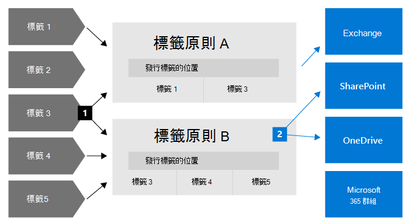
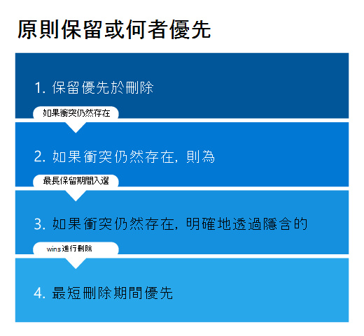

# 了解保留原則和保留標籤

>*[Microsoft 365 安全性與合規性的授權指引](/office365/servicedescriptions/microsoft-365-service-descriptions/microsoft-365-tenantlevel-services-licensing-guidance/microsoft-365-security-compliance-licensing-guidance)。*

> [!NOTE]
> 如果您看到應用程式中有關於保留原則的訊息，請連絡您的的 IT 部門，以取得他們已如何為您設定的資訊。 如果這些訊息是適用於 Teams 聊天或頻道訊息，請參閱[關於保留原則的 Teams 訊息](https://support.microsoft.com/office/teams-messages-about-retention-policies-c151fa2f-1558-4cf9-8e51-854e925b483b)。
>
> 此頁面上的資訊適用於可為了合規性原因而建立保留原則和保留標籤的 IT 系統管理員。

對大多數組織來說，其資料 (電子郵件、文件、即時訊息等) 的數量和複雜性日益增加。有效管理或控管此資訊至關重要，因為您需要：

- **主動遵守產業規範和內部原則**，因此您需要將某些內容至少保留一段時間，例如，Sarbanes-Oxley 法案可能會要求您將某些類型的內容保留七年。

- **降低發生訴訟或安全性漏洞的風險**，方法為永久刪除您不再需要保留的舊內容。

- **協助貴組織有效分享知識並提高靈活度**，方法為確保使用者只使用目前和相關的內容。

您設定的保留設定可協助您實現這些目標。 管理內容通常需要以下兩個動作：

| 動作| 用途 |
|:-----|:-----|
|保留內容 | 防止永久刪除，並保持可供電子文件探索使用 |
|刪除內容 | 從組織永久刪除內容|

使用這兩個保留動作，您可以設定以下結果的保留設定：

- 僅保留：永久持續保留內容或保留指定的一段時間。
- 僅刪除：於指定的一段時間後永久刪除內容。
- 保留並刪除：將內容保留一段指定的時間，然後將其永久刪除。

這些保留設定可以使用就地內容，從而在您基於合規性原因而必須保留內容時，節省建立和設定額外儲存體的額外負荷。 此外，您不必執行自訂的程序來複製及同步處理這項資料。

使用下列各節來深入了解保留原則和保留標記的運作方式、使用時機，以及它們彼此如何互補。 但如果您準備好要開始並為一些常見案例部署保留設定，請參閱[開始使用保留原則和保留標籤](get-started-with-retention.md)。

## 保留設定如何與就地內容搭配使用

當內容有指派保留設定時，該內容會保留在其原始位置。人員可以繼續處理他們的文件或郵件，就好像什麼都沒改變一樣。但如果人員編輯或刪除保留原則中包含的內容，則會自動保留內容複本。
  
- 對於 SharePoint 和 OneDrive 網站：複本會保留在 **文件保留庫** 中。

- 針對 Exchange 信箱：複本會保留在 **[可復原的項目]** 資料夾中。 

- 針對 Teams 和 Yammer 訊息：複本會保留在名為 **SubstrateHolds** 的隱藏資料夾中，以作為 Exchange [可復原的項目 **]** 資料夾中的子資料夾。

> [!NOTE]
> [文件保留庫] 會佔用不受網站儲存空間配額限制的儲存空間。 當您對 SharePoint 和 Microsoft 365 群組使用保留設定時，可能需要增加您的儲存空間。
> 
大部分的人員無法檢視這些安全的位置和保留的內容。 在大部分的情況下，使用者甚至不需要知道其內容受保留設定的限制。

如需有關保留設定如何配合不同工作負載使用的詳細資訊，請參閱下列文章：

- [了解 SharePoint 和 OneDrive 的保留功能](retention-policies-sharepoint.md)
- [了解 Microsoft Teams 保留](retention-policies-teams.md)
- [了解 Yammer 的保留](retention-policies-yammer.md)
- [了解 Exchange 的保留](retention-policies-exchange.md)

## 保留原則和保留標籤

若要將保留設定指派給內容，請將 **保留原則** 和 **保留標籤與標籤原則** 一起使用。 您可以只使用其中一種方法，也可以將它們結合使用。

使用保留原則為網站或信箱層級的內容指派相同的保留設定，並使用保留標籤來指派項目層級 (資料夾、文件、電子郵件) 的保留設定。

例如，如果 SharePoint 網站中的所有文件都應該保留 5 年，使用保留原則比將相同的保留標籤套用至該網站中所有文件的方法更有效率。 不過，如果該網站中的部分文件應保留 5 年，而其他文件保留 10 年，一個保留原則就不夠用。 當您必須在項目層級指定保留設定時，請使用保留標籤。 

不同於保留原則，保留標籤的保留設定會隨著內容移至您 Microsoft 365 租用戶中不同的位置。 此外，保留標籤具有以下保留原則不支援的功能： 
 
- 除了內容的年限或上次修改時間以外，還可選擇從為內容加上標籤的時間或根據事件來開始保留期間的選項。

- 使用[可訓練分類器](classifier-learn-about.md)來識別要加上標籤的內容。

- 為 SharePoint 文件套用預設標籤。

- 支援[處置檢閱](./disposition.md) 以在內容永久刪除之前檢閱。

- 將內容標示為做為標籤設定一部分的[記錄](records-management.md#records)，並且在保留期間結束而刪除內容時，永遠都有 [處置證明](disposition.md#disposition-of-records) 。

### 保留原則

保留原則可以套用到以下位置：
- Exchange 電子郵件
- SharePoint 網站
- OneDrive 帳戶
- Microsoft 365 群組
- 商務用 Skype
- Exchange 公用資料夾
- Teams 通道訊息
- Teams 聊天
- Yammer 社群訊息
- Yammer 私人訊息

您可以輕鬆地將單一原則套用到多個位置，或特定位置或使用者。

保留期間開始時，您可以選擇建立內容的時間，或者只支援檔案和 SharePoint、OneDrive 和 Microsoft 365 群組位置 (上次修改內容的時間) 的時間。

專案會從保留原則指定的容器繼承保留設定。 如果在爲了保留内容而設定原則時將專案移至容器外，則會在工作負荷的安全位置保留該專案的複本。 不過，保留設定不會隨著內容移至新的位置。 如有需要，請使用保留標籤，而非保留原則。

### 保留標籤

請針對需要不同保留設定的不同類型的內容，使用保留標籤。例如：
  
- 至少必須保留一小段時間的稅務表單。 
    
- 到達特定年限之後需要永久刪除的新聞材料。 
    
- 需要先保留一段期間之然後再永久刪除的競爭力研究。 
    
- 必須標示為記錄使之無法編輯或刪除的工作簽證。 
    
在這些情況下，保留標籤可讓您在項目層級 (文件或電子郵件) 套用治理控制的保留設定。
  
使用保留標籤，您可以：
  
- **讓貴組織中的人員手動將保留標籤套用** 至網頁上的 Outlook 和 Outlook、OneDrive、SharePoint 和 Microsoft 365 群組中的內容。 使用者通常都清楚知道自己處理的內容類型，因此可將內容分類並套用適當的保留設定。 
    
- 在當內容符合特定條件時 **自動將保留標籤套用到內容**，例如內容包含： 
    - 特定類型的敏感資訊。
    - 特定關鍵字符合您建立的查詢。
    - 可訓練分類器的模式比對。

- 針對 SharePoint 網站和 OneDrive 帳戶中的文件和電子郵件項目 (行事曆項除外)，**從內容加上標籤起就開始保留期間**。 如果您將具有此設定的保留標籤套用於行事曆項目，則保留期間從其傳送日期開始。

- **當事件發生時 (例如員工離開組織或合約到期)，開始保留期間**。

- **將預設保留標籤套用至 SharePoint 中的文件庫、資料夾或文件集**，以便儲存在該位置中的所有文件都繼承預設保留標籤。

此外，保留標籤支援跨 Microsoft 365 應用程式和服務的電子郵件和文件[記錄管理](records-management.md)。 您可以使用保留標籤將內容標記為記錄。 發生此情況且內容仍保留在 Microsoft 365 中時，標籤會針對法規原因可能所需的內容施加進一步的限制。 如需詳細資訊，請參閱 [比較允許或封鎖動作的限制](records-management.md#compare-restrictions-for-what-actions-are-allowed-or-blocked)。

與[敏感度標籤](sensitivity-labels.md)不同，如果內容是移至 Microsoft 365 以外的位置，保留標籤不會保留。

針對租用戶支援的保留標籤數量沒有任何限制。不過，10,000 個是針對租用戶支援的原則數目上限，其中包括會套用標籤 (保留標籤原則和自動套用保留原則) 的原則，以及保留原則。

#### 將內容分類而不套用任何動作

雖然保留標籤的主要目的是要保留或刪除內容，但您也可以在不開啟任何保留或其他動作的情況下使用保留標籤。 在此情況下，您可以使用保留標籤當做文字標籤，而不強制執行任何動作。
  
例如，您可以建立並套用名為「稍後檢閱」的保留標籤，而不執行任何動作，然後使用該標籤於稍後尋找該內容。
  

#### 使用保留標籤作為 DLP 原則的條件

您可以將保留標籤做為 SharePoint 文件的資料外洩防護 (DLP) 原則中的條件。 例如，設定 DLP 原則以防止文件在組織外共用 (如果已套用指定的保留標籤)。

如需詳細資訊，請參閱[使用保留標籤做為 DLP 原則中的條件](data-loss-prevention-policies.md#using-a-retention-label-as-a-condition-in-a-dlp-policy)。

#### 保留標籤和套用其標籤的原則

當您發佈保留標籤時，會將這些標籤包含在 **保留標籤原則** 中，好讓系統管理員和使用者將其套用至內容。 如下圖所示：

1. 單一保留標籤可納入多個保留標籤原則。

2. 保留標籤原則會指定要發佈保留標籤的位置。 同一位置可以納入多個保留標籤原則中。

您也可以建立一或多個 **自動套用原則**，每一個都有單一保留標籤。 使用此原則，當您在原則中指定的條件滿足時，將自動套用保留標籤。

#### 保留標籤原則與位置

可以將不同類型的保留標籤發佈到不同的位置，視保留標籤的功能而定。
  
| 如果保留標籤是... | 標籤原則可套用至… |
|:-----|:-----|
|已發佈給系統管理員和使用者    |Exchange、SharePoint、OneDrive、Microsoft 365 群組    |
|根據敏感資訊類型或可訓練分類器而自動套用    |Exchange (僅限所有信箱)、SharePoint、OneDrive    |
|根據查詢而自動套用    |Exchange、SharePoint、OneDrive、Microsoft 365 群組    |
   
在 Exchange 中，您只能在新傳送的郵件 (傳輸中的資料) 上自動套用保留標籤功能，而非目前在信箱中的所有郵件 (待用資料)。此外，您只能在所有信箱中為敏感性資訊類型和可訓練分類器來自動套用保留標籤功能，但無法選取特定信箱。
  
Exchange 公用資料夾、Skype、Teams 和 Yammer 訊息不支援保留標籤。 若要保留或刪除這些位置中的內容，請改用保留原則。

#### 一次只能有一個保留標籤

電子郵件或文件等內容一次只能套用一個保留標籤。 保留標籤可以由使用者或管理員[手動](create-apply-retention-labels.md#manually-apply-retention-labels)套用，也可以使用以下任一方法自動套用：

- [自動套用標籤原則](apply-retention-labels-automatically.md)
- [SharePoint Syntex 中的文件瞭解模型](../contentunderstanding/apply-a-retention-label-to-a-model.md)
- [SharePoint](create-apply-retention-labels.md#applying-a-default-retention-label-to-all-content-in-a-sharepoint-library-folder-or-document-set) 或 [Outlook 的預設標籤](create-apply-retention-labels.md#applying-a-default-retention-label-to-an-outlook-folder)
- [Outlook 規則](create-apply-retention-labels.md#automatically-applying-a-retention-label-to-email-by-using-rules)

對於標準保留標籤 (它們不會將項目標記為[記錄或監管記錄](records-management.md#records))：

- 系統管理員和使用者可以手動變更或移除套用於內容的現有保留標籤。 

- 當內容已套用保留標籤時，現有標籤不會自動移除或替換為另一個保留標籤，但有一個可能的例外：現有標籤已作為預設標籤套用。
    
    有關使用預設標籤套用標籤行為的詳細資訊，請執行以下操作：
    - SharePoint 的預設標籤：[對 SharePoint 使用預設標籤時的標籤行為](create-apply-retention-labels.md#label-behavior-when-you-use-a-default-label-for-sharepoint)
    - Outlook 的預設標籤：[將預設保留標籤套用於 Outlook 資料夾](create-apply-retention-labels.md#applying-a-default-retention-label-to-an-outlook-folder)

- 如果有多個自動套用標籤原則可以套用保留標籤，並且內容滿足多個原則的條件，則套用最舊的自動套用標籤原則 (按建立日期) 的保留標籤。

當保留標籤將項目標記為記錄或監管記錄時，這些標籤不會自動變更。 只有容器的管理員才能手動變更或移除將項目標記為記錄而不是監管記錄的保留標籤。 如需詳細資訊，請參閱 [比較允許或封鎖動作的限制](records-management.md#compare-restrictions-for-what-actions-are-allowed-or-blocked)。

#### 監視保留標籤

在 Microsoft 365 合規性中心中，使用 **資料分類** > **概觀** 來監視保留標籤在租用戶中的使用方式，並識別標籤項目的位置。 如需詳細資訊 (包括重要先決條件)，請參閱[了解您的資料 - 資料分類概觀](data-classification-overview.md)。

然後您可以使用[內容總管](data-classification-content-explorer.md)和[活動總管](data-classification-activity-explorer.md)深入探討詳細資料。

> [!TIP]
>請考慮使用一些其他的資料分類深入解析 (例如可訓練分類器和敏感性資訊類型)，協助您識別可能需要保留或刪除的內容，或管理記錄。

Office 365 安全性與合規性中心具有來自 **資訊控管** > **儀表板** 的保留標籤同等概觀資訊，以及來自 **資訊控管** > **標籤活動總管** 的詳細資訊。 如需從此舊版系統管理中心監視保留標籤的詳細資訊，請參閱下列文件：
- [檢視資料控管報告](view-the-data-governance-reports.md)
- [開始使用資料分類](data-classification-overview.md)。
- [檢視文件的標籤活動](view-label-activity-for-documents.md)

#### 使用內容搜尋來尋找具有特定保留標籤的所有內容

將保留標籤套用至內容後 (無論是由使用者套用或自動套用)，您可以使用內容搜尋來尋找已套用特定保留標籤的所有項目。

當您建立內容搜尋時，請選擇 **[保留標籤]** 條件，然後輸入完整的保留標籤名稱或是部分標籤名稱，再使用萬用字元。 如需詳細資訊，請參閱[內容搜尋的關鍵字查詢和搜尋條件](keyword-queries-and-search-conditions.md)。
  

## 比較保留原則和保留標籤的功能

使用下列表格來協助您判斷是否要根據功能來使用保留原則或保留標籤。

|功能|保留原則 |保留標籤|
|:-----|:-----|:-----|:-----|
|可以保留然後刪除、僅保留或僅刪除的保留設定 |是 |是 |
|支援的工作負載：  - Exchange  - SharePoint  - OneDrive  - Microsoft 365 群組  - 商務用 Skype  - Teams - Yammer|  是   是   是   是   是   是   是 |   是，除了公用資料夾   是   是   是   否   否   否 |
|自動套用的保留 | 是 | 是 |
|根據條件套用保留   - 敏感資訊類型、KQL 查詢和關鍵字、可訓練分類器| 否 | 是 |
|手動套用的保留 | 否 | 是 |
|使用者的 UI 目前狀態 | 否 | 是 |
|如果內容已移動，則會持續存在 | 否 | 是，在您的 Microsoft 365 租用戶中 |
|將項目宣告為記錄| 否 | 是 |
|在加上標籤起或根據事件來開始保留期間 | 否 | 是 |
|處置檢閱 | 否| 是 |
|最高 7 年的處置證明 | 否 |是，當您使用處置檢閱或項目被標示為記錄時|
|稽核系統管理員活動| 是 | 是|
|識別要保留的項目：   - 內容搜尋   - 資料分類頁面、內容總管，活動總管 |   否   否 |   是   是|

請注意，您可以使用保留原則和保留標籤做為補充保留方法。例如：

1. 您建立並設定將在內容上次修改後五年自動刪除內容的保留原則，並將該原則套用於所有 OneDrive 帳戶。

2. 您建立並設定永久保留內容的保留標籤，並將其新增至您發佈到所有 OneDrive 帳戶的標籤原則。 您向使用者說明如何手動將此標籤套用於五年後未修改應從自動刪除排除的特定文件。

有關保留原則和保留標籤如何搭配，以及如何判斷其合併結果的更多資訊，請參閱下一節解釋保留的原則和其優先順序。

## 原則保留或何者優先

與保留標籤不同，您可以對同一內容套用多個保留原則。 每個保留原則都可能導致一個保留動作和一個刪除動作。 此外，該項也可以透過保留標籤執行這些動作。

在這種情況下，當項目可能受到多個可能相互衝突的保留設定的約束時，確定結果的優先順序是什麼？

結果不是哪一個保留原則或單個保留標籤優先採用，而是項目被保留多長時間 (如果適用) 以及何時删除項目 (如果適用)。 這兩個動作是根據套用於項目的所有保留設定獨立計算的。

例如，項目可能受一個為只删除動作設定的保留原則和另一個設定為保留然後删除的保留原則的約束。 因此，此項只有一個保留動作和兩個刪除動作。 保留和删除動作可能會彼此相互衝突，並且這兩個删除動作的日期可能有衝突。 若要達成結果，您必須套用保留原則。

在高層級中，您可以確保保留永遠優先於刪除，然後最長的保留期間勝出。 這兩個簡單的規則總是决定項目將被保留多長時間。

决定何時删除項目還有幾個因素，其中包括從保留標籤中删除動作始終優先於從保留原則中删除動作。

使用以下流程來瞭解單個項目的保留和删除結果，其中每個層級從上到下扮演解決衝突的決勝局角色。 如果結果是由第一層級決定 (因為沒有更多的衝突)，則無需前進到下一個層級，依此類推。

> [!IMPORTANT]
> 如果使用的是保留標籤：在使用此流程確定同一項目上多個保留設定的結果之前，請確保您知道[套用了哪個保留標籤](#only-one-retention-label-at-a-time)。

  
四個不同層級的說明：
  
1. **保留優先於刪除。** 如果內容還具有保留設定，則不會永久删除該內容。  
    
    範例：電子郵件受 Exchange 保留原則的約束，該原則設定為在三年後删除項目，並且套用了保留標籤，該標籤設定為保留項目五年。
    
    此電子郵件保留五年，因為此保留動作優先於删除動作。 由於延遲删除動作，電子郵件將在五年時間結束時被删除。

2. **最長保留期間優先。** 如果內容受制於在不同的期間保留內容的多個保留設定，則該內容將一直保留到最長保留期間結束為止。
    
    範例：Marketing SharePoint 網站中的文件受兩個保留原則的約束。 為所有 SharePoint 網站設定了第一個保留原則，以將項目保留五年。 第二個保留原則是為特定的 SharePoint 網站設定的，以將項目保留十年。
    
    此 Marketing SharePoint 網站中的文件保留十年，因為這是最長的保留期。

3. **明確優先於隱含。** 適用於確定删除項目的時間： 
    
    1. 與保留原則相比，保留標籤 (無論套用的是什麼) 提供明確保留，因為保留設定套用於單個項目，而不是從容器隱含分配。 這意味著從保留標籤執行的删除動作始終優先於任何保留原則中的删除動作。
        
        範例：文件受兩個保留原則的約束，這兩個原則的删除動作分別為 5 年和 10 年，保留標籤的删除動作為 7 年。
        
        文件在七年後被删除，因為從保留標籤中的删除動作優先。
    
    2. 只有保留原則時：如果某個位置的保留原則的作用域是使用包含設定 (例如 Exchange 電子郵件的特定使用者)，則對於同一位置，保留原則優先於未限定範圍的保留原則。
        
        未限定範圍的保留原則是指在不指定特定實例的情况下選取位置。 例如，**Exchange 電子郵件** 和 **[所有收件人]** 的預設設置都是未限定範圍的保留原則。 或者，**SharePoint 網站** 和 **所有網站** 的預設設定。 當確定保留原則的作用域時，它們在此層級上具有相同的優先順序。
        
        範例 1：電子郵件受兩個保留原則的約束。 第一個保留原則是未限定範圍的，並在 10 年後删除項目。 第二個保留原則的範圍是特定郵箱，並在五年後删除項目。
        
        電子郵件在五年後被删除，因為範圍保留原則中的删除動作優先於未限定範圍的保留原則。
        
        範例 2：使用者 OneDrive 帳戶中的文件受兩個保留原則的約束。 第一個保留原則的範圍是包括此使用者的 OneDrive 帳戶，並在 10 年後執行删除動作。 第二個保留原則的範圍是包括此使用者的 OneDrive 帳戶，並在七年後執行删除動作。
        
        無法在此層級確定何時删除此文件，因為這兩個保留原則都有範圍。

4. **最短刪除期間優先。** 適用於確定何時從保留原則中删除項目，並且無法從上一層級解析結果：在最短保留期結束時删除內容。
    
    範例：使用者 OneDrive 帳戶中的文件受兩個保留原則的約束。 第一個保留原則的範圍是包括此使用者的 OneDrive 帳戶，並在 10 年後執行删除動作。 第二個保留原則的範圍是包括此使用者的 OneDrive 帳戶，並在七年後執行删除動作。
    
    此檔案將在七年後删除，因為這是這兩個範圍內保留原則的最短保留期。

請注意，受 eDiscovery 保留約束的項目也屬於保留的第一準則；任何保留原則或保留標籤都不能删除它們。 當解除保留後，保留準則繼續適用於他們。 例如，它們可能會受到未到期的保留期或延遲的删除動作的影響。

結合保留和删除動作的更複雜的範例：

1. 項目套用了以下保留設定：
    
    - 僅在五年後删除的保留原則
    - 保留三年然後删除的保留原則
    - 只保留七年的保留標籤
    
    **結果**：該項目保留七年，因為保留優先於删除，七年是最長的保留期。 在保留期結束時，由於保留原則中的删除動作在保留項目時被延后，因此將删除該項目。
    
    雖然這兩個保留原則的删除動作的日期不同，但可以删除的項目最早是在最長保留期結束時，而該日期比這兩種刪除日期更長。 在此範例中，刪除日期沒有發生任何衝突需要解決，因此所有的衝突都會由第二層級解決。

2.  項目套用了以下保留設定：
    
    - 一種未限定範圍的保留原則，僅在 10 年後删除
    - 保留五年，然後删除的限定範圍的保留原則
    - 保留三年然後删除的保留標籤
    
    **結果**：該項目保留五年，因為這是最長的保留期。 在該保留期結束時，該項目將被删除，因為在保留該項目的同時，保留標籤的三年后删除動作被延遲。 保留標籤中的删除優先於從所有保留原則中的删除。 在此範例中，所有衝突都會由第三層處理解決。

## 使用「保留鎖定」來限制原則變更

有些組織可能需要遵守由控管機構定義的規則，例如證券交易委員會 (SEC) 規定 17a-4，要求在保留原則開啟之後，不能關閉或執行較不嚴格的限制。 

「保留鎖定」可確保您的組織能夠符合這類法規需求，因為它會鎖定保留原則或保留標籤原則，使得沒有任何人 (包括系統管理員) 可以關閉原則、刪除原則或降低限制。
  
建立保留原則或保留標籤原則之後，您可以套用「保留鎖定」。 如需更多資訊和指示，請參閲[使用保留鎖定來限制變更保留原則和保留標籤原則](retention-preservation-lock.md)。

## 發佈保留原則

如果您的保留原則沒有保留鎖定，您可以隨時刪除您的原則，以便有效地關閉先前套用的保留設定。 您也可以保留此原則，但是移除 SharePoint 的網站或 OneDrive 的帳戶，或將位置狀態變更為關閉，或停用該原則。
 
當您執行任何這些動作時，任何受限於原則保留的 SharePoint 或 OneDrive 內容會繼續保留 30 天，以避免意外的資料遺失。 在這個 30 天寬限期內，您無法刪除網站，已刪除的檔案仍會保留 (檔案會繼續新增至文件保留庫)，但是定期清除文件保留庫的計時器工作會暫停，因此您可以在必要時還原這些檔案。

如需文件保留庫的詳細資訊，請參閱[保留如何用於 SharePoint 和 OneDrive](retention-policies-sharepoint.md#how-retention-works-for-sharepoint-and-onedrive)。

由於寬限期期間的行為，如果您在 30 天內重新啟用此原則或將位置狀態變更回啟用狀態，則此期間原則會繼續執行，不會有任何資料永久遺失。

## 稽核保留設定

[啟用稽核功能](turn-audit-log-search-on-or-off.md)後，系統會將保留原則和保留標籤的系統管理員動作儲存至稽核記錄。 例如，建立、設定或刪除保留原則或標籤後，系統會建立稽核事件。 如需完整清單，請參閱[保留原則和保留標籤活動](search-the-audit-log-in-security-and-compliance.md#retention-policy-and-retention-label-activities)。

## 保留原則和保留標籤的 PowerShell Cmdlet

若要使用保留 Cmdlet，您必須先[連線至 Office 365 安全性與合規性中心 PowerShell](/powershell/exchange/connect-to-scc-powershell)。 然後使用以下任一 Cmdlet：

- [Get-ComplianceTag](/powershell/module/exchange/get-compliancetag)

- [New-ComplianceTag](/powershell/module/exchange/new-compliancetag)

- [Remove-ComplianceTag](/powershell/module/exchange/remove-compliancetag)

- [Set-ComplianceTag](/powershell/module/exchange/set-compliancetag)

- [Enable-ComplianceTagStorage](/powershell/module/exchange/enable-compliancetagstorage)

- [Get-ComplianceTagStorage](/powershell/module/exchange/get-compliancetagstorage)

- [Get-RetentionCompliancePolicy](/powershell/module/exchange/get-retentioncompliancepolicy)

- [New-RetentionCompliancePolicy](/powershell/module/exchange/new-retentioncompliancepolicy)

- [Remove-RetentionCompliancePolicy](/powershell/module/exchange/remove-retentioncompliancepolicy)

- [Set-RetentionCompliancePolicy](/powershell/module/exchange/set-retentioncompliancepolicy)

- [Get-RetentionComplianceRule](/powershell/module/exchange/get-retentioncompliancerule)

- [New-RetentionComplianceRule](/powershell/module/exchange/new-retentioncompliancerule)

- [Remove-RetentionComplianceRule](/powershell/module/exchange/remove-retentioncompliancerule)

- [Set-RetentionComplianceRule](/powershell/module/exchange/set-retentioncompliancerule)

## 何時使用保留原則和保留標籤或電子文件探索保留？

雖然您使用保留設定和[電子文件探索案例所建立的保留](create-ediscovery-holds.md)都可以防止資料永久刪除，但它們是為不同情況而設計的。 若要協助您了解差異及決定使用哪個，請使用下列指南：

- 您在 [保留原則] 和 [保留標籤] 中指定的保留設定，是專為長期資訊控管而設計，以保留或刪除符合法規需求的資料。 範圍通常很廣，主要重點是位置和內容，而不是個別使用者。 保留期間的開始和結束是可設定的，可選擇自動刪除內容，而不需要其他系統管理員介入。

- 電子文件探索的保留 (核心電子文件探索或進階電子文件探索案例) 是專為保留資料以供法律調查所設計。 該範圍是特定的，且重點是已識別使用者所擁有的內容。 保留期間的開始和結束不會進行設定，但與個別系統管理員的動作相關，沒有選項可在保留解除時自動刪除內容。

比較保留與電子文件探索保留的摘要：

|考量事項|保留 |電子文件探索保留|
|:-----|:-----|:-----|:-----|
|商務需求： |合規性 |法律資訊 |
|時間範圍： |長期 |短期 |
|焦點： |廣泛的、內容型 |特定的、使用者型 |
|開始和結束日期可設定： |是 |否 |
|內容刪除： |是 (選用) |否 |
|系統管理開銷： |低 |高 |

如果內容同時受制於保留設定和電子文件探索保留，則電子文件探索保留的內容保留永遠優先。 如此一來，[保留的原則](#the-principles-of-retention-or-what-takes-precedence)會擴充至電子文件探索保留，因為系統會在管理員手動解除保留之前，將資料保留。 不過，儘管這個優先順序，請不要將電子文件探索保留用於長期資訊控管。 如果您擔心自動刪除資料，您可以設定保留設定以永遠保留項目，或對保留標籤使用[處置評審](disposition.md#disposition-reviews)。

如果您使用舊版電子文件探索工具來保留資料，請參閱下列資源：

- Exchange： 
    - [就地保留與訴訟資料暫留](/exchange/security-and-compliance/in-place-and-litigation-holds)
    - [如何找出位於 Exchange Online 信箱的保留類型](./identify-a-hold-on-an-exchange-online-mailbox.md)

- SharePoint 和 OneDrive： 
    - [在電子文件探索中心將內容新增至案例及保留來源](/SharePoint/governance/add-content-to-a-case-and-place-sources-on-hold-in-the-ediscovery-center)

- [舊版電子文件探索工具淘汰](legacy-ediscovery-retirement.md)

## 請使用保留原則和保留標籤，而非舊版的功能

如果您必要在 Microsoft 365 中預先主動保留或刪除內容，我們建議您使用保留原則和保留標籤，而非以下較舊的功能。

如果您目前使用這些較舊的功能，這些功能會隨著保留原則和保留標籤繼續運作。 不過，建議您今後改為使用保留原則和保留標籤。 它們提供單一機制來集中管理 Microsoft 365 內容的保留與刪除。

**來自 Exchange Online 的舊版功能：**

- [保留標記和保留原則](/exchange/security-and-compliance/messaging-records-management/retention-tags-and-policies)，又稱為[通訊記錄管理 (MRM)](/exchange/security-and-compliance/messaging-records-management/messaging-records-management) (僅刪除)

**來自 SharePoint 和 OneDrive 的舊版功能：**

- [文件刪除原則](https://support.office.com/article/Create-a-document-deletion-policy-in-SharePoint-Server-2016-4fe26e19-4849-4eb9-a044-840ab47458ff) (僅刪除)
    
- [設定就地記錄管理](https://support.office.com/article/7707a878-780c-4be6-9cb0-9718ecde050a) (僅保留) 
    
- [網站關閉及刪除的使用原則](https://support.microsoft.com/zh-TW/office/use-policies-for-site-closure-and-deletion-a8280d82-27fd-48c5-9adf-8a5431208ba5) (僅刪除)
    
- [資訊管理原則](intro-to-info-mgmt-policies.md) (僅刪除)
     
如果您已設定 SharePoint 網站的內容類型原則或資訊管理原則，以保留清單或文件庫的內容，當保留原則生效時，會忽略這些原則。 

## 相關資訊

- [SharePoint Online 限制](/office365/servicedescriptions/sharepoint-online-service-description/sharepoint-online-limits)
- [Microsoft Teams 的限制和規格](/microsoftteams/limits-specifications-teams) 
- [協助您符合資訊管理與記錄管理法規需求的資源](retention-regulatory-requirements.md)

## 配置指導方針

如果您已準備好建立保留原則，請參閱[建立及設定保留原則](create-retention-policies.md)。

若要建立及套用保留標籤：
- [建立保留標籤，並在應用程式中使用這些標籤](create-apply-retention-labels.md)
- [自動將保留標籤套用到內容](apply-retention-labels-automatically.md)