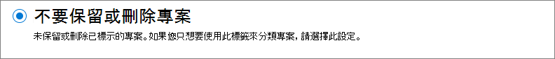

# 了解保留原則和保留標籤Learn about retention policies and retention labels

>*[Microsoft 365 安全性與合規性的授權指引](https://aka.ms/ComplianceSD)。**[Microsoft 365 licensing guidance for security & compliance](https://aka.ms/ComplianceSD).*

對大多數組織來說，其資料 (電子郵件、文件、即時訊息等) 的數量和複雜性日益增加。有效管理或控管此資訊至關重要，因為您需要：For most organizations, the volume and complexity of their data is increasing daily—email, documents, instant messages, and more. Effectively managing or governing this information is important because you need to:
  
- **主動遵守產業規範和內部原則** ，因此您需要將某些內容至少保留一段時間，例如，Sarbanes-Oxley 法案可能會要求您將某些類型的內容保留七年。**Comply proactively with industry regulations and internal policies** that require you to retain content for a minimum period of time—for example, the Sarbanes-Oxley Act might require you to retain certain types of content for seven years. 

- **降低發生訴訟或安全性漏洞的風險** ，方法為永久刪除您不再需要保留的舊內容。**Reduce your risk in the event of litigation or a security breach** by permanently deleting old content that you're no longer required to keep. 
    
- **協助貴組織有效分享知識並提高靈活度** ，方法為確保使用者只使用目前和相關的內容。**Help your organization to share knowledge effectively and be more agile** by ensuring that your users work only with content that's current and relevant to them. 
    
您設定的保留設定可協助您實現所有目標。Retention settings that you configure can help you achieve all these goals. 管理內容通常需要以下兩個動作：Managing content commonly requires two actions:
  
- **保留** 內容，以便無法在保留期間結束之前將其永久刪除。**Retaining** content so that it can't be permanently deleted before the end of the retention period. 
    
- 在保留期間結束之前，永久 **刪除** 內容。**Deleting** content permanently at the end of the retention period. 
    

使用這兩個保留動作，您可以設定以下結果的保留設定：With these two retention actions, you can configure retention settings for the following outcomes:

- 僅保留：永久持續保留內容或保留指定的一段時間。Retain-only: Retain content forever or for a specified period of time.
- 僅刪除：指定一段時間後刪除內容。Delete-only: Delete content after a specified period of time.
- 保留並刪除：將內容保留指定的時間，然後將其刪除。Retain and then delete: Retain content for a specified period of time and then delete it.

這些保留設定可以使用就地內容，從而在您基於合規性原因而必須保留內容時，節省建立和設定額外儲存體的額外負荷。These retention settings work with content in place that saves you the additional overheads of creating and configuring additional storage when you need to retain content for compliance reasons. 此外，您不必執行自訂的程序來複製及同步處理這項資料。In addition, you don't need to implement customized processes to copy and synchronize this data.

## 保留設定如何與就地內容搭配使用How retention settings work with content in place

當內容有指派保留設定時，該內容會保留在其原始位置。When content has retention settings assigned to it, that content remains in its original location. 若未發生任何變更，人員可以繼續使用其文件或郵件。People can continue to work with their documents or mail as if nothing's changed. 但如果人員編輯或刪除保留原則中包含的內容，則會自動保留內容複本。But if they edit or delete content that's included in the retention policy, a copy of the content is automatically retained.
  
- 對於 SharePoint 和 OneDrive 網站：複本會保留在 **文件保留庫** 中。For SharePoint and OneDrive sites: The copy is retained in the **Preservation Hold** library.

- 針對 Exchange 信箱：複本會保留在 **[可復原的項目]** 資料夾中。For Exchange mailboxes: The copy is retained in the **Recoverable Items** folder. 

- 針對 Teams 和 Yammer 訊息：複本會保留在名為 **SubstrateHolds** 的隱藏資料夾中，以作為 Exchange [可復原的項目 **]** 資料夾中的子資料夾。For Teams and Yammer messages: The copy is retained in a hidden folder named **SubstrateHolds** as a subfolder in the Exchange **Recoverable Items** folder.

> [!NOTE]
> [文件保留庫] 會佔用不受網站儲存空間配額限制的儲存空間。The Preservation Hold library consumes storage that isn't exempt from a site's storage quota. 當您對 SharePoint 和 Microsoft 365 群組使用保留設定時，可能需要增加您的儲存空間。You might need to increase your storage when you use retention settings for SharePoint and Microsoft 365 groups.
> 
大部分的人員無法檢視這些安全的位置和保留的內容。These secure locations and the retained content are not visible to most people. 在大部分的情況下，使用者甚至不需要知道其內容受保留設定的限制。In most cases, people do not even need to know that their content is subject to retention settings.

如需有關保留設定如何配合不同工作負載使用的詳細資訊，請參閱下列文章：For more detailed information about how retention settings work for different workloads, see the following articles:

- [了解 SharePoint 和 OneDrive 的保留功能Learn about retention for SharePoint and OneDrive](retention-policies-sharepoint.md)
- [了解 Microsoft Teams 保留Learn about retention for Microsoft Teams](retention-policies-teams.md)
- [了解 Yammer 的保留Learn about retention for Yammer](retention-policies-yammer.md)
- [了解 Exchange 的保留Learn about retention for Exchange](retention-policies-exchange.md)

## 保留原則和保留標籤Retention policies and retention labels

您可以透過標籤原則同時使用保留原則和保留標籤，以將保留設定指派給內容。You can use both retention policies and retention labels with label policies to assign your retention settings to content. 

使用保留原則為網站或信箱層級的內容指派相同的保留設定，並使用保留標籤來指派項目層級 (資料夾、文件、電子郵件) 的保留設定。Use a retention policy to assign the same retention settings for content at a site or mailbox level, and use a retention label to assign retention settings at an item level (folder, document, email).

例如，如果 SharePoint 網站中的所有文件都應該保留 5 年，使用保留原則比將相同的保留標籤套用至該網站中所有文件的方法更有效率。For example, if all documents in a SharePoint site should be retained for 5 years, it's more efficient to do this with a retention policy than apply the same retention label to all documents in that site. 不過，如果該網站中的部分文件應保留 5 年，而其他文件保留 10 年，一個保留原則就不夠用。However, if some documents in that site should be retained for 5 years and others retained for 10 years, a retention policy wouldn't be able to do this. 當您必須在項目層級指定保留設定時，請使用保留標籤。When you need to specify retention settings at the item level, use retention labels. 

不同於保留原則，保留標籤的保留設定會隨著內容移至您 Microsoft 365 租用戶中不同的位置。Unlike retention policies, retention settings from retention labels travel with the content if it’s moved to a different location within your Microsoft 365 tenant. 此外，保留標籤具有以下保留原則不支援的功能：In addition, retention labels have the following capabilities that retention policies don't support: 
 
- 除了內容的年限或上次修改時間以外，還可選擇從為內容加上標籤的時間或根據事件來開始保留期間的選項。Options to start the retention period from when the content was labeled or based on an event, in addition to the age of the content or when it was last modified.

- 使用[可訓練分類器](classifier-learn-about.md)來識別要加上標籤的內容。Use [trainable classifiers](classifier-learn-about.md) to identify content to label.

- 為 SharePoint 文件套用預設標籤。Apply a default label for SharePoint documents.

- 支援[處置檢閱](disposition-reviews.md) 以在內容永久刪除之前檢閱。Support [disposition review](disposition-reviews.md) to review the content before it's permanently deleted.

- 將內容標示為做為標籤設定一部分的[記錄](records-management.md#records)，並且在保留期間結束而刪除內容時，永遠都有 [處置證明](disposition.md#disposition-of-records) 。Mark the content as a [record](records-management.md#records) as part of the label settings, and always have [proof of disposition](disposition.md#disposition-of-records) when content is deleted at the end of its retention period.

### 保留原則Retention policies

保留原則可以套用到以下位置：Retention policies can be applied to the following locations:
- Exchange 電子郵件Exchange email
- SharePoint 網站SharePoint site
- OneDrive 帳戶OneDrive accounts
- Microsoft 365 群組Microsoft 365 groups
- 商務用 SkypeSkype for Business
- Exchange 公用資料夾Exchange public folders
- Teams 通道訊息Teams channel messages
- Teams 聊天Teams chats
- Yammer 社群訊息Yammer community messages
- Yammer 私人訊息Yammer private messages

您可以輕鬆地將單一原則套用到多個位置，或特定位置或使用者。You can very efficiently apply a single policy to multiple locations, or to specific locations or users.

專案會從保留原則指定的容器繼承保留設定。Items inherit the retention settings from their container specified in the retention policy. 如果在爲了保留内容而設定原則時將專案移至容器外，則會在工作負荷的安全位置保留該專案的複本。If they are then moved outside that container when the policy is configured to retain content, a copy of that item is retained in the workload's secured location. 不過，保留設定不會隨著內容移至新的位置。However, the retention settings don't travel with the content in its new location. 如有需要，請使用保留標籤，而非保留原則。If that's required, use retention labels instead of retention policies.

### 保留標籤Retention labels

請針對需要不同保留設定的不同類型的內容，使用保留標籤。Use retention labels for different types of content that require different retention settings. 例如：For example:
  
- 至少必須保留一小段時間的稅務表單。Tax forms that need to be retained for a minimum period of time. 
    
- 到達特定年限之後需要永久刪除的新聞材料。Press materials that need to be permanently deleted when they reach a specific age. 
    
- 需要先保留一段期間之然後再永久刪除的競爭力研究。Competitive research that needs to be retained for a specific period and then permanently deleted. 
    
- 必須標示為記錄使之無法編輯或刪除的工作簽證。Work visas that must be marked as a record so that they can't be edited or deleted. 
    
在這些情況下，保留標籤可讓您在項目層級 (文件或電子郵件) 套用治理控制的保留設定。In all these cases, retention labels let you apply retention settings for governance control at the item level (document or email).
  
使用保留標籤，您可以：With retention labels, you can:
  
- **讓貴組織中的人員手動將保留標籤套用** 至網頁上的 Outlook 和 Outlook、OneDrive、SharePoint 和 Microsoft 365 群組中的內容。**Enable people in your organization to apply a retention label manually** to content in Outlook and Outlook on the web, OneDrive, SharePoint, and Microsoft 365 groups. 使用者通常都清楚知道自己處理的內容類型，因此可將內容分類並套用適當的保留設定。Users often know best what type of content they're working with, so they can classify it and have the appropriate retention settings applied. 
    
- 在當內容符合特定條件時 **自動將保留標籤套用到內容** ，例如內容包含：**Apply retention labels to content automatically** if it matches specific conditions, such as when the content contains: 
    - 特定類型的敏感資訊。Specific types of sensitive information.
    - 特定關鍵字符合您建立的查詢。Specific keywords that match a query you create.
    - 可訓練分類器的模式比對。Pattern matches for a trainable classifier.

- 針對 SharePoint 網站和 OneDrive 帳戶中的文件和電子郵件項目 (行事曆項除外)， **從內容加上標籤起就開始保留期間** 。**Start the retention period from when the content was labeled** for documents in SharePoint sites and OneDrive accounts, and to email items with the exception of calendar items. 如果您將具有此設定的保留標籤套用於行事曆項目，則保留期間從其傳送日期開始。If you apply a retention label with this configuration to a calendar item, the retention period starts from when it is sent.

- **當事件發生時 (例如員工離開組織或合約到期)，開始保留期間** 。**Start the retention period when an event occurs** , such as employees leave the organization, or contracts expire.

- **將預設保留標籤套用至 SharePoint 中的文件庫、資料夾或文件集** ，以便儲存在該位置中的所有文件都繼承預設保留標籤。**Apply a default retention label to a document library, folder, or document set** in SharePoint, so that all documents that are stored in that location inherit the default retention label.

此外，保留標籤支援跨 Microsoft 365 應用程式和服務的電子郵件和文件[記錄管理](records-management.md)。Additionally, retention labels support [records management](records-management.md) for email and documents across Microsoft 365 apps and services. 您可以使用保留標籤將內容標記為記錄。You can use a retention label to mark items as a record. 發生此情況且內容仍保留在 Microsoft 365 中時，標籤會針對法規原因可能所需的內容施加進一步的限制。When this happens and the content remains in Microsoft 365, the label places further restrictions on the content that might be needed for regulatory reasons. 如需詳細資訊，請參閱 [比較允許或封鎖動作的限制](records-management.md#compare-restrictions-for-what-actions-are-allowed-or-blocked)。For more information, see [Compare restrictions for what actions are allowed or blocked](records-management.md#compare-restrictions-for-what-actions-are-allowed-or-blocked).

與[敏感度標籤](sensitivity-labels.md)不同，如果內容是移至 Microsoft 365 以外的位置，保留標籤不會保留。Retention labels, unlike [sensitivity labels](sensitivity-labels.md), do not persist if the content is moved outside Microsoft 365.

針對租用戶支援的保留標籤數量沒有任何限制。There is no limit to the number of retention labels that are supported for a tenant. 不過，10,000 個是針對租用戶支援的原則數目上限，其中包括會套用標籤 (保留標籤原則和自動套用保留原則) 的原則，以及保留原則。However, 10,000 is the maximum number of policies that are supported for a tenant and these include the policies that apply the labels (retention label policies and auto-apply retention policies), as well as retention policies.

#### 將內容分類而不套用任何動作Classifying content without applying any actions

雖然保留標籤的主要目的是要保留或刪除內容，但您也可以在不開啟任何保留或其他動作的情況下使用保留標籤。Although the main purpose of retention labels is to retain or delete content, you can also use retention labels without turning on any retention or other actions. 在此情況下，您可以使用保留標籤當做文字標籤，而不強制執行任何動作。In this case, you can use a retention label simply as a text label, without enforcing any actions.
  
例如，您可以建立並套用名為「稍後檢閱」的保留標籤，而不執行任何動作，然後使用該標籤於稍後尋找該內容。For example, you can create and apply a retention label named "Review later" with no actions, and then use that label to find that content later.
  

#### 使用保留標籤作為 DLP 原則的條件Using a retention label as a condition in a DLP policy

您可以將保留標籤做為 SharePoint 文件的資料外洩防護 (DLP) 原則中的條件。You can specify a retention label as a condition in a data loss prevention (DLP) policy for documents in SharePoint. 例如，設定 DLP 原則以防止文件在組織外共用 (如果已套用指定的保留標籤)。For example, configure a DLP policy to prevent documents from being shared outside the organization if they have a specified retention label applied to it.

如需詳細資訊，請參閱[使用保留標籤做為 DLP 原則中的條件](data-loss-prevention-policies.md#using-a-retention-label-as-a-condition-in-a-dlp-policy)。For more information, see [Using a retention label as a condition in a DLP policy](data-loss-prevention-policies.md#using-a-retention-label-as-a-condition-in-a-dlp-policy).

#### 保留標籤和套用其標籤的原則Retention labels and policies that apply them

保留標籤是獨立、可重複使用的建置組塊。Retention labels are independent, reusable building blocks. 保留標籤原則的主要目的是將一組保留標籤分組，以及指定您想讓這些標籤出現的目標位置。The primary purpose of a retention label policy is to group a set of retention labels and specify the locations where you want those labels to appear. 然後，系統管理員和使用者可以將這些標籤套用至這些位置中的內容。Then, admins and users can apply those labels to content in those locations.
  

  
當您發佈保留標籤時，會將這些標籤包含在保留標籤原則中，好讓系統管理員和使用者選擇：When you publish retention labels, they're included in a retention label policy that make them available for admins and users to select:

- 單一保留標籤可納入多個保留標籤原則。A single retention label can be included in many retention label policies.

- 保留標籤原則會指定要發佈保留標籤的位置。Retention label policies specify the locations to publish the retention labels.

- 單一位置也可納入多個保留標籤原則。A single location can also be included in many retention label policies.

除了保留標籤原則以外，您也可以建立一或多個自動套用原則，每一個都有單一保留標籤。In addition to retention label policies, you can also create one or more auto-apply policies, each with a single retention label. 使用此原則，當您在原則中指定的條件滿足時，將自動套用保留標籤。With this policy, a retention label is automatically applied when conditions that you specify in the policy are met. 

#### 保留標籤原則與位置Retention label policies and locations

可以將不同類型的保留標籤發佈到不同的位置，視保留標籤的功能而定。Different types of retention labels can be published to different locations, depending on what the retention label does.
  
| 如果保留標籤是...If the retention label is… | 標籤原則可套用至…Then the label policy can be applied to… |
|:-----|:-----|
|已發佈給系統管理員和使用者Published to admins and end users    |Exchange、SharePoint、OneDrive、Microsoft 365 群組Exchange, SharePoint, OneDrive, Microsoft 365 Groups    |
|根據敏感資訊類型或可訓練分類器而自動套用Auto-applied based on sensitive information types or trainable classifiers    |Exchange (僅限所有信箱)、SharePoint、OneDriveExchange (all mailboxes only), SharePoint, OneDrive    |
|根據查詢而自動套用Auto-applied based on a query    |Exchange、SharePoint、OneDrive、Microsoft 365 群組Exchange, SharePoint, OneDrive, Microsoft 365 Groups    |
   
在 Exchange 中，您只能在新傳送的郵件 (傳輸中的資料) 上自動套用保留標籤功能，而非目前在信箱中的所有郵件 (待用資料)。In Exchange, auto-apply retention labels are applied only to messages newly sent (data in transit), not to all items currently in the mailbox (data at rest). 此外，您只能在所有信箱中為敏感性資訊類型和可訓練分類器來自動套用保留標籤功能，但無法選取特定信箱。Also, auto-apply retention labels for sensitive information types and trainable classifiers apply to all mailboxes; you can't select specific mailboxes.
  
Exchange 公用資料夾、Skype、Teams 和 Yammer 訊息不支援保留標籤。Exchange public folders, Skype, Teams and Yammer messages do not support retention labels. 若要保留或刪除這些位置中的內容，請改用保留原則。To retain and delete contain from these locations, use retention policies instead.

#### 一次只能有一個保留標籤Only one retention label at a time

電子郵件或文件等內容一次只能指派一個保留標籤：An email or document can have only a single retention label assigned to it at a time:
  
- 針對系統管理員或使用者手動指派的保留標籤，人員可以移除或變更獲指派的保留標籤。For retention labels assigned manually by admins or end users, people can remove or change the retention label that's assigned.
    
- 如果內容已指派自動套用標籤，這個標籤會由已發佈的保留標籤取代。If content has an auto-apply label assigned, this label can be replaced by a published retention label.
    
- 如果內容已指派已發佈的保留標籤，則自動套用標籤不能取代之。If content has a published retention label assigned, an auto-apply label cannot replace it.
    
- 如果有多項規則會指派自動套用標籤，且內容符合多項規則的條件，則會指派最舊規則 ( 依照建立日期) 的保留標籤。If there are multiple rules that assign an auto-apply label and content meets the conditions of multiple rules, the retention label for the oldest rule (by date created) is assigned.
    
若要了解如何以及為何套用某個保留標籤 (而非其他標籤)，請務必了解明確指派標籤與隱含指派標籤之間的差異：To understand how and why one retention label is applied rather than another, it's helpful to understand the difference between explicitly assign a label, and implicitly assigned a label:

- 從標籤原則套用的保留標籤會明確指派Retention labels applied from a label policy are explicitly assigned
- 從自動套用原則自動套用的保留標籤會被隱式指派Retention labels applied automatically from an auto-apply policy are implicitly assigned

明確指派的保留標籤會優先於隱式指派的保留標籤。An explicitly assigned retention label takes precedence over an implicitly assigned retention label. 如需詳細資訊，請參閱此頁面上的[原則保留或何者優先？](retention.md#the-principles-of-retention-or-what-takes-precedence)一節。For more information, see the [The principles of retention, or what takes precedence?](retention.md#the-principles-of-retention-or-what-takes-precedence) section on this page.

針對 SharePoint，當您為 SharePoint 文件庫、資料夾或文件集中的所有內容設定預設標籤時，也可以隱含指派保留標籤。For SharePoint, retention labels can also be implicitly assigned when you configure a default label for all content in a SharePoint library, folder, or document set. 針對此案例，自動套用的標籤將優先於預設標籤，但若要完整了解使用預設標籤時的所有結果，請參閱[對 SharePoint 文件庫、資料夾或文件集中的所有內容套用預設保留標籤](create-apply-retention-labels.md#applying-a-default-retention-label-to-all-content-in-a-sharepoint-library-folder-or-document-set)一節中的資訊。For this scenario, an auto-applied label takes precedence over a default label, but to fully understand all outcomes when you use a default label, see the information in the [Applying a default retention label to all content in a SharePoint library, folder, or document set](create-apply-retention-labels.md#applying-a-default-retention-label-to-all-content-in-a-sharepoint-library-folder-or-document-set) section. 

#### 監視保留標籤Monitoring retention labels

在 Microsoft 365 合規性中心中，使用 **資料分類** > **概觀** 來監視保留標籤在租用戶中的使用方式，並識別標籤項目的位置。From the Microsoft 365 compliance center, use **Data classification** > **Overview** to monitor how your retention labels are being used in your tenant, and identify where your labeled items are located. 如需詳細資訊 (包括重要先決條件)，請參閱[了解您的資料 - 資料分類概觀](data-classification-overview.md)。For more information, including important prerequisites, see [Know your data - data classification overview](data-classification-overview.md).

然後您可以使用[內容總管](data-classification-content-explorer.md)和[活動總管](data-classification-activity-explorer.md)深入探討詳細資料。You can then drill down into details by using [content explorer](data-classification-content-explorer.md) and [activity explorer](data-classification-activity-explorer.md).

> [!TIP]
>請考慮使用一些其他的資料分類深入解析 (例如可訓練分類器和敏感性資訊類型)，協助您識別可能需要保留或刪除的內容，或管理記錄。Consider using some of the other data classification insights, such as trainable classifiers and sensitive info types, to help you identify content that you might need to retain or delete, or manage as records.

Office 365 安全性與合規性中心具有來自 **資訊控管** > **儀表板** 的保留標籤同等概觀資訊，以及來自 **資訊控管** > **標籤活動總管** 的詳細資訊。The Office 365 Security & Compliance Center has the equivalent overview information for retention labels from **Information governance** > **Dashboard** , and more detailed information from **Information governance** > **Label activity explorer**. 如需從此舊版系統管理中心監視保留標籤的詳細資訊，請參閱下列文件：For more information about monitoring retention labels from this older admin center, see the following documentation:
- [檢視資料控管報告View the data governance reports](view-the-data-governance-reports.md)
- [利用標籤分析檢視標籤使用量View label usage with label analytics](label-analytics.md)
- [檢視文件的標籤活動View label activity for documents](view-label-activity-for-documents.md)

#### 使用內容搜尋來尋找具有特定保留標籤的所有內容Using Content Search to find all content with a specific retention label

將保留標籤套用至內容後 (無論是由使用者套用或自動套用)，您可以使用內容搜尋來尋找已套用特定保留標籤的所有項目。After retention labels are applied to content, either by users or auto-applied, you can use content search to find all items that have a specific retention label applied.

當您建立內容搜尋時，請選擇 **[保留標籤]** 條件，然後輸入完整的保留標籤名稱或是部分標籤名稱，再使用萬用字元。When you create a content search, choose the **Retention label** condition, and then enter the complete retention label name or part of the label name and use a wildcard. 如需詳細資訊，請參閱[內容搜尋的關鍵字查詢和搜尋條件](keyword-queries-and-search-conditions.md)。For more information, see [Keyword queries and search conditions for Content Search](keyword-queries-and-search-conditions.md).
  

## 比較保留原則和保留標籤的功能Compare capabilities for retention policies and retention labels

使用下列表格來協助您判斷是否要根據功能來使用保留原則或保留標籤。Use the following table to help you identify whether to use a retention policy or retention label, based on capabilities.

|功能Capability|保留原則Retention policy |保留標籤Retention label|
|:-----|:-----|:-----|:-----|
|可以保留然後刪除、僅保留或僅刪除的保留設定Retention settings that can retain and then delete, retain-only, or delete-only |是Yes |是Yes |
|支援的工作負載：Workloads supported:  - Exchange- Exchange  - SharePoint- SharePoint  - OneDrive- OneDrive  - Microsoft 365 群組- Microsoft 365 groups  - 商務用 Skype- Skype for Business  - Teams- Teams - Yammer- Yammer|  是Yes   是Yes   是Yes   是Yes   是Yes   是Yes   是Yes |   是，除了公用資料夾Yes, except public folders   是Yes   是Yes   是Yes   否No   否No   否No |
|自動套用的保留Retention applied automatically | 是Yes | 是Yes |
|根據條件套用保留Retention applied based on conditions   - 敏感資訊類型、KQL 查詢、可訓練分類器- sensitive info types, KQL queries, trainable classifiers| 否No | 是Yes |
|手動套用的保留Retention applied manually | 否No | 是Yes |
|使用者的 UI 目前狀態UI presence for end users | 否No | 是Yes |
|如果內容已移動，則會持續存在Persists if the content is moved | 否No | 是，在您的 Microsoft 365 租用戶中Yes, within your Microsoft 365 tenant |
|將項目宣告為記錄Declare item as a record| 否No | 是Yes |
|開始保留期間：Start the retention period:   - 建立或上次修改項目時- When items were created or last modified  - 加標籤時或基於事件- When labeled or based on an event |  是Yes  否No |  是Yes   是Yes |
|處置檢閱Disposition review | 否No| 是Yes |
|最高 7 年的處置證明Proof of disposition for up to 7 years | 否No |是，當物料宣告為記錄時Yes, when item is declared a record|
|稽核系統管理員活動Audit admin activities| 是Yes | 是Yes|
|識別要保留的項目：Identify items subject to retention:   - 內容搜尋- Content Search   - 資料分類頁面、內容總管，活動總管- Data classification page, content explorer, activity explorer |   否No   否No |   是Yes   是Yes|

請注意，您可以使用保留原則和保留標籤做為補充保留方法。Note that you can use both retention policies and retention labels as complementary retention methods. 例如：For example:

1. 您建立並設定將在內容上次修改後五年自動刪除內容的保留原則，並將該原則套用於所有 OneDrive 帳戶。You create and configure a retention policy that automatically deletes content five years after it's last modified, and apply the policy to all OneDrive accounts.

2. 您建立並設定永久保留內容的保留標籤，並將其新增至您發佈到所有 OneDrive 帳戶的標籤原則。You create and configure a retention label that keeps content forever and add this to a label policy that you publish to all OneDrive accounts. 您向使用者說明如何手動將此標籤套用於五年後未修改應從自動刪除排除的特定文件。You explain to users how to manually apply this label to specific documents that should be excluded from automatic deletion if not modified after five years.

有關保留原則和保留標籤如何搭配，以及如何判斷其合併結果的更多資訊，請參閱下一節解釋保留的原則和其優先順序。For more information about how retention policies and retention labels work together and how to determine their combined outcome, see the next section that explains the principles of retention and what takes precedence.

## 原則保留或何者優先The principles of retention, or what takes precedence?

內容有可能套用多個會進行不同動作 (保留、刪除或保留然後刪除) 且保留期間不同的保留原則和保留標籤。It's possible or even likely that content might have several retention policies and retention labels applied to it, each with a different action (retain, delete, or retain and then delete) and retention period. 哪個的優先順序較高？What takes precedence? 

在高層級中，您可以確保保留永遠優先於刪除，然後才是最長的保留期間勝出。At a high level, you can be assured that retention always takes precedence over deletion, and then the longest retention period wins. 

但還有其他一些因素需要考慮，因此請使用以下流程來了解每個層級從上到下扮演決勝局的結果：如果結果由第一層級決定，則無需前進到下一個層級，依此類推。However, there are a few more factors to throw into the mix, so use the following flow to understand the outcome where each level acts as a tie-breaker from top to bottom: If the outcome is determined by the first level, there's no need to progress to the next level, and so on. 只有當結果無法由層級規則決定時，流程才會移至下一個層級，以決定保留設定優先權的結果。Only if the outcome can't be determined by the rules for the level does the flow move down to the next level to determine the outcome for which retention settings take precedence.

  
四個不同層級的說明：Explanation for the four different levels:
  
1. **保留優先於刪除。****Retention wins over deletion.** 假設某個保留原則設定在 3 年後刪除 Exchange 電子郵件，但另一個保留原則設定將 Exchange 電子郵件保留 5 年再刪除。Suppose that one retention policy is configured to delete Exchange email after three years, but another retention policy is configured to retain Exchange email for five years and then delete it. 任何到達 3 年的內容會遭到刪除，並從使用者的檢視畫面隱藏，但仍會保留再 [可復原的項目] 資料夾中，直到內容到達 5 年，才會遭永久刪除。Any content that reaches three years old will be deleted and hidden from the users' view, but still retained in the Recoverable Items folder until the content reaches five years old, when it is permanently deleted. 
2. **最長保留期間優先。****The longest retention period wins.** 如果內容受制於在不同的期間保留內容的多個保留設定，則該內容將一直保留到最長保留期間結束為止。If content is subject to multiple retention settings that retain content for different periods of time, the content will be retained until the end of the longest retention period.
    
3. **明確包含優先於隱含包含。****Explicit inclusion wins over implicit inclusion.** 也就是說：This means: 
    
    1. 如果包含保留設定的保留標籤是由使用者手動指派至項目 (例如 Exchange 電子郵件或 OneDrive 文件)，則該保留標籤會優先於在網站或信箱層級指派的保留原則，以及指派給文件庫的預設保留標籤。If a retention label with retention settings is manually assigned by a user to an item, such as an Exchange email or OneDrive document, that retention label takes precedence over both a retention policy assigned at the site or mailbox level and a default retention label assigned to the document library. 例如，如果明確保留標籤設定要保留內容十年，但對網站指派的保留原則設定為保留內容五年，則保留標籤會優先於原則。For example, if the explicit retention label is configured to retain content for ten years, but a retention policy assigned to the site is configured to retain content for only five years, the retention label takes precedence.
    
    2. 如果保留原則包含特定位置 (例如特定使用者的信箱或 OneDrive 帳戶)，則該保留原則會優先於其他套用至所有使用者信箱或 OneDrive 帳戶但未特地包含該使用者信箱的保留原則。If a retention policy includes a specific location, such as a specific user's mailbox or OneDrive account, that retention policy takes precedence over another retention policy that applies to all users' mailboxes or OneDrive accounts but doesn't specifically include that user's mailbox.
    
4. **最短刪除期間優先。****The shortest deletion period wins.** 同樣地，如果內容受限於會刪除內容但不帶保留期間的多個保留設定，則會在最短刪除期間結束時刪除該內容。Similarly, if content is subject to multiple retention settings that delete content without a retention period, that content will be deleted at the end of the shortest retention period. 

最終，保留原則或保留標籤無法永久刪除任何電子文件探索保留的內容。Finally, a retention policy or retention label cannot permanently delete any content that's on hold for eDiscovery. 將保留釋出時，該內容會再次符合上述的清理程序資格，並在工作負載的受保護位置中進行。When that hold is released, the content again becomes eligible for the cleanup process in the secured locations for the workload.

## 使用「保留鎖定」來限制原則變更Use Preservation Lock to restrict changes to policies

有些組織可能需要遵守由控管機構定義的規則，例如證券交易委員會 (SEC) 規定 17a-4，要求在保留原則開啟之後，不能關閉或執行較不嚴格的限制。Some organizations might need to comply with rules defined by regulatory bodies such as the Securities and Exchange Commission (SEC) Rule 17a-4, which requires that after a policy for retention is turned on, it cannot be turned off or made less restrictive. 

「保留鎖定」可確保您的組織能夠符合這類法規需求，因為它會鎖定保留原則或保留標籤原則，使得沒有任何人 (包括系統管理員) 可以關閉原則、刪除原則或降低限制。Preservation Lock ensures your organization can meet such regulatory requirements because it locks a retention policy or retention label policy so that no one—including an administrator—can turn off the policy, delete the policy, or make it less restrictive.
  
建立保留原則或保留標籤原則之後，您可以套用「保留鎖定」。You apply Preservation Lock after the retention policy or retention label policy is created. 如需更多資訊和指示，請參閲[使用保留鎖定來限制變更保留原則和保留標籤原則](retention-preservation-lock.md)。For more information and instructions, see [Use Preservation Lock to restrict changes to retention policies and retention label policies](retention-preservation-lock.md).

## 發佈保留原則Releasing a policy for retention

如果您的保留原則沒有保留鎖定，您可以隨時刪除您的原則，以便有效地關閉先前套用的保留設定。Providing your policies for retention don't have a Preservation Lock, you can delete your policies at any time, which effectively turns off the previously applied retention settings. 您也可以維持原有的保留原則，但將位置狀態變更為 [關閉]。You can also keep the policy but change the location status to off.
 
當您這麼做時，保留在文件保留庫中的任何 SharePoint 或 OneDrive 的內容不會立即永久被刪除。When you do either of these actions, any SharePoint or OneDrive content that's being retained in the Preservation Hold library is not immediately and permanently deleted. 相反地，為了防止意外的資料遺失，我們有 30 天的寬限期，在這期間，保留文件庫中不會發生該原則的內容到期，因此，如有需要，您可以在這裡還原任何內容。Instead, to help prevent inadvertent data loss, there is a 30-day grace period, during which content expiration for that policy does not happen in the Preservation Hold library, so that you can restore any content from there, if needed. 此外，您無法在寬限期期間手動刪除此內容。Additionally, you can't manually delete this content during the grace period.

您可以在寬限期期間將位置狀態變更為 [開啟]，這麼一來，該原則的內容將不會被刪除。You can change the location status back to on during the grace period, and no content will be deleted for that policy.

SharePoint 和 OneDrive 中的此 30 天寬限期與 Exchange 中的 30 天延遲保留對應。This 30-day grace period in SharePoint and OneDrive corresponds to the 30-day delay hold in Exchange. 如需詳細資訊，請參閱[管理延遲保留信箱](identify-a-hold-on-an-exchange-online-mailbox.md#managing-mailboxes-on-delay-hold)。For more information, see [Managing mailboxes on delay hold](identify-a-hold-on-an-exchange-online-mailbox.md#managing-mailboxes-on-delay-hold).

## 稽核保留設定Auditing retention configuration

[啟用稽核功能](turn-audit-log-search-on-or-off.md)後，系統會將保留原則和保留標籤的系統管理員動作儲存至稽核記錄。Administrator actions for retention policies and retention labels are saved to the audit log when [auditing is enabled](turn-audit-log-search-on-or-off.md). 例如，建立、設定或刪除保留原則或標籤後，系統會建立稽核事件。For example, an audit event is created when a retention policy or label is created, configured, or deleted. 如需完整清單，請參閱[保留原則和保留標籤活動](search-the-audit-log-in-security-and-compliance.md#retention-policy-and-retention-label-activities)。For the full list, see [Retention policy and retention label activities](search-the-audit-log-in-security-and-compliance.md#retention-policy-and-retention-label-activities).

## 保留原則和保留標籤的 PowerShell CmdletPowerShell cmdlets for retention policies and retention labels

若要使用保留 Cmdlet，您必須先[連線至 Office 365 安全性與合規性中心 PowerShell](https://docs.microsoft.com/powershell/exchange/connect-to-scc-powershell)。To use the retention cmdlets, you must first [connect to the Office 365 Security & Compliance Center PowerShell](https://docs.microsoft.com/powershell/exchange/connect-to-scc-powershell). 然後使用以下任一 Cmdlet：Then, use any of the following cmdlets:

- [Get-ComplianceTagGet-ComplianceTag](https://docs.microsoft.com/powershell/module/exchange/get-compliancetag)

- [New-ComplianceTagNew-ComplianceTag](https://docs.microsoft.com/powershell/module/exchange/new-compliancetag)

- [Remove-ComplianceTagRemove-ComplianceTag](https://docs.microsoft.com/powershell/module/exchange/remove-compliancetag)

- [Set-ComplianceTagSet-ComplianceTag](https://docs.microsoft.com/powershell/module/exchange/set-compliancetag)

- [Enable-ComplianceTagStorageEnable-ComplianceTagStorage](https://docs.microsoft.com/powershell/module/exchange/enable-compliancetagstorage)

- [Get-ComplianceTagStorageGet-ComplianceTagStorage](https://docs.microsoft.com/powershell/module/exchange/get-compliancetagstorage)

- [Get-RetentionCompliancePolicyGet-RetentionCompliancePolicy](https://docs.microsoft.com/powershell/module/exchange/get-retentioncompliancepolicy)

- [New-RetentionCompliancePolicyNew-RetentionCompliancePolicy](https://docs.microsoft.com/powershell/module/exchange/new-retentioncompliancepolicy)

- [Remove-RetentionCompliancePolicyRemove-RetentionCompliancePolicy](https://docs.microsoft.com/powershell/module/exchange/remove-retentioncompliancepolicy)

- [Set-RetentionCompliancePolicySet-RetentionCompliancePolicy](https://docs.microsoft.com/powershell/module/exchange/set-retentioncompliancepolicy)

- [Get-RetentionComplianceRuleGet-RetentionComplianceRule](https://docs.microsoft.com/powershell/module/exchange/get-retentioncompliancerule)

- [New-RetentionComplianceRuleNew-RetentionComplianceRule](https://docs.microsoft.com/powershell/module/exchange/new-retentioncompliancerule)

- [Remove-RetentionComplianceRuleRemove-RetentionComplianceRule](https://docs.microsoft.com/powershell/module/exchange/remove-retentioncompliancerule)

- [Set-RetentionComplianceRuleSet-RetentionComplianceRule](https://docs.microsoft.com/powershell/module/exchange/set-retentioncompliancerule)

## 何時使用保留原則和保留標籤或電子文件探索保留？When to use retention policies and retention labels or eDiscovery holds

雖然您使用保留設定和[電子文件探索案例所建立的保留](create-ediscovery-holds.md)都可以防止資料永久刪除，但它們是為不同情況而設計的。Although retention settings and [holds that you create with an eDiscovery case](create-ediscovery-holds.md) can both prevent data from being permanently deleted, they are designed for different scenarios. 若要協助您了解差異及決定使用哪個，請使用下列指南：To help you understand the differences and decide which to use, use the following guidance:

- 您在 [保留原則] 和 [保留標籤] 中指定的保留設定，是專為長期資訊控管而設計，以保留或刪除符合法規需求的資料。Retention settings that you specify in retention policies and retention labels are designed for a long-term information governance strategy to retain or delete data for compliance requirements. 範圍通常很廣，主要重點是位置和內容，而不是個別使用者。The scope is usually broad with the main focus being the location and content rather than individual users. 保留期間的開始和結束是可設定的，可選擇自動刪除內容，而不需要其他系統管理員介入。The start and end of the retention period is configurable, with the option to automatically delete content without additional administrator intervention.

- 電子文件探索的保留 (核心電子文件探索或進階電子文件探索案例) 是專為保留資料以供法律調查所設計。Holds for eDiscovery (either Core eDiscovery or Advanced eDiscovery cases) are designed for a limited duration to preserve data for a legal investigation. 該範圍是特定的，且重點是已識別使用者所擁有的內容。The scope is specific with the focus being content owned by identified users. 保留期間的開始和結束不會進行設定，但與個別系統管理員的動作相關，沒有選項可在保留解除時自動刪除內容。The start and end of the preservation period isn't configurable but dependent on individual administrator actions, without an option to automatically delete content when the hold is released.

比較保留與電子文件探索保留的摘要：Summary to compare retention with holds:

|考量事項Consideration|保留Retention |電子文件探索保留eDiscovery holds|
|:-----|:-----|:-----|:-----|
|商務需求：Business need: |合規性Compliance |法律資訊Legal |
|時間範圍：Time scope: |長期Long-term |短期Short-term |
|焦點：Focus: |廣泛的、內容型Broad, content-based |特定的、使用者型Specific, user-based |
|開始和結束日期可設定：Start and end date configurable: |是Yes |否No |
|內容刪除：Content deletion: |是 (選用)Yes (optional) |否No |
|系統管理開銷：Administrative overheads: |低Low |高High |

如果內容同時受制於保留設定和電子文件探索保留，則電子文件探索保留的內容保留永遠優先。If content is subject to both retention settings and an eDiscovery hold, preserving content for the eDiscovery hold always takes precedence. 如此一來，[保留的原則](#the-principles-of-retention-or-what-takes-precedence)會擴充至電子文件探索保留，因為系統會在管理員手動解除保留之前，將資料保留。In this way, the [principles of retention](#the-principles-of-retention-or-what-takes-precedence) expand to eDiscovery holds because they preserve data until an administrator manually releases the hold. 不過，儘管這個優先順序，請不要將電子文件探索保留用於長期資訊控管。However, despite this precedence, don't use eDiscovery holds for long-term information governance. 如果您擔心自動刪除資料，您可以設定保留設定以永遠保留項目，或對保留標籤使用[處置評審](disposition.md#disposition-reviews)。If you are concerned about automatic deletion of data, you can configure retention settings to retain items forever, or use [disposition review](disposition.md#disposition-reviews) with retention labels.

如果您使用舊版電子文件探索工具來保留資料，請參閱下列資源：If you are using older eDiscovery tools to preserve data, see the following resources:

- Exchange：Exchange: 
    - [就地保留與訴訟資料暫留In-Place Hold and Litigation Hold](https://go.microsoft.com/fwlink/?linkid=846124)
    - [如何找出位於 Exchange Online 信箱的保留類型](https://docs.microsoft.com/microsoft-365/compliance/identify-a-hold-on-an-exchange-online-mailbox) (英文)[How to identify the type of hold placed on an Exchange Online mailbox](https://docs.microsoft.com/microsoft-365/compliance/identify-a-hold-on-an-exchange-online-mailbox)

- SharePoint 和 OneDrive：SharePoint and OneDrive: 
    - [在電子文件探索中心將內容新增至案例及保留來源](https://docs.microsoft.com/SharePoint/governance/add-content-to-a-case-and-place-sources-on-hold-in-the-ediscovery-center) (英文)[Add content to a case and place sources on hold in the eDiscovery Center](https://docs.microsoft.com/SharePoint/governance/add-content-to-a-case-and-place-sources-on-hold-in-the-ediscovery-center)

- [舊版電子文件探索工具淘汰Retirement of legacy eDiscovery tools](legacy-ediscovery-retirement.md)

## 請使用保留原則和保留標籤，而非舊版的功能Use retention policies and retention labels instead of older features

如果您必要在 Microsoft 365 中預先主動保留或刪除內容，我們建議您使用保留原則和保留標籤，而非以下較舊的功能。If you need to proactively retain or delete content in Microsoft 365 for information governance, we recommend that you use retention policies and retention labels instead of the following older features.

如果您目前使用這些較舊的功能，這些功能會隨著保留原則和保留標籤繼續運作。If you currently use these older features, they will continue to work side-by-side with retention policies and retention labels. 不過，建議您今後改為使用保留原則和保留標籤。However, we recommend that going forward, you use retention policies and retention labels instead. 它們提供單一機制來集中管理 Microsoft 365 內容的保留與刪除。They provide you with a single mechanism to centrally manage both retention and deletion of content across Microsoft 365.

**來自 Exchange Online 的舊版功能：****Older features from Exchange Online:**

- [保留標記和保留原則](https://go.microsoft.com/fwlink/?linkid=846125)，又稱為[通訊記錄管理 (MRM)](https://go.microsoft.com/fwlink/?linkid=846126) (僅刪除)[Retention tags and retention policies](https://go.microsoft.com/fwlink/?linkid=846125), also known as [messaging records management (MRM)](https://go.microsoft.com/fwlink/?linkid=846126) (deletion only)

**來自 SharePoint 和 OneDrive 的舊版功能：****Older features from SharePoint and OneDrive:**

- [文件刪除原則](https://support.office.com/article/Create-a-document-deletion-policy-in-SharePoint-Server-2016-4fe26e19-4849-4eb9-a044-840ab47458ff) (僅刪除)[Document deletion policies](https://support.office.com/article/Create-a-document-deletion-policy-in-SharePoint-Server-2016-4fe26e19-4849-4eb9-a044-840ab47458ff) (deletion only)
    
- [設定就地記錄管理](https://support.office.com/article/7707a878-780c-4be6-9cb0-9718ecde050a) (僅保留)[Configuring in place records management](https://support.office.com/article/7707a878-780c-4be6-9cb0-9718ecde050a) (retention only) 
    
- [網站關閉及刪除的使用原則](https://support.microsoft.com/zh-TW/office/use-policies-for-site-closure-and-deletion-a8280d82-27fd-48c5-9adf-8a5431208ba5) (僅刪除)[Use policies for site closure and deletion](https://support.microsoft.com/zh-TW/office/use-policies-for-site-closure-and-deletion-a8280d82-27fd-48c5-9adf-8a5431208ba5) (deletion only) 
    
- [資訊管理原則](intro-to-info-mgmt-policies.md) (僅刪除)[Information management policies](intro-to-info-mgmt-policies.md) (deletion only)
     
如果您已設定 SharePoint 網站的內容類型原則或資訊管理原則，以保留清單或文件庫的內容，當保留原則生效時，會忽略這些原則。If you have configured SharePoint sites for content type policies or information management policies to retain content for a list or library, those policies are ignored while a retention policy is in effect. 

## 相關資訊Related information

- [SharePoint Online 限制SharePoint Online Limits](https://docs.microsoft.com/office365/servicedescriptions/sharepoint-online-service-description/sharepoint-online-limits)
- [Microsoft Teams 的限制和規格Limits and specifications for Microsoft Teams](https://docs.microsoft.com/microsoftteams/limits-specifications-teams) 
- [協助您符合資訊管理與記錄管理法規需求的資源Resources to help you meet regulatory requirements for information governance and records management](retention-regulatory-requirements.md)

## 後續步驟Next steps

如果您已準備好建立保留原則，請參閱[建立及設定保留原則](create-retention-policies.md)。If you are ready to create retention policies, see [Create and configure retention policies](create-retention-policies.md).

若要建立及套用保留標籤：To create and apply retention labels:
- [建立保留標籤，並在應用程式中使用這些標籤Create retention labels and apply them in apps](create-apply-retention-labels.md)
- [自動將保留標籤套用到內容Apply a retention label to content automatically](apply-retention-labels-automatically.md)

