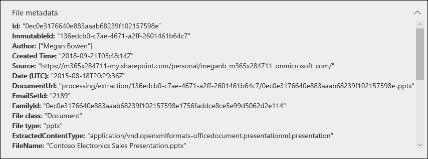

# 檢閱辨識項中的資料

資料調查中的證據集中的資料是您收集並新增至證據集之搜尋結果的快照。 當您將搜尋結果新增至證據時，會觸發處理常式，以從搜尋傳回的專案提取檔、中繼資料和文字。 然後，資料調查 (預覽) 工具會建立新的索引 (由稱為「 *高級索引* 」) 的所有資料，並新增至 [ **證據** ] 索引標籤上的證據集。 

針對時間敏感調查，這可讓您刪除位於原始資料來源中的實際濺入或惡意資料，同時也可讓您調查隔離環境中重新建立的證據，在此情況下，會將資料複製到證據集) 。 收集證據並將證據新增至證據集之後，您可以查看以原生格式、文字格式或原始格式的個別檔，以供您用來批註及密文的檔。 此外，您可以執行查詢來縮小資料集的時間範圍、檔案類型、資料擁有人，以及許多其他屬性和搜尋條件。 例如，使用作者、寄件者或收件者條件，您可以快速識別事件中涉及的人員，以及您的組織中是否有任何與外部使用者共用的資料。 如需搜尋證據集中資料的詳細資訊，請參閱 [查詢證據中的資料](evidence-query.md)。

若要群組檔並取得更多您的評論協助，請選取 [ **證據** ] 索引標籤上的證據集，然後按一下 [ **管理證據**]。 在 [ **分析** ] 磚中，按一下 **[重新建立整個集的分析**]。 這會執行高級分析，例如重複偵測、電子郵件執行緒及主題分析。 之後，您就可以查看資料的一般主題，也可以透過電子郵件執行緒、接近重複專案以及完全重複的方式來組織檔，以協助您進行調查。 如需詳細資訊，請參閱 [執行分析以更快速地進行調查](run-analytics-to-investigate-faster.md)。

## 在證據中查看檔

「資料調查」 (預覽) 工具可讓您在多個不同的檢視器中顯示內容，每個檢視器各有不同的用途。 這些檢視器包括：

- 檔中繼資料
- 原生視圖
- 文字視圖
- 批註視圖

若要存取這些檢視器，只要選取證據集中的檔。

## 檔中繼資料

這個視圖會顯示與選取檔相關聯的各種中繼資料屬性。 您可以按一下 [檔案 **中繼資料**] 開啟和關閉此視圖。 當您審閱檔時，您可以在不同的檢視器之間查看檔案中繼資料，但仍然可以變更。

以下是一份檔的檔案中繼資料範例。 如需元資料欄位的詳細資訊，請參閱 [資料調查中的檔元資料欄位 (預覽) ](document-metadata-fields.md)。

## 原生視圖

原生檢視器會以原生格式顯示檔的最準確的視圖。 數百種檔案類型支援原生模式，其可讓您以 truest 原生體驗顯示檔。 針對 Microsoft Office 檔案，原生檢視器會使用 web 版本的 Office 應用程式。 這可讓您在 Excel 中查看不同 Office 檔、公式和隱藏列/欄中的批註等內容，以及 PowerPoint 中的 [附注] 視圖。

## 文字視圖

文字檢視器提供檔的解壓縮文字的視圖。 它會忽略任何內嵌的圖像和格式設定，但是如果您嘗試快速查看並瞭解檔中的內容，此視圖會很有用。 文字視圖也包含下列功能：

  - 行計數器，可讓您更輕鬆地參考檔的特定部分。

  - 在檔中和捲軸上突出顯示字詞的搜尋順序醒目提示

  - 在使用 [ **臨近重複** ] 面板來查看檔時，比較視圖會提供比較視圖，以強調文字差異。

**文字和捲軸中的行計數器及搜尋順序醒目提示範例**

**Diff view 的範例**

## 批註視圖

[批註] 視圖提供的功能可讓您在審閱過程中對檔套用標記;這包括下列工具：

  - **區域密文** –您可以在隱藏敏感內容的檔中繪製不透明的方塊。

  - **鉛筆** –您可以在檔上自由手繪出內容的某些部分，以引起注意

  - **選取批註** -您可以選取及刪除檔中的批註。

  - **切換批註透明性** –您可以在不透明和半透明) 之間切換批註的透明度 (，以便您可以查看批註背後的內容。 這包括切換鉛筆批註和密文的透明度。

[批註] 視圖也提供下列導覽功能：

  - **上一頁**、 **下一頁**，然後移至多分頁檔使用的 **頁面** 導覽控制項。

  - **縮放** –以批註模式增加或減少檔案大小。

  - **旋轉** –順時針旋轉檔。

  - **搜尋** –搜尋檔中的關鍵字，然後使用 [上一個] 和 [下一步] 控制項，以查看檔中) 醒目提示 (的點擊順序。

**批註視圖的範例**

> [!NOTE]
> 將批註套用至已新增至證據集的檔副本。 Live service 中的原始檔案沒有批註。
