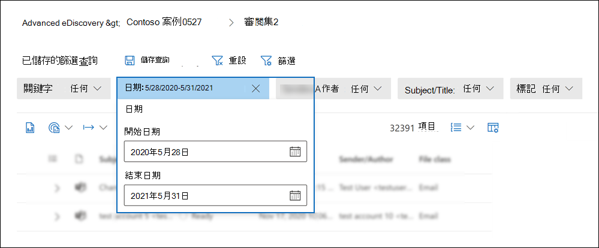
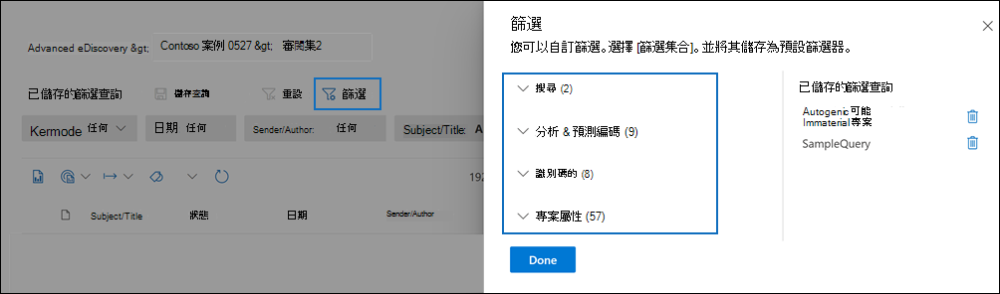
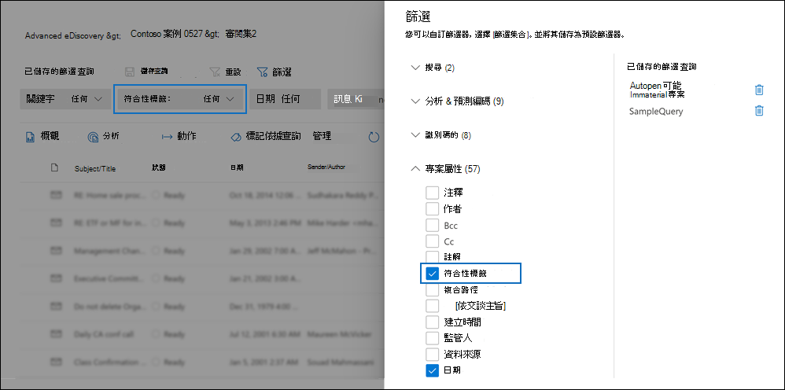
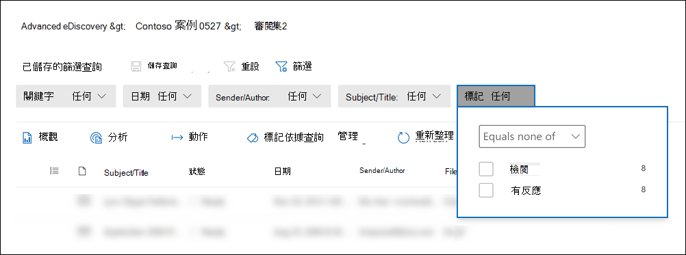
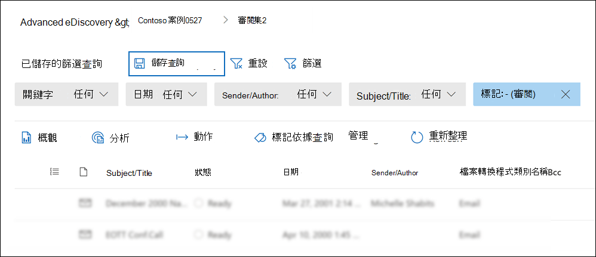
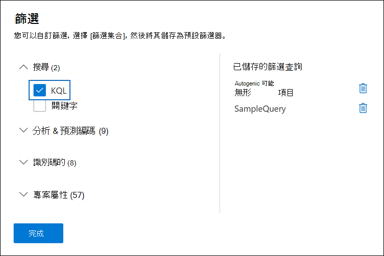
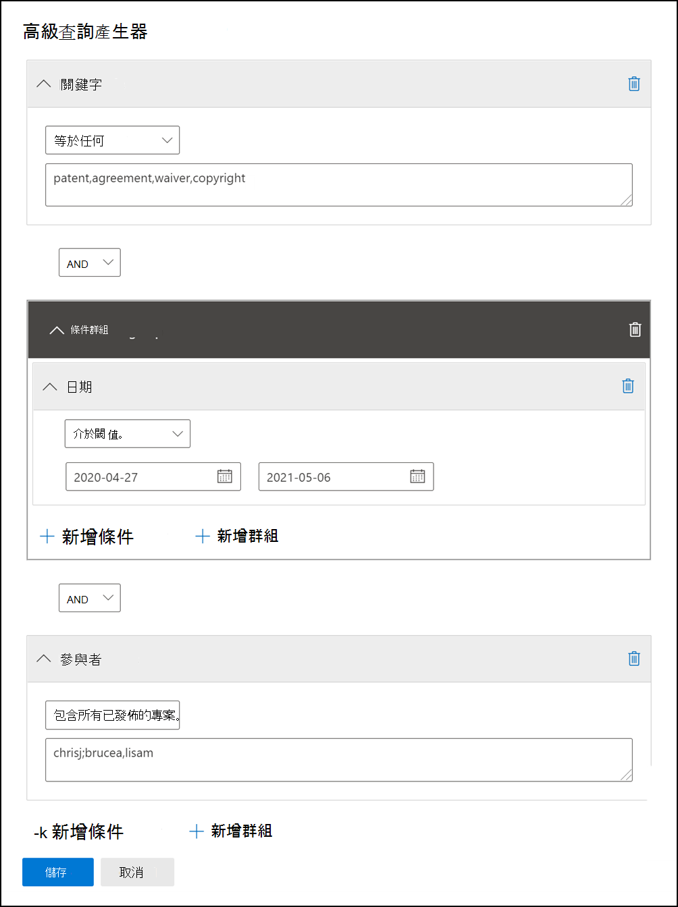

# 查詢和篩選檢閱集中的內容

在大多數情況下，深入查看審閱集合中的內容，並加以組織，以促進更有效率的審閱。 在審閱集中使用篩選和查詢可協助您將重點放在符合您的審閱準則的檔子集。

## 預設篩選器

在複查集中，審閱集內預先載入了五個預設篩選：

- 關鍵字
- 日期
- 寄件者/作者
- 主旨/職稱
- 標記

按一下每個篩選器以加以展開並指派值。 按一下篩選外部，以自動將篩選套用至審閱集。 下列螢幕擷取畫面顯示設定為在日期範圍內顯示檔的日期篩選器。

## 新增或移除篩選

若要新增或移除針對審閱集顯示的篩選，請選取 [ **篩選** ] 以開啟 [篩選器] 面板，它會顯示在飛入頁面上。 

可用的篩選分為四個區段：

- **搜尋**：提供不同搜尋功能的篩選器。

- **分析 & 預測編碼**：當您執行 **檔 & 的電子郵件分析** 工作或使用預測編碼模型時，所產生及新增至檔的篩選屬性。

- **IDs**：篩選檔的所有 ID 屬性。

- **專案屬性**：篩選檔案屬性。 

展開每個區段，並選取或取消選取篩選，以在篩選集中新增或移除篩選。 當您新增篩選時，它會顯示在 filter 集合中。 

> [!NOTE]
> 當您展開 [篩選] 面板中的區段時，您會注意到已選取預設的篩選類型。 您可以將它們保持選取或取消選取，並將它們從 filter 集合中移除。 

## 篩選類型

審閱集合中的每個可搜尋欄位都有對應的篩選，您可以根據特定欄位來篩選項目。

篩選器有多種類型：

- **Freetext**： freetext 濾鏡會套用至文字欄位，例如 "Subject"。 您可以將多個搜尋字詞以逗號分隔，以加以列出。

- **日期**：日期篩選器用於日期欄位（例如「上次修改日期」）。

- **搜尋選項**：「搜尋選項篩選」提供可能值的清單 (每個值都顯示一個核取方塊，您可以為審閱中的特定欄位選取) 。 此篩選器是用於欄位（例如 "Sender"），其中的審閱集中可能的值有有限的數目。

- **關鍵字**：關鍵字條件是 freetext 條件的特定實例，可供您用來搜尋字詞。 您也可以在此類型的篩選中使用類似 KQL 的查詢語言。 如需詳細資訊，請參閱本主題中的查詢語言和高級查詢產生器小節。

## 包含及排除篩選關係

您可以選擇變更特定篩選的 [包含] 和 [排除] 關聯。 例如，在標記篩選中，您可以在下拉式篩選中選取 [ **等於無** ]，以排除以特定標記標記的專案。 

## 將篩選儲存為查詢

當您對篩選器滿意後，您可以將篩選器組合儲存為篩選器查詢。 這可讓您在未來的審閱會話中套用篩選。

若要儲存篩選，請選取 **[儲存查詢** 並為其命名]。 您或其他檢閱者可以先選取 [ **已儲存的篩選查詢** ] 下拉式清單，然後選取要套用至審閱集檔的篩選器查詢，以執行先前儲存的篩選查詢。 

若要刪除篩選查詢，請開啟 [篩選] 面板，然後選取查詢旁的 [trashcan] 圖示。

## 查詢語言

除了使用篩選之外，您也可以在關鍵字篩選中使用 KQL 類似的查詢語言來建立您的複查集搜尋查詢。 「檢查的複查集」查詢語言支援標準 Boolean 運算子，例如 **and**、 **OR**、 **NOT** 和 **NEAR**。 它也支援單一字元萬用字元 (？ ) 和多字元萬用字元 ( * ) 。

## 高級查詢產生器

您也可以建立更高級的查詢來搜尋審閱集中的檔。

1. 開啟 [篩選] 面板，選取 [ **篩選**]，然後展開 [ **搜尋** ] 區段。

  

2. 選取 [ **KQL** ] 篩選器，然後按一下 [ **開啟查詢** 建立器]。

   在此面板中，您可以使用查詢建立器來建立複雜的 KQL 查詢。 您可以新增條件，也可以新增條件群組，這些群組是由以邏輯方式連接之多個條件所組成 **及** 或或 **或** 關聯。

   
