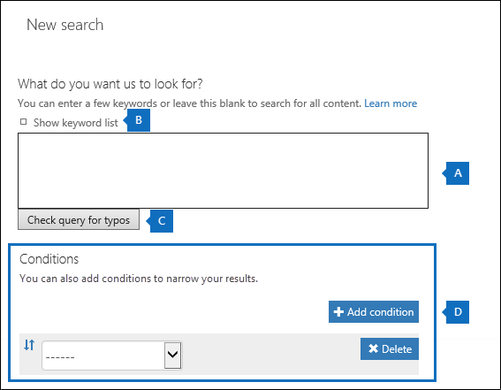
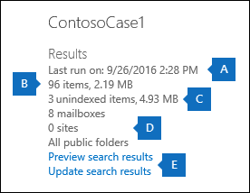
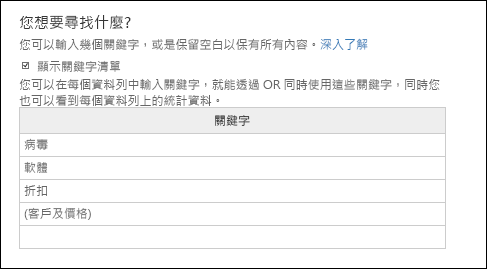
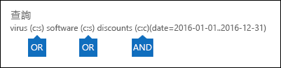

# <a name="run-a-content-search-in-the-security--compliance-center"></a><span data-ttu-id="368b1-103">在安全規範中心執行內容搜尋</span><span class="sxs-lookup"><span data-stu-id="368b1-103">Run a Content Search in the Security & Compliance Center</span></span>

<span data-ttu-id="368b1-104">您可以使用安全&合规性中心中的内容搜索电子数据展示工具在 Office 365 组织中搜索电子邮件、文档和即时消息对话等项目。</span><span class="sxs-lookup"><span data-stu-id="368b1-104">You can use the Content Search eDiscovery tool in the Security & Compliance Center to search for items such as email, documents, and instant messaging conversations in your Office 365 organization.</span></span> <span data-ttu-id="368b1-105">使用此工具可以搜索这些 Office 365 服务中的项目：</span><span class="sxs-lookup"><span data-stu-id="368b1-105">Use this tool to search for items in these Office 365 services:</span></span>
  
- <span data-ttu-id="368b1-106">交换联机邮箱和公用文件夹</span><span class="sxs-lookup"><span data-stu-id="368b1-106">Exchange Online mailboxes and public folders</span></span>
    
- <span data-ttu-id="368b1-107">适用于商业网站的共享点在线和 OneDrive</span><span class="sxs-lookup"><span data-stu-id="368b1-107">SharePoint Online and OneDrive for Business sites</span></span>
    
- <span data-ttu-id="368b1-108">业务对话的 Skype</span><span class="sxs-lookup"><span data-stu-id="368b1-108">Skype for Business conversations</span></span>
    
- <span data-ttu-id="368b1-109">Microsoft Teams</span><span class="sxs-lookup"><span data-stu-id="368b1-109">Microsoft Teams</span></span> 
    
- <span data-ttu-id="368b1-110">Office 365 群組</span><span class="sxs-lookup"><span data-stu-id="368b1-110">Office 365 Groups</span></span>
    
<span data-ttu-id="368b1-111">内容搜索是一种新的电子数据展示搜索工具，具有新的和改进的缩放和性能功能。</span><span class="sxs-lookup"><span data-stu-id="368b1-111">Content Search is a new eDiscovery search tool with new and improved scaling and performance capabilities.</span></span> <span data-ttu-id="368b1-112">使用「內容搜尋」執行極大型的 eDiscovery 搜尋。</span><span class="sxs-lookup"><span data-stu-id="368b1-112">Use Content Search to run very large eDiscovery searches.</span></span> <span data-ttu-id="368b1-113">您可以在单个内容搜索中搜索所有邮箱、所有 Exchange 公用文件夹以及所有 SharePoint 联机网站和企业帐户的 OneDrive。</span><span class="sxs-lookup"><span data-stu-id="368b1-113">You can search all mailboxes, all Exchange public folders, and all SharePoint Online sites and OneDrive for Business accounts in a single Content Search.</span></span> <span data-ttu-id="368b1-114">可以搜索的内容位置数量没有限制。</span><span class="sxs-lookup"><span data-stu-id="368b1-114">There are no limits on the number of content locations that you can search.</span></span> <span data-ttu-id="368b1-115">同時可以執行的搜尋數目也沒有限制。</span><span class="sxs-lookup"><span data-stu-id="368b1-115">There are also no limits on the number of searches that can run at the same time.</span></span> <span data-ttu-id="368b1-116">运行内容搜索后，内容位置数和预计搜索结果数将显示在**内容搜索**页上的详细信息窗格中。</span><span class="sxs-lookup"><span data-stu-id="368b1-116">After you run a Content Search, the number of content locations and an estimated number of search results are displayed in the details pane on the **Content search** page.</span></span> <span data-ttu-id="368b1-117">运行搜索后，您可以预览结果、获取一个或多个搜索的关键字统计信息、批量编辑内容搜索以及将结果导出到本地计算机。</span><span class="sxs-lookup"><span data-stu-id="368b1-117">After you run a search you can preview the results, get keyword statistics for one or more searches, bulk-edit content searches, and export the results to a local computer.</span></span> 
  
 <span data-ttu-id="368b1-118">**Contents**</span><span class="sxs-lookup"><span data-stu-id="368b1-118">**Contents**</span></span>
  
[<span data-ttu-id="368b1-119">Create a search</span><span class="sxs-lookup"><span data-stu-id="368b1-119">Create a search</span></span>](run-a-content-search-in-the-security-and-compliance-center.md#create)
  
[<span data-ttu-id="368b1-120">匯出搜尋結果</span><span class="sxs-lookup"><span data-stu-id="368b1-120">Export search results</span></span>](run-a-content-search-in-the-security-and-compliance-center.md#export)
  
[<span data-ttu-id="368b1-121">Preview search results</span><span class="sxs-lookup"><span data-stu-id="368b1-121">Preview search results</span></span>](run-a-content-search-in-the-security-and-compliance-center.md#preview)
  
[<span data-ttu-id="368b1-122">Update search results</span><span class="sxs-lookup"><span data-stu-id="368b1-122">Update search results</span></span>](run-a-content-search-in-the-security-and-compliance-center.md#restart)
  
[<span data-ttu-id="368b1-123">Edit a search</span><span class="sxs-lookup"><span data-stu-id="368b1-123">Edit a search</span></span>](run-a-content-search-in-the-security-and-compliance-center.md#edit)
  
[<span data-ttu-id="368b1-124">Retry a search</span><span class="sxs-lookup"><span data-stu-id="368b1-124">Retry a search</span></span>](run-a-content-search-in-the-security-and-compliance-center.md#retry)
  

  
## <a name="before-you-begin"></a><span data-ttu-id="368b1-125">開始之前</span><span class="sxs-lookup"><span data-stu-id="368b1-125">Before you begin</span></span>

- <span data-ttu-id="368b1-126">有关生成搜索查询和使用布尔搜索运算符的信息和指南，请参阅[关键字查询和内容搜索搜索条件。](keyword-queries-and-search-conditions.md)</span><span class="sxs-lookup"><span data-stu-id="368b1-126">For information and guidance about building search queries and using Boolean search operators, see [Keyword queries and search conditions for Content Search](keyword-queries-and-search-conditions.md).</span></span> <span data-ttu-id="368b1-127">本文还包含有关搜索敏感信息类型和搜索与组织内外人员共享的内容的信息。</span><span class="sxs-lookup"><span data-stu-id="368b1-127">This article also contains information about searching for sensitive information types and searching for content that's shared with people inside and outside of your organization.</span></span>
    
- <span data-ttu-id="368b1-128">要访问**内容搜索**页以执行搜索、预览和导出搜索结果，管理员、合规官或电子数据展示经理必须是安全&合规中心中的电子数据展示经理角色组的成员。</span><span class="sxs-lookup"><span data-stu-id="368b1-128">To have access to the **Content search** page to perform searches and preview and export search results, an administrator, compliance officer, or eDiscovery manager must be a member of the eDiscovery Manager role group in the Security & Compliance Center.</span></span> <span data-ttu-id="368b1-129">您不必在 Exchange 联机、共享点联机或针对商业网站的 OneDrive 中分配其他搜索权限。</span><span class="sxs-lookup"><span data-stu-id="368b1-129">You don't have to assign additional search permissions in Exchange Online, SharePoint Online, or for OneDrive for Business sites.</span></span> <span data-ttu-id="368b1-130">有关详细信息，请参阅在[Office 365 安全&合规性中心中分配电子数据展示权限](assign-ediscovery-permissions.md)。</span><span class="sxs-lookup"><span data-stu-id="368b1-130">For more information, see [Assign eDiscovery permissions in the Office‍ 365 Security & Compliance Center](assign-ediscovery-permissions.md).</span></span>
    
- <span data-ttu-id="368b1-131">对内容搜索应用了限制，以保持提供给 Office 365 组织的服务的运行状况和质量。</span><span class="sxs-lookup"><span data-stu-id="368b1-131">There are limits applied to Content Search to maintain the health and quality of services provided to Office 365 organizations.</span></span> <span data-ttu-id="368b1-132">在大部分情況下，您無法修改這些限制，但您應注意這些限制以在進行規劃、執行和疑難排解搜尋時將這些限制納入考量。</span><span class="sxs-lookup"><span data-stu-id="368b1-132">In most cases, you can't modify these limits, but you should be aware of them so that you can take these limits into consideration when planning, running, and troubleshooting searches.</span></span> <span data-ttu-id="368b1-133">有关详细信息，请参阅[安全&合规性中心中的搜索限制](limits-for-content-search.md)。</span><span class="sxs-lookup"><span data-stu-id="368b1-133">For more information, see [Limits for Search in the Security & Compliance Center](limits-for-content-search.md).</span></span>
    
- <span data-ttu-id="368b1-134">根据单个内容搜索中搜索的邮箱数，请参阅该部分，了解估计搜索时间。</span><span class="sxs-lookup"><span data-stu-id="368b1-134">See the  section for estimated search times based on the number of mailboxes that are searched in a single Content Search.</span></span> 
    
- <span data-ttu-id="368b1-135">如前所述，您可以使用内容搜索在 Office 365 组和 Microsoft 团队中搜索内容。</span><span class="sxs-lookup"><span data-stu-id="368b1-135">As previously stated, you can use Content Search to search for content in Office 365 Groups and Microsoft Teams.</span></span> <span data-ttu-id="368b1-136">这意味着您可以搜索与 Office 365 组和 Microsoft 团队关联的组邮箱、共享日历和 SharePoint 网站。</span><span class="sxs-lookup"><span data-stu-id="368b1-136">This means you can search the group mailbox, shared calendar, and SharePoint sites associated with an Office 365 Group and a Microsoft Team.</span></span> <span data-ttu-id="368b1-137">此外，您还可以在 Microsoft 团队中搜索频道对话。</span><span class="sxs-lookup"><span data-stu-id="368b1-137">Additionally, you can search the channel conversations in a Microsoft Team.</span></span> <span data-ttu-id="368b1-138">有关 Office 365 组和 Microsoft 团队的信息，请参阅：</span><span class="sxs-lookup"><span data-stu-id="368b1-138">For information about Office 365 Groups and Microsoft Teams, see:</span></span>
    
  - [<span data-ttu-id="368b1-139">了解 Office 365 组</span><span class="sxs-lookup"><span data-stu-id="368b1-139">Learn about Office 365 groups</span></span>](https://support.office.com/article/b565caa1-5c40-40ef-9915-60fdb2d97fa2)
    
  - [<span data-ttu-id="368b1-140">微软团队帮助</span><span class="sxs-lookup"><span data-stu-id="368b1-140">Microsoft Teams help</span></span>](https://support.office.com/article/23156c0c-2c6e-49dd-8b7b-7c564b76508c)
    
    <span data-ttu-id="368b1-141">有关在 Office 365 组和 Microsoft 团队中搜索内容的提示，请参阅部分。</span><span class="sxs-lookup"><span data-stu-id="368b1-141">See the  section for tips on searching for content in Office 365 Groups and Microsoft Teams.</span></span> 
    
[<span data-ttu-id="368b1-142">回到頁首</span><span class="sxs-lookup"><span data-stu-id="368b1-142">Return to top</span></span>](run-a-content-search-in-the-security-and-compliance-center.md#top)
  
## <a name="create-a-search"></a><span data-ttu-id="368b1-143">Create a search</span><span class="sxs-lookup"><span data-stu-id="368b1-143">Create a search</span></span>
<span data-ttu-id="368b1-144"><a name="create"> </a></span><span class="sxs-lookup"><span data-stu-id="368b1-144"></span></span>

1. <span data-ttu-id="368b1-145">移至 [https://protection.office.com](https://protection.office.com)。</span><span class="sxs-lookup"><span data-stu-id="368b1-145">Go to [https://protection.office.com](https://protection.office.com).</span></span>
    
2. <span data-ttu-id="368b1-146">使用公司或學校帳戶登入 Office 365。</span><span class="sxs-lookup"><span data-stu-id="368b1-146">Sign in to Office 365 using your work or school account.</span></span>
    
3. <span data-ttu-id="368b1-147">在"安全&合规性中心"的左侧窗格中，\*\*\*\*\>单击"**搜索内容搜索"。**</span><span class="sxs-lookup"><span data-stu-id="368b1-147">In the left pane of the Security & Compliance Center, click **Search** \> **Content search**.</span></span>
    
4. <span data-ttu-id="368b1-148">**单击"新建"**。</span><span class="sxs-lookup"><span data-stu-id="368b1-148">Click **New**.</span></span>
    
5. <span data-ttu-id="368b1-149">在 [新增搜尋]\*\*\*\* 頁面上，輸入內容搜尋的名稱。</span><span class="sxs-lookup"><span data-stu-id="368b1-149">On the **New search** page, type a name for the Content Search.</span></span> <span data-ttu-id="368b1-150">此名稱在您的組織中必須是唯一的。</span><span class="sxs-lookup"><span data-stu-id="368b1-150">This name has to be unique in your organization.</span></span> 
    
6. <span data-ttu-id="368b1-151">选择要搜索的内容位置。</span><span class="sxs-lookup"><span data-stu-id="368b1-151">Choose the content locations that you want to search.</span></span> <span data-ttu-id="368b1-152">您可以在同一搜索中搜索邮箱、网站和公用文件夹。</span><span class="sxs-lookup"><span data-stu-id="368b1-152">You can search mailboxes, sites, and public folders in the same search.</span></span>
    
    
  
1. <span data-ttu-id="368b1-154">**随处搜索**选择此选项可搜索组织中的所有内容位置。</span><span class="sxs-lookup"><span data-stu-id="368b1-154">**Search everywhere**Select this option to search all content locations in your organization.</span></span> <span data-ttu-id="368b1-155">选择此选项时，您可以选择搜索所有邮箱（包括非活动邮箱和所有 Office 365 组和 Microsoft 团队的邮箱）、所有 SharePoint 和一个业务站点的 OneDrive（包括所有 Office 365 组和微软团队），以及所有公用文件夹。</span><span class="sxs-lookup"><span data-stu-id="368b1-155">When you select this option, you can choose to search all mailboxes (including inactive mailboxes and the mailboxes for all Office 365 Groups and Microsoft Teams), all SharePoint and OneDrive for Business sites (which includes the sites for all Office 365 groups and Microsoft Teams), and all public folders.</span></span>
    
    
  
2. <span data-ttu-id="368b1-157">**自定义位置选择**选择此选项可选择要搜索的邮箱和网站。</span><span class="sxs-lookup"><span data-stu-id="368b1-157">**Custom location selection**Select this option to select the mailboxes and sites that you want to search.</span></span> <span data-ttu-id="368b1-158">如果选择此选项，则可以灵活地搜索特定服务的所有内容位置（如搜索所有 Exchange 邮箱），也可以搜索 Office 365 服务的特定内容位置。</span><span class="sxs-lookup"><span data-stu-id="368b1-158">If you choose this option, you have flexibility to search all content locations for a specific service (such as searching all Exchange mailboxes) or you can search specific content locations for an Office 365 service.</span></span>
    
    <span data-ttu-id="368b1-159">在添加要搜索的内容位置时，请记住以下事项：</span><span class="sxs-lookup"><span data-stu-id="368b1-159">Keep the following in mind when adding content locations to search:</span></span>
    
    <span data-ttu-id="368b1-160">**信箱**</span><span class="sxs-lookup"><span data-stu-id="368b1-160">**Mailboxes**</span></span>
    
  - <span data-ttu-id="368b1-161">当您**单击"添加**以指定要搜索的邮箱时，显示的邮箱选取器为空。</span><span class="sxs-lookup"><span data-stu-id="368b1-161">When you click **Add** to specify mailboxes to search, the mailbox picker that's displayed is empty.</span></span> <span data-ttu-id="368b1-162">這項設計的目的是提升效能。</span><span class="sxs-lookup"><span data-stu-id="368b1-162">This is by design to enhance performance.</span></span> <span data-ttu-id="368b1-163">要将收件人添加到此列表，请在搜索框中键入名称（至少 3 个字符），然后单击"**搜索**。</span><span class="sxs-lookup"><span data-stu-id="368b1-163">To add recipients to this list, type a name (a minimum of 3 characters) in the search box and click **Search**.</span></span>
    
  - <span data-ttu-id="368b1-164">您可以将非活动邮箱和通讯组添加到要搜索的邮箱列表中。</span><span class="sxs-lookup"><span data-stu-id="368b1-164">You can add inactive mailboxes and distribution groups to the list of mailboxes to search.</span></span> <span data-ttu-id="368b1-165">对于通讯组，将搜索组成员的邮箱。</span><span class="sxs-lookup"><span data-stu-id="368b1-165">For distribution groups, the mailboxes of group members are searched.</span></span> <span data-ttu-id="368b1-166">请注意，不支持动态通讯组。</span><span class="sxs-lookup"><span data-stu-id="368b1-166">Note that dynamic distribution groups aren't supported.</span></span>
    
  - <span data-ttu-id="368b1-167">要获取组织中非活动邮箱的列表，请运行 Exchange 联机 PowerShell`Get-Mailbox -InactiveMailboxOnly`中的命令。</span><span class="sxs-lookup"><span data-stu-id="368b1-167">To get a list of the inactive mailboxes in your organization, run the command  `Get-Mailbox -InactiveMailboxOnly` in Exchange Online PowerShell.</span></span> <span data-ttu-id="368b1-168">或者，您可以转到安全&合规性中心**中的数据治理**\>**保留，\*\*\*\*然后单击"更多**\>**栏"省略号非活动邮箱**。</span><span class="sxs-lookup"><span data-stu-id="368b1-168">Alternatively, you can go to **Data governance** \> **Retention** in the Security & Compliance Center, and then click **More** \> **Inactive mailboxes**.</span></span>
    
  - <span data-ttu-id="368b1-169">您还可以添加与 Office 365 组或 Microsoft 团队关联的邮箱。</span><span class="sxs-lookup"><span data-stu-id="368b1-169">You can also add the mailbox that's associated with an Office 365 Group or a Microsoft Team.</span></span> <span data-ttu-id="368b1-170">在这种情况下，仅搜索组或团队邮箱;否则，将搜索组或团队邮箱。不搜索组或团队成员的邮箱。</span><span class="sxs-lookup"><span data-stu-id="368b1-170">In this case, only the group or team mailbox is searched; the mailboxes of the group or team members aren't searched.</span></span> <span data-ttu-id="368b1-171">要搜索它们，您必须专门将它们添加到搜索中。</span><span class="sxs-lookup"><span data-stu-id="368b1-171">To search them, you have to specifically add them to the search.</span></span>
    
  - <span data-ttu-id="368b1-172">如果不想将任何邮箱包含在搜索中，请选择**选择要搜索的特定邮箱，** 但不要将邮箱添加到列表中。</span><span class="sxs-lookup"><span data-stu-id="368b1-172">If you don't want to include any mailboxes to the search, select **Choose specific mailboxes to search**, but don't add a mailbox to the list.</span></span>
    
    <span data-ttu-id="368b1-173">**網站**</span><span class="sxs-lookup"><span data-stu-id="368b1-173">**Sites**</span></span>
    
  - <span data-ttu-id="368b1-174">**单击"添加**将网站添加到搜索中。</span><span class="sxs-lookup"><span data-stu-id="368b1-174">Click **Add** to add sites to the search.</span></span> <span data-ttu-id="368b1-175">键入要搜索的每个网站的 URL。</span><span class="sxs-lookup"><span data-stu-id="368b1-175">Type the URL for each site that you want to search.</span></span> <span data-ttu-id="368b1-176">内容搜索工具将验证 URL，然后将其添加到要搜索的网站列表中。</span><span class="sxs-lookup"><span data-stu-id="368b1-176">The Content Search tool will validate the URL, and then add it to the list of sites to search.</span></span> 
    
  - <span data-ttu-id="368b1-177">您可以添加与 Office 365 组或 Microsoft 团队关联的 SharePoint。</span><span class="sxs-lookup"><span data-stu-id="368b1-177">You can add the SharePoint that's associated with an Office 365 Group or a Microsoft Team.</span></span> <span data-ttu-id="368b1-178">有关如何查找组或团队的 URL 的指南，请参阅部分。</span><span class="sxs-lookup"><span data-stu-id="368b1-178">See the  section for guidance about how to find the URL for group or team.</span></span> 
    
  - <span data-ttu-id="368b1-179">如果不想在搜索中包含任何网站，**请选择"选择要搜索的特定网站"，** 但不要将网站添加到列表中。</span><span class="sxs-lookup"><span data-stu-id="368b1-179">If you don't want to include any sites in a search, select **Choose specific sites to search**, but don't add a site to the list.</span></span>
    
    <span data-ttu-id="368b1-180">**公用資料夾**</span><span class="sxs-lookup"><span data-stu-id="368b1-180">**Public folders**</span></span>
    
    <span data-ttu-id="368b1-181">对于公用文件夹，您可以选择搜索 Exchange Online 组织中的所有公用文件夹，也可以不搜索任何公用文件夹。</span><span class="sxs-lookup"><span data-stu-id="368b1-181">For public folders, you can choose to search all public folders in your Exchange Online organization or not search any public folders.</span></span>
    
7. <span data-ttu-id="368b1-182">按 [下一步]\*\*\*\*。</span><span class="sxs-lookup"><span data-stu-id="368b1-182">Click **Next**.</span></span>
    
8. <span data-ttu-id="368b1-183">在 [新搜尋]\*\*\*\* 頁面上，您可以新增關鍵字和條件來建立搜尋查詢。</span><span class="sxs-lookup"><span data-stu-id="368b1-183">On the **New search** page, you can add keywords and conditions to create the search query.</span></span> 
    
    
  
1. <span data-ttu-id="368b1-185">在 [您希望我們尋找什麼?]\*\*\*\* 下方的方塊，在方塊中輸入搜尋查詢。</span><span class="sxs-lookup"><span data-stu-id="368b1-185">In the box under **What do you want us to look for?**, type a search query in the box.</span></span> <span data-ttu-id="368b1-186">您可以指定關鍵字、例如傳送和接收日期的郵件屬性，或者例如檔案名稱或文件上次變更的日期的文件屬性。</span><span class="sxs-lookup"><span data-stu-id="368b1-186">You can specify keywords, message properties such as sent and received dates, or document properties such as file names or the date that a document was last changed.</span></span> <span data-ttu-id="368b1-187">您可以使用使用布尔运算符的更复杂的\*\*\*\* 查询，例如\*\*\*\* AND、OR、NEAR 或**ONEAR** \*\*\*\*。 \*\*\*\*</span><span class="sxs-lookup"><span data-stu-id="368b1-187">You can use a more complex queries that use a Boolean operator, such as **AND**, **OR**, **NOT**, **NEAR**, or **ONEAR**.</span></span> <span data-ttu-id="368b1-188">您还可以在文档中搜索敏感信息（如社会保险号），或搜索外部共享的文档。</span><span class="sxs-lookup"><span data-stu-id="368b1-188">You can also search for sensitive information (such as social security numbers) in documents, or search for documents that have been shared externally.</span></span> <span data-ttu-id="368b1-189">如果关键字框为空，则位于指定内容位置的所有内容都将包含在搜索结果中。</span><span class="sxs-lookup"><span data-stu-id="368b1-189">If you leave the keyword box empty, all content located in the specified content locations will be included in the search results.</span></span> 
    
2. <span data-ttu-id="368b1-190">您可以**单击"显示关键字列表"** 复选框，并在每行中键入关键字。</span><span class="sxs-lookup"><span data-stu-id="368b1-190">You can click the **Show keyword list** checkbox and the type a keyword in each row.</span></span> <span data-ttu-id="368b1-191">如果这样做，则每行上的关键字由所创建的搜索查询中的**OR**运算符连接。</span><span class="sxs-lookup"><span data-stu-id="368b1-191">If you do this, the keywords on each row are connected by the **OR** operator in the search query that's created.</span></span> 
    
    
  
    <span data-ttu-id="368b1-193">为什么要使用关键字列表？</span><span class="sxs-lookup"><span data-stu-id="368b1-193">Why use the keyword list?</span></span> <span data-ttu-id="368b1-194">您可以获取显示每个关键字匹配的项目数的统计信息。</span><span class="sxs-lookup"><span data-stu-id="368b1-194">You can get statistics that show how many items match each keyword.</span></span> <span data-ttu-id="368b1-195">这可以帮助您快速确定哪些关键字最有效（也是最不有效）。</span><span class="sxs-lookup"><span data-stu-id="368b1-195">This can help you quickly identify which keywords are the most (and least) effective.</span></span> <span data-ttu-id="368b1-196">您还可以在一行中使用关键字短语（用括号括起来）。</span><span class="sxs-lookup"><span data-stu-id="368b1-196">You can also use a keyword phrase (surrounded by parentheses) in a row.</span></span> <span data-ttu-id="368b1-197">有关搜索统计信息的详细信息，请参阅[查看内容搜索结果的关键字统计信息。](view-keyword-statistics-for-content-search.md)</span><span class="sxs-lookup"><span data-stu-id="368b1-197">For more information about search statistics, see [View keyword statistics for Content Search results](view-keyword-statistics-for-content-search.md).</span></span>
    
    <span data-ttu-id="368b1-198">有关使用关键字列表的指南，请参阅部分。</span><span class="sxs-lookup"><span data-stu-id="368b1-198">See the  section for guidance on using the keyword list.</span></span> 
    
3. <span data-ttu-id="368b1-199">**单击"检查错误拼写错误查询"** 以检查查询是否不支持的字符以及可能未大写布尔运算符的查询。</span><span class="sxs-lookup"><span data-stu-id="368b1-199">Click **Check query for typos** to check your query for unsupported characters and for Boolean operators that might not be capitalized.</span></span> <span data-ttu-id="368b1-200">不支持的字符通常被隐藏，并且通常会导致搜索错误或返回意外的结果。</span><span class="sxs-lookup"><span data-stu-id="368b1-200">Unsupported characters are often hidden and typically cause a search error or return unintended results.</span></span> <span data-ttu-id="368b1-201">有关选中的不支持的字符的详细信息，请参阅[检查内容搜索查询是否存在错误。](check-your-content-search-query-for-errors.md)</span><span class="sxs-lookup"><span data-stu-id="368b1-201">For more information about the unsupported characters that are checked, see [Check your Content Search query for errors](check-your-content-search-query-for-errors.md).</span></span>
    
4. <span data-ttu-id="368b1-202">**在"条件"** 下，向搜索查询添加条件以缩小搜索范围并返回更精细的结果集。</span><span class="sxs-lookup"><span data-stu-id="368b1-202">Under **Conditions**, add conditions to a search query to narrow a search and return a more refined set of results.</span></span> <span data-ttu-id="368b1-203">每個條件會將一個子句新增至 KQL 搜尋查詢，當您啟動搜尋時便會建立並執行。</span><span class="sxs-lookup"><span data-stu-id="368b1-203">Each condition adds a clause to the KQL search query that is created and run when you start the search.</span></span> <span data-ttu-id="368b1-204">條件會以 **AND** 運算子的邏輯方式連接至關鍵字查詢 (在關鍵字方塊中指定)。</span><span class="sxs-lookup"><span data-stu-id="368b1-204">A condition is logically connected to the keyword query (specified in the keyword box) by the **AND** operator.</span></span> <span data-ttu-id="368b1-205">這表示結果中包含的項目必須同時滿足關鍵字查詢與條件。</span><span class="sxs-lookup"><span data-stu-id="368b1-205">That means that items have to satisfy both the keyword query and the condition to be included in the results.</span></span> <span data-ttu-id="368b1-206">這就是條件如何協助您縮小搜尋結果。</span><span class="sxs-lookup"><span data-stu-id="368b1-206">This is how conditions help to narrow your results.</span></span> 
    
||
|:-----|
|<span data-ttu-id="368b1-207">有关创建搜索查询和使用条件的详细信息，请参阅[关键字查询和内容搜索的搜索条件。 ](keyword-queries-and-search-conditions.md)</span><span class="sxs-lookup"><span data-stu-id="368b1-207">For more information about creating a search query and using conditions, see [Keyword queries and search conditions for Content Search ](keyword-queries-and-search-conditions.md).</span></span> |
   
9. <span data-ttu-id="368b1-208">按一下 [搜尋]\*\*\*\* 以儲存搜尋設定並開始搜尋。</span><span class="sxs-lookup"><span data-stu-id="368b1-208">Click **Search** to save the search settings and start the search.</span></span> 
    
    <span data-ttu-id="368b1-209">已啟動搜尋。</span><span class="sxs-lookup"><span data-stu-id="368b1-209">The search is started.</span></span> <span data-ttu-id="368b1-210">搜索完成后，详细信息窗格中将显示以下信息。</span><span class="sxs-lookup"><span data-stu-id="368b1-210">When the search is completed, the following information is displayed in the details pane.</span></span>
    
    
  
1. <span data-ttu-id="368b1-212">上次运行搜索的日期和时间。</span><span class="sxs-lookup"><span data-stu-id="368b1-212">The date and time that the search was last run.</span></span>
    
2. <span data-ttu-id="368b1-213">找到与搜索查询匹配的项目的数量（和总大小）。</span><span class="sxs-lookup"><span data-stu-id="368b1-213">The number (and total size) of items that were found that matched the search query.</span></span> <span data-ttu-id="368b1-214">项目类型的示例包括电子邮件、日历项目和文档。</span><span class="sxs-lookup"><span data-stu-id="368b1-214">Examples of item types include email messages, calendar items, and documents.</span></span> <span data-ttu-id="368b1-215">如果项目包含正在搜索的关键字的多个实例，则仅在项目总数中计数一次。</span><span class="sxs-lookup"><span data-stu-id="368b1-215">If an item contains multiple instances of a keyword that is being searched for, it's only counted once in the total number of items.</span></span> <span data-ttu-id="368b1-216">例如，如果您搜索单词"股票"或"提示"，并且电子邮件包含单词"stock"的三个实例，则**在"项目"** 字段中只计算一次。</span><span class="sxs-lookup"><span data-stu-id="368b1-216">For example, if you're searching for words "stock" or "tip" and an email message contains three instances of the word "stock", it's only counted once in the **Items** field.</span></span> 
    
3. <span data-ttu-id="368b1-217">搜索的内容位置中未编制索引的项目的数量和总大小。</span><span class="sxs-lookup"><span data-stu-id="368b1-217">The number and total size of unindexed items in the content locations that were searched.</span></span> <span data-ttu-id="368b1-218">不符合搜尋準則的未建立索引的項目數會包含在詳細資料窗格中顯示的搜尋統計資料。</span><span class="sxs-lookup"><span data-stu-id="368b1-218">The number of unindexed items that don't meet the search criteria will be included in the search statistics displayed in the details pane.</span></span> <span data-ttu-id="368b1-219">如果未编制索引的项目与搜索查询匹配（因为其他消息或文档属性满足搜索条件），则该项将不会包含在未编制索引的项目的估计数量中。</span><span class="sxs-lookup"><span data-stu-id="368b1-219">If an unindexed item matches the search query (because other message or document properties meet the search criteria), it won't be included in the estimated number of unindexed items.</span></span> <span data-ttu-id="368b1-220">但是，如果搜索条件排除了未编制索引的项目，则该项将不会包含在未编制索引的项目的估计值中。</span><span class="sxs-lookup"><span data-stu-id="368b1-220">However, if an unindexed item is excluded by the search criteria, it won't be included in the estimate of unindexed items.</span></span>
    
4. <span data-ttu-id="368b1-221">搜索的每种内容位置类型的编号。</span><span class="sxs-lookup"><span data-stu-id="368b1-221">The number of each type of content location that was searched.</span></span> <span data-ttu-id="368b1-222">对于邮箱，请注意，存档邮箱包含在搜索的邮箱总数中。</span><span class="sxs-lookup"><span data-stu-id="368b1-222">For mailboxes, note that archive mailboxes are included in the total number of mailboxes that were searched.</span></span> <span data-ttu-id="368b1-223">在前面的示例中，搜索了四个用户邮箱，并启用了每个用户的存档邮箱。</span><span class="sxs-lookup"><span data-stu-id="368b1-223">In the previous example, four user mailboxes were searched and the archive mailbox for each of these users is enabled.</span></span> <span data-ttu-id="368b1-224">这就是为什么搜索统计信息中引用了八个邮箱的原因。</span><span class="sxs-lookup"><span data-stu-id="368b1-224">That's why eight mailboxes are cited in the search statistics.</span></span>
    
5. <span data-ttu-id="368b1-225">用于预览搜索结果或再次运行搜索以更新搜索统计信息的链接。</span><span class="sxs-lookup"><span data-stu-id="368b1-225">Links to preview the search results or run the search again to update the search statistics.</span></span>
    
    <span data-ttu-id="368b1-226">如有必要，**单击"刷新**图标以更新所选搜索的详细信息窗格中的信息。</span><span class="sxs-lookup"><span data-stu-id="368b1-226">If necessary, click **Refresh** to update the information in the details pane for the selected search.</span></span> 
    
[<span data-ttu-id="368b1-227">Return to top</span><span class="sxs-lookup"><span data-stu-id="368b1-227">Return to top</span></span>](run-a-content-search-in-the-security-and-compliance-center.md#top)
  
## <a name="export-search-results"></a><span data-ttu-id="368b1-228">匯出搜尋結果</span><span class="sxs-lookup"><span data-stu-id="368b1-228">Export search results</span></span>
<span data-ttu-id="368b1-229"><a name="export"> </a></span><span class="sxs-lookup"><span data-stu-id="368b1-229"></span></span>

<span data-ttu-id="368b1-230">成功运行搜索后，可以将搜索结果导出到本地计算机。</span><span class="sxs-lookup"><span data-stu-id="368b1-230">After a search is successfully run, you can export the search results to a local computer.</span></span> <span data-ttu-id="368b1-231">當您匯出電子郵件結果時，其會以 PST 檔案下載到您的電腦。</span><span class="sxs-lookup"><span data-stu-id="368b1-231">When you export email results, they're downloaded to your computer as PST files.</span></span> <span data-ttu-id="368b1-232">当您从 SharePoint 和 OneDrive 导出业务网站的内容时，将导出本机 Office 文档的副本。</span><span class="sxs-lookup"><span data-stu-id="368b1-232">When you export content from SharePoint and OneDrive for Business sites, copies of native Office documents are exported.</span></span> <span data-ttu-id="368b1-233">匯出的搜尋結果中另外還有其他文件和報告。</span><span class="sxs-lookup"><span data-stu-id="368b1-233">There are also additional documents and reports that are included with the exported search results.</span></span> <span data-ttu-id="368b1-234">有关详细信息，请参阅[从安全&合规性中心导出搜索结果。](export-search-results.md)</span><span class="sxs-lookup"><span data-stu-id="368b1-234">For more information, see [Export search results from the Security & Compliance Center](export-search-results.md).</span></span>
  
## <a name="preview-search-results"></a><span data-ttu-id="368b1-235">預覽搜尋結果</span><span class="sxs-lookup"><span data-stu-id="368b1-235">Preview search results</span></span>
<span data-ttu-id="368b1-236"><a name="preview"> </a></span><span class="sxs-lookup"><span data-stu-id="368b1-236"></span></span>

<span data-ttu-id="368b1-237">成功完成搜尋之後，您可以預覽搜尋結果。</span><span class="sxs-lookup"><span data-stu-id="368b1-237">After a search is successfully completed, you can preview the search results.</span></span> <span data-ttu-id="368b1-238">關於預覽內容搜尋結果有一些限制。</span><span class="sxs-lookup"><span data-stu-id="368b1-238">There are a number of limits related to previewing Content Search results.</span></span> <span data-ttu-id="368b1-239">有关详细信息，请参阅[安全&合规性中心中的搜索限制](limits-for-content-search.md)。</span><span class="sxs-lookup"><span data-stu-id="368b1-239">For more information, see [Limits for Search in the Security & Compliance Center](limits-for-content-search.md).</span></span> <span data-ttu-id="368b1-240">请注意，未编制索引的项目无法预览。</span><span class="sxs-lookup"><span data-stu-id="368b1-240">Note that unindexed items aren't available for previewing.</span></span>
  
1. <span data-ttu-id="368b1-241">在"**内容"搜索**页上，选择搜索。</span><span class="sxs-lookup"><span data-stu-id="368b1-241">On the **Content search** page, select a search.</span></span> 
    
2. <span data-ttu-id="368b1-p128">在詳細資料窗格中的 [結果]\*\*\*\* 底下，按一下 [預覽搜尋結果]\*\*\*\*。[預覽搜尋結果]\*\*\*\* 頁面隨即開啟，並且包含搜尋結果項目的清單。</span><span class="sxs-lookup"><span data-stu-id="368b1-p128">In the details pane, under **Results**, click **Preview search results**. The **Preview search results** page opens, and contains a list of the search result items.</span></span> 
    
    <span data-ttu-id="368b1-244">可以单击列标题，根据主题、类型、发件人或项目在源邮箱中收到日期对结果进行排序。</span><span class="sxs-lookup"><span data-stu-id="368b1-244">You can click a column header to sort the results based on subject, type, sender, or the date an item was received in the source mailbox.</span></span>
    
3. <span data-ttu-id="368b1-245">单击要预览的项目。</span><span class="sxs-lookup"><span data-stu-id="368b1-245">Click an item to preview.</span></span>
    
    <span data-ttu-id="368b1-246">项目在预览窗格中打开。</span><span class="sxs-lookup"><span data-stu-id="368b1-246">The item is opened in the preview pane.</span></span>
    
4. <span data-ttu-id="368b1-247">如果预览或下载文档副本不支持文件类型，则可以**单击"下载原始文件"** 将其下载到本地计算机。</span><span class="sxs-lookup"><span data-stu-id="368b1-247">If a file type isn't supported for preview or to download a copy of a document, you can click **Download original file** to download it to your local computer.</span></span> <span data-ttu-id="368b1-248">对于 .aspx 网页，包含该页的 URL，尽管您可能没有访问该页面的权限。</span><span class="sxs-lookup"><span data-stu-id="368b1-248">For .aspx Web pages, the URL for the page is included though you might not have permissions to access the page.</span></span> 
    
> [!NOTE]
> <span data-ttu-id="368b1-249">如果您預覽 7 天之前所執行之搜尋的搜尋結果，系統會提示您更新搜尋結果。</span><span class="sxs-lookup"><span data-stu-id="368b1-249">If you preview the search results for a search that was last run more than 7 days ago, you will be prompted to update the search results.</span></span> <span data-ttu-id="368b1-250">重新运行搜索以获取满足搜索查询的最新版本。</span><span class="sxs-lookup"><span data-stu-id="368b1-250">The search is rerun to get the most current results that meet the search query.</span></span> 
  
### <a name="file-types-that-can-be-previewed"></a><span data-ttu-id="368b1-251">可预览的文件类型</span><span class="sxs-lookup"><span data-stu-id="368b1-251">File types that can be previewed</span></span>

<span data-ttu-id="368b1-252">您可以在预览窗格中预览支持的文件类型。</span><span class="sxs-lookup"><span data-stu-id="368b1-252">You can preview supported file types in the preview pane.</span></span> <span data-ttu-id="368b1-253">如果文件类型不受支持，您必须将文件的副本下载到本地计算机才能查看。</span><span class="sxs-lookup"><span data-stu-id="368b1-253">If a file type isn't supported, you'll have to download a copy of the file to your local computer to view it.</span></span> <span data-ttu-id="368b1-254">支持以下文件类型，**可在"预览搜索结果"** 页上预览。</span><span class="sxs-lookup"><span data-stu-id="368b1-254">The following file types are supported and can be previewed on the **Preview search results** page.</span></span> 
  
- <span data-ttu-id="368b1-255">.txt， .html， .mhtml</span><span class="sxs-lookup"><span data-stu-id="368b1-255">.txt, .html, .mhtml</span></span>
    
- <span data-ttu-id="368b1-256">.eml</span><span class="sxs-lookup"><span data-stu-id="368b1-256">.eml</span></span>
    
- <span data-ttu-id="368b1-257">.doc， .docx， .docm</span><span class="sxs-lookup"><span data-stu-id="368b1-257">.doc, .docx, .docm</span></span>
    
- <span data-ttu-id="368b1-258">.pptm， .pptx</span><span class="sxs-lookup"><span data-stu-id="368b1-258">.pptm, .pptx</span></span>
    
- <span data-ttu-id="368b1-259">.pdf</span><span class="sxs-lookup"><span data-stu-id="368b1-259">.pdf</span></span>
    
<span data-ttu-id="368b1-260">此外，还支持以下文件容器类型。</span><span class="sxs-lookup"><span data-stu-id="368b1-260">Additionally, the following file container types are supported.</span></span> <span data-ttu-id="368b1-261">您可以在预览窗格中查看容器中的文件列表。</span><span class="sxs-lookup"><span data-stu-id="368b1-261">You can view the list of files in the container in the preview pane.</span></span>
  
- <span data-ttu-id="368b1-262">.zip</span><span class="sxs-lookup"><span data-stu-id="368b1-262">.zip</span></span>
    
- <span data-ttu-id="368b1-263">.gzip</span><span class="sxs-lookup"><span data-stu-id="368b1-263">.gzip</span></span>
    
[<span data-ttu-id="368b1-264">回到頁首</span><span class="sxs-lookup"><span data-stu-id="368b1-264">Return to top</span></span>](run-a-content-search-in-the-security-and-compliance-center.md#top)
  
## <a name="update-search-results"></a><span data-ttu-id="368b1-265">更新搜尋結果</span><span class="sxs-lookup"><span data-stu-id="368b1-265">Update search results</span></span>
<span data-ttu-id="368b1-266"><a name="restart"> </a></span><span class="sxs-lookup"><span data-stu-id="368b1-266"></span></span>

<span data-ttu-id="368b1-267">更新现有内容搜索的结果时，搜索查询将在所有指定内容位置重新运行。</span><span class="sxs-lookup"><span data-stu-id="368b1-267">When you update the results of an existing Content Search, the search query is rerun on all specified content locations.</span></span> <span data-ttu-id="368b1-268">更新搜索结果的明显原因是获取最新数据。</span><span class="sxs-lookup"><span data-stu-id="368b1-268">The obvious reason to update search results is to get the most recent data.</span></span>
  
1. <span data-ttu-id="368b1-269">在**內容搜尋**頁面上，選取您想要更新結果的搜尋。</span><span class="sxs-lookup"><span data-stu-id="368b1-269">On the **Content search** page, select the search that you want to update the results for.</span></span> 
    
2. <span data-ttu-id="368b1-270">在詳細資料窗格中的 [結果]\*\*\*\* 底下，按一下 [**更新搜尋結果**]。</span><span class="sxs-lookup"><span data-stu-id="368b1-270">In the details pane, under **Results**, click **Update search results**.</span></span>
    
    <span data-ttu-id="368b1-271">狀態訊息隨即顯示，表示正在擷取結果。</span><span class="sxs-lookup"><span data-stu-id="368b1-271">A status messages is displayed saying that the results are being retrieved.</span></span> <span data-ttu-id="368b1-272">搜尋完成時，更新的資訊會顯示在詳細資料窗格中的 [結果]\*\*\*\* 底下。</span><span class="sxs-lookup"><span data-stu-id="368b1-272">When the search is finished, updated information is displayed under **Results** in the details pane.</span></span> <span data-ttu-id="368b1-273">請注意，在詳細資料窗格中的 [搜尋]\*\*\*\* 欄位的日期會更新為目前日期和時間。</span><span class="sxs-lookup"><span data-stu-id="368b1-273">Note that the date in the **Searched on** field in the details pane is updated to the current date and time.</span></span> <span data-ttu-id="368b1-274">要刷新内容搜索列表中的信息，请单击"**刷新**。</span><span class="sxs-lookup"><span data-stu-id="368b1-274">To refresh the information in the list of Content Searches, click **Refresh**.</span></span>
    
[<span data-ttu-id="368b1-275">回到頁首</span><span class="sxs-lookup"><span data-stu-id="368b1-275">Return to top</span></span>](run-a-content-search-in-the-security-and-compliance-center.md#top)
  
## <a name="edit-a-search"></a><span data-ttu-id="368b1-276">編輯搜尋</span><span class="sxs-lookup"><span data-stu-id="368b1-276">Edit a search</span></span>
<span data-ttu-id="368b1-277"><a name="edit"> </a></span><span class="sxs-lookup"><span data-stu-id="368b1-277"></span></span>

<span data-ttu-id="368b1-278">您可以更改现有内容搜索的源邮箱和搜索查询。</span><span class="sxs-lookup"><span data-stu-id="368b1-278">You can change the source mailboxes and the search query for an existing Content Search.</span></span>
  
1. <span data-ttu-id="368b1-279">在"**内容"搜索**页上，选择搜索。</span><span class="sxs-lookup"><span data-stu-id="368b1-279">On the **Content search** page, select a search.</span></span> 
    
2. <span data-ttu-id="368b1-280">在詳細資料窗格中的 [查詢]\*\*\*\* 底下，按一下 [編輯搜尋]\*\*\*\*。</span><span class="sxs-lookup"><span data-stu-id="368b1-280">In the details pane, under **Query**, click **Edit search**.</span></span>
    
3. <span data-ttu-id="368b1-281">在"**位置"** 页上，您可以更改要搜索的邮箱、组、SharePoint 网站或一个企业网站。</span><span class="sxs-lookup"><span data-stu-id="368b1-281">On the **Locations** page, you can change which mailboxes, groups, SharePoint sites, or OneDrive for Business sites to search.</span></span> <span data-ttu-id="368b1-282">您也可以選取 (或取消選取) 來搜尋 Exchange 中的所有公用資料夾。</span><span class="sxs-lookup"><span data-stu-id="368b1-282">You can also select (or un-select) to search all public folders in Exchange.</span></span> 
    
4. <span data-ttu-id="368b1-283">在"**查询"** 页上，您可以编辑搜索查询。</span><span class="sxs-lookup"><span data-stu-id="368b1-283">On the **Query** page, you can edit the search query.</span></span> 
    
5. <span data-ttu-id="368b1-284">要开始修订的搜索，请单击"**来源"** 或"**位置"** 页上**的"搜索"。**</span><span class="sxs-lookup"><span data-stu-id="368b1-284">To start the revised search, click **Search** on either the **Sources** or **Locations** page.</span></span> 
    
    <span data-ttu-id="368b1-285">便會啟動修訂的搜尋。</span><span class="sxs-lookup"><span data-stu-id="368b1-285">The revised search is started.</span></span> <span data-ttu-id="368b1-286">搜尋完成時，修訂的搜尋的估計結果會顯示在詳細資料窗格中。</span><span class="sxs-lookup"><span data-stu-id="368b1-286">When the search is completed, the estimated results for the revised search are displayed in the details pane.</span></span>
    
## <a name="retry-a-search"></a><span data-ttu-id="368b1-287">重試搜尋</span><span class="sxs-lookup"><span data-stu-id="368b1-287">Retry a search</span></span>
<span data-ttu-id="368b1-288"><a name="retry"> </a></span><span class="sxs-lookup"><span data-stu-id="368b1-288"></span></span>

<span data-ttu-id="368b1-289">如果搜索返回任何错误，则不必重新搜索所有内容位置。</span><span class="sxs-lookup"><span data-stu-id="368b1-289">If a search returns any errors, you don't have to re-search all of the content locations.</span></span> <span data-ttu-id="368b1-290">您可以重新运行搜索，以便只有失败的内容位置才能再次搜索。</span><span class="sxs-lookup"><span data-stu-id="368b1-290">You can rerun the search so that only the content locations that failed are search again.</span></span> <span data-ttu-id="368b1-291">要重新搜索所有内容位置，可以更新搜索结果。</span><span class="sxs-lookup"><span data-stu-id="368b1-291">To re-search all content locations, you can update the search results.</span></span>
  
1. <span data-ttu-id="368b1-292">在"**内容"搜索**页上，选择包含要重新搜索的内容位置的搜索。</span><span class="sxs-lookup"><span data-stu-id="368b1-292">On the **Content search** page, select the search that contains the content locations that you want to re-search.</span></span> 
    
2. <span data-ttu-id="368b1-293">在詳細資料窗格中的 [錯誤]\*\*\*\* 底下，按一下 [重試搜尋]\*\*\*\*。</span><span class="sxs-lookup"><span data-stu-id="368b1-293">In the details pane, under **Error**, click **Retry search**.</span></span>
    
    <span data-ttu-id="368b1-294">狀態訊息隨即顯示，表示正在擷取結果。</span><span class="sxs-lookup"><span data-stu-id="368b1-294">A status messages is displayed saying that the results are being retrieved.</span></span> <span data-ttu-id="368b1-295">搜尋完成時，更新的資訊會顯示在詳細資料窗格中的 [結果]\*\*\*\* 底下。</span><span class="sxs-lookup"><span data-stu-id="368b1-295">When the search is complete, updated information is displayed under **Results** in the details pane.</span></span> <span data-ttu-id="368b1-296">請注意，在詳細資料窗格中的 [搜尋]\*\*\*\* 欄位的日期會更新為目前日期和時間。</span><span class="sxs-lookup"><span data-stu-id="368b1-296">Note that the date in the **Searched on** field in the details pane is updated to the current date and time.</span></span> <span data-ttu-id="368b1-297">要刷新搜索列表中的信息，请单击"**刷新**。</span><span class="sxs-lookup"><span data-stu-id="368b1-297">To refresh the information in the list of searches, click **Refresh**.</span></span>
    
[<span data-ttu-id="368b1-298">回到頁首</span><span class="sxs-lookup"><span data-stu-id="368b1-298">Return to top</span></span>](run-a-content-search-in-the-security-and-compliance-center.md#top)
  
## <a name="more-information"></a><span data-ttu-id="368b1-299">其他資訊</span><span class="sxs-lookup"><span data-stu-id="368b1-299">More information</span></span>
<span data-ttu-id="368b1-300"><a name="moreinfo"> </a></span><span class="sxs-lookup"><span data-stu-id="368b1-300"></span></span>

<span data-ttu-id="368b1-301">以下是有关内容搜索的详细信息。</span><span class="sxs-lookup"><span data-stu-id="368b1-301">Here's more information about Content Searches.</span></span>
  
[<span data-ttu-id="368b1-302">限制和性能</span><span class="sxs-lookup"><span data-stu-id="368b1-302">Limits and performance</span></span>](#limits-and-performance)
  
[<span data-ttu-id="368b1-303">未编制索引的项目</span><span class="sxs-lookup"><span data-stu-id="368b1-303">Unindexed items</span></span>](#unindexed-items) 
 
[<span data-ttu-id="368b1-304">微软团队和 Office 365 组</span><span class="sxs-lookup"><span data-stu-id="368b1-304">Microsoft Teams and Office 365 Groups</span></span>](#microsoft-teams-and-office-365-groups)
  
[<span data-ttu-id="368b1-305">商務用 OneDrive</span><span class="sxs-lookup"><span data-stu-id="368b1-305">OneDrive for Business</span></span>](#onedrive-for-business)
  
[<span data-ttu-id="368b1-306">搜索查询</span><span class="sxs-lookup"><span data-stu-id="368b1-306">Search queries</span></span>](#search-queries)
  
[<span data-ttu-id="368b1-307">搜索非活动邮箱</span><span class="sxs-lookup"><span data-stu-id="368b1-307">Searching inactive mailboxes</span></span>](#searching-inactive-mailboxes)
  
[<span data-ttu-id="368b1-308">其他工作</span><span class="sxs-lookup"><span data-stu-id="368b1-308">Miscellaneous</span></span>](#miscellaneous)
  
[<span data-ttu-id="368b1-309">回到頁首</span><span class="sxs-lookup"><span data-stu-id="368b1-309">Return to top</span></span>](#before-you-begin)
  
### <a name="limits-and-performance"></a><span data-ttu-id="368b1-310">限制和性能</span><span class="sxs-lookup"><span data-stu-id="368b1-310">Limits and performance</span></span>
  
- <span data-ttu-id="368b1-311">有关应用于内容搜索功能的限制的说明，请参阅[安全&合规性中心中的搜索限制](limits-for-content-search.md)。</span><span class="sxs-lookup"><span data-stu-id="368b1-311">For a description of the limits that are applied to the Content Search feature, see [Limits for Search in the Security & Compliance Center](limits-for-content-search.md).</span></span>
    
- <span data-ttu-id="368b1-312">Microsoft 收集所有 Office 365 组织运行的内容搜索的性能信息。</span><span class="sxs-lookup"><span data-stu-id="368b1-312">Microsoft collects performance information for Content Searches run by all Office 365 organizations.</span></span> <span data-ttu-id="368b1-313">虽然搜索查询的复杂性可能会影响搜索时间，但影响搜索时间的最大因素是搜索的邮箱数。</span><span class="sxs-lookup"><span data-stu-id="368b1-313">While the complexity of the search query can impact search times, the biggest factor that affects how long searches take is the number of mailboxes searched.</span></span> <span data-ttu-id="368b1-314">尽管 Microsoft 不提供搜索时间的服务级别协议，但下表根据搜索中包含的邮箱数列出内容搜索的平均搜索时间。</span><span class="sxs-lookup"><span data-stu-id="368b1-314">Although Microsoft doesn't provide a Service Level Agreement for search times, the following table lists average search times for a Content Search based on the number of mailboxes included in the search.</span></span>
    
|<span data-ttu-id="368b1-315">**信箱數量**</span><span class="sxs-lookup"><span data-stu-id="368b1-315">**Number of mailboxes**</span></span>|<span data-ttu-id="368b1-316">**平均搜索时间**</span><span class="sxs-lookup"><span data-stu-id="368b1-316">**Average search time**</span></span>|
|:-----|:-----|
|<span data-ttu-id="368b1-317">100</span><span class="sxs-lookup"><span data-stu-id="368b1-317">100</span></span>  <br/> |<span data-ttu-id="368b1-318">30 秒</span><span class="sxs-lookup"><span data-stu-id="368b1-318">30 seconds</span></span>  <br/> |
|<span data-ttu-id="368b1-319">1,000</span><span class="sxs-lookup"><span data-stu-id="368b1-319">1,000</span></span>  <br/> |<span data-ttu-id="368b1-320">45 秒</span><span class="sxs-lookup"><span data-stu-id="368b1-320">45 seconds</span></span>  <br/> |
|<span data-ttu-id="368b1-321">10,000</span><span class="sxs-lookup"><span data-stu-id="368b1-321">10,000</span></span>  <br/> |<span data-ttu-id="368b1-322">4分钟</span><span class="sxs-lookup"><span data-stu-id="368b1-322">4 minutes</span></span>  <br/> |
|<span data-ttu-id="368b1-323">25,000</span><span class="sxs-lookup"><span data-stu-id="368b1-323">25,000</span></span>  <br/> |<span data-ttu-id="368b1-324">10 分鐘</span><span class="sxs-lookup"><span data-stu-id="368b1-324">10 minutes</span></span>  <br/> |
|<span data-ttu-id="368b1-325">50,000</span><span class="sxs-lookup"><span data-stu-id="368b1-325">50,000</span></span>  <br/> |<span data-ttu-id="368b1-326">20 分鐘</span><span class="sxs-lookup"><span data-stu-id="368b1-326">20 minutes</span></span>  <br/> |
|<span data-ttu-id="368b1-327">100,000</span><span class="sxs-lookup"><span data-stu-id="368b1-327">100,000</span></span>  <br/> |<span data-ttu-id="368b1-328">25 分鐘</span><span class="sxs-lookup"><span data-stu-id="368b1-328">25 minutes</span></span>  <br/> |
   
  
### <a name="unindexed-items"></a><span data-ttu-id="368b1-329">未编制索引的项目</span><span class="sxs-lookup"><span data-stu-id="368b1-329">Unindexed items</span></span>
  
- <span data-ttu-id="368b1-330">如前所述，在内容位置中搜索的未编制索引的项目将包含在估计搜索结果中。</span><span class="sxs-lookup"><span data-stu-id="368b1-330">As previously explained, unindexed items in content locations that are searched are included in the estimated search results.</span></span> <span data-ttu-id="368b1-331">如果未编制索引的项目与搜索查询匹配（因为其他消息或文档属性满足搜索条件），则该项将不会包含在未编制索引的项目的估计数量中。</span><span class="sxs-lookup"><span data-stu-id="368b1-331">If an unindexed item matches the search query (because other message or document properties meet the search criteria), it won't be included in the estimated number of unindexed items.</span></span> <span data-ttu-id="368b1-332">如果搜索条件排除了未编制索引的项目，则该项也不会包含在未编制索引的项目的估计数量中。</span><span class="sxs-lookup"><span data-stu-id="368b1-332">If an unindexed item is excluded by the search criteria, it also won't be included in the estimated number of unindexed items.</span></span> <span data-ttu-id="368b1-333">有关详细信息，请参阅[内容搜索 中的未编制索引的项目。](https://go.microsoft.com/fwlink/p/?LinkId=780739)</span><span class="sxs-lookup"><span data-stu-id="368b1-333">For more information, see [Unindexed items in Content Search](https://go.microsoft.com/fwlink/p/?LinkId=780739).</span></span>
    

  
### <a name="microsoft-teams-and-office-365-groups"></a><span data-ttu-id="368b1-334">微软团队和 Office 365 组</span><span class="sxs-lookup"><span data-stu-id="368b1-334">Microsoft Teams and Office 365 Groups</span></span>
  
- <span data-ttu-id="368b1-335">微软团队基于 Office 365 组构建。</span><span class="sxs-lookup"><span data-stu-id="368b1-335">Microsoft Teams are built on Office 365 Groups.</span></span> <span data-ttu-id="368b1-336">因此，搜索它们非常相似。</span><span class="sxs-lookup"><span data-stu-id="368b1-336">Therefore, searching them is very similar.</span></span> <span data-ttu-id="368b1-337">在 Microsoft 团队和 Office 365 组中搜索内容时，请记住以下事项。</span><span class="sxs-lookup"><span data-stu-id="368b1-337">Keep the following things in mind when searching for content in Microsoft Teams and Office 365 Groups.</span></span>
    
  - <span data-ttu-id="368b1-338">要搜索位于 Microsoft 团队和 Office 365 组中的内容，必须指定与团队或组关联的邮箱和 SharePoint 网站。</span><span class="sxs-lookup"><span data-stu-id="368b1-338">To search for content located in Microsoft Teams and Office 365 Groups, you have to specify the mailbox and SharePoint site that are associated with a team or group.</span></span>
    
  - <span data-ttu-id="368b1-339">在联机交换中运行**Get-Unified 组**cmdlet 以查看 Microsoft 团队或 Office 365 组的属性。</span><span class="sxs-lookup"><span data-stu-id="368b1-339">Run the **Get-UnifiedGroup** cmdlet in Exchange Online to view properties for a Microsoft Team or an Office 365 Group.</span></span> <span data-ttu-id="368b1-340">这是获取与团队或组关联的网站的 URL 的好方法。</span><span class="sxs-lookup"><span data-stu-id="368b1-340">This is a good way to get the URL for the site that's associated with a team or a group.</span></span> <span data-ttu-id="368b1-341">例如，以下命令显示名为高级领导团队的 Office 365 组选定的属性：</span><span class="sxs-lookup"><span data-stu-id="368b1-341">For example, the following command displays selected properties for an Office 365 Group named Senior Leadership Team:</span></span> 
    
  ```
  Get-UnifiedGroup "Senior Leadership Team" | FL DisplayName,Alias,PrimarySmtpAddress,SharePointSiteUrl
  DisplayName            : Senior Leadership Team
  Alias                  : seniorleadershipteam
  PrimarySmtpAddress     : seniorleadershipteam@contoso.onmicrosoft.com
  SharePointSiteUrl      : https://contoso.sharepoint.com/sites/seniorleadershipteam
  
  ```

    > [!NOTE]
    > <span data-ttu-id="368b1-342">要运行**Get-UnifiedGroup** cmdlet，您必须在 Exchange 联机中分配仅查看收件人角色，或者成为分配了"仅查看收件人"角色的角色组的成员。</span><span class="sxs-lookup"><span data-stu-id="368b1-342">To run the **Get-UnifiedGroup** cmdlet, you have to be assigned the View-Only Recipients role in Exchange Online or be a member of a role group that's assigned the View-Only Recipients role.</span></span> 
  
  - <span data-ttu-id="368b1-343">搜索用户的邮箱时，将不会搜索用户是其成员的任何 Microsoft 团队或 Office 365 组。</span><span class="sxs-lookup"><span data-stu-id="368b1-343">When a user's mailbox is searched, any Microsoft Team or Office 365 Group that the user is a member of won't be searched.</span></span> <span data-ttu-id="368b1-344">同样，当您搜索 Microsoft 团队或 Office 365 组时，仅搜索您指定的组邮箱和组网站;否则，将搜索您指定的组邮箱和组网站。除非将组成员的邮箱和 OneDrive 业务帐户显式添加到搜索中，否则不会搜索这些邮箱和 OneDrive。</span><span class="sxs-lookup"><span data-stu-id="368b1-344">Similarly, when you search a Microsoft Team or an Office 365 Group, only the group mailbox and group site that you specify is searched; the mailboxes and OneDrive for Business accounts of group members aren't searched unless you explicitly add them to the search.</span></span>
    
  - <span data-ttu-id="368b1-345">要获取 Microsoft 团队或 Office 365 组成员的列表，可以在 Microsoft 365**管理中心\>的"主页组"** 页上查看属性。</span><span class="sxs-lookup"><span data-stu-id="368b1-345">To get a list of the members of a Microsoft Team or an Office 365 Group, you can view the properties on the **Home \> Groups** page in the Microsoft 365 admin center.</span></span> <span data-ttu-id="368b1-346">或者，您可以在 Exchange 在线电源外壳中运行以下命令：</span><span class="sxs-lookup"><span data-stu-id="368b1-346">Alternatively, you can run the following command in Exchange Online PowerShell:</span></span> 
    
  ```
  Get-UnifiedGroupLinks <group or team name> -LinkType Members | FL DisplayName,PrimarySmtpAddress 
  ```

    > [!NOTE]
    > <span data-ttu-id="368b1-347">要运行**Get-UnifiedGroupLinks** cmdlet，您必须在 Exchange 联机中分配仅查看收件人角色，或者成为分配了"仅查看收件人"角色的角色组的成员。</span><span class="sxs-lookup"><span data-stu-id="368b1-347">To run the **Get-UnifiedGroupLinks** cmdlet, you have to be assigned the View-Only Recipients role in Exchange Online or be a member of a role group that's assigned the View-Only Recipients role.</span></span> 
  
  - <span data-ttu-id="368b1-348">属于 Microsoft Teams 频道的对话存储在与 Microsoft 团队关联的邮箱中。</span><span class="sxs-lookup"><span data-stu-id="368b1-348">Conversations that are part of a Microsoft Teams channel are stored in the mailbox that's associated with the Microsoft Team.</span></span> <span data-ttu-id="368b1-349">同样，团队成员在通道中共享的文件存储在团队的 SharePoint 网站上。</span><span class="sxs-lookup"><span data-stu-id="368b1-349">Similarly, files that team members share in a channel are stored on the team's SharePoint site.</span></span> <span data-ttu-id="368b1-350">因此，您必须添加 Microsoft Team 邮箱和 SharePoint 网站作为内容位置，以搜索通道中的对话和文件。</span><span class="sxs-lookup"><span data-stu-id="368b1-350">Therefore, you have to add the Microsoft Team mailbox and SharePoint site as a content location to search conversations and files in a channel.</span></span>
    
  - 
    
    <span data-ttu-id="368b1-351">或者，作为 Microsoft Teams 中聊天列表一部分的对话存储在参与聊天的用户的 Exchange 联机邮箱中。</span><span class="sxs-lookup"><span data-stu-id="368b1-351">Alternatively, conversations that are part of the Chat list in Microsoft Teams are stored in the Exchange Online mailbox of the users who participate in the chat.</span></span> <span data-ttu-id="368b1-352">用户在聊天对话中共享的文件存储在共享该文件的用户的 OneDrive 业务帐户中。</span><span class="sxs-lookup"><span data-stu-id="368b1-352">And files that a user shares in Chat conversations are stored in the OneDrive for Business account of the user who shares the file.</span></span> <span data-ttu-id="368b1-353">因此，您必须将单个用户邮箱和一个企业帐户的 OneDrive 添加为内容位置，以搜索聊天列表中的对话和文件。</span><span class="sxs-lookup"><span data-stu-id="368b1-353">Therefore, you have to add the individual user mailboxes and OneDrive for Business accounts as content locations to search conversations and files in the Chat list.</span></span>
    
    > [!NOTE]
    > <span data-ttu-id="368b1-354">参与 Microsoft Teams 中"聊天"列表中的对话的用户必须具有联机交换（基于云的）邮箱，以便搜索聊天对话。</span><span class="sxs-lookup"><span data-stu-id="368b1-354">Users who participate in conversations that are part of the Chat list in Microsoft Teams must have an Exchange Online (cloud-based) mailbox in order for you to search chat conversations.</span></span> <span data-ttu-id="368b1-355">这是因为作为聊天列表一部分的对话存储在聊天参与者的基于云的邮箱中。</span><span class="sxs-lookup"><span data-stu-id="368b1-355">That's because conversations that are part of the Chat list are stored in the cloud-based mailboxes of the chat participants.</span></span> <span data-ttu-id="368b1-356">如果聊天参与者没有 Exchange Online 邮箱，您将无法搜索聊天对话。</span><span class="sxs-lookup"><span data-stu-id="368b1-356">If a chat participant doesn't have an Exchange Online mailbox, you won't be able to search chat conversations.</span></span> <span data-ttu-id="368b1-357">例如，在 Exchange 混合部署中，具有本地邮箱的用户可能能够参与 Microsoft Teams 中"聊天"列表的一部分的对话。</span><span class="sxs-lookup"><span data-stu-id="368b1-357">For example, in an Exchange hybrid deployment, users with an on-premises mailbox might be able to participate in conversations that are part of the Chat list in Microsoft Teams.</span></span> <span data-ttu-id="368b1-358">但是，在这种情况下，这些对话中的内容不可搜索，因为用户没有基于云的邮箱。</span><span class="sxs-lookup"><span data-stu-id="368b1-358">However in this case, content from these conversation aren't searchable because the users don't have cloud-based mailboxes.</span></span> 
  
  - <span data-ttu-id="368b1-359">每个 Microsoft 团队或团队渠道都包含一个用于记笔记和协作的 Wiki。</span><span class="sxs-lookup"><span data-stu-id="368b1-359">Every Microsoft Team or team channel contains a Wiki for note-taking and collaboration.</span></span> <span data-ttu-id="368b1-360">Wiki 内容会自动保存到具有 .mht 格式的文件。</span><span class="sxs-lookup"><span data-stu-id="368b1-360">The Wiki content is automatically saved to a file with a .mht format.</span></span> <span data-ttu-id="368b1-361">此文件存储在团队 SharePoint 网站上的团队 Wiki 数据文档库中。</span><span class="sxs-lookup"><span data-stu-id="368b1-361">This file is stored in the Teams Wiki Data document library on the team's SharePoint site.</span></span> <span data-ttu-id="368b1-362">您可以通过将团队的 SharePoint 网站指定为要搜索的内容位置来使用内容搜索工具搜索 Wiki。</span><span class="sxs-lookup"><span data-stu-id="368b1-362">You can use the Content Search tool to search the Wiki by specifying the team's SharePoint site as the content location to search.</span></span> 
    
    > [!NOTE]
    > <span data-ttu-id="368b1-363">2017 年 6 月 22 日发布了在 Wiki 中搜索 Microsoft 团队或渠道的功能（当您搜索团队的 SharePoint 网站时）。</span><span class="sxs-lookup"><span data-stu-id="368b1-363">The capability to search the Wiki for a Microsoft Team or Channel (when you search the team's SharePoint site) was released on June 22, 2017.</span></span> <span data-ttu-id="368b1-364">可搜索在该日期或之后保存或更新的 Wiki 页面。</span><span class="sxs-lookup"><span data-stu-id="368b1-364">Wiki pages that were saved or updated on that date or after are available to be searched.</span></span> <span data-ttu-id="368b1-365">上次保存或更新的 Wiki 页面在此日期之前无法搜索。</span><span class="sxs-lookup"><span data-stu-id="368b1-365">Wiki pages last saved or updated before that date aren't available for search.</span></span> 
  
### <a name="onedrive-for-business"></a><span data-ttu-id="368b1-366">商務用 OneDrive</span><span class="sxs-lookup"><span data-stu-id="368b1-366">OneDrive for Business</span></span>
  
- <span data-ttu-id="368b1-367">要收集组织中一个企业站点的一个业务站点的 URL 列表，请参阅[创建组织中所有 OneDrive 位置的列表。](https://support.office.com/article/8e200cb2-c768-49cb-88ec-53493e8ad80a)</span><span class="sxs-lookup"><span data-stu-id="368b1-367">To collect a list of the URLs for the OneDrive for Business sites in your organization, see [Create a list of all OneDrive locations in your organization](https://support.office.com/article/8e200cb2-c768-49cb-88ec-53493e8ad80a).</span></span> <span data-ttu-id="368b1-368">本文中的脚本创建一个文本文件，其中包含所有适用于业务站点的 OneDrive 的列表。</span><span class="sxs-lookup"><span data-stu-id="368b1-368">The script in this article creates a text file that contains a list of all OneDrive for Business sites.</span></span> <span data-ttu-id="368b1-369">要运行此脚本，您必须安装和使用 SharePoint 联机管理命令行程序。</span><span class="sxs-lookup"><span data-stu-id="368b1-369">To run this script, you'll have to install and use the SharePoint Online Management Shell.</span></span> <span data-ttu-id="368b1-370">请务必将组织的 MySite 域的 URL 追加到要搜索的每个一个企业网站。</span><span class="sxs-lookup"><span data-stu-id="368b1-370">Be sure to append the URL for your organization's MySite domain to each OneDrive for Business site that you want to search.</span></span> <span data-ttu-id="368b1-371">这是包含所有 OneDrive 业务域的域;例如， `https://contoso-my.sharepoint.com`.</span><span class="sxs-lookup"><span data-stu-id="368b1-371">This is the domain that contains all your OneDrive for Business; for example,  `https://contoso-my.sharepoint.com`.</span></span> <span data-ttu-id="368b1-372">下面是用户 OneDrive 商业网站 URL 的示例： `https://contoso-my.sharepoint.com/personal/sarad_contoso_onmicrosoft.com`。</span><span class="sxs-lookup"><span data-stu-id="368b1-372">Here's an example of a URL for a user's OneDrive for Business site:  `https://contoso-my.sharepoint.com/personal/sarad_contoso_onmicrosoft.com`.</span></span>
    

### <a name="search-queries"></a><span data-ttu-id="368b1-373">搜索查询</span><span class="sxs-lookup"><span data-stu-id="368b1-373">Search queries</span></span>
  
- <span data-ttu-id="368b1-374">使用关键字列表创建搜索查询时，请记住以下事项。</span><span class="sxs-lookup"><span data-stu-id="368b1-374">Keeping the following things in mind when using the keyword list to create a search query.</span></span>
    
  - <span data-ttu-id="368b1-375">您必须**选择"显示关键字列表"** 复选框，然后在单独的行中键入每个关键字，以创建搜索查询，其中每行中的关键字（或关键字短语）由**OR**运算符连接。</span><span class="sxs-lookup"><span data-stu-id="368b1-375">You have to select the **Show keyword list** checkbox and then type each keyword in a separate row to create a search query where the keywords (or keyword phrases) in each row are connected by the **OR** operator.</span></span> <span data-ttu-id="368b1-376">如果您只是在关键字框中粘贴关键字列表，或在键入关键字后按**Enter**键，则**OR**运算符不会连接这些关键字。</span><span class="sxs-lookup"><span data-stu-id="368b1-376">If you just paste a list of keywords in the keyword box or press the **Enter** key after typing a keyword, they won't be connected by the **OR** operator.</span></span> <span data-ttu-id="368b1-377">下面是添加关键字列表的错误和正确示例。</span><span class="sxs-lookup"><span data-stu-id="368b1-377">Here are incorrect and correct example of adding a list of keywords.</span></span> 
    
    <span data-ttu-id="368b1-378">**错误**</span><span class="sxs-lookup"><span data-stu-id="368b1-378">**Incorrect**</span></span>
    
    
  
    <span data-ttu-id="368b1-380">**正确**</span><span class="sxs-lookup"><span data-stu-id="368b1-380">**Correct**</span></span>
    
    
  
  - <span data-ttu-id="368b1-382">您还可以在 Excel 文件或纯文本文件中准备关键字或关键字短语的列表，然后将列表复制并粘贴到关键字列表中。</span><span class="sxs-lookup"><span data-stu-id="368b1-382">You can also prepare a list of keywords or keyword phrases in an Excel file or a plain text file, and then copy and paste your list in to the keyword list.</span></span> <span data-ttu-id="368b1-383">为此，您必须**选择"显示关键字列表"** 复选框。</span><span class="sxs-lookup"><span data-stu-id="368b1-383">To do this, you have to select the **Show keyword list** check box.</span></span> <span data-ttu-id="368b1-384">然后，单击关键字列表中的第一行并粘贴列表。</span><span class="sxs-lookup"><span data-stu-id="368b1-384">Then, click the first row in the keyword list and paste your list.</span></span> <span data-ttu-id="368b1-385">Excel 或文本文件中的每行都将粘贴到关键字列表中的单独行中。</span><span class="sxs-lookup"><span data-stu-id="368b1-385">Each line from the Excel or text file will be pasted in to separate row in the keyword list.</span></span> 
    
  - <span data-ttu-id="368b1-386">使用 关键字列表创建查询后，最好验证搜索查询语法（在所选搜索的详细信息窗格中），以使搜索查询达到预期目标。</span><span class="sxs-lookup"><span data-stu-id="368b1-386">After you create a query using the keyword list, it's a good idea to verify the search query syntax (in the details pane of the selected search) to make the search query is what you intended.</span></span> <span data-ttu-id="368b1-387">在详细信息窗格中"**查询"** 下显示的搜索查询中，关键字由文本 **（c：s）** 分隔。</span><span class="sxs-lookup"><span data-stu-id="368b1-387">In the search query that's displayed under **Query** in the details pane, the keywords are separated by the text **(c:s)**.</span></span> <span data-ttu-id="368b1-388">这表示关键字由**OR**运算符连接。</span><span class="sxs-lookup"><span data-stu-id="368b1-388">This indicates that the keywords are connected by the **OR** operator.</span></span> <span data-ttu-id="368b1-389">同样，如果您的搜索查询包含条件，关键字和条件由文本 **（c：c）** 分隔。</span><span class="sxs-lookup"><span data-stu-id="368b1-389">Similarly, if your search query includes conditions, the keywords and the conditions are separated by the text **(c:c)**.</span></span> <span data-ttu-id="368b1-390">这表示关键字已通过**AND**运算符连接到条件。</span><span class="sxs-lookup"><span data-stu-id="368b1-390">This indicates that the keywords are connected to the conditions by the **AND** operator.</span></span> <span data-ttu-id="368b1-391">下面是使用关键字列表和条件时产生的搜索查询（显示在"详细信息"窗格中）的示例。</span><span class="sxs-lookup"><span data-stu-id="368b1-391">Here's an example of the search query (displayed in the Details pane) that results when using the keyword list and a condition.</span></span> 
    
    
  
  - <span data-ttu-id="368b1-393">如果您的搜索查询包含非英语字符（如中文字符）的关键字，则可能必须**使用"设置合规性搜索**cmdlet"来配置内容搜索的语言属性。</span><span class="sxs-lookup"><span data-stu-id="368b1-393">If you have a search query that contains keywords for non-English characters (such as Chinese characters), you might have to use the **Set-ComplianceSearch** cmdlet to configure the language property for the content search.</span></span> <span data-ttu-id="368b1-394">当您在安全&合规性中心中使用 GUI 创建内容搜索时，默认语言为中性语言。</span><span class="sxs-lookup"><span data-stu-id="368b1-394">When you create a content search using the GUI in the Security & Compliance Center, the default language is neutral.</span></span> 
    
    <span data-ttu-id="368b1-395">如何判断是否需要更改内容搜索的语言设置？</span><span class="sxs-lookup"><span data-stu-id="368b1-395">How can you tell if you need to change the language setting for a content search?</span></span> <span data-ttu-id="368b1-396">如果您的某些内容位置包含您要搜索的非英语字符，但搜索不返回任何结果，则语言设置可能是原因。</span><span class="sxs-lookup"><span data-stu-id="368b1-396">If you're certain content locations contain the non-English characters you're searching for, but the search returns no results, the language setting might be the cause.</span></span>
    
    <span data-ttu-id="368b1-397">要更改现有内容搜索的语言设置，在"安全&合规性中心 PowerShell 中运行以下命令：</span><span class="sxs-lookup"><span data-stu-id="368b1-397">To change the language setting for an existing content search, run the following command in Security & Compliance Center PowerShell:</span></span>
    
  ```
  Set-ComplianceSearch <name of content search> -Language <culture code value>
  ```

    <span data-ttu-id="368b1-398">例如，要将语言设置更改为中文，可以使用`zh-CN`区域性代码值。</span><span class="sxs-lookup"><span data-stu-id="368b1-398">For example, to change the language setting to Chinese, you would use  `zh-CN` for the culture code value.</span></span> <span data-ttu-id="368b1-399">更改语言设置后，必须重新运行搜索。</span><span class="sxs-lookup"><span data-stu-id="368b1-399">After you change the language setting, you'll have to re-run the search.</span></span> <span data-ttu-id="368b1-400">有关可能区域性代码值的列表，请参阅[文化信息类](https://go.microsoft.com/fwlink/p/?LinkID=184859)。</span><span class="sxs-lookup"><span data-stu-id="368b1-400">For a list of possible culture code values, see [CultureInfo Class](https://go.microsoft.com/fwlink/p/?LinkID=184859).</span></span> <span data-ttu-id="368b1-401">对于内容搜索，我们建议您使用两部分区域性代码来表示语言设置的值;对于语言设置，请使用两部分区域性代码。例如，`ja-JP`而不是`ja`。</span><span class="sxs-lookup"><span data-stu-id="368b1-401">For content searches, we recommend that you use two-part culture codes for the value of the language setting; for example,  `ja-JP` and not  `ja`.</span></span>
    

### <a name="searching-inactive-mailboxes"></a><span data-ttu-id="368b1-402">搜索非活动邮箱</span><span class="sxs-lookup"><span data-stu-id="368b1-402">Searching inactive mailboxes</span></span>
  
<span data-ttu-id="368b1-403">如前所述，您可以在内容搜索中搜索非活动邮箱。</span><span class="sxs-lookup"><span data-stu-id="368b1-403">As previously stated, you can search inactive mailboxes in a content search.</span></span> <span data-ttu-id="368b1-404">在搜索非活动邮箱时，需要记住一些事项。</span><span class="sxs-lookup"><span data-stu-id="368b1-404">Here are a few things to keep in mind when searching inactive mailboxes.</span></span>
  
- <span data-ttu-id="368b1-405">如果内容搜索包含用户邮箱，然后该邮箱处于非活动状态，则当您在非活动后重新运行搜索时，内容搜索将继续搜索该非活动邮箱。</span><span class="sxs-lookup"><span data-stu-id="368b1-405">If a content search includes a user mailbox and that mailbox is then made inactive, the content search will continue to search the inactive mailbox when you re-run the search after it becomes inactive.</span></span>
    
- <span data-ttu-id="368b1-406">在某些情况下，用户可能具有活动邮箱和非活动邮箱具有相同的 SMTP 地址。</span><span class="sxs-lookup"><span data-stu-id="368b1-406">In some cases, a user may have an active mailbox and an inactive mailbox that have the same SMTP address.</span></span> <span data-ttu-id="368b1-407">在这种情况下，将仅搜索您选择作为内容搜索位置的特定邮箱。</span><span class="sxs-lookup"><span data-stu-id="368b1-407">In this case, only the specific mailbox that you select as a location for a content search will be searched.</span></span> <span data-ttu-id="368b1-408">换句话说，如果将用户的邮箱添加到搜索中，则不能假定将搜索其活动邮箱和非活动邮箱;如果将用户的邮箱添加到搜索中，则不能假定用户邮箱的邮箱和非活动邮箱都将被搜索。只会搜索您显式添加到搜索中的邮箱。</span><span class="sxs-lookup"><span data-stu-id="368b1-408">In other words, if you add a user's mailbox to a search, you can't assume that both their active and inactive mailboxes will be searched; only the mailbox that you explicitly add to the search will be searched.</span></span>
    
- <span data-ttu-id="368b1-409">我们强烈建议您避免使用具有相同 SMTP 地址的活动邮箱和非活动邮箱。</span><span class="sxs-lookup"><span data-stu-id="368b1-409">We strongly recommend that you avoid having an active mailbox and inactive mailbox with the same SMTP address.</span></span> <span data-ttu-id="368b1-410">如果需要重用当前分配给非活动邮箱的 SMTP 地址，我们建议您恢复非活动邮箱或将非活动邮箱的内容还原到活动邮箱（或活动邮箱的存档），然后删除非活动邮箱。</span><span class="sxs-lookup"><span data-stu-id="368b1-410">If you need to reuse the SMTP address that is currently assigned to an inactive mailbox, we recommend that you recover the inactive mailbox or restore the contents of an inactive mailbox to an active mailbox (or the archive of an active mailbox), and then delete the inactive mailbox.</span></span> <span data-ttu-id="368b1-411">有关详细信息，请参阅以下主题之一：</span><span class="sxs-lookup"><span data-stu-id="368b1-411">For more information, see one of the following topics:</span></span>
    
  - [<span data-ttu-id="368b1-412">在 Office 365 中恢复非活动邮箱</span><span class="sxs-lookup"><span data-stu-id="368b1-412">Recover an inactive mailbox in Office 365</span></span>](recover-an-inactive-mailbox.md)
    
  - [<span data-ttu-id="368b1-413">在 Office 365 中还原非活动邮箱</span><span class="sxs-lookup"><span data-stu-id="368b1-413">Restore an inactive mailbox in Office 365</span></span>](restore-an-inactive-mailbox.md)
    
  - [<span data-ttu-id="368b1-414">删除 Office 365 中的非活动邮箱</span><span class="sxs-lookup"><span data-stu-id="368b1-414">Delete an inactive mailbox in Office 365</span></span>](delete-an-inactive-mailbox.md)
    
### <a name="miscellaneous"></a><span data-ttu-id="368b1-415">雜項</span><span class="sxs-lookup"><span data-stu-id="368b1-415">Miscellaneous</span></span>
  
- <span data-ttu-id="368b1-416">在"安全&合规**中心"的内容搜索**页面上创建的内容搜索不会显示在 Exchange 管理中心的**就地电子数据展示&amp;保留**页上。</span><span class="sxs-lookup"><span data-stu-id="368b1-416">Content searches created on the **Content search** page in the Security & Compliance Center aren't displayed on the **In-Place eDiscovery &amp; Hold** page in the Exchange admin center.</span></span> <span data-ttu-id="368b1-417">这是因为内容搜索体系结构和在安全&合规性中心创建的搜索对象与 Exchange 在线中的就地电子数据展示功能完全不同。</span><span class="sxs-lookup"><span data-stu-id="368b1-417">This is because the Content Search architecture and the search objects created in the Security & Compliance Center are completely different than the In-Place eDiscovery feature in Exchange Online.</span></span> 
    
    <span data-ttu-id="368b1-418">出于同样的原因，在**内容搜索**页上创建的搜索不会显示在安全&合规中心电子数据展示案例**的"搜索"** 页上。</span><span class="sxs-lookup"><span data-stu-id="368b1-418">For the same reason, searches created on the **Content search** page aren't displayed on the **Searches** page of an eDiscovery case in the Security & Compliance Center.</span></span> 
    
- <span data-ttu-id="368b1-419">重新啟動與重試搜尋之間有何差異？</span><span class="sxs-lookup"><span data-stu-id="368b1-419">What is the difference between restarting and retrying a search?</span></span> <span data-ttu-id="368b1-420">重新启动搜索时，将在新的预览搜索中再次搜索搜索中指定的所有内容位置。</span><span class="sxs-lookup"><span data-stu-id="368b1-420">When you restart a search, all content locations that are specified in the search are searched again in a new preview search.</span></span> <span data-ttu-id="368b1-421">但是，当您重试搜索时，只会再次搜索上次运行搜索时失败的内容位置。</span><span class="sxs-lookup"><span data-stu-id="368b1-421">However, when you retry a search, only the content locations that failed when the search was last run are searched again.</span></span>
   

