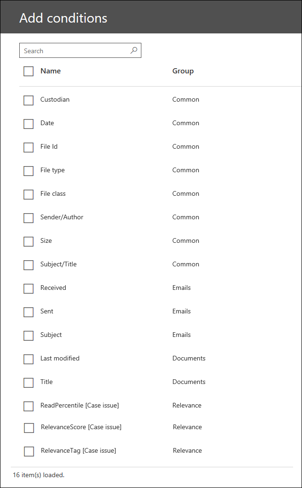

# 搜尋及標記

在 [Advanced eDiscovery] 中，[搜尋] 和 [標記] 模組可讓您在案例中搜尋、預覽及組織檔。 此模組目前已在 Beta 中。 如需搜尋及標記的簡短示範，請參閱 [使用高級 eDiscovery 影片管理您的資料](https://www.youtube.com/watch?v=VaPYL3DHP6I) 。

> [!NOTE]
> 進階電子文件探索需要具有進階合規性附加元件的 Office 365 E3，或適用於您組織的 E5 訂閱。如果您沒有該方案，且想要嘗試進階電子文件探索，您可以[註冊 Office 365 企業版 E5 試用版](https://go.microsoft.com/fwlink/p/?LinkID=698279)。 
  
## 搜尋您案例中的檔

在高級 eDiscovery 案例中處理檔之後 (並選擇性地執行 [分析] 或 [相關性] 模組) ，您可以使用搜尋及加上標籤來進行搜尋，然後再套用案例特定標記 (也稱為標籤) 。 您可以使用所提供的條件卡，或是使用關鍵字條件卡中的類似 KQL 的查詢語言來定義搜尋查詢。 常見的 KQL 語法，例如 AND、OR、 (NOT) ，以及尾隨多字元萬用字元 ( * ) 。 

下表列出您可以使用 KQL 關鍵字查詢進行搜尋的屬性。 或者，您也可以在 [高級 eDiscovery 搜尋工具] 中使用條件卡，將選取的屬性) 的條件 (新增至搜尋查詢。

|**屬性**|**描述**|
|:-----|:-----|
|**caselabel**   | 標記檔時所建立/套用的標記名稱。   |
|**託管**   | 與檔相關聯的保管人;受到限制。   |
|**date**   | 電子郵件的傳送日期;網站檔的修改日期。   |
|**fileid**   | 案例中的檔案識別碼。   |
|**類型**   | 本機副檔名。   |
|**fileclass**   | 電子郵件、檔或附件。   |
|**senderauthor**   | 電子郵件的寄件者;網站檔的作者。   |
|**size**   | 檔案的大小（以 KB 為單位）。   |
|**subjecttitle**   | 電子郵件的主旨;網站檔的標題。   |
|**bcc**   | 電子郵件的 [密件副本] 欄位。   |
|**cc**   | 電子郵件的 [副本] 欄位。   |
|**參與者**   | 電子郵件線索中所有參與者的電子郵件地址，包含缺失的連結。   |
|**收到**   | 接收電子郵件的日期。   |
|**收件者**   | 電子郵件的收件者，包含在 [收件者]、[抄送] 或 [密件副本] 欄位。   |
|**sender**   | 電子郵件的寄件者。   |
|**lastmodifieddate**   | 網站檔的上次修改日期。   |
|**送**   | 電子郵件的傳送日期。   |
|**to**   | 電子郵件的 [收件者] 欄位中所列的收件者。   |
|**作者**   | 網站檔的作者。   |
|**title**   | 網站檔的標題。   |
|**dominanttheme**\*   | 專案的主要主題。   |
|**themeslist**\*   | 與專案相關聯的主題。   |
|**readpercentile_ [issuenum]**\*\*   | 針對 [issuenum] 所定義之問題的專案讀取百分比。   |
|**relevancescore_ [issuenum]**\*\*   | 專案的相關性分數，針對 [issuenum] 所定義的問題。   |
|**relevancetag_ [tagname]**\*\*   | 如果已手動標示相關專案的相關專案，則 [標記] 所定義的標籤。   |
|||

\* 只有在已執行 Themes 模組時才可用。

\*\* 只有在已執行相關性模組時才可用。

或者，您也可以使用 [高級 eDiscovery 搜尋工具] 中的條件卡，針對) 搜尋查詢的選取屬性新增條件 (。 下列螢幕擷取畫面顯示可以新增至查詢的條件。 **Group** 欄會指出屬性是套用至電子郵件、網站檔，還是這兩 (由值 *共同*) 所表示。 此欄位也會識別在您執行相關性模組後，可用的可搜尋屬性。

如需可搜尋屬性的詳細資訊，請參閱 [關鍵字查詢和搜尋條件](keyword-queries-and-search-conditions.md)。
  
## 相關主題

[Office 365 進階電子文件探索 (傳統版)](office-365-advanced-ediscovery.md)
  
[瞭解相關評估](assessment-in-relevance-in-advanced-ediscovery.md)
  
[標記與評估](tagging-and-assessment-in-advanced-ediscovery.md)
  
[標記與相關性訓練](tagging-and-relevance-training-in-advanced-ediscovery.md)
  
[追蹤相關性分析](track-relevance-analysis-in-advanced-ediscovery.md)
  
[根據結果決定](decision-based-on-the-results-in-advanced-ediscovery.md)
  
[測試相關性分析](test-relevance-analysis-in-advanced-ediscovery.md)

