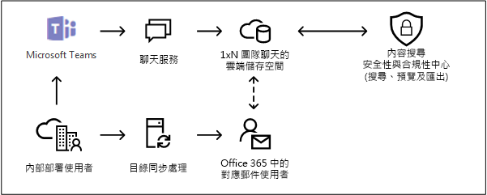

# <a name="searching-cloud-based-mailboxes-for-on-premises-users-in-office-365"></a><span data-ttu-id="ee6cd-103">搜尋 Office 365 中內部部署使用者的雲端式信箱</span><span class="sxs-lookup"><span data-stu-id="ee6cd-103">Searching cloud-based mailboxes for on-premises users in Office 365</span></span>

<span data-ttu-id="ee6cd-104">如果貴組織使用 Exchange 混合式部署 (或將內部部署的 Exchange 組織與 Office 365 同步)，且已啟用 Microsoft Teams，則使用者可以使用 Teams 聊天應用程式進行立即訊息傳遞。</span><span class="sxs-lookup"><span data-stu-id="ee6cd-104">If your organization has an Exchange hybrid deployment (or your organization synchronizes an on-premises Exchange organization with Office 365) and has enabled Microsoft Teams, users can use the Teams chat application for instant messaging.</span></span> <span data-ttu-id="ee6cd-105">針對雲端式使用者，Teams 聊天資料 (又稱為 *1xN 聊天*) 會儲存到其主要雲端式信箱。</span><span class="sxs-lookup"><span data-stu-id="ee6cd-105">For a cloud-based user, the Teams chat data (also called *1xN chats*) is saved to their primary cloud-based mailbox.</span></span> <span data-ttu-id="ee6cd-106">內部部署使用者使用 Teams 聊天應用程式時，其主要信箱位於內部部署。</span><span class="sxs-lookup"><span data-stu-id="ee6cd-106">When an on-premises user uses the Team chat application, their primary mailbox is located on-premises.</span></span> <span data-ttu-id="ee6cd-107">為了避免此限制，Microsoft 已發佈一項新功能，其中建立雲端式儲存空間區域 (稱為內部部署使用者的雲端式信箱)，用於儲存內部部署使用者的 Teams 聊天資料。</span><span class="sxs-lookup"><span data-stu-id="ee6cd-107">To get around this limitation, Microsoft has released a new feature where a cloud-based storage area (called a cloud-based mailbox for on-premises users) is created to store Teams chat data for on-premises users.</span></span> <span data-ttu-id="ee6cd-108">這可讓您使用安全性與合規性中心的內容搜尋工具來搜尋及匯出內部部署使用者的 Teams 聊天資料。</span><span class="sxs-lookup"><span data-stu-id="ee6cd-108">This lets you use the Content Search tool in the Security & Compliance Center to search and export Teams chat data for on-premises users.</span></span> 
  
<span data-ttu-id="ee6cd-109">以下是設定內部部署使用者雲端式信箱的要求和限制：</span><span class="sxs-lookup"><span data-stu-id="ee6cd-109">Here are the requirements and limitations for setting up cloud-based mailboxes for on-premises users:</span></span>
  
- <span data-ttu-id="ee6cd-110">內部部署目錄服務 (例如 Active Directory) 的使用者帳戶必須與 Azure Active Directory (Office 365 中的目錄服務) 同步。</span><span class="sxs-lookup"><span data-stu-id="ee6cd-110">The user accounts in your on-premises directory service (such as Active Directory) must be synchronized with Azure Active Directory, the directory service in Office 365.</span></span> <span data-ttu-id="ee6cd-111">這表示會在 Office 365 中建立郵件使用者帳戶，並將該帳戶與主要信箱位於內部部署組織中的使用者相關聯。</span><span class="sxs-lookup"><span data-stu-id="ee6cd-111">This means that a mail user account is created in Office 365 and is associated with a user whose primary mailbox is located in the on-premises organization.</span></span>

- <span data-ttu-id="ee6cd-112">主要信箱位於內部部署組織中的使用者必須受指派 Microsoft Teams 授權和 Exchange Online 方案 1 授權 (最低要求)。</span><span class="sxs-lookup"><span data-stu-id="ee6cd-112">The user whose primary mailbox is located in the on-premises organization must be assigned a Microsoft Teams license and a minimum of an Exchange Online Plan 1 license.</span></span>

- <span data-ttu-id="ee6cd-113">內部部署使用者的雲端式信箱僅用於儲存 Teams 聊天資料。</span><span class="sxs-lookup"><span data-stu-id="ee6cd-113">The cloud-based mailbox for on-premises users is used only store Teams chat data.</span></span> <span data-ttu-id="ee6cd-114">內部部署使用者無法以任何方式登入或存取雲端式信箱。</span><span class="sxs-lookup"><span data-stu-id="ee6cd-114">An on-premises user can't sign in to the cloud-based mailbox or access in any way.</span></span> <span data-ttu-id="ee6cd-115">該信箱不能用來傳送或接收電子郵件。</span><span class="sxs-lookup"><span data-stu-id="ee6cd-115">It can't be used to send or receive email messages.</span></span> 

- <span data-ttu-id="ee6cd-116">您必須向 Microsoft 支援服務提交要求，以讓貴組織在內部部署使用者的雲端式信箱中搜尋 Teams 聊天資料。</span><span class="sxs-lookup"><span data-stu-id="ee6cd-116">You have to submit a request to Microsoft Support to enable your organization to search for Teams chat data in the cloud-based mailboxes for on-premises users.</span></span> <span data-ttu-id="ee6cd-117">請參閱本文中的[向 Microsoft 支援服務提交啟用此功能的要求](#filing-a-request-with-microsoft-support-to-enable-this-feature)。</span><span class="sxs-lookup"><span data-stu-id="ee6cd-117">See [Filing a request with Microsoft Support to enable this feature](#filing-a-request-with-microsoft-support-to-enable-this-feature) in this article.</span></span> 

> [!NOTE]
> <span data-ttu-id="ee6cd-118">Teams 頻道交談一律儲存在與團隊相關聯的雲端式信箱中。</span><span class="sxs-lookup"><span data-stu-id="ee6cd-118">Teams channel conversations are always stored in the cloud-based mailbox that's associated with the Team.</span></span> <span data-ttu-id="ee6cd-119">這表示您可以使用內容搜尋來搜尋頻道交談，而不須提交支援要求。</span><span class="sxs-lookup"><span data-stu-id="ee6cd-119">That means you can use Content Search to search channel conversations without have to file a support request.</span></span> <span data-ttu-id="ee6cd-120">如需有關搜尋 Teams 頻道交談的詳細資訊，請參閱[搜尋 Microsoft Teams 和 Office 365 群組](content-search.md#searching-microsoft-teams-and-office-365-groups)。</span><span class="sxs-lookup"><span data-stu-id="ee6cd-120">For more information about searching Teams channel conversations, see [Searching Microsoft Teams and Office 365 Groups](content-search.md#searching-microsoft-teams-and-office-365-groups).</span></span>
  
## <a name="how-it-works"></a><span data-ttu-id="ee6cd-121">運作方式</span><span class="sxs-lookup"><span data-stu-id="ee6cd-121">How it works</span></span>

<span data-ttu-id="ee6cd-122">如果已啟用 Microsoft Teams 的使用者具有內部部署信箱，且其使用者帳戶/身分識別已同步到雲端，Microsoft 會建立雲端式信箱來儲存 1xN Teams 聊天資料。</span><span class="sxs-lookup"><span data-stu-id="ee6cd-122">If a Microsoft Teams-enabled user has an on-premises mailbox and their user account/identity has been synched to the cloud, Microsoft creates a cloud-based mailbox to store 1xN Teams chat data.</span></span> <span data-ttu-id="ee6cd-123">Teams 聊天資料儲存到雲端式信箱後，就會編制索引，以便搜尋。</span><span class="sxs-lookup"><span data-stu-id="ee6cd-123">After the Teams chat data is stored in the cloud-based mailbox, it's indexed for search.</span></span> <span data-ttu-id="ee6cd-124">這可讓您使用內容搜尋 (以及與電子文件探索案例相關聯的搜尋) 來搜尋、預覽及匯出內部部署使用者的 Teams 聊天資料。</span><span class="sxs-lookup"><span data-stu-id="ee6cd-124">This lets you Use Content Search (and searches associated with eDiscovery cases) to search, preview, and export Teams chat data for on-premises users.</span></span> <span data-ttu-id="ee6cd-125">您也可以使用安全性與合規性中心 PowerShell 中的 **\*ComplianceSearch** Cmdlet 搜尋內部部署使用者的 Teams 聊天資料。</span><span class="sxs-lookup"><span data-stu-id="ee6cd-125">You can also use **\*ComplianceSearch** cmdlets in the Security & Compliance Center PowerShell to search for Teams chat data for on-premises users.</span></span> 
  
<span data-ttu-id="ee6cd-126">下圖顯示搜尋、預覽及匯出內部部署使用者的 Teams 聊天資料的工作流程。</span><span class="sxs-lookup"><span data-stu-id="ee6cd-126">The following graphic shows the workflow of how Teams chat data for on-premises users is available to search, preview, and export.</span></span>
  

  
<span data-ttu-id="ee6cd-128">除了這項新功能，您仍然可以使用內容搜尋來搜尋、預覽及匯出小組中與每個 Microsoft Team 相關聯的雲端式 SharePoint 網站和 Exchange 信箱中的 Teams 內容，以及雲端式使用者 Exchange Online 信箱中的 1xN Teams 聊天資料。</span><span class="sxs-lookup"><span data-stu-id="ee6cd-128">In addition to this new capability, you can still use Content Search to search, preview, and export Teams content in the cloud-based SharePoint site and Exchange mailbox associated with each Microsoft Team and 1xN Teams chat data in the Exchange Online mailbox for cloud-based users.</span></span>

## <a name="filing-a-request-with-microsoft-support-to-enable-this-feature"></a><span data-ttu-id="ee6cd-129">向 Microsoft 支援服務提交啟用此功能的要求</span><span class="sxs-lookup"><span data-stu-id="ee6cd-129">Filing a request with Microsoft Support to enable this feature</span></span>

<span data-ttu-id="ee6cd-130">您必須向 Microsoft 支援服務提交要求，才能讓貴組織使用安全性與合規性中心的圖形使用者介面來搜尋內部部署使用者雲端式信箱中的 Teams 聊天資料。</span><span class="sxs-lookup"><span data-stu-id="ee6cd-130">You must file a request with Microsoft Support to enable your organization to use the graphical user interface in the Security & Compliance Center to search for Teams chat data in the cloud-based mailboxes for on-premises users.</span></span> <span data-ttu-id="ee6cd-131">安全性與合規性中心 PowerShell 提供此功能。</span><span class="sxs-lookup"><span data-stu-id="ee6cd-131">This feature is available in Security & Compliance Center PowerShell.</span></span> <span data-ttu-id="ee6cd-132">您不需要提交支援要求，即可使用 PowerShell 來搜尋內部部署使用者的 Teams 聊天資料。</span><span class="sxs-lookup"><span data-stu-id="ee6cd-132">You don't have to submit a support request to use PowerShell to search for Teams chat data for on-premises users.</span></span>
  
<span data-ttu-id="ee6cd-133">向 Microsoft 支援服務提交要求時，請提供下列資訊：</span><span class="sxs-lookup"><span data-stu-id="ee6cd-133">Include the following information when you submit the request to Microsoft Support:</span></span>
  
- <span data-ttu-id="ee6cd-134">Office 365 組織的預設網域名稱。</span><span class="sxs-lookup"><span data-stu-id="ee6cd-134">The default domain name of your Office 365 organization.</span></span>

- <span data-ttu-id="ee6cd-135">Office 365 組織的租用戶名稱和租用戶識別碼。</span><span class="sxs-lookup"><span data-stu-id="ee6cd-135">The tenant name and tenant ID of your Office 365 organization.</span></span> <span data-ttu-id="ee6cd-136">您可以在 Azure Active Directory 入口網站 (在 **[管理]** \> **[屬性]** 底下) 找到這些資訊。</span><span class="sxs-lookup"><span data-stu-id="ee6cd-136">You can find these in the Azure Active Directory portal (under **Manage** \> **Properties**).</span></span> <span data-ttu-id="ee6cd-137">請參閱[尋找您的 Office 365 租用戶識別碼](https://support.office.com/article/6891b561-a52d-4ade-9f39-b492285e2c9b)。</span><span class="sxs-lookup"><span data-stu-id="ee6cd-137">See [Find your Office 365 tenant ID](https://support.office.com/article/6891b561-a52d-4ade-9f39-b492285e2c9b).</span></span>

- <span data-ttu-id="ee6cd-138">可在支援要求中使用下列目的標題或描述：「啟用內部部署使用者的應用程式內容搜尋」。</span><span class="sxs-lookup"><span data-stu-id="ee6cd-138">The following title or description of the purpose of the support request: "Enable Application Content Search for On-premises Users".</span></span> <span data-ttu-id="ee6cd-139">這可協助您將要求傳送到可實作要求的 Office 365 電子文件探索工程團隊。</span><span class="sxs-lookup"><span data-stu-id="ee6cd-139">This helps route the request to the Office 365 eDiscovery engineering team who will implement the request.</span></span>

<span data-ttu-id="ee6cd-140">工程變更完成後，Microsoft 支援服務就會傳送預計部署日期。</span><span class="sxs-lookup"><span data-stu-id="ee6cd-140">After the engineering change is made, Microsoft Support will send you an estimated deployment date.</span></span> <span data-ttu-id="ee6cd-141">提交支援要求後，部署程序通常需要 2 到 3 週的時間。</span><span class="sxs-lookup"><span data-stu-id="ee6cd-141">The deployment process usually takes 2–3 weeks after you submit the support request.</span></span>
  
### <a name="what-happens-after-this-feature-is-enabled"></a><span data-ttu-id="ee6cd-142">啟用此功能後會發生什麼情況？</span><span class="sxs-lookup"><span data-stu-id="ee6cd-142">What happens after this feature is enabled?</span></span>

<span data-ttu-id="ee6cd-143">在您的 Office 365 組織中部署此功能後，便會在安全性與合規性中心的內容搜尋和與電子文件探索案例相關聯的搜尋中進行下列變更：</span><span class="sxs-lookup"><span data-stu-id="ee6cd-143">After this feature is deployed in your Office 365 organization, the following changes are made in Content Search and in searches associated with an eDiscovery case in the Security & Compliance Center:</span></span>
  
- <span data-ttu-id="ee6cd-144">**[為內部部署使用者新增 Office App 內容]** 核取方塊會新增到內容搜尋中的 **[位置]** 底下。</span><span class="sxs-lookup"><span data-stu-id="ee6cd-144">The **Add Office app content for on-premises users** checkbox is added under the **Locations** in Content Search.</span></span>

    ![[為內部部署使用者新增 Office App 內容] 核取方塊會新增到內容搜尋 UI](../media/599e751e-17bd-408d-a18c-127538de6e85.png)
  
- <span data-ttu-id="ee6cd-146">內部部署使用者會顯示在用於選取要搜尋的使用者信箱的內容位置選擇器中。</span><span class="sxs-lookup"><span data-stu-id="ee6cd-146">On-premises users are displayed in the content locations picker that you use to select user mailboxes to search.</span></span>

## <a name="searching-for-teams-chat-content-in-cloud-based-mailboxes-for-on-premises-users"></a><span data-ttu-id="ee6cd-147">搜尋內部部署使用者的雲端式信箱中的 Teams 聊天內容</span><span class="sxs-lookup"><span data-stu-id="ee6cd-147">Searching for Teams chat content in cloud-based mailboxes for on-premises users</span></span>

<span data-ttu-id="ee6cd-148">啟用此功能後，您可以使用安全性與合規性中心的內容搜尋來搜尋內部部署使用者雲端式信箱中的 Teams 聊天資料。</span><span class="sxs-lookup"><span data-stu-id="ee6cd-148">After the feature has been enabled, you can use Content Search in the Security & Compliance Center to search for Teams chat data in the cloud-based mailboxes for on-premises users.</span></span>
  
1. <span data-ttu-id="ee6cd-149">在安全性與合規性中心內，移至 **[搜尋]** \> **[內容搜尋]**。</span><span class="sxs-lookup"><span data-stu-id="ee6cd-149">In the Security & Compliance Center, go to **Search** \> **Content search**</span></span>

2. <span data-ttu-id="ee6cd-150">在 **[搜尋]** 頁面上，按一下 **新增搜尋**。</span><span class="sxs-lookup"><span data-stu-id="ee6cd-150">On the **Search** page, click  **New search**.</span></span>

    <span data-ttu-id="ee6cd-151">如先前所述，**[為內部部署使用者新增 Office App 內容]** 核取方塊會顯示在 **[位置]** 底下。</span><span class="sxs-lookup"><span data-stu-id="ee6cd-151">As previously explained, the **Add Office app content for on-premises users** checkbox is displayed under **Locations**.</span></span> <span data-ttu-id="ee6cd-152">此為預設選取的選項。</span><span class="sxs-lookup"><span data-stu-id="ee6cd-152">It's selected by default.</span></span>

3. <span data-ttu-id="ee6cd-153">視需要建立關鍵字查詢，並將條件新增至搜尋查詢。</span><span class="sxs-lookup"><span data-stu-id="ee6cd-153">Create the keyword query and add conditions to the search query if necessary.</span></span> <span data-ttu-id="ee6cd-154">若只要搜尋 Team 聊天資料，您可以在 **[關鍵字]** 方塊中新增下列查詢：</span><span class="sxs-lookup"><span data-stu-id="ee6cd-154">To only search for Team chats data, you can add the following query in the **Keywords** box:</span></span>

    ```text
    kind:im
    ```

4. <span data-ttu-id="ee6cd-155">此時，您可以在 **[位置]** 底下選擇下列其中一個選項：</span><span class="sxs-lookup"><span data-stu-id="ee6cd-155">At this point, you can choose one of the following options under **Locations**:</span></span>

    - <span data-ttu-id="ee6cd-156">**所有位置：** 選取此選項以搜尋貴組織中所有使用者的信箱。</span><span class="sxs-lookup"><span data-stu-id="ee6cd-156">**All locations:** Select this option to search the mailboxes of all users in your organization.</span></span> <span data-ttu-id="ee6cd-157">勾選此核取方塊時，系統也會搜尋內部部署使用者的所有雲端式信箱。</span><span class="sxs-lookup"><span data-stu-id="ee6cd-157">When the checkbox is selected, all cloud-based mailboxes for on-premises users will also be searched.</span></span>

    - <span data-ttu-id="ee6cd-158">**特定位置：** 勾選此選項，然後按一下 **[修改]** \> 選擇使用者、群組或團隊來搜尋特定信箱。</span><span class="sxs-lookup"><span data-stu-id="ee6cd-158">**Specific locations:** Select this option and then click **Modify** \> Choose user, groups, or teams to search specific mailboxes.</span></span> <span data-ttu-id="ee6cd-159">如先前所述，位置選擇器可讓您搜尋內部部署使用者。</span><span class="sxs-lookup"><span data-stu-id="ee6cd-159">As previously explained, the locations picker lets you search for on-premises users.</span></span>

5. <span data-ttu-id="ee6cd-160">儲存並執行搜尋。</span><span class="sxs-lookup"><span data-stu-id="ee6cd-160">Save and run the search.</span></span> <span data-ttu-id="ee6cd-161">任何來自內部部署使用者雲端式信箱的搜尋結果都可以像其他搜尋結果一樣預覽。</span><span class="sxs-lookup"><span data-stu-id="ee6cd-161">Any search results from the cloud-based mailboxes for on-premises users can be previewed like any other search results.</span></span> <span data-ttu-id="ee6cd-162">您也可以將搜尋結果 (包括任何 Teams 聊天資料) 匯出至 PST 檔案。</span><span class="sxs-lookup"><span data-stu-id="ee6cd-162">You can also export the search results (including any Teams chat data) to a PST file.</span></span> <span data-ttu-id="ee6cd-163">如需詳細資訊，請參閱：</span><span class="sxs-lookup"><span data-stu-id="ee6cd-163">For more information, see:</span></span> 

    - [<span data-ttu-id="ee6cd-164">建立搜尋</span><span class="sxs-lookup"><span data-stu-id="ee6cd-164">Create a search</span></span>](content-search.md#create-a-search)

    - [<span data-ttu-id="ee6cd-165">預覽搜尋結果</span><span class="sxs-lookup"><span data-stu-id="ee6cd-165">Preview search results</span></span>](content-search.md#preview-search-results)

    - [<span data-ttu-id="ee6cd-166">匯出內容搜尋結果</span><span class="sxs-lookup"><span data-stu-id="ee6cd-166">Export Content Search results</span></span>](export-search-results.md)

## <a name="using-powershell-to-search-for-teams-chat-data-in-cloud-based-mailboxes-for-on-premises-users"></a><span data-ttu-id="ee6cd-167">使用 PowerShell 搜尋內部部署使用者雲端式信箱中的 Teams 聊天資料</span><span class="sxs-lookup"><span data-stu-id="ee6cd-167">Using PowerShell to search for Teams chat data in cloud-based mailboxes for on-premises users</span></span>

<span data-ttu-id="ee6cd-168">您可以在安全性與合規性中心 PowerShell 中使用 **New-ComplianceSearch** 和 **Set-ComplianceSearch** Cmdlet 來搜尋內部部署使用者的雲端式信箱。</span><span class="sxs-lookup"><span data-stu-id="ee6cd-168">You can use the **New-ComplianceSearch** and **Set-ComplianceSearch** cmdlets in the Security & Compliance Center PowerShell to search the cloud-based mailbox for on-premises users.</span></span> <span data-ttu-id="ee6cd-169">如先前所述，您不需要提交支援要求，即可使用 PowerShell 來搜尋內部部署使用者的 Teams 聊天資料。</span><span class="sxs-lookup"><span data-stu-id="ee6cd-169">As previously explained, you don't have to submit a support request to use PowerShell to search for Teams chat data for on-premises users.</span></span> 
  
1. <span data-ttu-id="ee6cd-170">[連線到安全性與合規性中心 PowerShell](https://docs.microsoft.com/powershell/exchange/office-365-scc/connect-to-scc-powershell/connect-to-scc-powershell)。</span><span class="sxs-lookup"><span data-stu-id="ee6cd-170">[Connect to Security & Compliance Center PowerShell](https://docs.microsoft.com/powershell/exchange/office-365-scc/connect-to-scc-powershell/connect-to-scc-powershell).</span></span>

2. <span data-ttu-id="ee6cd-171">執行下列 PowerShell 命令來建立搜尋內部部署使用者雲端式信箱的內容搜尋。</span><span class="sxs-lookup"><span data-stu-id="ee6cd-171">Run the following PowerShell command to create a content search that searches the cloud-based mailboxes of on-premises users.</span></span>

    ```powershell
    New-ComplianceSearch <name of new search> -ContentMatchQuery <search query> -ExchangeLocation <on-premises user> -IncludeUserAppContent $true -AllowNotFoundExchangeLocationsEnabled $true  
    ```

    <span data-ttu-id="ee6cd-172">*IncludeUserAppContent* 參數是用於為 *ExchangeLocation* 參數指定的一位或多位使用者指定雲端式信箱。</span><span class="sxs-lookup"><span data-stu-id="ee6cd-172">The *IncludeUserAppContent*  parameter is used to specify the cloud-based mailbox for the user or users who are specified by the  *ExchangeLocation*  parameter.</span></span> <span data-ttu-id="ee6cd-173">*AllowNotFoundExchangeLocationsEnabled* 允許內部部署使用者的雲端式信箱。</span><span class="sxs-lookup"><span data-stu-id="ee6cd-173">The  *AllowNotFoundExchangeLocationsEnabled*  allows cloud-based mailboxes for on-premises users.</span></span> <span data-ttu-id="ee6cd-174">使用此參數的 `$true` 值時，搜尋在執行前不會嘗試驗證信箱的存在。</span><span class="sxs-lookup"><span data-stu-id="ee6cd-174">When you use the `$true` value for this parameter, the search doesn't try to validate the existence of the mailbox before it runs.</span></span> <span data-ttu-id="ee6cd-175">這是搜尋內部部署使用者的雲端式信箱所需的設定，因為這些類型的信箱無法解析為一般信箱。</span><span class="sxs-lookup"><span data-stu-id="ee6cd-175">This is required to search the cloud-based mailboxes for on-premises users because these types of mailboxes don't resolve as regular mailboxes.</span></span>

    <span data-ttu-id="ee6cd-176">下列範例在 Sara Davis 的雲端式信箱中搜尋包含關鍵字「redstone」的 Teams 聊天 (立即訊息)，Sara Davis 是 Contoso 組織內的部部署使用者。</span><span class="sxs-lookup"><span data-stu-id="ee6cd-176">The following example searches for Teams chats (which are instant messages) that contain keyword "redstone" in the cloud-based mailbox of Sara Davis, who is an on-premises user in the Contoso organization.</span></span>
  
    ```powershell
    New-ComplianceSearch "Redstone_Search" -ContentMatchQuery "redstone AND kind:im" -ExchangeLocation sarad@contoso.com -IncludeUserAppContent $true -AllowNotFoundExchangeLocationsEnabled $true  
    ```

   <span data-ttu-id="ee6cd-177">建立搜尋後，請務必使用 **Start-ComplianceSearch** Cmdlet 執行搜尋。</span><span class="sxs-lookup"><span data-stu-id="ee6cd-177">After you create a search, be sure to use the **Start-ComplianceSearch** cmdlet to run the search.</span></span> 
  
<span data-ttu-id="ee6cd-178">如需使用這些 Cmdlet 的相關資訊，請參閱：</span><span class="sxs-lookup"><span data-stu-id="ee6cd-178">For more information using these cmdlets, see:</span></span>
  
- [<span data-ttu-id="ee6cd-179">New-ComplianceSearch</span><span class="sxs-lookup"><span data-stu-id="ee6cd-179">New-ComplianceSearch</span></span>](https://docs.microsoft.com/powershell/module/exchange/policy-and-compliance-content-search/new-compliancesearch)

- [<span data-ttu-id="ee6cd-180">Set-ComplianceSearch</span><span class="sxs-lookup"><span data-stu-id="ee6cd-180">Set-ComplianceSearch</span></span>](https://docs.microsoft.com/powershell/module/exchange/policy-and-compliance-content-search/set-compliancesearch)

- [<span data-ttu-id="ee6cd-181">Start-ComplianceSearch</span><span class="sxs-lookup"><span data-stu-id="ee6cd-181">Start-ComplianceSearch</span></span>](https://docs.microsoft.com/powershell/module/exchange/policy-and-compliance-content-search/start-compliancesearch)

## <a name="known-issues"></a><span data-ttu-id="ee6cd-182">已知問題</span><span class="sxs-lookup"><span data-stu-id="ee6cd-182">Known issues</span></span>

- <span data-ttu-id="ee6cd-183">目前您可以搜尋、預覽及匯出內部部署使用者雲端式信箱中的內容。</span><span class="sxs-lookup"><span data-stu-id="ee6cd-183">Currently, you can search, preview, and export content in cloud-based mailboxes for on-premises users.</span></span> <span data-ttu-id="ee6cd-184">您也可以將內部部署使用者雲端式信箱置於與電子文件探索案例相關聯的保留中，並將 Teams 聊天或頻道訊息的保留原則套用至內部部署使用者的雲端式信箱。</span><span class="sxs-lookup"><span data-stu-id="ee6cd-184">You can also place a cloud-based mailbox for an on-premises user on a hold associated with an eDiscovery case, and apply a retention policy for Teams chats or channel messages to cloud-based mailboxes for on-premises users.</span></span> <span data-ttu-id="ee6cd-185">不過，目前無法將其他內容位置 (例如 Exchange 信箱和 SharePoint 網站) 的保留原則套用在內部部署使用者的雲端式信箱。</span><span class="sxs-lookup"><span data-stu-id="ee6cd-185">However at this time, you can't apply a retention policy for other content locations (such as Exchange mailboxes and SharePoint sites) to cloud-based mailboxes for on-premises users.</span></span>

## <a name="frequently-asked-questions"></a><span data-ttu-id="ee6cd-186">常見問題集</span><span class="sxs-lookup"><span data-stu-id="ee6cd-186">Frequently asked questions</span></span>

 <span data-ttu-id="ee6cd-187">**內部部署使用者的雲端式信箱位於何處？**</span><span class="sxs-lookup"><span data-stu-id="ee6cd-187">**Where are cloud-based mailboxes for on-premises users located?**</span></span>
  
<span data-ttu-id="ee6cd-188">雲端式信箱建立並儲存在與 Office 365 組織相同的資料中心。</span><span class="sxs-lookup"><span data-stu-id="ee6cd-188">Cloud-based mailboxes are created and stored in the same datacenter as your Office 365 organization.</span></span>
  
 <span data-ttu-id="ee6cd-189">**除了提交支援要求外，還有其他需求嗎？**</span><span class="sxs-lookup"><span data-stu-id="ee6cd-189">**Are there any other requirements other than submitting a support request?**</span></span>
  
 <span data-ttu-id="ee6cd-190">如先前所述，內部部署信箱的使用者身分識別必須同步到雲端式組織，以便為 Office 365 中每個內部部署使用者帳戶建立對應的郵件使用者帳戶。</span><span class="sxs-lookup"><span data-stu-id="ee6cd-190">As previously explained, the identities of users with on-prem mailboxes must be synchronized to your cloud-based organization so that a corresponding mail user account is created for each on-premises user account in Office 365.</span></span> <span data-ttu-id="ee6cd-191">貴組織還必須具有 Office 365 企業版訂閱，例如 Office 365 企業版 E1、E3 或 E5 訂閱。</span><span class="sxs-lookup"><span data-stu-id="ee6cd-191">Your organization must also have an Office 365 enterprise subscription, such as an Office 365 Enterprise E1, E3, or E5 subscription.</span></span>
  
 <span data-ttu-id="ee6cd-192">**如果使用者的內部部署信箱已移轉至雲端，是否有遺失 Teams 聊天資料的風險？**</span><span class="sxs-lookup"><span data-stu-id="ee6cd-192">**Is there a risk of losing the Teams chat data if the user's on-premises mailbox is migrated to the cloud?**</span></span>
  
<span data-ttu-id="ee6cd-193">否。</span><span class="sxs-lookup"><span data-stu-id="ee6cd-193">No.</span></span> <span data-ttu-id="ee6cd-194">將內部部署使用者的主要信箱移轉到雲端時，該使用者的 Teams 聊天資料就會移轉至新的雲端式主要信箱。</span><span class="sxs-lookup"><span data-stu-id="ee6cd-194">When you migrate the primary mailbox of an on-premises user to the cloud, the Teams chat data for that user will be migrated to their new cloud-based primary mailbox.</span></span>
  
 <span data-ttu-id="ee6cd-195">**可以將電子文件探索保留或 Office 365 保留原則套用至內部部署使用者嗎？**</span><span class="sxs-lookup"><span data-stu-id="ee6cd-195">**Can I apply an eDiscovery hold or Office 365 retention policies to on-premises users?**</span></span>
  
<span data-ttu-id="ee6cd-196">可以。</span><span class="sxs-lookup"><span data-stu-id="ee6cd-196">Yes.</span></span> <span data-ttu-id="ee6cd-197">您可以將 Teams 聊天和頻道訊息的電子文件探索保留或保留原則套用至內部部署使用者的雲端式信箱。</span><span class="sxs-lookup"><span data-stu-id="ee6cd-197">You can apply eDiscovery holds or retention policies for Teams chats and channel messages to cloud-based mailboxes for on-premises users.</span></span>
  
 <span data-ttu-id="ee6cd-198">**在組織提交啟用此功能的要求之前，內容搜尋是否能找到內部部署使用者較早的 Teams 聊天？**</span><span class="sxs-lookup"><span data-stu-id="ee6cd-198">**Can Content Search find older Teams chats for on-premises users before the time my organization submitted the request to enable this feature?**</span></span>
  
<span data-ttu-id="ee6cd-199">Microsoft 開始在 2018 年 1 月 31 日儲存內部部署使用者的 Teams 聊天資料。</span><span class="sxs-lookup"><span data-stu-id="ee6cd-199">Microsoft started storing the Teams chat data for on-premises users on January 31, 2018.</span></span> <span data-ttu-id="ee6cd-200">因此，如果內部部署 Teams 使用者的身分識別已在 Active Directory 和 Azure Active Directory 之間同步，則自該日起，其 Teams 聊天資料會儲存在雲端式信箱中，並可使用內容搜尋來搜尋。</span><span class="sxs-lookup"><span data-stu-id="ee6cd-200">So, if the identity of an on-premises Teams user has been synched between Active Directory and Azure Active Directory since this date, then their Teams chat data is stored in a cloud-based mailbox and is searchable using Content Search.</span></span> <span data-ttu-id="ee6cd-201">此外，Microsoft 正致力於將 2018 年 1 月 31 日前的 Teams 聊天資料儲存在內部部署使用者的雲端式信箱中。</span><span class="sxs-lookup"><span data-stu-id="ee6cd-201">Microsoft is also working on storing Teams chat data from prior to January 31, 2018 in the cloud-based mailboxes for on-premises users.</span></span> <span data-ttu-id="ee6cd-202">我們即將提供更多相關資訊。</span><span class="sxs-lookup"><span data-stu-id="ee6cd-202">More information about this will be available soon.</span></span>

 <span data-ttu-id="ee6cd-203">**內部部署使用者是否需要授權才能在雲端式信箱中儲存 Teams 聊天資料？**</span><span class="sxs-lookup"><span data-stu-id="ee6cd-203">**Do on-premises users need a license to store Teams chat data in a cloud-based mailbox?**</span></span>
  
<span data-ttu-id="ee6cd-204">是。</span><span class="sxs-lookup"><span data-stu-id="ee6cd-204">Yes.</span></span> <span data-ttu-id="ee6cd-205">若要在雲端式信箱中儲存內部部署使用者的 Teams 聊天資料，必須在 Office 365 (或 Microsoft 365) 中為該使用者指派 Microsoft Teams 授權和 Exchange Online 方案授權。</span><span class="sxs-lookup"><span data-stu-id="ee6cd-205">To store Teams chat data for an on-premises user in a cloud-based mailbox, the user must be assigned a Microsoft Teams license and an Exchange Online Plan license in Office 365 (or Microsoft 365).</span></span>
