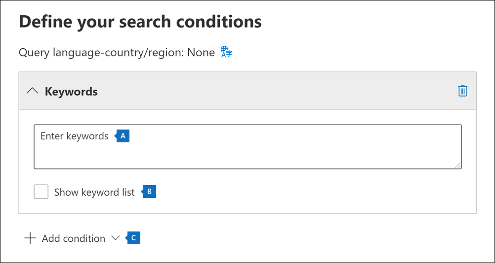

# 在核心 eDiscovery 案例中搜尋內容Search for content in a Core eDiscovery case

在建立核心 eDiscovery 案例，並將案例中的相關人員設定為暫止狀態之後，您可以建立並執行一或多個搜尋與案例相關的內容。After a Core eDiscovery case is created and people of interest in the case are placed on hold, you can create and run one or more searches for content relevant to the case. 與核心 eDiscovery 案例相關聯的搜尋並未列在「Microsoft 365 規範中心」的 [**內容搜尋**] 頁面上。Searches associated with a Core eDiscovery case aren't listed on the **Content search** page in the Microsoft 365 compliance center. 這些搜尋會列在核心 eDiscover 案例的 [ **搜尋** ] 頁面上，與搜尋產生關聯。These searches are listed on the **Searches** page of the Core eDiscover case the searches are associated with. 這也表示只有案例成員才能存取與案例相關聯的搜尋。This also means that searches associated with a case can only be accessed by case members.

若要建立核心 eDiscovery 搜尋：To create a Core eDiscovery search:
  
1. 移至 <https://compliance.microsoft.com> 並登入使用已獲指派適當 eDiscovery 許可權之使用者帳戶的認證，而且是案例的成員。Go to <https://compliance.microsoft.com> and sign in using the credentials for user account that has been assigned the appropriate eDiscovery permissions and is a member of the case.

2. 在 Microsoft 365 規範中心的左功能窗格中，按一下 [**全部顯示**]，然後按一下 [ **eDiscovery > Core**]。In the left navigation pane of the Microsoft 365 compliance center, click **Show all**, and then click **eDiscovery > Core**.

3. 在 [ **核心電子** 檔探索] 頁面上，選取您要建立相關聯搜尋的案例，然後按一下 [ **開啟案例**]。On the **Core eDiscovery** page, select the case that you want to create an associated search, and then click **Open case**.

4. 在案例的 **首頁** 上，按一下 [ **搜尋** ] 索引標籤，然後按一下 [ **新增搜尋**]。On the **Home** page for the case, click the **Searches** tab, and then click **New search**.

   ![按一下 [新增搜尋] 以建立核心 eDiscovery 搜尋搜尋](../media/CoreeDiscoverySearch1.png)

   > [!NOTE]
   > [**依識別碼搜尋] 清單** 選項可讓您使用 Exchange IDs 清單來搜尋特定的電子郵件及其他信箱專案。The **Search by ID list** option lets you search for specific email messages and other mailbox items using a list of Exchange IDs. 若要建立識別碼清單搜尋，您可以提交逗點分隔值 (CSV) 檔案，以識別要搜尋的特定信箱項目。To create an ID list search, you submit a comma-separated value (CSV) file that identifies the specific mailbox items to search for. 如需相關指示，請參閱[為備識別碼清單搜尋準備 CSV 檔案](csv-file-for-an-id-list-content-search.md)。For instructions, see [Prepare a CSV file for an ID list search](csv-file-for-an-id-list-content-search.md).

5. 在 [ **新增搜尋** 嚮導] 中，輸入搜尋的名稱，以及可協助識別搜尋的選擇性描述。In the **New search** wizard, type a name for the search, and an optional description that helps identify the search. 搜尋的名稱在您的組織中必須是唯一的。The name of the search must be unique in your organization.

6. 在 [ **位置** ] 頁面上，選擇您要搜尋的內容位置。On the **Locations** page, choose the content locations that you want to search. 您可以搜尋信箱、網站和公用資料夾。You can search mailboxes, sites, and public folders.

    
  
   1. **Exchange 信箱**：將切換設定為 [**開啟**]，然後按一下 **[選擇使用者、群組或小組**]，以指定要置於保留狀態的信箱。**Exchange mailboxes**: Set the toggle to **On** and then click **Choose users, groups, or teams** to specify the mailboxes to place on hold. 使用 [搜尋] 方塊來尋找使用者信箱和通訊群組 (將保留在群組成員的信箱上) 進行暫止。Use the search box to find user mailboxes and distribution groups (to place a hold on the mailboxes of group members) to place on hold. 您也可以在與 Microsoft Team (相關聯的信箱中搜尋) 、Office 365 群組及 Yammer 群組相關聯的信箱。You can also search the mailbox associated with a Microsoft Team (for channel messages), Office 365 Group, and Yammer Group. 如需信箱中所儲存之應用程式資料的詳細資訊，請參閱 [儲存在信箱中的內容，以取得 eDiscovery](what-is-stored-in-exo-mailbox.md)。For more information about the application data stored in mailboxes, see [Content stored in mailboxes for eDiscovery](what-is-stored-in-exo-mailbox.md).

   2. **SharePoint 網站**：將切換設定為 [**開啟**]，然後按一下 **[選擇網站**]，以指定要保留 SharePoint 網站和 OneDrive 帳戶。**SharePoint sites**: Set the toggle to **On** and then click **Choose sites** to specify SharePoint sites and OneDrive accounts to place on hold. 輸入您要保留之每個網站的 URL。Type the URL for each site that you want to place on hold. 您也可以為 Microsoft 團隊、Office 365 群組或 Yammer 群組新增 SharePoint 網站的 URL。You can also add the URL for the SharePoint site for a Microsoft Team, Office 365 Group, or Yammer Group.
  
   3. **Exchange 公用資料夾**：設定 **開啟開啟 Exchange Online** 組織中的所有公用資料夾保留。**Exchange public folders**: Set the toggle to **On** to put all public folders in your Exchange Online organization on hold. 您無法選擇要保留的特定公用資料夾。You can't choose specific public folders to put on hold. 如果您不想要保留公用資料夾，請停用切換參數。Leave the toggle switch off if you don't want to put a hold on public folders.
  
   4. 選取此核取方塊可搜尋內部部署使用者的 Teams 內容。Keep this checkbox selected to search for Teams content for on-premises users. 例如，如果您搜尋組織中的所有 Exchange 信箱，並選取此核取方塊，則用來儲存內部部署使用者 Teams 聊天資料的雲端式儲存裝置將會包含在搜尋範圍內。For example, if you search all Exchange mailboxes in the organization and this checkbox is selected, the cloud-based storage used to store Teams chat data for on-premises users will be included in the scope of the search. 如需詳細資訊，請參閱[搜尋內部部署使用者的 Teams 聊天資料](search-cloud-based-mailboxes-for-on-premises-users.md)。For more information, see [Search for Teams chat data for on-premises users](search-cloud-based-mailboxes-for-on-premises-users.md).

7. 在 [ **定義搜尋條件** ] 頁面上，輸入關鍵字查詢，並視需要將條件新增至搜尋查詢。On the **Define your search conditions** page, type a keyword query and add conditions to the search query if necessary.

   

   1. 指定關鍵字、郵件內容（如已傳送和接收的日期）或檔案屬性（如檔案名或檔最後變更的日期）。Specify keywords, message properties such as sent and received dates, or document properties such as file names or the date that a document was last changed. 您可以使用內含布林運算子的更複雜的查詢，例如 **AND**、**OR**、**NOT** 和 **NEAR**。You can use more complex queries that use a Boolean operator, such as **AND**, **OR**, **NOT**, and **NEAR**. 如果將關鍵字方塊保留空白，則位於指定內容位置的所有內容都會包含在搜尋結果中。If you leave the keyword box empty, all content located in the specified content locations is included in the search results. 如需詳細資訊，請參閱 [eDiscovery 的關鍵字查詢和搜尋條件](keyword-queries-and-search-conditions.md)。For more information, see [Keyword queries and search conditions for eDiscovery](keyword-queries-and-search-conditions.md).

   2. 或者，您可以按一下 **[顯示關鍵字清單]** 核取方塊，然後在每一列中輸入關鍵字。Alternatively, you can click the **Show keyword list** checkbox and the type a keyword in each row. 如果您這麼做，每一列的關鍵字會以邏輯運算子 (**c:s**) 連接，其功能與建立的搜尋查詢中的 **OR** 運算子類似。If you do this, the keywords on each row are connected by a logical operator (**c:s**) that is similar in functionality to the **OR** operator in the search query that's created.

      為什麼要使用關鍵字清單？Why use the keyword list? 您可以取得會顯示有多少個項目符合每個關鍵字的統計資料。You can get statistics that show how many items match each keyword. 這可協助您快速找出哪些關鍵字最有效(和最不有效)。This can help you quickly identify which keywords are the most (and least) effective. 您也可以在一列中使用關鍵字片語 (以括號括住)。You can also use a keyword phrase (surrounded by parentheses) in a row. 如需關鍵字清單和搜尋統計資料的詳細資訊，請參閱 [取得搜尋的關鍵字統計資料](view-keyword-statistics-for-content-search.md#get-keyword-statistics-for-searches)。For more information about the keyword list and search statistics, see [Get keyword statistics for searches](view-keyword-statistics-for-content-search.md#get-keyword-statistics-for-searches).

      > [!NOTE]
      > 為了避免大型關鍵字清單所造成的問題，您最多隻能有20列的關鍵字清單。To help reduce issues caused by large keyword lists, you're limited to a maximum of 20 rows in the keyword list.

   3. 您可以新增搜尋條件以縮小搜尋範圍，並傳回更精簡的結果集。You can add search conditions to narrow a search and return a more refined set of results. 每個條件會將一個子句新增至在啟動搜尋時便會建立並執行的搜尋查詢中。Each condition adds a clause to the search query that is created and run when you start the search. 條件會在邏輯上使用功能上與 **AND** 運算子類似的邏輯運算子 (**c:c**) 與關鍵字查詢連結 (在關鍵字方塊中指定)。A condition is logically connected to the keyword query (specified in the keyword box) by a logical operator (**c:c**) that is similar in functionality to the **AND** operator. 這表示結果中包含的項目必須同時滿足關鍵字查詢與一或多個條件。That means that items have to satisfy both the keyword query and one or more conditions to be included in the results. 這是條件協助縮小搜尋結果的方式。This is how conditions help to narrow your results. 有關可在搜尋查詢中使用的條件清單和描述，請參閱[搜尋條件](keyword-queries-and-search-conditions.md#search-conditions)。For a list and description of conditions that you can use in a search query, see [Search conditions](keyword-queries-and-search-conditions.md#search-conditions).

8. 複查搜尋設定 (並在必要時進行編輯) ，然後提交搜尋加以啟動。Review the search settings (and edit if necessary), and then submit the search to start it.

在搜尋完成之後，您可以預覽搜尋結果。After the search is completed, you can preview the search results. 如有必要， **請按一下** [ **搜尋** ] 頁面上的 [重新整理]，以顯示您建立的搜尋。If necessary, click **Refresh** on the **Searches** page to display the search you created.

## 搜尋內容位置的詳細資訊More information about searching content locations

- 當您按一下 **[選擇使用者、群組或小組** 以指定要搜尋的信箱] 時，顯示的信箱選擇器會是空的。When you click **Choose users, groups, or teams** to specify mailboxes to search, the mailbox picker that's displayed is empty. 這項設計的目的是提升效能。This is by design to enhance performance. 若要將收件者新增至此清單，請按一下 **[選擇使用者、群組或小組**]，然後在搜尋方塊中輸入 (至少三個字元的名稱) 中，選取名稱旁邊的核取方塊，然後按一下 [ **選擇**]。To add recipients to this list, click **Choose users, groups, or teams**, type a name (a minimum of three characters) in the search box, select the check box next to the name, and then click **Choose**.

- 您可以將非使用中的信箱、Microsoft Teams、Yammer 群組、Office 365 群組和通訊群組新增至要搜尋的信箱清單。You can add inactive mailboxes, Microsoft Teams, Yammer Groups, Office 365 Groups, and distribution groups to the list of mailboxes to search. 不支援動態通訊群組。Dynamic distribution groups aren't supported. 如果您新增 Microsoft Teams、Yammer 群組或 Office 365 群組，則會搜尋群組或小組信箱;不會搜尋群組成員的信箱。If you add Microsoft Teams, Yammer Groups, or Office 365 Groups, the group or team mailbox is searched; the mailboxes of the group members aren't searched.

- 若要將網站新增至搜尋，請開啟切換，然後按一下 **[選擇網站**]。To add sites to the search, turn on the toggle and then click **Choose sites**. 輸入每個要搜尋之網站的 URL。Type the URL for each site that you want to search. 您也可以為 Microsoft 團隊、Yammer 群組或 Office 365 群組新增 SharePoint 網站的 URL。You can also add the URL for the SharePoint site for a Microsoft Team, a Yammer Group, or an Office 365 Group.
