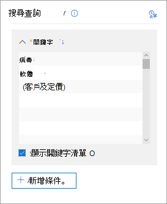

# 在核心 eDiscovery 案例中搜尋內容Search for content in a Core eDiscovery case

在建立核心 eDiscovery 案例，並將案例中的相關人員設定為暫止狀態之後，您可以建立並執行一或多個搜尋與案例相關的內容。After a Core eDiscovery case is created and people of interest in the case are placed on hold, you can create and run one or more searches for content relevant to the case. 與核心 eDiscovery 案例相關聯的搜尋並未列在 Microsoft 365 規範中心的「**內容搜尋**」頁面上。Searches associated with a Core eDiscovery case aren't listed on the **Content search** page in the Microsoft 365 compliance center. 這些搜尋會列在核心 eDiscover 案例的 [**搜尋**] 頁面上，與搜尋產生關聯。These searches are listed on the **Searches** page of the Core eDiscover case the searches are associated with. 這也表示只有案例成員才能存取與案例相關聯的搜尋。This also means that searches associated with a case can only be accessed by case members.

若要建立核心 eDiscovery 搜尋：To create a Core eDiscovery search:
  
1. 移至[https://compliance.microsoft.com](https://compliance.microsoft.com)並登入使用已獲指派適當 eDiscovery 許可權之使用者帳戶的認證。Go to [https://compliance.microsoft.com](https://compliance.microsoft.com) and sign in using the credentials for user account that has been assigned the appropriate eDiscovery permissions.

2. 在 Microsoft 365 規範中心的左功能窗格中，按一下 [**全部顯示**]，然後按一下 [ **eDiscovery > Core**]。In the left navigation pane of the Microsoft 365 compliance center, click **Show all**, and then click **eDiscovery > Core**.

3. 在 [**核心電子**檔探索] 頁面上，選取您要建立相關聯搜尋的案例，然後按一下 [**開啟案例**]。On the **Core eDiscovery** page, select the case that you want to create an associated search, and then click **Open case**.

4. 在案例的**首頁**上，按一下 [**搜尋**] 索引標籤。On the **Home** page for the case, click the **Searches** tab.
  
5. 在 [**搜尋**] 頁面上，按一下 [**新增搜尋**]。On the **Search** page, click **New search**.

6. 在 [新搜尋]\*\*\*\* 頁面上，您可以新增關鍵字和條件來建立搜尋查詢。On the **New search** page, you can add keywords and conditions to create the search query. 

    
  
   a.a. 您可以指定關鍵字、郵件內容（如已傳送和接收的日期）或檔案屬性（例如，檔案名或檔最後變更的日期）。You can specify keywords, message properties, such as sent and received dates, or document properties, such as file names or the date that a document was last changed. 您可以使用更複雜的查詢，使用布林運算子，例如**AND**、 **or**、 **NOT**、 **NEAR**或**ONEAR**。You can use more complex queries that use a Boolean operator, such as **AND**, **OR**, **NOT**, **NEAR**, or **ONEAR**. 您也可以搜尋文件中的機密資訊 (如身分證號碼) 或搜尋曾在外部共用的文件。You can also search for sensitive information (such as social security numbers) in documents, or search for documents that have been shared externally. 如果 [關鍵字] 方塊保留空白，則搜尋結果中會包含位於指定內容位置的所有內容。If you leave the keyword box empty, all content located in the specified content locations will be included in the search results.

   b.b. 您可以按一下 [**顯示關鍵字清單**] 核取方塊，然後在每一列中輸入關鍵字。You can click the **Show keyword list** check box and the type a keyword in each row. 如果您這麼做，每列的關鍵字會在建立的搜尋查詢中由**OR**運算子連線。If you do this, the keywords on each row are connected by the **OR** operator in the search query that's created. 您最多可以在清單中輸入20個關鍵字。You can enter a maximum of 20 keywords to the list.

    
  
    為什麼要使用關鍵字清單？Why use the keyword list? 您可以取得會顯示有多少個項目符合每個關鍵字的統計資料。You can get statistics that show how many items match each keyword. 這可協助您快速找出哪些關鍵字最有效(和最不有效)。This can help you quickly identify which keywords are the most (and least) effective. 您也可以在一列中使用關鍵字片語 (以括號括住)。You can also use a keyword phrase (surrounded by parentheses) in a row. 如需搜尋統計資料的詳細資訊，請參閱[檢視內容搜尋結果的關鍵字統計資料](view-keyword-statistics-for-content-search.md)。For more information about search statistics, see [View keyword statistics for Content Search results](view-keyword-statistics-for-content-search.md).

    如需使用關鍵字清單的詳細資訊，請參閱[建立搜尋查詢](content-search.md#building-a-search-query)。For more information about using the keywords list, see [Building a search query](content-search.md#building-a-search-query).

   c.c. 您可以按一下 [**條件**] 和 [將條件新增至搜尋查詢]，以縮小搜尋範圍，並傳回更精緻的結果集。You can click **Conditions** and add conditions to a search query to narrow a search and return a more refined set of results. 每個條件會將一個子句新增至 KQL 搜尋查詢，當您啟動搜尋時便會建立並執行。Each condition adds a clause to the KQL search query that is created and run when you start the search. 條件會以 **AND** 運算子的邏輯方式連接至關鍵字查詢 (在關鍵字方塊中指定)。A condition is logically connected to the keyword query (specified in the keyword box) by the **AND** operator. 這表示專案必須同時滿足關鍵字查詢和結果中所包含的每個條件。That means that items have to satisfy both the keyword query and each condition to be included in the results. 這是條件協助縮小搜尋結果的方式。This is how conditions help to narrow your results.

    如需建立搜尋查詢和使用條件的相關資訊，請參閱 [Keyword queries for Content Search](keyword-queries-and-search-conditions.md)。For more information about creating a search query and using conditions, see [Keyword queries for Content Search](keyword-queries-and-search-conditions.md).

7. 在 [**位置：保留位置**] 底下，選擇您要搜尋的內容位置。Under **Locations: locations on hold**, choose the content locations that you want to search. 您可以在同一個搜尋中搜尋信箱、網站和公用資料夾。You can search mailboxes, sites, and public folders in the same search.

    
  
    - **所有位置**。**All locations**. 選取此選項，可搜尋組織中的所有內容位置。Select this option to search all content locations in your organization. 當您選取此選項時，您可以選擇搜尋所有的 Exchange 信箱（包括所有 Microsoft 小組、Yammer 群組和 Office 365 群組的信箱），所有的 SharePoint 和 OneDrive 商務網站（包括所有 Microsoft 團隊、Yammer 群組和 Office 365 群組的網站）和所有公用資料夾。When you select this option, you can choose to search all Exchange mailboxes (which includes the mailboxes for all Microsoft Teams, Yammer Groups, and Office 365 Groups), all SharePoint and OneDrive for Business sites (which includes the sites for all Microsoft Teams, Yammer Groups, and Office 365 Groups), and all public folders.
    
    - **保留所有位置**。**All locations on hold**. 選取此選項，可搜尋案例中已放入 eDiscovery 暫止的所有內容位置。Select this option to search all the content locations that have been placed on eDiscovery hold in the case. 若案例中包含多個保留，將會搜尋所有保留的內容位置。If the case contains multiple holds, the content locations from all holds will be searched. 此外，如果內容位置是放在查詢型保留中，當您執行您在此步驟中建立的內容搜尋時，只會搜尋保留的專案。Additionally, if a content location was placed on a query-based hold, only the items that are on hold will be searched when you run the content search that you're creating in this step. 例如，如果使用者已設定為以查詢為基礎的案例保留，可保留在特定日期之前已傳送或建立的專案，則只會搜尋這些專案。For example, if a user was placed on query-based case hold that preserves items that were sent or created before a specific date, only those items would be searched. 這是透過以**and**運算子連接案例保留查詢和內容搜尋查詢來完成。This is accomplished by connecting the case hold query and the content search query by an **AND** operator. 如需詳細資訊，請參閱[eDiscovery hold 上的搜尋位置](create-ediscovery-holds.md#search-locations-on-ediscovery-hold)。For more information, see [Search locations on eDiscovery hold](create-ediscovery-holds.md#search-locations-on-ediscovery-hold).
    
    - **特定位置**。**Specific locations**. 選取這個選項，選取您要搜尋的信箱和網站。Select this option to select the mailboxes and sites that you want to search. 當您選取此選項並按一下 [**修改**] 時，會顯示位置清單。When you select this option and click **Modify**, a list of locations appears. 您可以選擇搜尋任何或所有使用者、群組、小組或網站位置。You can choose to search any or all users, groups, teams, or site locations. 您也可以搜尋組織中的公用資料夾。You can also search the public folders in your organization.
    
      
  
     如果您選取此選項，並且搜尋保留的任何內容位置，則不會將查詢型案例保留中的任何查詢套用到搜尋查詢。If you select this option and search any content location that's on hold, any query from a query-based case hold won't be applied to the search query. 換句話說，只會搜尋所有內容，而不只是以查詢為基礎的案例保留所保留的內容。In other words, all content is searched, not just the content that's preserved by a query-based case hold.

8. 選取要搜尋的內容位置之後，請按一下 [**完成**]，然後按一下 [**儲存**]。After you select the content locations to search, click **Done** and then click **Save**.

9. 在 [**新增搜尋**] 頁面上，按一下 [**儲存 & 執行**]，然後輸入搜尋的名稱。On the **New search** page, click **Save & run** and then type a name for the search. 與核心 eDiscovery 案例相關聯的搜尋必須在您的 Office 365 組織內有唯一的名稱。Searches associated with a Core eDiscovery case must have names that are unique within your Office 365 organization.

10. 按一下 [**儲存**] 以儲存搜尋設定並開始搜尋。Click **Save** to save the search settings and start the search.

  在搜尋完成之後，您可以預覽搜尋結果。After the search is completed, you can preview the search results. 如有必要，**請按一下**[**搜尋**] 頁面上的 [重新整理]，以顯示您在清單中建立的搜尋。If necessary, click **Refresh** on the **Searches** page to display the search you created in the list.

11. 按一下搜尋以顯示飛入頁面，其中包含搜尋的統計資料，以及執行其他工作，例如，查看搜尋統計資料及匯出搜尋結果。Click the search to display the flyout page, which contains statistics about the search and to perform other tasks such as viewing search statistics and exporting the search results.

## 搜尋內容位置的詳細資訊More information about searching content locations

- 當您按一下 **[選擇使用者、群組或小組**以指定要搜尋的信箱] 時，顯示的信箱選擇器會是空的。When you click **Choose users, groups, or teams** to specify mailboxes to search, the mailbox picker that's displayed is empty. 這項設計的目的是提升效能。This is by design to enhance performance. 若要將收件者新增至此清單，請按一下 **[選擇使用者、群組或小組**]，然後在搜尋方塊中輸入名稱（至少3個字元），選取名稱旁邊的核取方塊，然後按一下 **[選擇**]。To add recipients to this list, click **Choose users, groups, or teams**, type a name (a minimum of 3 characters) in the search box, select the check box next to the name, and then click **Choose**.

- 您可以將非使用中的信箱、Microsoft 團隊、Yammer 群組、Office 365 群組和通訊群組新增至要搜尋的信箱清單。You can add inactive mailboxes, Microsoft Teams, Yammer Groups, Office 365 Groups, and distribution groups to the list of mailboxes to search. 不支援動態通訊群組。Dynamic distribution groups aren't supported. 如果您新增 Microsoft 團隊、Yammer 群組或 Office 365 群組，則會搜尋群組或小組信箱;不會搜尋群組成員的信箱。If you add Microsoft Teams, Yammer Groups, or Office 365 Groups, the group or team mailbox is searched; the mailboxes of the group members aren't searched.

- 若要新增網站，請按一下 **[選擇網站**]，再按一下 **[選擇網站**]，然後輸入您要搜尋之每個網站的 URL。To add sites click **Choose sites**, click **Choose sites** again, and then type the URL for each site that you want to search. 您也可以為 Microsoft 團隊、Yammer 群組或 Office 365 群組新增 SharePoint 網站的 URL。You can also add the URL for the SharePoint site for a Microsoft Team, a Yammer Group, or an Office 365 Group.
