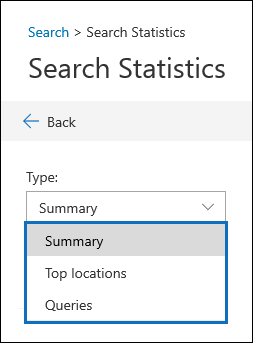

# 搜尋統計資料Search statistics

調查資料事件時，驗證搜尋結果的有效方式，就是查看搜尋結果的統計資料，以確定其符合您的預期。An effective way to validate your search results when investigation a data incident is to view the statistics about your search results to make sure they align with your expectations. 當搜尋執行完畢時，下列高層級的統計資料會顯示在 [搜尋詳細資料] 浮出頁面的 [**狀態**] 底下：When a search as finished running, the following high-level statistics are displayed under **Status** on the search details flyout page:

- 符合搜尋準則之專案的預估數目和大小。The estimated number and size of items that matched the search criteria.

- 部分索引項目目（也稱為未編制索引的*專案*）的數目和大小，這些專案不可搜尋，但位於搜尋中所包含的內容位置中。The number and size of partially indexed items (also called *unindexed items*) that aren't searchable but that were found in the content locations that were included in the search.

- 已搜尋的信箱和網站數目。The number of mailboxes and sites that were searched.

若要查看詳細的統計資料，請按一下 [搜尋詳細資料] 彈出頁面上的 [**統計資料]**To view more detailed statistics, click **Statistics** on the search details flyout page. 在 [**搜尋統計資料]** 頁面上，您可以查看搜尋摘要、包含符合搜尋結果之專案的頂端位置，以及搜尋查詢的詳細統計資料。On the **Search statistics** page, you can view the search summary, the top location that contained items that matched the search results, and detailed statistics about the search query.

## 摘要Summary

在**摘要**視圖中，您可以看到搜尋結果依位置類型所細分（例如，位置包含 Exchange 信箱和 SharePoint 網站）。In the **Summary** view, you can see the search results broken down by location type (for example, locations include Exchange mailboxes and SharePoint sites). 每個位置類型會顯示下列資訊：The following information is displayed for each location type:

- 專案符合搜尋準則的位置數目。The number of locations that had items that matched the search criteria.

- 每個符合搜尋準則的位置類型中的專案總數。The total number of items from each location type that matched the search criteria.

- 符合搜尋準則之每個位置類型專案的總大小。The total size of items from each location type that matched the search criteria.

## 主要位置Top locations

在 [**頂端位置**] 視圖中，您會看到專案中的個別內容位置，其專案與搜尋準則相符。In the **Top locations** view, you see the individual content locations with the most items that matched the search criteria. 針對每個內容位置，會顯示下列資訊：For each content location, the following information is displayed:

- 位置的名稱;信箱的電子郵件地址，以及 SharePoint 網站的 URLThe name of the location; the email address for mailboxes and the URL for SharePoint sites

- 位置類型The location type

- 符合搜尋準則的專案數Number of items that matched the search criteria

- 符合搜尋準則之所有專案的總大小。The total size of all items that matched the search criteria.

## 查詢Queries

在 [**查詢**] 視圖中，您可以查看每個搜尋查詢元件的詳細資料。In the **Queries** view, you can see detailed statistics for each component of the search query. [！注意] 如果您在搜尋查詢中使用關鍵字清單，您可以在**查詢**視圖中查看增強的統計資料，以顯示符合每個關鍵字或關鍵字片語的專案數。If you used the keyword list in the search query, you can view enhanced statistics in the **Queries** view  that show how many items match each keyword or keyword phrase. 這可協助您快速識別查詢的哪些部分最為有效（也是最低）。This can help you quickly identify which parts of the query are the most (and least) effective. 

下列資訊會顯示在 [**查詢**] 視圖中：The following information is displayed in the **Queries** view:

 - **位置類型**-列中所顯示之統計資料的內容位置類型。**Location type** - The type of content location for the statistics displayed in the row.

- **Part** -此欄會顯示下列其中一個值： **Primary**或**關鍵字**。**Part** - This column will display one of the following values: **Primary** or **Keyword**. **主要**表示列是針對整個查詢所呈現的統計資料;**關鍵字**表示列中的統計資料是針對其中一個查詢元件。**Primary** means the row presents statistics on the entire query; **Keyword** means the statistics in the row are for one of the query components.

- **Condition** -列所參照之搜尋查詢的實際查詢元件。**Condition** - The actual query component of the search query the row refers to. 如果**Part**欄中的值為**主要**值，則會顯示整個搜尋查詢的統計資料。如果值為**關鍵字**，則會顯示 [**查詢**] 欄中所顯示之查詢元件的統計資料。If the value in the **Part** column is **Primary**, then the statistics for the entire search query are displayed; if the value is **Keyword**, then the statistics for the component of the query shown in the **Query** column are displayed. 例如，如果使用關鍵字清單，則會顯示其中一個關鍵字的統計資料。For example, if the keyword list was used, then the statistics one of the keywords are displayed.

  以下是有關 [**查詢**] 欄中所顯示之統計資料的一些其他事項：Here are some other things to know about the statistics displayed in the **Queries** column:
  
  - 當您搜尋信箱中的所有內容（但未指定任何關鍵字）時，實際的查詢是 **（大小 >= 0）** ，因此會傳回所有專案。When you search for all content in mailboxes (by not specifying any keywords), the actual query is **(size >= 0)** so that all items are returned
  
  - 當您搜尋 SharePoint 和 OneDrive 網站時，會將下列兩個元件新增至搜尋查詢：When you search SharePoint and OneDrive sites, the two following components are added to the search query:
    
    **不 IsExternalContent:1** -這會排除內部部署 SharePoint 組織中的任何內容**NOT IsExternalContent:1** - This excludes any content from an on-premises SharePoint organization
    
    **非 isOneNotePage： 1-不**包括所有的 OneNote 檔案，因為這會是符合搜尋查詢之任何檔的重複專案。**NOT isOneNotePage:1** - This excludes all OneNote files because these would be duplicates of any document that matches the search query.

- **搜尋中的位置**具有符合搜尋查詢的專案的內容位置，顯示在列中的 part/condition。**Locations in search** The number of content locations that had items that matched the search query for the part/condition displayed in the row. 請注意，如果封存信箱包含符合搜尋準則的專案，則會算作個別的位置。Note that archive mailboxes are counted as a separate location if they contain items that match the search criteria.

- **Items** -符合顯示在列中之 part/condition 之搜尋準則的專案總數。**Items** - The total number of items that matched the search criteria for the part/condition displayed in the row.

- **Size** -符合顯示在列中之 part/condition 之搜尋準則的專案總數。**Size** - The total number of items that matched the search criteria for the part/condition displayed in the row.

