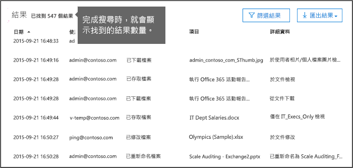
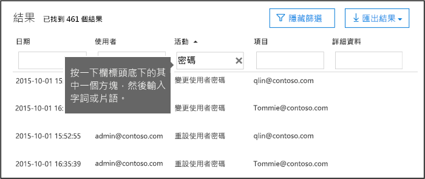
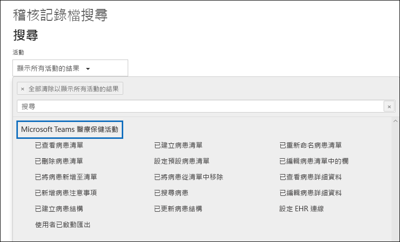

# <a name="search-the-audit-log-in-the-security--compliance-center"></a><span data-ttu-id="870aa-103">在安全性與合規性中心搜尋稽核記錄</span><span class="sxs-lookup"><span data-stu-id="870aa-103">Search the audit log in the Security & Compliance Center</span></span>

## <a name="introduction"></a><span data-ttu-id="870aa-104">簡介</span><span class="sxs-lookup"><span data-stu-id="870aa-104">Introduction</span></span>

<span data-ttu-id="870aa-105">需要了解是否有使用者已檢視特定文件或清除信箱中的項目嗎？</span><span class="sxs-lookup"><span data-stu-id="870aa-105">Need to find if a user viewed a specific document or purged an item from their mailbox?</span></span> <span data-ttu-id="870aa-106">如果是，您可以使用 Office 365 安全性與合規性中心來搜尋統一的稽核記錄，檢視 Office 365 組織中的使用者和系統管理員活動。</span><span class="sxs-lookup"><span data-stu-id="870aa-106">If so, you can use the Office 365 Security & Compliance Center to search the unified audit log to view user and administrator activity in your Office 365 organization.</span></span> <span data-ttu-id="870aa-107">為什麼使用整合的稽核記錄？</span><span class="sxs-lookup"><span data-stu-id="870aa-107">Why a unified audit log?</span></span> <span data-ttu-id="870aa-108">因為您可以在 Office 365 中搜尋下列類型的使用者和系統管理員活動：</span><span class="sxs-lookup"><span data-stu-id="870aa-108">Because you can search for the following types of user and admin activity in Office 365:</span></span>

- <span data-ttu-id="870aa-109">SharePoint Online 和商務用 OneDrive 中的使用者活動</span><span class="sxs-lookup"><span data-stu-id="870aa-109">User activity in SharePoint Online and OneDrive for Business</span></span>

- <span data-ttu-id="870aa-110">Exchange Online 中的使用者活動 (Exchange 信箱稽核記錄)</span><span class="sxs-lookup"><span data-stu-id="870aa-110">User activity in Exchange Online (Exchange mailbox audit logging)</span></span>

- <span data-ttu-id="870aa-111">SharePoint Online 中的系統管理員活動</span><span class="sxs-lookup"><span data-stu-id="870aa-111">Admin activity in SharePoint Online</span></span>

- <span data-ttu-id="870aa-112">Azure Active Directory (適用於 Office 365 的目錄服務) 中的系統管理員活動</span><span class="sxs-lookup"><span data-stu-id="870aa-112">Admin activity in Azure Active Directory (the directory service for Office 365)</span></span>

- <span data-ttu-id="870aa-113">Exchange Online 中的系統管理員活動 (Exchange 系統管理員稽核記錄)</span><span class="sxs-lookup"><span data-stu-id="870aa-113">Admin activity in Exchange Online (Exchange admin audit logging)</span></span>

- <span data-ttu-id="870aa-114">Sway 中的使用者和系統管理員活動</span><span class="sxs-lookup"><span data-stu-id="870aa-114">User and admin activity in Sway</span></span>

- <span data-ttu-id="870aa-115">安全性與合規性中心中的電子文件探索活動</span><span class="sxs-lookup"><span data-stu-id="870aa-115">eDiscovery activities in the security and compliance center</span></span>

- <span data-ttu-id="870aa-116">Power BI 中的使用者和系統管理員活動</span><span class="sxs-lookup"><span data-stu-id="870aa-116">User and admin activity in Power BI</span></span>

- <span data-ttu-id="870aa-117">Microsoft Teams 中的使用者和系統管理員活動</span><span class="sxs-lookup"><span data-stu-id="870aa-117">User and admin activity in Microsoft Teams</span></span>

- <span data-ttu-id="870aa-118">Dynamics 365 中的使用者和系統管理員活動</span><span class="sxs-lookup"><span data-stu-id="870aa-118">User and admin activity in Dynamics 365</span></span>

- <span data-ttu-id="870aa-119">Yammer 中的使用者和系統管理員活動</span><span class="sxs-lookup"><span data-stu-id="870aa-119">User and admin activity in Yammer</span></span>

- <span data-ttu-id="870aa-120">Microsoft Flow 中的使用者和系統管理員活動</span><span class="sxs-lookup"><span data-stu-id="870aa-120">User and admin activity in Microsoft Flow</span></span>

- <span data-ttu-id="870aa-121">Microsoft Stream 中的使用者和系統管理員活動</span><span class="sxs-lookup"><span data-stu-id="870aa-121">User and admin activity in Microsoft Stream</span></span>

- <span data-ttu-id="870aa-122">Microsoft 工作場所分析中的分析師和系統管理員活動</span><span class="sxs-lookup"><span data-stu-id="870aa-122">Analyst and admin activity in Microsoft Workplace Analytics</span></span>

- <span data-ttu-id="870aa-123">Microsoft PowerApps 中的使用者和系統管理員活動</span><span class="sxs-lookup"><span data-stu-id="870aa-123">User and admin activity in Microsoft PowerApps</span></span>

- <span data-ttu-id="870aa-124">Microsoft Flow 中的使用者和系統管理員活動</span><span class="sxs-lookup"><span data-stu-id="870aa-124">User and admin activity in Microsoft Forms</span></span>

## <a name="before-you-begin"></a><span data-ttu-id="870aa-125">開始之前</span><span class="sxs-lookup"><span data-stu-id="870aa-125">Before you begin</span></span>

<span data-ttu-id="870aa-126">在您開始搜尋 Office 365 稽核記錄前，請務必閱讀下列項目。</span><span class="sxs-lookup"><span data-stu-id="870aa-126">Be sure to read the following items before you start searching the Office 365 audit log.</span></span>

- <span data-ttu-id="870aa-127">您 (或其他系統管理員) 必須先開啟稽核記錄，才能開始搜尋 Office 365 稽核記錄。</span><span class="sxs-lookup"><span data-stu-id="870aa-127">You (or another admin) must first turn on audit logging before you can start searching the Office 365 audit log.</span></span> <span data-ttu-id="870aa-128">按一下「安全性與合規性中心」中 **[稽核記錄搜尋]** 頁面上的 **[開啟稽核]**，即可開啟此功能。</span><span class="sxs-lookup"><span data-stu-id="870aa-128">To turn it on, click **Start recording user and admin activity** on the **Audit log search** page in the Security & Compliance Center.</span></span> <span data-ttu-id="870aa-129">(如果您沒看到此連結，表示您的組織已開啟稽核功能。) 開啟此功能後，就會顯示一則訊息，表示正在準備稽核記錄，而您可以在準備完成 (約幾小時) 後執行搜尋。</span><span class="sxs-lookup"><span data-stu-id="870aa-129">(If you don't see this link, auditing has already been turned on for your organization.) After you turn it on, a message is displayed that says the audit log is being prepared and that you can run a search in a couple of hours after the preparation is complete.</span></span> <span data-ttu-id="870aa-130">此操作只需執行一次。</span><span class="sxs-lookup"><span data-stu-id="870aa-130">You only have to do this once.</span></span> <span data-ttu-id="870aa-131">如需詳細資訊，請參閱[開啟或關閉稽核記錄搜尋](turn-audit-log-search-on-or-off.md)。</span><span class="sxs-lookup"><span data-stu-id="870aa-131">For more information, see [Turn Office 365 audit log search on or off](turn-audit-log-search-on-or-off.md).</span></span>

  > [!NOTE]
  > <span data-ttu-id="870aa-132">我們還在設法讓稽核功能可預設為開啟。</span><span class="sxs-lookup"><span data-stu-id="870aa-132">We're in the process of turning on auditing by default.</span></span> <span data-ttu-id="870aa-133">在那之前，您可以如上述方法來開啟該功能。</span><span class="sxs-lookup"><span data-stu-id="870aa-133">Until then, you can turn it on as previously described.</span></span>

- <span data-ttu-id="870aa-134">您必須在 Exchange Online 中獲派為 [僅限檢視稽核記錄] 或 [稽核記錄] 角色，才能搜尋 Office 365 稽核記錄。</span><span class="sxs-lookup"><span data-stu-id="870aa-134">You have to be assigned the View-Only Audit Logs or Audit Logs role in Exchange Online to search the Office 365 audit log.</span></span> <span data-ttu-id="870aa-135">根據預設，這些角色會在 Exchange 系統管理員中心的 [權限]\*\*\*\* 頁面上，指派給 [法務遵循管理] 和 [組織管理] 角色群組。</span><span class="sxs-lookup"><span data-stu-id="870aa-135">By default, these roles are assigned to the Compliance Management and Organization Management role groups on the **Permissions** page in the Exchange admin center.</span></span> <span data-ttu-id="870aa-136">請注意，Office 365 和 Microsoft 365 中的全域系統管理員會自動成為 Exchange Online 中 [組織管理] 角色群組的成員。</span><span class="sxs-lookup"><span data-stu-id="870aa-136">Note Global administrators in Office 365 and Microsoft 365 are automatically added as members of the Organization Management role group in Exchange Online.</span></span> <span data-ttu-id="870aa-137">若要提供使用者能夠搜尋 Office 365 稽核記錄的最低權限等級，您可以在 Exchange Online 中建立自訂角色群組、新增 [僅限檢視稽核記錄] 或 [稽核記錄] 角色，然後將使用者加入這個新的角色群組成為其中的成員。</span><span class="sxs-lookup"><span data-stu-id="870aa-137">To give a user the ability to search the Office 365 audit log with the minimum level of privileges, you can create a custom role group in Exchange Online, add the View-Only Audit Logs or Audit Logs role, and then add the user as a member of the new role group.</span></span> <span data-ttu-id="870aa-138">如需詳細資訊，請參閱[管理 Exchange Online 中的角色群組](https://go.microsoft.com/fwlink/p/?LinkID=730688)。</span><span class="sxs-lookup"><span data-stu-id="870aa-138">For more information, see [Manage role groups in Exchange Online](https://go.microsoft.com/fwlink/p/?LinkID=730688).</span></span>

  > [!IMPORTANT]
  > <span data-ttu-id="870aa-139">如果您在安全性與合規性中心的 [權限]\*\*\*\* 頁面上，將 [僅限檢視稽核記錄] 或 [稽核記錄] 角色指派給使用者，使用者將無法搜尋 Office 365 稽核記錄。</span><span class="sxs-lookup"><span data-stu-id="870aa-139">If you assign a user the View-Only Audit Logs or Audit Logs role on the **Permissions** page in the Security & Compliance Center, they won't be able to search the Office 365 audit log.</span></span> <span data-ttu-id="870aa-140">您必須在 Exchange Online 中指派權限。</span><span class="sxs-lookup"><span data-stu-id="870aa-140">You have to assign the permissions in Exchange Online.</span></span> <span data-ttu-id="870aa-141">這是因為用來搜尋稽核記錄的基礎 Cmdlet 是 Exchange Online Cmdlet。</span><span class="sxs-lookup"><span data-stu-id="870aa-141">This is because the underlying cmdlet used to search the audit log is an Exchange Online cmdlet.</span></span>

- <span data-ttu-id="870aa-142">當使用者或系統管理員執行稽核的活動時，稽核記錄會隨即產生，並儲存在您組織的 Office 365 稽核記錄中。</span><span class="sxs-lookup"><span data-stu-id="870aa-142">When an audited activity is performed by a user or admin, an audit record is generated and stored in the Office 365 audit log for your organization.</span></span> <span data-ttu-id="870aa-143">稽核記錄的保留時間及可在稽核記錄中搜尋的時間長度，取決於您的 Office 365 訂閱，具體來說，取決於指派給特定使用者的授權類型。</span><span class="sxs-lookup"><span data-stu-id="870aa-143">The length of time that an audit record is retained (and searchable in the audit log) depends on your Office 365 subscription, and specifically the type of the license that is assigned to a specific user.</span></span>

  - <span data-ttu-id="870aa-144">**Office 365 E3：** 稽核記錄會保留 90 天。</span><span class="sxs-lookup"><span data-stu-id="870aa-144">**Office 365 E3:** Audit records are retained for 90 days.</span></span> <span data-ttu-id="870aa-145">這表示您可以搜尋稽核記錄來尋找過去 90 天中執行的活動。</span><span class="sxs-lookup"><span data-stu-id="870aa-145">That means you can search the audit log for activities that were performed within the last 90 days.</span></span>

    > [!NOTE]
    > <span data-ttu-id="870aa-146">即使信箱稽核預設為開啟，您可能會發現某些使用者的信箱稽核事件在安全性與合規性中心的稽核記錄搜尋或透過 Office 365 管理活動 API 找不到。</span><span class="sxs-lookup"><span data-stu-id="870aa-146">Even when mailbox auditing on by default is turned on, you might notice that mailbox audit events for some users aren't found in audit log searches in the Security & Compliance Center or via the Office 365 Management Activity API.</span></span> <span data-ttu-id="870aa-147">如需詳細資訊，請參閱[信箱稽核記錄的相關資訊](enable-mailbox-auditing.md#more-information)。</span><span class="sxs-lookup"><span data-stu-id="870aa-147">For more information, see [More information about mailbox audit logging](enable-mailbox-auditing.md#more-information).</span></span>

  - <span data-ttu-id="870aa-148">**Office 365 E5：** 稽核記錄也會保留 90 天。</span><span class="sxs-lookup"><span data-stu-id="870aa-148">**Office 365 E5:** Audit records are also retained for 90 days.</span></span> <span data-ttu-id="870aa-149">E5 使用者與具有 E3 授權及 Office 365 進階合規性附加元件授權的使用者，最終可保留稽核記錄一年。</span><span class="sxs-lookup"><span data-stu-id="870aa-149">Retaining audit records for one year may eventually be available for E5 users and users with an E3 license and an Office 365 Advanced Compliance add-on license.</span></span>

    > [!NOTE]
    > <span data-ttu-id="870aa-150">E5 組織 (或 E3 組織中具有進階合規性附加元件授權的使用者) 的稽核記錄一年保留期的私人預覽方案將不再接受新註冊。</span><span class="sxs-lookup"><span data-stu-id="870aa-150">The private preview program for the one-year retention period for audit records for E5 organizations (or for users in E3 organizations that have Advanced Compliance add-on licenses) is closed to new enrollment.</span></span> <span data-ttu-id="870aa-151">本文會在一年保留期可公開預覽或正式發行時進行更新。</span><span class="sxs-lookup"><span data-stu-id="870aa-151">This article will be updated when the one-year retention period is available in public preview or released for general availability.</span></span>

- <span data-ttu-id="870aa-152">如果您想要關閉貴組織在 Office 365 中的稽核記錄搜尋功能，您可以在與 Exchange Online 組織連線的遠端 PowerShell 中執行下列命令：</span><span class="sxs-lookup"><span data-stu-id="870aa-152">If you want to turn off audit log search in Office 365 for your organization, you can run the following command in remote PowerShell connected to your Exchange Online organization:</span></span>

  ```powershell
  Set-AdminAuditLogConfig -UnifiedAuditLogIngestionEnabled $false
  ```

    <span data-ttu-id="870aa-153">若要再次開啟稽核搜尋，您可以在 Exchange Online PowerShell 中執行下列命令：</span><span class="sxs-lookup"><span data-stu-id="870aa-153">To turn on audit search again, you can run the following command in Exchange Online PowerShell:</span></span>

  ```powershell
  Set-AdminAuditLogConfig -UnifiedAuditLogIngestionEnabled $true
  ```

  <span data-ttu-id="870aa-154">如需詳細資訊，請參閱[關閉 Office 365 中的稽核記錄搜尋](turn-audit-log-search-on-or-off.md)。</span><span class="sxs-lookup"><span data-stu-id="870aa-154">For more information, see [Turn off audit log search in Office 365](turn-audit-log-search-on-or-off.md).</span></span>

- <span data-ttu-id="870aa-155">如先前所述，用來搜尋稽核記錄的基礎 Cmdlet 是 Exchange Online Cmdlet，也就是 **Search-UnifiedAuditLog**。</span><span class="sxs-lookup"><span data-stu-id="870aa-155">As previously stated, the underlying cmdlet used to search the audit log is an Exchange Online cmdlet, which is **Search-UnifiedAuditLog**.</span></span> <span data-ttu-id="870aa-156">這表示您可以使用此 Cmdlet 來搜尋 Office 365 稽核記錄，而不是使用安全性與合規性中心中的 [稽核記錄搜尋]\*\*\*\* 頁面。</span><span class="sxs-lookup"><span data-stu-id="870aa-156">That means you can use this cmdlet to search the Office 365 audit log instead of using the **Audit log search** page in the Security & Compliance Center.</span></span> <span data-ttu-id="870aa-157">您必須在連線到 Exchange Online 組織的遠端 PowerShell，執行此 Cmdlet。</span><span class="sxs-lookup"><span data-stu-id="870aa-157">You have to run this cmdlet in remote PowerShell connected to your Exchange Online organization.</span></span> <span data-ttu-id="870aa-158">如需詳細資訊，請參閱 [Search-UnifiedAuditLog](https://go.microsoft.com/fwlink/p/?linkid=834776)。</span><span class="sxs-lookup"><span data-stu-id="870aa-158">For more information, see [Search-UnifiedAuditLog](https://go.microsoft.com/fwlink/p/?linkid=834776).</span></span>

  <span data-ttu-id="870aa-159">若要了解如何將 **Search-UnifiedAuditLog** Cmdlet 所傳回的搜尋結果匯出為 CSV 檔案，請參閱[匯出、設定及檢視稽核記錄檔的記錄](export-view-audit-log-records.md#tips-for-exporting-and-viewing-the-audit-log)中的＜匯出及檢視稽核記錄的秘訣＞一節。</span><span class="sxs-lookup"><span data-stu-id="870aa-159">For information about exporting the search results returned by the **Search-UnifiedAuditLog** cmdlet to a CSV file, see the "Tips for exporting and viewing the audit log" section in [Export, configure, and view audit log records](export-view-audit-log-records.md#tips-for-exporting-and-viewing-the-audit-log).</span></span>

- <span data-ttu-id="870aa-160">如果您想要以程式設計方式從 Office 365 稽核記錄下載資料，我們建議您使用 Office 365 管理活動 API，而非使用 PowerShell 指令碼。</span><span class="sxs-lookup"><span data-stu-id="870aa-160">If you want to programmatically download data from the Office 365 audit log, we recommend that you use the Office 365 Management Activity API instead of using a PowerShell script.</span></span> <span data-ttu-id="870aa-161">Office 365 管理活動 API 是一個 REST Web 服務，可用於為貴組織開發作業、安全性以及合規性的監控解決方案。</span><span class="sxs-lookup"><span data-stu-id="870aa-161">The Office 365 Management Activity API is a REST web service that you can use to develop operations, security, and compliance monitoring solutions for your organization.</span></span> <span data-ttu-id="870aa-162">如需詳細資訊，請參閱 [Office 365 管理活動 API 參考](https://docs.microsoft.com/office/office-365-management-api/office-365-management-activity-api-reference)。</span><span class="sxs-lookup"><span data-stu-id="870aa-162">For more information, see [Office 365 Management Activity API reference](https://docs.microsoft.com/office/office-365-management-api/office-365-management-activity-api-reference).</span></span>

- <span data-ttu-id="870aa-163">發生事件後，對應的稽核記錄項目最多可能需要 30 分鐘或 24 小時才會顯示在搜尋結果中。</span><span class="sxs-lookup"><span data-stu-id="870aa-163">It can take up to 30 minutes or up to 24 hours after an event occurs for the corresponding audit log entry to be displayed in the search results.</span></span> <span data-ttu-id="870aa-164">下列表格顯示不同 Office 365 服務的所需時間。</span><span class="sxs-lookup"><span data-stu-id="870aa-164">The following table shows the time it takes for the different services in Office 365.</span></span>

  |<span data-ttu-id="870aa-165">**Office 365 服務**</span><span class="sxs-lookup"><span data-stu-id="870aa-165">**Office 365 service**</span></span>|<span data-ttu-id="870aa-166">**30 分鐘**</span><span class="sxs-lookup"><span data-stu-id="870aa-166">**30 minutes**</span></span>|<span data-ttu-id="870aa-167">**24 小時**</span><span class="sxs-lookup"><span data-stu-id="870aa-167">**24 hours**</span></span>|
  |:-----|:-----:|:-----:|
  |<span data-ttu-id="870aa-168">進階威脅防護和威脅情報</span><span class="sxs-lookup"><span data-stu-id="870aa-168">Advanced Threat Protection and Threat Intelligence</span></span>|||
  |<span data-ttu-id="870aa-170">Azure Active Directory (使用者登入活動)</span><span class="sxs-lookup"><span data-stu-id="870aa-170">Azure Active Directory (user login events)</span></span>|||
  |<span data-ttu-id="870aa-172">Azure Active Directory (系統管理員活動)</span><span class="sxs-lookup"><span data-stu-id="870aa-172">Azure Active Directory (admin events)</span></span>|||
  |<span data-ttu-id="870aa-174">資料遺失防護</span><span class="sxs-lookup"><span data-stu-id="870aa-174">Data Loss Prevention</span></span>|||
  |<span data-ttu-id="870aa-176">Dynamics 365 CRM</span><span class="sxs-lookup"><span data-stu-id="870aa-176">Dynamics 365 CRM</span></span>|||
  |<span data-ttu-id="870aa-178">電子文件探索</span><span class="sxs-lookup"><span data-stu-id="870aa-178">eDiscovery</span></span>|||
  |<span data-ttu-id="870aa-180">Exchange Online</span><span class="sxs-lookup"><span data-stu-id="870aa-180">Exchange Online</span></span>|||
  |<span data-ttu-id="870aa-182">Microsoft Flow</span><span class="sxs-lookup"><span data-stu-id="870aa-182">Microsoft Flow</span></span>|||
  |<span data-ttu-id="870aa-184">Microsoft Project</span><span class="sxs-lookup"><span data-stu-id="870aa-184">Microsoft Project</span></span>|||
  |<span data-ttu-id="870aa-186">Microsoft Stream</span><span class="sxs-lookup"><span data-stu-id="870aa-186">Microsoft Stream</span></span>|||
  |<span data-ttu-id="870aa-188">Microsoft Teams</span><span class="sxs-lookup"><span data-stu-id="870aa-188">Microsoft Teams</span></span>|||
  |<span data-ttu-id="870aa-190">Power BI</span><span class="sxs-lookup"><span data-stu-id="870aa-190">Power BI</span></span>|||
  |<span data-ttu-id="870aa-192">安全性與合規性中心</span><span class="sxs-lookup"><span data-stu-id="870aa-192">Security & Compliance Center</span></span>|||
  |<span data-ttu-id="870aa-194">SharePoint Online 和商務用 OneDrive</span><span class="sxs-lookup"><span data-stu-id="870aa-194">SharePoint Online and OneDrive for Business</span></span>|||
  |<span data-ttu-id="870aa-196">Sway</span><span class="sxs-lookup"><span data-stu-id="870aa-196">Sway</span></span>|||
  |<span data-ttu-id="870aa-198">工作場所分析</span><span class="sxs-lookup"><span data-stu-id="870aa-198">Workplace Analytics</span></span>|||
  |<span data-ttu-id="870aa-200">Yammer</span><span class="sxs-lookup"><span data-stu-id="870aa-200">Yammer</span></span>||||
  |<span data-ttu-id="870aa-202">Microsoft Forms</span><span class="sxs-lookup"><span data-stu-id="870aa-202">Microsoft Forms</span></span>||
  ||||

- <span data-ttu-id="870aa-204">Azure Active Directory (Azure AD) 是適用於 Office 365 的目錄服務。</span><span class="sxs-lookup"><span data-stu-id="870aa-204">Azure Active Directory (Azure AD) is the directory service for Office 365.</span></span> <span data-ttu-id="870aa-205">整合的稽核記錄包含 Microsoft 365 系統管理員中心或 Azure 管理入口網站中執行的使用者、群組、應用程式、網域及目錄活動。</span><span class="sxs-lookup"><span data-stu-id="870aa-205">The unified audit log contains user, group, application, domain, and directory activities performed in the Microsoft 365 admin center or in the Azure management portal.</span></span> <span data-ttu-id="870aa-206">如需 Azure AD 事件的完整清單，請參閱 [Azure Active Directory 稽核報告事件](https://go.microsoft.com/fwlink/p/?LinkID=616549)。</span><span class="sxs-lookup"><span data-stu-id="870aa-206">For a complete list of Azure AD events, see [Azure Active Directory Audit Report Events](https://go.microsoft.com/fwlink/p/?LinkID=616549).</span></span>

- <span data-ttu-id="870aa-207">Power BI 的稽核記錄未預設為啟用。</span><span class="sxs-lookup"><span data-stu-id="870aa-207">Audit logging for Power BI isn't enabled by default.</span></span> <span data-ttu-id="870aa-208">若要在 Office 365 稽核記錄中搜尋 Power BI 活動，您必須在 Power BI 系統管理入口網站中啟用稽核功能。</span><span class="sxs-lookup"><span data-stu-id="870aa-208">To search for Power BI activities in the Office 365 audit log, you have to enable auditing in the Power BI admin portal.</span></span> <span data-ttu-id="870aa-209">如需相關指示，請參閱 [Power BI 系統管理員入口網站](https://docs.microsoft.com/power-bi/service-admin-portal#audit-logs)中的＜稽核記錄＞一節。</span><span class="sxs-lookup"><span data-stu-id="870aa-209">For instructions, see the "Audit logs" section in [Power BI admin portal](https://docs.microsoft.com/power-bi/service-admin-portal#audit-logs).</span></span>

## <a name="search-the-audit-log"></a><span data-ttu-id="870aa-210">搜尋稽核記錄</span><span class="sxs-lookup"><span data-stu-id="870aa-210">Search the audit log</span></span>

<span data-ttu-id="870aa-211">下列是在 Office 365 中搜尋稽核記錄的流程。</span><span class="sxs-lookup"><span data-stu-id="870aa-211">Here's the process for searching the audit log in Office 365.</span></span>

[<span data-ttu-id="870aa-212">步驟 1：執行稽核記錄搜尋</span><span class="sxs-lookup"><span data-stu-id="870aa-212">Step 1: Run an audit log search</span></span>](#step-1-run-an-audit-log-search)

[<span data-ttu-id="870aa-213">步驟 2：檢視搜尋結果</span><span class="sxs-lookup"><span data-stu-id="870aa-213">Step 2: View the search results</span></span>](#step-2-view-the-search-results)

[<span data-ttu-id="870aa-214">步驟 3：篩選搜尋結果</span><span class="sxs-lookup"><span data-stu-id="870aa-214">Step 3: Filter the search results</span></span>](#step-3-filter-the-search-results)

[<span data-ttu-id="870aa-215">步驟 4：將搜尋結果匯出至檔案</span><span class="sxs-lookup"><span data-stu-id="870aa-215">Step 4: Export the search results to a file</span></span>](#step-4-export-the-search-results-to-a-file)

### <a name="step-1-run-an-audit-log-search"></a><span data-ttu-id="870aa-216">步驟 1：執行稽核記錄搜尋</span><span class="sxs-lookup"><span data-stu-id="870aa-216">Step 1: Run an audit log search</span></span>

1. <span data-ttu-id="870aa-217">請移至 [https://protection.office.com](https://protection.office.com)。</span><span class="sxs-lookup"><span data-stu-id="870aa-217">Go to [https://protection.office.com](https://protection.office.com).</span></span>

    > [!TIP]
    > <span data-ttu-id="870aa-218">您可以使用私密瀏覽工作階段 (而非一般工作階段) 存取安全性與合規性中心，藉此避免您目前用於登入的認證遭到使用。</span><span class="sxs-lookup"><span data-stu-id="870aa-218">Use a private browsing session (not a regular session) to access the Security & Compliance Center because this will prevent the credential that you are currently logged on with from being used.</span></span> <span data-ttu-id="870aa-219">若要在 Internet Explorer 或 Microsoft Edge 開啟 InPrivate 瀏覽器工作階段，請按 CTRL+SHIFT+P。</span><span class="sxs-lookup"><span data-stu-id="870aa-219">To open an InPrivate Browsing session in Internet Explorer or Microsoft Edge, just press CTRL+SHIFT+P.</span></span> <span data-ttu-id="870aa-220">若要在 Google Chrome 中開啟隱私瀏覽工作階段 (稱為無痕式視窗)，請按 CTRL+SHIFT+N。</span><span class="sxs-lookup"><span data-stu-id="870aa-220">To open a private browsing session in Google Chrome (called an incognito window), press CTRL+SHIFT+N.</span></span>

2. <span data-ttu-id="870aa-221">使用公司或學校帳戶登入 Office 365。</span><span class="sxs-lookup"><span data-stu-id="870aa-221">Sign in to Office 365 using your work or school account.</span></span>

3. <span data-ttu-id="870aa-222">在安全性與合規性中心的左窗格中，按一下 [搜尋]\*\*\*\*，然後按一下 [稽核記錄搜尋]\*\*\*\*。</span><span class="sxs-lookup"><span data-stu-id="870aa-222">In the left pane of the Security & Compliance Center, click **Search**, and then click **Audit log search**.</span></span>

    <span data-ttu-id="870aa-223">[稽核記錄搜尋]\*\*\*\* 頁面隨即顯示。</span><span class="sxs-lookup"><span data-stu-id="870aa-223">The **Audit log search** page is displayed.</span></span>

    ![設定準則，然後按一下 [搜尋] 即可執行報告](media/8639d09c-2843-44e4-8b4b-9f45974ff7f1.png)

    > [!NOTE]
    > <span data-ttu-id="870aa-225">您必須先開啟稽核記錄功能，才能執行稽核記錄搜尋。</span><span class="sxs-lookup"><span data-stu-id="870aa-225">You have to first turn on audit logging before you can run an audit log search.</span></span> <span data-ttu-id="870aa-226">如果顯示 [開始記錄使用者和系統管理活動]\*\*\*\* 連結，請按一下它以開啟稽核。</span><span class="sxs-lookup"><span data-stu-id="870aa-226">If the **Start recording user and admin activity** link is displayed, click it to turn on auditing.</span></span> <span data-ttu-id="870aa-227">(如果您沒有看到此連結，表示貴組織已開啟稽核)。</span><span class="sxs-lookup"><span data-stu-id="870aa-227">If you don't see this link, auditing has already been turned on for your organization.</span></span>

4. <span data-ttu-id="870aa-228">設定下列搜尋準則：</span><span class="sxs-lookup"><span data-stu-id="870aa-228">Configure the following search criteria:</span></span>

    <span data-ttu-id="870aa-229">a.</span><span class="sxs-lookup"><span data-stu-id="870aa-229">a.</span></span> <span data-ttu-id="870aa-230">**活動**：按一下下拉式清單以顯示您可以搜尋的活動。</span><span class="sxs-lookup"><span data-stu-id="870aa-230">**Activities**: Click the drop-down list to display the activities that you can search for.</span></span> <span data-ttu-id="870aa-231">使用者和系統管理員活動會歸類成各種相關活動的群組。</span><span class="sxs-lookup"><span data-stu-id="870aa-231">User and admin activities are organized in to groups of related activities.</span></span> <span data-ttu-id="870aa-232">您可以選取特定活動，或者也可以按一下活動群組名稱以選取該群組中的所有活動。</span><span class="sxs-lookup"><span data-stu-id="870aa-232">You can select specific activities or you can click the activity group name to select all activities in the group.</span></span> <span data-ttu-id="870aa-233">您也可以按一下選定的活動以清除選取。</span><span class="sxs-lookup"><span data-stu-id="870aa-233">You can also click a selected activity to clear the selection.</span></span> <span data-ttu-id="870aa-234">執行搜尋後，只會顯示選定活動的稽核記錄項目。</span><span class="sxs-lookup"><span data-stu-id="870aa-234">After you run the search, only the audit log entries for the selected activities are displayed.</span></span> <span data-ttu-id="870aa-235">選取 [顯示所有活動的結果]\*\*\*\* 會顯示選定使用者或使用者群組所執行的所有活動結果。</span><span class="sxs-lookup"><span data-stu-id="870aa-235">Selecting **Show results for all activities** displays results for all activities performed by the selected user or group of users.</span></span>

    <span data-ttu-id="870aa-236">Office 365 稽核記錄中會記錄超過 100 個使用者和系統管理員活動。</span><span class="sxs-lookup"><span data-stu-id="870aa-236">Over 100 user and admin activities are logged in the Office 365 audit log.</span></span> <span data-ttu-id="870aa-237">請按一下本文主題的 [已稽核活動]\*\*\*\* 索引標籤，以查看各個 Office 365 服務中的每項活動描述。</span><span class="sxs-lookup"><span data-stu-id="870aa-237">Click the **Audited activities** tab at the topic of this article to see the descriptions of every activity in each of the different Office 365 services.</span></span>

    <span data-ttu-id="870aa-238">b.</span><span class="sxs-lookup"><span data-stu-id="870aa-238">b.</span></span> <span data-ttu-id="870aa-239">**開始日期**和**結束日期**：根據預設會選取過去七天。</span><span class="sxs-lookup"><span data-stu-id="870aa-239">**Start date** and **End date**: The last seven days are selected by default.</span></span> <span data-ttu-id="870aa-240">選取日期和時間範圍，以顯示該期間內已發生的事件。</span><span class="sxs-lookup"><span data-stu-id="870aa-240">Select a date and time range to display the events that occurred within that period.</span></span> <span data-ttu-id="870aa-241">日期和時間以國際標準時間 (UTC) 格式表示。</span><span class="sxs-lookup"><span data-stu-id="870aa-241">The date and time are presented in Coordinated Universal Time (UTC) format.</span></span> <span data-ttu-id="870aa-242">您可以指定的最大日期範圍為 90 天。</span><span class="sxs-lookup"><span data-stu-id="870aa-242">The maximum date range that you can specify is 90 days.</span></span> <span data-ttu-id="870aa-243">如果選定的日期範圍大於 90 天，則會顯示錯誤。</span><span class="sxs-lookup"><span data-stu-id="870aa-243">An error is displayed if the selected date range is greater than 90 days.</span></span>

    > [!TIP]
    > <span data-ttu-id="870aa-244">如果您使用的是 90 天的最大日期範圍，請為 [開始日期]\*\*\*\* 選取目前的時間。</span><span class="sxs-lookup"><span data-stu-id="870aa-244">If you're using the maximum date range of 90 days, select the current time for the **Start date**.</span></span> <span data-ttu-id="870aa-245">否則，您會收到一則表示開始日期早於結束日期的錯誤。</span><span class="sxs-lookup"><span data-stu-id="870aa-245">Otherwise, you'll receive an error saying that the start date is earlier than the end date.</span></span> <span data-ttu-id="870aa-246">如果您已開啟過去 90 天中的稽核，最大日期範圍不能在開啟稽核的日期之前開始。</span><span class="sxs-lookup"><span data-stu-id="870aa-246">If you've turned on auditing within the last 90 days, the maximum date range can't start before the date that auditing was turned on.</span></span>

    <span data-ttu-id="870aa-247">c.</span><span class="sxs-lookup"><span data-stu-id="870aa-247">c.</span></span> <span data-ttu-id="870aa-248">**使用者**：在此方塊中按一下，然後選取要顯示搜尋結果的一或多位使用者。</span><span class="sxs-lookup"><span data-stu-id="870aa-248">**Users**: Click in this box and then select one or more users to display search results for.</span></span> <span data-ttu-id="870aa-249">結果清單會顯示您在此方塊中選取的使用者所執行的選定活動之稽核記錄項目。</span><span class="sxs-lookup"><span data-stu-id="870aa-249">The audit log entries for the selected activity performed by the users you select in this box are displayed in the list of results.</span></span> <span data-ttu-id="870aa-250">若要傳回貴組織中所有使用者 (及服務帳戶) 的項目，請將此方塊保留空白。</span><span class="sxs-lookup"><span data-stu-id="870aa-250">Leave this box blank to return entries for all users (and service accounts) in your organization.</span></span>

    <span data-ttu-id="870aa-251">d.</span><span class="sxs-lookup"><span data-stu-id="870aa-251">d.</span></span> <span data-ttu-id="870aa-252">**檔案、資料夾或網站**：輸入整個檔案或資料夾名稱的一部分，以搜尋含有特定關鍵字之資料夾的檔案相關活動。</span><span class="sxs-lookup"><span data-stu-id="870aa-252">**File, folder, or site**: Type some or all of a file or folder name to search for activity related to the file of folder that contains the specified keyword.</span></span> <span data-ttu-id="870aa-253">您也可以指定檔案或資料夾的 URL。</span><span class="sxs-lookup"><span data-stu-id="870aa-253">You can also specify a URL of a file or folder.</span></span> <span data-ttu-id="870aa-254">如果您使用 URL，請確定您輸入了完整的 URL 路徑，或者，如果您只輸入部分 URL，請不要包含任何特殊字元或空格。</span><span class="sxs-lookup"><span data-stu-id="870aa-254">If you use a URL, be sure the type the full URL path or if you type a portion of the URL, don't include any special characters or spaces.</span></span>

    <span data-ttu-id="870aa-255">若要傳回貴組織中所有檔案和資料夾的項目，請將此方塊保留空白。</span><span class="sxs-lookup"><span data-stu-id="870aa-255">Leave this box blank to return entries for all files and folders in your organization.</span></span>

   <span data-ttu-id="870aa-256">**秘訣**</span><span class="sxs-lookup"><span data-stu-id="870aa-256">**TIPS**</span></span>

   - <span data-ttu-id="870aa-257">如果您要尋找與**網站**相關的所有活動，在 URL 後面加入萬用字元符號 (\*) 可傳回該網站的所有項目，例如 **"https://contoso-my.sharepoint.com/personal/\*"**。</span><span class="sxs-lookup"><span data-stu-id="870aa-257">If you're looking for all activities related to a **site**, add the wildcard symbol (\*) after the URL to return all entries for that site; for example, **"https://contoso-my.sharepoint.com/personal/\*"**.</span></span>

   - <span data-ttu-id="870aa-258">如果您要尋找與**檔案**相關的所有活動，在檔案名稱前面加入萬用字元符號 (\*) 可傳回該檔案的所有項目，例如 **"\*Customer_Profitability_Sample.csv"**。</span><span class="sxs-lookup"><span data-stu-id="870aa-258">If you're looking for all activities related to a **file**, add the wildcard symbol (\*) before the file name to return all entries for that file; for example, **"\*Customer_Profitability_Sample.csv"**.</span></span>

5. <span data-ttu-id="870aa-259">按一下 [搜尋]\*\*\*\* 以使用您的搜尋準則執行搜尋。</span><span class="sxs-lookup"><span data-stu-id="870aa-259">Click **Search** to run the search using your search criteria.</span></span>

   <span data-ttu-id="870aa-260">搜尋結果隨即載入，而它們在片刻之後會顯示於 [結果]\*\*\*\* 底下。</span><span class="sxs-lookup"><span data-stu-id="870aa-260">The search results are loaded, and after a few moments they are displayed under **Results**.</span></span> <span data-ttu-id="870aa-261">完成搜尋時，就會顯示找到的結果數量。</span><span class="sxs-lookup"><span data-stu-id="870aa-261">When the search is finished, the number of results found is displayed.</span></span> <span data-ttu-id="870aa-262">[結果]\*\*\*\* 窗格中的事件會以 150 個事件為增幅地顯示，上限為 5,000 個事件。</span><span class="sxs-lookup"><span data-stu-id="870aa-262">A maximum of 5,000 events will be displayed in the **Results** pane in increments of 150 events.</span></span> <span data-ttu-id="870aa-263">如果符合搜尋準則的事件超過 5,000 個，則會顯示最新的 5,000 個事件。</span><span class="sxs-lookup"><span data-stu-id="870aa-263">If more than 5,000 events meet the search criteria, the most recent 5,000 events are displayed.</span></span>

   

#### <a name="tips-for-searching-the-audit-log"></a><span data-ttu-id="870aa-265">搜尋稽核記錄的祕訣</span><span class="sxs-lookup"><span data-stu-id="870aa-265">Tips for searching the audit log</span></span>

- <span data-ttu-id="870aa-266">您可以按一下活動名稱，以選取要搜尋的特定活動。</span><span class="sxs-lookup"><span data-stu-id="870aa-266">You can select specific activities to search for by clicking the activity name.</span></span> <span data-ttu-id="870aa-267">或者您也可以按一下群組名稱，以搜尋群組中的所有活動 (例如 [檔案和資料夾活動]\*\*\*\*)。</span><span class="sxs-lookup"><span data-stu-id="870aa-267">Or you can search for all activities in a group (such as **File and folder activities**) by clicking the group name.</span></span> <span data-ttu-id="870aa-268">如果已選取活動，您可以按一下它以取消選取。</span><span class="sxs-lookup"><span data-stu-id="870aa-268">If an activity is selected, you can click it to cancel the selection.</span></span> <span data-ttu-id="870aa-269">您也可以使用搜尋方塊顯示含有您輸入的關鍵字之活動。</span><span class="sxs-lookup"><span data-stu-id="870aa-269">You can also use the search box to display the activities that contain the keyword that you type.</span></span>

  

- <span data-ttu-id="870aa-271">您必須在 [活動]\*\*\*\* 清單中選取 [顯示所有活動的結果]\*\*\*\*，才能顯示來自 Exchange 系統管理員稽核記錄的事件。</span><span class="sxs-lookup"><span data-stu-id="870aa-271">You have to select **Show results for all activities** in the **Activities** list to display events from the Exchange admin audit log.</span></span> <span data-ttu-id="870aa-272">來自此稽核記錄的事件會在結果的 [活動]\*\*\*\* 欄中顯示 Cmdlet 名稱 (例如 **Set-Mailbox**)。</span><span class="sxs-lookup"><span data-stu-id="870aa-272">Events from this audit log display a cmdlet name (for example, **Set-Mailbox**) in the **Activity** column in the results.</span></span> <span data-ttu-id="870aa-273">如需詳細資訊，請按一下本主題中的 [已稽核活動]\*\*\*\* 索引標籤，然後按一下 [Exchange 系統管理員活動]\*\*\*\*。</span><span class="sxs-lookup"><span data-stu-id="870aa-273">For more information, click the **Audited activities** tab in this topic and then click **Exchange admin activities**.</span></span>

  <span data-ttu-id="870aa-274">同樣地，也會有些稽核活動在 [活動]\*\*\*\* 清單中沒有對應的項目。</span><span class="sxs-lookup"><span data-stu-id="870aa-274">Similarly, there are some auditing activities that don't have a corresponding item in the **Activities** list.</span></span> <span data-ttu-id="870aa-275">若您知道這些活動的作業名稱，即可搜尋所有活動，然後在 [活動]\*\*\*\* 欄的方塊中輸入作業名稱來篩選結果。</span><span class="sxs-lookup"><span data-stu-id="870aa-275">If you know the name of the operation for these activities, you can search for all activities, then filter the results by typing the name of the operation in the box for the **Activity** column.</span></span> <span data-ttu-id="870aa-276">請參閱[步驟 3：篩選搜尋結果](#step-3-filter-the-search-results)，以了解更多有關篩選結果的資訊。</span><span class="sxs-lookup"><span data-stu-id="870aa-276">See [Step 3: Filter the search results](#step-3-filter-the-search-results) for more information about filtering the results.</span></span>

- <span data-ttu-id="870aa-277">按一下 [清除]\*\*\*\* 以清除目前的搜尋準則。</span><span class="sxs-lookup"><span data-stu-id="870aa-277">Click **Clear** to clear the current search criteria.</span></span> <span data-ttu-id="870aa-278">日期範圍會回到過去七天的預設值。</span><span class="sxs-lookup"><span data-stu-id="870aa-278">The date range returns to the default of the last seven days.</span></span> <span data-ttu-id="870aa-279">您也可以按一下 [清除全部以顯示所有活動的結果]\*\*\*\*，以取消所有選定的活動。</span><span class="sxs-lookup"><span data-stu-id="870aa-279">You can also click **Clear all to show results for all activities** to cancel all selected activities.</span></span>

- <span data-ttu-id="870aa-280">如果找到 5,000 個結果，您可能可以假設有超過 5,000 個符合搜尋準則的結果。</span><span class="sxs-lookup"><span data-stu-id="870aa-280">If 5,000 results are found, you can probably assume that there are more than 5,000 events that met the search criteria.</span></span> <span data-ttu-id="870aa-281">您可以縮小搜尋準則的範圍，並重新執行搜尋以傳回更少的結果，或者也可以選取 [匯出結果]\*\*\*\* \> [下載所有結果]\*\*\*\*，以匯出所有搜尋結果。</span><span class="sxs-lookup"><span data-stu-id="870aa-281">You can either refine the search criteria and rerun the search to return fewer results, or you can export all of the search results by selecting **Export results** \> **Download all results**.</span></span>

### <a name="step-2-view-the-search-results"></a><span data-ttu-id="870aa-282">步驟 2：檢視搜尋結果</span><span class="sxs-lookup"><span data-stu-id="870aa-282">Step 2: View the search results</span></span>

<span data-ttu-id="870aa-283">稽核記錄搜尋的結果會顯示在 [稽核記錄搜尋]\*\*\*\* 頁面的 [結果]\*\*\*\* 底下。</span><span class="sxs-lookup"><span data-stu-id="870aa-283">The results of an audit log search are displayed under **Results** on the **Audit log search** page.</span></span> <span data-ttu-id="870aa-284">如先前所述，系統最多可顯示 5,000 個 (最新) 事件，每向下捲動一次則可顯示 150 個事件。</span><span class="sxs-lookup"><span data-stu-id="870aa-284">As previously stated a maximum of 5,000 (newest) events are displayed in increments of 150 events.</span></span> <span data-ttu-id="870aa-285">若要顯示更多事件，您可以在 [結果]\*\*\*\* 窗格中使用捲軸列，或按 **Shift + End** 顯示後續 150 個事件。</span><span class="sxs-lookup"><span data-stu-id="870aa-285">To display more events you can use the scroll bar in the **Results** pane or you can press **Shift + End** to display the next 150 events.</span></span>

<span data-ttu-id="870aa-286">結果會包含搜尋所傳回之每個事件的下列相關資訊：</span><span class="sxs-lookup"><span data-stu-id="870aa-286">The results contain the following information about each event returned by the search:</span></span>

- <span data-ttu-id="870aa-287">**日期：** 事件發生時的日期和時間 (以 UTC 格式顯示)。</span><span class="sxs-lookup"><span data-stu-id="870aa-287">**Date**: The date and time (in UTC format) when the event occurred.</span></span>

- <span data-ttu-id="870aa-288">**IP 位址：** 記錄活動時所使用的裝置之 IP 位址。</span><span class="sxs-lookup"><span data-stu-id="870aa-288">**IP address**: The IP address of the device that was used when the activity was logged.</span></span> <span data-ttu-id="870aa-289">IP 位址會以 IPv4 或 IPv6 位址格式顯示。</span><span class="sxs-lookup"><span data-stu-id="870aa-289">The IP address is displayed in either an IPv4 or IPv6 address format.</span></span>

   > [!NOTE]
  > <span data-ttu-id="870aa-290">針對某些服務，此欄位中顯示的值可能是代表使用者呼叫服務的受信任應用程式 (例如 Office 網頁版應用程式) 的 IP 位址，而不是執行活動的人員使用之裝置的 IP 位址。</span><span class="sxs-lookup"><span data-stu-id="870aa-290">For some services, the value displayed in this field might be the IP address for a trusted application (for example, Office on the web apps) calling into the service on behalf of a user and not the IP address of the device used by person who performed the activity.</span></span> <span data-ttu-id="870aa-291">此外，針對 Azure Active Directory 相關事件的系統管理員活動 (或由系統帳戶執行的活動)，不會記錄 IP 位址，且此欄位中顯示的值為 `null`。</span><span class="sxs-lookup"><span data-stu-id="870aa-291">Also, for admin activity (or activity performed by a system account) for Azure Active Directory-related events, the IP address isn't logged and the value displayed in this field is `null`.</span></span>

- <span data-ttu-id="870aa-292">**使用者**：執行動作並觸發事件的使用者 (或服務帳戶)。</span><span class="sxs-lookup"><span data-stu-id="870aa-292">**User**: The user (or service account) who performed the action that triggered the event.</span></span>

- <span data-ttu-id="870aa-293">**活動**：使用者執行的活動。</span><span class="sxs-lookup"><span data-stu-id="870aa-293">**Activity**: The activity performed by the user.</span></span> <span data-ttu-id="870aa-294">這個值對應您在 [活動]\*\*\*\* 下拉式清單中選取的活動。</span><span class="sxs-lookup"><span data-stu-id="870aa-294">This value corresponds to the activities that you selected in the **Activities** drop down list.</span></span> <span data-ttu-id="870aa-295">若是來自 Exchange 系統管理員稽核記錄的事件，此欄中的這個值則是 Exchange Cmdlet。</span><span class="sxs-lookup"><span data-stu-id="870aa-295">For an event from the Exchange admin audit log, the value in this column is an Exchange cmdlet.</span></span>

- <span data-ttu-id="870aa-296">**項目**：已建立或修改為對應活動結果的物件。</span><span class="sxs-lookup"><span data-stu-id="870aa-296">**Item**: The object that was created or modified as a result of the corresponding activity.</span></span> <span data-ttu-id="870aa-297">例如，已檢視或修改的檔案或已更新的使用者帳戶。</span><span class="sxs-lookup"><span data-stu-id="870aa-297">For example, the file that was viewed or modified or the user account that was updated.</span></span> <span data-ttu-id="870aa-298">並非所有活動在此資料行中都具有值。</span><span class="sxs-lookup"><span data-stu-id="870aa-298">Not all activities have a value in this column.</span></span>

- <span data-ttu-id="870aa-299">**詳細資料**：有關活動的其他詳細資訊。</span><span class="sxs-lookup"><span data-stu-id="870aa-299">**Detail**: Additional information about an activity.</span></span> <span data-ttu-id="870aa-300">同樣地，並非所有活動都會有值。</span><span class="sxs-lookup"><span data-stu-id="870aa-300">Again, not all activities have a value.</span></span>

> [!TIP]
> <span data-ttu-id="870aa-301">按一下 [結果]\*\*\*\* 底下的欄標頭以將結果排序。</span><span class="sxs-lookup"><span data-stu-id="870aa-301">Click a column header under **Results** to sort the results.</span></span> <span data-ttu-id="870aa-302">您可以將結果排序為由 A 至 Z 或由 Z 至 A。按一下 [日期]\*\*\*\* 標頭以將結果排序為由最舊至最新或由最新至最舊。</span><span class="sxs-lookup"><span data-stu-id="870aa-302">You can sort the results from A to Z or Z to A. Click the **Date** header to sort the results from oldest to newest or newest to oldest.</span></span>

#### <a name="view-the-details-for-a-specific-event"></a><span data-ttu-id="870aa-303">檢視特定事件的詳細資料</span><span class="sxs-lookup"><span data-stu-id="870aa-303">View the details for a specific event</span></span>

<span data-ttu-id="870aa-304">您可以按一下搜尋結果清單中的事件記錄，以檢視更多事件相關的詳細資料。</span><span class="sxs-lookup"><span data-stu-id="870aa-304">You can view more details about an event by clicking the event record in the list of search results.</span></span> <span data-ttu-id="870aa-305">含有事件記錄中詳細屬性的 [詳細資料]\*\*\*\* 頁面隨即顯示。</span><span class="sxs-lookup"><span data-stu-id="870aa-305">A **Details** page is displayed that contains the detailed properties from the event record.</span></span> <span data-ttu-id="870aa-306">顯示的屬性會以發生事件的 Office 365 服務為依據。</span><span class="sxs-lookup"><span data-stu-id="870aa-306">The properties that are displayed depend on the Office 365 service in which the event occurs.</span></span> <span data-ttu-id="870aa-307">若要顯示這些詳細資料，請按一下 [更多資訊]\*\*\*\*。</span><span class="sxs-lookup"><span data-stu-id="870aa-307">To display these details, click **More information**.</span></span> <span data-ttu-id="870aa-308">如需說明，請參閱 [Office 365 稽核記錄中的詳細內容](detailed-properties-in-the-office-365-audit-log.md)。</span><span class="sxs-lookup"><span data-stu-id="870aa-308">For descriptions, see [Detailed properties in the Office 365 audit log](detailed-properties-in-the-office-365-audit-log.md).</span></span>

![按一下 [更多資訊] 以檢視稽核記錄事件記錄的詳細屬性。](media/6df582ae-d339-4735-b1a6-80914fb77a08.png)

### <a name="step-3-filter-the-search-results"></a><span data-ttu-id="870aa-310">步驟 3：篩選搜尋結果</span><span class="sxs-lookup"><span data-stu-id="870aa-310">Step 3: Filter the search results</span></span>

<span data-ttu-id="870aa-311">除了排序，您也可以篩選稽核記錄搜尋的結果。</span><span class="sxs-lookup"><span data-stu-id="870aa-311">In addition to sorting, you can also filter the results of an audit log search.</span></span> <span data-ttu-id="870aa-312">這是一個可協助您快速篩選特定使用者或活動結果的絕佳功能。</span><span class="sxs-lookup"><span data-stu-id="870aa-312">This is a great feature that can help you quickly filter the results for a specific user or activity.</span></span> <span data-ttu-id="870aa-313">您一開始可以建立廣泛的搜尋，然後再快速篩選結果以查看特定事件。</span><span class="sxs-lookup"><span data-stu-id="870aa-313">You can initially create a wide search and then quickly filter the results to see specific events.</span></span> <span data-ttu-id="870aa-314">接著，您可以縮小搜尋準則的範圍，然後重新執行搜尋以傳回一組更小、更精簡的結果。</span><span class="sxs-lookup"><span data-stu-id="870aa-314">Then you can narrow the search criteria and rerun the search to return a smaller, more concise set of results.</span></span>

<span data-ttu-id="870aa-315">若要篩選結果：</span><span class="sxs-lookup"><span data-stu-id="870aa-315">To filter the results:</span></span>

1. <span data-ttu-id="870aa-316">執行稽核記錄搜尋。</span><span class="sxs-lookup"><span data-stu-id="870aa-316">Run an audit log search.</span></span>

2. <span data-ttu-id="870aa-317">當顯示結果時，按一下 [篩選結果]\*\*\*\*。</span><span class="sxs-lookup"><span data-stu-id="870aa-317">When the results are displayed, click **Filter results**.</span></span>

   <span data-ttu-id="870aa-318">關鍵字方塊隨即顯示在每個欄標頭底下。</span><span class="sxs-lookup"><span data-stu-id="870aa-318">Keyword boxes are displayed under each column header.</span></span>

3. <span data-ttu-id="870aa-319">按一下欄標頭底下的其中一個方塊，然後輸入字詞或片語 (視您正在篩選的欄而定)。</span><span class="sxs-lookup"><span data-stu-id="870aa-319">Click one of the boxes under a column header and type a word or phrase, depending on the column you're filtering on.</span></span> <span data-ttu-id="870aa-320">結果將動態重新調整為顯示與您的篩選相符之事件。</span><span class="sxs-lookup"><span data-stu-id="870aa-320">The results will dynamically readjust to display the events that match your filter.</span></span>

   

4. <span data-ttu-id="870aa-322">若要清除篩選，請按一下篩選方塊中的 [X]\*\*\*\*，或按一下 [隱藏篩選]\*\*\*\*。</span><span class="sxs-lookup"><span data-stu-id="870aa-322">To clear a filter, click the **X** in the filter box or click **Hide filtering**.</span></span>

> [!TIP]
> <span data-ttu-id="870aa-323">若要顯示來自 Exchange 系統管理員稽核記錄的事件，請在 [活動]\*\*\*\* 篩選方塊中輸入 **-** (破折號)。</span><span class="sxs-lookup"><span data-stu-id="870aa-323">To display events from the Exchange admin audit log, type a **-** (dash) in the **Activity** filter box.</span></span> <span data-ttu-id="870aa-324">這會顯示那些顯示於 Exchange 系統管理員事件 [活動]\*\*\*\* 欄中的 Cmdlet 名稱。</span><span class="sxs-lookup"><span data-stu-id="870aa-324">This will display cmdlet names, which are displayed in the **Activity** column for Exchange admin events.</span></span> <span data-ttu-id="870aa-325">接著，您可以將 Cmdlet 名稱依字母順序排序顯示。</span><span class="sxs-lookup"><span data-stu-id="870aa-325">Then you can sort the cmdlet names in alphabetical order.</span></span>

### <a name="step-4-export-the-search-results-to-a-file"></a><span data-ttu-id="870aa-326">步驟 4：將搜尋結果匯出至檔案</span><span class="sxs-lookup"><span data-stu-id="870aa-326">Step 4: Export the search results to a file</span></span>

<span data-ttu-id="870aa-327">您可以將稽核記錄搜尋的結果匯出至您本機電腦上的逗點分隔值 (CSV) 檔案。</span><span class="sxs-lookup"><span data-stu-id="870aa-327">You can export the results of an audit log search to a comma-separated value (CSV) file on your local computer.</span></span> <span data-ttu-id="870aa-328">您可以在 Microsoft Excel 中開啟此檔案，並使用搜尋、排序、篩選，以及將單一欄 (含有多重屬性) 分割為多個欄等功能。</span><span class="sxs-lookup"><span data-stu-id="870aa-328">You can open this file in Microsoft Excel and use features such as search, sorting, filtering, and splitting a single column (that contains multiple properties) into multiple columns.</span></span>

1. <span data-ttu-id="870aa-329">執行稽核記錄搜尋，然後修改搜尋準則，直到您獲得想要的結果為止。</span><span class="sxs-lookup"><span data-stu-id="870aa-329">Run an audit log search, and then revise the search criteria until you have the desired results.</span></span>

2. <span data-ttu-id="870aa-330">按一下 [匯出結果]\*\*\*\*，然後選取下列其中一個選項：</span><span class="sxs-lookup"><span data-stu-id="870aa-330">Click **Export results** and select one of the following options:</span></span>

   - <span data-ttu-id="870aa-331">**儲存載入的結果**：選擇此選項以僅匯出顯示在 [稽核記錄搜尋]\*\*\*\* 頁面 [結果]\*\*\*\* 底下的項目。</span><span class="sxs-lookup"><span data-stu-id="870aa-331">**Save loaded results**: Choose this option to export only the entries that are displayed under **Results** on the **Audit log search** page.</span></span> <span data-ttu-id="870aa-332">下載的 CSV 檔案會包含與頁面上顯示相同的欄 (及資料) (日期、使用者、活動、項目及詳細資料)。</span><span class="sxs-lookup"><span data-stu-id="870aa-332">The CSV file that is downloaded contains the same columns (and data) displayed on the page (Date, User, Activity, Item, and Details).</span></span> <span data-ttu-id="870aa-333">CSV 檔案中包括一個額外的欄 (命名為 [更多]\*\*\*\*)，其中含有更多來自稽核記錄項目的資訊。</span><span class="sxs-lookup"><span data-stu-id="870aa-333">An extra column (named **More**) is included in the CSV file that contains more information from the audit log entry.</span></span> <span data-ttu-id="870aa-334">因為您正在匯出 [稽核記錄搜尋]\*\*\*\* 頁面上所載入的相同結果 (且可檢視)，因此最多可匯出 5,000 個項目。</span><span class="sxs-lookup"><span data-stu-id="870aa-334">Because you're exporting the same results that are loaded (and viewable) on the **Audit log search** page, a maximum of 5,000 entries are exported.</span></span>

   - <span data-ttu-id="870aa-335">**下載所有結果**：選擇此選項以從符合搜尋準則的 Office 365 稽核記錄匯出所有項目。</span><span class="sxs-lookup"><span data-stu-id="870aa-335">**Download all results**: Choose this option to export all entries from the Office 365 audit log that meet the search criteria.</span></span> <span data-ttu-id="870aa-336">針對大量的搜尋結果，選擇此選項除了會下載 [稽核記錄搜尋]\*\*\*\* 頁面上顯示的 5,000 個稽核記錄以外，還會從稽核記錄下載所有項目。</span><span class="sxs-lookup"><span data-stu-id="870aa-336">For a large set of search results, choose this option to download all entries from the audit log in addition to the 5,000 audit records that can be displayed on the **Audit log search** page.</span></span> <span data-ttu-id="870aa-337">此選項會從稽核記錄下載原始資料至 CSV 檔案，並且在一個命名為 **AuditData** 的欄中包含來自稽核記錄項目的其他資訊。</span><span class="sxs-lookup"><span data-stu-id="870aa-337">This option downloads the raw data from the audit log to a CSV file, and contains additional information from the audit log entry in a column named **AuditData**.</span></span> <span data-ttu-id="870aa-338">如果您選擇此匯出選項，下載檔案可能需要較久的時間。這是因為如果您選擇其他選項，檔案可能會遠大於下載的檔案。</span><span class="sxs-lookup"><span data-stu-id="870aa-338">It may take longer to download the file if you choose this export option because the file may be much larger than the one that's downloaded if you choose the other option.</span></span>

     > [!IMPORTANT]
     > <span data-ttu-id="870aa-339">您可以從單一稽核記錄搜尋下載最多 50,000 個項目至 CSV 檔案。</span><span class="sxs-lookup"><span data-stu-id="870aa-339">You can download a maximum of 50,000 entries to a CSV file from a single audit log search.</span></span> <span data-ttu-id="870aa-340">如果已下載 50,000 個項目至 CSV 檔案，您可能可以假設有超過 50,000 個符合搜尋準則的事件。</span><span class="sxs-lookup"><span data-stu-id="870aa-340">If 50,000 entries are downloaded to the CSV file, you can probably assume there are more than 50,000 events that met the search criteria.</span></span> <span data-ttu-id="870aa-341">若要匯出的內容超過此限制，請嘗試使用日期範圍來縮小稽核記錄項目的數量。</span><span class="sxs-lookup"><span data-stu-id="870aa-341">To export more than this limit, try using a date range to reduce the number of audit log entries.</span></span> <span data-ttu-id="870aa-342">您可能需要使用較小的日期範圍執行多次搜尋，以匯出 50,000 個以上的項目。</span><span class="sxs-lookup"><span data-stu-id="870aa-342">You might have to run multiple searches with smaller date ranges to export more than 50,000 entries.</span></span>

3. <span data-ttu-id="870aa-343">選取匯出選項後，視窗底部就會顯示一則訊息，提示您開啟 CSV 檔案、將它儲存至 [下載] 資料夾，或將它儲存至特定資料夾。</span><span class="sxs-lookup"><span data-stu-id="870aa-343">After you select an export option, a message is displayed at the bottom of the window that prompts you to open the CSV file, save it to the Downloads folder, or save it to a specific folder.</span></span>

#### <a name="more-information-about-exporting-and-viewing-audit-log-search-results"></a><span data-ttu-id="870aa-344">有關匯出及檢視稽核記錄搜尋結果的更多資訊</span><span class="sxs-lookup"><span data-stu-id="870aa-344">More information about exporting and viewing audit log search results</span></span>

- <span data-ttu-id="870aa-345">如果您下載所有搜尋結果，CSV 檔案會包含一個命名為 **AuditData** 的欄，其中含有每個事件相關的其他資訊。</span><span class="sxs-lookup"><span data-stu-id="870aa-345">If you download all search results, the CSV file contains a column named **AuditData**, which contains additional information about each event.</span></span> <span data-ttu-id="870aa-346">此欄資料包含的 JSON 物件具有稽核記錄中的多個屬性。</span><span class="sxs-lookup"><span data-stu-id="870aa-346">The data in this column consists of a JSON object that contains multiple properties from the audit log record.</span></span> <span data-ttu-id="870aa-347">JSON 物件中的每個「屬性：值」\*\* 配對都會以逗號分隔。</span><span class="sxs-lookup"><span data-stu-id="870aa-347">Each *property:value* pair in the JSON object is separated by a comma.</span></span> <span data-ttu-id="870aa-348">您可以在 Excel 的 Power Query 編輯器中使用 JSON 轉換工具，將 **AuditData** 欄分割成多個欄，好讓 JSON 物件中的每個屬性都有自己的欄。</span><span class="sxs-lookup"><span data-stu-id="870aa-348">You can use the JSON transform tool in the Power Query Editor in Excel to split **AuditData** column into multiple columns so that each property in the JSON object has its own column.</span></span> <span data-ttu-id="870aa-349">這樣您就可以排序及篩選一或多個屬性。</span><span class="sxs-lookup"><span data-stu-id="870aa-349">This lets you sort and filter on one or more of these properties.</span></span> <span data-ttu-id="870aa-350">如需使用 Power Query 編輯器轉換 JSON 物件的逐步指示，請參閱[匯出、設定及檢視稽核記錄檔的記錄](export-view-audit-log-records.md)。</span><span class="sxs-lookup"><span data-stu-id="870aa-350">For step-by-step instructions using the Power Query Editor to transform the JSON object, see [Export, configure, and view audit log records](export-view-audit-log-records.md).</span></span>

  <span data-ttu-id="870aa-351">分割 [AuditData]\*\*\*\* 欄後，您可以在 [作業]\*\*\*\* 欄篩選，以顯示特定活動類型的詳細屬性。</span><span class="sxs-lookup"><span data-stu-id="870aa-351">After you split the **AuditData** column, you can filter on the **Operations** column to display the detailed properties for a specific type of activity.</span></span>

- <span data-ttu-id="870aa-352">[下載所有結果]\*\*\*\* 選項會從 Office 365 稽核記錄下載原始資料至 CSV 檔案。</span><span class="sxs-lookup"><span data-stu-id="870aa-352">The **Download all results** option downloads the raw data from the Office 365 audit log to a CSV file.</span></span> <span data-ttu-id="870aa-353">如果您選取 [儲存載入的結果]\*\*\*\* 選項，此檔案會包含與下載檔案不同的欄名稱 (CreationDate、UserIds、Operation、AuditData)。</span><span class="sxs-lookup"><span data-stu-id="870aa-353">This file contains different column names (CreationDate, UserIds, Operation, AuditData) than the file that's downloaded if you select the **Save loaded results** option.</span></span> <span data-ttu-id="870aa-354">在兩個不同的 CSV 檔案中，相同活動的值可能也會不一樣。</span><span class="sxs-lookup"><span data-stu-id="870aa-354">The values in the two different CSV files for the same activity may also be different.</span></span> <span data-ttu-id="870aa-355">例如，CSV 檔案 [動作]\*\*\*\* 欄中的活動，以及可能會有與 [稽核記錄搜尋]\*\*\*\* 頁面的 [活動]\*\*\*\* 欄中顯示的「使用者易記」名稱不同的值。</span><span class="sxs-lookup"><span data-stu-id="870aa-355">For example, the activity in the **Action** column in the CSV file and may have a different value than the "user-friendly" name that's displayed in the **Activity** column on the **Audit log search** page.</span></span> <span data-ttu-id="870aa-356">例如，「MailboxLogin」與「使用者已登入信箱」。</span><span class="sxs-lookup"><span data-stu-id="870aa-356">For example, MailboxLogin vs. User signed in to mailbox.</span></span>

- <span data-ttu-id="870aa-357">當您從搜尋查詢下載所有結果時，如果搜尋查詢包含不同 Office 365 服務中的事件，則 CSV 檔案中的 [AuditData]\*\*\*\* 欄會包含不同的屬性，視在何種服務中執行動作而定。</span><span class="sxs-lookup"><span data-stu-id="870aa-357">When you download all results from a search query that contains events from different Office 365 services, the **AuditData** column in the CSV file contains different properties depending on which service the action was performed in.</span></span> <span data-ttu-id="870aa-358">例如，來自 Exchange 和 Azure AD 稽核記錄的項目包括命名為 **ResultStatus** 的屬性，它會指出執行的動作是否成功。</span><span class="sxs-lookup"><span data-stu-id="870aa-358">For example, entries from Exchange and Azure AD audit logs include a property named **ResultStatus** that indicates if the action was successful or not.</span></span> <span data-ttu-id="870aa-359">SharePoint 中的事件不包括此屬性。</span><span class="sxs-lookup"><span data-stu-id="870aa-359">This property isn't included for events in SharePoint.</span></span> <span data-ttu-id="870aa-360">同樣地，SharePoint 事件有一個屬性可用來識別網站 URL 中的檔案和資料夾相關活動。</span><span class="sxs-lookup"><span data-stu-id="870aa-360">Similarly, SharePoint events have a property that identifies the site URL for file and folder-related activities.</span></span> <span data-ttu-id="870aa-361">若要減少此行為，請考慮使用不同的搜尋，以匯出來自單一服務的活動結果。</span><span class="sxs-lookup"><span data-stu-id="870aa-361">To mitigate this behavior, consider using different searches to export the results for activities from a single service.</span></span>

  <span data-ttu-id="870aa-362">如需下載所有結果時，CSV 檔案 [AuditData]\*\*\*\* 欄中列出的多個屬性描述，以及各個適用的服務，請參閱 [Office 365 稽核記錄中的詳細屬性](detailed-properties-in-the-office-365-audit-log.md)。</span><span class="sxs-lookup"><span data-stu-id="870aa-362">For a description of many of the properties that are listed in the **AuditData** column in the CSV file when you download all results, and the service each one applies to, see [Detailed properties in the Office 365 audit log](detailed-properties-in-the-office-365-audit-log.md).</span></span>

## <a name="audited-activities"></a><span data-ttu-id="870aa-363">已稽核活動</span><span class="sxs-lookup"><span data-stu-id="870aa-363">Audited activities</span></span>

<span data-ttu-id="870aa-364">本節中各表格說明的是 Office 365 中已稽核的活動。</span><span class="sxs-lookup"><span data-stu-id="870aa-364">The tables in this section describe the activities that are audited in Office 365.</span></span> <span data-ttu-id="870aa-365">您可以透過搜尋安全性與合規性中心中的稽核記錄來搜尋這些事件。</span><span class="sxs-lookup"><span data-stu-id="870aa-365">You can search for these events by searching the audit log in the security and compliance center.</span></span>

<span data-ttu-id="870aa-366">這些表格會將相關或來自特定 Office 365 服務的活動集合成一個群組。</span><span class="sxs-lookup"><span data-stu-id="870aa-366">These tables group related activities or the activities from a specific Office 365 service.</span></span> <span data-ttu-id="870aa-367">這些表格包括 [活動]\*\*\*\* 下拉式清單中顯示的易記名稱，以及在稽核記錄詳細資訊中，或匯出搜尋結果時在 CSV 檔案中顯示的對應作業名稱。</span><span class="sxs-lookup"><span data-stu-id="870aa-367">The tables include the friendly name that's displayed in the **Activities** drop-down list and the name of the corresponding operation that appears in the detailed information of an audit record and in the CSV file when you export the search results.</span></span> <span data-ttu-id="870aa-368">如需詳細資訊的說明，請參閱 [Office 365 稽核記錄中的詳細內容](detailed-properties-in-the-office-365-audit-log.md)。</span><span class="sxs-lookup"><span data-stu-id="870aa-368">For descriptions of the detailed information, see [Detailed properties in the Office 365 audit log](detailed-properties-in-the-office-365-audit-log.md).</span></span>

<span data-ttu-id="870aa-369">請按一下下列其中一個連結，以移至特定表格。</span><span class="sxs-lookup"><span data-stu-id="870aa-369">Click one of the following links to go to a specific table.</span></span>

||||
|:-----|:-----|:-----|
|[<span data-ttu-id="870aa-370">檔案和頁面活動</span><span class="sxs-lookup"><span data-stu-id="870aa-370">File and page activities</span></span>](#file-and-page-activities)|[<span data-ttu-id="870aa-371">資料夾活動</span><span class="sxs-lookup"><span data-stu-id="870aa-371">Folder activities</span></span>](#folder-activities)|[<span data-ttu-id="870aa-372">SharePoint 清單活動</span><span class="sxs-lookup"><span data-stu-id="870aa-372">SharePoint list activities</span></span>](#sharepoint-list-activities)|
|[<span data-ttu-id="870aa-373">共用及存取要求活動</span><span class="sxs-lookup"><span data-stu-id="870aa-373">Sharing and access request activities</span></span>](#sharing-and-access-request-activities)|[<span data-ttu-id="870aa-374">同步處理活動</span><span class="sxs-lookup"><span data-stu-id="870aa-374">Synchronization activities</span></span>](#synchronization-activities)|[<span data-ttu-id="870aa-375">網站權限活動</span><span class="sxs-lookup"><span data-stu-id="870aa-375">Site permissions activities</span></span>](#site-permissions-activities)|
|[<span data-ttu-id="870aa-376">網站管理活動</span><span class="sxs-lookup"><span data-stu-id="870aa-376">Site administration activities</span></span>](#site-administration-activities)|[<span data-ttu-id="870aa-377">Exchange 信箱活動</span><span class="sxs-lookup"><span data-stu-id="870aa-377">Exchange mailbox activities</span></span>](#exchange-mailbox-activities)|[<span data-ttu-id="870aa-378">Sway 活動</span><span class="sxs-lookup"><span data-stu-id="870aa-378">Sway activities</span></span>](#sway-activities)|
|[<span data-ttu-id="870aa-379">使用者管理活動</span><span class="sxs-lookup"><span data-stu-id="870aa-379">User administration activities</span></span>](#user-administration-activities)|[<span data-ttu-id="870aa-380">Azure AD 群組管理活動</span><span class="sxs-lookup"><span data-stu-id="870aa-380">Azure AD group administration activities</span></span>](#azure-ad-group-administration-activities)|[<span data-ttu-id="870aa-381">應用程式管理活動</span><span class="sxs-lookup"><span data-stu-id="870aa-381">Application administration activities</span></span>](#application-administration-activities)|
|[<span data-ttu-id="870aa-382">角色管理活動</span><span class="sxs-lookup"><span data-stu-id="870aa-382">Role administration activities</span></span>](#role-administration-activities)|[<span data-ttu-id="870aa-383">目錄管理活動</span><span class="sxs-lookup"><span data-stu-id="870aa-383">Directory administration activities</span></span>](#directory-administration-activities)|[<span data-ttu-id="870aa-384">電子文件探索活動</span><span class="sxs-lookup"><span data-stu-id="870aa-384">eDiscovery activities</span></span>](#ediscovery-activities)|
|[<span data-ttu-id="870aa-385">進階電子文件探索活動</span><span class="sxs-lookup"><span data-stu-id="870aa-385">Advanced eDiscovery activities</span></span>](#advanced-ediscovery-activities)|[<span data-ttu-id="870aa-386">Power BI 活動</span><span class="sxs-lookup"><span data-stu-id="870aa-386">Power BI activities</span></span>](#power-bi-activities)|[<span data-ttu-id="870aa-387">Microsoft 工作場所分析</span><span class="sxs-lookup"><span data-stu-id="870aa-387">Microsoft Workplace Analytics</span></span>](#microsoft-workplace-analytics-activities)|
|[<span data-ttu-id="870aa-388">Microsoft Teams 活動</span><span class="sxs-lookup"><span data-stu-id="870aa-388">Microsoft Teams activities</span></span>](#microsoft-teams-activities)|[<span data-ttu-id="870aa-389">Microsoft Teams 醫療保健活動</span><span class="sxs-lookup"><span data-stu-id="870aa-389">Microsoft Teams Healthcare activities</span></span>](#microsoft-teams-healthcare-activities)|[<span data-ttu-id="870aa-390">Yammer 活動</span><span class="sxs-lookup"><span data-stu-id="870aa-390">Yammer activities</span></span>](#yammer-activities)|
|[<span data-ttu-id="870aa-391">Microsoft Flow 活動</span><span class="sxs-lookup"><span data-stu-id="870aa-391">Microsoft Flow activities</span></span>](#microsoft-flow-activities)|[<span data-ttu-id="870aa-392">Microsoft PowerApps 活動</span><span class="sxs-lookup"><span data-stu-id="870aa-392">Microsoft PowerApps activities</span></span>](#microsoft-powerapps)|[<span data-ttu-id="870aa-393">Microsoft Stream 活動</span><span class="sxs-lookup"><span data-stu-id="870aa-393">Microsoft Stream activities</span></span>](#microsoft-stream-activities)|
|[<span data-ttu-id="870aa-394">Microsoft Teams 活動</span><span class="sxs-lookup"><span data-stu-id="870aa-394">Microsoft Forms activities</span></span>](#microsoft-forms-activities)|[<span data-ttu-id="870aa-395">Exchange 系統管理員活動</span><span class="sxs-lookup"><span data-stu-id="870aa-395">Exchange admin activities</span></span>](#exchange-admin-audit-log)|||
||||

### <a name="file-and-page-activities"></a><span data-ttu-id="870aa-396">檔案和頁面活動</span><span class="sxs-lookup"><span data-stu-id="870aa-396">File and page activities</span></span>

<span data-ttu-id="870aa-397">下表說明 SharePoint Online 和商務用 OneDrive 的檔案和頁面活動。</span><span class="sxs-lookup"><span data-stu-id="870aa-397">The following table describes the file and page activities in SharePoint Online and OneDrive for Business.</span></span>

|<span data-ttu-id="870aa-398">**易記名稱**</span><span class="sxs-lookup"><span data-stu-id="870aa-398">**Friendly name**</span></span>|<span data-ttu-id="870aa-399">**作業**</span><span class="sxs-lookup"><span data-stu-id="870aa-399">**Operation**</span></span>|<span data-ttu-id="870aa-400">**描述**</span><span class="sxs-lookup"><span data-stu-id="870aa-400">**Description**</span></span>|
|:-----|:-----|:-----|
|<span data-ttu-id="870aa-401">已存取檔案</span><span class="sxs-lookup"><span data-stu-id="870aa-401">Accessed file</span></span>|<span data-ttu-id="870aa-402">FileAccessed</span><span class="sxs-lookup"><span data-stu-id="870aa-402">FileAccessed</span></span>|<span data-ttu-id="870aa-403">使用者或系統帳戶存取檔案。</span><span class="sxs-lookup"><span data-stu-id="870aa-403">User or system account accesses a file.</span></span>|
|<span data-ttu-id="870aa-404">(無)</span><span class="sxs-lookup"><span data-stu-id="870aa-404">(none)</span></span>|<span data-ttu-id="870aa-405">FileAccessedExtended</span><span class="sxs-lookup"><span data-stu-id="870aa-405">FileAccessedExtended</span></span>|<span data-ttu-id="870aa-406">這與「已存取檔案」(FileAccessed) 活動相關聯。</span><span class="sxs-lookup"><span data-stu-id="870aa-406">This is related to the "Accessed file" (FileAccessed) activity.</span></span> <span data-ttu-id="870aa-407">當相同人員持續存取某個檔案一段時間 (最多 3 小時)，便會記錄 FileAccessedExtended 事件。</span><span class="sxs-lookup"><span data-stu-id="870aa-407">A FileAccessedExtended event is logged when the same person continually accesses a file for an extended period (up to 3 hours).</span></span> <br/><br/> <span data-ttu-id="870aa-408">記錄 FileAccessedExtended 事件的目的在於減少持續存取某個檔案時，記錄 FileAccessed 事件的數目。</span><span class="sxs-lookup"><span data-stu-id="870aa-408">The purpose of logging FileAccessedExtended events is to reduce the number of FileAccessed events that are logged when a file is continually accessed.</span></span> <span data-ttu-id="870aa-409">這有助於減少多個 FileAccessed 記錄的干擾，以了解哪些基本上是同樣的使用者活動，並讓您專注在初始 (且更重要的) FileAccessed 事件。</span><span class="sxs-lookup"><span data-stu-id="870aa-409">This helps reduce the noise of multiple FileAccessed records for what is essentially the same user activity, and lets you focus on the initial (and more important) FileAccessed event.</span></span>|
|<span data-ttu-id="870aa-410">已變更合規性原則標籤</span><span class="sxs-lookup"><span data-stu-id="870aa-410">Changed compliance policy label</span></span>|<span data-ttu-id="870aa-411">ComplianceSettingChanged</span><span class="sxs-lookup"><span data-stu-id="870aa-411">ComplianceSettingChanged</span></span>|<span data-ttu-id="870aa-412">保留標籤已在文件中套用或移除。</span><span class="sxs-lookup"><span data-stu-id="870aa-412">A retention label was applied to or removed from a document.</span></span> <span data-ttu-id="870aa-413">手動或自動將保留標籤套用到郵件時就會觸發此事件。</span><span class="sxs-lookup"><span data-stu-id="870aa-413">This event is triggered when a retention label is manually or automatically applied to a message.</span></span>|
|<span data-ttu-id="870aa-414">已將記錄狀態變更為鎖定</span><span class="sxs-lookup"><span data-stu-id="870aa-414">Changed record status to locked</span></span>|<span data-ttu-id="870aa-415">LockRecord</span><span class="sxs-lookup"><span data-stu-id="870aa-415">LockRecord</span></span>|<span data-ttu-id="870aa-416">將文件歸類為記錄的保留標籤記錄狀態已鎖定。</span><span class="sxs-lookup"><span data-stu-id="870aa-416">The record status of a retention label that classifies a document as a record was locked.</span></span> <span data-ttu-id="870aa-417">這表示文件無法修改或刪除。</span><span class="sxs-lookup"><span data-stu-id="870aa-417">This means the document can't be modified or deleted.</span></span> <span data-ttu-id="870aa-418">只有至少獲派網站參與者權限的使用者可以變更文件記錄狀態。</span><span class="sxs-lookup"><span data-stu-id="870aa-418">Only users assigned at least the contributor permission for a site can change the record status of a document.</span></span>|
|<span data-ttu-id="870aa-419">已將記錄狀態變更為解除鎖定</span><span class="sxs-lookup"><span data-stu-id="870aa-419">Changed record status to unlocked</span></span>|<span data-ttu-id="870aa-420">UnlockRecord</span><span class="sxs-lookup"><span data-stu-id="870aa-420">UnlockRecord</span></span>|<span data-ttu-id="870aa-421">將文件歸類為記錄的保留標籤記錄狀態已解除鎖定。</span><span class="sxs-lookup"><span data-stu-id="870aa-421">The record status of a retention label that classifies a document as a record was unlocked.</span></span> <span data-ttu-id="870aa-422">這表示文件可修改或刪除。</span><span class="sxs-lookup"><span data-stu-id="870aa-422">This means that the document can be modified or deleted.</span></span> <span data-ttu-id="870aa-423">只有至少獲派網站參與者權限的使用者可以變更文件記錄狀態。</span><span class="sxs-lookup"><span data-stu-id="870aa-423">Only users assigned at least the contributor permission for a site can change the record status of a document.</span></span>|
|<span data-ttu-id="870aa-424">已簽入檔案</span><span class="sxs-lookup"><span data-stu-id="870aa-424">Checked in file</span></span>|<span data-ttu-id="870aa-425">FileCheckedIn</span><span class="sxs-lookup"><span data-stu-id="870aa-425">FileCheckedIn</span></span>|<span data-ttu-id="870aa-426">使用者簽入他們從文件庫簽出的文件。</span><span class="sxs-lookup"><span data-stu-id="870aa-426">User checks in a document that they checked out from a document library.</span></span>|
|<span data-ttu-id="870aa-427">已簽出檔案</span><span class="sxs-lookup"><span data-stu-id="870aa-427">Checked out file</span></span>|<span data-ttu-id="870aa-428">FileCheckedOut</span><span class="sxs-lookup"><span data-stu-id="870aa-428">FileCheckedOut</span></span>|<span data-ttu-id="870aa-429">使用者簽出位於文件庫中的文件。</span><span class="sxs-lookup"><span data-stu-id="870aa-429">User checks out a document located in a document library.</span></span> <span data-ttu-id="870aa-430">使用者可以取出與他們共用的文件並且進行變更。</span><span class="sxs-lookup"><span data-stu-id="870aa-430">Users can check out and make changes to documents that have been shared with them.</span></span>|
|<span data-ttu-id="870aa-431">已複製檔案</span><span class="sxs-lookup"><span data-stu-id="870aa-431">Copied file</span></span>|<span data-ttu-id="870aa-432">FileCopied</span><span class="sxs-lookup"><span data-stu-id="870aa-432">FileCopied</span></span>|<span data-ttu-id="870aa-433">使用者複製網站中的文件。</span><span class="sxs-lookup"><span data-stu-id="870aa-433">User copies a document from a site.</span></span> <span data-ttu-id="870aa-434">已複製的檔案可以儲存至該網站上的其他資料夾。</span><span class="sxs-lookup"><span data-stu-id="870aa-434">The copied file can be saved to another folder on the site.</span></span>|
|<span data-ttu-id="870aa-435">已刪除檔案</span><span class="sxs-lookup"><span data-stu-id="870aa-435">Deleted file</span></span>|<span data-ttu-id="870aa-436">FileDeleted</span><span class="sxs-lookup"><span data-stu-id="870aa-436">FileDeleted</span></span>|<span data-ttu-id="870aa-437">使用者刪除網站中的文件。</span><span class="sxs-lookup"><span data-stu-id="870aa-437">User deletes a document from a site.</span></span>|
|<span data-ttu-id="870aa-438">已刪除資源回收筒中的檔案</span><span class="sxs-lookup"><span data-stu-id="870aa-438">Deleted file from recycle bin</span></span>|<span data-ttu-id="870aa-439">FileDeletedFirstStageRecycleBin</span><span class="sxs-lookup"><span data-stu-id="870aa-439">FileDeletedFirstStageRecycleBin</span></span>|<span data-ttu-id="870aa-440">使用者從網站的資源回收筒中刪除檔案。</span><span class="sxs-lookup"><span data-stu-id="870aa-440">User deletes a file from the recycle bin of a site.</span></span>|
|<span data-ttu-id="870aa-441">已刪除第二階段資源回收筒中的檔案</span><span class="sxs-lookup"><span data-stu-id="870aa-441">Deleted file from second-stage recycle bin</span></span>|<span data-ttu-id="870aa-442">FileDeletedSecondStageRecycleBin</span><span class="sxs-lookup"><span data-stu-id="870aa-442">FileDeletedSecondStageRecycleBin</span></span>|<span data-ttu-id="870aa-443">使用者從網站的第二階段資源回收筒中刪除檔案。</span><span class="sxs-lookup"><span data-stu-id="870aa-443">User deletes a file from the second-stage recycle bin of a site.</span></span>|
|<span data-ttu-id="870aa-444">已刪除記錄合規性原則標籤</span><span class="sxs-lookup"><span data-stu-id="870aa-444">Deleted record compliance policy label</span></span>|<span data-ttu-id="870aa-445">ComplianceRecordDelete</span><span class="sxs-lookup"><span data-stu-id="870aa-445">ComplianceRecordDelete</span></span>|<span data-ttu-id="870aa-446">已歸類為記錄的文件已刪除。</span><span class="sxs-lookup"><span data-stu-id="870aa-446">A document that was classified as a record was deleted.</span></span> <span data-ttu-id="870aa-447">將內容歸類為記錄的保留標籤套用至文件時，文件就會視為記錄。</span><span class="sxs-lookup"><span data-stu-id="870aa-447">A document is considered a record when a retention label that classifies content as a record is applied to the document.</span></span>|
|<span data-ttu-id="870aa-448">偵測到的文件敏感度不相符</span><span class="sxs-lookup"><span data-stu-id="870aa-448">Detected document sensitivity mismatch</span></span>|<span data-ttu-id="870aa-449">DocumentSensitivityMismatchDetected</span><span class="sxs-lookup"><span data-stu-id="870aa-449">DocumentSensitivityMismatchDetected</span></span>|<span data-ttu-id="870aa-450">使用者上傳以敏感度標籤分類的文件，但其敏感度標籤的優先順序高於文件上傳目的地網站所套用的敏感度標籤。</span><span class="sxs-lookup"><span data-stu-id="870aa-450">User uploads a document classified with a sensitivity label that has a higher priority than the sensitivity label that's applied to the site the document is uploaded to.</span></span> <br/><br/> <span data-ttu-id="870aa-451">如果網站套用的敏感度標籤，其優先順序高於上傳到網站的文件所套用的敏感度標籤，則不會觸發此事件。</span><span class="sxs-lookup"><span data-stu-id="870aa-451">This event isn't triggered if the sensitivity label applied to a site has a higher priority than the sensitivity label applied to a document that's uploaded to the site.</span></span> <span data-ttu-id="870aa-452">如需有關敏感度標籤優先順序的詳細資訊，請參閱[敏感度標籤概觀](sensitivity-labels.md#label-priority-order-matters)中的＜標籤優先順序＞一節。</span><span class="sxs-lookup"><span data-stu-id="870aa-452">For more information about sensitivity label priority, see the "Label priority" section in [Overview of sensitivity labels](sensitivity-labels.md#label-priority-order-matters).</span></span>|
|<span data-ttu-id="870aa-453">在檔案中偵測到惡意程式碼</span><span class="sxs-lookup"><span data-stu-id="870aa-453">Detected malware in file</span></span>|<span data-ttu-id="870aa-454">FileMalwareDetected</span><span class="sxs-lookup"><span data-stu-id="870aa-454">FileMalwareDetected</span></span>|<span data-ttu-id="870aa-455">SharePoint 防毒引擎在檔案中偵測到惡意程式碼。</span><span class="sxs-lookup"><span data-stu-id="870aa-455">SharePoint anti-virus engine detects malware in a file.</span></span>|
|<span data-ttu-id="870aa-456">已捨棄檔案簽出</span><span class="sxs-lookup"><span data-stu-id="870aa-456">Discarded file checkout</span></span>|<span data-ttu-id="870aa-457">FileCheckOutDiscarded</span><span class="sxs-lookup"><span data-stu-id="870aa-457">FileCheckOutDiscarded</span></span>|<span data-ttu-id="870aa-p159">使用者捨棄 (或復原) 已簽出的檔案。這表示會捨棄使用者在簽出時對檔案所做的任何變更，而且不會儲存至文件庫中的文件版本。</span><span class="sxs-lookup"><span data-stu-id="870aa-p159">User discards (or undos) a checked out file. That means any changes they made to the file when it was checked out are discarded, and not saved to the version of the document in the document library.</span></span>|
|<span data-ttu-id="870aa-460">下載的檔案</span><span class="sxs-lookup"><span data-stu-id="870aa-460">Downloaded file</span></span>|<span data-ttu-id="870aa-461">FileDownloaded</span><span class="sxs-lookup"><span data-stu-id="870aa-461">FileDownloaded</span></span>|<span data-ttu-id="870aa-462">使用者從網站下載文件。</span><span class="sxs-lookup"><span data-stu-id="870aa-462">User downloads a document from a site.</span></span>|
|<span data-ttu-id="870aa-463">已修改檔案</span><span class="sxs-lookup"><span data-stu-id="870aa-463">Modified file</span></span>|<span data-ttu-id="870aa-464">FileModified</span><span class="sxs-lookup"><span data-stu-id="870aa-464">FileModified</span></span>|<span data-ttu-id="870aa-465">使用者或系統帳戶修改網站上的文件內容或屬性。</span><span class="sxs-lookup"><span data-stu-id="870aa-465">User or system account modifies the content or the properties of a document on a site.</span></span>|
|<span data-ttu-id="870aa-466">(無)</span><span class="sxs-lookup"><span data-stu-id="870aa-466">(none)</span></span>|<span data-ttu-id="870aa-467">FileModifiedExtended</span><span class="sxs-lookup"><span data-stu-id="870aa-467">FileModifiedExtended</span></span>|<span data-ttu-id="870aa-468">這與「已修改檔案」(FileModified) 活動相關聯。</span><span class="sxs-lookup"><span data-stu-id="870aa-468">This is related to the "Modified file" (FileModified) activity.</span></span> <span data-ttu-id="870aa-469">當相同人員持續修改某個檔案一段時間 (最多 3 小時)，便會記錄 FileModifiedExtended 事件。</span><span class="sxs-lookup"><span data-stu-id="870aa-469">A FileModifiedExtended event is logged when the same person continually modifies a file for an extended period (up to 3 hours).</span></span> <br/><br/> <span data-ttu-id="870aa-470">記錄 FileModifiedExtended 事件的目的在於減少持續修改某個檔案時，記錄 FileModified 事件的數目。</span><span class="sxs-lookup"><span data-stu-id="870aa-470">The purpose of logging FileModifiedExtended events is to reduce the number of FileModified events that are logged when a file is continually modified.</span></span> <span data-ttu-id="870aa-471">這有助於減少多個 FileModified 記錄的干擾，以了解哪些基本上是同樣的使用者活動，並讓您專注在初始 (且更重要的) FileModified 事件。</span><span class="sxs-lookup"><span data-stu-id="870aa-471">This helps reduce the noise of multiple FileModified records for what is essentially the same user activity, and lets you focus on the initial (and more important) FileModified event.</span></span>|
|<span data-ttu-id="870aa-472">已移動檔案</span><span class="sxs-lookup"><span data-stu-id="870aa-472">Moved file</span></span>|<span data-ttu-id="870aa-473">FileMoved</span><span class="sxs-lookup"><span data-stu-id="870aa-473">FileMoved</span></span>|<span data-ttu-id="870aa-474">使用者將文件從它在網站上目前的位置移動至新的位置。</span><span class="sxs-lookup"><span data-stu-id="870aa-474">User moves a document from its current location on a site to a new location.</span></span>|
|<span data-ttu-id="870aa-475">(無)</span><span class="sxs-lookup"><span data-stu-id="870aa-475">(none)</span></span>|<span data-ttu-id="870aa-476">FilePreviewed</span><span class="sxs-lookup"><span data-stu-id="870aa-476">FilePreviewed</span></span>|<span data-ttu-id="870aa-477">使用者預覽 SharePoint 或商務用 OneDrive 網站上的檔案。</span><span class="sxs-lookup"><span data-stu-id="870aa-477">User previews files on a SharePoint or OneDrive for Business site.</span></span> <span data-ttu-id="870aa-478">這些事件通常發生在單一活動中有龐大數量時，例如檢視影像資源庫。</span><span class="sxs-lookup"><span data-stu-id="870aa-478">These events typically occur in high volumes based on a single activity, such as viewing an image gallery.</span></span>|
|<span data-ttu-id="870aa-479">已執行的搜尋查詢</span><span class="sxs-lookup"><span data-stu-id="870aa-479">Performed search query</span></span>|<span data-ttu-id="870aa-480">SearchQueryPerformed</span><span class="sxs-lookup"><span data-stu-id="870aa-480">SearchQueryPerformed</span></span>|<span data-ttu-id="870aa-481">使用者或系統帳戶在 SharePoint 或商務用 OneDrive 中執行搜尋。</span><span class="sxs-lookup"><span data-stu-id="870aa-481">User or system account performs a search in SharePoint or OneDrive for Business.</span></span> <span data-ttu-id="870aa-482">在服務帳戶執行搜尋查詢的一些常見案例，包含將電子文件探索保留或保留原則套用至網站和 OneDrive 帳戶，以及將保留或敏感度標籤自動套用至網站內容的時刻。</span><span class="sxs-lookup"><span data-stu-id="870aa-482">Some common scenarios where a service account performs a search query include applying an eDiscovery hold or retention policy to sites and OneDrive accounts, and when retention or sensitivity labels are auto-applied to site content.</span></span> <span data-ttu-id="870aa-483">在這些情況下，記錄在稽核記錄 [使用者] 欄位中的服務帳戶名稱為 **app@sharepoint**。</span><span class="sxs-lookup"><span data-stu-id="870aa-483">In many of these cases, the name of the service account that's logged in the User field of the audit record is **app@sharepoint**.</span></span> </br></br> <span data-ttu-id="870aa-484">**提示：**[已執行的搜尋查詢] 活動稽核記錄中的 [ApplicationDisplayName] 和 [EventData] 欄位可協助您識別觸發此事件的案例或服務。</span><span class="sxs-lookup"><span data-stu-id="870aa-484">**Tip:** The ApplicationDisplayName and EventData fields in the audit record for the Performed search query activity may help you identify the scenario or service that triggered this event.</span></span>|
|<span data-ttu-id="870aa-485">已回收所有檔案次要版本</span><span class="sxs-lookup"><span data-stu-id="870aa-485">Recycled all minor versions of file</span></span>|<span data-ttu-id="870aa-486">FileVersionsAllMinorsRecycled</span><span class="sxs-lookup"><span data-stu-id="870aa-486">FileVersionsAllMinorsRecycled</span></span>|<span data-ttu-id="870aa-487">使用者從檔案的版本歷程記錄中刪除所有的次要版本。</span><span class="sxs-lookup"><span data-stu-id="870aa-487">User deletes all minor versions from the version history of a file.</span></span> <span data-ttu-id="870aa-488">已刪除的版本會移至網站資源回收筒。</span><span class="sxs-lookup"><span data-stu-id="870aa-488">The deleted versions are moved to the site's recycle bin.</span></span>|
|<span data-ttu-id="870aa-489">已回收所有檔案版本</span><span class="sxs-lookup"><span data-stu-id="870aa-489">Recycled all versions of file</span></span>|<span data-ttu-id="870aa-490">FileVersionsAllRecycled</span><span class="sxs-lookup"><span data-stu-id="870aa-490">FileVersionsAllRecycled</span></span>|<span data-ttu-id="870aa-491">使用者從檔案版本歷程記錄中刪除所有版本。</span><span class="sxs-lookup"><span data-stu-id="870aa-491">User deletes all versions from the version history of a file.</span></span> <span data-ttu-id="870aa-492">已刪除的版本會移至網站資源回收筒。</span><span class="sxs-lookup"><span data-stu-id="870aa-492">The deleted versions are moved to the site's recycle bin.</span></span>|
|<span data-ttu-id="870aa-493">已回收檔案版本</span><span class="sxs-lookup"><span data-stu-id="870aa-493">Recycled version of file</span></span>|<span data-ttu-id="870aa-494">FileVersionRecycled</span><span class="sxs-lookup"><span data-stu-id="870aa-494">FileVersionRecycled</span></span>|<span data-ttu-id="870aa-495">使用者從檔案版本歷程記錄中刪除版本。</span><span class="sxs-lookup"><span data-stu-id="870aa-495">User deletes a version from the version history of a file.</span></span> <span data-ttu-id="870aa-496">已刪除的版本會移至網站資源回收筒。</span><span class="sxs-lookup"><span data-stu-id="870aa-496">The deleted version is moved to the site's recycle bin.</span></span>|
|<span data-ttu-id="870aa-497">已重新命名檔案</span><span class="sxs-lookup"><span data-stu-id="870aa-497">Renamed file</span></span>|<span data-ttu-id="870aa-498">FileRenamed</span><span class="sxs-lookup"><span data-stu-id="870aa-498">FileRenamed</span></span>|<span data-ttu-id="870aa-499">使用者重新命名網站上的文件。</span><span class="sxs-lookup"><span data-stu-id="870aa-499">User renames a document on a site.</span></span>|
|<span data-ttu-id="870aa-500">已還原檔案</span><span class="sxs-lookup"><span data-stu-id="870aa-500">Restored file</span></span>|<span data-ttu-id="870aa-501">FileRestored</span><span class="sxs-lookup"><span data-stu-id="870aa-501">FileRestored</span></span>|<span data-ttu-id="870aa-502">使用者從網站的資源回收筒還原文件。</span><span class="sxs-lookup"><span data-stu-id="870aa-502">User restores a document from the recycle bin of a site.</span></span>|
|<span data-ttu-id="870aa-503">已上傳檔案</span><span class="sxs-lookup"><span data-stu-id="870aa-503">Uploaded file</span></span>|<span data-ttu-id="870aa-504">FileUploaded</span><span class="sxs-lookup"><span data-stu-id="870aa-504">FileUploaded</span></span>|<span data-ttu-id="870aa-505">使用者將文件上傳至網站上的資料夾。</span><span class="sxs-lookup"><span data-stu-id="870aa-505">User uploads a document to a folder on a site.</span></span>|
|<span data-ttu-id="870aa-506">已檢視頁面</span><span class="sxs-lookup"><span data-stu-id="870aa-506">Viewed page</span></span>|<span data-ttu-id="870aa-507">PageViewed</span><span class="sxs-lookup"><span data-stu-id="870aa-507">PageViewed</span></span>|<span data-ttu-id="870aa-508">使用者檢視網站上的檔案。</span><span class="sxs-lookup"><span data-stu-id="870aa-508">User views a page on a site.</span></span> <span data-ttu-id="870aa-509">這不包括使用網頁瀏覽器檢視文件庫中的檔案。</span><span class="sxs-lookup"><span data-stu-id="870aa-509">This doesn't include using a Web browser to view files located in a document library.</span></span>|
|<span data-ttu-id="870aa-510">(無)</span><span class="sxs-lookup"><span data-stu-id="870aa-510">(none)</span></span>|<span data-ttu-id="870aa-511">PageViewedExtended</span><span class="sxs-lookup"><span data-stu-id="870aa-511">PageViewedExtended</span></span>|<span data-ttu-id="870aa-512">這與「已檢視頁面」(PageViewed) 活動相關聯。</span><span class="sxs-lookup"><span data-stu-id="870aa-512">This is related to the "Viewed page" (PageViewed) activity.</span></span> <span data-ttu-id="870aa-513">當相同人員持續檢視某個網頁一段時間 (最多 3 小時)，便會記錄 PageViewedExtended 事件。</span><span class="sxs-lookup"><span data-stu-id="870aa-513">A PageViewedExtended event is logged when the same person continually views a web page for an extended period (up to 3 hours).</span></span> <br/><br/> <span data-ttu-id="870aa-514">記錄 PageViewedExtended 事件的目的在於減少持續檢視某個頁面時，記錄 PageViewed 事件的數目。</span><span class="sxs-lookup"><span data-stu-id="870aa-514">The purpose of logging PageViewedExtended events is to reduce the number of PageViewed events that are logged when a page is continually viewed.</span></span> <span data-ttu-id="870aa-515">這有助於減少多個 PageViewed 記錄的干擾，以了解哪些基本上是同樣的使用者活動，並讓您專注在初始 (且更重要的) PageViewed 事件。</span><span class="sxs-lookup"><span data-stu-id="870aa-515">This helps reduce the noise of multiple PageViewed records for what is essentially the same user activity, and lets you focus on the initial (and more important) PageViewed event.</span></span>|
|<span data-ttu-id="870aa-516">用戶端發出的檢視訊號</span><span class="sxs-lookup"><span data-stu-id="870aa-516">View signaled by client</span></span>|<span data-ttu-id="870aa-517">ClientViewSignaled</span><span class="sxs-lookup"><span data-stu-id="870aa-517">ClientViewSignaled</span></span>|<span data-ttu-id="870aa-518">使用者的用戶端 (例如網站或行動應用程式) 已發出訊號，指出使用者已檢視指示的頁面。</span><span class="sxs-lookup"><span data-stu-id="870aa-518">A user’s client (such as website or mobile app) has signaled that the indicated page has been viewed by the user.</span></span> <span data-ttu-id="870aa-519">此活動通常會在頁面的 PagePrefetched 事件之後進行記錄。</span><span class="sxs-lookup"><span data-stu-id="870aa-519">This activity is often logged following a PagePrefetched event for a page.</span></span> <br/><br/><span data-ttu-id="870aa-520">**請注意**：由於 ClientViewSignaled 事件會由用戶端發出訊號，而不是由伺服器，所以伺服器可能不會記錄事件，因此事件可能也不會出現在稽核記錄中。</span><span class="sxs-lookup"><span data-stu-id="870aa-520">**NOTE**: Because ClientViewSignaled events are signaled by the client, rather than the server, it's possible the event may not be logged by the server and therefore may not appear in the audit log.</span></span> <span data-ttu-id="870aa-521">稽核記錄中的資訊也可能不可靠。</span><span class="sxs-lookup"><span data-stu-id="870aa-521">It's also possible that information in the audit record may not be trustworthy.</span></span> <span data-ttu-id="870aa-522">不過，因為用來建立訊號的權杖會驗證使用者的身分識別，因此對應稽核記錄中所列的使用者身分識別會是正確的。</span><span class="sxs-lookup"><span data-stu-id="870aa-522">However, because the user’s identity is validated by the token used to create the signal, the user’s identity listed in the corresponding audit record is accurate.</span></span> |
|<span data-ttu-id="870aa-523">(無)</span><span class="sxs-lookup"><span data-stu-id="870aa-523">(none)</span></span>|<span data-ttu-id="870aa-524">PagePrefetched</span><span class="sxs-lookup"><span data-stu-id="870aa-524">PagePrefetched</span></span>|<span data-ttu-id="870aa-525">使用者的用戶端 (例如網站或行動應用程式) 已要求指定頁面在使用者瀏覽至此時，協助改善效能。</span><span class="sxs-lookup"><span data-stu-id="870aa-525">A user’s client (such as website or mobile app) has requested the indicated page to help improve performance if the user browses to it.</span></span> <span data-ttu-id="870aa-526">記錄此事件的目的是指出頁面內容已對使用者用戶端提供服務。</span><span class="sxs-lookup"><span data-stu-id="870aa-526">This event is logged to indicate that the page content has been served to the user’s client.</span></span> <span data-ttu-id="870aa-527">此事件並非明確指示使用者已瀏覽到此頁面。</span><span class="sxs-lookup"><span data-stu-id="870aa-527">This event isn't a definitive indication that the user navigated to the page.</span></span> <br/><br/> <span data-ttu-id="870aa-528">當用戶端處理頁面內容時 (根據使用者的要求)，ClientViewSignaled 事件應該會隨即產生。</span><span class="sxs-lookup"><span data-stu-id="870aa-528">When the page content is rendered by the client (as per the user’s request) a ClientViewSignaled event should be generated.</span></span> <span data-ttu-id="870aa-529">並非所有用戶端都支援指出預先擷取活動，因此某些預先擷取的活動可能會記錄為 PageViewed 事件。</span><span class="sxs-lookup"><span data-stu-id="870aa-529">Not all clients support indicating a pre-fetch, and therefore some pre-fetched activities might instead be logged as PageViewed events.</span></span>|
||||

### <a name="folder-activities"></a><span data-ttu-id="870aa-530">資料夾活動</span><span class="sxs-lookup"><span data-stu-id="870aa-530">Folder activities</span></span>

<span data-ttu-id="870aa-531">下表說明 SharePoint Online 和商務用 OneDrive 的資料夾活動。</span><span class="sxs-lookup"><span data-stu-id="870aa-531">The following table describes the folder activities in SharePoint Online and OneDrive for Business.</span></span>

|<span data-ttu-id="870aa-532">**易記名稱**</span><span class="sxs-lookup"><span data-stu-id="870aa-532">**Friendly name**</span></span>|<span data-ttu-id="870aa-533">**作業**</span><span class="sxs-lookup"><span data-stu-id="870aa-533">**Operation**</span></span>|<span data-ttu-id="870aa-534">**描述**</span><span class="sxs-lookup"><span data-stu-id="870aa-534">**Description**</span></span>|
|:-----|:-----|:-----|
|<span data-ttu-id="870aa-535">已複製資料夾</span><span class="sxs-lookup"><span data-stu-id="870aa-535">Copied folder</span></span>|<span data-ttu-id="870aa-536">FolderCopied</span><span class="sxs-lookup"><span data-stu-id="870aa-536">FolderCopied</span></span>|<span data-ttu-id="870aa-537">使用者從網站複製資料夾至 SharePoint 或商務用 OneDrive 中的另一個位置。</span><span class="sxs-lookup"><span data-stu-id="870aa-537">User copies a folder from a site to another location in SharePoint or OneDrive for Business.</span></span>|
|<span data-ttu-id="870aa-538">已建立資料夾</span><span class="sxs-lookup"><span data-stu-id="870aa-538">Created folder</span></span>|<span data-ttu-id="870aa-539">FolderCreated</span><span class="sxs-lookup"><span data-stu-id="870aa-539">FolderCreated</span></span>|<span data-ttu-id="870aa-540">使用者在網站上建立資料夾。</span><span class="sxs-lookup"><span data-stu-id="870aa-540">User creates a folder on a site.</span></span>|
|<span data-ttu-id="870aa-541">已刪除資料夾</span><span class="sxs-lookup"><span data-stu-id="870aa-541">Deleted folder</span></span>|<span data-ttu-id="870aa-542">FolderDeleted</span><span class="sxs-lookup"><span data-stu-id="870aa-542">FolderDeleted</span></span>|<span data-ttu-id="870aa-543">使用者刪除網站上的資料夾。</span><span class="sxs-lookup"><span data-stu-id="870aa-543">User deletes a folder from a site.</span></span>|
|<span data-ttu-id="870aa-544">已刪除資源回收筒中的資料夾</span><span class="sxs-lookup"><span data-stu-id="870aa-544">Deleted folder from recycle bin</span></span>|<span data-ttu-id="870aa-545">FolderDeletedFirstStageRecycleBin</span><span class="sxs-lookup"><span data-stu-id="870aa-545">FolderDeletedFirstStageRecycleBin</span></span>|<span data-ttu-id="870aa-546">使用者從網站的資源回收筒中刪除資料夾。</span><span class="sxs-lookup"><span data-stu-id="870aa-546">User deletes a folder from the recycle bin on a site.</span></span>|
|<span data-ttu-id="870aa-547">已刪除第二階段資源回收筒中的資料夾</span><span class="sxs-lookup"><span data-stu-id="870aa-547">Deleted folder from second-stage recycle bin</span></span>|<span data-ttu-id="870aa-548">FolderDeletedSecondStageRecycleBin</span><span class="sxs-lookup"><span data-stu-id="870aa-548">FolderDeletedSecondStageRecycleBin</span></span>|<span data-ttu-id="870aa-549">使用者從網站的第二階段資源回收筒中刪除資料夾。</span><span class="sxs-lookup"><span data-stu-id="870aa-549">User deletes a folder from the second-stage recycle bin on a site.</span></span>|
|<span data-ttu-id="870aa-550">已修改資料夾</span><span class="sxs-lookup"><span data-stu-id="870aa-550">Modified folder</span></span>|<span data-ttu-id="870aa-551">FolderModified</span><span class="sxs-lookup"><span data-stu-id="870aa-551">FolderModified</span></span>|<span data-ttu-id="870aa-552">使用者修改網站上的資料夾。</span><span class="sxs-lookup"><span data-stu-id="870aa-552">User modifies a folder on a site.</span></span> <span data-ttu-id="870aa-553">這包括變更資料夾的中繼資料，例如變更標籤和屬性。</span><span class="sxs-lookup"><span data-stu-id="870aa-553">This includes changing the folder metadata, such as changing tags and properties.</span></span>|
|<span data-ttu-id="870aa-554">已移動資料夾</span><span class="sxs-lookup"><span data-stu-id="870aa-554">Moved folder</span></span>|<span data-ttu-id="870aa-555">FolderMoved</span><span class="sxs-lookup"><span data-stu-id="870aa-555">FolderMoved</span></span>|<span data-ttu-id="870aa-556">使用者將資料夾移動至網站上的其他位置。</span><span class="sxs-lookup"><span data-stu-id="870aa-556">User moves a folder to a different location on a site.</span></span>|
|<span data-ttu-id="870aa-557">已重新命名資料夾</span><span class="sxs-lookup"><span data-stu-id="870aa-557">Renamed folder</span></span>|<span data-ttu-id="870aa-558">FolderRenamed</span><span class="sxs-lookup"><span data-stu-id="870aa-558">FolderRenamed</span></span>|<span data-ttu-id="870aa-559">使用者在網站上重新命名資料夾。</span><span class="sxs-lookup"><span data-stu-id="870aa-559">User renames a folder on a site.</span></span>|
|<span data-ttu-id="870aa-560">已還原資料夾</span><span class="sxs-lookup"><span data-stu-id="870aa-560">Restored folder</span></span>|<span data-ttu-id="870aa-561">FolderRestored</span><span class="sxs-lookup"><span data-stu-id="870aa-561">FolderRestored</span></span>|<span data-ttu-id="870aa-562">使用者從網站的資源回收筒中還原已刪除的資料夾。</span><span class="sxs-lookup"><span data-stu-id="870aa-562">User restores a deleted folder from the recycle bin on a site.</span></span>|
||||

### <a name="sharepoint-list-activities"></a><span data-ttu-id="870aa-563">SharePoint 清單活動</span><span class="sxs-lookup"><span data-stu-id="870aa-563">SharePoint list activities</span></span>

<span data-ttu-id="870aa-564">下表說明使用者在 SharePoint Online 中與清單和清單項目互動時的相關活動。</span><span class="sxs-lookup"><span data-stu-id="870aa-564">The following table describes activities related to when users interact with lists and list items in SharePoint Online.</span></span>

|<span data-ttu-id="870aa-565">**易記名稱**</span><span class="sxs-lookup"><span data-stu-id="870aa-565">**Friendly name**</span></span>|<span data-ttu-id="870aa-566">**作業**</span><span class="sxs-lookup"><span data-stu-id="870aa-566">**Operation**</span></span>|<span data-ttu-id="870aa-567">**描述**</span><span class="sxs-lookup"><span data-stu-id="870aa-567">**Description**</span></span>|
|:-----|:-----|:-----|
|<span data-ttu-id="870aa-568">已建立清單</span><span class="sxs-lookup"><span data-stu-id="870aa-568">Created list</span></span>|<span data-ttu-id="870aa-569">ListCreated</span><span class="sxs-lookup"><span data-stu-id="870aa-569">ListCreated</span></span>|<span data-ttu-id="870aa-570">使用者已建立 SharePoint 清單。</span><span class="sxs-lookup"><span data-stu-id="870aa-570">A user created a SharePoint list.</span></span>|
|<span data-ttu-id="870aa-571">已建立清單欄</span><span class="sxs-lookup"><span data-stu-id="870aa-571">Created list column</span></span>|<span data-ttu-id="870aa-572">ListColumnCreated</span><span class="sxs-lookup"><span data-stu-id="870aa-572">ListColumnCreated</span></span>|<span data-ttu-id="870aa-573">使用者已建立 SharePoint 清單欄。</span><span class="sxs-lookup"><span data-stu-id="870aa-573">A user created a SharePoint list column.</span></span> <span data-ttu-id="870aa-574">清單欄是連結至一個或多個 SharePoint 清單的欄位。</span><span class="sxs-lookup"><span data-stu-id="870aa-574">A list column is a column that's attached to one or more SharePoint lists.</span></span>|
|<span data-ttu-id="870aa-575">已建立清單內容類型</span><span class="sxs-lookup"><span data-stu-id="870aa-575">Created list content type</span></span>|<span data-ttu-id="870aa-576">ListContentTypeCreated</span><span class="sxs-lookup"><span data-stu-id="870aa-576">ListContentTypeCreated</span></span>|<span data-ttu-id="870aa-577">使用者已建立清單內容類型。</span><span class="sxs-lookup"><span data-stu-id="870aa-577">A user created a list content type.</span></span> <span data-ttu-id="870aa-578">清單內容類型是連結至一個或多個 SharePoint 清單的內容類型。</span><span class="sxs-lookup"><span data-stu-id="870aa-578">A list content type is a content type that's attached to one or more SharePoint lists.</span></span>|
|<span data-ttu-id="870aa-579">已建立清單項目</span><span class="sxs-lookup"><span data-stu-id="870aa-579">Created list item</span></span>|<span data-ttu-id="870aa-580">ListItemCreated</span><span class="sxs-lookup"><span data-stu-id="870aa-580">ListItemCreated</span></span>|<span data-ttu-id="870aa-581">使用者已在現有的 SharePoint 清單中建立項目。</span><span class="sxs-lookup"><span data-stu-id="870aa-581">A user created an item in an existing SharePoint list.</span></span>|
|<span data-ttu-id="870aa-582">已建立網站欄</span><span class="sxs-lookup"><span data-stu-id="870aa-582">Created site column</span></span>|<span data-ttu-id="870aa-583">SiteColumnCreated</span><span class="sxs-lookup"><span data-stu-id="870aa-583">SiteColumnCreated</span></span>|<span data-ttu-id="870aa-584">使用者已建立 SharePoint 網站欄。</span><span class="sxs-lookup"><span data-stu-id="870aa-584">A user created a SharePoint site column.</span></span> <span data-ttu-id="870aa-585">網站欄是未連結到清單的欄位。</span><span class="sxs-lookup"><span data-stu-id="870aa-585">A site column is a column that isn't attached to a list.</span></span> <span data-ttu-id="870aa-586">網站欄也是可由指定網頁中任何清單使用的中繼資料結構。</span><span class="sxs-lookup"><span data-stu-id="870aa-586">A site column is also a metadata structure that can be used by any list in a given web.</span></span>|
|<span data-ttu-id="870aa-587">已建立網站內容類型</span><span class="sxs-lookup"><span data-stu-id="870aa-587">Created site content type</span></span>|<span data-ttu-id="870aa-588">Site ContentType Created</span><span class="sxs-lookup"><span data-stu-id="870aa-588">Site ContentType Created</span></span>|<span data-ttu-id="870aa-589">使用者已建立網站內容類型。</span><span class="sxs-lookup"><span data-stu-id="870aa-589">A user created a site content type.</span></span> <span data-ttu-id="870aa-590">網站內容類型是會連結到上層網站的內容類型。</span><span class="sxs-lookup"><span data-stu-id="870aa-590">A site content type is a content type that's attached to the parent site.</span></span>|
|<span data-ttu-id="870aa-591">已刪除清單</span><span class="sxs-lookup"><span data-stu-id="870aa-591">Deleted list</span></span>|<span data-ttu-id="870aa-592">ListDeleted</span><span class="sxs-lookup"><span data-stu-id="870aa-592">ListDeleted</span></span>|<span data-ttu-id="870aa-593">使用者已刪除 SharePoint 清單。</span><span class="sxs-lookup"><span data-stu-id="870aa-593">A user deleted a SharePoint list.</span></span>|
|<span data-ttu-id="870aa-594">已刪除清單欄</span><span class="sxs-lookup"><span data-stu-id="870aa-594">Deleted list column</span></span>|<span data-ttu-id="870aa-595">清單欄已刪除</span><span class="sxs-lookup"><span data-stu-id="870aa-595">List Column Deleted</span></span>|<span data-ttu-id="870aa-596">使用者已刪除 SharePoint 清單欄。</span><span class="sxs-lookup"><span data-stu-id="870aa-596">A user deleted a SharePoint list column.</span></span>|
|<span data-ttu-id="870aa-597">已刪除清單內容類型</span><span class="sxs-lookup"><span data-stu-id="870aa-597">Deleted list content type</span></span>|<span data-ttu-id="870aa-598">ListContentTypeDeleted</span><span class="sxs-lookup"><span data-stu-id="870aa-598">ListContentTypeDeleted</span></span>|<span data-ttu-id="870aa-599">使用者已刪除清單內容類型。</span><span class="sxs-lookup"><span data-stu-id="870aa-599">A user deleted a list content type.</span></span>|
|<span data-ttu-id="870aa-600">已刪除清單項目</span><span class="sxs-lookup"><span data-stu-id="870aa-600">Deleted list item</span></span>|<span data-ttu-id="870aa-601">清單項目已刪除</span><span class="sxs-lookup"><span data-stu-id="870aa-601">List Item Deleted</span></span>|<span data-ttu-id="870aa-602">使用者已刪除 SharePoint 清單項目。</span><span class="sxs-lookup"><span data-stu-id="870aa-602">A user deleted a SharePoint list item.</span></span>|
|<span data-ttu-id="870aa-603">已刪除網站欄</span><span class="sxs-lookup"><span data-stu-id="870aa-603">Deleted site column</span></span>|<span data-ttu-id="870aa-604">SiteColumnDeleted</span><span class="sxs-lookup"><span data-stu-id="870aa-604">SiteColumnDeleted</span></span>|<span data-ttu-id="870aa-605">使用者已刪除 SharePoint 網站欄。</span><span class="sxs-lookup"><span data-stu-id="870aa-605">A user deleted a SharePoint site column.</span></span>|
|<span data-ttu-id="870aa-606">已刪除網站內容類型</span><span class="sxs-lookup"><span data-stu-id="870aa-606">Deleted site content type</span></span>|<span data-ttu-id="870aa-607">SiteContentTypeDeleted</span><span class="sxs-lookup"><span data-stu-id="870aa-607">SiteContentTypeDeleted</span></span>|<span data-ttu-id="870aa-608">使用者已刪除網站內容類型。</span><span class="sxs-lookup"><span data-stu-id="870aa-608">A user deleted a site content type.</span></span>|
|<span data-ttu-id="870aa-609">已回收清單項目</span><span class="sxs-lookup"><span data-stu-id="870aa-609">Recycled list item</span></span>|<span data-ttu-id="870aa-610">ListItemRecycled</span><span class="sxs-lookup"><span data-stu-id="870aa-610">ListItemRecycled</span></span>|<span data-ttu-id="870aa-611">使用者已將 SharePoint 清單項目移至資源回收筒。</span><span class="sxs-lookup"><span data-stu-id="870aa-611">A user moved a SharePoint list item to the Recycle Bin.</span></span>|
|<span data-ttu-id="870aa-612">已還原清單</span><span class="sxs-lookup"><span data-stu-id="870aa-612">Restored list</span></span>|<span data-ttu-id="870aa-613">ListRestored</span><span class="sxs-lookup"><span data-stu-id="870aa-613">ListRestored</span></span>|<span data-ttu-id="870aa-614">使用者已從資源回收筒還原 SharePoint 清單。</span><span class="sxs-lookup"><span data-stu-id="870aa-614">A user restored a SharePoint list from the Recycle Bin.</span></span>|
|<span data-ttu-id="870aa-615">已還原清單項目</span><span class="sxs-lookup"><span data-stu-id="870aa-615">Restored list item</span></span>|<span data-ttu-id="870aa-616">ListItemRestored</span><span class="sxs-lookup"><span data-stu-id="870aa-616">ListItemRestored</span></span>|<span data-ttu-id="870aa-617">使用者已從資源回收筒還原 SharePoint 清單項目。</span><span class="sxs-lookup"><span data-stu-id="870aa-617">A user restored a SharePoint list item from the Recycle Bin.</span></span>|
|<span data-ttu-id="870aa-618">已更新清單</span><span class="sxs-lookup"><span data-stu-id="870aa-618">Updated list</span></span>|<span data-ttu-id="870aa-619">ListUpdated</span><span class="sxs-lookup"><span data-stu-id="870aa-619">ListUpdated</span></span>|<span data-ttu-id="870aa-620">使用者已修改一個或多個屬性來更新 SharePoint 清單。</span><span class="sxs-lookup"><span data-stu-id="870aa-620">A user updated a SharePoint list by modifying one or more properties.</span></span>|
|<span data-ttu-id="870aa-621">已更新清單欄</span><span class="sxs-lookup"><span data-stu-id="870aa-621">Updated list column</span></span>|<span data-ttu-id="870aa-622">ListColumnUpdated</span><span class="sxs-lookup"><span data-stu-id="870aa-622">ListColumnUpdated</span></span>|<span data-ttu-id="870aa-623">使用者已修改一個或多個屬性來更新 SharePoint 清單欄。</span><span class="sxs-lookup"><span data-stu-id="870aa-623">A user updated a SharePoint list column by modifying one or more properties.</span></span>|
|<span data-ttu-id="870aa-624">已更新清單內容類型</span><span class="sxs-lookup"><span data-stu-id="870aa-624">Updated list content type</span></span>|<span data-ttu-id="870aa-625">ListContentTypeUpdated</span><span class="sxs-lookup"><span data-stu-id="870aa-625">ListContentTypeUpdated</span></span>|<span data-ttu-id="870aa-626">使用者已修改一個或多個屬性來更新清單內容類型。</span><span class="sxs-lookup"><span data-stu-id="870aa-626">A user updated a list content type by modifying one or more properties.</span></span>|
|<span data-ttu-id="870aa-627">已更新清單項目</span><span class="sxs-lookup"><span data-stu-id="870aa-627">Updated list item</span></span>|<span data-ttu-id="870aa-628">ListItemUpdated</span><span class="sxs-lookup"><span data-stu-id="870aa-628">ListItemUpdated</span></span>|<span data-ttu-id="870aa-629">使用者已修改一個或多個屬性來更新 SharePoint 清單項目。</span><span class="sxs-lookup"><span data-stu-id="870aa-629">A user updated a SharePoint list item by modifying one or more properties.</span></span>|
|<span data-ttu-id="870aa-630">已更新網站欄</span><span class="sxs-lookup"><span data-stu-id="870aa-630">Updated site column</span></span>|<span data-ttu-id="870aa-631">SiteColumnUpdated</span><span class="sxs-lookup"><span data-stu-id="870aa-631">SiteColumnUpdated</span></span>|<span data-ttu-id="870aa-632">使用者已修改一個或多個屬性來更新 SharePoint 網站欄。</span><span class="sxs-lookup"><span data-stu-id="870aa-632">A user updated a SharePoint site column by modifying one or more properties.</span></span>|
|<span data-ttu-id="870aa-633">已更新網站內容類型</span><span class="sxs-lookup"><span data-stu-id="870aa-633">Updated site content type</span></span>|<span data-ttu-id="870aa-634">SiteContentTypeUpdated</span><span class="sxs-lookup"><span data-stu-id="870aa-634">SiteContentTypeUpdated</span></span>|<span data-ttu-id="870aa-635">使用者已修改一個或多個屬性來更新網站內容類型。</span><span class="sxs-lookup"><span data-stu-id="870aa-635">A user updated a site content type by modifying one or more properties.</span></span>|
||||

### <a name="sharing-and-access-request-activities"></a><span data-ttu-id="870aa-636">共用及存取要求活動</span><span class="sxs-lookup"><span data-stu-id="870aa-636">Sharing and access request activities</span></span>

<span data-ttu-id="870aa-637">下表說明 SharePoint Online 和商務用 OneDrive 中的使用者共用和存取要求活動。</span><span class="sxs-lookup"><span data-stu-id="870aa-637">The following table describes the user sharing and access request activities in SharePoint Online and OneDrive for Business.</span></span> <span data-ttu-id="870aa-638">針對共用事件，[結果]\*\*\*\* 底下的 [詳細資料]\*\*\*\* 欄會識別共用項目的使用者或群組名稱，以及使用者或群組是否為您的組織中的成員或來賓。</span><span class="sxs-lookup"><span data-stu-id="870aa-638">For sharing events, the **Detail** column under **Results** identifies the name of the user or group the item was shared with and whether that user or group is a member or guest in your organization.</span></span> <span data-ttu-id="870aa-639">如需詳細資訊，請參閱[在 Office 365 稽核記錄中使用共用稽核](use-sharing-auditing.md)。</span><span class="sxs-lookup"><span data-stu-id="870aa-639">For more information, see [Use sharing auditing in the Office 365 audit log](use-sharing-auditing.md).</span></span>

> [!NOTE]
> <span data-ttu-id="870aa-640">根據使用者物件的 UserType 屬性，使用者可以是成員\*\* 或來賓\*\*。</span><span class="sxs-lookup"><span data-stu-id="870aa-640">Users can be either  *members*  or  *guests*  based on the UserType property of the user object.</span></span> <span data-ttu-id="870aa-641">成員通常是員工，而來賓通常是您的組織之外的共同作業者。</span><span class="sxs-lookup"><span data-stu-id="870aa-641">A member is usually an employee, and a guest is usually a collaborator outside of your organization.</span></span> <span data-ttu-id="870aa-642">當使用者接受共用邀請時 (而且不屬於您的組織的一部分)，就會在您的組織目錄中為他們建立使用者帳戶。</span><span class="sxs-lookup"><span data-stu-id="870aa-642">When a user accepts a sharing invitation (and isn't already part of your organization), a guest account is created for them in your organization's directory.</span></span> <span data-ttu-id="870aa-643">一旦來賓使用者在您的目錄中擁有帳戶後，就可以直接與他們共用資源 (而不需要邀請)。</span><span class="sxs-lookup"><span data-stu-id="870aa-643">Once the guest user has an account in your directory, resources may be shared directly with them (without requiring an invitation).</span></span>

|<span data-ttu-id="870aa-644">**易記名稱**</span><span class="sxs-lookup"><span data-stu-id="870aa-644">**Friendly name**</span></span>|<span data-ttu-id="870aa-645">**作業**</span><span class="sxs-lookup"><span data-stu-id="870aa-645">**Operation**</span></span>|<span data-ttu-id="870aa-646">**描述**</span><span class="sxs-lookup"><span data-stu-id="870aa-646">**Description**</span></span>|
|:-----|:-----|:-----|
|<span data-ttu-id="870aa-647">已將權限等級新增至網站集合</span><span class="sxs-lookup"><span data-stu-id="870aa-647">Added permission level to site collection</span></span>|<span data-ttu-id="870aa-648">PermissionLevelAdded</span><span class="sxs-lookup"><span data-stu-id="870aa-648">PermissionLevelAdded</span></span>|<span data-ttu-id="870aa-649">權限等級已新增至網站集合。</span><span class="sxs-lookup"><span data-stu-id="870aa-649">A permission level was added to a site collection.</span></span>|
|<span data-ttu-id="870aa-650">已接受存取要求</span><span class="sxs-lookup"><span data-stu-id="870aa-650">Accepted access request</span></span>|<span data-ttu-id="870aa-651">AccessRequestAccepted</span><span class="sxs-lookup"><span data-stu-id="870aa-651">AccessRequestAccepted</span></span>|<span data-ttu-id="870aa-652">已接受網站、資料夾或文件的存取要求，而提出要求的使用者已獲授與存取權。</span><span class="sxs-lookup"><span data-stu-id="870aa-652">An access request to a site, folder, or document was accepted and the requesting user has been granted access.</span></span>|
|<span data-ttu-id="870aa-653">已接受共用邀請</span><span class="sxs-lookup"><span data-stu-id="870aa-653">Accepted sharing invitation</span></span>|<span data-ttu-id="870aa-654">SharingInvitationAccepted</span><span class="sxs-lookup"><span data-stu-id="870aa-654">SharingInvitationAccepted</span></span>|<span data-ttu-id="870aa-655">使用者 (成員或來賓) 已接受共用邀請，並獲授與資源的存取權。</span><span class="sxs-lookup"><span data-stu-id="870aa-655">User (member or guest) accepted a sharing invitation and was granted access to a resource.</span></span> <span data-ttu-id="870aa-656">此事件包括受邀的使用者，以及用來接受邀請的電子郵件地址 (它們可能不同) 之相關資訊。</span><span class="sxs-lookup"><span data-stu-id="870aa-656">This event includes information about the user who was invited and the email address that was used to accept the invitation (they could be different).</span></span> <span data-ttu-id="870aa-657">此活動通常伴隨第二個事件，描述使用者如何獲授與資源的存取權。例如，將使用者新增至擁有資源存取權的群組。</span><span class="sxs-lookup"><span data-stu-id="870aa-657">This activity is often accompanied by a second event that describes how the user was granted access to the resource, for example, adding the user to a group that has access to the resource.</span></span>|
|<span data-ttu-id="870aa-658">已封鎖的共用邀請</span><span class="sxs-lookup"><span data-stu-id="870aa-658">Blocked sharing invitation</span></span>|<span data-ttu-id="870aa-659">SharingInvitationBlocked</span><span class="sxs-lookup"><span data-stu-id="870aa-659">SharingInvitationBlocked</span></span>|<span data-ttu-id="870aa-660">貴組織使用者所傳送的共用邀請遭到封鎖，因為外部共用原則會根據目標使用者的網域允許或拒絕外部共用。</span><span class="sxs-lookup"><span data-stu-id="870aa-660">A sharing invitation sent by a user in your organization is blocked because of an external sharing policy that either allows or denies external sharing based on the domain of the target user.</span></span> <span data-ttu-id="870aa-661">在此案例中，共用邀請因下列原因而遭到刪除：</span><span class="sxs-lookup"><span data-stu-id="870aa-661">In this case, the sharing invitation was blocked because:</span></span> <br/> <span data-ttu-id="870aa-662">允許的網域清單中不包含目標使用者的網域。</span><span class="sxs-lookup"><span data-stu-id="870aa-662">The target user's domain isn't included in the list of allowed domains.</span></span> <br/> <span data-ttu-id="870aa-663">或者</span><span class="sxs-lookup"><span data-stu-id="870aa-663">Or</span></span> <br/> <span data-ttu-id="870aa-664">封鎖的網域清單中包含目標使用者的網域。</span><span class="sxs-lookup"><span data-stu-id="870aa-664">The target user's domain is included in the list of blocked domains.</span></span> <br/> <span data-ttu-id="870aa-665">如需根據網域允許或封鎖外部共用的詳細資訊，請參閱[在 SharePoint Online 和商務用 OneDrive 中限制網域共用](https://support.office.com/article/5d7589cd-0997-4a00-a2ba-2320ec49c4e9)。</span><span class="sxs-lookup"><span data-stu-id="870aa-665">For more information about allowing or blocking external sharing based on domains, see [Restricted domains sharing in SharePoint Online and OneDrive for Business](https://support.office.com/article/5d7589cd-0997-4a00-a2ba-2320ec49c4e9).</span></span>|
|<span data-ttu-id="870aa-666">已建立存取要求</span><span class="sxs-lookup"><span data-stu-id="870aa-666">Created access request</span></span>|<span data-ttu-id="870aa-667">AccessRequestCreated</span><span class="sxs-lookup"><span data-stu-id="870aa-667">AccessRequestCreated</span></span>|<span data-ttu-id="870aa-668">使用者要求他們未擁有存取權限的網站、資料夾或文件之存取權。</span><span class="sxs-lookup"><span data-stu-id="870aa-668">User requests access to a site, folder, or document they don't have permissions to access.</span></span>|
|<span data-ttu-id="870aa-669">已建立公司可共用連結</span><span class="sxs-lookup"><span data-stu-id="870aa-669">Created a company shareable link</span></span>|<span data-ttu-id="870aa-670">CompanyLinkCreated</span><span class="sxs-lookup"><span data-stu-id="870aa-670">CompanyLinkCreated</span></span>|<span data-ttu-id="870aa-671">使用者已建立資源的全公司連結。</span><span class="sxs-lookup"><span data-stu-id="870aa-671">User created a company-wide link to a resource.</span></span> <span data-ttu-id="870aa-672">全公司連結只能讓您組織中的成員使用。</span><span class="sxs-lookup"><span data-stu-id="870aa-672">company-wide links can only be used by members in your organization.</span></span> <span data-ttu-id="870aa-673">來賓無法使用這些連結。</span><span class="sxs-lookup"><span data-stu-id="870aa-673">They can't be used by guests.</span></span>|
|<span data-ttu-id="870aa-674">已建立匿名連結</span><span class="sxs-lookup"><span data-stu-id="870aa-674">Created an anonymous link</span></span>|<span data-ttu-id="870aa-675">AnonymousLinkCreated</span><span class="sxs-lookup"><span data-stu-id="870aa-675">AnonymousLinkCreated</span></span>|<span data-ttu-id="870aa-676">使用者已建立資源的匿名連結。</span><span class="sxs-lookup"><span data-stu-id="870aa-676">User created an anonymous link to a resource.</span></span> <span data-ttu-id="870aa-677">任何人只要有此連結就可以存取資源，而不需要驗證。</span><span class="sxs-lookup"><span data-stu-id="870aa-677">Anyone with this link can access the resource without having to be authenticated.</span></span>|
|<span data-ttu-id="870aa-678">已建立安全連結</span><span class="sxs-lookup"><span data-stu-id="870aa-678">Created secure link</span></span>|<span data-ttu-id="870aa-679">SecureLinkCreated</span><span class="sxs-lookup"><span data-stu-id="870aa-679">SecureLinkCreated</span></span>|<span data-ttu-id="870aa-680">已對此項目建立安全共用連結。</span><span class="sxs-lookup"><span data-stu-id="870aa-680">A secure sharing link was created to this item.</span></span>|
|<span data-ttu-id="870aa-681">已建立共用邀請</span><span class="sxs-lookup"><span data-stu-id="870aa-681">Created sharing invitation</span></span>|<span data-ttu-id="870aa-682">SharingInvitationCreated</span><span class="sxs-lookup"><span data-stu-id="870aa-682">SharingInvitationCreated</span></span>|<span data-ttu-id="870aa-683">使用者與並非您組織目錄中的使用者共用 SharePoint Online 或商務用 OneDrive 中的資源。</span><span class="sxs-lookup"><span data-stu-id="870aa-683">User shared a resource in SharePoint Online or OneDrive for Business with a user who isn't in your organization's directory.</span></span>|
|<span data-ttu-id="870aa-684">已刪除安全連結</span><span class="sxs-lookup"><span data-stu-id="870aa-684">Deleted secure link</span></span>|<span data-ttu-id="870aa-685">SecureLinkDeleted</span><span class="sxs-lookup"><span data-stu-id="870aa-685">SecureLinkDeleted</span></span>|<span data-ttu-id="870aa-686">安全共用連結已刪除。</span><span class="sxs-lookup"><span data-stu-id="870aa-686">A secure sharing link was deleted.</span></span>|
|<span data-ttu-id="870aa-687">已拒絕存取要求</span><span class="sxs-lookup"><span data-stu-id="870aa-687">Denied access request</span></span>|<span data-ttu-id="870aa-688">AccessRequestDenied</span><span class="sxs-lookup"><span data-stu-id="870aa-688">AccessRequestDenied</span></span>|<span data-ttu-id="870aa-689">已拒絕網站、資料夾或文件的存取要求。</span><span class="sxs-lookup"><span data-stu-id="870aa-689">An access request to a site, folder, or document was denied.</span></span>|
|<span data-ttu-id="870aa-690">已移除公司可共用連結</span><span class="sxs-lookup"><span data-stu-id="870aa-690">Removed a company shareable link</span></span>|<span data-ttu-id="870aa-691">CompanyLinkRemoved</span><span class="sxs-lookup"><span data-stu-id="870aa-691">CompanyLinkRemoved</span></span>|<span data-ttu-id="870aa-692">使用者已移除資源的全公司連結。</span><span class="sxs-lookup"><span data-stu-id="870aa-692">User removed a company-wide link to a resource.</span></span> <span data-ttu-id="870aa-693">無法再使用此連結存取資源。</span><span class="sxs-lookup"><span data-stu-id="870aa-693">The link can no longer be used to access the resource.</span></span>|
|<span data-ttu-id="870aa-694">已移除匿名連結</span><span class="sxs-lookup"><span data-stu-id="870aa-694">Removed an anonymous link</span></span>|<span data-ttu-id="870aa-695">AnonymousLinkRemoved</span><span class="sxs-lookup"><span data-stu-id="870aa-695">AnonymousLinkRemoved</span></span>|<span data-ttu-id="870aa-696">使用者已移除資源的匿名連結。</span><span class="sxs-lookup"><span data-stu-id="870aa-696">User removed an anonymous link to a resource.</span></span> <span data-ttu-id="870aa-697">無法再使用此連結存取資源。</span><span class="sxs-lookup"><span data-stu-id="870aa-697">The link can no longer be used to access the resource.</span></span>|
|<span data-ttu-id="870aa-698">已共用的檔案、資料夾或網站</span><span class="sxs-lookup"><span data-stu-id="870aa-698">Shared file, folder, or site</span></span>|<span data-ttu-id="870aa-699">SharingSet</span><span class="sxs-lookup"><span data-stu-id="870aa-699">SharingSet</span></span>|<span data-ttu-id="870aa-700">使用者 (成員或來賓) 已與並非您的組織目錄中的使用者共用 SharePoint 或商務用 OneDrive 中的檔案、資料夾或網站。</span><span class="sxs-lookup"><span data-stu-id="870aa-700">User (member or guest) shared a file, folder, or site in SharePoint or OneDrive for Business with a user in your organization's directory.</span></span> <span data-ttu-id="870aa-701">此活動的 [詳細資料]\*\*\*\* 欄中的值會識別已共用資源的使用者名稱，以及該使用者是否為成員或來賓。</span><span class="sxs-lookup"><span data-stu-id="870aa-701">The value in the **Detail** column for this activity identifies the name of the user the resource was shared with and whether this user is a member or a guest.</span></span> <br/><br/> <span data-ttu-id="870aa-702">此活動通常伴隨第二個事件，描述使用者如何獲授與資源的存取權。</span><span class="sxs-lookup"><span data-stu-id="870aa-702">This activity is often accompanied by a second event that describes how the user was granted access to the resource.</span></span> <span data-ttu-id="870aa-703">例如，將使用者新增至擁有資源存取權的群組。</span><span class="sxs-lookup"><span data-stu-id="870aa-703">For example, adding the user to a group that has access to the resource.</span></span>|
|<span data-ttu-id="870aa-704">已更新存取要求</span><span class="sxs-lookup"><span data-stu-id="870aa-704">Updated access request</span></span>|<span data-ttu-id="870aa-705">AccessRequestUpdated</span><span class="sxs-lookup"><span data-stu-id="870aa-705">AccessRequestUpdated</span></span>|<span data-ttu-id="870aa-706">已更新項目的存取要求。</span><span class="sxs-lookup"><span data-stu-id="870aa-706">An access request to an item was updated.</span></span>|
|<span data-ttu-id="870aa-707">已更新匿名連結</span><span class="sxs-lookup"><span data-stu-id="870aa-707">Updated an anonymous link</span></span>|<span data-ttu-id="870aa-708">AnonymousLinkUpdated</span><span class="sxs-lookup"><span data-stu-id="870aa-708">AnonymousLinkUpdated</span></span>|<span data-ttu-id="870aa-709">使用者已更新資源的匿名連結。</span><span class="sxs-lookup"><span data-stu-id="870aa-709">User updated an anonymous link to a resource.</span></span> <span data-ttu-id="870aa-710">當您匯出搜尋結果時，EventData 屬性中會包括更新的欄位。</span><span class="sxs-lookup"><span data-stu-id="870aa-710">The updated field is included in the EventData property when you export the search results.</span></span>|
|<span data-ttu-id="870aa-711">已更新共用邀請</span><span class="sxs-lookup"><span data-stu-id="870aa-711">Updated sharing invitation</span></span>|<span data-ttu-id="870aa-712">SharingInvitationUpdated</span><span class="sxs-lookup"><span data-stu-id="870aa-712">SharingInvitationUpdated</span></span>|<span data-ttu-id="870aa-713">已更新外部共用邀請。</span><span class="sxs-lookup"><span data-stu-id="870aa-713">An external sharing invitation was updated.</span></span>|
|<span data-ttu-id="870aa-714">已使用匿名連結</span><span class="sxs-lookup"><span data-stu-id="870aa-714">Used an anonymous link</span></span>|<span data-ttu-id="870aa-715">AnonymousLinkUsed</span><span class="sxs-lookup"><span data-stu-id="870aa-715">AnonymousLinkUsed</span></span>|<span data-ttu-id="870aa-716">匿名使用者已使用匿名連結來存取資源。</span><span class="sxs-lookup"><span data-stu-id="870aa-716">An anonymous user accessed a resource by using an anonymous link.</span></span> <span data-ttu-id="870aa-717">使用者可能是未知的身分，但您可以取得其他詳細資料，例如使用者的 IP 位址。</span><span class="sxs-lookup"><span data-stu-id="870aa-717">The user's identity might be unknown, but you can get other details such as the user's IP address.</span></span>|
|<span data-ttu-id="870aa-718">已取消共用檔案、資料夾或網站</span><span class="sxs-lookup"><span data-stu-id="870aa-718">Unshared file, folder, or site</span></span>|<span data-ttu-id="870aa-719">SharingRevoked</span><span class="sxs-lookup"><span data-stu-id="870aa-719">SharingRevoked</span></span>|<span data-ttu-id="870aa-720">使用者 (成員或來賓) 已取消共用先前與另一個使用者共用的檔案、資料夾或網站。</span><span class="sxs-lookup"><span data-stu-id="870aa-720">User (member or guest) unshared a file, folder, or site that was previously shared with another user.</span></span>|
|<span data-ttu-id="870aa-721">已使用公司可共用連結</span><span class="sxs-lookup"><span data-stu-id="870aa-721">Used a company shareable link</span></span>|<span data-ttu-id="870aa-722">CompanyLinkUsed</span><span class="sxs-lookup"><span data-stu-id="870aa-722">CompanyLinkUsed</span></span>|<span data-ttu-id="870aa-723">使用者已使用全公司連結來存取資源。</span><span class="sxs-lookup"><span data-stu-id="870aa-723">User accessed a resource by using a company-wide link.</span></span>|
|<span data-ttu-id="870aa-724">已使用安全連結</span><span class="sxs-lookup"><span data-stu-id="870aa-724">Used secure link</span></span>|<span data-ttu-id="870aa-725">SecureLinkUsed</span><span class="sxs-lookup"><span data-stu-id="870aa-725">SecureLinkUsed</span></span>|<span data-ttu-id="870aa-726">使用者已使用安全連結。</span><span class="sxs-lookup"><span data-stu-id="870aa-726">A user used a secure link.</span></span>|
|<span data-ttu-id="870aa-727">使用者已新增至安全連結</span><span class="sxs-lookup"><span data-stu-id="870aa-727">User added to secure link</span></span>|<span data-ttu-id="870aa-728">AddedToSecureLink</span><span class="sxs-lookup"><span data-stu-id="870aa-728">AddedToSecureLink</span></span>|<span data-ttu-id="870aa-729">使用者已新增至可使用安全共用連結的實體清單。</span><span class="sxs-lookup"><span data-stu-id="870aa-729">A user was added to the list of entities who can use a secure sharing link.</span></span>|
|<span data-ttu-id="870aa-730">使用者已從安全連結中移除</span><span class="sxs-lookup"><span data-stu-id="870aa-730">User removed from secure link</span></span>|<span data-ttu-id="870aa-731">RemovedFromSecureLink</span><span class="sxs-lookup"><span data-stu-id="870aa-731">RemovedFromSecureLink</span></span>|<span data-ttu-id="870aa-732">使用者已從可使用安全共用連結的實體清單中移除。</span><span class="sxs-lookup"><span data-stu-id="870aa-732">A user was removed from the list of entities who can use a secure sharing link.</span></span>|
|<span data-ttu-id="870aa-733">已撤回共用邀請</span><span class="sxs-lookup"><span data-stu-id="870aa-733">Withdrew sharing invitation</span></span>|<span data-ttu-id="870aa-734">SharingInvitationRevoked</span><span class="sxs-lookup"><span data-stu-id="870aa-734">SharingInvitationRevoked</span></span>|<span data-ttu-id="870aa-735">使用者已撤回資源的共用邀請。</span><span class="sxs-lookup"><span data-stu-id="870aa-735">User withdrew a sharing invitation to a resource.</span></span>|
||||

### <a name="synchronization-activities"></a><span data-ttu-id="870aa-736">同步處理活動</span><span class="sxs-lookup"><span data-stu-id="870aa-736">Synchronization activities</span></span>

<span data-ttu-id="870aa-737">下表列出 SharePoint Online 和商務用 OneDrive 中的檔案同步活動。</span><span class="sxs-lookup"><span data-stu-id="870aa-737">The following table lists file synchronization activities in SharePoint Online and OneDrive for Business.</span></span>

|<span data-ttu-id="870aa-738">**易記名稱**</span><span class="sxs-lookup"><span data-stu-id="870aa-738">**Friendly name**</span></span>|<span data-ttu-id="870aa-739">**作業**</span><span class="sxs-lookup"><span data-stu-id="870aa-739">**Operation**</span></span>|<span data-ttu-id="870aa-740">**描述**</span><span class="sxs-lookup"><span data-stu-id="870aa-740">**Description**</span></span>|
|:-----|:-----|:-----|
|<span data-ttu-id="870aa-741">已允許電腦同步處理檔案</span><span class="sxs-lookup"><span data-stu-id="870aa-741">Allowed computer to sync files</span></span>|<span data-ttu-id="870aa-742">ManagedSyncClientAllowed</span><span class="sxs-lookup"><span data-stu-id="870aa-742">ManagedSyncClientAllowed</span></span>|<span data-ttu-id="870aa-743">使用者與網站成功建立同步處理關聯性。</span><span class="sxs-lookup"><span data-stu-id="870aa-743">User successfully establishes a sync relationship with a site.</span></span> <span data-ttu-id="870aa-744">同步關係成功，因為使用者的電腦是已新增至網域清單之網域的成員 (稱為「安全收件者清單」\*\*)，可以存取您的組織中的文件庫。</span><span class="sxs-lookup"><span data-stu-id="870aa-744">The sync relationship is successful because the user's computer is a member of a domain that's been added to the list of domains (called the *safe recipients list*) that can access document libraries in your organization.</span></span> <br/><br/> <span data-ttu-id="870aa-745">如需有關此功能的詳細資訊，請參閱[使用 Windows PowerShell Cmdlet 為安全收件者清單上的網域啟用 OneDrive 同步](https://go.microsoft.com/fwlink/p/?LinkID=534609)。</span><span class="sxs-lookup"><span data-stu-id="870aa-745">For more information about this feature, see [Use Windows PowerShell cmdlets to enable OneDrive sync for domains that are on the safe recipients list](https://go.microsoft.com/fwlink/p/?LinkID=534609).</span></span>|
|<span data-ttu-id="870aa-746">已阻擋電腦同步處理檔案</span><span class="sxs-lookup"><span data-stu-id="870aa-746">Blocked computer from syncing files</span></span>|<span data-ttu-id="870aa-747">UnmanagedSyncClientBlocked</span><span class="sxs-lookup"><span data-stu-id="870aa-747">UnmanagedSyncClientBlocked</span></span>|<span data-ttu-id="870aa-748">使用者嘗試與網站建立同步關聯性，但作為連線來源的電腦並非您組織網域的成員或是未加入網域清單 (也稱為安全收件者清單)\*\* 中的網域成員，加入此清單者才可存取您組織中的文件庫。</span><span class="sxs-lookup"><span data-stu-id="870aa-748">User tries to establish a sync relationship with a site from a computer that isn't a member of your organization's domain or is a member of a domain that hasn't been added to the list of domains (called the  *safe recipients list)*  that can access document libraries in your organization.</span></span> <span data-ttu-id="870aa-749">不允許同步關係，並且禁止使用者的電腦同步、下載或上傳文件庫的檔案。</span><span class="sxs-lookup"><span data-stu-id="870aa-749">The sync relationship is not allowed, and the user's computer is blocked from syncing, downloading, or uploading files on a document library.</span></span> <br/><br/> <span data-ttu-id="870aa-750">如需此功能的相關資訊，請參閱[使用 Windows PowerShell Cmdlet 為安全收件者清單上的網域啟用 OneDrive 同步](https://go.microsoft.com/fwlink/p/?LinkID=534609)。</span><span class="sxs-lookup"><span data-stu-id="870aa-750">For information about this feature, see [Use Windows PowerShell cmdlets to enable OneDrive sync for domains that are on the safe recipients list](https://go.microsoft.com/fwlink/p/?LinkID=534609).</span></span>|
|<span data-ttu-id="870aa-751">已下載檔案至電腦</span><span class="sxs-lookup"><span data-stu-id="870aa-751">Downloaded files to computer</span></span>|<span data-ttu-id="870aa-752">FileSyncDownloadedFull</span><span class="sxs-lookup"><span data-stu-id="870aa-752">FileSyncDownloadedFull</span></span>|<span data-ttu-id="870aa-753">使用者建立同步處理關聯性，且初次從文件庫成功下載檔案至電腦。</span><span class="sxs-lookup"><span data-stu-id="870aa-753">User establishes a sync relationship and successfully downloads files for the first time to their computer from a document library.</span></span>|
|<span data-ttu-id="870aa-754">已下載檔案變更至電腦</span><span class="sxs-lookup"><span data-stu-id="870aa-754">Downloaded file changes to computer</span></span>|<span data-ttu-id="870aa-755">FileSyncDownloadedPartial</span><span class="sxs-lookup"><span data-stu-id="870aa-755">FileSyncDownloadedPartial</span></span>|<span data-ttu-id="870aa-756">使用者從文件庫成功下載任何檔案變更。</span><span class="sxs-lookup"><span data-stu-id="870aa-756">User successfully downloads any changes to files from a document library.</span></span> <span data-ttu-id="870aa-757">此活動表示，對文件庫中檔案所做的任何變更都已下載至使用者的電腦。</span><span class="sxs-lookup"><span data-stu-id="870aa-757">This activity indicates that any changes that were made to files in the document library were downloaded to the user's computer.</span></span> <span data-ttu-id="870aa-758">因為使用者之前已下載文件庫，所以只會下載變更 (如 [已下載檔案至電腦]\*\* \*\* 活動所指出)。</span><span class="sxs-lookup"><span data-stu-id="870aa-758">Only changes were downloaded because the document library was previously downloaded by the user (as indicated by the **Downloaded files to computer** activity).</span></span>|
|<span data-ttu-id="870aa-759">已下載檔案至文件庫</span><span class="sxs-lookup"><span data-stu-id="870aa-759">Uploaded files to document library</span></span>|<span data-ttu-id="870aa-760">FileSyncUploadedFull</span><span class="sxs-lookup"><span data-stu-id="870aa-760">FileSyncUploadedFull</span></span>|<span data-ttu-id="870aa-761">使用者建立同步處理關聯性，且初次從電腦成功上傳檔案至文件庫。</span><span class="sxs-lookup"><span data-stu-id="870aa-761">User establishes a sync relationship and successfully uploads files for the first time from their computer to a document library.</span></span>|
|<span data-ttu-id="870aa-762">已上傳檔案變更至文件庫</span><span class="sxs-lookup"><span data-stu-id="870aa-762">Uploaded file changes to document library</span></span>|<span data-ttu-id="870aa-763">FileSyncUploadedPartial</span><span class="sxs-lookup"><span data-stu-id="870aa-763">FileSyncUploadedPartial</span></span>|<span data-ttu-id="870aa-764">使用者成功上傳變更至文件庫中的檔案。</span><span class="sxs-lookup"><span data-stu-id="870aa-764">User successfully uploads changes to files on a document library.</span></span> <span data-ttu-id="870aa-765">此事件表示，對來自文件庫的本機版本檔案所做的任何變更已成功上傳至文件庫。</span><span class="sxs-lookup"><span data-stu-id="870aa-765">This event indicates that any changes made to the local version of a file from a document library are successfully uploaded to the document library.</span></span> <span data-ttu-id="870aa-766">因為使用者之前已上傳這些檔案 (如 [已上傳檔案至文件庫]\*\*\*\* 活動所指出)，所以只會上傳變更。</span><span class="sxs-lookup"><span data-stu-id="870aa-766">Only changes are uploaded because those files were previously uploaded by the user (as indicated by the **Uploaded files to document library** activity).</span></span>|
||||

### <a name="site-permissions-activities"></a><span data-ttu-id="870aa-767">網站權限活動</span><span class="sxs-lookup"><span data-stu-id="870aa-767">Site permissions activities</span></span>

<span data-ttu-id="870aa-768">下表列出在 SharePoint 中指派權限及使用群組提供 (及撤銷) 網站存取權的相關事件。</span><span class="sxs-lookup"><span data-stu-id="870aa-768">The following table lists events related to assigning permissions in SharePoint and using groups to give (and revoke) access to sites.</span></span>

|<span data-ttu-id="870aa-769">**易記名稱**</span><span class="sxs-lookup"><span data-stu-id="870aa-769">**Friendly name**</span></span>|<span data-ttu-id="870aa-770">**作業**</span><span class="sxs-lookup"><span data-stu-id="870aa-770">**Operation**</span></span>|<span data-ttu-id="870aa-771">**描述**</span><span class="sxs-lookup"><span data-stu-id="870aa-771">**Description**</span></span>|
|:-----|:-----|:-----|
|<span data-ttu-id="870aa-772">已新增網站集合系統管理員</span><span class="sxs-lookup"><span data-stu-id="870aa-772">Added site collection admin</span></span>|<span data-ttu-id="870aa-773">SiteCollectionAdminAdded</span><span class="sxs-lookup"><span data-stu-id="870aa-773">SiteCollectionAdminAdded</span></span>|<span data-ttu-id="870aa-774">網站集合系統管理員或擁有者新增一位人員來作為網站的網站集合管理員。</span><span class="sxs-lookup"><span data-stu-id="870aa-774">Site collection administrator or owner adds a person as a site collection administrator for a site.</span></span> <span data-ttu-id="870aa-775">網站集合系統管理員擁有網站集合及所有子網站的完全控制權限。</span><span class="sxs-lookup"><span data-stu-id="870aa-775">Site collection administrators have full control permissions for the site collection and all subsites.</span></span> <span data-ttu-id="870aa-776">當系統管理員讓自己可存取使用者的 OneDrive 帳戶時 (藉由在 SharePoint 系統管理中心編輯使用者設定檔，或[使用 Microsoft 365 系統管理中心](https://docs.microsoft.com/office365/admin/add-users/get-access-to-and-back-up-a-former-user-s-data))，也會記錄此活動。</span><span class="sxs-lookup"><span data-stu-id="870aa-776">This activity is also logged when an admin gives themselves access to a user's OneDrive account (by editing the user profile in the SharePoint admin center or by [using the Microsoft 365 admin center](https://docs.microsoft.com/office365/admin/add-users/get-access-to-and-back-up-a-former-user-s-data)).</span></span>|
|<span data-ttu-id="870aa-777">已將使用者或群組新增至 SharePoint 群組</span><span class="sxs-lookup"><span data-stu-id="870aa-777">Added user or group to SharePoint group</span></span>|<span data-ttu-id="870aa-778">AddedToGroup</span><span class="sxs-lookup"><span data-stu-id="870aa-778">AddedToGroup</span></span>|<span data-ttu-id="870aa-779">使用者已新增成員或來賓至 SharePoint 群組。</span><span class="sxs-lookup"><span data-stu-id="870aa-779">User added a member or guest to a SharePoint group.</span></span> <span data-ttu-id="870aa-780">這可能是刻意的動作，或另一個活動的結果 (例如共用事件)。</span><span class="sxs-lookup"><span data-stu-id="870aa-780">This might have been an intentional action or the result of another activity, such as a sharing event.</span></span>|
|<span data-ttu-id="870aa-781">已中斷權限等級繼承</span><span class="sxs-lookup"><span data-stu-id="870aa-781">Broke permission level inheritance</span></span>|<span data-ttu-id="870aa-782">PermissionLevelsInheritanceBroken</span><span class="sxs-lookup"><span data-stu-id="870aa-782">PermissionLevelsInheritanceBroken</span></span>|<span data-ttu-id="870aa-783">項目已變更，因此無法從其上層項目繼承權限等級。</span><span class="sxs-lookup"><span data-stu-id="870aa-783">An item was changed so that it no longer inherits permission levels from its parent.</span></span>|
|<span data-ttu-id="870aa-784">已中斷共用繼承</span><span class="sxs-lookup"><span data-stu-id="870aa-784">Broke sharing inheritance</span></span>|<span data-ttu-id="870aa-785">SharingInheritanceBroken</span><span class="sxs-lookup"><span data-stu-id="870aa-785">SharingInheritanceBroken</span></span>|<span data-ttu-id="870aa-786">項目已變更，因此無法從其上層項目繼承共用權限。</span><span class="sxs-lookup"><span data-stu-id="870aa-786">An item was changed so that it no longer inherits sharing permissions from its parent.</span></span>|
|<span data-ttu-id="870aa-787">已建立群組</span><span class="sxs-lookup"><span data-stu-id="870aa-787">Created group</span></span>|<span data-ttu-id="870aa-788">GroupAdded</span><span class="sxs-lookup"><span data-stu-id="870aa-788">GroupAdded</span></span>|<span data-ttu-id="870aa-789">網站管理員或擁有者為網站建立群組，或執行導致建立群組的工作。</span><span class="sxs-lookup"><span data-stu-id="870aa-789">Site administrator or owner creates a group for a site, or performs a task that results in a group being created.</span></span> <span data-ttu-id="870aa-790">例如，使用者第一次建立連結以共用檔案時，系統群組會新增至使用者的商務用 OneDrive 網站。</span><span class="sxs-lookup"><span data-stu-id="870aa-790">For example, the first time a user creates a link to share a file, a system group is added to the user's OneDrive for Business site.</span></span> <span data-ttu-id="870aa-791">此事件也可以是使用者透過編輯權限建立共用檔案的連結之結果。</span><span class="sxs-lookup"><span data-stu-id="870aa-791">This event can also be a result of a user creating a link with edit permissions to a shared file.</span></span>|
|<span data-ttu-id="870aa-792">已刪除群組</span><span class="sxs-lookup"><span data-stu-id="870aa-792">Deleted group</span></span>|<span data-ttu-id="870aa-793">GroupRemoved</span><span class="sxs-lookup"><span data-stu-id="870aa-793">GroupRemoved</span></span>|<span data-ttu-id="870aa-794">使用者刪除網站中的群組。</span><span class="sxs-lookup"><span data-stu-id="870aa-794">User deletes a group from a site.</span></span>|
|<span data-ttu-id="870aa-795">已修改存取要求設定</span><span class="sxs-lookup"><span data-stu-id="870aa-795">Modified access request setting</span></span>|<span data-ttu-id="870aa-796">WebRequestAccessModified</span><span class="sxs-lookup"><span data-stu-id="870aa-796">WebRequestAccessModified</span></span>|<span data-ttu-id="870aa-797">已在網站上修改存取要求設定。</span><span class="sxs-lookup"><span data-stu-id="870aa-797">The access request settings were modified on a site.</span></span>|
|<span data-ttu-id="870aa-798">已修改「成員可共用」設定</span><span class="sxs-lookup"><span data-stu-id="870aa-798">Modified 'Members Can Share' setting</span></span>|<span data-ttu-id="870aa-799">WebMembersCanShareModified</span><span class="sxs-lookup"><span data-stu-id="870aa-799">WebMembersCanShareModified</span></span>|<span data-ttu-id="870aa-800">網站上的「成員可共用」\*\*\*\* 設定已修改。</span><span class="sxs-lookup"><span data-stu-id="870aa-800">The **Members Can Share** setting was modified on a site.</span></span>|
|<span data-ttu-id="870aa-801">已修改網站集合上的權限等級</span><span class="sxs-lookup"><span data-stu-id="870aa-801">Modified permission level on site collection</span></span>|<span data-ttu-id="870aa-802">PermissionLevelModified</span><span class="sxs-lookup"><span data-stu-id="870aa-802">PermissionLevelModified</span></span>|<span data-ttu-id="870aa-803">已變更網站集合上的權限等級。</span><span class="sxs-lookup"><span data-stu-id="870aa-803">A permission level was changed on a site collection.</span></span>|
|<span data-ttu-id="870aa-804">已修改網站權限</span><span class="sxs-lookup"><span data-stu-id="870aa-804">Modified site permissions</span></span>|<span data-ttu-id="870aa-805">SitePermissionsModified</span><span class="sxs-lookup"><span data-stu-id="870aa-805">SitePermissionsModified</span></span>|<span data-ttu-id="870aa-806">網站系統管理員或擁有者 (或系統帳戶) 變更已指派給網站上群組的權限等級。</span><span class="sxs-lookup"><span data-stu-id="870aa-806">Site administrator or owner (or system account) changes the permission level that is assigned to a group on a site.</span></span> <span data-ttu-id="870aa-807">如果已移除群組中的所有權限，也會記錄此活動。</span><span class="sxs-lookup"><span data-stu-id="870aa-807">This activity is also logged if all permissions are removed from a group.</span></span> <br/><br/> <span data-ttu-id="870aa-808">**請注意**：此作業在 SharePoint Online 中已遭取代。</span><span class="sxs-lookup"><span data-stu-id="870aa-808">**NOTE**: This operation has been deprecated in SharePoint Online.</span></span> <span data-ttu-id="870aa-809">若要尋找相關事件，您可以搜尋其他權限相關活動，例如 [已新增網站集合管理員]\*\*\*\*、[已新增使用者或群組到 SharePoint 群組]\*\*\*\*、[已允許使用者建立群組]\*\*\*\*、[已建立群組]\*\*\*\* 及 [已刪除群組]\*\*\*\*。</span><span class="sxs-lookup"><span data-stu-id="870aa-809">To find related events, you can search for other permission-related activities such as **Added site collection admin**, **Added user or group to SharePoint group**, **Allowed user to create groups**, **Created group**, and **Deleted group.**</span></span>|
|<span data-ttu-id="870aa-810">已移除網站集合上的權限等級</span><span class="sxs-lookup"><span data-stu-id="870aa-810">Removed permission level from site collection</span></span>|<span data-ttu-id="870aa-811">PermissionLevelRemoved</span><span class="sxs-lookup"><span data-stu-id="870aa-811">PermissionLevelRemoved</span></span>|<span data-ttu-id="870aa-812">權限等級已從網站集合移除。</span><span class="sxs-lookup"><span data-stu-id="870aa-812">A permission level was removed from a site collection.</span></span>|
|<span data-ttu-id="870aa-813">已移除網站集合系統管理員</span><span class="sxs-lookup"><span data-stu-id="870aa-813">Removed site collection admin</span></span>|<span data-ttu-id="870aa-814">SiteCollectionAdminRemoved</span><span class="sxs-lookup"><span data-stu-id="870aa-814">SiteCollectionAdminRemoved</span></span>|<span data-ttu-id="870aa-815">網站集合系統管理員或擁有者移除了網站的一位網站集合管理員。</span><span class="sxs-lookup"><span data-stu-id="870aa-815">Site collection administrator or owner removes a person as a site collection administrator for a site.</span></span> <span data-ttu-id="870aa-816">當系統管理員將自己從使用者 OneDrive 帳戶的網站集合系統管理員清單中移除時 (藉由在 SharePoint 系統管理員中心編輯使用者設定檔)，也會記錄此活動。</span><span class="sxs-lookup"><span data-stu-id="870aa-816">This activity is also logged when an admin removes themselves from the list of site collection administrators for a user's OneDrive account (by editing the user profile in the SharePoint admin center).</span></span>  <span data-ttu-id="870aa-817">若要在稽核記錄搜尋結果中傳回此活動，您必須搜尋所有活動。</span><span class="sxs-lookup"><span data-stu-id="870aa-817">To return this activity in the audit log search results, you have to search for all activities.</span></span>|
|<span data-ttu-id="870aa-818">已從 SharePoint 群組中移除使用者或群組</span><span class="sxs-lookup"><span data-stu-id="870aa-818">Removed user or group from SharePoint group</span></span>|<span data-ttu-id="870aa-819">RemovedFromGroup</span><span class="sxs-lookup"><span data-stu-id="870aa-819">RemovedFromGroup</span></span>|<span data-ttu-id="870aa-820">使用者已移除 SharePoint 群組中的成員或來賓。</span><span class="sxs-lookup"><span data-stu-id="870aa-820">User removed a member or guest from a SharePoint group.</span></span> <span data-ttu-id="870aa-821">這可能是刻意的動作，或另一個活動的結果 (例如取消共用事件)。</span><span class="sxs-lookup"><span data-stu-id="870aa-821">This might have been an intentional action or the result of another activity, such as an unsharing event.</span></span>|
|<span data-ttu-id="870aa-822">要求的網站系統管理員權限</span><span class="sxs-lookup"><span data-stu-id="870aa-822">Requested site admin permissions</span></span>|<span data-ttu-id="870aa-823">SiteAdminChangeRequest</span><span class="sxs-lookup"><span data-stu-id="870aa-823">SiteAdminChangeRequest</span></span>|<span data-ttu-id="870aa-824">使用者要求新增成為網站集合的網站集合管理員。</span><span class="sxs-lookup"><span data-stu-id="870aa-824">User requests to be added as a site collection administrator for a site collection.</span></span> <span data-ttu-id="870aa-825">網站集合系統管理員擁有網站集合及所有子網站的完全控制權限。</span><span class="sxs-lookup"><span data-stu-id="870aa-825">Site collection administrators have full control permissions for the site collection and all subsites.</span></span>|
|<span data-ttu-id="870aa-826">已還原共用繼承</span><span class="sxs-lookup"><span data-stu-id="870aa-826">Restored sharing inheritance</span></span>|<span data-ttu-id="870aa-827">SharingInheritanceReset</span><span class="sxs-lookup"><span data-stu-id="870aa-827">SharingInheritanceReset</span></span>|<span data-ttu-id="870aa-828">項目已變更，因此可從其上層項目繼承共用權限。</span><span class="sxs-lookup"><span data-stu-id="870aa-828">A change was made so that an item inherits sharing permissions from its parent.</span></span>|
|<span data-ttu-id="870aa-829">已更新群組</span><span class="sxs-lookup"><span data-stu-id="870aa-829">Updated group</span></span>|<span data-ttu-id="870aa-830">GroupUpdated</span><span class="sxs-lookup"><span data-stu-id="870aa-830">GroupUpdated</span></span>|<span data-ttu-id="870aa-831">網站系統管理員或擁有者變更了網站的群組設定。</span><span class="sxs-lookup"><span data-stu-id="870aa-831">Site administrator or owner changes the settings of a group for a site.</span></span> <span data-ttu-id="870aa-832">這可以包括變更群組的名稱、誰能夠檢視或編輯群組成員資格，以及如何處理成員資格要求。</span><span class="sxs-lookup"><span data-stu-id="870aa-832">This can include changing the group's name, who can view or edit the group membership, and how membership requests are handled.</span></span>|
||||

### <a name="site-administration-activities"></a><span data-ttu-id="870aa-833">網站管理活動</span><span class="sxs-lookup"><span data-stu-id="870aa-833">Site administration activities</span></span>

<span data-ttu-id="870aa-834">下表列出 SharePoint Online 中的網站管理工作所產生的事件。</span><span class="sxs-lookup"><span data-stu-id="870aa-834">The following table lists events that result from site administration tasks in SharePoint Online.</span></span>

|<span data-ttu-id="870aa-835">**易記名稱**</span><span class="sxs-lookup"><span data-stu-id="870aa-835">**Friendly name**</span></span>|<span data-ttu-id="870aa-836">**作業**</span><span class="sxs-lookup"><span data-stu-id="870aa-836">**Operation**</span></span>|<span data-ttu-id="870aa-837">**描述**</span><span class="sxs-lookup"><span data-stu-id="870aa-837">**Description**</span></span>|
|:-----|:-----|:-----|
|<span data-ttu-id="870aa-838">已新增允許的資料位置</span><span class="sxs-lookup"><span data-stu-id="870aa-838">Added allowed data location</span></span>|<span data-ttu-id="870aa-839">AllowedDataLocationAdded</span><span class="sxs-lookup"><span data-stu-id="870aa-839">AllowedDataLocationAdded</span></span>|<span data-ttu-id="870aa-840">SharePoint 或全域系統管理員已在多地理位置環境中新增允許的資料位置。</span><span class="sxs-lookup"><span data-stu-id="870aa-840">A SharePoint or global administrator added an allowed data location in a multi-geo environment.</span></span>|
|<span data-ttu-id="870aa-841">已新增免除使用者代理程式</span><span class="sxs-lookup"><span data-stu-id="870aa-841">Added exempt user agent</span></span>|<span data-ttu-id="870aa-842">ExemptUserAgentSet</span><span class="sxs-lookup"><span data-stu-id="870aa-842">ExemptUserAgentSet</span></span>|<span data-ttu-id="870aa-843">SharePoint 或全域系統管理員已將使用者代理程式新增至 SharePoint 系統管理員中心的免除使用者代理程式清單。</span><span class="sxs-lookup"><span data-stu-id="870aa-843">A SharePoint or global administrator added a user agent to the list of exempt user agents in the SharePoint admin center.</span></span>|
|<span data-ttu-id="870aa-844">已新增地理位置系統管理員</span><span class="sxs-lookup"><span data-stu-id="870aa-844">Added geo location admin</span></span>|<span data-ttu-id="870aa-845">GeoAdminAdded</span><span class="sxs-lookup"><span data-stu-id="870aa-845">GeoAdminAdded</span></span>|<span data-ttu-id="870aa-846">SharePoint 或全域系統管理員已將使用者新增為某個位置的地理位置系統管理員。</span><span class="sxs-lookup"><span data-stu-id="870aa-846">A SharePoint or global administrator added a user as a geo admin of a location.</span></span>|
|<span data-ttu-id="870aa-847">已允許使用者建立群組</span><span class="sxs-lookup"><span data-stu-id="870aa-847">Allowed user to create groups</span></span>|<span data-ttu-id="870aa-848">AllowGroupCreationSet</span><span class="sxs-lookup"><span data-stu-id="870aa-848">AllowGroupCreationSet</span></span>|<span data-ttu-id="870aa-849">網站系統管理員或擁有者新增權限等級至網站，以允許獲派該權限的使用者為該網站建立群組。</span><span class="sxs-lookup"><span data-stu-id="870aa-849">Site administrator or owner adds a permission level to a site that allows a user assigned that permission to create a group for that site.</span></span>|
|<span data-ttu-id="870aa-850">已取消網站的地理位置移動</span><span class="sxs-lookup"><span data-stu-id="870aa-850">Cancelled site geo move</span></span>|<span data-ttu-id="870aa-851">SiteGeoMoveCancelled</span><span class="sxs-lookup"><span data-stu-id="870aa-851">SiteGeoMoveCancelled</span></span>|<span data-ttu-id="870aa-852">SharePoint 或全域系統管理員已成功取消 SharePoint 或 OneDrive 網站的地理位置移動。</span><span class="sxs-lookup"><span data-stu-id="870aa-852">A SharePoint or global administrator successfully cancels a SharePoint or OneDrive site geo move.</span></span> <span data-ttu-id="870aa-853">多地理位置功能可讓 Office 365 組織橫跨多個 Office 365 資料中心地理位置，這些地理位置稱為 geos。</span><span class="sxs-lookup"><span data-stu-id="870aa-853">The Multi-Geo capability lets an Office 365 organization span multiple Office 365 datacenter geographies, which are called geos.</span></span> <span data-ttu-id="870aa-854">如需詳細資訊，請參閱 [Office 365 中 OneDrive 和 SharePoint Online 的多地理位置功能](https://go.microsoft.com/fwlink/?linkid=860840)。</span><span class="sxs-lookup"><span data-stu-id="870aa-854">For more information, see [Multi-Geo Capabilities in OneDrive and SharePoint Online in Office 365](https://go.microsoft.com/fwlink/?linkid=860840).</span></span>|
|<span data-ttu-id="870aa-855">已變更共用原則</span><span class="sxs-lookup"><span data-stu-id="870aa-855">Changed a sharing policy</span></span>|<span data-ttu-id="870aa-856">SharingPolicyChanged</span><span class="sxs-lookup"><span data-stu-id="870aa-856">SharingPolicyChanged</span></span>|<span data-ttu-id="870aa-857">SharePoint 或全域系統管理員已使用 Office 365 系統管理員入口網站、SharePoint 系統管理員入口網站或 SharePoint Online 管理命令介面變更了 SharePoint 共用原則。</span><span class="sxs-lookup"><span data-stu-id="870aa-857">A SharePoint or global administrator changed a SharePoint sharing policy by using the Office 365 admin portal, SharePoint admin portal, or SharePoint Online Management Shell.</span></span> <span data-ttu-id="870aa-858">將會記錄您的組織中的任何共用原則設定變更。</span><span class="sxs-lookup"><span data-stu-id="870aa-858">Any change to the settings in the sharing policy in your organization will be logged.</span></span> <span data-ttu-id="870aa-859">已變更的原則可在事件記錄詳細屬性中的 **ModifiedProperties** 欄位中找到。</span><span class="sxs-lookup"><span data-stu-id="870aa-859">The policy that was changed is identified in the **ModifiedProperties** field in the detailed properties of the event record.</span></span>|
|<span data-ttu-id="870aa-860">已變更裝置存取原則</span><span class="sxs-lookup"><span data-stu-id="870aa-860">Changed device access policy</span></span>|<span data-ttu-id="870aa-861">DeviceAccessPolicyChanged</span><span class="sxs-lookup"><span data-stu-id="870aa-861">DeviceAccessPolicyChanged</span></span>|<span data-ttu-id="870aa-862">SharePoint 或全域系統管理員已變更您組織中未受控裝置的原則。</span><span class="sxs-lookup"><span data-stu-id="870aa-862">A SharePoint or global administrator changed the unmanaged devices policy for your organization.</span></span> <span data-ttu-id="870aa-863">此原則可針對未加入您組織的裝置控制 SharePoint、OneDrive 及 Office 365 的存取權。</span><span class="sxs-lookup"><span data-stu-id="870aa-863">This policy controls access to SharePoint, OneDrive, and Office 365 from devices that aren't joined to your organization.</span></span> <span data-ttu-id="870aa-864">設定此原則需要 Enterprise Mobility + Security 訂閱。</span><span class="sxs-lookup"><span data-stu-id="870aa-864">Configuring this policy requires an Enterprise Mobility + Security subscription.</span></span> <span data-ttu-id="870aa-865">如需詳細資訊，請參閱[控制未受管理裝置的存取權](https://support.office.com/article/5ae550c4-bd20-4257-847b-5c20fb053622)。</span><span class="sxs-lookup"><span data-stu-id="870aa-865">For more information, see [Control access from unmanaged devices](https://support.office.com/article/5ae550c4-bd20-4257-847b-5c20fb053622).</span></span>|
|<span data-ttu-id="870aa-866">已變更免除使用者代理程式</span><span class="sxs-lookup"><span data-stu-id="870aa-866">Changed exempt user agents</span></span>|<span data-ttu-id="870aa-867">CustomizeExemptUsers</span><span class="sxs-lookup"><span data-stu-id="870aa-867">CustomizeExemptUsers</span></span>|<span data-ttu-id="870aa-868">SharePoint 或全域系統管理員已在 SharePoint 系統管理員中心自訂免除使用者代理程式清單。</span><span class="sxs-lookup"><span data-stu-id="870aa-868">A SharePoint or global administrator customized the list of exempt user agents in the SharePoint admin center.</span></span> <span data-ttu-id="870aa-869">您可以指定要免除哪些使用者代理程式，以免於接收整個網頁進行索引。</span><span class="sxs-lookup"><span data-stu-id="870aa-869">You can specify which user agents to exempt from receiving an entire web page to index.</span></span> <span data-ttu-id="870aa-870">這表示當您指定為免除的使用者代理程式遇到 InfoPath 表單時，會以 XML 檔案傳回該表單，而不是整個網頁。</span><span class="sxs-lookup"><span data-stu-id="870aa-870">This means when a user agent you've specified as exempt encounters an InfoPath form, the form will be returned as an XML file, instead of an entire web page.</span></span> <span data-ttu-id="870aa-871">這樣在進行 InfoPath 表單索引時會更迅速。</span><span class="sxs-lookup"><span data-stu-id="870aa-871">This makes indexing InfoPath forms faster.</span></span>|
|<span data-ttu-id="870aa-872">已變更網路存取原則</span><span class="sxs-lookup"><span data-stu-id="870aa-872">Changed network access policy</span></span>|<span data-ttu-id="870aa-873">NetworkAccessPolicyChanged</span><span class="sxs-lookup"><span data-stu-id="870aa-873">NetworkAccessPolicyChanged</span></span>|<span data-ttu-id="870aa-874">SharePoint 或全域系統管理員已在 SharePoint 系統管理員中心中 (或是使用 SharePoint Online PowerShell) 變更位置存取原則 (又稱為受信任的網路邊界)。</span><span class="sxs-lookup"><span data-stu-id="870aa-874">A SharePoint or global administrator changed the location-based access policy (also called a trusted network boundary) in the SharePoint admin center or by using SharePoint Online PowerShell.</span></span> <span data-ttu-id="870aa-875">此類原則可根據您指定的授權 IP 位址範圍，控制能存取您組織 SharePoint 和 OneDrive 資源的使用者。</span><span class="sxs-lookup"><span data-stu-id="870aa-875">This type of policy controls who can access SharePoint and OneDrive resources in your organization based on authorized IP address ranges that you specify.</span></span> <span data-ttu-id="870aa-876">如需詳細資訊，請參閱[根據網路位置控制 SharePoint Online 與 OneDrive 資料的存取權](https://support.office.com/article/b5a5f1f1-1174-4c6b-91d0-9273a6b6971f)。</span><span class="sxs-lookup"><span data-stu-id="870aa-876">For more information, see [Control access to SharePoint Online and OneDrive data based on network location](https://support.office.com/article/b5a5f1f1-1174-4c6b-91d0-9273a6b6971f).</span></span>|
|<span data-ttu-id="870aa-877">已完成網站的地理位置移動</span><span class="sxs-lookup"><span data-stu-id="870aa-877">Completed site geo move</span></span>|<span data-ttu-id="870aa-878">SiteGeoMoveCompleted</span><span class="sxs-lookup"><span data-stu-id="870aa-878">SiteGeoMoveCompleted</span></span>|<span data-ttu-id="870aa-879">已成功完成您組織全域系統管理員所排程的網站地理位置移動。</span><span class="sxs-lookup"><span data-stu-id="870aa-879">A site geo move that was scheduled by a global administrator in your organization was successfully completed.</span></span> <span data-ttu-id="870aa-880">多地理位置功能可讓 Office 365 組織橫跨多個 Office 365 資料中心地理位置，這些地理位置稱為 geos。</span><span class="sxs-lookup"><span data-stu-id="870aa-880">The Multi-Geo capability lets an Office 365 organization span multiple Office 365 datacenter geographies, which are called geos.</span></span> <span data-ttu-id="870aa-881">如需詳細資訊，請參閱 [Office 365 中 OneDrive 和 SharePoint Online 的多地理位置功能](https://go.microsoft.com/fwlink/?linkid=860840)。</span><span class="sxs-lookup"><span data-stu-id="870aa-881">For more information, see [Multi-Geo Capabilities in OneDrive and SharePoint Online in Office 365](https://go.microsoft.com/fwlink/?linkid=860840).</span></span>|
|<span data-ttu-id="870aa-882">已建立 [傳送至] 連線</span><span class="sxs-lookup"><span data-stu-id="870aa-882">Created Sent To connection</span></span>|<span data-ttu-id="870aa-883">SendToConnectionAdded</span><span class="sxs-lookup"><span data-stu-id="870aa-883">SendToConnectionAdded</span></span>|<span data-ttu-id="870aa-884">SharePoint 或全域系統管理員在 SharePoint 系統管理員中心的 [記錄] 管理頁面上建立新的「傳送至」連線。</span><span class="sxs-lookup"><span data-stu-id="870aa-884">A SharePoint or global administrator creates a new Send To connection on the Records management page in the SharePoint admin center.</span></span> <span data-ttu-id="870aa-885">[傳送至] 連線會指定文件存放庫或記錄中心的設定。</span><span class="sxs-lookup"><span data-stu-id="870aa-885">A Send To connection specifies settings for a document repository or a records center.</span></span> <span data-ttu-id="870aa-886">當您建立 [傳送至] 連線時，[內容組合管理] 可提交文件至指定的位置。</span><span class="sxs-lookup"><span data-stu-id="870aa-886">When you create a Send To connection, a Content Organizer can submit documents to the specified location.</span></span>|
|<span data-ttu-id="870aa-887">已建立網站集合</span><span class="sxs-lookup"><span data-stu-id="870aa-887">Created site collection</span></span>|<span data-ttu-id="870aa-888">SiteCollectionCreated</span><span class="sxs-lookup"><span data-stu-id="870aa-888">SiteCollectionCreated</span></span>|<span data-ttu-id="870aa-889">SharePoint 或全域系統管理員在您的 SharePoint Online 組織中建立了網站集合，或是使用者佈建了商務用 OneDrive 網站。</span><span class="sxs-lookup"><span data-stu-id="870aa-889">A SharePoint or global administrator creates a site collection in your SharePoint Online organization or a user provisions their OneDrive for Business site.</span></span>|
|<span data-ttu-id="870aa-890">刪除孤立的中樞網站</span><span class="sxs-lookup"><span data-stu-id="870aa-890">Deleted orphaned hub site</span></span>|<span data-ttu-id="870aa-891">HubSiteOrphanHubDeleted</span><span class="sxs-lookup"><span data-stu-id="870aa-891">HubSiteOrphanHubDeleted</span></span>|<span data-ttu-id="870aa-892">SharePoint 或全域系統管理員已刪除孤立中樞網站，也就是未與任何站台建立關聯的中樞網站。</span><span class="sxs-lookup"><span data-stu-id="870aa-892">A SharePoint or global administrator deleted an orphan hub site, which is a hub site that doesn't have any sites associated with it.</span></span> <span data-ttu-id="870aa-893">孤立中樞可能是因為刪除原始中樞網站所造成。</span><span class="sxs-lookup"><span data-stu-id="870aa-893">An orphaned hub is likely caused by the deletion of the original hub site.</span></span>|
|<span data-ttu-id="870aa-894">已刪除 [傳送至] 連線</span><span class="sxs-lookup"><span data-stu-id="870aa-894">Deleted Sent To connection</span></span>|<span data-ttu-id="870aa-895">SendToConnectionRemoved</span><span class="sxs-lookup"><span data-stu-id="870aa-895">SendToConnectionRemoved</span></span>|<span data-ttu-id="870aa-896">SharePoint 或全域系統管理員在 SharePoint 系統管理員中心的 [記錄] 管理頁面上刪除「傳送至」連線。</span><span class="sxs-lookup"><span data-stu-id="870aa-896">A SharePoint or global administrator deletes a Send To connection on the Records management page in the SharePoint admin center.</span></span>|
|<span data-ttu-id="870aa-897">已刪除網站</span><span class="sxs-lookup"><span data-stu-id="870aa-897">Deleted site</span></span>|<span data-ttu-id="870aa-898">SiteDeleted</span><span class="sxs-lookup"><span data-stu-id="870aa-898">SiteDeleted</span></span>|<span data-ttu-id="870aa-899">網站系統管理員刪除網站。</span><span class="sxs-lookup"><span data-stu-id="870aa-899">Site administrator deletes a site.</span></span>|
|<span data-ttu-id="870aa-900">已啟用文件預覽</span><span class="sxs-lookup"><span data-stu-id="870aa-900">Enabled document preview</span></span>|<span data-ttu-id="870aa-901">PreviewModeEnabledSet</span><span class="sxs-lookup"><span data-stu-id="870aa-901">PreviewModeEnabledSet</span></span>|<span data-ttu-id="870aa-902">網站系統管理員啟用網站的文件預覽。</span><span class="sxs-lookup"><span data-stu-id="870aa-902">Site administrator enables document preview for a site.</span></span>|
|<span data-ttu-id="870aa-903">已啟用舊版工作流程</span><span class="sxs-lookup"><span data-stu-id="870aa-903">Enabled legacy workflow</span></span>|<span data-ttu-id="870aa-904">LegacyWorkflowEnabledSet</span><span class="sxs-lookup"><span data-stu-id="870aa-904">LegacyWorkflowEnabledSet</span></span>|<span data-ttu-id="870aa-905">網站系統管理員或擁有者在網站中新增 SharePoint 2013 工作流程工作內容類型。</span><span class="sxs-lookup"><span data-stu-id="870aa-905">Site administrator or owner adds the SharePoint 2013 Workflow Task content type to the site.</span></span> <span data-ttu-id="870aa-906">全域系統管理員也可以在 SharePoint 系統管理員中心為整個組織啟用工作流程。</span><span class="sxs-lookup"><span data-stu-id="870aa-906">Global administrators can also enable work flows for the entire organization in the SharePoint admin center.</span></span>|
|<span data-ttu-id="870aa-907">已啟用 Office on Demand</span><span class="sxs-lookup"><span data-stu-id="870aa-907">Enabled Office on Demand</span></span>|<span data-ttu-id="870aa-908">OfficeOnDemandSet</span><span class="sxs-lookup"><span data-stu-id="870aa-908">OfficeOnDemandSet</span></span>|<span data-ttu-id="870aa-909">網站管理員啟用 Office on Demand，這可讓使用者存取最新版的 Office 傳統型應用程式。</span><span class="sxs-lookup"><span data-stu-id="870aa-909">Site administrator enables Office on Demand, which lets users access the latest version of Office desktop applications.</span></span> <span data-ttu-id="870aa-910">Office on Demand 會在 SharePoint 系統管理員中心啟用，並且需要 Office 365 訂閱，該訂閱包含完整、已安裝的 Office 應用程式。</span><span class="sxs-lookup"><span data-stu-id="870aa-910">Office on Demand is enabled in the SharePoint admin center and requires an Office 365 subscription that includes full, installed Office applications.</span></span>|
|<span data-ttu-id="870aa-911">已啟用 [人員搜尋] 的結果來源</span><span class="sxs-lookup"><span data-stu-id="870aa-911">Enabled result source for People Searches</span></span>|<span data-ttu-id="870aa-912">PeopleResultsScopeSet</span><span class="sxs-lookup"><span data-stu-id="870aa-912">PeopleResultsScopeSet</span></span>|<span data-ttu-id="870aa-913">網站系統管理員建立網站的 [人員搜尋] 結果來源。</span><span class="sxs-lookup"><span data-stu-id="870aa-913">Site administrator creates the result source for People Searches for a site.</span></span>|
|<span data-ttu-id="870aa-914">已啟用 RSS 摘要</span><span class="sxs-lookup"><span data-stu-id="870aa-914">Enabled RSS feeds</span></span>|<span data-ttu-id="870aa-915">NewsFeedEnabledSet</span><span class="sxs-lookup"><span data-stu-id="870aa-915">NewsFeedEnabledSet</span></span>|<span data-ttu-id="870aa-916">網站系統管理員或擁有者啟用網站的 RSS 摘要。</span><span class="sxs-lookup"><span data-stu-id="870aa-916">Site administrator or owner enables RSS feeds for a site.</span></span> <span data-ttu-id="870aa-917">全域管理員可以在 SharePoint 系統管理員中心為整個組織啟用 RSS 摘要。</span><span class="sxs-lookup"><span data-stu-id="870aa-917">Global administrators can enable RSS feeds for the entire organization in the SharePoint admin center.</span></span>|
|<span data-ttu-id="870aa-918">已聯結網站與中樞網站</span><span class="sxs-lookup"><span data-stu-id="870aa-918">Joined site to hub site</span></span>|<span data-ttu-id="870aa-919">HubSiteJoined</span><span class="sxs-lookup"><span data-stu-id="870aa-919">HubSiteJoined</span></span>|<span data-ttu-id="870aa-920">網站擁有者讓他們的網站與中樞網站互相關聯。</span><span class="sxs-lookup"><span data-stu-id="870aa-920">A site owner associates their site with a hub site.</span></span>|
|<span data-ttu-id="870aa-921">已註冊中樞網站</span><span class="sxs-lookup"><span data-stu-id="870aa-921">Registered hub site</span></span>|<span data-ttu-id="870aa-922">HubSiteRegistered</span><span class="sxs-lookup"><span data-stu-id="870aa-922">HubSiteRegistered</span></span>|<span data-ttu-id="870aa-923">SharePoint 或全域系統管理員建立了一個中樞網站。</span><span class="sxs-lookup"><span data-stu-id="870aa-923">A SharePoint or global administrator creates a hub site.</span></span> <span data-ttu-id="870aa-924">結果是網站會註冊為中樞網站。</span><span class="sxs-lookup"><span data-stu-id="870aa-924">The results are that the site is registered to be a hub site.</span></span>|
|<span data-ttu-id="870aa-925">已移除允許的資料位置</span><span class="sxs-lookup"><span data-stu-id="870aa-925">Removed allowed data location</span></span>|<span data-ttu-id="870aa-926">AllowedDataLocationDeleted</span><span class="sxs-lookup"><span data-stu-id="870aa-926">AllowedDataLocationDeleted</span></span>|<span data-ttu-id="870aa-927">SharePoint 或全域系統管理員已在多個地理環境中移除允許的資料位置。</span><span class="sxs-lookup"><span data-stu-id="870aa-927">A SharePoint or global administrator removed an allowed data location in a multi-geo environment.</span></span>|
|<span data-ttu-id="870aa-928">已移除地理位置系統管理員</span><span class="sxs-lookup"><span data-stu-id="870aa-928">Removed geo location admin</span></span>|<span data-ttu-id="870aa-929">GeoAdminDeleted</span><span class="sxs-lookup"><span data-stu-id="870aa-929">GeoAdminDeleted</span></span>|<span data-ttu-id="870aa-930">SharePoint 或全域系統管理員已移除某個位置的地理位置管理員。</span><span class="sxs-lookup"><span data-stu-id="870aa-930">A SharePoint or global administrator removed a user as a geo admin of a location.</span></span>|
|<span data-ttu-id="870aa-931">已重新命名網站</span><span class="sxs-lookup"><span data-stu-id="870aa-931">Renamed site</span></span>|<span data-ttu-id="870aa-932">SiteRenamed</span><span class="sxs-lookup"><span data-stu-id="870aa-932">SiteRenamed</span></span>|<span data-ttu-id="870aa-933">網站系統管理員或擁有者重新命名網站</span><span class="sxs-lookup"><span data-stu-id="870aa-933">Site administrator or owner renames a site</span></span>|
|<span data-ttu-id="870aa-934">已排程網站的地理位置移動</span><span class="sxs-lookup"><span data-stu-id="870aa-934">Scheduled site geo move</span></span>|<span data-ttu-id="870aa-935">SiteGeoMoveScheduled</span><span class="sxs-lookup"><span data-stu-id="870aa-935">SiteGeoMoveScheduled</span></span>|<span data-ttu-id="870aa-936">SharePoint 或全域系統管理員已成功排定 SharePoint 或 OneDrive 網站的地理位置移動。</span><span class="sxs-lookup"><span data-stu-id="870aa-936">A SharePoint or global administrator successfully schedules a SharePoint or OneDrive site geo move.</span></span> <span data-ttu-id="870aa-937">多地理位置功能可讓 Office 365 組織橫跨多個 Office 365 資料中心地理位置，這些地理位置稱為 geos。</span><span class="sxs-lookup"><span data-stu-id="870aa-937">The Multi-Geo capability lets an Office 365 organization span multiple Office 365 datacenter geographies, which are called geos.</span></span> <span data-ttu-id="870aa-938">如需詳細資訊，請參閱 [Office 365 中 OneDrive 和 SharePoint Online 的多地理位置功能](https://go.microsoft.com/fwlink/?linkid=860840)。</span><span class="sxs-lookup"><span data-stu-id="870aa-938">For more information, see [Multi-Geo Capabilities in OneDrive and SharePoint Online in Office 365](https://go.microsoft.com/fwlink/?linkid=860840).</span></span>|
|<span data-ttu-id="870aa-939">已設定主機網站</span><span class="sxs-lookup"><span data-stu-id="870aa-939">Set host site</span></span>|<span data-ttu-id="870aa-940">HostSiteSet</span><span class="sxs-lookup"><span data-stu-id="870aa-940">HostSiteSet</span></span>|<span data-ttu-id="870aa-941">SharePoint 或全域系統管理員將指定的網站變更為託管個人或商務用 OneDrive 網站。</span><span class="sxs-lookup"><span data-stu-id="870aa-941">A SharePoint or global administrator changes the designated site to host personal or OneDrive for Business sites.</span></span>|
|<span data-ttu-id="870aa-942">為地理位置設定儲存空間配額</span><span class="sxs-lookup"><span data-stu-id="870aa-942">Set storage quota for geo location</span></span>|<span data-ttu-id="870aa-943">GeoQuotaAllocated</span><span class="sxs-lookup"><span data-stu-id="870aa-943">GeoQuotaAllocated</span></span>|<span data-ttu-id="870aa-944">SharePoint 或全域系統管理員已在多地理位置環境中設定地理位置的儲存空間配額。</span><span class="sxs-lookup"><span data-stu-id="870aa-944">A SharePoint or global administrator configured the storage quota for a geo location in a multi-geo environment.</span></span>|
|<span data-ttu-id="870aa-945">已解除網站與中樞網站的聯結</span><span class="sxs-lookup"><span data-stu-id="870aa-945">Unjoined site from hub site</span></span>|<span data-ttu-id="870aa-946">HubSiteUnjoined</span><span class="sxs-lookup"><span data-stu-id="870aa-946">HubSiteUnjoined</span></span>|<span data-ttu-id="870aa-947">網站擁有者讓他們的網站與中樞網站解除關聯。</span><span class="sxs-lookup"><span data-stu-id="870aa-947">A site owner disassociates their site from a hub site.</span></span>|
|<span data-ttu-id="870aa-948">取消註冊中樞網站</span><span class="sxs-lookup"><span data-stu-id="870aa-948">Unregistered hub site</span></span>|<span data-ttu-id="870aa-949">HubSiteUnregistered</span><span class="sxs-lookup"><span data-stu-id="870aa-949">HubSiteUnregistered</span></span>|<span data-ttu-id="870aa-950">SharePoint 或全域系統管理員取消將網站註冊為中樞網站。</span><span class="sxs-lookup"><span data-stu-id="870aa-950">A SharePoint or global administrator unregisters a site as a hub site.</span></span> <span data-ttu-id="870aa-951">取消註冊中樞網站時，該網站就不再具有中樞網站的功能。</span><span class="sxs-lookup"><span data-stu-id="870aa-951">When a hub site is unregistered, it no longer functions as a hub site.</span></span>|
||||

### <a name="exchange-mailbox-activities"></a><span data-ttu-id="870aa-952">Exchange 信箱活動</span><span class="sxs-lookup"><span data-stu-id="870aa-952">Exchange mailbox activities</span></span>

<span data-ttu-id="870aa-953">下表列出信箱稽核記錄可以記錄的活動。</span><span class="sxs-lookup"><span data-stu-id="870aa-953">The following table lists the activities that can be logged by mailbox audit logging.</span></span> <span data-ttu-id="870aa-954">信箱擁有者、指定使用者或管理員所執行的信箱活動會記錄在 Office 365 稽核記錄中達 90 天。</span><span class="sxs-lookup"><span data-stu-id="870aa-954">Mailbox activities performed by the mailbox owner, a delegated user, or an administrator are automatically logged in the Office 365 audit log for up to 90 days.</span></span> <span data-ttu-id="870aa-955">系統管理員可能會關閉組織中所有使用者的信箱稽核記錄功能。</span><span class="sxs-lookup"><span data-stu-id="870aa-955">It's possible for an admin to turn off mailbox audit logging for all users in your organization.</span></span> <span data-ttu-id="870aa-956">在此情況下，任何使用者的信箱動作都不會記錄。</span><span class="sxs-lookup"><span data-stu-id="870aa-956">In this case, no mailbox actions for any user are logged.</span></span> <span data-ttu-id="870aa-957">如需詳細資訊，請參閱[管理信箱稽核](enable-mailbox-auditing.md)。</span><span class="sxs-lookup"><span data-stu-id="870aa-957">For more information, see [Manage mailbox auditing](enable-mailbox-auditing.md).</span></span>

 <span data-ttu-id="870aa-958">您也可以在 Exchange Online PowerShell 中使用 [Search-MailboxAuditLog](https://docs.microsoft.com/powershell/module/exchange/policy-and-compliance-audit/search-mailboxauditlog) Cmdlet 來搜尋信箱活動。</span><span class="sxs-lookup"><span data-stu-id="870aa-958">You can also search for mailbox activities by using the [Search-MailboxAuditLog](https://docs.microsoft.com/powershell/module/exchange/policy-and-compliance-audit/search-mailboxauditlog) cmdlet in Exchange Online PowerShell.</span></span>

|<span data-ttu-id="870aa-959">**易記名稱**</span><span class="sxs-lookup"><span data-stu-id="870aa-959">**Friendly name**</span></span>|<span data-ttu-id="870aa-960">**作業**</span><span class="sxs-lookup"><span data-stu-id="870aa-960">**Operation**</span></span>|<span data-ttu-id="870aa-961">**描述**</span><span class="sxs-lookup"><span data-stu-id="870aa-961">**Description**</span></span>|
|:-----|:-----|:-----|
|<span data-ttu-id="870aa-962">已新增代理人信箱權限</span><span class="sxs-lookup"><span data-stu-id="870aa-962">Added delegate mailbox permissions</span></span>|<span data-ttu-id="870aa-963">AddMailboxPermissions</span><span class="sxs-lookup"><span data-stu-id="870aa-963">AddMailboxPermissions</span></span>|<span data-ttu-id="870aa-964">系統管理員已將另一名人員其信箱的 FullAccess 信箱權限指派給某個使用者 (亦稱為「代理人」)。</span><span class="sxs-lookup"><span data-stu-id="870aa-964">An administrator assigned the FullAccess mailbox permission to a user (known as a delegate) to another person's mailbox.</span></span> <span data-ttu-id="870aa-965">FullAccess 權限可讓代理人開啟該名人員的信箱，以及讀取和管理信箱的內容。</span><span class="sxs-lookup"><span data-stu-id="870aa-965">The FullAccess permission allows the delegate to open the other person's mailbox, and read and manage the contents of the mailbox.</span></span>|
|<span data-ttu-id="870aa-966">新增或移除具有行事曆資料夾代理人存取權的使用者</span><span class="sxs-lookup"><span data-stu-id="870aa-966">Added or removed user with delegate access to calendar folder</span></span>|<span data-ttu-id="870aa-967">UpdateCalendarDelegation</span><span class="sxs-lookup"><span data-stu-id="870aa-967">UpdateCalendarDelegation</span></span>|<span data-ttu-id="870aa-968">已新增或移除作為另一個使用者信箱行事曆代理人的使用者。</span><span class="sxs-lookup"><span data-stu-id="870aa-968">A user was added or removed as a delegate to the calendar of another user's mailbox.</span></span> <span data-ttu-id="870aa-969">行事曆代理可讓其他有相同組織權限的人來管理信箱擁有者的行事曆。</span><span class="sxs-lookup"><span data-stu-id="870aa-969">Calendar delegation gives someone else in the same organization permissions to manage the mailbox owner's calendar.</span></span>|
|<span data-ttu-id="870aa-970">已新增資料夾的權限</span><span class="sxs-lookup"><span data-stu-id="870aa-970">Added permissions to folder</span></span>|<span data-ttu-id="870aa-971">AddFolderPermissions</span><span class="sxs-lookup"><span data-stu-id="870aa-971">AddFolderPermissions</span></span>|<span data-ttu-id="870aa-972">資料夾權限已新增。</span><span class="sxs-lookup"><span data-stu-id="870aa-972">A folder permission was added.</span></span> <span data-ttu-id="870aa-973">資料夾權限可控制組織中的哪些使用者可以存取信箱中的資料夾，以及這些資料夾中的郵件。</span><span class="sxs-lookup"><span data-stu-id="870aa-973">Folder permissions control which users in your organization can access folders in a mailbox and the messages located in those folders.</span></span>|
|<span data-ttu-id="870aa-974">已複製郵件到另一個資料夾</span><span class="sxs-lookup"><span data-stu-id="870aa-974">Copied messages to another folder</span></span>|<span data-ttu-id="870aa-975">Copy</span><span class="sxs-lookup"><span data-stu-id="870aa-975">Copy</span></span>|<span data-ttu-id="870aa-976">郵件已複製到另一個資料夾。</span><span class="sxs-lookup"><span data-stu-id="870aa-976">A message was copied to another folder.</span></span>|
|<span data-ttu-id="870aa-977">建立的信箱項目</span><span class="sxs-lookup"><span data-stu-id="870aa-977">Created mailbox item</span></span>|<span data-ttu-id="870aa-978">建立</span><span class="sxs-lookup"><span data-stu-id="870aa-978">Create</span></span>|<span data-ttu-id="870aa-979">在信箱的 [行事曆]、[連絡人]、[記事] 或 [工作] 資料夾中建立了項目。</span><span class="sxs-lookup"><span data-stu-id="870aa-979">An item is created in the Calendar, Contacts, Notes, or Tasks folder in the mailbox.</span></span> <span data-ttu-id="870aa-980">例如，建立了新的會議邀請。</span><span class="sxs-lookup"><span data-stu-id="870aa-980">For example, a new meeting request is created.</span></span> <span data-ttu-id="870aa-981">建立、傳送或接收郵件的動作並不會受到稽核。</span><span class="sxs-lookup"><span data-stu-id="870aa-981">Creating, sending, or receiving a message isn't audited.</span></span> <span data-ttu-id="870aa-982">此外，建立信箱資料夾的動作也不會受到稽核。</span><span class="sxs-lookup"><span data-stu-id="870aa-982">Also, creating a mailbox folder is not audited.</span></span>|
|<span data-ttu-id="870aa-983">在 Outlook Web 應用程式中建立新的收件匣規則</span><span class="sxs-lookup"><span data-stu-id="870aa-983">Created new inbox rule in Outlook web app</span></span>|<span data-ttu-id="870aa-984">New-InboxRule</span><span class="sxs-lookup"><span data-stu-id="870aa-984">New-InboxRule</span></span>|<span data-ttu-id="870aa-985">信箱擁有者或其他有信箱存取權的使用者在 Outlook Web App 中建立了收件匣規則。</span><span class="sxs-lookup"><span data-stu-id="870aa-985">A mailbox owner or other user with access to the mailbox created an inbox rule in the Outlook web app.</span></span>|
|<span data-ttu-id="870aa-986">已刪除 [刪除的郵件] 資料夾中的郵件</span><span class="sxs-lookup"><span data-stu-id="870aa-986">Deleted messages from Deleted Items folder</span></span>|<span data-ttu-id="870aa-987">SoftDelete</span><span class="sxs-lookup"><span data-stu-id="870aa-987">SoftDelete</span></span>|<span data-ttu-id="870aa-988">郵件已永久刪除或從 [刪除的郵件] 資料夾中刪除。</span><span class="sxs-lookup"><span data-stu-id="870aa-988">A message was permanently deleted or deleted from the Deleted Items folder.</span></span> <span data-ttu-id="870aa-989">這些項目會移動至 [可復原的項目] 資料夾。</span><span class="sxs-lookup"><span data-stu-id="870aa-989">These items are moved to the Recoverable Items folder.</span></span> <span data-ttu-id="870aa-990">當使用者選取郵件並按 Shift+Delete\*\* \*\* 時，也會將郵件移動至 [可復原的項目] 資料夾。</span><span class="sxs-lookup"><span data-stu-id="870aa-990">Messages are also moved to the Recoverable Items folder when a user selects it and presses **Shift+Delete**.</span></span>|
|<span data-ttu-id="870aa-991">已將郵件標示為記錄</span><span class="sxs-lookup"><span data-stu-id="870aa-991">Labeled message as a record</span></span>|<span data-ttu-id="870aa-992">ApplyRecordLabel</span><span class="sxs-lookup"><span data-stu-id="870aa-992">ApplyRecordLabel</span></span>|<span data-ttu-id="870aa-993">郵件已分類為記錄。</span><span class="sxs-lookup"><span data-stu-id="870aa-993">A message was classified as a record.</span></span> <span data-ttu-id="870aa-994">將內容歸類為記錄的保留標籤若手動或自動套用到郵件時，就會發生此事件。</span><span class="sxs-lookup"><span data-stu-id="870aa-994">This occurs when a retention label that classifies content as a record is manually or automatically applied to a message.</span></span>|
|<span data-ttu-id="870aa-995">已複製郵件至另一個資料夾</span><span class="sxs-lookup"><span data-stu-id="870aa-995">Moved messages to another folder</span></span>|<span data-ttu-id="870aa-996">Move</span><span class="sxs-lookup"><span data-stu-id="870aa-996">Move</span></span>|<span data-ttu-id="870aa-997">郵件已移到另一個資料夾。</span><span class="sxs-lookup"><span data-stu-id="870aa-997">A message was moved to another folder.</span></span>|
|<span data-ttu-id="870aa-998">已移動郵件至 [刪除的郵件] 資料夾</span><span class="sxs-lookup"><span data-stu-id="870aa-998">Moved messages to Deleted Items folder</span></span>|<span data-ttu-id="870aa-999">MoveToDeletedItems</span><span class="sxs-lookup"><span data-stu-id="870aa-999">MoveToDeletedItems</span></span>|<span data-ttu-id="870aa-1000">郵件已遭刪除並移至 [刪除的郵件] 資料夾。</span><span class="sxs-lookup"><span data-stu-id="870aa-1000">A message was deleted and moved to the Deleted Items folder.</span></span>|
|<span data-ttu-id="870aa-1001">已修改資料夾權限</span><span class="sxs-lookup"><span data-stu-id="870aa-1001">Modified folder permission</span></span>|<span data-ttu-id="870aa-1002">UpdateFolderPermissions</span><span class="sxs-lookup"><span data-stu-id="870aa-1002">UpdateFolderPermissions</span></span>|<span data-ttu-id="870aa-1003">資料夾權限已變更。</span><span class="sxs-lookup"><span data-stu-id="870aa-1003">A folder permission was changed.</span></span> <span data-ttu-id="870aa-1004">資料夾權限可控制組織中的哪些使用者可以存取信箱資料夾和資料夾中的郵件。</span><span class="sxs-lookup"><span data-stu-id="870aa-1004">Folder permissions control which users in your organization can access mailbox folders and the messages in the folder.</span></span>|
|<span data-ttu-id="870aa-1005">已從 Outlook Web App 中修改收件匣規則</span><span class="sxs-lookup"><span data-stu-id="870aa-1005">Modified inbox rule from Outlook web app</span></span>|<span data-ttu-id="870aa-1006">Set-InboxRule</span><span class="sxs-lookup"><span data-stu-id="870aa-1006">Set-InboxRule</span></span>|<span data-ttu-id="870aa-1007">信箱擁有者或其他有信箱存取權的使用者已使用 Outlook Web App 修改了收件匣規則。</span><span class="sxs-lookup"><span data-stu-id="870aa-1007">A mailbox owner or other user with access to the mailbox modified an inbox rule using the Outlook web app.</span></span>|
|<span data-ttu-id="870aa-1008">已清除信箱中的郵件</span><span class="sxs-lookup"><span data-stu-id="870aa-1008">Purged messages from the mailbox</span></span>|<span data-ttu-id="870aa-1009">HardDelete</span><span class="sxs-lookup"><span data-stu-id="870aa-1009">HardDelete</span></span>|<span data-ttu-id="870aa-1010">已清除 [可復原的項目] 資料夾中的郵件 (從信箱中永久刪除)。</span><span class="sxs-lookup"><span data-stu-id="870aa-1010">A message was purged from the Recoverable Items folder (permanently deleted from the mailbox).</span></span>|
|<span data-ttu-id="870aa-1011">已移除代理人信箱權限</span><span class="sxs-lookup"><span data-stu-id="870aa-1011">Removed delegate mailbox permissions</span></span>|<span data-ttu-id="870aa-1012">Remove-MailboxPermission</span><span class="sxs-lookup"><span data-stu-id="870aa-1012">Remove-MailboxPermission</span></span>|<span data-ttu-id="870aa-1013">系統管理員已將 FullAccess 權限 (先前已指派給代理人) 從人員的信箱移除。</span><span class="sxs-lookup"><span data-stu-id="870aa-1013">An administrator removed the FullAccess permission (that was assigned to a delegate) from a person's mailbox.</span></span> <span data-ttu-id="870aa-1014">移除 FullAccess 權限後，代理人即無法開啟該名人員的信箱或存取其中的任何內容。</span><span class="sxs-lookup"><span data-stu-id="870aa-1014">After the FullAccess permission is removed, the delegate can't open the other person's mailbox or access any content in it.</span></span>|
|<span data-ttu-id="870aa-1015">已移除資料夾的權限</span><span class="sxs-lookup"><span data-stu-id="870aa-1015">Removed permissions from folder</span></span>|<span data-ttu-id="870aa-1016">RemoveFolderPermissions</span><span class="sxs-lookup"><span data-stu-id="870aa-1016">RemoveFolderPermissions</span></span>|<span data-ttu-id="870aa-1017">資料夾權限已移除。</span><span class="sxs-lookup"><span data-stu-id="870aa-1017">A folder permission was removed.</span></span> <span data-ttu-id="870aa-1018">資料夾權限可控制組織中的哪些使用者可以存取信箱中的資料夾，以及這些資料夾中的郵件。</span><span class="sxs-lookup"><span data-stu-id="870aa-1018">Folder permissions control which users in your organization can access folders in a mailbox and the messages located in those folders.</span></span>|
|<span data-ttu-id="870aa-1019">已使用 [傳送為] 權限傳送郵件</span><span class="sxs-lookup"><span data-stu-id="870aa-1019">Sent message using Send As permissions</span></span>|<span data-ttu-id="870aa-1020">SendAs</span><span class="sxs-lookup"><span data-stu-id="870aa-1020">SendAs</span></span>|<span data-ttu-id="870aa-1021">已使用 [傳送為] 權限傳送郵件。</span><span class="sxs-lookup"><span data-stu-id="870aa-1021">A message was sent using the SendAs permission.</span></span> <span data-ttu-id="870aa-1022">這表示，另一個使用者已傳送郵件，就像此郵件是來自信箱擁有者一樣。</span><span class="sxs-lookup"><span data-stu-id="870aa-1022">This means that another user sent the message as though it came from the mailbox owner.</span></span>|
|<span data-ttu-id="870aa-1023">已使用 [代理傳送者] 權限傳送郵件</span><span class="sxs-lookup"><span data-stu-id="870aa-1023">Sent message using Send On Behalf permissions</span></span>|<span data-ttu-id="870aa-1024">SendOnBehalf</span><span class="sxs-lookup"><span data-stu-id="870aa-1024">SendOnBehalf</span></span>|<span data-ttu-id="870aa-1025">已使用 [代理傳送者] 權限傳送郵件。</span><span class="sxs-lookup"><span data-stu-id="870aa-1025">A message was sent using the SendOnBehalf permission.</span></span> <span data-ttu-id="870aa-1026">這表示，另一個使用者已代表信箱擁有者傳送郵件。</span><span class="sxs-lookup"><span data-stu-id="870aa-1026">This means that another user sent the message on behalf of the mailbox owner.</span></span> <span data-ttu-id="870aa-1027">此郵件會向收件者指出誰代理傳送郵件，以及實際上是誰傳送郵件。</span><span class="sxs-lookup"><span data-stu-id="870aa-1027">The message indicates to the recipient who the message was sent on behalf of and who actually sent the message.</span></span>|
|<span data-ttu-id="870aa-1028">已從 Outlook 用戶端更新收件匣規則</span><span class="sxs-lookup"><span data-stu-id="870aa-1028">Updated inbox rules from Outlook client</span></span>|<span data-ttu-id="870aa-1029">UpdateInboxRules</span><span class="sxs-lookup"><span data-stu-id="870aa-1029">UpdateInboxRules</span></span>|<span data-ttu-id="870aa-1030">信箱擁有者或其他有信箱存取權的使用者已在 Outlook 用戶端中修改收件匣規則。</span><span class="sxs-lookup"><span data-stu-id="870aa-1030">A mailbox owner or other user with access to the mailbox modified an inbox rule in the Outlook client.</span></span>|
|<span data-ttu-id="870aa-1031">已更新郵件</span><span class="sxs-lookup"><span data-stu-id="870aa-1031">Updated message</span></span>|<span data-ttu-id="870aa-1032">Update</span><span class="sxs-lookup"><span data-stu-id="870aa-1032">Update</span></span>|<span data-ttu-id="870aa-1033">郵件或其屬性已變更。</span><span class="sxs-lookup"><span data-stu-id="870aa-1033">A message or its properties was changed.</span></span>|
|<span data-ttu-id="870aa-1034">使用者已登入信箱</span><span class="sxs-lookup"><span data-stu-id="870aa-1034">User signed in to mailbox</span></span>|<span data-ttu-id="870aa-1035">MailboxLogin</span><span class="sxs-lookup"><span data-stu-id="870aa-1035">MailboxLogin</span></span>|<span data-ttu-id="870aa-1036">使用者已登入其信箱。</span><span class="sxs-lookup"><span data-stu-id="870aa-1036">The user signed in to their mailbox.</span></span>|
||||

### <a name="sway-activities"></a><span data-ttu-id="870aa-1037">Sway 活動</span><span class="sxs-lookup"><span data-stu-id="870aa-1037">Sway activities</span></span>

<span data-ttu-id="870aa-1038">下表列出在 Sway 中的使用者和系統管理員活動。</span><span class="sxs-lookup"><span data-stu-id="870aa-1038">The following table lists user and admin activities in Sway.</span></span> <span data-ttu-id="870aa-1039">Sway 是一個 Office 365 App，可協助使用者在互動式 Web 畫布上收集、格式化，以及分享想法、故事及簡報。</span><span class="sxs-lookup"><span data-stu-id="870aa-1039">Sway is an Office 365 app that helps users gather, format, and share ideas, stories, and presentations on an interactive, web-based canvas.</span></span> <span data-ttu-id="870aa-1040">如需詳細資訊，請參閱[關於 Sway 的常見問題集 – 系統管理員說明](https://support.office.com/article/446380fa-25bf-47b2-996c-e12cb2f9d075)。</span><span class="sxs-lookup"><span data-stu-id="870aa-1040">For more information, see [Frequently asked questions about Sway - Admin Help](https://support.office.com/article/446380fa-25bf-47b2-996c-e12cb2f9d075).</span></span>

|<span data-ttu-id="870aa-1041">**易記名稱**</span><span class="sxs-lookup"><span data-stu-id="870aa-1041">**Friendly name**</span></span>|<span data-ttu-id="870aa-1042">**作業**</span><span class="sxs-lookup"><span data-stu-id="870aa-1042">**Operation**</span></span>|<span data-ttu-id="870aa-1043">**描述**</span><span class="sxs-lookup"><span data-stu-id="870aa-1043">**Description**</span></span>|
|:-----|:-----|:-----|
|<span data-ttu-id="870aa-1044">已變更 Sway 分享層級</span><span class="sxs-lookup"><span data-stu-id="870aa-1044">Changed Sway share level</span></span>|<span data-ttu-id="870aa-1045">SwayChangeShareLevel</span><span class="sxs-lookup"><span data-stu-id="870aa-1045">SwayChangeShareLevel</span></span>|<span data-ttu-id="870aa-1046">使用者變更 Sway 的分享層級。</span><span class="sxs-lookup"><span data-stu-id="870aa-1046">User changes the share level of a Sway.</span></span> <span data-ttu-id="870aa-1047">此事件會捕捉到使用者對 Sway 相關聯分享範圍的變更，例如公用與組織內部。</span><span class="sxs-lookup"><span data-stu-id="870aa-1047">This event captures the user changing the scope of sharing associated with a Sway; for example, public versus inside the organization.</span></span>|
|<span data-ttu-id="870aa-1048">已建立 Sway</span><span class="sxs-lookup"><span data-stu-id="870aa-1048">Created Sway</span></span>|<span data-ttu-id="870aa-1049">SwayCreate</span><span class="sxs-lookup"><span data-stu-id="870aa-1049">SwayCreate</span></span>|<span data-ttu-id="870aa-1050">使用者建立 Sway。</span><span class="sxs-lookup"><span data-stu-id="870aa-1050">User creates a Sway.</span></span>|
|<span data-ttu-id="870aa-1051">已刪除 Sway</span><span class="sxs-lookup"><span data-stu-id="870aa-1051">Deleted Sway</span></span>|<span data-ttu-id="870aa-1052">SwayDelete</span><span class="sxs-lookup"><span data-stu-id="870aa-1052">SwayDelete</span></span>|<span data-ttu-id="870aa-1053">使用者刪除 Sway。</span><span class="sxs-lookup"><span data-stu-id="870aa-1053">User deletes a Sway.</span></span>|
|<span data-ttu-id="870aa-1054">已停用 Sway 複製</span><span class="sxs-lookup"><span data-stu-id="870aa-1054">Disabled Sway duplication</span></span>|<span data-ttu-id="870aa-1055">SwayDisableDuplication</span><span class="sxs-lookup"><span data-stu-id="870aa-1055">SwayDisableDuplication</span></span>|<span data-ttu-id="870aa-1056">使用者停用複製 Sway。</span><span class="sxs-lookup"><span data-stu-id="870aa-1056">User disables duplication of a Sway.</span></span>|
|<span data-ttu-id="870aa-1057">已複製 Sway</span><span class="sxs-lookup"><span data-stu-id="870aa-1057">Duplicated Sway</span></span>|<span data-ttu-id="870aa-1058">SwayDuplicate</span><span class="sxs-lookup"><span data-stu-id="870aa-1058">SwayDuplicate</span></span>|<span data-ttu-id="870aa-1059">使用者複製 Sway。</span><span class="sxs-lookup"><span data-stu-id="870aa-1059">User duplicates a Sway.</span></span>|
|<span data-ttu-id="870aa-1060">已編輯 Sway</span><span class="sxs-lookup"><span data-stu-id="870aa-1060">Edited Sway</span></span>|<span data-ttu-id="870aa-1061">SwayEdit</span><span class="sxs-lookup"><span data-stu-id="870aa-1061">SwayEdit</span></span>|<span data-ttu-id="870aa-1062">使用者編輯 Sway。</span><span class="sxs-lookup"><span data-stu-id="870aa-1062">User edits a Sway.</span></span>|
|<span data-ttu-id="870aa-1063">已啟用 Sway 複製</span><span class="sxs-lookup"><span data-stu-id="870aa-1063">Enabled Sway duplication</span></span>|<span data-ttu-id="870aa-1064">EnableDuplication</span><span class="sxs-lookup"><span data-stu-id="870aa-1064">EnableDuplication</span></span>|<span data-ttu-id="870aa-1065">使用者啟用複製 Sway。</span><span class="sxs-lookup"><span data-stu-id="870aa-1065">User enables duplication of a Sway.</span></span> <span data-ttu-id="870aa-1066">讓使用者啟用複製 Sway 的功能會預設為啟用。</span><span class="sxs-lookup"><span data-stu-id="870aa-1066">The ability for a user to enable duplication of a Sway is enabled by default.</span></span>|
|<span data-ttu-id="870aa-1067">撤銷 Sway 分享</span><span class="sxs-lookup"><span data-stu-id="870aa-1067">Revoked Sway sharing</span></span>|<span data-ttu-id="870aa-1068">SwayRevokeShare</span><span class="sxs-lookup"><span data-stu-id="870aa-1068">SwayRevokeShare</span></span>|<span data-ttu-id="870aa-1069">使用者透過撤銷 Sway 的存取權來停止分享。</span><span class="sxs-lookup"><span data-stu-id="870aa-1069">User stops sharing a Sway by revoking access to it.</span></span> <span data-ttu-id="870aa-1070">撤銷存取權會改變與 Sway 關聯的連結。</span><span class="sxs-lookup"><span data-stu-id="870aa-1070">Revoking access changes the links associated with a Sway.</span></span>|
|<span data-ttu-id="870aa-1071">分享的 Sway</span><span class="sxs-lookup"><span data-stu-id="870aa-1071">Shared Sway</span></span>|<span data-ttu-id="870aa-1072">SwayShare</span><span class="sxs-lookup"><span data-stu-id="870aa-1072">SwayShare</span></span>|<span data-ttu-id="870aa-1073">使用者意圖分享 Sway。</span><span class="sxs-lookup"><span data-stu-id="870aa-1073">User intends to share a Sway.</span></span> <span data-ttu-id="870aa-1074">此事件捕捉使用者在 Sway 分享功能表中按一下特定分享目的地的這個動作。</span><span class="sxs-lookup"><span data-stu-id="870aa-1074">This event captures the user action of clicking a specific share destination within the Sway share menu.</span></span> <span data-ttu-id="870aa-1075">此事件不會指出使用者是否已完成分享動作。</span><span class="sxs-lookup"><span data-stu-id="870aa-1075">The event doesn't indicate whether the user completed the share action.</span></span>|
|<span data-ttu-id="870aa-1076">已關閉 Sway 的外部分享</span><span class="sxs-lookup"><span data-stu-id="870aa-1076">Turned off external sharing of Sway</span></span>|<span data-ttu-id="870aa-1077">SwayExternalSharingOff</span><span class="sxs-lookup"><span data-stu-id="870aa-1077">SwayExternalSharingOff</span></span>|<span data-ttu-id="870aa-1078">系統管理員透過 Microsoft 365 系統管理員中心為整個組織停用外部 Sway 分享。</span><span class="sxs-lookup"><span data-stu-id="870aa-1078">Administrator disables external Sway sharing for the entire organization by using the Microsoft 365 admin center.</span></span>|
|<span data-ttu-id="870aa-1079">已開啟 Sway 的外部分享</span><span class="sxs-lookup"><span data-stu-id="870aa-1079">Turned on external sharing of Sway</span></span>|<span data-ttu-id="870aa-1080">SwayExternalSharingOn</span><span class="sxs-lookup"><span data-stu-id="870aa-1080">SwayExternalSharingOn</span></span>|<span data-ttu-id="870aa-1081">系統管理員透過 Microsoft 365 系統管理員中心為整個組織啟用外部 Sway 分享。</span><span class="sxs-lookup"><span data-stu-id="870aa-1081">Administrator enables external Sway sharing for the entire organization by using the Microsoft 365 admin center.</span></span>|
|<span data-ttu-id="870aa-1082">已關閉 Sway 服務</span><span class="sxs-lookup"><span data-stu-id="870aa-1082">Turned off Sway service</span></span>|<span data-ttu-id="870aa-1083">SwayServiceOff</span><span class="sxs-lookup"><span data-stu-id="870aa-1083">SwayServiceOff</span></span>|<span data-ttu-id="870aa-1084">系統管理員透過 Microsoft 365 系統管理員中心為整個組織停用 Sway。</span><span class="sxs-lookup"><span data-stu-id="870aa-1084">Administrator disables Sway for the entire organization by using the Microsoft 365 admin center.</span></span>|
|<span data-ttu-id="870aa-1085">已開啟 Sway 服務</span><span class="sxs-lookup"><span data-stu-id="870aa-1085">Turned on Sway service</span></span>|<span data-ttu-id="870aa-1086">SwayServiceOn</span><span class="sxs-lookup"><span data-stu-id="870aa-1086">SwayServiceOn</span></span>|<span data-ttu-id="870aa-1087">系統管理員透過 Microsoft 365 系統管理員中心為整個組織啟用 Sway (Sway 服務預設為啟用)。</span><span class="sxs-lookup"><span data-stu-id="870aa-1087">Administrator enables Sway for the entire organization by using the Microsoft 365 admin center (Sway service is enabled by default).</span></span>|
|<span data-ttu-id="870aa-1088">已檢視 Sway</span><span class="sxs-lookup"><span data-stu-id="870aa-1088">Viewed Sway</span></span>|<span data-ttu-id="870aa-1089">SwayView</span><span class="sxs-lookup"><span data-stu-id="870aa-1089">SwayView</span></span>|<span data-ttu-id="870aa-1090">使用者檢視 Sway。</span><span class="sxs-lookup"><span data-stu-id="870aa-1090">User views a Sway.</span></span>|
||||

### <a name="user-administration-activities"></a><span data-ttu-id="870aa-1091">使用者管理活動</span><span class="sxs-lookup"><span data-stu-id="870aa-1091">User administration activities</span></span>

<span data-ttu-id="870aa-1092">下表列出當系統管理員透過 Microsoft 365 系統管理員中心或 Azure 管理入口網站新增或變更使用者帳戶時，會記錄的使用者管理活動。</span><span class="sxs-lookup"><span data-stu-id="870aa-1092">The following table lists user administration activities that are logged when an admin adds or changes a user account by using the Microsoft 365 admin center or the Azure management portal.</span></span>

|<span data-ttu-id="870aa-1093">**活動**</span><span class="sxs-lookup"><span data-stu-id="870aa-1093">**Activity**</span></span>|<span data-ttu-id="870aa-1094">**作業**</span><span class="sxs-lookup"><span data-stu-id="870aa-1094">**Operation**</span></span>|<span data-ttu-id="870aa-1095">**描述**</span><span class="sxs-lookup"><span data-stu-id="870aa-1095">**Description**</span></span>|
|:-----|:-----|:-----|
|<span data-ttu-id="870aa-1096">已新增使用者</span><span class="sxs-lookup"><span data-stu-id="870aa-1096">Added user</span></span>|<span data-ttu-id="870aa-1097">新增使用者</span><span class="sxs-lookup"><span data-stu-id="870aa-1097">Add user</span></span>|<span data-ttu-id="870aa-1098">已建立 Office 365 使用者帳戶。</span><span class="sxs-lookup"><span data-stu-id="870aa-1098">An Office 365 user account was created.</span></span>|
|<span data-ttu-id="870aa-1099">已變更使用者授權</span><span class="sxs-lookup"><span data-stu-id="870aa-1099">Changed user license</span></span>|<span data-ttu-id="870aa-1100">變更使用者授權</span><span class="sxs-lookup"><span data-stu-id="870aa-1100">Change user license</span></span>|<span data-ttu-id="870aa-1101">指派給使用者的授權已變更。</span><span class="sxs-lookup"><span data-stu-id="870aa-1101">The license assigned to a user what changed.</span></span> <span data-ttu-id="870aa-1102">若要查看哪些授權已變更，請參閱對應的 [更新的使用者]\*\* \*\* 活動。</span><span class="sxs-lookup"><span data-stu-id="870aa-1102">To see what licenses were changes, see the corresponding **Updated user** activity.</span></span>|
|<span data-ttu-id="870aa-1103">已變更使用者密碼</span><span class="sxs-lookup"><span data-stu-id="870aa-1103">Changed user password</span></span>|<span data-ttu-id="870aa-1104">變更使用者密碼</span><span class="sxs-lookup"><span data-stu-id="870aa-1104">Change user password</span></span>|<span data-ttu-id="870aa-1105">系統管理員已變更使用者的密碼。</span><span class="sxs-lookup"><span data-stu-id="870aa-1105">Administrator changed the password for a user.</span></span>|
|<span data-ttu-id="870aa-1106">已刪除使用者</span><span class="sxs-lookup"><span data-stu-id="870aa-1106">Deleted user</span></span>|<span data-ttu-id="870aa-1107">刪除使用者</span><span class="sxs-lookup"><span data-stu-id="870aa-1107">Delete user</span></span>|<span data-ttu-id="870aa-1108">已刪除 Office 365 使用者帳戶。</span><span class="sxs-lookup"><span data-stu-id="870aa-1108">An Office 365 user account was deleted.</span></span>|
|<span data-ttu-id="870aa-1109">重設使用者密碼</span><span class="sxs-lookup"><span data-stu-id="870aa-1109">Reset user password</span></span>|<span data-ttu-id="870aa-1110">重設使用者密碼</span><span class="sxs-lookup"><span data-stu-id="870aa-1110">Reset user password</span></span>|<span data-ttu-id="870aa-1111">系統管理員已重設使用者的密碼。</span><span class="sxs-lookup"><span data-stu-id="870aa-1111">Administrator reset the password for a user.</span></span>|
|<span data-ttu-id="870aa-1112">已設定強制使用者變更密碼的屬性</span><span class="sxs-lookup"><span data-stu-id="870aa-1112">Set property that forces user to change password</span></span>|<span data-ttu-id="870aa-1113">設定強制變更使用者密碼</span><span class="sxs-lookup"><span data-stu-id="870aa-1113">Set force change user password</span></span>|<span data-ttu-id="870aa-1114">系統管理員已設定強制使用者在使用者下次登入 Office 365 時變更密碼的屬性。</span><span class="sxs-lookup"><span data-stu-id="870aa-1114">Administrator set the property that forces a user to change their password the next time the user sign in to Office 365.</span></span>|
|<span data-ttu-id="870aa-1115">設定授權屬性</span><span class="sxs-lookup"><span data-stu-id="870aa-1115">Set license properties</span></span>|<span data-ttu-id="870aa-1116">設定授權屬性</span><span class="sxs-lookup"><span data-stu-id="870aa-1116">Set license properties</span></span>|<span data-ttu-id="870aa-1117">系統管理員修改已指派給使用者的授權屬性。</span><span class="sxs-lookup"><span data-stu-id="870aa-1117">Administrator modifies the properties of a licensed assigned to a user.</span></span>|
|<span data-ttu-id="870aa-1118">已更新使用者</span><span class="sxs-lookup"><span data-stu-id="870aa-1118">Updated user</span></span>|<span data-ttu-id="870aa-1119">更新使用者</span><span class="sxs-lookup"><span data-stu-id="870aa-1119">Update user</span></span>|<span data-ttu-id="870aa-1120">系統管理員變更使用者帳戶的一個或多個屬性。</span><span class="sxs-lookup"><span data-stu-id="870aa-1120">Administrator changes one or more properties of a user account.</span></span> <span data-ttu-id="870aa-1121">如需可更新的使用者屬性清單，請參閱 [Azure Active Directory 稽核報告事件](https://go.microsoft.com/fwlink/p/?LinkID=616549)中的＜更新使用者屬性＞一節。</span><span class="sxs-lookup"><span data-stu-id="870aa-1121">For a list of the user properties that can be updated, see the "Update user attributes" section in [Azure Active Directory Audit Report Events](https://go.microsoft.com/fwlink/p/?LinkID=616549).</span></span>|
||||

### <a name="azure-ad-group-administration-activities"></a><span data-ttu-id="870aa-1122">Azure AD 群組管理活動</span><span class="sxs-lookup"><span data-stu-id="870aa-1122">Azure AD group administration activities</span></span>

<span data-ttu-id="870aa-1123">下表列出當系統管理員或使用者建立或變更 Office 365 群組時，或當系統管理員透過 Microsoft 365 系統管理員中心或 Azure 管理入口網站建立安全性群組時，會記錄的群組管理活動。</span><span class="sxs-lookup"><span data-stu-id="870aa-1123">The following table lists group administration activities that are logged when an admin or a user creates or changes an Office 365 group or when an admin creates a security group by using the Microsoft 365 admin center or the Azure management portal.</span></span> <span data-ttu-id="870aa-1124">如需有關 Office 365 中的群組詳細資訊，請參閱[檢視、建立及刪除 Microsoft 365 系統管理員中心的群組](https://support.office.com/article/a6360120-2fc4-46af-b105-6a04dc5461c7)。</span><span class="sxs-lookup"><span data-stu-id="870aa-1124">For more information about groups in Office 365, see [View, create, and delete Groups in the Microsoft 365 admin center](https://support.office.com/article/a6360120-2fc4-46af-b105-6a04dc5461c7).</span></span>

|<span data-ttu-id="870aa-1125">**易記名稱**</span><span class="sxs-lookup"><span data-stu-id="870aa-1125">**Friendly name**</span></span>|<span data-ttu-id="870aa-1126">**作業**</span><span class="sxs-lookup"><span data-stu-id="870aa-1126">**Operation**</span></span>|<span data-ttu-id="870aa-1127">**描述**</span><span class="sxs-lookup"><span data-stu-id="870aa-1127">**Description**</span></span>|
|:-----|:-----|:-----|
|<span data-ttu-id="870aa-1128">已新增群組</span><span class="sxs-lookup"><span data-stu-id="870aa-1128">Added group</span></span>|<span data-ttu-id="870aa-1129">新增群組</span><span class="sxs-lookup"><span data-stu-id="870aa-1129">Add group</span></span>|<span data-ttu-id="870aa-1130">已建立群組。</span><span class="sxs-lookup"><span data-stu-id="870aa-1130">A group was created.</span></span>|
|<span data-ttu-id="870aa-1131">已將成員新增至群組中</span><span class="sxs-lookup"><span data-stu-id="870aa-1131">Added member to group</span></span>|<span data-ttu-id="870aa-1132">將成員新增至群組中</span><span class="sxs-lookup"><span data-stu-id="870aa-1132">Add member to group</span></span>|<span data-ttu-id="870aa-1133">已將成員新增至群組中。</span><span class="sxs-lookup"><span data-stu-id="870aa-1133">A member was added to a group.</span></span>|
|<span data-ttu-id="870aa-1134">已刪除群組</span><span class="sxs-lookup"><span data-stu-id="870aa-1134">Deleted group</span></span>|<span data-ttu-id="870aa-1135">刪除群組</span><span class="sxs-lookup"><span data-stu-id="870aa-1135">Delete group</span></span>|<span data-ttu-id="870aa-1136">已刪除群組。</span><span class="sxs-lookup"><span data-stu-id="870aa-1136">A group was deleted.</span></span>|
|<span data-ttu-id="870aa-1137">已移除群組中的成員</span><span class="sxs-lookup"><span data-stu-id="870aa-1137">Removed member from group</span></span>|<span data-ttu-id="870aa-1138">移除群組中的成員</span><span class="sxs-lookup"><span data-stu-id="870aa-1138">Remove member from group</span></span>|<span data-ttu-id="870aa-1139">已移除群組中的成員。</span><span class="sxs-lookup"><span data-stu-id="870aa-1139">A member was removed from a group.</span></span>|
|<span data-ttu-id="870aa-1140">已更新群組</span><span class="sxs-lookup"><span data-stu-id="870aa-1140">Updated group</span></span>|<span data-ttu-id="870aa-1141">更新群組</span><span class="sxs-lookup"><span data-stu-id="870aa-1141">Update group</span></span>|<span data-ttu-id="870aa-1142">已變更群組的屬性。</span><span class="sxs-lookup"><span data-stu-id="870aa-1142">A property of a group was changed.</span></span>|
||||

### <a name="application-administration-activities"></a><span data-ttu-id="870aa-1143">應用程式管理活動</span><span class="sxs-lookup"><span data-stu-id="870aa-1143">Application administration activities</span></span>

<span data-ttu-id="870aa-1144">下表列出當管理員新增或變更已在 Azure AD 中註冊的應用程式時，會記錄的應用程式系統管理活動。</span><span class="sxs-lookup"><span data-stu-id="870aa-1144">The following table lists application admin activities that are logged when an admin adds or changes an application that's registered in Azure AD.</span></span> <span data-ttu-id="870aa-1145">任何依靠 Azure AD 進行驗證的應用程式都必須在目錄中註冊。</span><span class="sxs-lookup"><span data-stu-id="870aa-1145">Any application that relies on Azure AD for authentication must be registered in the directory.</span></span>

|<span data-ttu-id="870aa-1146">**易記名稱**</span><span class="sxs-lookup"><span data-stu-id="870aa-1146">**Friendly name**</span></span>|<span data-ttu-id="870aa-1147">**作業**</span><span class="sxs-lookup"><span data-stu-id="870aa-1147">**Operation**</span></span>|<span data-ttu-id="870aa-1148">**描述**</span><span class="sxs-lookup"><span data-stu-id="870aa-1148">**Description**</span></span>|
|:-----|:-----|:-----|
|<span data-ttu-id="870aa-1149">已新增委派項目</span><span class="sxs-lookup"><span data-stu-id="870aa-1149">Added delegation entry</span></span>|<span data-ttu-id="870aa-1150">新增委派項目</span><span class="sxs-lookup"><span data-stu-id="870aa-1150">Add delegation entry</span></span>|<span data-ttu-id="870aa-1151">已對 Azure AD 中的應用程式建立/授與驗證權限。</span><span class="sxs-lookup"><span data-stu-id="870aa-1151">An authentication permission was created/granted to an application in Azure AD.</span></span>|
|<span data-ttu-id="870aa-1152">已新增服務主體</span><span class="sxs-lookup"><span data-stu-id="870aa-1152">Added service principal</span></span>|<span data-ttu-id="870aa-1153">新增服務主體</span><span class="sxs-lookup"><span data-stu-id="870aa-1153">Add service principal</span></span>|<span data-ttu-id="870aa-1154">已在 Azure AD 中註冊應用程式。</span><span class="sxs-lookup"><span data-stu-id="870aa-1154">An application was registered in Azure AD.</span></span> <span data-ttu-id="870aa-1155">應用程式在目錄中是由服務主體代表。</span><span class="sxs-lookup"><span data-stu-id="870aa-1155">An application is represented by a service principal in the directory.</span></span>|
|<span data-ttu-id="870aa-1156">已新增認證至服務主體</span><span class="sxs-lookup"><span data-stu-id="870aa-1156">Added credentials to a service principal</span></span>|<span data-ttu-id="870aa-1157">新增服務主體認證</span><span class="sxs-lookup"><span data-stu-id="870aa-1157">Add service principal credentials</span></span>|<span data-ttu-id="870aa-1158">已將認證新增至 Azure AD 中的服務主體。</span><span class="sxs-lookup"><span data-stu-id="870aa-1158">Credentials were added to a service principal in Azure AD.</span></span> <span data-ttu-id="870aa-1159">服務主體代表目錄中的應用程式。</span><span class="sxs-lookup"><span data-stu-id="870aa-1159">A service principle represents an application in the directory.</span></span>|
|<span data-ttu-id="870aa-1160">已移除委派項目</span><span class="sxs-lookup"><span data-stu-id="870aa-1160">Removed delegation entry</span></span>|<span data-ttu-id="870aa-1161">移除委派項目</span><span class="sxs-lookup"><span data-stu-id="870aa-1161">Remove delegation entry</span></span>|<span data-ttu-id="870aa-1162">已移除 Azure AD 中的應用程式驗證權限。</span><span class="sxs-lookup"><span data-stu-id="870aa-1162">An authentication permission was removed from an application in Azure AD.</span></span>|
|<span data-ttu-id="870aa-1163">已移除目錄中的服務主體</span><span class="sxs-lookup"><span data-stu-id="870aa-1163">Removed a service principal from the directory</span></span>|<span data-ttu-id="870aa-1164">移除服務主體</span><span class="sxs-lookup"><span data-stu-id="870aa-1164">Remove service principal</span></span>|<span data-ttu-id="870aa-1165">Azure AD 中的應用程式已刪除/移除註冊。</span><span class="sxs-lookup"><span data-stu-id="870aa-1165">An application was deleted/unregistered from Azure AD.</span></span> <span data-ttu-id="870aa-1166">應用程式在目錄中是由服務主體代表。</span><span class="sxs-lookup"><span data-stu-id="870aa-1166">An application is represented by a service principal in the directory.</span></span>|
|<span data-ttu-id="870aa-1167">已移除服務主體中的認證</span><span class="sxs-lookup"><span data-stu-id="870aa-1167">Removed credentials from a service principal</span></span>|<span data-ttu-id="870aa-1168">移除服務主體認證</span><span class="sxs-lookup"><span data-stu-id="870aa-1168">Remove service principal credentials</span></span>|<span data-ttu-id="870aa-1169">已從 Azure AD 的服務主體中移除認證。</span><span class="sxs-lookup"><span data-stu-id="870aa-1169">Credentials were removed from a service principal in Azure AD.</span></span> <span data-ttu-id="870aa-1170">服務主體代表目錄中的應用程式。</span><span class="sxs-lookup"><span data-stu-id="870aa-1170">A service principle represents an application in the directory.</span></span>|
|<span data-ttu-id="870aa-1171">設定委派項目</span><span class="sxs-lookup"><span data-stu-id="870aa-1171">Set delegation entry</span></span>|<span data-ttu-id="870aa-1172">設定委派項目</span><span class="sxs-lookup"><span data-stu-id="870aa-1172">Set delegation entry</span></span>|<span data-ttu-id="870aa-1173">已更新 Azure AD 中的應用程式驗證權限。</span><span class="sxs-lookup"><span data-stu-id="870aa-1173">An authentication permission was updated for an application in Azure AD.</span></span>|
||||

### <a name="role-administration-activities"></a><span data-ttu-id="870aa-1174">角色管理活動</span><span class="sxs-lookup"><span data-stu-id="870aa-1174">Role administration activities</span></span>

<span data-ttu-id="870aa-1175">下表列出當系統管理員在 Microsoft 365 系統管理員中心或 Azure 管理入口網站中管理系統管理員角色時，會記錄的 Azure AD 角色管理活動。</span><span class="sxs-lookup"><span data-stu-id="870aa-1175">The following table lists Azure AD role administration activities that are logged when an admin manages admin roles in the Microsoft 365 admin center or in the Azure management portal.</span></span>

|<span data-ttu-id="870aa-1176">**易記名稱**</span><span class="sxs-lookup"><span data-stu-id="870aa-1176">**Friendly name**</span></span>|<span data-ttu-id="870aa-1177">**作業**</span><span class="sxs-lookup"><span data-stu-id="870aa-1177">**Operation**</span></span>|<span data-ttu-id="870aa-1178">**描述**</span><span class="sxs-lookup"><span data-stu-id="870aa-1178">**Description**</span></span>|
|:-----|:-----|:-----|
|<span data-ttu-id="870aa-1179">將成員新增至 [角色] 中</span><span class="sxs-lookup"><span data-stu-id="870aa-1179">Add member to Role</span></span>|<span data-ttu-id="870aa-1180">將角色成員新增至角色</span><span class="sxs-lookup"><span data-stu-id="870aa-1180">Add role member to role</span></span>|<span data-ttu-id="870aa-1181">已將使用者新增至 Office 365 中的系統管理員角色。</span><span class="sxs-lookup"><span data-stu-id="870aa-1181">Added a user to an admin role in Office 365.</span></span>|
|<span data-ttu-id="870aa-1182">已從目錄角色中移除使用者</span><span class="sxs-lookup"><span data-stu-id="870aa-1182">Removed a user from a directory role</span></span>|<span data-ttu-id="870aa-1183">從角色中移除角色成員</span><span class="sxs-lookup"><span data-stu-id="870aa-1183">Remove role member from role</span></span>|<span data-ttu-id="870aa-1184">已從 Office 365 中的系統管理員角色中移除使用者。</span><span class="sxs-lookup"><span data-stu-id="870aa-1184">Removed a user to from an admin role in Office 365.</span></span>|
|<span data-ttu-id="870aa-1185">設定公司連絡人資訊</span><span class="sxs-lookup"><span data-stu-id="870aa-1185">Set company contact information</span></span>|<span data-ttu-id="870aa-1186">設定公司連絡人資訊</span><span class="sxs-lookup"><span data-stu-id="870aa-1186">Set company contact information</span></span>|<span data-ttu-id="870aa-1187">已更新您 Office 365 組織的公司層級連絡人喜好設定。</span><span class="sxs-lookup"><span data-stu-id="870aa-1187">Updated the company-level contact preferences for your Office 365 organization.</span></span> <span data-ttu-id="870aa-1188">這包括 Office 365 所傳送訂閱相關電子郵件的電子郵件地址，以及有關 Office 365 服務的技術通知。</span><span class="sxs-lookup"><span data-stu-id="870aa-1188">This includes email addresses for subscription-related email sent by Office 365, and technical notifications about Office 365 services.</span></span>|
||||

### <a name="directory-administration-activities"></a><span data-ttu-id="870aa-1189">目錄管理活動</span><span class="sxs-lookup"><span data-stu-id="870aa-1189">Directory administration activities</span></span>

<span data-ttu-id="870aa-1190">下表列出當系統管理員在 Microsoft 365 系統管理員中心或 Azure 管理入口網站中管理他們的 Office 365 組織時，會記錄的 Azure AD 目錄和網域相關活動。</span><span class="sxs-lookup"><span data-stu-id="870aa-1190">The following table lists Azure AD directory and domain-related activities that are logged when an administrator manages their Office 365 organization in the Microsoft 365 admin center or in the Azure management portal.</span></span>

|<span data-ttu-id="870aa-1191">**易記名稱**</span><span class="sxs-lookup"><span data-stu-id="870aa-1191">**Friendly name**</span></span>|<span data-ttu-id="870aa-1192">**作業**</span><span class="sxs-lookup"><span data-stu-id="870aa-1192">**Operation**</span></span>|<span data-ttu-id="870aa-1193">**描述**</span><span class="sxs-lookup"><span data-stu-id="870aa-1193">**Description**</span></span>|
|:-----|:-----|:-----|
|<span data-ttu-id="870aa-1194">已將網域新增至公司</span><span class="sxs-lookup"><span data-stu-id="870aa-1194">Added domain to company</span></span>|<span data-ttu-id="870aa-1195">將網域新增至公司</span><span class="sxs-lookup"><span data-stu-id="870aa-1195">Add domain to company</span></span>|<span data-ttu-id="870aa-1196">已將網域新增至您的 Office 365 組織。</span><span class="sxs-lookup"><span data-stu-id="870aa-1196">Added a domain to your Office 365 organization.</span></span>|
|<span data-ttu-id="870aa-1197">已將合作夥伴新增至目錄</span><span class="sxs-lookup"><span data-stu-id="870aa-1197">Added a partner to the directory</span></span>|<span data-ttu-id="870aa-1198">將合作夥伴新增至公司</span><span class="sxs-lookup"><span data-stu-id="870aa-1198">Add partner to company</span></span>|<span data-ttu-id="870aa-1199">已將合作夥伴 (委派系統管理員) 新增至您的 Office 365 組織。</span><span class="sxs-lookup"><span data-stu-id="870aa-1199">Added a partner (delegated administrator) to your Office 365 organization.</span></span>|
|<span data-ttu-id="870aa-1200">已從公司中移除網域</span><span class="sxs-lookup"><span data-stu-id="870aa-1200">Removed domain from company</span></span>|<span data-ttu-id="870aa-1201">從公司中移除網域</span><span class="sxs-lookup"><span data-stu-id="870aa-1201">Remove domain from company</span></span>|<span data-ttu-id="870aa-1202">已從您的 Office 365 組織中移除網域。</span><span class="sxs-lookup"><span data-stu-id="870aa-1202">Removed a domain from your Office 365 organization.</span></span>|
|<span data-ttu-id="870aa-1203">已從目錄中移除合作夥伴</span><span class="sxs-lookup"><span data-stu-id="870aa-1203">Removed a partner from the directory</span></span>|<span data-ttu-id="870aa-1204">從公司中移除合作夥伴</span><span class="sxs-lookup"><span data-stu-id="870aa-1204">Remove partner from company</span></span>|<span data-ttu-id="870aa-1205">已從您的 Office 365 組織中移除合作夥伴 (委派系統管理員)。</span><span class="sxs-lookup"><span data-stu-id="870aa-1205">Removed a partner (delegated administrator) from your Office 365 organization.</span></span>|
|<span data-ttu-id="870aa-1206">已設定公司資訊</span><span class="sxs-lookup"><span data-stu-id="870aa-1206">Set company information</span></span>|<span data-ttu-id="870aa-1207">已設定公司資訊</span><span class="sxs-lookup"><span data-stu-id="870aa-1207">Set company information</span></span>|<span data-ttu-id="870aa-1208">已更新您 Office 365 組織的公司資訊。</span><span class="sxs-lookup"><span data-stu-id="870aa-1208">Updated the company information for your Office 365 organization.</span></span> <span data-ttu-id="870aa-1209">這包括 Office 365 所傳送訂閱相關電子郵件的電子郵件地址，以及有關 Office 365 服務的技術通知。</span><span class="sxs-lookup"><span data-stu-id="870aa-1209">This includes email addresses for subscription-related email sent by Office 365, and technical notifications about Office 365 services.</span></span>|
|<span data-ttu-id="870aa-1210">設定網域驗證</span><span class="sxs-lookup"><span data-stu-id="870aa-1210">Set domain authentication</span></span>|<span data-ttu-id="870aa-1211">設定網域驗證</span><span class="sxs-lookup"><span data-stu-id="870aa-1211">Set domain authentication</span></span>|<span data-ttu-id="870aa-1212">已變更您 Office 365 組織的網域驗證設定。</span><span class="sxs-lookup"><span data-stu-id="870aa-1212">Changed the domain authentication setting for your Office 365 organization.</span></span>|
|<span data-ttu-id="870aa-1213">已更新網域的同盟設定</span><span class="sxs-lookup"><span data-stu-id="870aa-1213">Updated the federation settings for a domain</span></span>|<span data-ttu-id="870aa-1214">設定網域上的同盟設定</span><span class="sxs-lookup"><span data-stu-id="870aa-1214">Set federation settings on domain</span></span>|<span data-ttu-id="870aa-1215">已變更您 Office 365 組織的同盟 (外部共用) 設定。</span><span class="sxs-lookup"><span data-stu-id="870aa-1215">Changed the federation (external sharing) settings for your Office 365 organization.</span></span>|
|<span data-ttu-id="870aa-1216">已設定密碼原則</span><span class="sxs-lookup"><span data-stu-id="870aa-1216">Set password policy</span></span>|<span data-ttu-id="870aa-1217">已設定密碼原則</span><span class="sxs-lookup"><span data-stu-id="870aa-1217">Set password policy</span></span>|<span data-ttu-id="870aa-1218">已變更您 Office 365 組織中使用者密碼的長度和字元限制。</span><span class="sxs-lookup"><span data-stu-id="870aa-1218">Changed the length and character constraints for user passwords in your Office 365 organization.</span></span>|
|<span data-ttu-id="870aa-1219">已開啟 Azure AD 同步</span><span class="sxs-lookup"><span data-stu-id="870aa-1219">Turned on Azure AD sync</span></span>|<span data-ttu-id="870aa-1220">設定公司上的 DirSyncEnabled 標幟</span><span class="sxs-lookup"><span data-stu-id="870aa-1220">Set DirSyncEnabled flag on company</span></span>|<span data-ttu-id="870aa-1221">設定可為 Azure AD 同步啟用目錄的屬性。</span><span class="sxs-lookup"><span data-stu-id="870aa-1221">Set the property that enables a directory for Azure AD Sync.</span></span>|
|<span data-ttu-id="870aa-1222">已更新網域</span><span class="sxs-lookup"><span data-stu-id="870aa-1222">Updated domain</span></span>|<span data-ttu-id="870aa-1223">更新網域</span><span class="sxs-lookup"><span data-stu-id="870aa-1223">Update domain</span></span>|<span data-ttu-id="870aa-1224">已更新您 Office 365 組織中的網域設定。</span><span class="sxs-lookup"><span data-stu-id="870aa-1224">Updated the settings of a domain in your Office 365 organization.</span></span>|
|<span data-ttu-id="870aa-1225">已驗證網域</span><span class="sxs-lookup"><span data-stu-id="870aa-1225">Verified domain</span></span>|<span data-ttu-id="870aa-1226">驗證網域</span><span class="sxs-lookup"><span data-stu-id="870aa-1226">Verify domain</span></span>|<span data-ttu-id="870aa-1227">已驗證貴組織是網域的擁有者。</span><span class="sxs-lookup"><span data-stu-id="870aa-1227">Verified that your organization is the owner of a domain.</span></span>|
|<span data-ttu-id="870aa-1228">已驗證電子郵件已驗證網域</span><span class="sxs-lookup"><span data-stu-id="870aa-1228">Verified email verified domain</span></span>|<span data-ttu-id="870aa-1229">驗證電子郵件已驗證網域</span><span class="sxs-lookup"><span data-stu-id="870aa-1229">Verify email verified domain</span></span>|<span data-ttu-id="870aa-1230">使用電子郵件驗證來驗證貴組織是否為網域的擁有者。</span><span class="sxs-lookup"><span data-stu-id="870aa-1230">Used email verification to verify that your organization is the owner of a domain.</span></span>|
||||

### <a name="ediscovery-activities"></a><span data-ttu-id="870aa-1231">電子文件探索活動</span><span class="sxs-lookup"><span data-stu-id="870aa-1231">eDiscovery activities</span></span>

<span data-ttu-id="870aa-1232">在安全性與合規性中心中或透過執行對應 PowerShell Cmdlet 所進行的內容搜尋和電子文件探索相關活動，會記錄在稽核記錄中。</span><span class="sxs-lookup"><span data-stu-id="870aa-1232">Content Search and eDiscovery-related activities that are performed in the security and compliance center or by running the corresponding PowerShell cmdlets are logged in the audit log.</span></span> <span data-ttu-id="870aa-1233">這包括下列活動：</span><span class="sxs-lookup"><span data-stu-id="870aa-1233">This includes the following activities:</span></span>

- <span data-ttu-id="870aa-1234">建立及管理電子文件探索案件</span><span class="sxs-lookup"><span data-stu-id="870aa-1234">Creating and managing eDiscovery cases</span></span>

- <span data-ttu-id="870aa-1235">建立、開啟及編輯 [內容搜尋]</span><span class="sxs-lookup"><span data-stu-id="870aa-1235">Creating, starting, and editing Content Searches</span></span>

- <span data-ttu-id="870aa-1236">執行 [內容搜尋] 動作，例如預覽、匯出及刪除搜尋結果</span><span class="sxs-lookup"><span data-stu-id="870aa-1236">Performing Content Search actions, such as previewing, exporting, and deleting search results</span></span>

- <span data-ttu-id="870aa-1237">設定 [內容搜尋] 的權限篩選</span><span class="sxs-lookup"><span data-stu-id="870aa-1237">Configuring permissions filtering for Content Search</span></span>

- <span data-ttu-id="870aa-1238">管理電子文件探索系統管理員角色</span><span class="sxs-lookup"><span data-stu-id="870aa-1238">Managing the eDiscovery Administrator role</span></span>

<span data-ttu-id="870aa-1239">如需已記錄的電子文件探索活動之清單和詳細描述，請參閱[搜尋 Office 365 稽核記錄中的電子文件探索活動](search-for-ediscovery-activities-in-the-audit-log.md)。</span><span class="sxs-lookup"><span data-stu-id="870aa-1239">For a list and detailed description of the eDiscovery activities that are logged, see [Search for eDiscovery activities in the Office 365 audit log](search-for-ediscovery-activities-in-the-audit-log.md).</span></span>

> [!NOTE]
> <span data-ttu-id="870aa-1240">[活動]\*\*\*\* 下拉式清單中的 [電子文件探索活動]\*\*\*\* 下方所列活動的結果事件，最久需要 30 分鐘才會顯示在搜尋結果中。</span><span class="sxs-lookup"><span data-stu-id="870aa-1240">It takes up to 30 minutes for events that result from the activities listed under **eDiscovery activities** in the **Activities** drop-down list to be displayed in the search results.</span></span> <span data-ttu-id="870aa-1241">相反地，系統需要 24 小時才能在搜尋結果中顯示電子文件探索 Cmdlet 活動的對應事件。</span><span class="sxs-lookup"><span data-stu-id="870aa-1241">Conversely, it takes up to 24 hours for the corresponding events from eDiscovery cmdlet activities to appear in the search results.</span></span>

### <a name="advanced-ediscovery-activities"></a><span data-ttu-id="870aa-1242">進階電子文件探索活動</span><span class="sxs-lookup"><span data-stu-id="870aa-1242">Advanced eDiscovery activities</span></span>

<span data-ttu-id="870aa-1243">下表列出 IT 和法律專業人員在 Microsoft 365 的進階電子文件探索中執行工作時產生的活動。</span><span class="sxs-lookup"><span data-stu-id="870aa-1243">The following table lists activities that result from IT and legal professionals performing tasks in Advanced eDiscovery in Microsoft 365.</span></span> <span data-ttu-id="870aa-1244">如需詳細資訊，請參閱 [Microsoft 365 中的進階電子文件探索解決方案概觀](overview-ediscovery-20.md)。</span><span class="sxs-lookup"><span data-stu-id="870aa-1244">For more information, see [Overview of the Advanced eDiscovery solution in Microsoft 365](overview-ediscovery-20.md).</span></span>

|<span data-ttu-id="870aa-1245">**易記名稱**</span><span class="sxs-lookup"><span data-stu-id="870aa-1245">**Friendly name**</span></span>|<span data-ttu-id="870aa-1246">**作業**</span><span class="sxs-lookup"><span data-stu-id="870aa-1246">**Operation**</span></span>|<span data-ttu-id="870aa-1247">**描述**</span><span class="sxs-lookup"><span data-stu-id="870aa-1247">**Description**</span></span>|
|:-----|:-----|:-----|
|<span data-ttu-id="870aa-1248">已將資料新增至另一個檢閱集</span><span class="sxs-lookup"><span data-stu-id="870aa-1248">Added data to another review set</span></span>|<span data-ttu-id="870aa-1249">AddWorkingSetQueryToWorkingSet</span><span class="sxs-lookup"><span data-stu-id="870aa-1249">AddWorkingSetQueryToWorkingSet</span></span>|<span data-ttu-id="870aa-1250">使用者已將一個檢閱集中的文件新增至不同檢閱集。</span><span class="sxs-lookup"><span data-stu-id="870aa-1250">User added documents from one review set to a different review set.</span></span>|
|<span data-ttu-id="870aa-1251">已將資料新增至檢閱集</span><span class="sxs-lookup"><span data-stu-id="870aa-1251">Added data to review set</span></span>|<span data-ttu-id="870aa-1252">AddQueryToWorkingSet</span><span class="sxs-lookup"><span data-stu-id="870aa-1252">AddQueryToWorkingSet</span></span>|<span data-ttu-id="870aa-1253">使用者已將搜尋結果從與進階電子文件探索案例相關的內容搜尋新增至檢閱集。</span><span class="sxs-lookup"><span data-stu-id="870aa-1253">User added the search results from a content search associated with an Advanced eDiscovery case to a review set.</span></span>|
|<span data-ttu-id="870aa-1254">已將非 Office 365 的資料新增至檢閱集</span><span class="sxs-lookup"><span data-stu-id="870aa-1254">Added non-Office 365 data to review set</span></span>|<span data-ttu-id="870aa-1255">AddNonOffice365DataToWorkingSet</span><span class="sxs-lookup"><span data-stu-id="870aa-1255">AddNonOffice365DataToWorkingSet</span></span>|<span data-ttu-id="870aa-1256">使用者已將非 Office 365 的資料新增至檢閱集。</span><span class="sxs-lookup"><span data-stu-id="870aa-1256">User added non-Office 365 data to a review set.</span></span>|
|<span data-ttu-id="870aa-1257">已將修復的文件新增至檢閱集</span><span class="sxs-lookup"><span data-stu-id="870aa-1257">Added remediated documents to review set</span></span>|<span data-ttu-id="870aa-1258">AddRemediatedData</span><span class="sxs-lookup"><span data-stu-id="870aa-1258">AddRemediatedData</span></span>|<span data-ttu-id="870aa-1259">使用者將已修正索引錯誤的文件上傳至檢閱集。</span><span class="sxs-lookup"><span data-stu-id="870aa-1259">User uploads documents that had indexing errors that were fixed to a review set.</span></span>|
|<span data-ttu-id="870aa-1260">已分析檢閱集中的資料</span><span class="sxs-lookup"><span data-stu-id="870aa-1260">Analyzed data in review set</span></span>|<span data-ttu-id="870aa-1261">RunAlgo</span><span class="sxs-lookup"><span data-stu-id="870aa-1261">RunAlgo</span></span>|<span data-ttu-id="870aa-1262">使用者已對檢閱集中的文件執行分析。</span><span class="sxs-lookup"><span data-stu-id="870aa-1262">User ran  analytics on the  documents in a review set.</span></span>|
|<span data-ttu-id="870aa-1263">已標註檢閱集中的文件</span><span class="sxs-lookup"><span data-stu-id="870aa-1263">Annotated document in review set</span></span>|<span data-ttu-id="870aa-1264">AnnotateDocument</span><span class="sxs-lookup"><span data-stu-id="870aa-1264">AnnotateDocument</span></span>|<span data-ttu-id="870aa-1265">使用者已標註檢閱集中的文件。</span><span class="sxs-lookup"><span data-stu-id="870aa-1265">User annotated a document in a review set.</span></span> <span data-ttu-id="870aa-1266">標註包含校訂文件中的內容。</span><span class="sxs-lookup"><span data-stu-id="870aa-1266">Annotation includes redacting content in a document.</span></span>|
|<span data-ttu-id="870aa-1267">比較載入集合</span><span class="sxs-lookup"><span data-stu-id="870aa-1267">Compared load sets</span></span>|<span data-ttu-id="870aa-1268">LoadComparisonJob</span><span class="sxs-lookup"><span data-stu-id="870aa-1268">LoadComparisonJob</span></span>|<span data-ttu-id="870aa-1269">使用者比較了檢閱集中的兩個不同載入集合。</span><span class="sxs-lookup"><span data-stu-id="870aa-1269">User compared two different load sets in a review set.</span></span> <span data-ttu-id="870aa-1270">載入集合會在案例相關內容搜尋中的資料新增至檢閱集後建立。</span><span class="sxs-lookup"><span data-stu-id="870aa-1270">A load set is when data from a content search that associated with the case is added to a review set.</span></span>|
|<span data-ttu-id="870aa-1271">已將校訂後的文件轉換為 PDF</span><span class="sxs-lookup"><span data-stu-id="870aa-1271">Converted redacted documents to PDF</span></span>|<span data-ttu-id="870aa-1272">BurnJob</span><span class="sxs-lookup"><span data-stu-id="870aa-1272">BurnJob</span></span>|<span data-ttu-id="870aa-1273">使用者已將檢閱集中所有已校訂的文件轉換為 PDF 檔案。</span><span class="sxs-lookup"><span data-stu-id="870aa-1273">User converted all the redacted documents in a review set to PDF files.</span></span>|
|<span data-ttu-id="870aa-1274">已建立檢閱集</span><span class="sxs-lookup"><span data-stu-id="870aa-1274">Created review set</span></span>|<span data-ttu-id="870aa-1275">CreateWorkingSet</span><span class="sxs-lookup"><span data-stu-id="870aa-1275">CreateWorkingSet</span></span>|<span data-ttu-id="870aa-1276">使用者已建立檢閱集。</span><span class="sxs-lookup"><span data-stu-id="870aa-1276">User created a review set.</span></span>|
|<span data-ttu-id="870aa-1277">已建立檢閱集搜尋</span><span class="sxs-lookup"><span data-stu-id="870aa-1277">Created review set search</span></span>|<span data-ttu-id="870aa-1278">CreateWorkingSetSearch</span><span class="sxs-lookup"><span data-stu-id="870aa-1278">CreateWorkingSetSearch</span></span>|<span data-ttu-id="870aa-1279">使用者已建立搜尋查詢來搜尋檢閱集中的文件。</span><span class="sxs-lookup"><span data-stu-id="870aa-1279">User created a search query that searches the documents in a review set.</span></span>|
|<span data-ttu-id="870aa-1280">已建立標籤</span><span class="sxs-lookup"><span data-stu-id="870aa-1280">Created tag</span></span>|<span data-ttu-id="870aa-1281">CreateTag</span><span class="sxs-lookup"><span data-stu-id="870aa-1281">CreateTag</span></span>|<span data-ttu-id="870aa-1282">使用者已在檢閱集中建立標籤群組。</span><span class="sxs-lookup"><span data-stu-id="870aa-1282">User created a tag group in a review set.</span></span> <span data-ttu-id="870aa-1283">標籤群組可以包含一個或多個子標籤。</span><span class="sxs-lookup"><span data-stu-id="870aa-1283">A tag group can contain one or more child tags.</span></span> <span data-ttu-id="870aa-1284">這些標籤可用來標記檢閱集中的文件。</span><span class="sxs-lookup"><span data-stu-id="870aa-1284">These tags are then used to tag documents in the review set.</span></span>|
|<span data-ttu-id="870aa-1285">已刪除檢閱集搜尋</span><span class="sxs-lookup"><span data-stu-id="870aa-1285">Deleted review set search</span></span>|<span data-ttu-id="870aa-1286">DeleteWorkingSetSearch</span><span class="sxs-lookup"><span data-stu-id="870aa-1286">DeleteWorkingSetSearch</span></span>|<span data-ttu-id="870aa-1287">使用者已刪除檢閱集中的搜尋查詢。</span><span class="sxs-lookup"><span data-stu-id="870aa-1287">User deleted a search query in a review set.</span></span>|
|<span data-ttu-id="870aa-1288">已刪除標籤</span><span class="sxs-lookup"><span data-stu-id="870aa-1288">Deleted tag</span></span>|<span data-ttu-id="870aa-1289">DeleteTag</span><span class="sxs-lookup"><span data-stu-id="870aa-1289">DeleteTag</span></span>|<span data-ttu-id="870aa-1290">使用者已在檢閱集中刪除標籤或標籤群組。</span><span class="sxs-lookup"><span data-stu-id="870aa-1290">User deleted a tag or a tag group in a review set.</span></span>|
|<span data-ttu-id="870aa-1291">已下載文件</span><span class="sxs-lookup"><span data-stu-id="870aa-1291">Downloaded document</span></span>|<span data-ttu-id="870aa-1292">DownloadDocument</span><span class="sxs-lookup"><span data-stu-id="870aa-1292">DownloadDocument</span></span>|<span data-ttu-id="870aa-1293">使用者已從檢閱集下載文件。</span><span class="sxs-lookup"><span data-stu-id="870aa-1293">User downloaded a document from a review set.</span></span>|
|<span data-ttu-id="870aa-1294">已編輯標籤</span><span class="sxs-lookup"><span data-stu-id="870aa-1294">Edited tag</span></span>|<span data-ttu-id="870aa-1295">DownloadDocument</span><span class="sxs-lookup"><span data-stu-id="870aa-1295">DownloadDocument</span></span>|<span data-ttu-id="870aa-1296">使用者已變更檢閱集中的標籤。</span><span class="sxs-lookup"><span data-stu-id="870aa-1296">User changed a tag in a review set.</span></span>|
|<span data-ttu-id="870aa-1297">已從檢閱集匯出文件</span><span class="sxs-lookup"><span data-stu-id="870aa-1297">Exported documents from review set</span></span>|<span data-ttu-id="870aa-1298">ExportJob</span><span class="sxs-lookup"><span data-stu-id="870aa-1298">ExportJob</span></span>|<span data-ttu-id="870aa-1299">使用者已從檢閱集匯出文件。</span><span class="sxs-lookup"><span data-stu-id="870aa-1299">User exported documents from a review set.</span></span>|
|<span data-ttu-id="870aa-1300">已修改案例設定</span><span class="sxs-lookup"><span data-stu-id="870aa-1300">Modified case setting</span></span>|<span data-ttu-id="870aa-1301">UpdateCaseSettings</span><span class="sxs-lookup"><span data-stu-id="870aa-1301">UpdateCaseSettings</span></span>|<span data-ttu-id="870aa-1302">使用者已修改案例的設定。</span><span class="sxs-lookup"><span data-stu-id="870aa-1302">User modified the settings for a case.</span></span> <span data-ttu-id="870aa-1303">案例設定包括案例資訊、存取權限及控制搜尋和分析行為的設定。</span><span class="sxs-lookup"><span data-stu-id="870aa-1303">Case settings include case information, access permissions, and settings that control search and analytics behavior.</span></span>|
|<span data-ttu-id="870aa-1304">已修改檢閱集搜尋</span><span class="sxs-lookup"><span data-stu-id="870aa-1304">Modified review set search</span></span>|<span data-ttu-id="870aa-1305">UpdateWorkingSetSearch</span><span class="sxs-lookup"><span data-stu-id="870aa-1305">UpdateWorkingSetSearch</span></span>|<span data-ttu-id="870aa-1306">使用者已編輯檢閱集中的搜尋查詢。</span><span class="sxs-lookup"><span data-stu-id="870aa-1306">User edited a search query in a review set.</span></span>|
|<span data-ttu-id="870aa-1307">已預覽檢閱集搜尋</span><span class="sxs-lookup"><span data-stu-id="870aa-1307">Previewed review set search</span></span>|<span data-ttu-id="870aa-1308">PreviewWorkingSetSearch</span><span class="sxs-lookup"><span data-stu-id="870aa-1308">PreviewWorkingSetSearch</span></span>|<span data-ttu-id="870aa-1309">使用者已預覽檢閱集中的搜尋查詢結果。</span><span class="sxs-lookup"><span data-stu-id="870aa-1309">User previewed the results of a search query in a review set.</span></span>|
|<span data-ttu-id="870aa-1310">已修復錯誤的文件</span><span class="sxs-lookup"><span data-stu-id="870aa-1310">Remediated error documents</span></span>|<span data-ttu-id="870aa-1311">ErrorRemediationJob</span><span class="sxs-lookup"><span data-stu-id="870aa-1311">ErrorRemediationJob</span></span>|<span data-ttu-id="870aa-1312">使用者已修正包含索引錯誤的檔案。</span><span class="sxs-lookup"><span data-stu-id="870aa-1312">User fixes files that contained indexing errors.</span></span>|
|<span data-ttu-id="870aa-1313">已標記文件</span><span class="sxs-lookup"><span data-stu-id="870aa-1313">Tagged document</span></span>|<span data-ttu-id="870aa-1314">TagFiles</span><span class="sxs-lookup"><span data-stu-id="870aa-1314">TagFiles</span></span>|<span data-ttu-id="870aa-1315">使用者已標記檢閱集中的文件。</span><span class="sxs-lookup"><span data-stu-id="870aa-1315">User tags a document in a review set.</span></span>|
|<span data-ttu-id="870aa-1316">已標記查詢結果</span><span class="sxs-lookup"><span data-stu-id="870aa-1316">Tagged results of a query</span></span>|<span data-ttu-id="870aa-1317">TagJob</span><span class="sxs-lookup"><span data-stu-id="870aa-1317">TagJob</span></span>|<span data-ttu-id="870aa-1318">使用者已標記檢閱集中所有符合搜尋查詢準則的文件。</span><span class="sxs-lookup"><span data-stu-id="870aa-1318">User tags all of the documents that match the criteria of search query in a review set.</span></span>|
|<span data-ttu-id="870aa-1319">已檢視檢閱集中的文件</span><span class="sxs-lookup"><span data-stu-id="870aa-1319">Viewed document in review set</span></span>|<span data-ttu-id="870aa-1320">ViewDocument</span><span class="sxs-lookup"><span data-stu-id="870aa-1320">ViewDocument</span></span>|<span data-ttu-id="870aa-1321">使用者已檢視檢閱集中的文件。</span><span class="sxs-lookup"><span data-stu-id="870aa-1321">User viewed a document in a review set.</span></span>|
|||

### <a name="power-bi-activities"></a><span data-ttu-id="870aa-1322">Power BI 活動</span><span class="sxs-lookup"><span data-stu-id="870aa-1322">Power BI activities</span></span>

<span data-ttu-id="870aa-1323">您可以在 Power BI 中搜尋活動的稽核記錄。</span><span class="sxs-lookup"><span data-stu-id="870aa-1323">You can search the audit log for activities in Power BI.</span></span> <span data-ttu-id="870aa-1324">如需 Power BI 活動的相關資訊，請參閱[在您組織內使用稽核功能](https://docs.microsoft.com/power-bi/service-admin-auditing#activities-audited-by-power-bi)中的＜由 Power BI 進行稽核的活動＞一節。</span><span class="sxs-lookup"><span data-stu-id="870aa-1324">For information about Power BI activities, see the "Activities audited by Power BI" section in [Using auditing within your organization](https://docs.microsoft.com/power-bi/service-admin-auditing#activities-audited-by-power-bi).</span></span>

<span data-ttu-id="870aa-1325">Power BI 的稽核記錄未預設為啟用。</span><span class="sxs-lookup"><span data-stu-id="870aa-1325">Audit logging for Power BI isn't enabled by default.</span></span> <span data-ttu-id="870aa-1326">若要在 Office 365 稽核記錄中搜尋 Power BI 活動，您必須在 Power BI 系統管理入口網站中啟用稽核功能。</span><span class="sxs-lookup"><span data-stu-id="870aa-1326">To search for Power BI activities in the Office 365 audit log, you have to enable auditing in the Power BI admin portal.</span></span> <span data-ttu-id="870aa-1327">如需相關指示，請參閱 [Power BI 系統管理員入口網站](https://docs.microsoft.com/power-bi/service-admin-portal#audit-logs)中的＜稽核記錄＞一節。</span><span class="sxs-lookup"><span data-stu-id="870aa-1327">For instructions, see the "Audit logs" section in [Power BI admin portal](https://docs.microsoft.com/power-bi/service-admin-portal#audit-logs).</span></span>

### <a name="microsoft-workplace-analytics-activities"></a><span data-ttu-id="870aa-1328">Microsoft 工作場所分析活動</span><span class="sxs-lookup"><span data-stu-id="870aa-1328">Microsoft Workplace Analytics activities</span></span>

<span data-ttu-id="870aa-1329">工作場所分析可針對群組在 Office 365 組織間共同作業的方式提供見解。</span><span class="sxs-lookup"><span data-stu-id="870aa-1329">Workplace Analytics provides insight into how groups collaborate across your Office 365 organization.</span></span> <span data-ttu-id="870aa-1330">下表列出在工作場所分析中獲派系統管理員角色或分析師角色的使用者所執行的活動。</span><span class="sxs-lookup"><span data-stu-id="870aa-1330">The following table lists activities performed by users that are assigned the Administrator role or the Analyst roles in Workplace Analytics.</span></span> <span data-ttu-id="870aa-1331">獲派分析師角色的使用者具有所有服務功能的完整存取權，並可使用產品來進行分析。</span><span class="sxs-lookup"><span data-stu-id="870aa-1331">Users assigned the Analyst role have full access to all service features and use the product to do analysis.</span></span> <span data-ttu-id="870aa-1332">獲派系統管理員角色的使用者可以設定隱私權設定與系統預設值，並可以準備、上傳及驗證工作場所分析中的組織資料。</span><span class="sxs-lookup"><span data-stu-id="870aa-1332">Users assigned the Administrator role can configure privacy settings and system defaults, and can prepare, upload, and verify organizational data in Workplace Analytics.</span></span> <span data-ttu-id="870aa-1333">如需詳細資訊，請參閱[工作場所分析](https://docs.microsoft.com/workplace-analytics/index-orig)。</span><span class="sxs-lookup"><span data-stu-id="870aa-1333">For more information, see [Workplace Analytics](https://docs.microsoft.com/workplace-analytics/index-orig).</span></span>

|<span data-ttu-id="870aa-1334">**易記名稱**</span><span class="sxs-lookup"><span data-stu-id="870aa-1334">**Friendly name**</span></span>|<span data-ttu-id="870aa-1335">**作業**</span><span class="sxs-lookup"><span data-stu-id="870aa-1335">**Operation**</span></span>|<span data-ttu-id="870aa-1336">**描述**</span><span class="sxs-lookup"><span data-stu-id="870aa-1336">**Description**</span></span>|
|:-----|:-----|:-----|
|<span data-ttu-id="870aa-1337">已存取 OData 連結</span><span class="sxs-lookup"><span data-stu-id="870aa-1337">Accessed OData link</span></span>|<span data-ttu-id="870aa-1338">AccessedOdataLink</span><span class="sxs-lookup"><span data-stu-id="870aa-1338">AccessedOdataLink</span></span>|<span data-ttu-id="870aa-1339">分析師已存取查詢的 OData 連結。</span><span class="sxs-lookup"><span data-stu-id="870aa-1339">Analyst accessed the OData link for a query.</span></span>|
|<span data-ttu-id="870aa-1340">已取消查詢</span><span class="sxs-lookup"><span data-stu-id="870aa-1340">Canceled query</span></span>|<span data-ttu-id="870aa-1341">CanceledQuery</span><span class="sxs-lookup"><span data-stu-id="870aa-1341">CanceledQuery</span></span>|<span data-ttu-id="870aa-1342">分析師已取消執行查詢。</span><span class="sxs-lookup"><span data-stu-id="870aa-1342">Analyst canceled a running query.</span></span>|
|<span data-ttu-id="870aa-1343">已建立會議排除</span><span class="sxs-lookup"><span data-stu-id="870aa-1343">Created meeting exclusion</span></span>|<span data-ttu-id="870aa-1344">MeetingExclusionCreated</span><span class="sxs-lookup"><span data-stu-id="870aa-1344">MeetingExclusionCreated</span></span>|<span data-ttu-id="870aa-1345">分析師已建立會議排除規則。</span><span class="sxs-lookup"><span data-stu-id="870aa-1345">Analyst created a meeting exclusion rule.</span></span>|
|<span data-ttu-id="870aa-1346">已刪除結果</span><span class="sxs-lookup"><span data-stu-id="870aa-1346">Deleted result</span></span>|<span data-ttu-id="870aa-1347">DeletedResult</span><span class="sxs-lookup"><span data-stu-id="870aa-1347">DeletedResult</span></span>|<span data-ttu-id="870aa-1348">分析師已刪除查詢結果。</span><span class="sxs-lookup"><span data-stu-id="870aa-1348">Analyst deleted a query result.</span></span>|
|<span data-ttu-id="870aa-1349">已下載報表</span><span class="sxs-lookup"><span data-stu-id="870aa-1349">Downloaded report</span></span>|<span data-ttu-id="870aa-1350">DownloadedReport</span><span class="sxs-lookup"><span data-stu-id="870aa-1350">DownloadedReport</span></span>|<span data-ttu-id="870aa-1351">分析師已下載查詢結果檔案。</span><span class="sxs-lookup"><span data-stu-id="870aa-1351">Analyst downloaded a query result file.</span></span>|
|<span data-ttu-id="870aa-1352">已執行查詢</span><span class="sxs-lookup"><span data-stu-id="870aa-1352">Executed query</span></span>|<span data-ttu-id="870aa-1353">ExecutedQuery</span><span class="sxs-lookup"><span data-stu-id="870aa-1353">ExecutedQuery</span></span>|<span data-ttu-id="870aa-1354">分析師已執行查詢。</span><span class="sxs-lookup"><span data-stu-id="870aa-1354">Analyst ran a query.</span></span>|
|<span data-ttu-id="870aa-1355">已更新資料存取設定</span><span class="sxs-lookup"><span data-stu-id="870aa-1355">Updated data access setting</span></span>|<span data-ttu-id="870aa-1356">UpdatedDataAccessSetting</span><span class="sxs-lookup"><span data-stu-id="870aa-1356">UpdatedDataAccessSetting</span></span>|<span data-ttu-id="870aa-1357">系統管理員已更新資料存取設定。</span><span class="sxs-lookup"><span data-stu-id="870aa-1357">Admin updated data access settings.</span></span>|
|<span data-ttu-id="870aa-1358">已更新隱私權設定</span><span class="sxs-lookup"><span data-stu-id="870aa-1358">Updated privacy setting</span></span>|<span data-ttu-id="870aa-1359">UpdatedPrivacySetting</span><span class="sxs-lookup"><span data-stu-id="870aa-1359">UpdatedPrivacySetting</span></span>|<span data-ttu-id="870aa-1360">系統管理員已更新隱私權設定；例如，群組大小的下限。</span><span class="sxs-lookup"><span data-stu-id="870aa-1360">Admin updated privacy settings; for example,  minimum group size.</span></span>|
|<span data-ttu-id="870aa-1361">已上傳組織資料</span><span class="sxs-lookup"><span data-stu-id="870aa-1361">Uploaded organization data</span></span>|<span data-ttu-id="870aa-1362">UploadedOrgData</span><span class="sxs-lookup"><span data-stu-id="870aa-1362">UploadedOrgData</span></span>|<span data-ttu-id="870aa-1363">系統管理員已上傳組織資料檔案。</span><span class="sxs-lookup"><span data-stu-id="870aa-1363">Admin uploaded organizational data file.</span></span>|
|<span data-ttu-id="870aa-1364">已檢視探索</span><span class="sxs-lookup"><span data-stu-id="870aa-1364">Viewed Explore</span></span>|<span data-ttu-id="870aa-1365">ViewedExplore</span><span class="sxs-lookup"><span data-stu-id="870aa-1365">ViewedExplore</span></span>|<span data-ttu-id="870aa-1366">分析師已檢視一個或多個探索頁面索引標籤中的視覺效果。</span><span class="sxs-lookup"><span data-stu-id="870aa-1366">Analyst viewed visualizations in one or more Explore page tabs.</span></span>|
||||

### <a name="microsoft-teams-activities"></a><span data-ttu-id="870aa-1367">Microsoft Teams 活動</span><span class="sxs-lookup"><span data-stu-id="870aa-1367">Microsoft Teams activities</span></span>

<span data-ttu-id="870aa-1368">下表列出 Office 365 稽核記錄中記錄的 Microsoft Teams 使用者和系統管理員活動。</span><span class="sxs-lookup"><span data-stu-id="870aa-1368">The following table lists the user and admin activities in Microsoft Teams that are logged in the Office 365 audit log.</span></span> <span data-ttu-id="870aa-1369">Microsoft Teams 是 Office 365 中以聊天方式為主的工作區。</span><span class="sxs-lookup"><span data-stu-id="870aa-1369">Microsoft Teams is a chat-centered workspace in Office 365.</span></span> <span data-ttu-id="870aa-1370">它能將小組的交談、會議、檔案及筆記存放在同一個位置。</span><span class="sxs-lookup"><span data-stu-id="870aa-1370">It brings a team's conversations, meetings, files, and notes together into a single place.</span></span> <span data-ttu-id="870aa-1371">如需詳細資訊以及說明主題的連結，請參閱：</span><span class="sxs-lookup"><span data-stu-id="870aa-1371">For more information and links to help topics, see:</span></span>

- [<span data-ttu-id="870aa-1372">Microsoft Teams 的常見問題集 - 系統管理員說明</span><span class="sxs-lookup"><span data-stu-id="870aa-1372">Frequently asked questions about Microsoft Teams - Admin Help</span></span>](https://support.office.com/article/05cbe533-2181-4e95-a4b0-52cd7695fafc)

- [<span data-ttu-id="870aa-1373">Microsoft Teams 說明</span><span class="sxs-lookup"><span data-stu-id="870aa-1373">Microsoft Teams help</span></span>](https://support.office.com/article/23156c0c-2c6e-49dd-8b7b-7c564b76508c)

|<span data-ttu-id="870aa-1374">**易記名稱**</span><span class="sxs-lookup"><span data-stu-id="870aa-1374">**Friendly name**</span></span>|<span data-ttu-id="870aa-1375">**作業**</span><span class="sxs-lookup"><span data-stu-id="870aa-1375">**Operation**</span></span>|<span data-ttu-id="870aa-1376">**描述**</span><span class="sxs-lookup"><span data-stu-id="870aa-1376">**Description**</span></span>|
|:-----|:-----|:-----|
|<span data-ttu-id="870aa-1377">已將 Bot 新增到小組</span><span class="sxs-lookup"><span data-stu-id="870aa-1377">Added bot to team</span></span>|<span data-ttu-id="870aa-1378">BotAddedToTeam</span><span class="sxs-lookup"><span data-stu-id="870aa-1378">BotAddedToTeam</span></span>|<span data-ttu-id="870aa-1379">使用者在小組中新增機器人。</span><span class="sxs-lookup"><span data-stu-id="870aa-1379">A user adds a bot to a team.</span></span>|
|<span data-ttu-id="870aa-1380">新增頻道</span><span class="sxs-lookup"><span data-stu-id="870aa-1380">Added channel</span></span>|<span data-ttu-id="870aa-1381">ChannelAdded</span><span class="sxs-lookup"><span data-stu-id="870aa-1381">ChannelAdded</span></span>|<span data-ttu-id="870aa-1382">使用者在小組中新增頻道。</span><span class="sxs-lookup"><span data-stu-id="870aa-1382">A user adds a channel to a team.</span></span>|
|<span data-ttu-id="870aa-1383">已新增連接器</span><span class="sxs-lookup"><span data-stu-id="870aa-1383">Added connector</span></span>|<span data-ttu-id="870aa-1384">ConnectorAdded</span><span class="sxs-lookup"><span data-stu-id="870aa-1384">ConnectorAdded</span></span>|<span data-ttu-id="870aa-1385">使用者在頻道中新增連接器。</span><span class="sxs-lookup"><span data-stu-id="870aa-1385">A user adds a connector to a channel.</span></span>|
|<span data-ttu-id="870aa-1386">已新增成員到小組</span><span class="sxs-lookup"><span data-stu-id="870aa-1386">Added members to team</span></span>|<span data-ttu-id="870aa-1387">MemberAdded</span><span class="sxs-lookup"><span data-stu-id="870aa-1387">MemberAdded</span></span>|<span data-ttu-id="870aa-1388">小組擁有者在小組中新增成員。</span><span class="sxs-lookup"><span data-stu-id="870aa-1388">A team owner adds members to a team.</span></span>|
|<span data-ttu-id="870aa-1389">已新增索引標籤</span><span class="sxs-lookup"><span data-stu-id="870aa-1389">Added tab</span></span>|<span data-ttu-id="870aa-1390">TabAdded</span><span class="sxs-lookup"><span data-stu-id="870aa-1390">TabAdded</span></span>|<span data-ttu-id="870aa-1391">使用者在頻道中新增索引標籤。</span><span class="sxs-lookup"><span data-stu-id="870aa-1391">A user adds a tab to a channel.</span></span>|
|<span data-ttu-id="870aa-1392">已變更的頻道設定</span><span class="sxs-lookup"><span data-stu-id="870aa-1392">Changed channel setting</span></span>|<span data-ttu-id="870aa-1393">ChannelSettingChanged</span><span class="sxs-lookup"><span data-stu-id="870aa-1393">ChannelSettingChanged</span></span>|<span data-ttu-id="870aa-1394">小組成員執行下列活動時會記錄 ChannelSettingChanged 作業。</span><span class="sxs-lookup"><span data-stu-id="870aa-1394">The ChannelSettingChanged operation is logged when the following activities are performed by a team member.</span></span> <span data-ttu-id="870aa-1395">稽核記錄搜尋結果的 [項目]\*\*\*\* 欄中，會針對這些活動個別顯示所變更設定的描述 (如下列括號所示)。</span><span class="sxs-lookup"><span data-stu-id="870aa-1395">For each of these activities, a description of the setting that was changed (shown in parentheses below) is displayed in the **Item** column in the audit log search results.</span></span> <br/><br/><span data-ttu-id="870aa-1396">• 變更小組頻道名稱 (**頻道名稱**)。</span><span class="sxs-lookup"><span data-stu-id="870aa-1396">• Changes the name of a team channel (**Channel name**).</span></span> <br/><br/><span data-ttu-id="870aa-1397">• 變更小組頻道描述 (**頻道描述**)。</span><span class="sxs-lookup"><span data-stu-id="870aa-1397">• Changes the description of a team channel (**Channel description**).</span></span>|
|<span data-ttu-id="870aa-1398">已變更的組織設定</span><span class="sxs-lookup"><span data-stu-id="870aa-1398">Changed organization setting</span></span>|<span data-ttu-id="870aa-1399">TeamsTenantSettingChanged</span><span class="sxs-lookup"><span data-stu-id="870aa-1399">TeamsTenantSettingChanged</span></span>|<span data-ttu-id="870aa-1400">當全域系統管理員 (使用 Microsoft 365 系統管理員中心) 執行下列活動時，系統會將 TeamsTenantSettingChanged 作業記錄下來；請注意，這些活動會影響整個組織的 Microsoft Teams 設定。</span><span class="sxs-lookup"><span data-stu-id="870aa-1400">The TeamsTenantSettingChanged operation is logged when the following activities are performed by a global admin (using the Microsoft 365 admin center); note that these activities affect organization-wide Microsoft Teams settings.</span></span> <span data-ttu-id="870aa-1401">如需詳細資訊，請參閱 [Microsoft Teams 的系統管理員設定](https://support.office.com/article/3966a3f5-7e0f-4ea9-a402-41888f455ba2)。</span><span class="sxs-lookup"><span data-stu-id="870aa-1401">For more information, see [Administrator settings for Microsoft Teams](https://support.office.com/article/3966a3f5-7e0f-4ea9-a402-41888f455ba2).</span></span> <br/> <span data-ttu-id="870aa-1402">稽核記錄搜尋結果的 [項目]\*\*\*\* 欄中，會針對這些活動個別顯示所變更設定的描述 (如下列括號所示)。</span><span class="sxs-lookup"><span data-stu-id="870aa-1402">For each of these activities, a description of the setting that was changed (shown in parentheses below) is displayed in the **Item** column in the audit log search results.</span></span> <br/><br/><span data-ttu-id="870aa-1403">• 啟用或停用組織的 Microsoft Teams (**Microsoft Teams**)。</span><span class="sxs-lookup"><span data-stu-id="870aa-1403">• Enables or disables Microsoft Teams for the organization (**Microsoft Teams**).</span></span> <br/><br/><span data-ttu-id="870aa-1404">• 啟用或停用組織中 Microsoft Teams 與商務用 Skype 之間的互通性 (**商務用 Skype 互通性**)。</span><span class="sxs-lookup"><span data-stu-id="870aa-1404">• Enables or disables interoperability between Microsoft Teams and Skype for Business for the organization (**Skype for Business interoperability**).</span></span> <br/><br/><span data-ttu-id="870aa-1405">• 啟用或停用 Microsoft Teams 用戶端的組織圖檢視 (組織圖檢視 **)。<br/><br/>• 啟用或停用小組成員排程私人會議的能力 (** 私人會議排程 **)。<br/><br/>• 啟用或停用小組成員排程頻道會議的能力 (頻道會議排程**)。</span><span class="sxs-lookup"><span data-stu-id="870aa-1405">• Enables or disables the organizational chart view in Microsoft Teams clients (Org chart view **). <br/><br/>• Enables or disables the ability for team members to schedule private meetings (** Private meeting scheduling **). <br/><br/>• Enables or disables the ability for team members to schedule channel meetings (Channel meeting scheduling**).</span></span> <br/><br/><span data-ttu-id="870aa-1406">• 啟用或停用小組會議中的視訊通話 (Skype 視訊會議 **)。<br/><br/>• 啟用或停用組織中 Microsoft Teams 會議中的螢幕共用 (** Skype 會議的螢幕共用 **)。<br/><br/>• 啟用或停用將動畫影像 (稱為 Giphy) 新增至小組交談的能力 (動畫影像**)。</span><span class="sxs-lookup"><span data-stu-id="870aa-1406">• Enables or disables video calling in Teams meetings (Video for Skype meetings **). <br/><br/>• Enables or disables screen sharing in Microsoft Teams meetups for the organization (** Screen sharing for Skype meetings **). <br/><br/>• Enables or disables that ability to add animated images (called Giphys) to Teams conversations (Animated images**).</span></span> <br/><br/><span data-ttu-id="870aa-1407">• 變更組織的內容評等設定 (**評等設定**)。</span><span class="sxs-lookup"><span data-stu-id="870aa-1407">• Changes the content rating setting for the organization (**Content rating**).</span></span> <span data-ttu-id="870aa-1408">內容分級會限制交談中可以顯示的動畫影像類型。</span><span class="sxs-lookup"><span data-stu-id="870aa-1408">The content rating restricts the type of animated image that can be displayed in conversations.</span></span> <br/><br/><span data-ttu-id="870aa-1409">• 啟用或停用小組成員將自訂影像 (稱為自訂 Meme) 從網際網路新增至小組交談的能力 (來自網際網路的自訂影像 **)。<br/><br/>• 啟用或停用小組成員將可編輯影像 (稱為 Sticker) 新增至小組交談的能力 (** 可編輯的影像 **)。<br/><br/>• 啟用或停用小組成員可在 Microsoft Teams 聊天和頻道中使用 Bot 的能力 (整個組織中的 Bot**)。</span><span class="sxs-lookup"><span data-stu-id="870aa-1409">• Enables or disables the ability for team members to add customizable images (called custom memes) from the Internet to team conversations (Customizable images from the Internet **). <br/><br/>• Enables or disables the ability for team members to add editable images (called stickers) to team conversations (** Editable images **).<br/><br/>• Enables or disables that ability for team members to use bots in Microsoft Teams chats and channels (Org-wide bots**).</span></span> <br/><br/><span data-ttu-id="870aa-1410">• 啟用 Microsoft Teams 的特定 Bot。</span><span class="sxs-lookup"><span data-stu-id="870aa-1410">• Enables specific bots for Microsoft Teams.</span></span> <span data-ttu-id="870aa-1411">這不包括 T-Bot，也就是當組織啟用 Bot 功能時可用的 Teams 說明 Bot (**個人 Bot**)。</span><span class="sxs-lookup"><span data-stu-id="870aa-1411">This doesn't include the T-Bot, which is Teams help bot that's available when bots are enabled for the organization (**Individual bots**).</span></span> <br/><br/><span data-ttu-id="870aa-1412">• 啟用或停用小組成員新增擴充功能或分頁的能力 (**擴充功能或分頁**)。</span><span class="sxs-lookup"><span data-stu-id="870aa-1412">• Enables or disables the ability for team members to add extensions or tabs (**Extensions or tabs**).</span></span> <br/><br/><span data-ttu-id="870aa-1413">• 啟用或停用 Microsoft Teams 專屬機器人的側載功能 (**Bot 側載**)。</span><span class="sxs-lookup"><span data-stu-id="870aa-1413">• Enables or disables the side-loading of proprietary Bots for Microsoft Teams (**Side loading of Bots**).</span></span> <br/><br/><span data-ttu-id="870aa-1414">• 啟用或停用使用者傳送電子郵件至 Microsoft Teams 頻道的能力 (**頻道電子郵件**)。</span><span class="sxs-lookup"><span data-stu-id="870aa-1414">• Enables or disables the ability for users to send email messages to a Microsoft Teams channel (**Channel email**).</span></span>|
|<span data-ttu-id="870aa-1415">小組中已變更的成員角色</span><span class="sxs-lookup"><span data-stu-id="870aa-1415">Changed role of members in team</span></span>|<span data-ttu-id="870aa-1416">MemberRoleChanged</span><span class="sxs-lookup"><span data-stu-id="870aa-1416">MemberRoleChanged</span></span>|<span data-ttu-id="870aa-1417">小組擁有者在小組中變更成員角色。</span><span class="sxs-lookup"><span data-stu-id="870aa-1417">A team owner changes the role of members in a team.</span></span> <span data-ttu-id="870aa-1418">下列值指出已指派使用者的角色類型。</span><span class="sxs-lookup"><span data-stu-id="870aa-1418">The following values indicate the Role type assigned to the user.</span></span> <br/><br/> <span data-ttu-id="870aa-1419">**1** - 代表「擁有者」角色。</span><span class="sxs-lookup"><span data-stu-id="870aa-1419">**1** - Indicates the Owner role.</span></span><br/><span data-ttu-id="870aa-1420">**2** - 代表「成員」角色。</span><span class="sxs-lookup"><span data-stu-id="870aa-1420">**2** - Indicates the Member role.</span></span> <br/><span data-ttu-id="870aa-1421">**3** - 代表「來賓」角色。</span><span class="sxs-lookup"><span data-stu-id="870aa-1421">**3** - Indicates the Guest role.</span></span> <br/><br/> <span data-ttu-id="870aa-1422">成員屬性也會包含貴組織名稱與成員的電子郵件。</span><span class="sxs-lookup"><span data-stu-id="870aa-1422">The Members property also includes the name of your organization, and the member's email address.</span></span>|
|<span data-ttu-id="870aa-1423">已變更的小組設定</span><span class="sxs-lookup"><span data-stu-id="870aa-1423">Changed team setting</span></span>|<span data-ttu-id="870aa-1424">TeamSettingChanged</span><span class="sxs-lookup"><span data-stu-id="870aa-1424">TeamSettingChanged</span></span>|<span data-ttu-id="870aa-1425">小組擁有者執行下列活動時會記錄 TeamSettingChanged 作業。</span><span class="sxs-lookup"><span data-stu-id="870aa-1425">The TeamSettingChanged operation is logged when the following activities are performed by a team owner.</span></span> <span data-ttu-id="870aa-1426">稽核記錄搜尋結果的 [項目]\*\*\*\* 欄中，會針對這些活動個別顯示所變更設定的描述 (如下列括號所示)。</span><span class="sxs-lookup"><span data-stu-id="870aa-1426">For each of these activities, a description of the setting that was changed (shown in parentheses below) is displayed in the **Item** column in the audit log search results.</span></span> <br/><br/><span data-ttu-id="870aa-1427">• 變更小組存取類型。</span><span class="sxs-lookup"><span data-stu-id="870aa-1427">• Changes the access type for a team.</span></span> <span data-ttu-id="870aa-1428">您可以將小組設定為 [私人] 或 [公開] (**小組存取類型**)。</span><span class="sxs-lookup"><span data-stu-id="870aa-1428">Teams can be set as Private or Public (**Team access type**).</span></span> <span data-ttu-id="870aa-1429">當小組設為私人時 (此為預設設定)，使用者僅能透過受邀的方式存取該小組。</span><span class="sxs-lookup"><span data-stu-id="870aa-1429">When a team is private (the default setting), users can access the team only by invitation.</span></span> <span data-ttu-id="870aa-1430">當小組設為公開時，任何人都可以找到該小組。</span><span class="sxs-lookup"><span data-stu-id="870aa-1430">When a team is public, it's discoverable by anyone.</span></span> <br/><br/><span data-ttu-id="870aa-1431">• 變更小組的資訊分類 (**小組分類**)。</span><span class="sxs-lookup"><span data-stu-id="870aa-1431">• Changes the information classification of a team (**Team classification**).</span></span> <br/> <span data-ttu-id="870aa-1432">例如，小組資料可以分類為高業務衝擊、中業務衝擊或低業務衝擊。</span><span class="sxs-lookup"><span data-stu-id="870aa-1432">For example, team data can be classified as high business impact, medium business impact, or low business impact.</span></span><br/><br/><span data-ttu-id="870aa-1433">• 變更小組名稱 (**小組名稱**)。</span><span class="sxs-lookup"><span data-stu-id="870aa-1433">• Changes the name of a team (**Team name**).</span></span> <br/><br/><span data-ttu-id="870aa-1434">• 變更小組描述 (小組描述\*\*)。</span><span class="sxs-lookup"><span data-stu-id="870aa-1434">• Changes the team description (Team description\*\*).</span></span> <br/><br/><span data-ttu-id="870aa-1435">• 對小組設定所做的任何變更。</span><span class="sxs-lookup"><span data-stu-id="870aa-1435">• Changes made to any of the team settings.</span></span> <span data-ttu-id="870aa-1436">小組擁有者只要以滑鼠右鍵按一下按一下所需小組，然後依序按一下 [管理小組]\*\*\*\* 和 [設定]\*\*\*\* 索引標籤，就能在 Teams 用戶端中存取這些設定。稽核記錄搜尋結果的 [項目]\*\*\*\* 欄中，會針對這些活動顯示所變更設定的名稱。</span><span class="sxs-lookup"><span data-stu-id="870aa-1436">A team owner can access these settings in a Teams client by right-clicking a team, clicking **Manage team**, and then clicking the **Settings** tab. For these activities, the name of the setting that was changed is displayed in the **Item** column in the audit log search results.</span></span>|
|<span data-ttu-id="870aa-1437">已建立小組</span><span class="sxs-lookup"><span data-stu-id="870aa-1437">Created team</span></span>|<span data-ttu-id="870aa-1438">TeamCreated</span><span class="sxs-lookup"><span data-stu-id="870aa-1438">TeamCreated</span></span>|<span data-ttu-id="870aa-1439">使用者建立小組。</span><span class="sxs-lookup"><span data-stu-id="870aa-1439">A user creates a team.</span></span>|
|<span data-ttu-id="870aa-1440">已刪除頻道</span><span class="sxs-lookup"><span data-stu-id="870aa-1440">Deleted channel</span></span>|<span data-ttu-id="870aa-1441">ChannelDeleted</span><span class="sxs-lookup"><span data-stu-id="870aa-1441">ChannelDeleted</span></span>|<span data-ttu-id="870aa-1442">使用者從小組中刪除頻道。</span><span class="sxs-lookup"><span data-stu-id="870aa-1442">A user deletes a channel from a team.</span></span>|
|<span data-ttu-id="870aa-1443">已刪除小組</span><span class="sxs-lookup"><span data-stu-id="870aa-1443">Deleted team</span></span>|<span data-ttu-id="870aa-1444">TeamDeleted</span><span class="sxs-lookup"><span data-stu-id="870aa-1444">TeamDeleted</span></span>|<span data-ttu-id="870aa-1445">小組擁有者刪除小組。</span><span class="sxs-lookup"><span data-stu-id="870aa-1445">A team owner deletes a team.</span></span>|
|<span data-ttu-id="870aa-1446">已將機器人從小組中移除</span><span class="sxs-lookup"><span data-stu-id="870aa-1446">Removed bot from team</span></span>|<span data-ttu-id="870aa-1447">BotRemovedFromTeam</span><span class="sxs-lookup"><span data-stu-id="870aa-1447">BotRemovedFromTeam</span></span>|<span data-ttu-id="870aa-1448">使用者將機器人從小組中移除。</span><span class="sxs-lookup"><span data-stu-id="870aa-1448">A user removes a bot from a team.</span></span>|
|<span data-ttu-id="870aa-1449">已移除連接器</span><span class="sxs-lookup"><span data-stu-id="870aa-1449">Removed connector</span></span>|<span data-ttu-id="870aa-1450">ConnectorRemoved</span><span class="sxs-lookup"><span data-stu-id="870aa-1450">ConnectorRemoved</span></span>|<span data-ttu-id="870aa-1451">使用者將連接器從頻道中移除。</span><span class="sxs-lookup"><span data-stu-id="870aa-1451">A user removes connector from a channel.</span></span>|
|<span data-ttu-id="870aa-1452">已將成員從小組中移除</span><span class="sxs-lookup"><span data-stu-id="870aa-1452">Removed members from team</span></span>|<span data-ttu-id="870aa-1453">MemberRemoved</span><span class="sxs-lookup"><span data-stu-id="870aa-1453">MemberRemoved</span></span>|<span data-ttu-id="870aa-1454">已將小組擁有者從小組中移除。</span><span class="sxs-lookup"><span data-stu-id="870aa-1454">A team owner removes members from a team.</span></span>|
|<span data-ttu-id="870aa-1455">已移除索引標籤</span><span class="sxs-lookup"><span data-stu-id="870aa-1455">Removed tab</span></span>|<span data-ttu-id="870aa-1456">TabRemoved</span><span class="sxs-lookup"><span data-stu-id="870aa-1456">TabRemoved</span></span>|<span data-ttu-id="870aa-1457">使用者將索引標籤從頻道中移除。</span><span class="sxs-lookup"><span data-stu-id="870aa-1457">A user removes a tab from a channel.</span></span>|
|<span data-ttu-id="870aa-1458">已更新連接器</span><span class="sxs-lookup"><span data-stu-id="870aa-1458">Updated connector</span></span>|<span data-ttu-id="870aa-1459">ConnectorUpdated</span><span class="sxs-lookup"><span data-stu-id="870aa-1459">ConnectorUpdated</span></span>|<span data-ttu-id="870aa-1460">使用者已修改頻道中的連接器。</span><span class="sxs-lookup"><span data-stu-id="870aa-1460">A user modified a connector in a channel.</span></span>|
|<span data-ttu-id="870aa-1461">已更新索引標籤</span><span class="sxs-lookup"><span data-stu-id="870aa-1461">Updated tab</span></span>|<span data-ttu-id="870aa-1462">TabUpdated</span><span class="sxs-lookup"><span data-stu-id="870aa-1462">TabUpdated</span></span>|<span data-ttu-id="870aa-1463">使用者已修改頻道中的索引標籤。</span><span class="sxs-lookup"><span data-stu-id="870aa-1463">A user modified a tab in a channel.</span></span>|
|<span data-ttu-id="870aa-1464">使用者已登入 Teams</span><span class="sxs-lookup"><span data-stu-id="870aa-1464">User signed in to Teams</span></span>|<span data-ttu-id="870aa-1465">TeamsSessionStarted</span><span class="sxs-lookup"><span data-stu-id="870aa-1465">TeamsSessionStarted</span></span>|<span data-ttu-id="870aa-1466">使用者登入 Microsoft Teams 用戶端。</span><span class="sxs-lookup"><span data-stu-id="870aa-1466">A user signs in to a Microsoft Teams client.</span></span> <span data-ttu-id="870aa-1467">此事件不會擷取權杖重新整理活動。</span><span class="sxs-lookup"><span data-stu-id="870aa-1467">This event doesn't capture token refresh activities.</span></span>|
||||

### <a name="microsoft-teams-healthcare-activities"></a><span data-ttu-id="870aa-1468">Microsoft Teams 醫療保健活動</span><span class="sxs-lookup"><span data-stu-id="870aa-1468">Microsoft Teams Healthcare activities</span></span>

<span data-ttu-id="870aa-1469">如果貴組織正在 Microsoft Teams 中使用[病患應用程式](https://docs.microsoft.com/MicrosoftTeams/expand-teams-across-your-org/healthcare/patients-app-overview)，則可以在稽核記錄中搜尋與病患應用程式相關的活動。</span><span class="sxs-lookup"><span data-stu-id="870aa-1469">If your organization is using the [Patients application](https://docs.microsoft.com/MicrosoftTeams/expand-teams-across-your-org/healthcare/patients-app-overview) in Microsoft Teams, you can search the audit log for activities related to the using the Patients app.</span></span> <span data-ttu-id="870aa-1470">如果您的環境設定為支援病患應用程式，則**活動**選擇器清單中提供了這些活動的其他活動群組。</span><span class="sxs-lookup"><span data-stu-id="870aa-1470">If your environment is configured to support Patients app, an additional activity group for these activities is available in the **Activities** picker list.</span></span>



<span data-ttu-id="870aa-1472">如需有關病患應用程式活動的說明，請參閱[病患應用程式的稽核記錄](https://docs.microsoft.com/MicrosoftTeams/expand-teams-across-your-org/healthcare/patients-audit)。</span><span class="sxs-lookup"><span data-stu-id="870aa-1472">For a description of the Patients app activities, see [Audit logs for Patients app](https://docs.microsoft.com/MicrosoftTeams/expand-teams-across-your-org/healthcare/patients-audit).</span></span>

### <a name="yammer-activities"></a><span data-ttu-id="870aa-1473">Yammer 活動</span><span class="sxs-lookup"><span data-stu-id="870aa-1473">Yammer activities</span></span>

<span data-ttu-id="870aa-1474">下表列出 Office 365 稽核記錄中記錄的 Yammer 使用者和系統管理員活動。</span><span class="sxs-lookup"><span data-stu-id="870aa-1474">The following table lists the user and admin activities in Yammer that are logged in the Office 365 audit log.</span></span> <span data-ttu-id="870aa-1475">若要從 Office 365 稽核記錄傳回 Yammer 相關活動，您必須在 [活動]\*\*\*\* 清單中選取 [顯示所有活動的結果]\*\*\*\*。</span><span class="sxs-lookup"><span data-stu-id="870aa-1475">To return Yammer-related activities from the Office 365 audit log, you have to select **Show results for all activities** in the **Activities** list.</span></span> <span data-ttu-id="870aa-1476">使用 [日期範圍] 方塊與 [使用者]\*\*\*\* 清單來縮小搜尋結果。</span><span class="sxs-lookup"><span data-stu-id="870aa-1476">Use the date range boxes and the **Users** list to narrow the search results.</span></span>

|<span data-ttu-id="870aa-1477">**易記名稱**</span><span class="sxs-lookup"><span data-stu-id="870aa-1477">**Friendly name**</span></span>|<span data-ttu-id="870aa-1478">**作業**</span><span class="sxs-lookup"><span data-stu-id="870aa-1478">**Operation**</span></span>|<span data-ttu-id="870aa-1479">**描述**</span><span class="sxs-lookup"><span data-stu-id="870aa-1479">**Description**</span></span>|
|:-----|:-----|:-----|
|<span data-ttu-id="870aa-1480">已變更資料保留原則</span><span class="sxs-lookup"><span data-stu-id="870aa-1480">Changed data retention policy</span></span>|<span data-ttu-id="870aa-1481">SoftDeleteSettingsUpdated</span><span class="sxs-lookup"><span data-stu-id="870aa-1481">SoftDeleteSettingsUpdated</span></span>|<span data-ttu-id="870aa-1482">驗證系統管理員將網路資料保留原則的設定更新為 [實刪除] 或 [虛刪除]。</span><span class="sxs-lookup"><span data-stu-id="870aa-1482">Verified admin updates the setting for the network data retention policy to either Hard Delete or Soft Delete.</span></span> <span data-ttu-id="870aa-1483">僅限驗證系統管理員可以執行這項作業。</span><span class="sxs-lookup"><span data-stu-id="870aa-1483">Only verified admins can perform this operation.</span></span>|
|<span data-ttu-id="870aa-1484">已變更網路設定</span><span class="sxs-lookup"><span data-stu-id="870aa-1484">Changed network configuration</span></span>|<span data-ttu-id="870aa-1485">NetworkConfigurationUpdated</span><span class="sxs-lookup"><span data-stu-id="870aa-1485">NetworkConfigurationUpdated</span></span>|<span data-ttu-id="870aa-1486">網路或驗證系統管理員變更 Yammer 網路的設定。</span><span class="sxs-lookup"><span data-stu-id="870aa-1486">Network or verified admin changes the Yammer network's configuration.</span></span> <span data-ttu-id="870aa-1487">這包括設定匯出資料的間隔和啟用聊天。</span><span class="sxs-lookup"><span data-stu-id="870aa-1487">This includes setting the interval for exporting data and enabling chat.</span></span>|
|<span data-ttu-id="870aa-1488">已變更網路設定檔設定</span><span class="sxs-lookup"><span data-stu-id="870aa-1488">Changed network profile settings</span></span>|<span data-ttu-id="870aa-1489">ProcessProfileFields</span><span class="sxs-lookup"><span data-stu-id="870aa-1489">ProcessProfileFields</span></span>|<span data-ttu-id="870aa-1490">網路或驗證系統管理員變更網路使用者網路的成員個人檔案顯示資訊。</span><span class="sxs-lookup"><span data-stu-id="870aa-1490">Network or verified admin changes the information that appears on member profiles for network users network.</span></span>|
|<span data-ttu-id="870aa-1491">已變更私人內容模式</span><span class="sxs-lookup"><span data-stu-id="870aa-1491">Changed private content mode</span></span>|<span data-ttu-id="870aa-1492">SupervisorAdminToggled</span><span class="sxs-lookup"><span data-stu-id="870aa-1492">SupervisorAdminToggled</span></span>|<span data-ttu-id="870aa-1493">驗證系統管理員開啟或關閉「私人內容模式」\*\*。</span><span class="sxs-lookup"><span data-stu-id="870aa-1493">Verified admin turns  *Private Content Mode*  on or off.</span></span> <span data-ttu-id="870aa-1494">這個模式可讓系統管理員檢視私人群組中的文章以及個別使用者 (或使用者群組) 之間的私人訊息。</span><span class="sxs-lookup"><span data-stu-id="870aa-1494">This mode lets an admin view the posts in private groups and view private messages between individual users (or groups of users).</span></span> <span data-ttu-id="870aa-1495">僅限驗證系統管理員可以執行這項作業。</span><span class="sxs-lookup"><span data-stu-id="870aa-1495">Only verified admins only can perform this operation.</span></span>|
|<span data-ttu-id="870aa-1496">已變更安全性設定</span><span class="sxs-lookup"><span data-stu-id="870aa-1496">Changed security configuration</span></span>|<span data-ttu-id="870aa-1497">NetworkSecurityConfigurationUpdated</span><span class="sxs-lookup"><span data-stu-id="870aa-1497">NetworkSecurityConfigurationUpdated</span></span>|<span data-ttu-id="870aa-1498">驗證系統管理員更新 Yammer 網路的安全性設定。</span><span class="sxs-lookup"><span data-stu-id="870aa-1498">Verified admin updates the Yammer network's security configuration.</span></span> <span data-ttu-id="870aa-1499">這包括設定密碼過期原則及 IP 位址的限制。</span><span class="sxs-lookup"><span data-stu-id="870aa-1499">This includes setting password expiration policies and restrictions on IP addresses.</span></span> <span data-ttu-id="870aa-1500">僅限驗證系統管理員可以執行這項作業。</span><span class="sxs-lookup"><span data-stu-id="870aa-1500">Only verified admins can perform this operation.</span></span>|
|<span data-ttu-id="870aa-1501">已建立檔案</span><span class="sxs-lookup"><span data-stu-id="870aa-1501">Created file</span></span>|<span data-ttu-id="870aa-1502">FileCreated</span><span class="sxs-lookup"><span data-stu-id="870aa-1502">FileCreated</span></span>|<span data-ttu-id="870aa-1503">使用者上傳檔案。</span><span class="sxs-lookup"><span data-stu-id="870aa-1503">User uploads a file.</span></span>|
|<span data-ttu-id="870aa-1504">已建立群組</span><span class="sxs-lookup"><span data-stu-id="870aa-1504">Created group</span></span>|<span data-ttu-id="870aa-1505">GroupCreation</span><span class="sxs-lookup"><span data-stu-id="870aa-1505">GroupCreation</span></span>|<span data-ttu-id="870aa-1506">使用者建立群組。</span><span class="sxs-lookup"><span data-stu-id="870aa-1506">User creates a group.</span></span>|
|<span data-ttu-id="870aa-1507">已刪除群組</span><span class="sxs-lookup"><span data-stu-id="870aa-1507">Deleted group</span></span>|<span data-ttu-id="870aa-1508">GroupDeletion</span><span class="sxs-lookup"><span data-stu-id="870aa-1508">GroupDeletion</span></span>|<span data-ttu-id="870aa-1509">從 Yammer 刪除群組。</span><span class="sxs-lookup"><span data-stu-id="870aa-1509">A group is deleted from Yammer.</span></span>|
|<span data-ttu-id="870aa-1510">已刪除訊息</span><span class="sxs-lookup"><span data-stu-id="870aa-1510">Deleted message</span></span>|<span data-ttu-id="870aa-1511">MessageDeleted</span><span class="sxs-lookup"><span data-stu-id="870aa-1511">MessageDeleted</span></span>|<span data-ttu-id="870aa-1512">使用者刪除訊息。</span><span class="sxs-lookup"><span data-stu-id="870aa-1512">User deletes a message.</span></span>|
|<span data-ttu-id="870aa-1513">下載的檔案</span><span class="sxs-lookup"><span data-stu-id="870aa-1513">Downloaded file</span></span>|<span data-ttu-id="870aa-1514">FileDownloaded</span><span class="sxs-lookup"><span data-stu-id="870aa-1514">FileDownloaded</span></span>|<span data-ttu-id="870aa-1515">使用者下載檔案。</span><span class="sxs-lookup"><span data-stu-id="870aa-1515">User downloads a file.</span></span>|
|<span data-ttu-id="870aa-1516">已匯出資料</span><span class="sxs-lookup"><span data-stu-id="870aa-1516">Exported data</span></span>|<span data-ttu-id="870aa-1517">DataExport</span><span class="sxs-lookup"><span data-stu-id="870aa-1517">DataExport</span></span>|<span data-ttu-id="870aa-1518">驗證系統管理員匯出 Yammer 網路資料。</span><span class="sxs-lookup"><span data-stu-id="870aa-1518">Verified admin exports Yammer network data.</span></span> <span data-ttu-id="870aa-1519">僅限驗證系統管理員可以執行這項作業。</span><span class="sxs-lookup"><span data-stu-id="870aa-1519">Only verified admins can perform this operation.</span></span>|
|<span data-ttu-id="870aa-1520">已共用檔案</span><span class="sxs-lookup"><span data-stu-id="870aa-1520">Shared file</span></span>|<span data-ttu-id="870aa-1521">FileShared</span><span class="sxs-lookup"><span data-stu-id="870aa-1521">FileShared</span></span>|<span data-ttu-id="870aa-1522">使用者與其他使用者共用檔案。</span><span class="sxs-lookup"><span data-stu-id="870aa-1522">User shares a file with another user.</span></span>|
|<span data-ttu-id="870aa-1523">已將網路使用者停權</span><span class="sxs-lookup"><span data-stu-id="870aa-1523">Suspended network user</span></span>|<span data-ttu-id="870aa-1524">NetworkUserSuspended</span><span class="sxs-lookup"><span data-stu-id="870aa-1524">NetworkUserSuspended</span></span>|<span data-ttu-id="870aa-1525">網路或驗證系統管理員將 Yammer 的使用者停權 (停用)。</span><span class="sxs-lookup"><span data-stu-id="870aa-1525">Network or verified admin suspends (deactivates) a user from Yammer.</span></span>|
|<span data-ttu-id="870aa-1526">已將使用者停權</span><span class="sxs-lookup"><span data-stu-id="870aa-1526">Suspended user</span></span>|<span data-ttu-id="870aa-1527">UserSuspension</span><span class="sxs-lookup"><span data-stu-id="870aa-1527">UserSuspension</span></span>|<span data-ttu-id="870aa-1528">已將使用者帳戶停權 (已停用)。</span><span class="sxs-lookup"><span data-stu-id="870aa-1528">User account is suspended (deactivated).</span></span>|
|<span data-ttu-id="870aa-1529">已更新檔案描述</span><span class="sxs-lookup"><span data-stu-id="870aa-1529">Updated file description</span></span>|<span data-ttu-id="870aa-1530">FileUpdateDescription</span><span class="sxs-lookup"><span data-stu-id="870aa-1530">FileUpdateDescription</span></span>|<span data-ttu-id="870aa-1531">使用者變更檔案的描述。</span><span class="sxs-lookup"><span data-stu-id="870aa-1531">User changes the description of a file.</span></span>|
|<span data-ttu-id="870aa-1532">已更新檔案名稱</span><span class="sxs-lookup"><span data-stu-id="870aa-1532">Updated file name</span></span>|<span data-ttu-id="870aa-1533">FileUpdateName</span><span class="sxs-lookup"><span data-stu-id="870aa-1533">FileUpdateName</span></span>|<span data-ttu-id="870aa-1534">使用者變更檔案的名稱。</span><span class="sxs-lookup"><span data-stu-id="870aa-1534">User changes the name of a file.</span></span>|
|<span data-ttu-id="870aa-1535">已檢視檔案</span><span class="sxs-lookup"><span data-stu-id="870aa-1535">Viewed file</span></span>|<span data-ttu-id="870aa-1536">FileVisited</span><span class="sxs-lookup"><span data-stu-id="870aa-1536">FileVisited</span></span>|<span data-ttu-id="870aa-1537">使用者檢視檔案。</span><span class="sxs-lookup"><span data-stu-id="870aa-1537">User views a file.</span></span>|
||||

### <a name="microsoft-flow-activities"></a><span data-ttu-id="870aa-1538">Microsoft Flow 活動</span><span class="sxs-lookup"><span data-stu-id="870aa-1538">Microsoft Flow activities</span></span>

<span data-ttu-id="870aa-1539">您可以在 Microsoft Flow 中搜尋活動的稽核記錄。</span><span class="sxs-lookup"><span data-stu-id="870aa-1539">You can search the audit log for activities in Microsoft Flow.</span></span> <span data-ttu-id="870aa-1540">這些活動包括建立、編輯和刪除流程，以及變更流程權限。</span><span class="sxs-lookup"><span data-stu-id="870aa-1540">These activities include creating, editing and deleting flows, and changing flow permissions.</span></span> <span data-ttu-id="870aa-1541">如需有關 Flow 活動的稽核資訊，請參閱部落格：[安全性與合規性中心現在已有 Microsoft Flow 稽核事件](https://flow.microsoft.com/blog/security-and-compliance-center)。</span><span class="sxs-lookup"><span data-stu-id="870aa-1541">For information about auditing for Flow activities, see the blog  [Microsoft Flow audit events now available in Security & Compliance Center](https://flow.microsoft.com/blog/security-and-compliance-center).</span></span>

### <a name="microsoft-powerapps"></a><span data-ttu-id="870aa-1542">Microsoft PowerApps</span><span class="sxs-lookup"><span data-stu-id="870aa-1542">Microsoft PowerApps</span></span>

<span data-ttu-id="870aa-1543">您可以在 PowerApps 中搜尋應用程式相關活動的稽核記錄。</span><span class="sxs-lookup"><span data-stu-id="870aa-1543">You can search the audit log for app-related activities in PowerApps.</span></span> <span data-ttu-id="870aa-1544">這些活動包括建立、啟動和發佈應用程式。</span><span class="sxs-lookup"><span data-stu-id="870aa-1544">These activities include creating, launching, and publishing an app.</span></span> <span data-ttu-id="870aa-1545">將權限指派給應用程式也會經過稽核。</span><span class="sxs-lookup"><span data-stu-id="870aa-1545">Assigning permissions to apps is also audited.</span></span> <span data-ttu-id="870aa-1546">如需所有 PowerApps 活動的說明，請參閱 [PowerApps 的活動記錄](https://docs.microsoft.com/power-platform/admin/logging-powerapps#what-events-are-audited)。</span><span class="sxs-lookup"><span data-stu-id="870aa-1546">For a description of all PowerApps activities, see [Activity logging for PowerApps](https://docs.microsoft.com/power-platform/admin/logging-powerapps#what-events-are-audited).</span></span>

### <a name="microsoft-stream-activities"></a><span data-ttu-id="870aa-1547">Microsoft Stream 活動</span><span class="sxs-lookup"><span data-stu-id="870aa-1547">Microsoft Stream activities</span></span>

<span data-ttu-id="870aa-1548">您可以在 Microsoft Stream 中搜尋活動的稽核記錄。</span><span class="sxs-lookup"><span data-stu-id="870aa-1548">You can search the audit log for activities in Microsoft Stream.</span></span> <span data-ttu-id="870aa-1549">這些活動包括使用者執行的視訊活動、群組頻道活動及系統管理員活動，例如管理使用者、管理組織設定及匯出報告。</span><span class="sxs-lookup"><span data-stu-id="870aa-1549">These activities include video activities performed by users, group channel activities, and admin activities such as managing users, managing organization settings, and exporting reports.</span></span> <span data-ttu-id="870aa-1550">如需這些活動的說明，請在 [Microsoft Stream 中的稽核記錄](https://docs.microsoft.com/stream/audit-logs)中參閱＜Microsoft Stream 中記錄的活動＞一節。</span><span class="sxs-lookup"><span data-stu-id="870aa-1550">For a description of these activities, see the "Activities logged in Microsoft Stream" section in [Audit Logs in Microsoft Stream](https://docs.microsoft.com/stream/audit-logs).</span></span>

### <a name="microsoft-forms-activities"></a><span data-ttu-id="870aa-1551">Microsoft Teams 活動</span><span class="sxs-lookup"><span data-stu-id="870aa-1551">Microsoft Forms activities</span></span>

<span data-ttu-id="870aa-1552">下表列出 Office 365 稽核記錄中記錄的 Microsoft Forms 使用者和系統管理員活動。</span><span class="sxs-lookup"><span data-stu-id="870aa-1552">The following table lists the user and admin activities in Microsoft Forms that are logged in the Office 365 audit log.</span></span> <span data-ttu-id="870aa-1553">Microsoft Forms 是用來收集分析資料的表單/測驗/問卷的工具。</span><span class="sxs-lookup"><span data-stu-id="870aa-1553">Microsoft Forms is a forms/quiz/survey tool used to collect data for anlaysis.</span></span> 

<span data-ttu-id="870aa-1554">以下說明中指出部分作業包含的其他活動參數。</span><span class="sxs-lookup"><span data-stu-id="870aa-1554">Where noted below in the descriptions, some operations contain additional activity parameters.</span></span>

|<span data-ttu-id="870aa-1555">**易記名稱**</span><span class="sxs-lookup"><span data-stu-id="870aa-1555">**Friendly name**</span></span>|<span data-ttu-id="870aa-1556">**作業**</span><span class="sxs-lookup"><span data-stu-id="870aa-1556">**Operation**</span></span>|<span data-ttu-id="870aa-1557">**描述**</span><span class="sxs-lookup"><span data-stu-id="870aa-1557">**Description**</span></span>|
|:-----|:-----|:-----|
|<span data-ttu-id="870aa-1558">已建立註解</span><span class="sxs-lookup"><span data-stu-id="870aa-1558">Created comment</span></span>|<span data-ttu-id="870aa-1559">CreateComment</span><span class="sxs-lookup"><span data-stu-id="870aa-1559">CreateComment</span></span>|<span data-ttu-id="870aa-1560">表單擁有者為測驗新增註解或分數。</span><span class="sxs-lookup"><span data-stu-id="870aa-1560">Form owner adds comment or score to a quiz.</span></span>|
|<span data-ttu-id="870aa-1561">已建立表單</span><span class="sxs-lookup"><span data-stu-id="870aa-1561">Created form</span></span>|<span data-ttu-id="870aa-1562">CreateForm</span><span class="sxs-lookup"><span data-stu-id="870aa-1562">CreateForm</span></span>|<span data-ttu-id="870aa-1563">表單擁有者建立新表單。</span><span class="sxs-lookup"><span data-stu-id="870aa-1563">Form owner creates a new form.</span></span>|
|<span data-ttu-id="870aa-1564">已編輯表單</span><span class="sxs-lookup"><span data-stu-id="870aa-1564">Edited form</span></span>|<span data-ttu-id="870aa-1565">EditForm</span><span class="sxs-lookup"><span data-stu-id="870aa-1565">EditForm</span></span>|<span data-ttu-id="870aa-1566">表單擁有者編輯表單，例如建立、移除或編輯問題。</span><span class="sxs-lookup"><span data-stu-id="870aa-1566">Form owner edits a form such, as creating, removing, or editing a question.</span></span> <br><br><span data-ttu-id="870aa-1567">屬性 EditOperation：字串表示編輯作業名稱。</span><span class="sxs-lookup"><span data-stu-id="870aa-1567">Property EditOperation:string indicates the edit operation name.</span></span> <span data-ttu-id="870aa-1568">可能的作業為：CreateQuestion、CreateQuestionChoice、DeleteQuestion、DeleteQuestionChoice、DeleteFormImage、DeleteQuestionImage、UpdateQuestion、UpdateQuestionChoice、UploadFormImage/Bing/Onedrive、UploadQuestionImage，以及 ChangeTheme。</span><span class="sxs-lookup"><span data-stu-id="870aa-1568">Possible operations are: CreateQuestion, CreateQuestionChoice, DeleteQuestion, DeleteQuestionChoice, DeleteFormImage, DeleteQuestionImage, UpdateQuestion, UpdateQuestionChoice, UploadFormImage/Bing/Onedrive, UploadQuestionImage, and ChangeTheme.</span></span>  <br><br><span data-ttu-id="870aa-1569">大部分作業名稱都可一目了然。</span><span class="sxs-lookup"><span data-stu-id="870aa-1569">Most operation names are self-explanatory.</span></span> <br><br><span data-ttu-id="870aa-1570">FormImage 包含在表單中使用者可上傳影像的任何位置，例如在查詢中或做為背景佈景主題。</span><span class="sxs-lookup"><span data-stu-id="870aa-1570">FormImage includes any place within Forms that user can upload an image, such as in a query or as a background theme.</span></span>|
|<span data-ttu-id="870aa-1571">已移動表單</span><span class="sxs-lookup"><span data-stu-id="870aa-1571">Moved form</span></span>|<span data-ttu-id="870aa-1572">MoveForm</span><span class="sxs-lookup"><span data-stu-id="870aa-1572">MoveForm</span></span>|<span data-ttu-id="870aa-1573">表單擁有者移動表單。</span><span class="sxs-lookup"><span data-stu-id="870aa-1573">Form owner moves a form.</span></span> <br><br><span data-ttu-id="870aa-1574">屬性 DestinationUserId：字串表示移動表單人員的使用者識別碼。</span><span class="sxs-lookup"><span data-stu-id="870aa-1574">Property DestinationUserId:string indicates the user ID of the person who moved the form.</span></span> <span data-ttu-id="870aa-1575">屬性 NewFormId：字串是新複製表單的全新識別碼。</span><span class="sxs-lookup"><span data-stu-id="870aa-1575">Property NewFormId:string is the new ID for the newly copied form.</span></span>|
|<span data-ttu-id="870aa-1576">已刪除表單</span><span class="sxs-lookup"><span data-stu-id="870aa-1576">Deleted form</span></span>|<span data-ttu-id="870aa-1577">DeleteForm</span><span class="sxs-lookup"><span data-stu-id="870aa-1577">DeleteForm</span></span>|<span data-ttu-id="870aa-1578">表單擁有者刪除表單。</span><span class="sxs-lookup"><span data-stu-id="870aa-1578">Form owner deletes a form.</span></span> <span data-ttu-id="870aa-1579">這包含 SoftDelete (刪除使用的選項和移至資源回收筒的表單) 與 HardDelete (清空資源回收筒)。</span><span class="sxs-lookup"><span data-stu-id="870aa-1579">This includes SoftDelete (delete option used and form moved to recycle bin) and HardDelete (Recycle bin is emptied).</span></span>|
|<span data-ttu-id="870aa-1580">已檢視表單 (設計階段)</span><span class="sxs-lookup"><span data-stu-id="870aa-1580">Viewed form (design time)</span></span>|<span data-ttu-id="870aa-1581">ViewForm</span><span class="sxs-lookup"><span data-stu-id="870aa-1581">ViewForm</span></span>|<span data-ttu-id="870aa-1582">表單擁有者開啟現有表單以進行編輯。</span><span class="sxs-lookup"><span data-stu-id="870aa-1582">Form owner opens an existing form for editing.</span></span>|
|<span data-ttu-id="870aa-1583">已預覽表單</span><span class="sxs-lookup"><span data-stu-id="870aa-1583">Previewed form</span></span>|<span data-ttu-id="870aa-1584">PreviewForm</span><span class="sxs-lookup"><span data-stu-id="870aa-1584">PreviewForm</span></span>|<span data-ttu-id="870aa-1585">表單擁有者使用 [預覽] 功能預覽表單。</span><span class="sxs-lookup"><span data-stu-id="870aa-1585">Form owner previews a form using the Preview function.</span></span>|
|<span data-ttu-id="870aa-1586">已匯出表單</span><span class="sxs-lookup"><span data-stu-id="870aa-1586">Exported form</span></span>|<span data-ttu-id="870aa-1587">ExportForm</span><span class="sxs-lookup"><span data-stu-id="870aa-1587">ExportForm</span></span>|<span data-ttu-id="870aa-1588">表單擁有者將結果匯出到 Excel。</span><span class="sxs-lookup"><span data-stu-id="870aa-1588">Form owner exports results to Excel.</span></span> <br><br><span data-ttu-id="870aa-1589">屬性 ExportFormat：字串表示 Excel 檔案為下載或線上。</span><span class="sxs-lookup"><span data-stu-id="870aa-1589">Property ExportFormat:string incidates if the Excel file is Download or Online.</span></span>|
|<span data-ttu-id="870aa-1590">允許複製共用表單</span><span class="sxs-lookup"><span data-stu-id="870aa-1590">Allowed share form for copy</span></span>|<span data-ttu-id="870aa-1591">AllowShareFormForCopy</span><span class="sxs-lookup"><span data-stu-id="870aa-1591">AllowShareFormForCopy</span></span>|<span data-ttu-id="870aa-1592">表單擁有者建立範本連結，以與其他使用者共用表單。</span><span class="sxs-lookup"><span data-stu-id="870aa-1592">Form owner creates a template link to share the form with other users.</span></span> <span data-ttu-id="870aa-1593">當表單擁有者按一下以產生範本 URL 時，系統會記錄此事件。</span><span class="sxs-lookup"><span data-stu-id="870aa-1593">This event is logged when the form owner clicks to generate template URL.</span></span>|
|<span data-ttu-id="870aa-1594">已禁止複製共用表單</span><span class="sxs-lookup"><span data-stu-id="870aa-1594">Disallowed share form for copy</span></span>|<span data-ttu-id="870aa-1595">DisallowShareFormForCopy</span><span class="sxs-lookup"><span data-stu-id="870aa-1595">DisallowShareFormForCopy</span></span>|<span data-ttu-id="870aa-1596">表單擁有者刪除範本連結。</span><span class="sxs-lookup"><span data-stu-id="870aa-1596">Form owner deletes template link.</span></span>|
|<span data-ttu-id="870aa-1597">已新增表單共同撰寫</span><span class="sxs-lookup"><span data-stu-id="870aa-1597">Added form co-author</span></span>|<span data-ttu-id="870aa-1598">AddFormCoauthor</span><span class="sxs-lookup"><span data-stu-id="870aa-1598">AddFormCoauthor</span></span>|<span data-ttu-id="870aa-1599">使用者使用共同作業連結來協助設計/檢視回應。</span><span class="sxs-lookup"><span data-stu-id="870aa-1599">A user uses a collaboration link to help design for/view responses.</span></span> <span data-ttu-id="870aa-1600">當使用者使用共同作業 URL (而不是第一次產生共同作業 URL 時)，系統會記錄此事件。</span><span class="sxs-lookup"><span data-stu-id="870aa-1600">This event is logged when a user uses a collab URL (not when collab URL is first generated).</span></span>|
|<span data-ttu-id="870aa-1601">已移除表單共同撰寫</span><span class="sxs-lookup"><span data-stu-id="870aa-1601">Removed form co-author</span></span>|<span data-ttu-id="870aa-1602">RemoveFormCoauthor</span><span class="sxs-lookup"><span data-stu-id="870aa-1602">RemoveFormCoauthor</span></span>|<span data-ttu-id="870aa-1603">表單擁有者刪除共同作業連結。</span><span class="sxs-lookup"><span data-stu-id="870aa-1603">Form owner deletes a collaboration link.</span></span>|
|<span data-ttu-id="870aa-1604">已檢視回應頁面</span><span class="sxs-lookup"><span data-stu-id="870aa-1604">Viewed response page</span></span>|<span data-ttu-id="870aa-1605">ViewRuntimeForm</span><span class="sxs-lookup"><span data-stu-id="870aa-1605">ViewRuntimeForm</span></span>|<span data-ttu-id="870aa-1606">使用者已開啟要檢視的回應頁面。</span><span class="sxs-lookup"><span data-stu-id="870aa-1606">User has opened a response page to view.</span></span> <span data-ttu-id="870aa-1607">無論使用者是否提交回應，系統都會記錄此事件。</span><span class="sxs-lookup"><span data-stu-id="870aa-1607">This event is logged regardless of whether the user submits a response or not.</span></span>|
|<span data-ttu-id="870aa-1608">已建立回應</span><span class="sxs-lookup"><span data-stu-id="870aa-1608">Created response</span></span>|<span data-ttu-id="870aa-1609">CreateResponse</span><span class="sxs-lookup"><span data-stu-id="870aa-1609">CreateResponse</span></span>|<span data-ttu-id="870aa-1610">類似於接收新回應。</span><span class="sxs-lookup"><span data-stu-id="870aa-1610">Similar to recieviing a new response.</span></span>  <span data-ttu-id="870aa-1611">使用者已提交表單的回應。</span><span class="sxs-lookup"><span data-stu-id="870aa-1611">A user has submitted a response to a form.</span></span> <br><br><span data-ttu-id="870aa-1612">屬性 ResponseId：字串和屬性 ResponderId：字串表示正在檢視哪項結果。</span><span class="sxs-lookup"><span data-stu-id="870aa-1612">Property ResponseId:string and Property ResponderId:string incidate which result is being viewed.</span></span> <br><br><span data-ttu-id="870aa-1613">針對匿名回應者，ResponderId 屬性將為 Null。</span><span class="sxs-lookup"><span data-stu-id="870aa-1613">For an anonymous responder, the ResponderId property will be null.</span></span>|
|<span data-ttu-id="870aa-1614">已更新回應</span><span class="sxs-lookup"><span data-stu-id="870aa-1614">Updated response</span></span>|<span data-ttu-id="870aa-1615">UpdateResponse</span><span class="sxs-lookup"><span data-stu-id="870aa-1615">UpdateResponse</span></span>|<span data-ttu-id="870aa-1616">表單擁有者已在測驗上更新註解或分數。</span><span class="sxs-lookup"><span data-stu-id="870aa-1616">Form owner has updated a comment or score on a quiz.</span></span> <br><br><span data-ttu-id="870aa-1617">屬性 ResponseId：字串和屬性 ResponderId：字串表示正在檢視哪項結果。</span><span class="sxs-lookup"><span data-stu-id="870aa-1617">Property ResponseId:string and Property ResponderId:string incidate which result is being viewed.</span></span> <br><br><span data-ttu-id="870aa-1618">針對匿名回應者，ResponderId 屬性將為 Null。</span><span class="sxs-lookup"><span data-stu-id="870aa-1618">For an anonymous responder, the ResponderId property will be null.</span></span>|
|<span data-ttu-id="870aa-1619">已刪除所有回應</span><span class="sxs-lookup"><span data-stu-id="870aa-1619">Deleted all responses</span></span>|<span data-ttu-id="870aa-1620">DeleteAllResponses</span><span class="sxs-lookup"><span data-stu-id="870aa-1620">DeleteAllResponses</span></span>|<span data-ttu-id="870aa-1621">表單擁有者刪除所有回應資料。</span><span class="sxs-lookup"><span data-stu-id="870aa-1621">Form owner deletes all response data.</span></span>|
|<span data-ttu-id="870aa-1622">已刪除回應</span><span class="sxs-lookup"><span data-stu-id="870aa-1622">Deleted Response</span></span>|<span data-ttu-id="870aa-1623">DeleteResponse</span><span class="sxs-lookup"><span data-stu-id="870aa-1623">DeleteResponse</span></span>|<span data-ttu-id="870aa-1624">表單擁有者刪除一項回應。</span><span class="sxs-lookup"><span data-stu-id="870aa-1624">Form owner deletes one response.</span></span> <br><br><span data-ttu-id="870aa-1625">屬性 ResponseId：字串表示正刪除回應。</span><span class="sxs-lookup"><span data-stu-id="870aa-1625">Property ResponseId:string incidates the response being deleted.</span></span>|
|<span data-ttu-id="870aa-1626">已檢視回應</span><span class="sxs-lookup"><span data-stu-id="870aa-1626">Viewed responses</span></span>|<span data-ttu-id="870aa-1627">ViewResponses</span><span class="sxs-lookup"><span data-stu-id="870aa-1627">ViewResponses</span></span>|<span data-ttu-id="870aa-1628">表單擁有者檢視回應的彙總清單。</span><span class="sxs-lookup"><span data-stu-id="870aa-1628">Form owner views the aggregated list of responses.</span></span> <br><br><span data-ttu-id="870aa-1629">屬性 ViewType：字串表示表單擁有者是否正在檢視彙總詳細資料</span><span class="sxs-lookup"><span data-stu-id="870aa-1629">Property ViewType:string indicates whether form owner is viewing Detail or Aggregate</span></span>|
|<span data-ttu-id="870aa-1630">已檢視回應</span><span class="sxs-lookup"><span data-stu-id="870aa-1630">Viewed response</span></span>|<span data-ttu-id="870aa-1631">ViewResponse</span><span class="sxs-lookup"><span data-stu-id="870aa-1631">ViewResponse</span></span>|<span data-ttu-id="870aa-1632">表單擁有者檢視特定回應。</span><span class="sxs-lookup"><span data-stu-id="870aa-1632">Form owner views a particular response.</span></span> <br><br><span data-ttu-id="870aa-1633">屬性 ResponseId：字串和屬性 ResponderId：字串表示正在檢視哪項結果。</span><span class="sxs-lookup"><span data-stu-id="870aa-1633">Property ResponseId:string and Property ResponderId:string incidate which result is being viewed.</span></span> <br><br><span data-ttu-id="870aa-1634">針對匿名回應者，ResponderId 屬性將為 Null。</span><span class="sxs-lookup"><span data-stu-id="870aa-1634">For an anonymous responder, the ResponderId property will be null.</span></span>|
|<span data-ttu-id="870aa-1635">已建立摘要連結</span><span class="sxs-lookup"><span data-stu-id="870aa-1635">Created summary link</span></span>|<span data-ttu-id="870aa-1636">GetSummaryLink</span><span class="sxs-lookup"><span data-stu-id="870aa-1636">GetSummaryLink</span></span>|<span data-ttu-id="870aa-1637">表單擁有者建立摘要結果連結以共用結果。</span><span class="sxs-lookup"><span data-stu-id="870aa-1637">Form owner creates summary results link to share results.</span></span>|
|<span data-ttu-id="870aa-1638">已刪除摘要連結</span><span class="sxs-lookup"><span data-stu-id="870aa-1638">Deleted summary link</span></span>|<span data-ttu-id="870aa-1639">DeleteSummaryLink</span><span class="sxs-lookup"><span data-stu-id="870aa-1639">DeleteSummaryLink</span></span>|<span data-ttu-id="870aa-1640">表單擁有者刪除摘要結果連結。</span><span class="sxs-lookup"><span data-stu-id="870aa-1640">Form owner deletes summary results link.</span></span>|
|<span data-ttu-id="870aa-1641">已更新表單網路釣魚狀態</span><span class="sxs-lookup"><span data-stu-id="870aa-1641">Updated form phishing status</span></span>|<span data-ttu-id="870aa-1642">UpdatePhishingStatus</span><span class="sxs-lookup"><span data-stu-id="870aa-1642">UpdatePhishingStatus</span></span>|<span data-ttu-id="870aa-1643">每當內部安全性狀態的詳細資料值變更時，系統就會記錄此事件，無論這是否會變更最後的安全性狀態 (例如，現在已關閉或開啟表單)。</span><span class="sxs-lookup"><span data-stu-id="870aa-1643">This event is logged whenever the internal security status detailed value has changed, regardless of whether this changed the final Security State (for example, form is now Closed or Opened).</span></span> <span data-ttu-id="870aa-1644">這表示您可能會看到不具有最終安全性狀態變更的重複事件。</span><span class="sxs-lookup"><span data-stu-id="870aa-1644">This means you may see duplicate events without a final Security State change.</span></span>|
|<span data-ttu-id="870aa-1645">已傳送 Forms Pro 邀請</span><span class="sxs-lookup"><span data-stu-id="870aa-1645">Sent Forms Pro invitation</span></span>|<span data-ttu-id="870aa-1646">ProInvitation</span><span class="sxs-lookup"><span data-stu-id="870aa-1646">ProInvitation</span></span>|<span data-ttu-id="870aa-1647">使用者按一下以啟用 Pro 試用版。</span><span class="sxs-lookup"><span data-stu-id="870aa-1647">User clicks to activate a Pro trial.</span></span>|
|<span data-ttu-id="870aa-1648">已更新表單設定</span><span class="sxs-lookup"><span data-stu-id="870aa-1648">Updated form setting</span></span>|<span data-ttu-id="870aa-1649">UpdateFormSetting</span><span class="sxs-lookup"><span data-stu-id="870aa-1649">UpdateFormSetting</span></span>|<span data-ttu-id="870aa-1650">表單擁有者更新表單設定。</span><span class="sxs-lookup"><span data-stu-id="870aa-1650">Form owner updates a form setting.</span></span> <br><br><span data-ttu-id="870aa-1651">屬性 FormSettingName：字串表示設定的名稱和新值。</span><span class="sxs-lookup"><span data-stu-id="870aa-1651">Property FormSettingName:string indicates the setting's name and new value.</span></span>|
|<span data-ttu-id="870aa-1652">已編輯使用者設定</span><span class="sxs-lookup"><span data-stu-id="870aa-1652">Updated user setting</span></span>|<span data-ttu-id="870aa-1653">UpdateUserSetting</span><span class="sxs-lookup"><span data-stu-id="870aa-1653">UpdateUserSetting</span></span>|<span data-ttu-id="870aa-1654">表單擁有者更新使用者設定。</span><span class="sxs-lookup"><span data-stu-id="870aa-1654">Form owner updates a user setting.</span></span> <br><br><span data-ttu-id="870aa-1655">屬性 UserSettingName：字串表示設定的名稱和新值。</span><span class="sxs-lookup"><span data-stu-id="870aa-1655">Property UserSettingName:string indicates the setting's name and new value</span></span>|
|<span data-ttu-id="870aa-1656">已列出表單</span><span class="sxs-lookup"><span data-stu-id="870aa-1656">Listed forms</span></span>|<span data-ttu-id="870aa-1657">ListForms</span><span class="sxs-lookup"><span data-stu-id="870aa-1657">ListForms</span></span>|<span data-ttu-id="870aa-1658">表單擁有者正檢視表單清單。</span><span class="sxs-lookup"><span data-stu-id="870aa-1658">Form owner is viewing a list of forms.</span></span> <br><br><span data-ttu-id="870aa-1659">屬性 ViewType：字串表示表單擁有者正查看何種檢視：[所有表單]、[與我共用] 或 [群組表單]</span><span class="sxs-lookup"><span data-stu-id="870aa-1659">Property ViewType:string incidates which view the form owner is looking at: All Forms, Shared with Me, or Group Forms</span></span>|
|<span data-ttu-id="870aa-1660">已提交回應</span><span class="sxs-lookup"><span data-stu-id="870aa-1660">Submitted response</span></span>|<span data-ttu-id="870aa-1661">SubmitResponse</span><span class="sxs-lookup"><span data-stu-id="870aa-1661">SubmitResponse</span></span>|<span data-ttu-id="870aa-1662">使用者提交表單的回應。</span><span class="sxs-lookup"><span data-stu-id="870aa-1662">A user submits a response to a form.</span></span> <br><br><span data-ttu-id="870aa-1663">屬性 IsInternalForm：如果回應者與表單擁有者位於同一組織中，則會顯示布林值。</span><span class="sxs-lookup"><span data-stu-id="870aa-1663">Property IsInternalForm:boolean incidates if the responder is within the same organization as the form owner.</span></span>|
||||

### <a name="exchange-admin-audit-log"></a><span data-ttu-id="870aa-1664">Exchange 系統管理員稽核記錄</span><span class="sxs-lookup"><span data-stu-id="870aa-1664">Exchange admin audit log</span></span>

<span data-ttu-id="870aa-1665">Exchange 系統管理員稽核記錄功能 (在 Office 365 中預設為啟用) 會在系統管理員 (或獲派管理權限的使用者) 在您 Exchange Online 組織中進行變更時，將事件記錄在 Office 365 稽核記錄中。</span><span class="sxs-lookup"><span data-stu-id="870aa-1665">Exchange administrator audit logging (which is enabled by default in Office 365) logs an event in the Office 365 audit log when an administrator (or a user who has been assigned administrative permissions) makes a change in your Exchange Online organization.</span></span> <span data-ttu-id="870aa-1666">使用 Exchange 系統管理員中心或執行 Exchange Online PowerShell 中的 Cmdlet 所做的變更會記錄在 Exchange 系統管理稽核記錄中。</span><span class="sxs-lookup"><span data-stu-id="870aa-1666">Changes made by using the Exchange admin center or by running a cmdlet in Exchange Online PowerShell are logged in the Exchange admin audit log.</span></span> <span data-ttu-id="870aa-1667">以動詞 **Get-**、**Search-** 或 **Test-** 開頭的 Cmdlet 不會記錄在 Office 365 稽核記錄中。</span><span class="sxs-lookup"><span data-stu-id="870aa-1667">Cmdlets that begin with the verbs **Get-**, **Search-**, or **Test-** are not logged in the Office 365 audit log.</span></span> <span data-ttu-id="870aa-1668">如需有關 Exchange 系統管理員稽核記錄的詳細資訊，請參閱[系統管理員稽核記錄功能](https://go.microsoft.com/fwlink/p/?LinkID=619225)。</span><span class="sxs-lookup"><span data-stu-id="870aa-1668">For more detailed information about admin audit logging in Exchange, see [Administrator audit logging](https://go.microsoft.com/fwlink/p/?LinkID=619225).</span></span>

> [!IMPORTANT]
> <span data-ttu-id="870aa-1669">未記錄在 Exchange 系統管理員稽核記錄 (或在 Office 365 稽核記錄中) 的某些 Exchange Online Cmdlet。</span><span class="sxs-lookup"><span data-stu-id="870aa-1669">Some Exchange Online cmdlets that aren't logged in the Exchange admin audit log (or in the Office 365 audit log).</span></span> <span data-ttu-id="870aa-1670">許多這些 Cmdlet 都與維護 Exchange Online 服務相關，並由 Microsoft 資料中心人員或服務帳戶執行。</span><span class="sxs-lookup"><span data-stu-id="870aa-1670">Many of these cmdlets are related to maintaining the Exchange Online service and are run by Microsoft datacenter personnel or service accounts.</span></span> <span data-ttu-id="870aa-1671">之所以不記錄這些 Cmdlet，是因為這些 Cmdlet 會造成大量的「雜亂」稽核事件。</span><span class="sxs-lookup"><span data-stu-id="870aa-1671">These cmdlets aren't logged because they would result in a large number of "noisy" auditing events.</span></span> <span data-ttu-id="870aa-1672">如果有 Exchange Online Cmdlet 未受到稽核，請傳送建議給 [Office 365 安全性與合規性的 User Voice 論壇](https://office365.uservoice.com/forums/289138-office-365-security-compliance)，並要求對其啟用稽核。</span><span class="sxs-lookup"><span data-stu-id="870aa-1672">If there's an Exchange Online cmdlet that isn't being audited, please submit a suggestion to the [Office 365 Security & Compliance User Voice forum](https://office365.uservoice.com/forums/289138-office-365-security-compliance) and request that it is enabled for auditing.</span></span> <span data-ttu-id="870aa-1673">您也可以將設計變更要求 (DCR) 傳送到 Microsoft 支援服務。</span><span class="sxs-lookup"><span data-stu-id="870aa-1673">You can also submit a design change request (DCR) to Microsoft Support.</span></span>

<span data-ttu-id="870aa-1674">以下是搜尋 Office 365 稽核記錄時，搜尋 Exchange 系統管理員活動時的秘訣：</span><span class="sxs-lookup"><span data-stu-id="870aa-1674">Here are some tips for searching for Exchange admin activities when searching the Office 365 audit log:</span></span>

- <span data-ttu-id="870aa-1675">若要從 Exchange 系統管理員稽核記錄傳回項目，您必須在 [活動]\*\*\*\* 清單中選取 [顯示所有活動的結果]\*\*\*\*。</span><span class="sxs-lookup"><span data-stu-id="870aa-1675">To return entries from the Exchange admin audit log, you have to select **Show results for all activities** in the **Activities** list.</span></span> <span data-ttu-id="870aa-1676">使用日期範圍方塊和 [使用者]\*\*\*\* 清單，以將由特定 Exchange 系統管理員執行的 Cmdlet 搜尋結果縮小為在特定日期範圍之內。</span><span class="sxs-lookup"><span data-stu-id="870aa-1676">Use the date range boxes and the **Users** list to narrow the search results for cmdlets run by a specific Exchange administrator within a specific date range.</span></span>

- <span data-ttu-id="870aa-1677">若要顯示來自 Exchange 系統管理員稽核記錄的事件，請篩選搜尋結果，並在 [活動]\*\*\*\* 篩選方塊中輸入 **-** (破折號)。</span><span class="sxs-lookup"><span data-stu-id="870aa-1677">To display events from the Exchange admin audit log, filter the search results and type a **-** (dash) in the **Activity** filter box.</span></span> <span data-ttu-id="870aa-1678">這會顯示那些顯示於 Exchange 系統管理員事件 [活動]\*\*\*\* 欄中的 Cmdlet 名稱。</span><span class="sxs-lookup"><span data-stu-id="870aa-1678">This displays cmdlet names, which are displayed in the **Activity** column for Exchange admin events.</span></span> <span data-ttu-id="870aa-1679">接著，您可以將 Cmdlet 名稱依字母順序排序顯示。</span><span class="sxs-lookup"><span data-stu-id="870aa-1679">Then you can sort the cmdlet names in alphabetical order.</span></span>

  ![在 [活動] 方塊中輸入虛線以篩選 Exchange 系統管理員事件](media/7628e7aa-6263-474a-a28b-2dcf5694bb27.png)

- <span data-ttu-id="870aa-1681">如需取得有關 Cmdlet 執行內容、使用哪些參數和參數值，以及影響哪些物件等相關資訊，您可以藉由選取 [下載所有結果]\*\*\*\* 選項來匯出搜尋結果。</span><span class="sxs-lookup"><span data-stu-id="870aa-1681">To get information about what cmdlet was run, which parameters and parameter values were used, and what objects were affected, you can export the search results by selecting the **Download all results** option.</span></span> <span data-ttu-id="870aa-1682">如需詳細資訊，請參閱[匯出、設定及檢視稽核記錄檔的記錄](export-view-audit-log-records.md)。</span><span class="sxs-lookup"><span data-stu-id="870aa-1682">For more information, see [Export, configure, and view audit log records](export-view-audit-log-records.md).</span></span>

- <span data-ttu-id="870aa-1683">您也可以藉由在 Exchange Online PowerShell 中使用 `Search-UnifiedAuditLog -RecordType ExchangeAdmin` 命令，只傳回 Exchange 系統管理員稽核記錄中的稽核記錄。</span><span class="sxs-lookup"><span data-stu-id="870aa-1683">You can also use the `Search-UnifiedAuditLog -RecordType ExchangeAdmin` command in Exchange Online PowerShell to return only audit records from the Exchange admin audit log.</span></span> <span data-ttu-id="870aa-1684">執行 Exchange Cmdlet 之後，可能需要 30 分鐘的時間，搜尋結果中才會傳回對應的稽核記錄項目。</span><span class="sxs-lookup"><span data-stu-id="870aa-1684">It may take up to 30 minutes after a Exchange cmdlet is run for the corresponding audit log entry to be returned in the search results.</span></span> <span data-ttu-id="870aa-1685">如需詳細資訊，請參閱 [Search-UnifiedAuditLog](https://docs.microsoft.com/powershell/module/exchange/policy-and-compliance-audit/search-unifiedauditlog)。</span><span class="sxs-lookup"><span data-stu-id="870aa-1685">For more information, see [Search-UnifiedAuditLog](https://docs.microsoft.com/powershell/module/exchange/policy-and-compliance-audit/search-unifiedauditlog).</span></span> <span data-ttu-id="870aa-1686">若要了解如何將 **Search-UnifiedAuditLog** Cmdlet 所傳回的搜尋結果匯出為 CSV 檔案，請參閱[匯出、設定及檢視稽核記錄檔的記錄](export-view-audit-log-records.md#tips-for-exporting-and-viewing-the-audit-log)中的＜匯出及檢視稽核記錄的秘訣＞一節。</span><span class="sxs-lookup"><span data-stu-id="870aa-1686">For information about exporting the search results returned by the **Search-UnifiedAuditLog** cmdlet to a CSV file, see the "Tips for exporting and viewing the audit log" section in [Export, configure, and view audit log records](export-view-audit-log-records.md#tips-for-exporting-and-viewing-the-audit-log).</span></span>

- <span data-ttu-id="870aa-1687">您也可以使用 Exchange 系統管理員中心或在 Exchange Online PowerShell 中執行 **Search-AdminAuditLog**，來檢視 Exchange 系統管理員稽核記錄中的事件。</span><span class="sxs-lookup"><span data-stu-id="870aa-1687">You can also view events in the Exchange admin audit log by using the Exchange admin center or running the **Search-AdminAuditLog** in Exchange Online PowerShell.</span></span> <span data-ttu-id="870aa-1688">這在搜尋 Exchange Online 系統管理員所執行的活動中，是絕佳的方式。</span><span class="sxs-lookup"><span data-stu-id="870aa-1688">This is a good way to specifically search for activity performed by Exchange Online administrators.</span></span> <span data-ttu-id="870aa-1689">如需詳細指示，請參閱：</span><span class="sxs-lookup"><span data-stu-id="870aa-1689">For instructions, see:</span></span>

  - [<span data-ttu-id="870aa-1690">檢視系統管理員稽核記錄</span><span class="sxs-lookup"><span data-stu-id="870aa-1690">View the administrator audit log</span></span>](https://technet.microsoft.com/library/dn342832%28v=exchg.150%29.aspx)

  - [<span data-ttu-id="870aa-1691">Search-AdminAuditLog</span><span class="sxs-lookup"><span data-stu-id="870aa-1691">Search-AdminAuditLog</span></span>](https://docs.microsoft.com/powershell/module/exchange/policy-and-compliance-audit/search-adminauditlog)

   <span data-ttu-id="870aa-1692">請記住，相同的 Exchange 系統管理員活動會同時記錄在 Exchange 系統管理員稽核記錄和 Office 365 稽核記錄中。</span><span class="sxs-lookup"><span data-stu-id="870aa-1692">Keep in mind that the same Exchange admin activities are logged in both the Exchange admin audit log and and Office 365 audit log.</span></span>

## <a name="frequently-asked-questions"></a><span data-ttu-id="870aa-1693">常見問題集</span><span class="sxs-lookup"><span data-stu-id="870aa-1693">Frequently asked questions</span></span>

<span data-ttu-id="870aa-1694">**哪裡可以找到 Office 365 稽核服務所提供的功能？**</span><span class="sxs-lookup"><span data-stu-id="870aa-1694">**Where can I find about the features offered by the auditing service in Office 365?**</span></span>

<span data-ttu-id="870aa-1695">如需 Office 365 中的稽核和報告功能詳細資訊，請參閱 [Office 365 中的稽核和報告](https://docs.microsoft.com/Office365/Enterprise/office-365-auditing-and-reporting-overview)。</span><span class="sxs-lookup"><span data-stu-id="870aa-1695">For more information about the auditing and reporting features available in Office 365, see [Auditing and Reporting in Office 365](https://docs.microsoft.com/Office365/Enterprise/office-365-auditing-and-reporting-overview).</span></span>

<span data-ttu-id="870aa-1696">**目前稽核的各種 Office 365 服務是什麼？**</span><span class="sxs-lookup"><span data-stu-id="870aa-1696">**What are different Office 365 services that are currently audited?**</span></span>

<span data-ttu-id="870aa-1697">最常使用的 Office 365 服務，例如 Exchange Online、SharePoint Online、商務用 OneDrive、Azure Active Directory、Microsoft Teams、Dynamics 365、進階威脅防護和 Power BI 都會進行稽核。</span><span class="sxs-lookup"><span data-stu-id="870aa-1697">The most used Office 365 services like Exchange Online, SharePoint Online, OneDrive for Business, Azure Active Directory, Microsoft Teams, Dynamics 365, Advanced Threat Protection, and Power BI are audited.</span></span> <span data-ttu-id="870aa-1698">如需稽核的服務清單，請參閱[這篇文章的開頭](search-the-audit-log-in-security-and-compliance.md)。</span><span class="sxs-lookup"><span data-stu-id="870aa-1698">See the [beginning of this article](search-the-audit-log-in-security-and-compliance.md) for a list of services that are audited.</span></span>

<span data-ttu-id="870aa-1699">**稽核服務在 Office 365 中稽核的活動為何？**</span><span class="sxs-lookup"><span data-stu-id="870aa-1699">**What activities are audited by auditing service in Office 365?**</span></span>

<span data-ttu-id="870aa-1700">請參閱本文的[稽核活動](#audited-activities)一節，其中有 Office 365 中稽核的活動清單及描述。</span><span class="sxs-lookup"><span data-stu-id="870aa-1700">See the [Audited activities](#audited-activities) section in this article for a list and description of the activities that are audited in Office 365.</span></span>

<span data-ttu-id="870aa-1701">**事件發生後多久才能使用稽核記錄？**</span><span class="sxs-lookup"><span data-stu-id="870aa-1701">**How long does it take for an auditing record to be available after an event has occurred?**</span></span>

<span data-ttu-id="870aa-1702">大部分稽核資料都可在事件發生後的 30 鐘內予以使用，但對應的稽核記錄項目最多可能需要 24 小時才會顯示在搜尋結果中。</span><span class="sxs-lookup"><span data-stu-id="870aa-1702">Most auditing data is available within 30 minutes but it may take up to 24 hours after an event occurs for the corresponding audit log entry to be displayed in the search results.</span></span> <span data-ttu-id="870aa-1703">請參閱本文＜[開始之前](#before-you-begin)＞一節中的表格，其中顯示不同 Office 365 服務中事件所需的時間。</span><span class="sxs-lookup"><span data-stu-id="870aa-1703">See the table in the [Before you begin](#before-you-begin) section of this article that shows the time it takes for events in the different Office 365 services to be available.</span></span>

<span data-ttu-id="870aa-1704">**稽核記錄可保留多久時間？**</span><span class="sxs-lookup"><span data-stu-id="870aa-1704">**How long are the audit records retained for?**</span></span>

<span data-ttu-id="870aa-1705">如先前所述，稽核記錄的保留期取決於您組織的 Office 365 訂閱。</span><span class="sxs-lookup"><span data-stu-id="870aa-1705">As previously explained, the retention period for audit records depends on your organization's Office 365 subscription.</span></span>

- <span data-ttu-id="870aa-1706">**Office 365 E3：** 稽核記錄會保留 90 天。</span><span class="sxs-lookup"><span data-stu-id="870aa-1706">**Office 365 E3:** Audit records are retained for 90 days.</span></span>

- <span data-ttu-id="870aa-1707">**Office 365 E5：** 稽核記錄也會保留 90 天。</span><span class="sxs-lookup"><span data-stu-id="870aa-1707">**Office 365 E5:** Audit records are also retained for 90 days.</span></span> <span data-ttu-id="870aa-1708">E5 使用者與具有 E3 授權及 Office 365 進階合規性附加元件授權的使用者，最終可保留稽核記錄一年。</span><span class="sxs-lookup"><span data-stu-id="870aa-1708">Retaining audit records for one year may eventually be available for E5 users and users with an E3 license and an Office 365 Advanced Compliance add-on license.</span></span>

  > [!NOTE]
  > <span data-ttu-id="870aa-1709">如先前所述，E5 組織 (或具有進階合規性附加元件授權的 E3 組織) 的稽核記錄一年保留期的私人預覽方案將不再用於新註冊。</span><span class="sxs-lookup"><span data-stu-id="870aa-1709">As previously explained, the private preview program for the one-year retention period for audit records for E5 organizations (or E3 organizations that have Advanced Compliance add-on licenses) is closed to new enrollment.</span></span> <span data-ttu-id="870aa-1710">本文會在一年保留期可公開預覽或正式發行時進行更新。</span><span class="sxs-lookup"><span data-stu-id="870aa-1710">This article will be updated when the one-year retention period is available in public preview or released for general availability.</span></span>

<span data-ttu-id="870aa-1711">此外，請注意，稽核記錄保留期的時間長度會根據以使用者為單位的授權。</span><span class="sxs-lookup"><span data-stu-id="870aa-1711">Also note that the duration of the retention period for audit records is based on per-user licensing.</span></span> <span data-ttu-id="870aa-1712">例如，如果您組織中的使用者獲派 Office 365 E3 或 E5 授權，則該使用者執行的活動稽核記錄會保留 90 天。</span><span class="sxs-lookup"><span data-stu-id="870aa-1712">For example, if a user in your organization is assigned an Office 365 E3 or E5 license, then the audit records for activities performed by that user are retained for 90 days.</span></span>

<span data-ttu-id="870aa-1713">**我可以以程式設計方式存取稽核資料嗎？**</span><span class="sxs-lookup"><span data-stu-id="870aa-1713">**Can I access the auditing data programmatically?**</span></span>

<span data-ttu-id="870aa-1714">是。</span><span class="sxs-lookup"><span data-stu-id="870aa-1714">Yes.</span></span> <span data-ttu-id="870aa-1715">Office 365 管理活動 API 可用來以程式設計方式擷取稽核記錄。</span><span class="sxs-lookup"><span data-stu-id="870aa-1715">The Office 365 Management Activity API is used to fetch the audit logs programmatically.</span></span>  <span data-ttu-id="870aa-1716">若要開始使用，請參閱[開始使用 Office 365 管理 API](https://docs.microsoft.com/office/office-365-management-api/get-started-with-office-365-management-apis)。</span><span class="sxs-lookup"><span data-stu-id="870aa-1716">To get started, see [Get started with Office 365 Management APIs](https://docs.microsoft.com/office/office-365-management-api/get-started-with-office-365-management-apis).</span></span>

<span data-ttu-id="870aa-1717">**除了使用安全性與合規性中心或 Office 365 管理活動 API，有其他方法可取得稽核記錄嗎？**</span><span class="sxs-lookup"><span data-stu-id="870aa-1717">**Are there other ways to get auditing logs other than using the security and compliance center or the Office 365 Management Activity API?**</span></span>

<span data-ttu-id="870aa-1718">否。</span><span class="sxs-lookup"><span data-stu-id="870aa-1718">No.</span></span> <span data-ttu-id="870aa-1719">從 Office 365 稽核服務取得資料的方式只有兩個。</span><span class="sxs-lookup"><span data-stu-id="870aa-1719">These are the only two ways to get data from the Office 365 auditing service.</span></span>

<span data-ttu-id="870aa-1720">**針對想擷取稽核記錄的服務，我是否要為每項服務個別啟用稽核功能？**</span><span class="sxs-lookup"><span data-stu-id="870aa-1720">**Do I need to individually enable auditing in each service that I want to capture audit logs for?**</span></span>

<span data-ttu-id="870aa-1721">在大部分的 Office 365 服務中，在您初次為 Office 365 組織啟用稽核功能之後，稽核功能就會預設為啟用 (如本文＜[開始之前](#before-you-begin)＞一節中所述)。</span><span class="sxs-lookup"><span data-stu-id="870aa-1721">In most Office 365 services, auditing is enabled by default after you initially turn on auditing for your Office 365 organization (as described in the [Before you begin](#before-you-begin) section in this article).</span></span>

<span data-ttu-id="870aa-1722">**Office 365 稽核服務可支援刪除重複的記錄嗎？**</span><span class="sxs-lookup"><span data-stu-id="870aa-1722">**Does the Office 365 auditing service support de-duplication of records?**</span></span>

<span data-ttu-id="870aa-1723">否。</span><span class="sxs-lookup"><span data-stu-id="870aa-1723">No.</span></span> <span data-ttu-id="870aa-1724">稽核服務管線幾乎是即時的，因此並不支援刪除重複資料。</span><span class="sxs-lookup"><span data-stu-id="870aa-1724">The auditing service pipeline is near real time, and therefore can't support de-duplication.</span></span>

<span data-ttu-id="870aa-1725">**Office 365 稽核資料可在各個地理位置間流通嗎？**</span><span class="sxs-lookup"><span data-stu-id="870aa-1725">**Does Office 365 auditing data flow across geographies?**</span></span>

<span data-ttu-id="870aa-1726">否。</span><span class="sxs-lookup"><span data-stu-id="870aa-1726">No.</span></span> <span data-ttu-id="870aa-1727">我們目前將稽核管線部署在 NA (北美洲)、EMEA (歐洲、中東及非洲) 和 APAC (亞太地區) 區域中。</span><span class="sxs-lookup"><span data-stu-id="870aa-1727">We currently have auditing pipeline deployments in the NA (North America), EMEA (Europe, Middle East, and Africa) and APAC (Asia Pacific) regions.</span></span> <span data-ttu-id="870aa-1728">不過，我們可以在這些區域間流通資料來達到負載平衡，並只能在即時網站期間才可這麼做。</span><span class="sxs-lookup"><span data-stu-id="870aa-1728">However, we may flow the data across these regions for load-balancing and only during live-site issues.</span></span> <span data-ttu-id="870aa-1729">當我們執行這些活動時，資料傳輸會經過加密處理。</span><span class="sxs-lookup"><span data-stu-id="870aa-1729">When we do perform these activities, the data in transit is encrypted.</span></span>

<span data-ttu-id="870aa-1730">**稽核資料會加密嗎？**</span><span class="sxs-lookup"><span data-stu-id="870aa-1730">**Is auditing data encrypted?**</span></span>

<span data-ttu-id="870aa-1731">稽核資料會儲存在稽核管線部署所在位置中的 Exchange 信箱內 (靜態資料)。</span><span class="sxs-lookup"><span data-stu-id="870aa-1731">Auditing data is stored in Exchange mailboxes (data at rest) in the same region where the auditing pipeline is deployed.</span></span> <span data-ttu-id="870aa-1732">這些資料不會加密。</span><span class="sxs-lookup"><span data-stu-id="870aa-1732">This data is not encrypted.</span></span> <span data-ttu-id="870aa-1733">不過，傳輸中的資料一律會加密。</span><span class="sxs-lookup"><span data-stu-id="870aa-1733">However, data in transit is always encrypted.</span></span>
