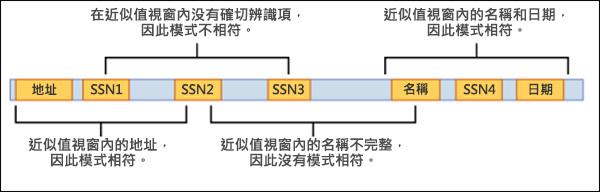

# <a name="learn-about-sensitive-information-types"></a>了解敏感性資訊類型

識別和分類組織控制底下的敏感專案是 [資訊保護訓練科目](./information-protection.md)中的第一步。  Microsoft 365 提供三種方式來識別專案，以進行分類：

- 由使用者手動
- 自動化的模式識別，像是敏感資訊類型
- [機器學習](classifier-learn-about.md)

敏感資訊類型是以模式為基礎的分類器。 它們會偵測敏感資訊，例如社會保險、信用卡或銀行帳戶號碼，以識別敏感專案，請參閱 [敏感資訊類型實體定義](sensitive-information-type-entity-definitions.md)

## <a name="sensitive-information-types-are-used-in"></a>敏感資訊類型是用於

- [資料遺失防護原則](dlp-learn-about-dlp.md) 
- [敏感性標籤](sensitivity-labels.md)
- [保留標籤](retention.md)
- [內部風險管理](insider-risk-management.md)
- [通訊合規性](communication-compliance.md)
- [自動標籤型原則](apply-sensitivity-label-automatically.md#how-to-configure-auto-labeling-for-office-apps)

## <a name="fundamental-parts-of-a-sensitive-information-type"></a>敏感資訊類型的基礎部分

每個機密資訊類型實體都是由下欄欄位定義：

- 名稱：機密資訊類型的參考方式
- 描述：描述敏感資訊類型所要尋找的專案
- 模式：模式定義敏感資訊類型偵測的內容。 它包含下列元件
    - 主要元素–敏感資訊類型要尋找的主要元素。 它可以是使用或不含校驗和驗證、**關鍵字清單**、**關鍵字字典** 或 **函數** 的 **正則運算式**。
    - 支援元素–做為支援證據的元素，可協助增加相符的置信度。 例如，關鍵字 "SSN" 是在 SSN 號碼的接近。 它可以是使用或不含校驗和驗證、關鍵字清單、關鍵字字典的正則運算式。
    - 信賴等級-信賴層級 (高、中、低) 會反映出與主要元素一起偵測到的支援證據的數量。 專案所包含的支援證據越多，符合專案所要尋找之敏感資訊的信賴越高。
    - 近程–主要和支援元素之間的字元數



深入瞭解這段影片的信賴層級


 > [!VIDEO https://www.microsoft.com/videoplayer/embed/RE4Hx60]  

### <a name="example-sensitive-information-type"></a>範例機密資訊類型


## <a name="argentina-national-identity-dni-number"></a>阿根廷國家身分識別 (DNI) 號碼

### <a name="format"></a>格式

以句點隔開的八位數

### <a name="pattern"></a>模式

八位數：
- 兩位數
- 一個句點
- 三位數
- 一個句點
- 三位數

### <a name="checksum"></a>總和檢查碼

否

### <a name="definition"></a>定義

當鄰近性300個字元以內時，DLP 原則就會偵測到這種敏感資訊類型的信賴度。
- 正則運算式 Regex_argentina_national_id 找到符合模式的內容。
- 會找到來自 Keyword_argentina_national_id 的關鍵字。

```xml
<!-- Argentina National Identity (DNI) Number -->
<Entity id="eefbb00e-8282-433c-8620-8f1da3bffdb2" recommendedConfidence="75" patternsProximity="300">
   <Pattern confidenceLevel="75">
      <IdMatch idRef="Regex_argentina_national_id"/>
      <Match idRef="Keyword_argentina_national_id"/>
  </Pattern>
</Entity>
```

### <a name="keywords"></a>關鍵字

#### <a name="keyword_argentina_national_id"></a>Keyword_argentina_national_id

- 阿根廷國內身分識別號碼 
- Identity 
- 身分識別的國內身分識別卡片 
- DNI 
- 個人的 NIC 註冊人員 
- Documento Nacional de Identidad 
- Registro Nacional de 拉斯維加斯角色 
- Identidad 
- Identificación 

### <a name="more-on-confidence-levels"></a>信賴層級的詳細資訊

在機密資訊類型實體定義中， **信賴等級** 會反映出除了主要專案之外，偵測到多少支援證據。 專案所包含的支援證據越多，符合專案所要尋找之敏感資訊的信賴越高。 例如，具有高信賴度的比對會在主要元素的接近鄰近性中包含更多支援證據，而符合低信賴度的情況會包含很少無支援證據的近距離。 

高信賴等級會傳回最少的誤報，但是可能會產生較多的漏報。 低或中度信賴等級會傳回更多的誤報，但很少為零的否定。

- **低信賴度**：65的值，相符的專案會包含最少的 false 負值，但是最少的誤報。 低信賴會傳回所有低、中和高信賴度的相符專案。
- **適中信賴**：值為75，相符的專案會包含平均的誤報和漏報的平均金額。 中度信賴會傳回所有中和高信賴度的相符專案。  
- **高信賴度**：值為85，相符的專案會包含最少的誤報，但最少為 false 的負值。 高信賴度只會傳回高可信度比對。  

您應該使用具有較低計數的高信賴度模式、5到10個，以及具有較高數量的低可信度模式，例如20或更高。

> [!NOTE]
> 如果您有現有的原則或自訂敏感資訊類型 (是使用以數位為基礎的信賴等級) 定義 (也知道精確度) ，它們就會自動對應至三個不同的信賴等級;安全性 @ 合規性中心 UI 中的低信心、中置信度和高信賴度。
> - 所有原則的精確度或自訂 SIT 模式，在76和100之間具有信賴層級，將會對應至高信賴度。 
> - 所有原則的精確度或自訂 SIT 模式，在66和75之間具有信賴層級，將會對應至中的置信度。
> - 具有最低精確度或自訂 SIT 模式且信賴等級小於或等於65的所有原則都會對應至低信賴度。 

## <a name="creating-custom-sensitive-information-types"></a>建立自訂敏感性資訊類型

若要在安全性與合規性中心建立自訂敏感性資訊類型，您可以從數個選項中選擇：

- **使用 UI** 您可以使用安全性與合規性中心 UI 來設定自訂敏感性資訊類型。 使用此方法，您可以使用規則運算式、關鍵字和關鍵字字典。 若要進一步了解，請參閱[建立自訂敏感性資訊類型](create-a-custom-sensitive-information-type.md)。

- **使用 EDM** 您可以使用以精確資料比對 (EDM) 為基礎的分類來設定自訂敏感性資訊類型。 此方法可讓您使用您可以定期更新的安全資料庫來建立動態敏感性資訊類型。 請參閱[使用以精確資料比對為基礎的分類建立自訂敏感性資訊類型](create-custom-sensitive-information-types-with-exact-data-match-based-classification.md)。

- **使用 PowerShell** 您可以使用 PowerShell 來設定自訂敏感性資訊類型。 雖然此方法比使用 UI 更複雜，但是您有多個組態選項。 請參閱[在安全性與合規性中心 PowerShell 中建立自訂敏感性資訊類型](create-a-custom-sensitive-information-type-in-scc-powershell.md)。


> [!NOTE]
> 在 Microsoft 365 服務的資料遺失防護中，可立即使用的增強信賴等級可供立即使用，針對 Microsoft 365 服務、通訊法規遵從性、資訊管理及記錄管理的 Microsoft 資訊保護。

> Microsoft 365 資訊保護目前在預覽版中支援下列雙位元組字元集語言：
> - 中文 (簡體)
> - 中文 (繁體)
> - 韓文
> - 日文

>這項支援適用於敏感性資訊類型。 如需詳細資訊，請參閱[資訊保護支援雙位元組字元集的版本資訊 (預覽版)](mip-dbcs-relnotes.md)。

## <a name="for-further-information"></a>如需詳細資訊
- [敏感資訊類型實體定義](sensitive-information-type-entity-definitions.md)
- [建立自訂的敏感性資訊類型](create-a-custom-sensitive-information-type.md)
- [在 PowerShell 中建立自訂機密資訊類型](create-a-custom-sensitive-information-type-in-scc-powershell.md)

若要瞭解如何使用敏感資訊類型來遵守資料隱私權規定，請參閱使用 Microsoft 365 (aka.ms/m365dataprivacy) [部署資料隱私權法規的資訊保護](../solutions/information-protection-deploy.md)。

<!-- fwlink for this topic https://go.microsoft.com/fwlink/?linkid=2135644-->