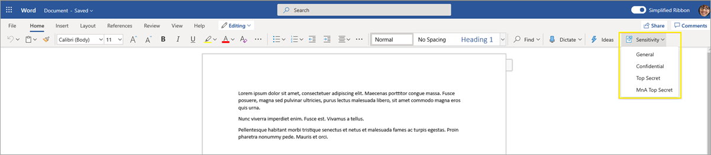
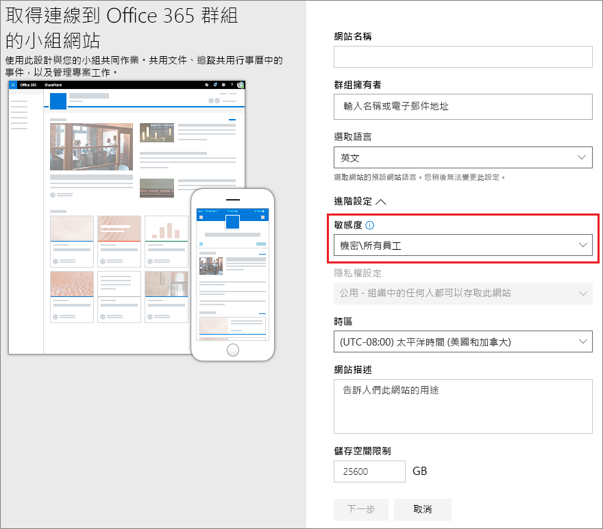
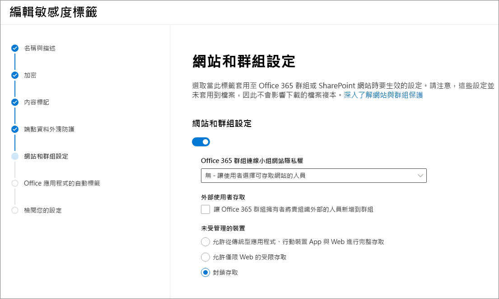

# <a name="use-sensitivity-labels-with-microsoft-teams-office-365-groups-and-sharepoint-sites-public-preview"></a>對 Microsoft Teams、Office 365 群組和 SharePoint 網站使用敏感度標籤 (公開預覽)

在 [Microsoft 365 合規性中心](https://protection.office.com/)中建立敏感度標籤時，您現在可以將它們套用至下列容器：Microsoft Teams、Office 365 群組和 SharePoint 網站。 使用標籤設定來控制下列容器的選項：

- Office 365 群組連線小組網站的隱私權 (公開或私人)
- 外部使用者存取
- 從未受控裝置存取 

當您將此標籤套用至支援的其中一個容器時，標籤會自動將已設定的選項套用到連線的 SharePoint 網站或小組網站。 

不過，這些容器中的內容不會繼承標籤名稱、視覺標記或加密等設定的標籤。 若要在 SharePoint 網站或小組網站中的檔案加上標籤，請[對 SharePoint 和 OneDrive 中的 Office 檔案啟用敏感度標籤](sensitivity-labels-sharepoint-onedrive-files.md) (英文版)。

## <a name="about-the-public-preview-for-microsoft-teams-office-365-groups-and-sharepoint-sites"></a>關於 Microsoft Teams、Office 365 群組和 SharePoint 網站的公開預覽

Microsoft Teams、Office 365 群組和 SharePoint 網站的敏感度標籤會逐漸向租用戶推出，且可能在最終發行之前變更。 此公開預覽不適用 Office 365 內容傳遞網路 (CDN)。

啟用此預覽並設定新設定的敏感度標籤前，使用者可在其應用程式中查看並套用敏感度標籤。 例如，在 Word 中：



啟用並設定此預覽後，使用者可進一步查看並將敏感度標籤套用至 Microsoft Teams、Office 365 群組和 SharePoint 網站。 例如，從 SharePoint 建立新的小組網站時：



## <a name="enable-this-preview-and-synchronize-labels"></a>啟用此預覽並同步處理標籤

1. 由於此功能使用 Azure AD 功能，請依照 Azure AD 文件中的指示來啟用預覽：[將敏感度標籤指派到 Azure Active Directory 中的 Office 365 群組 (預覽)](https://docs.microsoft.com/azure/active-directory/users-groups-roles/groups-assign-sensitivity-labels) (英文版)。

2. 在 PowerShell 工作階段中，使用具備全域系統管理員權限的公司或學校帳戶連線至安全性與合規性中心。 例如：
    
    ```powershell
    Set-ExecutionPolicy RemoteSigned
    $UserCredential = Get-Credential
    $Session = New-PSSession -ConfigurationName Microsoft.Exchange -ConnectionUri https://ps.compliance.protection.outlook.com/powershell-liveid/ -Credential $UserCredential -Authentication Basic -AllowRedirection
    Import-PSSession $Session -DisableNameChecking
    ```
    
    如需完整指示，請參閱[連線到 Office 365 安全性與合規性中心 PowerShell](/powershell/exchange/office-365-scc/connect-to-scc-powershell/connect-to-scc-powershell)。

3. 執行下列命令以將您的敏感度標籤同步處理到 Azure AD，以便與 Office 365 群組搭配使用：
    
    ```powershell
    Execute-AzureAdLabelSync
    ```

## <a name="how-to-configure-site-and-group-settings-when-you-create-or-edit-sensitivity-labels"></a>如何在建立或編輯敏感度標籤時設定網站和群組設定

您現在可以建立或編輯需要用於網站和群組的敏感度標籤。 啟用預覽可在敏感度標籤精靈中顯示新頁面：**網站和群組設定**

如果您需要建立或編輯敏感度標籤的協助，請參閱[建立及設定敏感度標籤](create-sensitivity-labels.md#create-and-configure-sensitivity-labels)的指示。

在這個新的**網站和群組設定**頁面上，設定以下設定：

- **Office 365 群組連線小組網站**：系統會自動選取預設設定**公開**，這表示貴組織中的任何人都能存取套用此標籤的小組網站。 如果只想要讓貴組織中的核准成員存取群組的小組網站，請選取 [**私人**]。 
    
    選取的設定會取代先前為群組設定的隱私權設定，並鎖定隱私權值，所以只能先移除小組網站或群組的敏感度標籤才能變更。 移除敏感度標籤後，標籤的隱私權設定會保留，您可以視需要變更。

- **外部使用者存取**：控制群組擁有者是否可以[將來賓新增至群組](/office365/admin/create-groups/manage-guest-access-in-groups)。

- **未受管理的裝置**：針對[未受管理的裝置](/sharepoint/control-access-from-unmanaged-devices)，允許完全存取、僅限 Web 存取，或完全封鎖存取權。 



> [!IMPORTANT]
> 將標籤套用至小組、群組或網站時，只有這些網站和群組設定會生效。 其他標籤設定，例如加密和內容標記，均不會套用至小組、群組或網站內的內容。
> 
> 同樣地，如果您建立標籤，但未開啟這些網站和群組設定，當使用者建立小組、群組和網站時，標籤仍將可用，但只會套用標籤名稱。

如果您的敏感度標籤尚未發佈，現在請[將標籤新增至敏感度標籤原則](create-sensitivity-labels.md#publish-sensitivity-labels-by-creating-a-label-policy)以進行發佈。 包含此標籤、獲指派敏感度標籤原則的使用者將可以為網站和群組選取它。

## <a name="sensitivity-label-management"></a>敏感度標籤管理

> [!WARNING]
> 建立、修改和刪除您用於 Microsoft Teams、Office 365 群組和 SharePoint 網站的敏感度標籤時，需要謹慎地就發佈標籤原則給使用者進行協調。 

使用下列指南來避免可能影響所有使用者的網站和群組建立錯誤。

**建立及發佈標籤：**

建立並發佈敏感度標籤後，最多可能需要 24 小時的時間，標籤才會對小組、群組和網站中的使用者顯示。 使用下列步驟為租用戶中的所有使用者發佈標籤：

1. 建立敏感度標籤，並只對租用戶中的一些使用者帳戶發佈。

2. 等候 24 小時。

3. 等候 24 小時之後，使用您在步驟 1 中指定的其中一個使用者帳戶來建立小組、Office 365 群組或 SharePoint 網站，並搭配您在步驟 1 中建立的標籤。

4. 如果在步驟 3 的建立作業期間沒有發生任何錯誤，請對您的租用戶中的所有使用者發佈標籤。 如果發生錯誤，請連絡 [Microsoft 支援](https://docs.microsoft.com/office365/admin/contact-support-for-business-products)。

**修改及刪除已發佈的標籤：**

如果您修改或刪除包含在一或多個標籤原則中的敏感度標籤，這些動作可能會導致所有小組、群組和網站建立失敗。 若要避免此情況，請使用下列指導方針：

1. 從包含標籤的所有標籤原則中移除敏感度標籤。

2. 等候 48 小時。

3. 在等候 48 小時之後，請嘗試建立小組、群組或網站，並確認標籤已不再顯示。

4. 如果敏感度標籤未顯示，您現在可以放心地修改或刪除標籤。 如果標籤仍顯示，請連絡 [Microsoft 支援](https://docs.microsoft.com/office365/admin/contact-support-for-business-products)。

## <a name="assign-sensitivity-labels-to-office-365-groups"></a>將敏感度標籤指派給 Office 365 群組

您現在可以將敏感度標籤或標籤套用至 Office 365 群組。 如需指示，請返回 Azure AD 文件：

- [在 Azure 入口網站中將標籤指派至新群組](https://docs.microsoft.com/azure/active-directory/users-groups-roles/groups-assign-sensitivity-labels#assign-a-label-to-a-new-group-in-azure-portal)

-  [在 Azure 入口網站中將標籤指派至現有群組](https://docs.microsoft.com/azure/active-directory/users-groups-roles/groups-assign-sensitivity-labels#assign-a-label-to-an-existing-group-in-azure-portal)

-  [在 Azure 入口網站中將標籤從現有群組移除](https://docs.microsoft.com/azure/active-directory/users-groups-roles/groups-assign-sensitivity-labels#remove-a-label-from-an-existing-group-in-azure-portal)。

## <a name="apply-a-sensitivity-label-to-a-new-team"></a>將敏感度標籤套用至新的小組

當使用者在 Microsoft Teams 中建立新小組時，可選取敏感度標籤。 當使用者選取敏感度等級時，隱私權設定會視需要變更。 根據您為標籤選取的外部使用者存取設定，使用者可以或無法將組織外部的人員新增至小組。

[深入了解 Teams 的敏感度標籤](https://docs.microsoft.com/microsoftteams/sensitivity-labels)


建立小組之後，敏感度標籤會顯示在所有頻道的右上角。


服務自動將相同的敏感度標籤套用至 Office 365 群組和連線的 SharePoint 小組網站。

## <a name="apply-a-sensitivity-label-to-a-new-group-in-outlook-on-the-web"></a>在 Outlook 網頁版中將敏感度標籤套用至新的群組

在 Outlook 網頁版中，當您建立新的群組時，您可以選取或變更已發佈標籤的**敏感度**選項：

![建立群組並選取 [敏感度] 底下的選項](../media/sensitivity-label-new-group.png)

## <a name="apply-a-sensitivity-label-to-a-new-site"></a>將敏感度標籤套用至新的網站

系統管理員和使用者可以在[建立新式小組網站和通訊網站](/sharepoint/create-site-collection)時選取敏感度標籤。

當使用者建立新式小組和通訊網站，預設會選取某個敏感度標籤。 使用者可以選取 [說明] 圖示來深入了解標籤。

![建立網站並選取 [敏感度] 底下的選項](../media/sensitivity-label-new-communication-site.png)

當使用者瀏覽至網站，他們可以看到標籤的名稱和套用的原則。


## <a name="view-sensitivity-labels-in-the-sharepoint-admin-center"></a>在 SharePoint 系統管理中心檢視敏感度標籤

若要檢視套用的敏感度標籤，請使用新 SharePoint 系統管理中心的 **[使用中網站]** 頁面。 您可能需要先新增 **[敏感度]** 欄：

![[使用中網站] 頁面上的 [敏感度] 欄](../media/manage-site-sensitivity-labels.png)

[深入了解在新的 SharePoint 系統管理中心管理網站](/sharepoint/manage-sites-in-new-admin-center)。

## <a name="change-site-and-group-settings-for-a-label"></a>變更標籤的網站和群組設定

每當您變更標籤的網站和群組設定時，您必須執行下列 PowerShell 命令，以便您的小組、網站和群組可以使用新的設定。 最佳做法是，不要在將標籤套用至數個小組、群組或網站之後，變更網站和群組設定。

1. 執行下列命令以連線至 Office 365 安全性與合規性中心 PowerShell，並取得敏感度標籤及其 GUID 清單。
    
    ```powershell
    Set-ExecutionPolicy RemoteSigned
    $UserCredential = Get-Credential
    $Session = New-PSSession -ConfigurationName Microsoft.Exchange -ConnectionUri https://ps.compliance.protection.outlook.com/powershell-liveid -Authentication Basic -AllowRedirection -Credential $UserCredential
    Import-PSSession $Session
    Get-Label |ft Name, Guid
    ```

2. 記下您已變更之標籤的 GUID。

3. 現在連線到 Exchange Online PowerShell 並執行 Set-unifiedgroup Cmdlet，然後指定您的標籤 GUID 來取代 "e48058ea-98e8-4940-8db0-ba1310fd955e" 的 GUID 範例： 
    
    ```powershell
    Set-ExecutionPolicy RemoteSigned
    $UserCredential = Get-Credential
    $Session = New-PSSession -ConfigurationName Microsoft.Exchange -ConnectionUri https://outlook.office365.com/powershell-liveid/ -Credential $UserCredential -Authentication Basic -AllowRedirection
    Import-PSSession $Session
    $Groups= Get-UnifiedGroup | Where {$_.SensitivityLabel  -eq "e48058ea-98e8-4940-8db0-ba1310fd955e"}
    ```

4. 針對每個群組，重新套用敏感度標籤，然後指定您的標籤 GUID 來取代 "e48058ea-98e8-4940-8db0-ba1310fd955e" 的 GUID 範例：
    
    ```powershell
    foreach ($g in $groups)
    {Set-UnifiedGroup -Identity $g.Identity -SensitivityLabelId "e48058ea-98e8-4940-8db0-ba1310fd955e"}
    ```

## <a name="support-for-the-sensitivity-labels"></a>支援敏感度標籤

您可以搭配下列應用程式和服務，使用您為網站和群組設定套用的敏感度標籤：

- SharePoint Online
- Teams
- Outlook 網頁版
- SharePoint 系統管理中心
- Azure AD 系統管理中心

目前無法使用您為網站和群組設定套用的敏感度標籤的其他應用程式和服務包括：

- Mac 版 Outlook
- Outlook Mobile
- 適用於 Windows 的電腦版 Outlook
- Forms
- Dynamics 365
- Yammer
- Stream
- Planner
- Project
- PowerBI
- Teams 系統管理中心
- Microsoft 365 系統管理中心
- Exchange 系統管理中心


## <a name="classic-azure-ad-site-classification"></a>傳統 Azure AD 網站分類

啟用此預覽時，Office 365 不再對新群組和 SharePoint 網站支援舊分類。 不過，現有的群組和網站仍會顯示舊的分類，除非您轉換它們以使用敏感度標籤。 舊的類別包括您設定的「新式」網站分類，可能是透過 Azure AD PowerShell 或 PnP 核心程式庫所設定，其中定義了 `ClassificationList` 設定的值。

例如，在 PowerShell 中：

```powershell
   ($setting["ClassificationList"])
```

如需舊分類方法的詳細資訊，請參閱 [SharePoint「新式」網站分類](https://docs.microsoft.com/sharepoint/dev/solution-guidance/modern-experience-site-classification)。

若要將舊分類轉換成敏感度標籤，請執行下列其中一項動作：

- 使用現有的標籤：編輯已發佈的現有敏感度標籤，以指定網站和群組需要的標籤設定。

- 建立新標籤：建立及發佈與現有分類名稱相同的新敏感度標籤，以指定網站和群組需要的標籤設定。

然後： 

1. 使用 PowerShell，利用名稱對應將敏感度標籤套用至現有的 Office 365 群組和 SharePoint 網站。 請參閱下一節的指示。

2. 移除現有群組和網站的舊分類。

雖然您無法防止使用者在尚未支援敏感度標籤的應用程式和服務中建立新群組，但您可以執行週期性 PowerShell 指令碼來尋找使用者使用舊分類建立的新群組，並將它們轉換成使用敏感度標籤。 

#### <a name="use-powershell-to-convert-classifications-for-office-365-groups-to-sensitivity-labels"></a>使用 PowerShell 將 Office 365 群組的分類轉換成敏感度標籤

1. 請確認執行 SharePoint Online 管理命令介面版本 16.0.19418.12000 或更新版本。 如果您已有最新版本，請跳到步驟 4。

2. 如果您已安裝來自 PowerShell 資源庫的舊版 SharePoint Online 管理命令介面，您可以執行下列 Cmdlet 來更新模組。
    
    ```PowerShell
    Update-Module -Name Microsoft.Online.SharePoint.PowerShell
    ```

3. 如果您安裝的是來自 Microsoft 下載中心的舊版 SharePoint Online 管理命令介面，請移至 **[新增或移除程式]**，並解除安裝 [SharePoint Online 管理命令介面]。 然後，從[下載中心](https://go.microsoft.com/fwlink/p/?LinkId=255251)下載 SharePoint Online 管理命令介面。

4. 使用擁有 Office 365 中的全域系統管理員或 SharePoint 系統管理員權限的公司或學校帳戶，連線到 SharePoint Online 管理命令介面。 若要了解如何進行，請參閱[開始使用 SharePoint Online 管理命令介面](/powershell/sharepoint/sharepoint-online/connect-sharepoint-online)。

5. 執行下列命令來取得敏感度標籤及其 GUID 的清單。

    ```PowerShell
    Set-ExecutionPolicy RemoteSigned
    $UserCredential = Get-Credential
    $Session = New-PSSession -ConfigurationName Microsoft.Exchange -ConnectionUri https://ps.compliance.protection.outlook.com/powershell-liveid -Authentication Basic -AllowRedirection -Credential $UserCredential
    Import-PSSession $Session
    Get-Label |ft Name, Guid  
    ```

6. 記下您要套用至 Office 365 群組的敏感度標籤 GUID。

7. 使用下列命令做為範例，以取得目前具有「一般」分類的群組清單：

   ```PowerShell
   $Groups= Get-UnifiedGroup | Where {$_.classification -eq "General"}
   ```

6. 針對每個群組，新增新的敏感度標籤 GUID。 例如：

    ```PowerShell
    foreach ($g in $groups)
    {Set-UnifiedGroup -Identity $g.Identity -SensitivityLabelId "457fa763-7c59-461c-b402-ad1ac6b703cc"}
    ```

## <a name="auditing-sensitivity-label-activities"></a>稽核敏感度標籤活動

若某使用者將文件上傳到受敏感度標籤保護的網站，且文件的敏感度標籤[優先於](sensitivity-labels.md#label-priority-order-matters)網站的敏感度標籤，則不會封鎖此動作。 例如，您已將**一般**標籤套用至 SharePoint 網站，而某使用者上傳到此網站的文件標示為**機密**。 由於優先順序較高的敏感度標籤會識別比優先順序較低的內容更具敏感度的內容，因此可能會造成安全性問題。

儘管動作並未遭到封鎖，但會受到稽核，因此您可以找出與標籤優先順序不一致的文件，並視需要採取行動。 例如，從網站刪除或移動已上傳的文件。 

如果文件套用的敏感度標籤，其優先順序低於網站所套用的敏感度標籤，則不會造成安全性問題。 例如，套用 **「一般」** 標籤的文件上傳到標記為 **「機密」** 的網站。 在此案例中，不會產生稽核事件。

若要搜尋此事件的稽核記錄，請尋找 **[檔案與頁面活動]** 類別中的 **[偵測到的文件敏感度不相符]**。 

當某使用者在網站或群組中新增或移除敏感度標籤時，這些活動也會受到稽核。 您可以在 [[敏感度標籤活動]](search-the-audit-log-in-security-and-compliance.md#sensitivity-label-activities) 類別中找到這些事件。 

如需搜尋稽核記錄的指示，請參閱[在安全性與合規性中心搜尋稽核記錄](search-the-audit-log-in-security-and-compliance.md)。

## <a name="troubleshoot-sensitivity-label-deployment"></a>疑難排解敏感度標籤部署

在使用 Microsoft Teams、Office 365 群組和 SharePoint 網站的敏感度標籤時遇到問題嗎？ 請檢查下列項目：

### <a name="labels-not-visible-after-publishing"></a>發佈之後標籤無法顯示
如果您在啟用這些設定或修改敏感度標籤的描述之後，於建立小組或建立 Office 365 小組時遇到問題，請儲存標籤變更並等候幾小時，然後嘗試再次建立小組或群組。 如需詳細資訊，請參閱[排程在建立或變更敏感度標籤後推出](sensitivity-labels-sharepoint-onedrive-files.md#schedule-roll-out-after-you-create-or-change-a-sensitivity-label)。

如果您仍看不到來自 SharePoint Online 的新敏感度標籤，請連絡 [Microsoft 支援](https://docs.microsoft.com/office365/admin/contact-support-for-business-products)。

### <a name="team-group-or-sharepoint-site-creation-errors"></a>小組、群組或 SharePoint 網站建立錯誤
如果您在公開預覽期間遇到建立錯誤，您有兩個選擇：

- 請確定未對任何使用者強制使用敏感度標籤。

- 您可以使用來自[啟用 PowerShell 中的敏感度標籤支援](https://docs.microsoft.com/azure/active-directory/users-groups-roles/groups-assign-sensitivity-labels#enable-sensitivity-label-support-in-powershell)中的相同指示來關閉 Microsoft Teams、Office 365 群組和 SharePoint 網站的敏感度標籤。 不過，若要停用預覽，請在步驟 5 中使用 `$setting["EnableMIPLabels"] = "False"` 來停用此功能。

