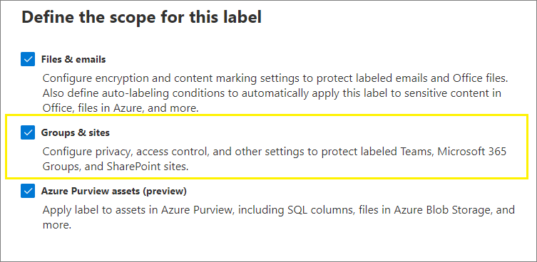

# <a name="use-sensitivity-labels-to-protect-content-in-microsoft-teams-microsoft-365-groups-and-sharepoint-sites"></a>使用敏感度標籤來保護 Microsoft Teams、Microsoft 365 群組和 SharePoint 網站中的內容

>*[Microsoft 365 安全性與合規性的授權指引](https://aka.ms/ComplianceSD)。*

除了使用[敏感度標籤](sensitivity-labels.md)來分類及保護文件和電子郵件，您也可以使用敏感度標籤來保護下列容器中的內容：Microsoft Teams 網站、Microsoft 365 群組 ([之前的 Office 365 群組](https://techcommunity.microsoft.com/t5/microsoft-365-blog/office-365-groups-will-become-microsoft-365-groups/ba-p/1303601)) 和 SharePoint 網站。 針對此容器層級分類和保護，使用下列標籤設定：

- 小組網站和 Microsoft 365 群組的隱私權（公用或私人）
- 外部使用者存取
- 透過 SharePoint 網站進行外部共用 (預覽功能)
- 從未受管理的裝置存取

> [!IMPORTANT]
> **從未受管理的裝置存取** 設定可與 SharePoint 功能搭配使用以進行 [從未受管理的裝置控制存取](/sharepoint/control-access-from-unmanaged-devices)。 您必須設定這個相關的 SharePoint 功能，以使用已設定此設定的敏感度標籤。 下列指示中包含其他資訊。

當您將此敏感度標籤套用至支援的容器時，標籤會自動將分類和配置的保護設定套用至網站或群組。

不過，這些容器中的內容不會繼承分類的標籤或檔案和電子郵件的設定 (如視覺標記或加密)。 因此，使用者可以為其在 SharePoint 網站或小組網站中的文件加上標籤，請確定已[對 SharePoint 和 OneDrive 中的 Office 檔案啟用敏感度標籤](sensitivity-labels-sharepoint-onedrive-files.md)。

> [!NOTE]
> 容器的敏感度標籤不支援使用 Office 365 內容傳遞網路 (CDN)。

## <a name="using-sensitivity-labels-for-microsoft-teams-microsoft-365-groups-and-sharepoint-sites"></a>在對 Microsoft Teams、Microsoft 365 群組和 SharePoint 網站使用敏感度標籤時遇到問題嗎？

啟用容器的敏感度標籤並配置新設定的敏感度標籤前，使用者可在其應用程式中查看並套用敏感度標籤。 例如，在 Word 中：


啟用並設定容器的敏感度標籤後，使用者可進一步查看並將敏感度標籤套用至 Microsoft 小組網站、Microsoft 365 群組和 SharePoint 網站。 例如，從 SharePoint 建立新的小組網站時：


## <a name="how-to-enable-sensitivity-labels-for-containers-and-synchronize-labels"></a>如何為容器啟用敏感度標籤以及同步處理標籤

1. 由於此功能使用 Azure AD 功能，請依照 Azure AD 文件中的指示來啟用敏感度標籤支援：[將敏感度標籤指派到 Azure Active Directory 中的 Microsoft 365 群組](https://docs.microsoft.com/azure/active-directory/users-groups-roles/groups-assign-sensitivity-labels)。

2. 您現在需要將敏感度標籤同步處理至 Azure AD。 首先，[連線到安全性與合規性中心 PowerShell](/powershell/exchange/office-365-scc/connect-to-scc-powershell/connect-to-scc-powershell)。

   例如，在您以系統管理員身分執行的 PowerShell 工作階段中，使用全域系統管理員帳戶登入。

3. 然後執行下列命令，以確保您的敏感度標籤可以搭配 Microsoft 365 群組使用：

    ```powershell
    Execute-AzureAdLabelSync
    ```

## <a name="how-to-configure-groups-and-site-settings"></a>如何設定網站和群組設定

啟用容器的 [敏感度] 標籤表示您現在可以在 [敏感度標籤] 精靈中設定群組和網站的保護設定。 直到您啟用此支援之前，您可以看到精靈中的設定但無法加以設定。

1. 遵循一般指示以 [建立或編輯敏感度標籤](create-sensitivity-labels.md#create-and-configure-sensitivity-labels)，並確認已針對標籤的範圍選取 **[群組和網站]**： 
    
    
    
    若標籤只選取這個範圍時，標籤就不會顯示在支援靈敏度標籤的 Office 應用程式中，且無法套用到檔案和電子郵件。 將標籤分開可讓使用者和系統管理員使用，但也會增加標籤部署的複雜程度。
    
    例如，您必須仔細地檢查您的 [標籤排序](sensitivity-labels.md#label-priority-order-matters)，因為 SharePoint 會在標識的檔案上傳到標示的網站時加以偵測。 在此案例中，當檔案的優先順序敏感度標籤高於網站標籤時，系統會自動產生稽核活動和電子郵件。 如需詳細資訊，請參閱本頁面上的 [稽核敏感度標籤活動](#auditing-sensitivity-label-activities) 一節。 

2. 然後，在 **定義群組和網站的保護設定** 頁面上，選取其中一個或兩個皆適用的可用選項：
    
    - [隱私權和外部使用者存取權設定 **]** 可設定 [隱私權 **]** 和 [外部使用者存取 **]** 設定。 
    - [裝置存取和外部共用設定 **]** 可設定 [從已套用標籤的 SharePoint 網站控制外部共用 **]** 和 [從未受管理的裝置存取 **]** 設定。

3. 如果已選取 [隱私權和外部使用者存取權設定 **]**，請設定下列設定：
    
    - **隱私權**：如果您希望組織中的所有人都能存取套用此標籤的小組網站或群組，請保留 **公用** 的預設值。
        
        如果您希望僅限組織中經核准的成員能存取，請選取 **[私人]**。
        
        如果您想要使用敏感度標籤來保護容器中的內容，但仍讓使用者自行設定隱私權設定，則選取 **[無]**。
        
        將此標籤套用至容器時，請選取 **[公用]** 或 **[私人]** 設定以設定和鎖定隱私權設定。 您選擇的設定會取代先前為小組或群組設定的任何隱私權設定，並鎖定隱私權值，因此必須先移除容器的敏感度標籤才能變更隱私權設定。 移除敏感度標籤後，標籤的隱私權設定會保留，使用者現在便可再次變更隱私權設定。
    
    - **外部使用者存取權**：控制群組擁有者是否可以 [將來賓新增至群組](/office365/admin/create-groups/manage-guest-access-in-groups)。

4. 如果已選取 [裝置存取權和外部共用設定 **]**，請設定下列設定：
    
    - **從已套用標籤的 SharePoint 網站控制外部共用**：目前處於預覽的功能，選取這個選項，然後為任何人、新的及現有的來賓、現有的來賓，或僅限您組織中的人員選取外部共用。 如需有關此組態和設定的詳細資訊，請參閱 SharePoint 文件：[開啟或關閉網站的外部共用](https://docs.microsoft.com/sharepoint/change-external-sharing-site)。
    
    - **從未受管理的裝置存取**：此選項透過使用 Azure AD 條件式存取的 SharePoint 功能，以封鎖或限制從未受管理裝置存取 SharePoint 和 OneDrive 內容。 如需詳細資訊，請參閱 SharePoint 文件中的[控制從未受管理的裝置存取](/sharepoint/control-access-from-unmanaged-devices)。 您為此標籤設定所指定的選項相當於執行網站的 PowerShell 命令，如 SharePoint 指示的[封鎖或限制存取特定 SharePoint 網站或 OneDrive](https://docs.microsoft.com/sharepoint/control-access-from-unmanaged-devices#block-or-limit-access-to-a-specific-sharepoint-site-or-onedrive) 一節中的步驟 3-5 所述。
        
        如需其他資訊，請參閱本節結尾的[有關未受管理裝置相依性的詳細資訊](#more-information-about-the-dependencies-for-the-unmanaged-devices-option)。

> [!IMPORTANT]
> 將標籤套用至小組、群組或網站時，只有這些網站和群組設定會生效。 假如 [標籤範圍](sensitivity-labels.md#label-scopes) 包含檔案和電子郵件，其他標籤設定例如加密和內容標記，均不會套用至小組、群組或網站內的內容。

如果您的敏感度標籤尚未發佈，現在請以 [將標籤新增至敏感度標籤原則](create-sensitivity-labels.md#publish-sensitivity-labels-by-creating-a-label-policy)進行發佈。 包含此標籤、獲指派敏感度標籤原則的使用者將可以為網站和群組選取它。

##### <a name="more-information-about-the-dependencies-for-the-unmanaged-devices-option"></a>關於 [未受管理裝置] 選項的詳細資訊

如果您未設定 SharePoint 相關條件式存取原則如 [使用應用程式強制性限制](https://docs.microsoft.com/sharepoint/app-enforced-restrictions) 中所述，您在此處指定的選項將不會產生任何影響。 此外，如果其限制低於租用戶層級所設定的設定，則不會產生任何影響。 如果您已為非受管理的裝置設定全組織的設定，請選擇相同或具有更多限制的標籤設定。

例如，如果您的租使用者設定為 **允許有限的、僅限網頁存取**，則允許完全存取的標籤設定將不會產生任何影響，因為其限制較少。 針對此租使用者層級設定，請選擇標籤設定，以封鎖存取 {具有更多限制} 或限制存取 (與租使用者設定相同) 的標籤設定。

由於您可以在標籤設定外獨立設定 SharePoint 設定，因此在敏感度標籤精靈中依存關係部分不會顯示為勾選。 您可以在建立和發佈標籤之後，甚至在套用標籤之後設定這些相關性。 不過，如果已經套用標籤，在使用者下次驗證之前，標籤設定將不會生效。

## <a name="sensitivity-label-management"></a>敏感度標籤管理

建立、修改或刪除為網站和群組設定的敏感度標籤時，請使用下列指導方針。

### <a name="creating-and-publishing-labels-that-are-configured-for-sites-and-groups"></a>建立及發佈針對網站和群組設定的標籤

建立並發佈新敏感度標籤後，在一個小時內小組、群組和網站中的使用者就會看到該標籤。 不過，如果您修改現有的標籤，最多需要等候 24 小時。 當標籤時是針對網站和群組進行設定時，請使用下列指導方針來為您的使用者發佈該標籤：

1. 建立及設定敏感度標籤之後，請將此標籤新增至只適用一些測試使用者的標籤原則。

2. 等候複寫變更：

   - 新標籤：等待 1 小時。
   - 現有標籤：等候 24 小時。

3. 在此等候期間之後，請使用其中一個測試使用者帳戶來建立小組、Microsoft 365 群組或 SharePoint 網站，並搭配您在步驟 1 中建立的標籤。

4. 如果在此建立作業期間沒有發生任何錯誤，您便知道可以安全地將標籤發佈給租用戶中的所有使用者。

### <a name="modifying-published-labels-that-are-configured-for-sites-and-groups"></a>修改針對網站和群組設定的已發佈標籤

最佳做法是，不要在將標籤套用至小組、群組或網站之後，變更敏感度標籤的網站和群組設定。 如果您這麼做，請等候最多 24 小時的時間，讓變更複寫至已套用標籤的所有容器。

此外，如果您的變更包括 [外部使用者存取] 設定：

- 新設定會套用至新使用者，但不會套用至現有使用者。 例如，如果先前已選取此設定，且因此來賓使用者可存取網站，在標籤設定中清除此設定之後，這些來賓使用者仍然可以存取網站。

- 群組屬性 hiddenMembership 和 roleEnabled 的隱私權設定不會更新。

### <a name="deleting-published-labels-that-are-configured-for-sites-and-groups"></a>刪除針對網站和群組設定的已發佈標籤

如果您刪除已啟用網站和群組設定的敏感度標籤，且該標籤包含在一或多個標籤原則中，此動作可能會導致新小組、群組和網站建立失敗。 若要避免此情況，請使用下列指導方針：

1. 從包含標籤的所有標籤原則中移除敏感度標籤。

2. 請等候 1 小時。

3. 在此等候期間之後，請嘗試建立小組、群組或網站，並確認標籤已不再顯示。

4. 如果敏感度標籤未顯示，您現在可以放心地刪除標籤。

## <a name="how-to-apply-sensitivity-labels-to-containers"></a>如何將敏感度標籤套用至容器

您現在可以將敏感度標籤或標籤套用至下列容器：

- [Azure AD 中的 Microsoft 365 群組](#apply-sensitivity-labels-to-microsoft-365-groups)
- [Microsoft Teams 小組網站](#apply-a-sensitivity-label-to-a-new-team)
- [Outlook 網頁版中的 Microsoft 365 群組](#apply-a-sensitivity-label-to-a-new-group-in-outlook-on-the-web)
- [SharePoint 網站](#apply-a-sensitivity-label-to-a-new-site)

如果您需要[將敏感度標籤套用至多個網站](#use-powershell-to-apply-a-sensitivity-label-to-multiple-sites)，您可以使用 PowerShell。

### <a name="apply-sensitivity-labels-to-microsoft-365-groups"></a>將敏感度標籤套用至 Microsoft 365 群組

您現在可以將敏感度標籤或標籤套用至 Microsoft 365 群組。 如需指示，請返回 Azure AD 文件：

- [在 Azure 入口網站中將標籤指派至新群組](https://docs.microsoft.com/azure/active-directory/users-groups-roles/groups-assign-sensitivity-labels#assign-a-label-to-a-new-group-in-azure-portal)

- [在 Azure 入口網站中將標籤指派至現有群組](https://docs.microsoft.com/azure/active-directory/users-groups-roles/groups-assign-sensitivity-labels#assign-a-label-to-an-existing-group-in-azure-portal)

- [在 Azure 入口網站中將標籤從現有群組移除](https://docs.microsoft.com/azure/active-directory/users-groups-roles/groups-assign-sensitivity-labels#remove-a-label-from-an-existing-group-in-azure-portal)。

### <a name="apply-a-sensitivity-label-to-a-new-team"></a>將敏感度標籤套用至新的小組

當使用者在 Microsoft Teams 中建立新小組時，可選取敏感度標籤。 當使用者從 [敏感度] 下拉式功能表中選取標籤時，隱私權設定可能會變更以反映標籤設定。 根據您為標籤選取的外部使用者存取設定，使用者可以或無法將組織外部的人員新增至小組。

[深入了解 Teams 的敏感度標籤](https://docs.microsoft.com/microsoftteams/sensitivity-labels)


建立小組之後，敏感度標籤會顯示在所有頻道的右上角。


服務自動將相同的敏感度標籤套用至 Microsoft 365 群組和連線的 SharePoint 小組網站。

### <a name="apply-a-sensitivity-label-to-a-new-group-in-outlook-on-the-web"></a>在 Outlook 網頁版中將敏感度標籤套用至新的群組

在 Outlook 網頁版中，當您建立新的群組時，您可以選取或變更已發佈標籤的 **敏感度** 選項：

![建立群組並選取 [敏感度] 底下的選項](../media/sensitivity-label-new-group.png)

### <a name="apply-a-sensitivity-label-to-a-new-site"></a>將敏感度標籤套用至新的網站

系統管理員和使用者可以在[建立新式小組網站和通訊網站](/sharepoint/create-site-collection)時選取敏感度標籤，然後展開 [進階設定]：

![建立網站並選取 [敏感度] 底下的選項](../media/sensitivity-label-new-communication-site.png)

下拉式方塊會顯示所選項目的標籤名稱，[說明] 圖示則會顯示所有標籤名稱及其工具提示，以協助使用者判斷所要套用的正確標籤。

當標籤已套用，且使用者瀏覽至網站時，其便可看到標籤的名稱和所套用的原則。 例如，此網站已加上 [機密] 標籤，且隱私權設定設為 [私人]：


### <a name="use-powershell-to-apply-a-sensitivity-label-to-multiple-sites"></a>使用 PowerShell 將敏感度標籤套用至多個網站

您可以從目前的 [SharePoint Online 管理命令介面](https://docs.microsoft.com/powershell/sharepoint/sharepoint-online/connect-sharepoint-online) 使用 [Set-SPOSite](/powershell/module/sharepoint-online/set-sposite) 和 [Set-SPOTenant](/powershell/module/sharepoint-online/set-spotenant) Cmdlet 搭配 *SensitivityLabel* 參數，將敏感度標籤套用至許多網站。 網站可以是任何 SharePoint 網站集合，或 OneDrive 網站。

確定您有 SharePoint Online 管理命令介面的版本 16.0.19418.12000 或更新版本。

1. 使用 [以系統管理員身分執行] 選項開啟 PowerShell 工作階段。

2. 如果您不知道標籤 GUID：[連線至安全性與合規性中心 PowerShell](https://docs.microsoft.com/powershell/exchange/connect-to-scc-powershell)，並取得敏感度標籤及其 GUID 清單。

   ```powershell
   Get-Label |ft Name, Guid
   ```

3. 現在[連線至 SharePoint Online PowerShell](https://docs.microsoft.com/powershell/sharepoint/sharepoint-online/connect-sharepoint-online)，並將標籤 GUID 儲存為變數。 例如：

   ```powershell
   $Id = [GUID]("e48058ea-98e8-4940-8db0-ba1310fd955e")
   ```

4. 建立可找出在其 URL 中有共同識別字串的多個網站的新變數。 例如：

   ```powershell
   $sites = Get-SPOSite -IncludePersonalSite $true -Limit all -Filter "Url -like 'documents"
   ```

5. 執行下列命令，將標籤套用至這些網站。 使用我們的範例：

   ```powershell
   $sites | ForEach-Object {Set-SPOTenant $_.url -SensitivityLabel $Id}
   ```

若要將不同的標籤套用至不同的網站，請針對每個網站重複下列命令：`Set-SPOSite -Identity <URL> -SensitivityLabel "<labelguid>"`

## <a name="view-and-manage-sensitivity-labels-in-the-sharepoint-admin-center"></a>在 SharePoint 系統管理中心檢視和管理敏感度標籤

若要檢視、排序和搜尋套用的敏感度標籤，請使用新 SharePoint 系統管理中心的 [使用中網站] 頁面。 您可能需要先新增 **[敏感度]** 欄：

![[使用中網站] 頁面上的 [敏感度] 欄](../media/manage-site-sensitivity-labels.png)

如需從 [作用中網站] 頁面管理網站的詳細資訊，包括如何新增欄，請參閱[在新的 SharePoint 系統管理中心管理網站](/sharepoint/manage-sites-in-new-admin-center)。

您也可以從本頁面變更及套用標籤：

1. 選取網站名稱以開啟詳細資料窗格。

2. 選取 [原則] 索引標籤，然後選取 [敏感度] 設定的 [編輯]。

3. 從 [編輯敏感度設定] 窗格中，選取您要套用至網站的敏感度標籤，然後選取 [儲存]。

## <a name="support-for-sensitivity-labels"></a>支援敏感度標籤

下列應用程式與服務支援針對網站和群組進行設定的敏感度標籤：

- 系統管理中心：

  - SharePoint 系統管理中心
  - Azure Active Directory 入口網站
  - Microsoft 365 合規性中心、Microsoft 365 安全性中心、安全性與合規性中心

- 使用者應用程式與服務：

  - SharePoint
  - Teams
  - Outlook 網頁版和 Windows 版、MacOS 版、iOS 版及 Android 版
  - Forms
  - Stream

下列應用程式與服務目前不支援針對網站和群組進行設定的敏感度標籤：

- 系統管理中心：

  - Microsoft 365 系統管理中心
  - Teams 系統管理中心
  - Exchange 系統管理中心

- 使用者應用程式與服務：

  - Dynamics 365
  - Yammer
  - Planner
  - Project
  - Power BI

## <a name="classic-azure-ad-group-classification"></a>傳統 Azure AD 群組分類

啟用容器的敏感度標籤之後，Microsoft 365 不再針對新的 Microsoft 365 群組和 SharePoint 網站支援舊分類。 不過，支援敏感度標籤的現有的群組和網站仍會顯示舊的分類值，直到您轉換它們以使用敏感度標籤為止。

如需您先前可能使用的 SharePoint 舊群組分類範例，請參閱 [SharePoint 新式網站分類](https://docs.microsoft.com/sharepoint/dev/solution-guidance/modern-experience-site-classification)。

這些分類是使用 Azure AD PowerShell 或 PnP 核心程式庫來設定，並定義 `ClassificationList` 設定的值。 如果您的租用戶已定義分類值，當您從 [AzureADPreview PowerShell 模組](https://www.powershellgallery.com/packages/AzureADPreview)執行下列命令時，會顯示這些值：

```powershell
($setting["ClassificationList"])
```

若要將舊分類轉換成敏感度標籤，請執行下列其中一項動作：

- 使用現有的標籤：編輯已發佈的現有敏感度標籤，以指定網站和群組需要的標籤設定。

- 建立新標籤：建立及發佈與現有分類名稱相同的新敏感度標籤，以指定網站和群組需要的標籤設定。

然後：

1. 使用 PowerShell，利用名稱對應將敏感度標籤套用至現有的 Microsoft 365 群組和 SharePoint 網站。 請參閱下一節的指示。

2. 移除現有群組和網站的舊分類。

雖然您無法防止使用者在尚未支援敏感度標籤的應用程式和服務中建立新群組，但您可以執行週期性 PowerShell 指令碼來尋找使用者使用舊分類建立的新群組，並將它們轉換成使用敏感度標籤。

若要協助您管理網站和群組的敏感度標籤與 Azure AD 分類的共存，請參閱 [Microsoft 365 群組的 Azure Active Directory 分類和敏感度標籤](migrate-aad-classification-sensitivity-labels.md)。

### <a name="use-powershell-to-convert-classifications-for-microsoft-365-groups-to-sensitivity-labels"></a>使用 PowerShell 將 Microsoft 365 群組的分類轉換成敏感度標籤

1. 首先，[連線到安全性與合規性中心 PowerShell](/powershell/exchange/office-365-scc/connect-to-scc-powershell/connect-to-scc-powershell)。

   例如，在您以系統管理員身分執行的 PowerShell 工作階段中，使用全域系統管理員帳戶登入：

2. 透過使用 [Get-Label](https://docs.microsoft.com/powershell/module/exchange/get-label) Cmdlet，取得敏感度標籤和其 GUID 的清單：

   ```powershell
   Get-Label |ft Name, Guid
   ```

3. 記下您要套用至 Microsoft 365 群組的敏感度標籤 GUID。

4. 現在，在不同的 Windows PowerShell 視窗中 [連線到 Exchange Online PowerShell](https://docs.microsoft.com/powershell/exchange/connect-to-exchange-online-powershell)。

5. 使用下列命令做為範例，以取得目前具有「一般」分類的群組清單：

   ```PowerShell
   $Groups= Get-UnifiedGroup | Where {$_.classification -eq "General"}
   ```

6. 針對每個群組，新增新的敏感度標籤 GUID。 例如：

    ```PowerShell
    foreach ($g in $groups)
    {Set-UnifiedGroup -Identity $g.Identity -SensitivityLabelId "457fa763-7c59-461c-b402-ad1ac6b703cc"}
    ```

7. 針對其餘的群組分類重複步驟 5 和 6。

## <a name="auditing-sensitivity-label-activities"></a>稽核敏感度標籤活動

> [!IMPORTANT]
> 如果您使用標籤分離，只選擇保護容器的 **群組和網站** 標籤範圍：由於 **偵測到的檔案敏感度等級不符合** 本節內容所述的稽核活動及電子郵件，須 [將這些標籤排序](sensitivity-labels.md#label-priority-order-matters) 在具有 **檔案和電子郵件** 範圍的標籤之前。  

若某使用者將文件上傳到受敏感度標籤保護的網站，且文件的敏感度標籤[優先於](sensitivity-labels.md#label-priority-order-matters)網站的敏感度標籤，則不會封鎖此動作。 例如，您已將 **一般** 標籤套用至 SharePoint 網站，而某使用者上傳到此網站的文件標示為 **機密**。 由於優先順序較高的敏感度標籤會識別比優先順序較低的內容更具敏感度的內容，因此可能會造成安全性問題。

儘管系統不會封鎖該動作，但會稽核，且會產生電子郵件給上傳文件的人員和網站系統管理員。 因此使用者和系統管理員可以找出與標籤優先順序不一致的文件，並視需要採取行動。 例如，從網站刪除或移動已上傳的文件。

如果文件套用的敏感度標籤，其優先順序低於網站所套用的敏感度標籤，則不會造成安全性問題。 例如，套用 **「一般」** 標籤的文件上傳到標記為 **「機密」** 的網站。 在此案例中，不會產生稽核事件和電子郵件。

若要搜尋此事件的稽核記錄，請尋找 **[檔案與頁面活動]** 類別中的 **[偵測到的文件敏感度不相符]**。

自動產生電子郵件的 [主旨] 為 **偵測到不相容敏感度標籤**，而電子郵件訊息則會有上傳文件和網站連結的標記不相符說明。 它也包含說明使用者可如何變更敏感度標籤的文件連結。 目前無法停用或自訂這些自動電子郵件。

當某人在網站或群組間新增或移除敏感度標籤時，系統也會稽核這些活動，但不會自動產生電子郵件。

您可以在 [[敏感度標籤活動]](search-the-audit-log-in-security-and-compliance.md#sensitivity-label-activities) 類別中找到所有這些稽核事件。 如需搜尋稽核記錄的指示，請參閱[在安全性與合規性中心搜尋稽核記錄](search-the-audit-log-in-security-and-compliance.md)。

## <a name="how-to-disable-sensitivity-labels-for-containers"></a>如何停用容器的敏感度標籤

您可以使用來自[啟用 PowerShell 中的敏感度標籤支援](https://docs.microsoft.com/azure/active-directory/users-groups-roles/groups-assign-sensitivity-labels#enable-sensitivity-label-support-in-powershell)中的相同指示來關閉 Microsoft Teams、Microsoft 365 群組和 SharePoint 網站的敏感度標籤。 不過，若要停用此功能，請在步驟 5 中指定 `$setting["EnableMIPLabels"] = "False"`。

除了在建立或編輯敏感度標籤時隱藏所有的群組和網站設定 ，此動作會還原容器用於其設定的屬性。 為 Microsoft Teams、Microsoft 365 群組和 SharePoint 網站啟用敏感度標籤，會將使用的屬性從 **[分類]** (用於 [Azure AD 群組分類](#classic-azure-ad-group-classification)) 切換為 **[敏感度]**。 停用容器的敏感度標籤時，容器會忽略 [敏感度] 屬性，並再次使用 [分類] 屬性。

這表示來自網站和群組、先前套用至容器的任何標籤設定都不會強制執行，而容器則不再顯示標籤。

如果這些容器已套用 Azure AD 分類值，則容器會再次還原為使用分類。 請注意，啟用功能之後所建立的任何新網站或群組都不會顯示標籤或具有分類。 針對這些容器以及任何新容器，您現在可以套用分類值。 如需詳細資訊，請參閱 [SharePoint「新式」網站分類](https://docs.microsoft.com/sharepoint/dev/solution-guidance/modern-experience-site-classification)和[為組織中的 Office 群組建立分類](https://docs.microsoft.com/microsoft-365/enterprise/manage-microsoft-365-groups-with-powershell)。

## <a name="additional-resources"></a>其他資源

如需有關[透過 Microsoft Teams、O365 群組和 SharePoint Online 網站使用敏感度標籤](https://techcommunity.microsoft.com/t5/security-privacy-and-compliance/using-sensitivity-labels-with-microsoft-teams-o365-groups-and/ba-p/1221885#M1380) (英文) 的資訊，請參閱網路研討會的記錄和回答的問題。

此網路研討會錄製時該功能仍處於預覽，因此您可能會發現 UI 中有部分差異。 不過，此功能的資訊仍會是正確的，且此頁面上會記載任何新功能。
