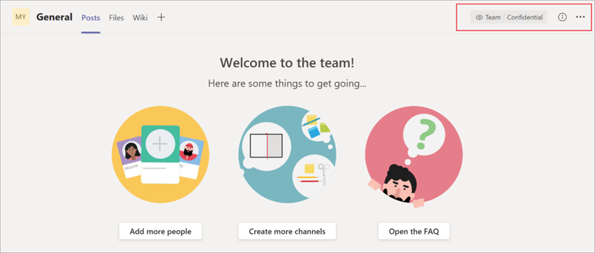

# <a name="use-sensitivity-labels-with-microsoft-teams-office-365-groups-and-sharepoint-sites-public-preview"></a>對 Microsoft Teams、Office 365 群組和 SharePoint 網站使用敏感度標籤 (公開預覽)

在 [Microsoft 365 合規性中心](https://protection.office.com/)中建立敏感度標籤時，您現在可以將它們套用至 Microsoft Teams、Office 365 群組和 SharePoint 網站。 您可以將原則與標籤建立關聯，以控制：

- 公開/私密設定
- 來賓存取
- 從未受控裝置存取

當您將標籤套用至小組或群組，標籤會自動套用至連接的 SharePoint 小組網站，反之亦然。

您現在也可以為 SharePoint 和 OneDrive 中的 Office 檔案啟用敏感度標籤。 如需詳細資訊，請參閱[對 SharePoint 和 OneDrive 中的 Office 檔案啟用敏感度標籤 (公開預覽)](sensitivity-labels-sharepoint-onedrive-files.md) (英文)。

## <a name="about-the-public-preview-for-microsoft-teams-office-365-groups-and-sharepoint-sites"></a>關於 Microsoft Teams、Office 365 群組和 SharePoint 網站的公開預覽

Microsoft Teams、Office 365 群組和 SharePoint 網站的敏感度標籤會逐漸向租用戶推出，且可能在最終發行之前變更。

此公開預覽不適用 Office 365 內容傳遞網路 (CDN)。

## <a name="overview"></a>概觀

發佈敏感度標籤時，Office 365 中的使用者可以存取相同的標籤清單。

這些影像顯示：

- 從 SharePoint 建立新的小組網站時，清單的顯示方式

- 在 Word 中檢視清單時

例如：


## <a name="enable-this-preview"></a>啟用此預覽

您必須使用 [Azure Active Directory PowerShell (AzureAD)](https://docs.microsoft.com/powershell/azure/active-directory/overview?view=azureadps-2.0) (模組名稱 **AzureADPreview**) 的預覽版本，才能在 Microsoft Teams、Office 365 群組和 SharePoint 網站上啟用敏感度標籤的此預覽：

- 如果您之前尚未安裝任何版本的 Azure AD PowerShell 模組，請參閱[安裝 Azure AD 模組](https://docs.microsoft.com/powershell/azure/active-directory/install-adv2?view=azureadps-2.0-preview#installing-the-azure-ad-module)，並遵循指示來安裝公開預覽版本。

- 如果您已安裝 Azure AD PowerShell 模組(AzureAD) 的通用版本 2.0，您必須先在 PowerShell 工作階段中執行 `Uninstall-Module AzureAD` 將其解除安裝，然後執行 `Install-Module AzureADPreview` 來安裝預覽版本。

- 如果您已安裝預覽版本，請執行 `Install-Module AzureADPreview` 以確定這是本模組的最新版本。

您現在可以開始啟用 Microsoft Teams、Office 365 群組和 SharePoint 網站的敏感度標籤預覽：

1. 在 PowerShell 工作階段中，使用具備全域系統管理員權限的公司或學校帳戶連線到 Azure Active Directory。 例如，執行：
    
        Connect-AzureAD
    
    如需完整指示，請參閱[連線到 Azure AD](https://docs.microsoft.com/powershell/azure/active-directory/install-adv2?view=azureadps-2.0-preview#connect-to-azure-ad)。

2. 執行下列命令：
    
    ```powershell
    $setting=(Get-AzureADDirectorySetting | where -Property DisplayName -Value "Group.Unified" -EQ)
    if ($setting -eq $null)
    {
    $template = Get-AzureADDirectorySettingTemplate -Id 62375ab9-6b52-47ed-826b-58e47e0e304b
    $setting = $template.CreateDirectorySetting()
    $setting["EnableMIPLabels"] = "True"
    New-AzureADDirectorySetting -DirectorySetting $setting
    }
    else
    {
    $setting["EnableMIPLabels"] = "True"
    Set-AzureADDirectorySetting -Id $setting.Id -DirectorySetting $setting
    }
    ```
    
    > [!NOTE]
    > 啟用此預覽時，Office 365 不再對新群組和 SharePoint 網站使用舊分類。 如果您使用 [Azure AD 網站分類](/sharepoint/dev/solution-guidance/modern-experience-site-classification) ($setting["ClassificationList"])，現有的群組和網站仍會顯示舊的分類。 若要顯示新的分類，請進行轉換。 如需有關如何轉換的詳細資訊，請參閱[如果您使用傳統 Azure AD 網站分類](#if-you-used-classic-azure-ad-site-classification)。 

3. 在相同的 PowerShell 工作階段中，使用具備全域系統管理員權限的公司或學校帳戶連線至安全性與合規性中心。 如需指示，請參閱[連線到 Office 365 安全性與合規性中心 PowerShell](/powershell/exchange/office-365-scc/connect-to-scc-powershell/connect-to-scc-powershell)。

4. 執行下列命令：
    
    ```powershell
    Set-ExecutionPolicy RemoteSigned
    $UserCredential = Get-Credential
    $Session = New-PSSession -ConfigurationName Microsoft.Exchange -ConnectionUri https://ps.compliance.protection.outlook.com/powershell-liveid/ -Credential $UserCredential -Authentication Basic -AllowRedirection
    Import-PSSession $Session -DisableNameChecking
    Execute-AzureAdLabelSync
    ```
## <a name="set-site-and-group-settings-when-you-create-or-edit-sensitivity-labels"></a>建立或編輯敏感度標籤時設定網站和群組設定

啟用預覽之後，請使用下列步驟來建立或編輯敏感度標籤。 您必須完成這些步驟，新的敏感度標籤才能對網站和群組運作，即使您已定義標籤也一樣。 對這些設定所做的變更最多可能需要 24 小時才能同步。

1. 在 Microsoft 365 合規性中心中，選取 [分類]****  >  [敏感度標籤]****。

2. 選取 [建立標籤]****。 如果您已經有標籤，請跳至下一個步驟。

3. 選取您要的選項，然後在 [網站與群組設定]**** 索引標籤上，選擇：
    
    - 隱私權 (公開/私密)：[私密] 表示只有組織中已獲核准的成員可以查看群組內的內容。 組織中的其他人都無法查看群組中的內容。 [深入了解](https://support.office.com/article/36236e39-26d3-420b-b0ac-8072d2d2bedc)
    - 來賓存取：您可以控制是否可以將來賓新增至群組。 [了解如何管理 Office 365 群組的來賓存取](/office365/admin/create-groups/manage-guest-access-in-groups)
    - 未受控的裝置：此設定可讓您封鎖或限制從未在 Intune 中混合式加入 AD 或合規的裝置存取 SharePoint 內容。 如果您選取 [未受控的裝置]，您必須移至 Azure AD 來完成原則的設定。 如需資訊，請參閱[從未受控裝置控制存取](/sharepoint/control-access-from-unmanaged-devices)。
    
    

> [!IMPORTANT]
> 將標籤套用至小組、群組或網站時，只有網站和群組設定會生效。 其他設定，例如加密和內容標記，均不會套用至小組、群組或網站內的所有內容。
> 
> 同樣地，如果您建立標籤，但未開啟網站和群組設定，當使用者建立小組、群組和網站時，標籤仍將可用，但會分類而不套用任何設定。

[深入了解發佈敏感度標籤](/microsoft-365/compliance/sensitivity-labels#what-label-policies-can-do)

## <a name="sensitivity-label-management"></a>敏感度標籤管理

> [!WARNING]
> 建立、修改和刪除您用於 Microsoft Teams、Office 365 群組和 SharePoint 網站的敏感度標籤時，需要謹慎地就發佈標籤原則給使用者進行協調。 

使用下列指南來避免可能影響所有使用者的網站和群組建立錯誤。

**建立及發佈標籤：**

建立並發佈敏感度標籤後，最多可能需要 24 小時的時間，標籤才會對小組、群組和網站中的使用者顯示。 使用下列步驟為租用戶中的所有使用者發佈標籤：

1. 建立敏感度標籤，並只對租用戶中的一些使用者帳戶發佈。

2. 等候 24 小時。

3. 等候 24 小時之後，使用您在步驟 1 中指定的其中一個使用者帳戶來建立小組、Office 365 群組或 SharePoint 網站，並搭配您在步驟 1 中建立的標籤。

4. 如果在步驟 3 的建立作業期間沒有發生任何錯誤，請對您的租用戶中的所有使用者發佈標籤。 如果發生錯誤，請連絡 Microsoft 支援。

**修改及刪除已發佈的標籤：**

如果您修改或刪除包含在一或多個標籤原則中的敏感度標籤，這些動作可能會導致所有小組、群組和網站建立失敗。 若要避免此情況，請使用下列指導方針：

1. 從包含標籤的所有標籤原則中移除敏感度標籤。

2. 等候 48 小時。

3. 在等候 48 小時之後，請嘗試建立小組、群組或網站，並確認標籤已不再顯示。

4. 如果敏感度標籤未顯示，您現在可以放心地修改或刪除標籤。 如果標籤仍顯示，請連絡 Microsoft 支援。

## <a name="troubleshoot-sensitivity-label-deployment"></a>疑難排解敏感度標籤部署

### <a name="labels-not-visible-after-publishing"></a>發佈之後標籤無法顯示
如果您在啟用這些設定或修改敏感度標籤的描述之後，於建立小組或建立 Office 365 小組時遇到問題，請儲存標籤，等候幾小時，然後嘗試再次建立小組或群組。 如需詳細資訊，請參閱[排程在建立或變更敏感度標籤後推出](sensitivity-labels-sharepoint-onedrive-files.md#schedule-roll-out-after-you-create-or-change-a-sensitivity-label)。

如果您仍看不到來自 SharePoint Online 的新敏感度標籤，請連絡 Microsoft 支援。

### <a name="team-group-or-sharepoint-site-creation-errors"></a>小組、群組或 SharePoint 網站建立錯誤
如果您在公開預覽期間遇到建立錯誤，您有兩個選擇：

- 請確定未對任何使用者強制使用敏感度標籤。

- 您可以使用來自此頁面上[啟用此預覽](#enable-this-preview)一節中的指示，來關閉 Microsoft Teams、Office 365 群組和 SharePoint 網站的敏感度標籤。 不過，若要停用預覽，請搜尋此行 `$setting["EnableMIPLabels"] = "True"`，並將 **True** 值變更為 **False**。

## <a name="apply-a-sensitivity-label-to-a-new-team"></a>將敏感度標籤套用至新的小組

當使用者在 Microsoft Teams 中建立新小組時，可選取敏感度標籤。 當使用者選取敏感度等級時，隱私權設定會視需要變更。 根據您為標籤選取的來賓存取設定，使用者可以或無法將組織外部的人員新增至小組。

[深入了解 Teams 的敏感度標籤](https://docs.microsoft.com/microsoftteams/sensitivity-labels)


建立小組之後，敏感度標籤會顯示在所有頻道的右上角。



服務自動將相同的敏感度標籤套用至 Office 365 群組和連線的 SharePoint 小組網站。

## <a name="apply-a-sensitivity-label-to-a-new-group"></a>將敏感度標籤套用至新的群組

在 Outlook 網頁版中，新的 [敏感度]**** 方塊含有已發佈的標籤。 如果使用者需要更多資訊，可以按一下 [說明] 圖示來閱讀可用標籤和相關聯原則的詳細資料。

![建立群組並選取 [敏感度] 底下的選項](media/sensitivity-label-new-group.png)

## <a name="apply-a-sensitivity-label-to-a-new-site"></a>將敏感度標籤套用至新的網站

系統管理員和使用者可以在者建立新式小組網站和通訊網站時選取敏感度標籤。

[深入了解如何在新的 SharePoint 系統管理中心建立網站](/sharepoint/create-site-collection)

當使用者建立新式小組和通訊網站，預設會選取某個敏感度標籤。 使用者可以選取 [說明] 圖示來深入了解標籤。

![建立網站並選取 [敏感度] 底下的選項](media/sensitivity-label-new-communication-site.png)

當使用者瀏覽至網站，他們可以看到標籤的名稱和套用的原則。


## <a name="manage-sensitivity-labels-in-the-sharepoint-admin-center"></a>在 SharePoint 系統管理中心管理敏感度標籤

若要檢視及編輯標籤，請使用新 SharePoint 系統管理中心的 [使用中網站] 頁面。

![[使用中網站] 頁面上的 [敏感度] 欄](media/manage-site-sensitivity-labels.png)

[深入了解在新的 SharePoint 系統管理中心管理網站](/sharepoint/manage-sites-in-new-admin-center)。

## <a name="change-site-and-group-settings-for-a-label"></a>變更標籤的網站和群組設定

最佳做法是，在將標籤套用至數個小組、群組或網站之後，不要變更設定。 如果您必須進行變更，您必須使用 Azure AD PowerShell 指令碼來手動套用更新。 此方法可確保所有現有的小組、網站和群組強制執行新的設定。

## <a name="support-for-the-new-sensitivity-labels"></a>支援新的敏感度標籤

下列應用程式和服務支援此預覽中的敏感度標籤：

- Microsoft 365 合規性中心
- SharePoint
- Outlook 網頁版
- Teams
- SharePoint 系統管理中心
- Azure AD 系統管理中心

您無法使用下列應用程式和服務來建立具有新敏感度標籤的 Office 365 群組：

- Mac 版 Outlook
- Outlook Mobile  
- 適用於 Windows 的電腦版 Outlook
- Forms  
- Dynamics 365  
- Yammer  
- Stream  
- Planner  
- Project  
- PowerBI  
- Teams 系統管理中心  
- Microsoft 365 系統管理中心  
- Exchange 系統管理中心

## <a name="if-you-used-classic-azure-ad-site-classification"></a>如果您使用傳統 Azure AD 網站分類

啟用此預覽時，Office 365 不再對新群組和 SharePoint 網站支援舊分類。 不過，現有的群組和網站仍會顯示舊的分類，除非您轉換它們。 舊的類別包括您設定的「新式」網站分類，可能是透過 Azure AD PowerShell 或 PnP 核心程式庫所設定，其中定義了 `ClassificationList` 設定的值。

例如，在 PowerShell 中：

```powershell
   ($setting["ClassificationList"])
```

如需舊分類方法的詳細資訊，請參閱 [SharePoint「新式」網站分類](https://docs.microsoft.com/sharepoint/dev/solution-guidance/modern-experience-site-classification)。

根據您目前的部署，您有兩種選項可以將舊分類轉換成新的分類。

### <a name="if-you-never-used-sensitivity-labels-unified-microsoft-information-protection-labels-for-files-and-email"></a>如果您不曾對檔案和電子郵件使用敏感度標籤 (整合式 Microsoft 資訊保護標籤)

我們建議您：

1. 在 Microsoft 365 合規性中心建立與您的現有分類使用相同名稱的新敏感度標籤。
2. 使用 PowerShell，利用名稱對應將新標籤套用至現有的 Office 365 群組和 SharePoint 網站。
3. 刪除舊的分類。

支援新敏感度標籤的應用程式和服務會顯示這些資料。 您可以使用新的標籤建立新的小組、群組和網站。 使用者仍可以從不支援新標籤的應用程式和服務建立群組。 不過，使用者無法套用標籤到這些群組。 使用 PowerShell 將新的敏感度標籤套用至這些群組。

您可以保留您的舊分類，不過，我們強烈建議使用 PowerShell 將新的敏感度標籤套用至這些群組。

支援新敏感度標籤的應用程式和服務即會使用新標籤建立。 當使用者從不支援新標籤的應用程式和服務建立群組時，他們可以選取分類。

### <a name="if-you-use-sensitivity-labels-unified-microsoft-information-protection-labels-for-files-and-email"></a>如果您曾對檔案和電子郵件使用敏感度標籤 (整合式 Microsoft 資訊保護標籤)

一旦啟用此預覽，請移至 Microsoft 365 合規性中心中的每個標籤，並套用您要對網站和群組使用的原則。 使用者會開始看到您可供網站和群組使用的現有標籤。

### <a name="prepare-the-sharepoint-online-management-shell-before-you-relabel-office-365-groups"></a>重新標記 Office 365 群組之前準備 SharePoint Online 管理命令介面

套用新標籤之前，請確認您執行的是最新的 SharePoint Online 管理命令介面。 如果您已經有最新版本，您可以繼續並[使用新的敏感度標籤重新標記 Office 365 群組](#relabel-office-365-groups-with-new-sensitivity-labels)。

若要為預覽準備 SharePoint Online 管理命令介面：

1. 如果您安裝的是舊版 SharePoint Online 管理命令介面，請移至 [新增或移除程式]****，並解除安裝 [SharePoint Online 管理命令介面]。

2. 在網頁瀏覽器中，移至下載中心頁面，並[下載最新的 SharePoint Online 管理命令介面](https://go.microsoft.com/fwlink/p/?LinkId=255251)。

3. 選取語言，然後按一下 [下載]****。

4. 在 x64 和 x86 .msi 檔案之間選擇。 如果您執行的是 64 位元版本的 Windows，請下載 x64 檔案；或如果您執行的是 32 位元版本，請下載 x86 檔案。 如果您不知道，請參閱[我正在執行哪個版本的 Windows 作業系統？](https://support.microsoft.com/help/13443/windows-which-operating-system)。

5. 下載檔案之後，請執行檔案，並遵循安裝精靈中的步驟進行。

### <a name="relabel-office-365-groups-with-new-sensitivity-labels"></a>使用新的敏感度標籤重新標記 Office 365 群組

1. 請確認您使用的是最新版 SharePoint Online 管理命令介面。 如需相關指示，請參閱[重新標記 Office 365 群組之前準備 SharePoint Online 管理命令介面](#prepare-the-sharepoint-online-management-shell-before-you-relabel-office-365-groups)。

2. 使用擁有 Office 365 中的全域系統管理員或 SharePoint 系統管理員權限的公司或學校帳戶，連線到 SharePoint Online 管理命令介面。 若要了解如何進行，請參閱[開始使用 SharePoint Online 管理命令介面](/powershell/sharepoint/sharepoint-online/connect-sharepoint-online)。

3. 執行下列命令來取得敏感度標籤及其 GUID 的清單。

    ```PowerShell
    Set-ExecutionPolicy RemoteSigned
    $UserCredential = Get-Credential
    $Session = New-PSSession -ConfigurationName Microsoft.Exchange -ConnectionUri https://ps.compliance.protection.outlook.com/powershell-liveid -Authentication Basic -AllowRedirection -Credential $UserCredential
    Import-PSSession $Session
    Get-Label |ft Name, Guid  
    ```

4. 記下您要覆寫之標籤的 GUID。 例如，「一般」標籤。

5. 使用下列命令來取得具有「一般」分類的群組清單。 執行此命令時，您會連線到 Exchange Online PowerShell，並執行 Get-UnifiedGroup Cmdlet。

   ```PowerShell
   Set-ExecutionPolicy RemoteSigned
   $UserCredential = Get-Credential
   $Session = New-PSSession -ConfigurationName Microsoft.Exchange -ConnectionUri https://outlook.office365.com/powershell-liveid/ -Credential $UserCredential -Authentication Basic -AllowRedirection
   Import-PSSession $Session
   $Groups= Get-UnifiedGroup | Where {$_.classification -eq "General"}
   ```

6. 針對每個群組，新增新的敏感度標籤 GUID。

    ```PowerShell
    foreach ($g in $groups)
    {Set-UnifiedGroup -Identity $g.Identity -SensitivityLabelId "457fa763-7c59-461c-b402-ad1ac6b703cc"}
    ```
