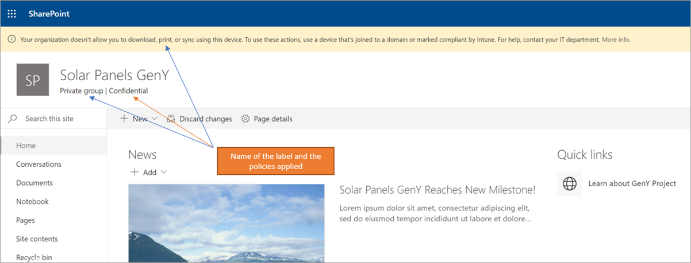

# <a name="use-sensitivity-labels-to-protect-content-in-microsoft-teams-microsoft-365-groups-and-sharepoint-sites"></a><span data-ttu-id="f5d30-103">使用敏感度標籤來保護 Microsoft Teams、Microsoft 365 群組和 SharePoint 網站中的內容</span><span class="sxs-lookup"><span data-stu-id="f5d30-103">Use sensitivity labels to protect content in Microsoft Teams, Microsoft 365 groups, and SharePoint sites</span></span>

><span data-ttu-id="f5d30-104">*[Microsoft 365 安全性與合規性的授權指引](https://aka.ms/ComplianceSD)。*</span><span class="sxs-lookup"><span data-stu-id="f5d30-104">*[Microsoft 365 licensing guidance for security & compliance](https://aka.ms/ComplianceSD).*</span></span>

<span data-ttu-id="f5d30-105">除了使用[敏感度標籤](sensitivity-labels.md)來分類及保護文件和電子郵件，您也可以使用敏感度標籤來保護下列容器中的內容：Microsoft Teams 網站、Microsoft 365 群組 ([之前的 Office 365 群組](https://techcommunity.microsoft.com/t5/microsoft-365-blog/office-365-groups-will-become-microsoft-365-groups/ba-p/1303601)) 和 SharePoint 網站。</span><span class="sxs-lookup"><span data-stu-id="f5d30-105">In addition to using [sensitivity labels](sensitivity-labels.md) to classify and protect documents and emails, you can also use sensitivity labels to protect content in the following containers: Microsoft Teams sites, Microsoft 365 groups ([formerly Office 365 groups](https://techcommunity.microsoft.com/t5/microsoft-365-blog/office-365-groups-will-become-microsoft-365-groups/ba-p/1303601)), and SharePoint sites.</span></span> <span data-ttu-id="f5d30-106">針對此容器層級分類和保護，使用下列標籤設定：</span><span class="sxs-lookup"><span data-stu-id="f5d30-106">For this container-level classification and protection, use the following label settings:</span></span>

- <span data-ttu-id="f5d30-107">Microsoft 365 群組連線小組網站的隱私權 (公開或私人)</span><span class="sxs-lookup"><span data-stu-id="f5d30-107">Privacy (public or private) of Microsoft 365 group-connected teams sites</span></span>
- <span data-ttu-id="f5d30-108">外部使用者存取</span><span class="sxs-lookup"><span data-stu-id="f5d30-108">External users access</span></span>
- <span data-ttu-id="f5d30-109">從未受控裝置存取</span><span class="sxs-lookup"><span data-stu-id="f5d30-109">Access from unmanaged devices</span></span> 

<span data-ttu-id="f5d30-110">當您將此敏感度標籤套用至支援的容器時，標籤會自動將分類和保護設定套用至連線的網站或群組。</span><span class="sxs-lookup"><span data-stu-id="f5d30-110">When you apply this sensitivity label to a supported container, the label automatically applies the classification and protection settings to the connected site or group.</span></span>

<span data-ttu-id="f5d30-111">不過，這些容器中的內容不會繼承分類的標籤和設定 (如視覺標記或加密)。</span><span class="sxs-lookup"><span data-stu-id="f5d30-111">Content in these containers however, do not inherit the labels for the classification and settings such as visual markings, or encryption.</span></span> <span data-ttu-id="f5d30-112">因此，使用者可以為其在 SharePoint 網站或小組網站中的文件加上標籤，請確定已[對 SharePoint 和 OneDrive 中的 Office 檔案啟用敏感度標籤](sensitivity-labels-sharepoint-onedrive-files.md)。</span><span class="sxs-lookup"><span data-stu-id="f5d30-112">So that users can label their documents in SharePoint sites or team sites, make sure you've [enabled sensitivity labels for Office files in SharePoint and OneDrive](sensitivity-labels-sharepoint-onedrive-files.md).</span></span>

> [!NOTE]
> <span data-ttu-id="f5d30-113">容器的敏感度標籤不支援使用 Office 365 內容傳遞網路 (CDN)。</span><span class="sxs-lookup"><span data-stu-id="f5d30-113">Sensitivity labels for containers aren't supported with Office 365 Content Delivery Networks (CDNs).</span></span>

## <a name="using-sensitivity-labels-for-microsoft-teams-microsoft-365-groups-and-sharepoint-sites"></a><span data-ttu-id="f5d30-114">在對 Microsoft Teams、Microsoft 365 群組和 SharePoint 網站使用敏感度標籤時遇到問題嗎？</span><span class="sxs-lookup"><span data-stu-id="f5d30-114">Using sensitivity labels for Microsoft Teams, Microsoft 365 groups, and SharePoint sites</span></span>

<span data-ttu-id="f5d30-115">啟用容器的敏感度標籤並設定新設定的敏感度標籤前，使用者可在其應用程式中查看並套用敏感度標籤。</span><span class="sxs-lookup"><span data-stu-id="f5d30-115">Before you enable sensitivity labels for containers and configure sensitivity labels for the new settings, users can see and apply sensitivity labels in their apps.</span></span> <span data-ttu-id="f5d30-116">例如，在 Word 中：</span><span class="sxs-lookup"><span data-stu-id="f5d30-116">For example, from Word:</span></span>


<span data-ttu-id="f5d30-118">啟用並設定容器的敏感度標籤後，使用者可進一步查看並將敏感度標籤套用至 Microsoft 小組網站、Microsoft 365 群組和 SharePoint 網站。</span><span class="sxs-lookup"><span data-stu-id="f5d30-118">After you enable and configure sensitivity labels for containers, users can additionally see and apply sensitivity labels to Microsoft team sites, Microsoft 365 groups, and SharePoint sites.</span></span> <span data-ttu-id="f5d30-119">例如，從 SharePoint 建立新的小組網站時：</span><span class="sxs-lookup"><span data-stu-id="f5d30-119">For example, when you create a new team site from SharePoint:</span></span>


## <a name="how-to-enable-sensitivity-labels-for-containers-and-synchronize-labels"></a><span data-ttu-id="f5d30-121">如何為容器啟用敏感度標籤以及同步處理標籤</span><span class="sxs-lookup"><span data-stu-id="f5d30-121">How to enable sensitivity labels for containers and synchronize labels</span></span>

1. <span data-ttu-id="f5d30-122">由於此功能使用 Azure AD 功能，請依照 Azure AD 文件中的指示來啟用敏感度標籤支援：[將敏感度標籤指派到 Azure Active Directory 中的 Microsoft 365 群組](https://docs.microsoft.com/azure/active-directory/users-groups-roles/groups-assign-sensitivity-labels)。</span><span class="sxs-lookup"><span data-stu-id="f5d30-122">Because this feature uses Azure AD functionality, follow the instructions from the Azure AD documentation to enable sensitivity label support: [Assign sensitivity labels to Microsoft 365 groups in Azure Active Directory](https://docs.microsoft.com/azure/active-directory/users-groups-roles/groups-assign-sensitivity-labels).</span></span>

2. <span data-ttu-id="f5d30-123">您現在需要將敏感度標籤同步處理至 Azure AD。</span><span class="sxs-lookup"><span data-stu-id="f5d30-123">You now need to synchronize your sensitivity labels to Azure AD.</span></span> <span data-ttu-id="f5d30-124">第一，[連接到 Office 365 安全性與合規性中心 PowerShell](/powershell/exchange/office-365-scc/connect-to-scc-powershell/connect-to-scc-powershell)。</span><span class="sxs-lookup"><span data-stu-id="f5d30-124">First, [connect to Office 365 Security & Compliance Center PowerShell](/powershell/exchange/office-365-scc/connect-to-scc-powershell/connect-to-scc-powershell).</span></span> 
    
    <span data-ttu-id="f5d30-125">例如，在您以系統管理員身分執行的 PowerShell 工作階段中，使用全域系統管理員帳戶登入：</span><span class="sxs-lookup"><span data-stu-id="f5d30-125">For example, in a PowerShell session that you run as administrator, sign in with a global administrator account:</span></span>
    
    ```powershell
    Set-ExecutionPolicy RemoteSigned
    $UserCredential = Get-Credential
    $Session = New-PSSession -ConfigurationName Microsoft.Exchange -ConnectionUri https://ps.compliance.protection.outlook.com/powershell-liveid/ -Credential $UserCredential -Authentication Basic -AllowRedirection
    Import-PSSession $Session -DisableNameChecking
    ```

3. <span data-ttu-id="f5d30-126">然後執行下列命令，以確保您的敏感度標籤可以搭配 Microsoft 365 群組使用：</span><span class="sxs-lookup"><span data-stu-id="f5d30-126">Then run the following command to ensure your sensitivity labels can be used with Microsoft 365 groups:</span></span>
    
    ```powershell
    Execute-AzureAdLabelSync
    ```

## <a name="how-to-configure-site-and-group-settings"></a><span data-ttu-id="f5d30-127">如何設定網站和群組設定</span><span class="sxs-lookup"><span data-stu-id="f5d30-127">How to configure site and group settings</span></span>

<span data-ttu-id="f5d30-128">您現在可以建立或編輯需要用於網站和群組的敏感度標籤。</span><span class="sxs-lookup"><span data-stu-id="f5d30-128">You're now ready to create or edit sensitivity labels that you want to be available for sites and groups.</span></span> <span data-ttu-id="f5d30-129">啟用容器的敏感度標籤可在敏感度標籤精靈中顯示新頁面：**網站和群組設定**</span><span class="sxs-lookup"><span data-stu-id="f5d30-129">Enabling sensitivity labels for containers makes a new page visible in the sensitivity labeling wizards: **Site and group settings**</span></span>

<span data-ttu-id="f5d30-130">如果您需要建立或編輯敏感度標籤的協助，請參閱[建立及設定敏感度標籤](create-sensitivity-labels.md#create-and-configure-sensitivity-labels)的指示。</span><span class="sxs-lookup"><span data-stu-id="f5d30-130">If you need help with creating or editing a sensitivity label, see the instructions from [Create and configure sensitivity labels](create-sensitivity-labels.md#create-and-configure-sensitivity-labels).</span></span>

<span data-ttu-id="f5d30-131">在這個新的**網站和群組設定**頁面上，設定以下設定：</span><span class="sxs-lookup"><span data-stu-id="f5d30-131">On this new **Site and group settings** page, configure the settings:</span></span>

- <span data-ttu-id="f5d30-132">**Office 365 群組連線團隊網站的隱私權**：如果您希望組織中所有人都能存取套用此標籤的團隊網站或群組，請保留預設值 [公用 - 組織中的任何人都可以存取網站]\*\*\*\*。</span><span class="sxs-lookup"><span data-stu-id="f5d30-132">**Privacy of Office 365 group-connected teams sites**: Keep the default of **Public - anyone in the organization can access the site** if you want anyone in your organization to access the team site or group where this label is applied.</span></span>
    
    <span data-ttu-id="f5d30-133">如果您希望僅限組織中經核准的成員能存取，請選取 [私人]\*\*\*\*。</span><span class="sxs-lookup"><span data-stu-id="f5d30-133">Select **Private** if you want access to be restricted to only approved members in your organization.</span></span>
    
    <span data-ttu-id="f5d30-134">如果您想要使用敏感度標籤來保護容器中的內容，但仍讓使用者自行設定隱私權設定，則選取 [無 - 讓使用者選擇可以存取網站的人員]\*\*\*\*。</span><span class="sxs-lookup"><span data-stu-id="f5d30-134">Select **None - let user chose who can access the site** when you want to protect content in the container by using the sensitivity label, but still let users configure the privacy setting themselves.</span></span>
    
    <span data-ttu-id="f5d30-135">將此標籤套用至容器時，請選取 [公用]\*\*\*\* 或 [私人]\*\*\*\* 設定來設定和鎖定隱私權設定。</span><span class="sxs-lookup"><span data-stu-id="f5d30-135">The settings of **Public** or **Private** set and lock the privacy setting when you apply this label to the container.</span></span> <span data-ttu-id="f5d30-136">您選擇的設定會取代先前為小組或群組設定的任何隱私權設定，並鎖定隱私權值，因此必須先移除容器的敏感度標籤才能變更隱私權設定。</span><span class="sxs-lookup"><span data-stu-id="f5d30-136">Your chosen setting replaces any previous privacy setting that might be configured for the team or group, and locks the privacy value so it can be changed only by first removing the sensitivity label from the container.</span></span> <span data-ttu-id="f5d30-137">移除敏感度標籤後，標籤的隱私權設定會保留，使用者現在便可再次變更隱私權設定。</span><span class="sxs-lookup"><span data-stu-id="f5d30-137">After you remove the sensitivity label, the privacy setting from the label remains and users can now change it again.</span></span>

- <span data-ttu-id="f5d30-138">**外部使用者存取**：控制群組擁有者是否可以[將來賓新增至群組](/office365/admin/create-groups/manage-guest-access-in-groups)。</span><span class="sxs-lookup"><span data-stu-id="f5d30-138">**External users access**: Control whether the group owner can [add guests to the group](/office365/admin/create-groups/manage-guest-access-in-groups).</span></span>

- <span data-ttu-id="f5d30-139">**未受管理的裝置**：針對[未受管理的裝置](/sharepoint/control-access-from-unmanaged-devices)，允許完全存取、僅限 Web 存取，或完全封鎖存取權。</span><span class="sxs-lookup"><span data-stu-id="f5d30-139">**Unmanaged devices**: For [unmanaged devices](/sharepoint/control-access-from-unmanaged-devices), allow full access, web only access, or block access completely.</span></span> <span data-ttu-id="f5d30-140">如果您已在租用戶層級或特定網站上設定此設定，則僅在限制性更強的情況下才會套用此處指定的設定。</span><span class="sxs-lookup"><span data-stu-id="f5d30-140">If you have configured this setting at the tenant level or for a specific site, the setting you specify here will be applied only if it's more restrictive.</span></span>


> [!IMPORTANT]
> <span data-ttu-id="f5d30-142">將標籤套用至小組、群組或網站時，只有這些網站和群組設定會生效。</span><span class="sxs-lookup"><span data-stu-id="f5d30-142">Only these site and group settings take effect when you apply the label to a team, group, or site.</span></span> <span data-ttu-id="f5d30-143">其他標籤設定，例如加密和內容標記，均不會套用至小組、群組或網站內的內容。</span><span class="sxs-lookup"><span data-stu-id="f5d30-143">Other label settings, such as encryption and content marking, aren't applied to the content within the team, group, or site.</span></span>
> 
> <span data-ttu-id="f5d30-144">逐漸向租用戶推出：使用者在建立小組、群組和網站時，只有具有網站和群組設定的標籤才可供選取。</span><span class="sxs-lookup"><span data-stu-id="f5d30-144">Gradually rolling out to tenants: Only labels with the site and group settings will be available to select when users create teams, groups, and sites.</span></span> <span data-ttu-id="f5d30-145">如果您目前可以在標籤未啟用網站和群組設定時將標籤套用至容器，則會套用至容器的只有標籤名稱。</span><span class="sxs-lookup"><span data-stu-id="f5d30-145">If you can currently apply a label to a container when the label doesn't have the site and group settings enabled, only the label name is applied to the container.</span></span>

<span data-ttu-id="f5d30-146">如果您的敏感度標籤尚未發佈，現在請[將標籤新增至敏感度標籤原則](create-sensitivity-labels.md#publish-sensitivity-labels-by-creating-a-label-policy)以進行發佈。</span><span class="sxs-lookup"><span data-stu-id="f5d30-146">If your sensitivity label isn't already published, now publish it by [adding it to a sensitivity label policy](create-sensitivity-labels.md#publish-sensitivity-labels-by-creating-a-label-policy).</span></span> <span data-ttu-id="f5d30-147">包含此標籤、獲指派敏感度標籤原則的使用者將可以為網站和群組選取它。</span><span class="sxs-lookup"><span data-stu-id="f5d30-147">The users who are assigned a sensitivity label policy that includes this label will be able to select it for sites and groups.</span></span>

<span data-ttu-id="f5d30-148">當您將此標籤套用至容器時，則標籤原則中適用的原則設定只有 [預設將此標籤套用至文件和電子郵件]\*\*\*\*。</span><span class="sxs-lookup"><span data-stu-id="f5d30-148">From the label policy, only the policy setting **Apply this label by default to documents and email** is applicable when you apply this label to containers.</span></span> <span data-ttu-id="f5d30-149">其他原則設定則不會套用，這些設定包括強制標記、需要使用者理由以及用來自訂說明頁面的連結。</span><span class="sxs-lookup"><span data-stu-id="f5d30-149">Other policy settings are not applied, which include mandatory labeling, requiring user justification, and a link to the custom help page.</span></span>

## <a name="sensitivity-label-management"></a><span data-ttu-id="f5d30-150">敏感度標籤管理</span><span class="sxs-lookup"><span data-stu-id="f5d30-150">Sensitivity label management</span></span>

<span data-ttu-id="f5d30-151">建立、修改或刪除為網站和群組設定的敏感度標籤時，請使用下列指導方針。</span><span class="sxs-lookup"><span data-stu-id="f5d30-151">Use the following guidance for when you create, modify, or delete sensitivity labels that are configured for sites and groups.</span></span>

### <a name="creating-and-publishing-labels-that-are-configured-for-sites-and-groups"></a><span data-ttu-id="f5d30-152">建立及發佈針對網站和群組設定的標籤</span><span class="sxs-lookup"><span data-stu-id="f5d30-152">Creating and publishing labels that are configured for sites and groups</span></span>

<span data-ttu-id="f5d30-153">建立並發佈新敏感度標籤後，在一個小時內小組、群組和網站中的使用者就會看到該標籤。</span><span class="sxs-lookup"><span data-stu-id="f5d30-153">When a new sensitivity label is created and published, it's visible for users in teams, groups, and sites within one hour.</span></span> <span data-ttu-id="f5d30-154">不過，如果您修改現有的標籤，最多需要等候 24 小時。</span><span class="sxs-lookup"><span data-stu-id="f5d30-154">However, if you modify an existing label, allow up to 24 hours.</span></span> <span data-ttu-id="f5d30-155">當標籤時是針對網站和群組進行設定時，請使用下列指導方針來為您的使用者發佈該標籤：</span><span class="sxs-lookup"><span data-stu-id="f5d30-155">Use the following guidance to publish a label for your users when that label is configured for site and group settings:</span></span>

1. <span data-ttu-id="f5d30-156">建立及設定敏感度標籤之後，請將此標籤新增至只適用一些測試使用者的標籤原則。</span><span class="sxs-lookup"><span data-stu-id="f5d30-156">After you create and configure the sensitivity label, add this label to a label policy that applies to just a few test users.</span></span>

2. <span data-ttu-id="f5d30-157">等候複寫變更：</span><span class="sxs-lookup"><span data-stu-id="f5d30-157">Wait for the change to replicate:</span></span>
    - <span data-ttu-id="f5d30-158">新標籤：等待 1 小時。</span><span class="sxs-lookup"><span data-stu-id="f5d30-158">New label: Wait for one hour.</span></span>
    - <span data-ttu-id="f5d30-159">現有標籤：等候 24 小時。</span><span class="sxs-lookup"><span data-stu-id="f5d30-159">Existing label: Wait for 24 hours.</span></span>

3. <span data-ttu-id="f5d30-160">在此等候期間之後，請使用其中一個測試使用者帳戶來建立小組、Microsoft 365 群組或 SharePoint 網站，並搭配您在步驟 1 中建立的標籤。</span><span class="sxs-lookup"><span data-stu-id="f5d30-160">After this wait period, use one of the test user accounts to create a team, Microsoft 365 group, or SharePoint site with the label that you created in step 1.</span></span>

4. <span data-ttu-id="f5d30-161">如果在此建立作業期間沒有發生任何錯誤，您便知道可以安全地將標籤發佈給租用戶中的所有使用者。</span><span class="sxs-lookup"><span data-stu-id="f5d30-161">If there are no errors during this creation operation, you know it's safe to publish the label to all users in your tenant.</span></span>

### <a name="modifying-published-labels-that-are-configured-for-sites-and-groups"></a><span data-ttu-id="f5d30-162">修改針對網站和群組設定的已發佈標籤</span><span class="sxs-lookup"><span data-stu-id="f5d30-162">Modifying published labels that are configured for sites and groups</span></span>

<span data-ttu-id="f5d30-163">最佳做法是，不要在將標籤套用至小組、群組或網站之後，變更敏感度標籤的網站和群組設定。</span><span class="sxs-lookup"><span data-stu-id="f5d30-163">As a best practice, don't change the site and group settings for a sensitivity label after the label has been applied to teams, groups, or sites.</span></span> <span data-ttu-id="f5d30-164">如果您這麼做，請等候最多 24 小時的時間，讓變更複寫至已套用標籤的所有容器。</span><span class="sxs-lookup"><span data-stu-id="f5d30-164">If you do, remember to wait for 24 hours for the changes to replicate to all containers that have the label applied.</span></span> 

<span data-ttu-id="f5d30-165">此外，如果您的變更包括 [外部使用者存取]\*\*\*\* 設定：</span><span class="sxs-lookup"><span data-stu-id="f5d30-165">In addition, if your changes include the **External users access** setting:</span></span>

- <span data-ttu-id="f5d30-166">新設定會套用至新使用者，但不會套用至現有使用者。</span><span class="sxs-lookup"><span data-stu-id="f5d30-166">The new setting applies to new users but not to existing users.</span></span> <span data-ttu-id="f5d30-167">例如，如果先前已選取此設定，且因此來賓使用者可存取網站，在標籤設定中清除此設定之後，這些來賓使用者仍然可以存取網站。</span><span class="sxs-lookup"><span data-stu-id="f5d30-167">For example, if this setting was previously selected and as a result, guest users accessed the site, these guest users can still access the site after this setting is cleared in the label configuration.</span></span>

- <span data-ttu-id="f5d30-168">群組屬性 hiddenMembership 和 roleEnabled 的隱私權設定不會更新。</span><span class="sxs-lookup"><span data-stu-id="f5d30-168">The privacy settings for the group properties hiddenMembership and roleEnabled aren't updated.</span></span>


### <a name="deleting-published-labels-that-are-configured-for-sites-and-groups"></a><span data-ttu-id="f5d30-169">刪除針對網站和群組設定的已發佈標籤</span><span class="sxs-lookup"><span data-stu-id="f5d30-169">Deleting published labels that are configured for sites and groups</span></span>

<span data-ttu-id="f5d30-170">如果您刪除已啟用網站和群組設定的敏感度標籤，且該標籤包含在一或多個標籤原則中，此動作可能會導致新小組、群組和網站建立失敗。</span><span class="sxs-lookup"><span data-stu-id="f5d30-170">If you delete a sensitivity label that has the site and group settings enabled, and that label is included in one or more label policies, this action can result in creation failures for new teams, groups, and sites.</span></span> <span data-ttu-id="f5d30-171">若要避免此情況，請使用下列指導方針：</span><span class="sxs-lookup"><span data-stu-id="f5d30-171">To avoid this situation, use the following guidance:</span></span>

1. <span data-ttu-id="f5d30-172">從包含標籤的所有標籤原則中移除敏感度標籤。</span><span class="sxs-lookup"><span data-stu-id="f5d30-172">Remove the sensitivity label from all label policies that include the label.</span></span>

2. <span data-ttu-id="f5d30-173">請等候 1 小時。</span><span class="sxs-lookup"><span data-stu-id="f5d30-173">Wait for one hour.</span></span>

3. <span data-ttu-id="f5d30-174">在此等候期間之後，請嘗試建立小組、群組或網站，並確認標籤已不再顯示。</span><span class="sxs-lookup"><span data-stu-id="f5d30-174">After this wait period, try creating a team, group, or site and confirm that the label is no longer visible.</span></span>

4. <span data-ttu-id="f5d30-175">如果敏感度標籤未顯示，您現在可以放心地刪除標籤。</span><span class="sxs-lookup"><span data-stu-id="f5d30-175">If the sensitivity label isn't visible, you can now safely delete the label.</span></span>

## <a name="how-to-apply-sensitivity-labels-to-containers"></a><span data-ttu-id="f5d30-176">如何將敏感度標籤套用至容器</span><span class="sxs-lookup"><span data-stu-id="f5d30-176">How to apply sensitivity labels to containers</span></span>

<span data-ttu-id="f5d30-177">您現在可以將敏感度標籤或標籤套用至下列容器：</span><span class="sxs-lookup"><span data-stu-id="f5d30-177">You're now ready to apply the sensitivity label or labels to the following containers:</span></span>

- [<span data-ttu-id="f5d30-178">Azure AD 中的 Microsoft 365 群組</span><span class="sxs-lookup"><span data-stu-id="f5d30-178">Microsoft 365 group in Azure AD</span></span>](#apply-sensitivity-labels-to-microsoft-365-groups)
- [<span data-ttu-id="f5d30-179">Microsoft Teams 小組網站</span><span class="sxs-lookup"><span data-stu-id="f5d30-179">Microsoft Teams team site</span></span>](#apply-a-sensitivity-label-to-a-new-team)
- [<span data-ttu-id="f5d30-180">Outlook 網頁版中的 Microsoft 365 群組</span><span class="sxs-lookup"><span data-stu-id="f5d30-180">Microsoft 365 group in Outlook on the web</span></span>](#apply-a-sensitivity-label-to-a-new-group-in-outlook-on-the-web)
- [<span data-ttu-id="f5d30-181">SharePoint 網站</span><span class="sxs-lookup"><span data-stu-id="f5d30-181">SharePoint site</span></span>](#apply-a-sensitivity-label-to-a-new-site)

<span data-ttu-id="f5d30-182">如果您需要[將敏感度標籤套用至多個網站](#use-powershell-to-apply-a-sensitivity-label-to-multiple-sites)，您可以使用 PowerShell。</span><span class="sxs-lookup"><span data-stu-id="f5d30-182">You can use PowerShell if you need to [apply a sensitivity label to multiple sites](#use-powershell-to-apply-a-sensitivity-label-to-multiple-sites).</span></span>

### <a name="apply-sensitivity-labels-to-microsoft-365-groups"></a><span data-ttu-id="f5d30-183">將敏感度標籤套用至 Microsoft 365 群組</span><span class="sxs-lookup"><span data-stu-id="f5d30-183">Apply sensitivity labels to Microsoft 365 groups</span></span>

<span data-ttu-id="f5d30-184">您現在可以將敏感度標籤或標籤套用至 Microsoft 365 群組。</span><span class="sxs-lookup"><span data-stu-id="f5d30-184">You're now ready to apply the sensitivity label or labels to Microsoft 365 groups.</span></span> <span data-ttu-id="f5d30-185">如需指示，請返回 Azure AD 文件：</span><span class="sxs-lookup"><span data-stu-id="f5d30-185">Return to the Azure AD documentation for instructions:</span></span>

- [<span data-ttu-id="f5d30-186">在 Azure 入口網站中將標籤指派至新群組</span><span class="sxs-lookup"><span data-stu-id="f5d30-186">Assign a label to a new group in Azure portal</span></span>](https://docs.microsoft.com/azure/active-directory/users-groups-roles/groups-assign-sensitivity-labels#assign-a-label-to-a-new-group-in-azure-portal)

-  [<span data-ttu-id="f5d30-187">在 Azure 入口網站中將標籤指派至現有群組</span><span class="sxs-lookup"><span data-stu-id="f5d30-187">Assign a label to an existing group in Azure portal</span></span>](https://docs.microsoft.com/azure/active-directory/users-groups-roles/groups-assign-sensitivity-labels#assign-a-label-to-an-existing-group-in-azure-portal)

-  <span data-ttu-id="f5d30-188">[在 Azure 入口網站中將標籤從現有群組移除](https://docs.microsoft.com/azure/active-directory/users-groups-roles/groups-assign-sensitivity-labels#remove-a-label-from-an-existing-group-in-azure-portal)。</span><span class="sxs-lookup"><span data-stu-id="f5d30-188">[Remove a label from an existing group in Azure portal](https://docs.microsoft.com/azure/active-directory/users-groups-roles/groups-assign-sensitivity-labels#remove-a-label-from-an-existing-group-in-azure-portal).</span></span>

### <a name="apply-a-sensitivity-label-to-a-new-team"></a><span data-ttu-id="f5d30-189">將敏感度標籤套用至新的小組</span><span class="sxs-lookup"><span data-stu-id="f5d30-189">Apply a sensitivity label to a new team</span></span>

<span data-ttu-id="f5d30-190">當使用者在 Microsoft Teams 中建立新小組時，可選取敏感度標籤。</span><span class="sxs-lookup"><span data-stu-id="f5d30-190">Users can select sensitivity labels when they create new teams in Microsoft Teams.</span></span> <span data-ttu-id="f5d30-191">當使用者從 [敏感度]\*\*\*\* 下拉式功能表中選取標籤時，隱私權設定可能會變更以反映標籤設定。</span><span class="sxs-lookup"><span data-stu-id="f5d30-191">When they select the label from the **Sensitivity** dropdown, the privacy setting might change to reflect the label configuration.</span></span> <span data-ttu-id="f5d30-192">根據您為標籤選取的外部使用者存取設定，使用者可以或無法將組織外部的人員新增至小組。</span><span class="sxs-lookup"><span data-stu-id="f5d30-192">Depending on the external users access setting you selected for the label, users can or can't add people outside the organization to the team.</span></span>

[<span data-ttu-id="f5d30-193">深入了解 Teams 的敏感度標籤</span><span class="sxs-lookup"><span data-stu-id="f5d30-193">Learn more about sensitivity labels for Teams</span></span>](https://docs.microsoft.com/microsoftteams/sensitivity-labels)


<span data-ttu-id="f5d30-195">建立小組之後，敏感度標籤會顯示在所有頻道的右上角。</span><span class="sxs-lookup"><span data-stu-id="f5d30-195">After you create the team, the sensitivity label appears in the upper-right corner of all channels.</span></span>


<span data-ttu-id="f5d30-197">服務自動將相同的敏感度標籤套用至 Microsoft 365 群組和連線的 SharePoint 小組網站。</span><span class="sxs-lookup"><span data-stu-id="f5d30-197">The service automatically applies the same sensitivity label to the Microsoft 365 group and the connected SharePoint team site.</span></span>

### <a name="apply-a-sensitivity-label-to-a-new-group-in-outlook-on-the-web"></a><span data-ttu-id="f5d30-198">在 Outlook 網頁版中將敏感度標籤套用至新的群組</span><span class="sxs-lookup"><span data-stu-id="f5d30-198">Apply a sensitivity label to a new group in Outlook on the web</span></span>

<span data-ttu-id="f5d30-199">在 Outlook 網頁版中，當您建立新的群組時，您可以選取或變更已發佈標籤的**敏感度**選項：</span><span class="sxs-lookup"><span data-stu-id="f5d30-199">In Outlook on the web, when you create a new group, you can select or change the **Sensitivity** option for published labels:</span></span>

![建立群組並選取 [敏感度] 底下的選項](../media/sensitivity-label-new-group.png)

### <a name="apply-a-sensitivity-label-to-a-new-site"></a><span data-ttu-id="f5d30-201">將敏感度標籤套用至新的網站</span><span class="sxs-lookup"><span data-stu-id="f5d30-201">Apply a sensitivity label to a new site</span></span>

<span data-ttu-id="f5d30-202">系統管理員和使用者可以在[建立新式小組網站和通訊網站](/sharepoint/create-site-collection)時選取敏感度標籤，然後展開 [進階設定]\*\*\*\*：</span><span class="sxs-lookup"><span data-stu-id="f5d30-202">Admins and end users can select sensitivity labels when they [create modern team sites and communication sites](/sharepoint/create-site-collection), and expand **Advanced settings**:</span></span>

![建立網站並選取 [敏感度] 底下的選項](../media/sensitivity-label-new-communication-site.png)

<span data-ttu-id="f5d30-204">下拉式方塊會顯示所選項目的標籤名稱，[說明] 圖示則會顯示所有標籤名稱及其工具提示，以協助使用者判斷所要套用的正確標籤。</span><span class="sxs-lookup"><span data-stu-id="f5d30-204">The dropdown box displays the label names for the selection, and the help icon displays all the label names with their tooltip, which can help users determine the correct label to apply.</span></span>

<span data-ttu-id="f5d30-205">當標籤已套用，且使用者瀏覽至網站時，其便可看到標籤的名稱和所套用的原則。</span><span class="sxs-lookup"><span data-stu-id="f5d30-205">When the label is applied, and users browse to the site, they see the name of the label and applied policies.</span></span> <span data-ttu-id="f5d30-206">例如，此網站已加上 [機密]\*\*\*\* 標籤，且隱私權設定設為 [私人]\*\*\*\*：</span><span class="sxs-lookup"><span data-stu-id="f5d30-206">For example, this site has been labeled as **Confidential**, and the privacy setting is set to **Private**:</span></span>



### <a name="use-powershell-to-apply-a-sensitivity-label-to-multiple-sites"></a><span data-ttu-id="f5d30-208">使用 PowerShell 將敏感度標籤套用至多個網站</span><span class="sxs-lookup"><span data-stu-id="f5d30-208">Use PowerShell to apply a sensitivity label to multiple sites</span></span>

<span data-ttu-id="f5d30-209">您可以從目前的 SharePoint Online 管理命令介面使用 [Set-SPOSite](/powershell/module/sharepoint-online/set-sposite?view=sharepoint-ps) 和 [Set-SPOTenant](/powershell/module/sharepoint-online/set-spotenant?view=sharepoint-ps) Cmdlet 搭配 *SensitivityLabel* 參數，將敏感度標籤套用至許多網站。</span><span class="sxs-lookup"><span data-stu-id="f5d30-209">You can use the [Set-SPOSite](/powershell/module/sharepoint-online/set-sposite?view=sharepoint-ps) and [Set-SPOTenant](/powershell/module/sharepoint-online/set-spotenant?view=sharepoint-ps) cmdlet with the *SensitivityLabel* parameter from the current SharePoint Online Management Shell to apply a sensitivity label to many sites.</span></span> <span data-ttu-id="f5d30-210">網站可以是任何 SharePoint 網站集合，或 OneDrive 網站。</span><span class="sxs-lookup"><span data-stu-id="f5d30-210">The sites can be any SharePoint site collection, or a OneDrive site.</span></span>

<span data-ttu-id="f5d30-211">確定您有 SharePoint Online 管理命令介面的版本 16.0.19418.12000 或更新版本。</span><span class="sxs-lookup"><span data-stu-id="f5d30-211">Make sure you have version 16.0.19418.12000 or later of the SharePoint Online Management Shell.</span></span>

1. <span data-ttu-id="f5d30-212">使用 [以系統管理員身分執行]\*\*\*\* 選項開啟 PowerShell 工作階段。</span><span class="sxs-lookup"><span data-stu-id="f5d30-212">Open a PowerShell session with the **Run as Administrator** option.</span></span>

2. <span data-ttu-id="f5d30-213">如果您不知道標籤 GUID：[連線至 Office 365 安全性與合規性中心 PowerShell](https://docs.microsoft.com/powershell/exchange/office-365-scc/connect-to-scc-powershell/connect-to-scc-powershell?view=exchange-ps)，並取得敏感度標籤及其 GUID 清單。</span><span class="sxs-lookup"><span data-stu-id="f5d30-213">If you don't know your label GUID: [Connect to Office 365 Security & Compliance Center PowerShell](https://docs.microsoft.com/powershell/exchange/office-365-scc/connect-to-scc-powershell/connect-to-scc-powershell?view=exchange-ps) and get the list of sensitivity labels and their GUIDs.</span></span>
    
    ```powershell
    Get-Label |ft Name, Guid
    ```

3. <span data-ttu-id="f5d30-214">現在[連線至 Exchange Online PowerShell](https://docs.microsoft.com/powershell/exchange/exchange-online/connect-to-exchange-online-powershell/connect-to-exchange-online-powershell?view=exchange-ps)，並將標籤 GUID 儲存為變數。</span><span class="sxs-lookup"><span data-stu-id="f5d30-214">Now [connect to Exchange Online PowerShell](https://docs.microsoft.com/powershell/exchange/exchange-online/connect-to-exchange-online-powershell/connect-to-exchange-online-powershell?view=exchange-ps) and store your label GUID as a variable.</span></span> <span data-ttu-id="f5d30-215">例如：</span><span class="sxs-lookup"><span data-stu-id="f5d30-215">For example:</span></span> 
    
    ```powershell
    $Id = [GUID]("e48058ea-98e8-4940-8db0-ba1310fd955e")
    ```

4. <span data-ttu-id="f5d30-216">建立可找出在其 URL 中有共同識別字串的多個網站的新變數。</span><span class="sxs-lookup"><span data-stu-id="f5d30-216">Create a new variable that identifies multiple sites that have an identifying string in common in their URL.</span></span> <span data-ttu-id="f5d30-217">例如：</span><span class="sxs-lookup"><span data-stu-id="f5d30-217">For example:</span></span>
    
    ```powershell
    $sites = Get-SPOSite -IncludePersonalSite $true -Limit all -Filter "Url -like 'documents" 
    ```

5. <span data-ttu-id="f5d30-218">執行下列命令，將標籤套用至這些網站。</span><span class="sxs-lookup"><span data-stu-id="f5d30-218">Run the following command to apply the label to these sites.</span></span> <span data-ttu-id="f5d30-219">使用我們的範例：</span><span class="sxs-lookup"><span data-stu-id="f5d30-219">Using our examples:</span></span>
    
    ```powershell
    $sites | ForEach-Object {Set-SpoTenant $_.url -SensitivityLabel $Id}
    ```

<span data-ttu-id="f5d30-220">若要將不同的標籤套用至不同的網站，請針對每個網站重複下列命令：`Set-SPOSite -Identity <URL> -SensitivityLabel "<labelguid>"`</span><span class="sxs-lookup"><span data-stu-id="f5d30-220">To apply different labels to different sites, repeat the following command for each site: `Set-SPOSite -Identity <URL> -SensitivityLabel "<labelguid>"`</span></span>

## <a name="view-and-manage-sensitivity-labels-in-the-sharepoint-admin-center"></a><span data-ttu-id="f5d30-221">在 SharePoint 系統管理中心檢視和管理敏感度標籤</span><span class="sxs-lookup"><span data-stu-id="f5d30-221">View and manage sensitivity labels in the SharePoint admin center</span></span>

<span data-ttu-id="f5d30-222">若要檢視、排序和搜尋套用的敏感度標籤，請使用新 SharePoint 系統管理中心的 [使用中網站]\*\*\*\* 頁面。</span><span class="sxs-lookup"><span data-stu-id="f5d30-222">To view, sort, and search the applied sensitivity labels, use the **Active sites** page in the new SharePoint admin center.</span></span> <span data-ttu-id="f5d30-223">您可能需要先新增 **[敏感度]** 欄：</span><span class="sxs-lookup"><span data-stu-id="f5d30-223">You might need to first add the **Sensitivity** column:</span></span>

![[使用中網站] 頁面上的 [敏感度] 欄](../media/manage-site-sensitivity-labels.png)

<span data-ttu-id="f5d30-225">如需從 [作用中網站] 頁面管理網站的詳細資訊，包括如何新增欄，請參閱[在新的 SharePoint 系統管理中心管理網站](/sharepoint/manage-sites-in-new-admin-center)。</span><span class="sxs-lookup"><span data-stu-id="f5d30-225">For more information about managing sites from the Active sites page, including how to add a column, see [Manage sites in the new SharePoint admin center](/sharepoint/manage-sites-in-new-admin-center).</span></span>

<span data-ttu-id="f5d30-226">您也可以從本頁面變更及套用標籤：</span><span class="sxs-lookup"><span data-stu-id="f5d30-226">You can also change and apply a label from this page:</span></span>

1. <span data-ttu-id="f5d30-227">選取網站名稱以開啟詳細資料窗格。</span><span class="sxs-lookup"><span data-stu-id="f5d30-227">Select the site name to open the details pane.</span></span>

2. <span data-ttu-id="f5d30-228">選取 [原則]\*\*\*\* 索引標籤，然後選取 [敏感度]\*\*\*\* 設定的 [編輯]\*\*\*\*。</span><span class="sxs-lookup"><span data-stu-id="f5d30-228">Select the **Policies** tab, and then select **Edit** for the **Sensitivity** setting.</span></span>

3. <span data-ttu-id="f5d30-229">從 [編輯敏感度設定]\*\*\*\* 窗格中，選取您要套用至網站的敏感度標籤，然後選取 [儲存]\*\*\*\*。</span><span class="sxs-lookup"><span data-stu-id="f5d30-229">From the **Edit sensitivity setting** pane, select the sensitivity label you want to apply to the site, and then select **Save**.</span></span>

## <a name="support-for-sensitivity-labels"></a><span data-ttu-id="f5d30-230">支援敏感度標籤</span><span class="sxs-lookup"><span data-stu-id="f5d30-230">Support for sensitivity labels</span></span>

<span data-ttu-id="f5d30-231">下列應用程式與服務支援針對網站和群組進行設定的敏感度標籤：</span><span class="sxs-lookup"><span data-stu-id="f5d30-231">The following apps and services support sensitivity labels configured for sites and group settings:</span></span>

- <span data-ttu-id="f5d30-232">系統管理中心：</span><span class="sxs-lookup"><span data-stu-id="f5d30-232">Admin centers:</span></span>
    - <span data-ttu-id="f5d30-233">SharePoint 系統管理中心</span><span class="sxs-lookup"><span data-stu-id="f5d30-233">SharePoint admin center</span></span>
    - <span data-ttu-id="f5d30-234">Azure Active Directory 入口網站</span><span class="sxs-lookup"><span data-stu-id="f5d30-234">Azure Active Directory portal</span></span>
    - <span data-ttu-id="f5d30-235">Microsoft 365 合規性中心、Microsoft 365 安全性中心、Office 365 安全性與合規性中心</span><span class="sxs-lookup"><span data-stu-id="f5d30-235">Microsoft 365 compliance center, Microsoft 365 security center, Office 365 Security & Compliance Center</span></span>

- <span data-ttu-id="f5d30-236">使用者應用程式與服務：</span><span class="sxs-lookup"><span data-stu-id="f5d30-236">User apps and services:</span></span>
    - <span data-ttu-id="f5d30-237">SharePoint</span><span class="sxs-lookup"><span data-stu-id="f5d30-237">SharePoint</span></span>
    - <span data-ttu-id="f5d30-238">Teams</span><span class="sxs-lookup"><span data-stu-id="f5d30-238">Teams</span></span>
    - <span data-ttu-id="f5d30-239">Outlook 網頁版和 Windows 版、MacOS 版、iOS 版及 Android 版</span><span class="sxs-lookup"><span data-stu-id="f5d30-239">Outlook on the web and for Windows, MacOS, iOS, and Android</span></span>
    - <span data-ttu-id="f5d30-240">Forms</span><span class="sxs-lookup"><span data-stu-id="f5d30-240">Forms</span></span>
    - <span data-ttu-id="f5d30-241">Stream</span><span class="sxs-lookup"><span data-stu-id="f5d30-241">Stream</span></span>

<span data-ttu-id="f5d30-242">下列應用程式與服務目前不支援針對網站和群組進行設定的敏感度標籤：</span><span class="sxs-lookup"><span data-stu-id="f5d30-242">The following apps and services don't currently support sensitivity labels configured for sites and group settings:</span></span>

- <span data-ttu-id="f5d30-243">系統管理中心：</span><span class="sxs-lookup"><span data-stu-id="f5d30-243">Admin centers:</span></span>
    - <span data-ttu-id="f5d30-244">Microsoft 365 系統管理中心</span><span class="sxs-lookup"><span data-stu-id="f5d30-244">Microsoft 365 admin center</span></span>
    - <span data-ttu-id="f5d30-245">Teams 系統管理中心</span><span class="sxs-lookup"><span data-stu-id="f5d30-245">Teams admin center</span></span>
    - <span data-ttu-id="f5d30-246">Exchange 系統管理中心</span><span class="sxs-lookup"><span data-stu-id="f5d30-246">Exchange admin center</span></span>

- <span data-ttu-id="f5d30-247">使用者應用程式與服務：</span><span class="sxs-lookup"><span data-stu-id="f5d30-247">User apps and services:</span></span>
    - <span data-ttu-id="f5d30-248">Dynamics 365</span><span class="sxs-lookup"><span data-stu-id="f5d30-248">Dynamics 365</span></span>
    - <span data-ttu-id="f5d30-249">Yammer</span><span class="sxs-lookup"><span data-stu-id="f5d30-249">Yammer</span></span>
    - <span data-ttu-id="f5d30-250">Planner</span><span class="sxs-lookup"><span data-stu-id="f5d30-250">Planner</span></span>
    - <span data-ttu-id="f5d30-251">Project</span><span class="sxs-lookup"><span data-stu-id="f5d30-251">Project</span></span>
    - <span data-ttu-id="f5d30-252">PowerBI</span><span class="sxs-lookup"><span data-stu-id="f5d30-252">PowerBI</span></span>

## <a name="classic-azure-ad-group-classification"></a><span data-ttu-id="f5d30-253">傳統 Azure AD 群組分類</span><span class="sxs-lookup"><span data-stu-id="f5d30-253">Classic Azure AD group classification</span></span>

<span data-ttu-id="f5d30-254">啟用容器的敏感度標籤之後，Microsoft 365 不再針對新的 Microsoft 365 群組和 SharePoint 網站支援舊分類。</span><span class="sxs-lookup"><span data-stu-id="f5d30-254">Microsoft 365 no longer supports the old classifications for new Microsoft 365 groups and SharePoint sites after you enable sensitivity labels for containers.</span></span> <span data-ttu-id="f5d30-255">不過，支援敏感度標籤的現有的群組和網站仍會顯示舊的分類值，直到您轉換它們以使用敏感度標籤為止。</span><span class="sxs-lookup"><span data-stu-id="f5d30-255">However, existing groups and sites that support sensitivity labels still display the old classification values until you convert them to use sensitivity labels.</span></span>

<span data-ttu-id="f5d30-256">如需您先前可能使用的 SharePoint 舊群組分類範例，請參閱 [SharePoint 新式網站分類](https://docs.microsoft.com/sharepoint/dev/solution-guidance/modern-experience-site-classification)。</span><span class="sxs-lookup"><span data-stu-id="f5d30-256">As an example of how you might have used the old group classification for SharePoint, see [SharePoint "modern" sites classification](https://docs.microsoft.com/sharepoint/dev/solution-guidance/modern-experience-site-classification).</span></span>

<span data-ttu-id="f5d30-257">這些分類是使用 Azure AD PowerShell 或 PnP 核心程式庫來設定，並定義 `ClassificationList` 設定的值。</span><span class="sxs-lookup"><span data-stu-id="f5d30-257">These classifications were configured by using Azure AD PowerShell or the PnP Core library and defining values for the `ClassificationList` setting.</span></span> <span data-ttu-id="f5d30-258">如果您的租用戶已定義分類值，當您從 [AzureADPreview PowerShell 模組](https://www.powershellgallery.com/packages/AzureADPreview)執行下列命令時，會顯示這些值：</span><span class="sxs-lookup"><span data-stu-id="f5d30-258">If your tenant has classification values defined, they are shown when you run the following command from the [AzureADPreview PowerShell module](https://www.powershellgallery.com/packages/AzureADPreview):</span></span>

```powershell
   ($setting["ClassificationList"])
```

<span data-ttu-id="f5d30-259">若要將舊分類轉換成敏感度標籤，請執行下列其中一項動作：</span><span class="sxs-lookup"><span data-stu-id="f5d30-259">To convert your old classifications to sensitivity labels, do one of the following:</span></span>

- <span data-ttu-id="f5d30-260">使用現有的標籤：編輯已發佈的現有敏感度標籤，以指定網站和群組需要的標籤設定。</span><span class="sxs-lookup"><span data-stu-id="f5d30-260">Use existing labels: Specify the label settings you want for sites and groups by editing existing sensitivity labels that are already published.</span></span>

- <span data-ttu-id="f5d30-261">建立新標籤：建立及發佈與現有分類名稱相同的新敏感度標籤，以指定網站和群組需要的標籤設定。</span><span class="sxs-lookup"><span data-stu-id="f5d30-261">Create new labels: Specify the label settings you want for sites and groups by creating and publishing new sensitivity labels that have the same names as your existing classifications.</span></span>

<span data-ttu-id="f5d30-262">然後：</span><span class="sxs-lookup"><span data-stu-id="f5d30-262">Then:</span></span> 

1. <span data-ttu-id="f5d30-263">使用 PowerShell，利用名稱對應將敏感度標籤套用至現有的 Microsoft 365 群組和 SharePoint 網站。</span><span class="sxs-lookup"><span data-stu-id="f5d30-263">Use PowerShell to apply the sensitivity labels to existing Microsoft 365 groups and SharePoint sites by using name mapping.</span></span> <span data-ttu-id="f5d30-264">請參閱下一節的指示。</span><span class="sxs-lookup"><span data-stu-id="f5d30-264">See the next section for instructions.</span></span>

2. <span data-ttu-id="f5d30-265">移除現有群組和網站的舊分類。</span><span class="sxs-lookup"><span data-stu-id="f5d30-265">Remove the old classifications from the existing groups and sites.</span></span>

<span data-ttu-id="f5d30-266">雖然您無法防止使用者在尚未支援敏感度標籤的應用程式和服務中建立新群組，但您可以執行週期性 PowerShell 指令碼來尋找使用者使用舊分類建立的新群組，並將它們轉換成使用敏感度標籤。</span><span class="sxs-lookup"><span data-stu-id="f5d30-266">Although you can't prevent users from creating new groups in apps and services that don't yet support sensitivity labels, you can run a recurring PowerShell script to look for new groups that users have created with the old classifications, and convert these to use sensitivity labels.</span></span> 

<span data-ttu-id="f5d30-267">若要協助您管理網站和群組的敏感度標籤與 Azure AD 分類的共存，請參閱 [Microsoft 365 群組的 Azure Active Directory 分類和敏感度標籤](migrate-aad-classification-sensitivity-labels.md)。</span><span class="sxs-lookup"><span data-stu-id="f5d30-267">To help you manage the coexistence of sensitivity labels and Azure AD classifications for sites and groups, see [Azure Active Directory classification and sensitivity labels for Microsoft 365 groups](migrate-aad-classification-sensitivity-labels.md).</span></span>

#### <a name="use-powershell-to-convert-classifications-for-microsoft-365-groups-to-sensitivity-labels"></a><span data-ttu-id="f5d30-268">使用 PowerShell 將 Microsoft 365 群組的分類轉換成敏感度標籤</span><span class="sxs-lookup"><span data-stu-id="f5d30-268">Use PowerShell to convert classifications for Microsoft 365 groups to sensitivity labels</span></span>

1. <span data-ttu-id="f5d30-269">第一，[連接到 Office 365 安全性與合規性中心 PowerShell](/powershell/exchange/office-365-scc/connect-to-scc-powershell/connect-to-scc-powershell)。</span><span class="sxs-lookup"><span data-stu-id="f5d30-269">First, [connect to Office 365 Security & Compliance Center PowerShell](/powershell/exchange/office-365-scc/connect-to-scc-powershell/connect-to-scc-powershell).</span></span> 
    
    <span data-ttu-id="f5d30-270">例如，在您以系統管理員身分執行的 PowerShell 工作階段中，使用全域系統管理員帳戶登入：</span><span class="sxs-lookup"><span data-stu-id="f5d30-270">For example, in a PowerShell session that you run as administrator, sign in with a global administrator account:</span></span>
    
    ```powershell
    Set-ExecutionPolicy RemoteSigned
    $UserCredential = Get-Credential
    $Session = New-PSSession -ConfigurationName Microsoft.Exchange -ConnectionUri https://ps.compliance.protection.outlook.com/powershell-liveid/ -Credential $UserCredential -Authentication Basic -AllowRedirection
    Import-PSSession $Session -DisableNameChecking
    ```

2. <span data-ttu-id="f5d30-271">透過使用 [Get-Label](https://docs.microsoft.com/powershell/module/exchange/get-label?view=exchange-ps) Cmdlet，取得敏感度標籤和其 GUID 的清單：</span><span class="sxs-lookup"><span data-stu-id="f5d30-271">Get the list of sensitivity labels and their GUIDs by using the [Get-Label](https://docs.microsoft.com/powershell/module/exchange/get-label?view=exchange-ps) cmdlet:</span></span>
    
    ```powershell
    Get-Label |ft Name, Guid
    ```

3. <span data-ttu-id="f5d30-272">記下您要套用至 Microsoft 365 群組的敏感度標籤 GUID。</span><span class="sxs-lookup"><span data-stu-id="f5d30-272">Make a note of the GUIDs for the sensitivity labels you want to apply to your Microsoft 365 groups.</span></span>

4. <span data-ttu-id="f5d30-273">現在[連線至 Exchange Online PowerShell](https://docs.microsoft.com/powershell/exchange/exchange-online/connect-to-exchange-online-powershell/connect-to-exchange-online-powershell?view=exchange-ps)。</span><span class="sxs-lookup"><span data-stu-id="f5d30-273">Now [connect to Exchange Online PowerShell](https://docs.microsoft.com/powershell/exchange/exchange-online/connect-to-exchange-online-powershell/connect-to-exchange-online-powershell?view=exchange-ps).</span></span>
    
    <span data-ttu-id="f5d30-274">例如：</span><span class="sxs-lookup"><span data-stu-id="f5d30-274">For example:</span></span>
    
    ```powershell
    $UserCredential = Get-Credential
    $Session = New-PSSession -ConfigurationName Microsoft.Exchange -ConnectionUri https://outlook.office365.com/powershell-liveid/ -Credential $UserCredential -Authentication Basic -AllowRedirection
    Import-PSSession $Session
    ```

5. <span data-ttu-id="f5d30-275">使用下列命令做為範例，以取得目前具有「一般」分類的群組清單：</span><span class="sxs-lookup"><span data-stu-id="f5d30-275">Use the following command as an example to get the list of groups that currently have the classification of "General":</span></span>

   ```PowerShell
   $Groups= Get-UnifiedGroup | Where {$_.classification -eq "General"}
   ```

6. <span data-ttu-id="f5d30-276">針對每個群組，新增新的敏感度標籤 GUID。</span><span class="sxs-lookup"><span data-stu-id="f5d30-276">For each group, add the new sensitivity label GUID.</span></span> <span data-ttu-id="f5d30-277">例如：</span><span class="sxs-lookup"><span data-stu-id="f5d30-277">For example:</span></span>

    ```PowerShell
    foreach ($g in $groups)
    {Set-UnifiedGroup -Identity $g.Identity -SensitivityLabelId "457fa763-7c59-461c-b402-ad1ac6b703cc"}
    ```

7. <span data-ttu-id="f5d30-278">針對其餘的群組分類重複步驟 5 和 6。</span><span class="sxs-lookup"><span data-stu-id="f5d30-278">Repeat steps 5 and 6 for your remaining group classifications.</span></span>

## <a name="auditing-sensitivity-label-activities"></a><span data-ttu-id="f5d30-279">稽核敏感度標籤活動</span><span class="sxs-lookup"><span data-stu-id="f5d30-279">Auditing sensitivity label activities</span></span>

<span data-ttu-id="f5d30-280">若某使用者將文件上傳到受敏感度標籤保護的網站，且文件的敏感度標籤[優先於](sensitivity-labels.md#label-priority-order-matters)網站的敏感度標籤，則不會封鎖此動作。</span><span class="sxs-lookup"><span data-stu-id="f5d30-280">If somebody uploads a document to a site that's protected with a sensitivity label and their document has a [higher priority](sensitivity-labels.md#label-priority-order-matters) sensitivity label than the sensitivity label applied to the site, this action isn't blocked.</span></span> <span data-ttu-id="f5d30-281">例如，您已將**一般**標籤套用至 SharePoint 網站，而某使用者上傳到此網站的文件標示為**機密**。</span><span class="sxs-lookup"><span data-stu-id="f5d30-281">For example, you've applied the **General** label to a SharePoint site, and somebody uploads to this site a document labeled **Confidential**.</span></span> <span data-ttu-id="f5d30-282">由於優先順序較高的敏感度標籤會識別比優先順序較低的內容更具敏感度的內容，因此可能會造成安全性問題。</span><span class="sxs-lookup"><span data-stu-id="f5d30-282">Because a sensitivity label with a higher priority identifies content that is more sensitivity than content that has a lower priority order, this situation could be a security concern.</span></span>

<span data-ttu-id="f5d30-283">儘管系統不會封鎖該動作，但會稽核，且會產生電子郵件給上傳文件的人員和網站系統管理員。</span><span class="sxs-lookup"><span data-stu-id="f5d30-283">Although the action isn't blocked, it is audited and automatically generates an email to the person who uploaded the document and the site administrator.</span></span> <span data-ttu-id="f5d30-284">因此使用者和系統管理員可以找出與標籤優先順序不一致的文件，並視需要採取行動。</span><span class="sxs-lookup"><span data-stu-id="f5d30-284">As a result, both the user and administrators can identify documents that have this misalignment of label priority and take action if needed.</span></span> <span data-ttu-id="f5d30-285">例如，從網站刪除或移動已上傳的文件。</span><span class="sxs-lookup"><span data-stu-id="f5d30-285">For example, delete or move the uploaded document from the site.</span></span> 

<span data-ttu-id="f5d30-286">如果文件套用的敏感度標籤，其優先順序低於網站所套用的敏感度標籤，則不會造成安全性問題。</span><span class="sxs-lookup"><span data-stu-id="f5d30-286">It wouldn't be a security concern if the document has a lower priority sensitivity label than the sensitivity label applied to the site.</span></span> <span data-ttu-id="f5d30-287">例如，套用 **「一般」** 標籤的文件上傳到標記為 **「機密」** 的網站。</span><span class="sxs-lookup"><span data-stu-id="f5d30-287">For example, a document labeled **General** is uploaded to a site labeled **Confidential**.</span></span> <span data-ttu-id="f5d30-288">在此案例中，不會產生稽核事件和電子郵件。</span><span class="sxs-lookup"><span data-stu-id="f5d30-288">In this scenario, an auditing event and email aren't generated.</span></span>

<span data-ttu-id="f5d30-289">若要搜尋此事件的稽核記錄，請尋找 **[檔案與頁面活動]** 類別中的 **[偵測到的文件敏感度不相符]**。</span><span class="sxs-lookup"><span data-stu-id="f5d30-289">To search the audit log for this event, look for **Detected document sensitivity mismatch** from the **File and page activities** category.</span></span> 

<span data-ttu-id="f5d30-290">自動產生電子郵件的 [主旨] 為**偵測到不相容敏感度標籤**，而電子郵件訊息則會有上傳文件和網站連結的標記不相符說明。</span><span class="sxs-lookup"><span data-stu-id="f5d30-290">The automatically generated email has the subject **Incompatible sensitivity label detected** and the email message explains the labeling mismatch with a link to the uploaded document and site.</span></span> <span data-ttu-id="f5d30-291">它也包含說明使用者可如何變更敏感度標籤的文件連結。</span><span class="sxs-lookup"><span data-stu-id="f5d30-291">It also contains a documentation link that explains how users can change the sensitivity label.</span></span> <span data-ttu-id="f5d30-292">目前無法停用或自訂這些自動電子郵件。</span><span class="sxs-lookup"><span data-stu-id="f5d30-292">Currently, these automated emails cannot be disabled or customized.</span></span>

<span data-ttu-id="f5d30-293">當某人在網站或群組間新增或移除敏感度標籤時，系統也會稽核這些活動，但不會自動產生電子郵件。</span><span class="sxs-lookup"><span data-stu-id="f5d30-293">When somebody adds or removes a sensitivity label to or from a site or group, these activities are also audited but without automatically generating an email.</span></span> 

<span data-ttu-id="f5d30-294">您可以在 [[敏感度標籤活動]](search-the-audit-log-in-security-and-compliance.md#sensitivity-label-activities) 類別中找到所有這些稽核事件。</span><span class="sxs-lookup"><span data-stu-id="f5d30-294">All these auditing events can be found in the [Sensitivity label activities](search-the-audit-log-in-security-and-compliance.md#sensitivity-label-activities) category.</span></span> <span data-ttu-id="f5d30-295">如需搜尋稽核記錄的指示，請參閱[在安全性與合規性中心搜尋稽核記錄](search-the-audit-log-in-security-and-compliance.md)。</span><span class="sxs-lookup"><span data-stu-id="f5d30-295">For instructions to search the audit log, see [Search the audit log in the Security & Compliance Center](search-the-audit-log-in-security-and-compliance.md).</span></span>

## <a name="how-to-disable-sensitivity-labels-for-containers"></a><span data-ttu-id="f5d30-296">如何停用容器的敏感度標籤</span><span class="sxs-lookup"><span data-stu-id="f5d30-296">How to disable sensitivity labels for containers</span></span>

<span data-ttu-id="f5d30-297">您可以使用來自[啟用 PowerShell 中的敏感度標籤支援](https://docs.microsoft.com/azure/active-directory/users-groups-roles/groups-assign-sensitivity-labels#enable-sensitivity-label-support-in-powershell)中的相同指示來關閉 Microsoft Teams、Microsoft 365 群組和 SharePoint 網站的敏感度標籤。</span><span class="sxs-lookup"><span data-stu-id="f5d30-297">You can turn off sensitivity labels for Microsoft Teams, Microsoft 365 groups, and SharePoint sites by using the same instructions from [Enable sensitivity label support in PowerShell](https://docs.microsoft.com/azure/active-directory/users-groups-roles/groups-assign-sensitivity-labels#enable-sensitivity-label-support-in-powershell).</span></span> <span data-ttu-id="f5d30-298">不過，若要停用此功能，請在步驟 5 中指定 `$setting["EnableMIPLabels"] = "False"`。</span><span class="sxs-lookup"><span data-stu-id="f5d30-298">However, to disable the feature, in step 5, specify `$setting["EnableMIPLabels"] = "False"`.</span></span>

<span data-ttu-id="f5d30-299">除了在建立或編輯敏感度標籤時隱藏 [網站和群組設定]\*\*\*\* 頁面，此動作會還原容器用於其設定的屬性。</span><span class="sxs-lookup"><span data-stu-id="f5d30-299">In addition to hiding the **Sites and group settings** page when you create or edit sensitivity labels, this action reverts which property the containers use for their configuration.</span></span> <span data-ttu-id="f5d30-300">為 Microsoft Teams、Microsoft 365 群組和 SharePoint 網站啟用敏感度標籤，會將使用的屬性從 [分類]\*\*\*\* (用於 [Azure AD 群組分類](#classic-azure-ad-group-classification)) 切換為 [敏感度]\*\*\*\*。</span><span class="sxs-lookup"><span data-stu-id="f5d30-300">Enabling sensitivity labels for Microsoft Teams, Microsoft 365 groups, and SharePoint sites switches the property used from **Classification** (used for [Azure AD group classification](#classic-azure-ad-group-classification)) to **Sensitivity**.</span></span> <span data-ttu-id="f5d30-301">停用容器的敏感度標籤時，容器會忽略 [敏感度] 屬性，並再次使用 [分類] 屬性。</span><span class="sxs-lookup"><span data-stu-id="f5d30-301">When you disable sensitivity labels for containers, the containers ignore the Sensitivity property and use the Classification property again.</span></span>

<span data-ttu-id="f5d30-302">這表示來自網站和群組、先前套用至容器的任何標籤設定都不會強制執行，而容器則不再顯示標籤。</span><span class="sxs-lookup"><span data-stu-id="f5d30-302">This means that any label settings from sites and groups previously applied to containers won't be enforced, and containers no longer display the labels.</span></span>

<span data-ttu-id="f5d30-303">如果這些容器已套用 Azure AD 分類值，則容器會再次還原為使用分類。</span><span class="sxs-lookup"><span data-stu-id="f5d30-303">If these containers have Azure AD classification values applied to them, the containers revert to using the classifications again.</span></span> <span data-ttu-id="f5d30-304">請注意，啟用功能之後所建立的任何新網站或群組都不會顯示標籤或具有分類。</span><span class="sxs-lookup"><span data-stu-id="f5d30-304">Be aware that any new sites or groups that were created after enabling the feature won't display a label or have a classification.</span></span> <span data-ttu-id="f5d30-305">針對這些容器以及任何新容器，您現在可以套用分類值。</span><span class="sxs-lookup"><span data-stu-id="f5d30-305">For these containers, and any new containers, you can now apply classification values.</span></span> <span data-ttu-id="f5d30-306">如需詳細資訊，請參閱 [SharePoint「新式」網站分類](https://docs.microsoft.com/sharepoint/dev/solution-guidance/modern-experience-site-classification)和[為組織中的 Office 群組建立分類](https://docs.microsoft.com/office365/enterprise/powershell/manage-office-365-groups-with-powershell)。</span><span class="sxs-lookup"><span data-stu-id="f5d30-306">For more information, see [SharePoint "modern" sites classification](https://docs.microsoft.com/sharepoint/dev/solution-guidance/modern-experience-site-classification) and [Create classifications for Office groups in your organization](https://docs.microsoft.com/office365/enterprise/powershell/manage-office-365-groups-with-powershell).</span></span>

## <a name="additional-resources"></a><span data-ttu-id="f5d30-307">其他資源</span><span class="sxs-lookup"><span data-stu-id="f5d30-307">Additional resources</span></span>

<span data-ttu-id="f5d30-308">如需有關[透過 Microsoft Teams、O365 群組和 SharePoint Online 網站使用敏感度標籤](https://techcommunity.microsoft.com/t5/security-privacy-and-compliance/using-sensitivity-labels-with-microsoft-teams-o365-groups-and/ba-p/1221885#M1380) (英文) 的資訊，請參閱網路研討會的記錄和回答的問題。</span><span class="sxs-lookup"><span data-stu-id="f5d30-308">See the webinar recording and answered questions for [Using Sensitivity labels with Microsoft Teams, O365 Groups and SharePoint Online sites](https://techcommunity.microsoft.com/t5/security-privacy-and-compliance/using-sensitivity-labels-with-microsoft-teams-o365-groups-and/ba-p/1221885#M1380).</span></span>

<span data-ttu-id="f5d30-309">此網路研討會錄製時該功能仍處於預覽，因此您可能會發現 UI 中有部分差異。</span><span class="sxs-lookup"><span data-stu-id="f5d30-309">This webinar was recorded when the feature was still in preview, so you might notice some discrepancies in the UI.</span></span> <span data-ttu-id="f5d30-310">不過，此功能的資訊仍會是正確的，且此頁面上會記載任何新功能。</span><span class="sxs-lookup"><span data-stu-id="f5d30-310">However, the information for this feature is still accurate, with any new capabilities documented on this page.</span></span>
