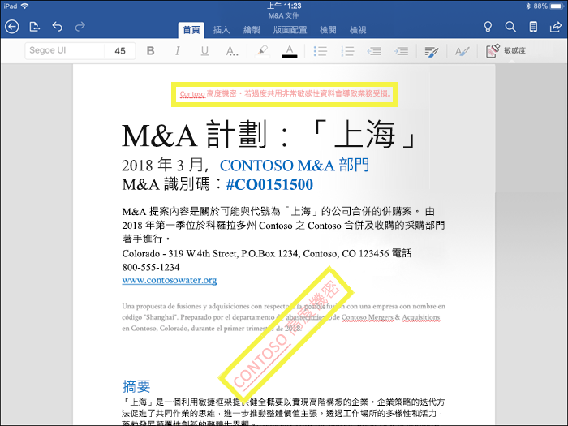
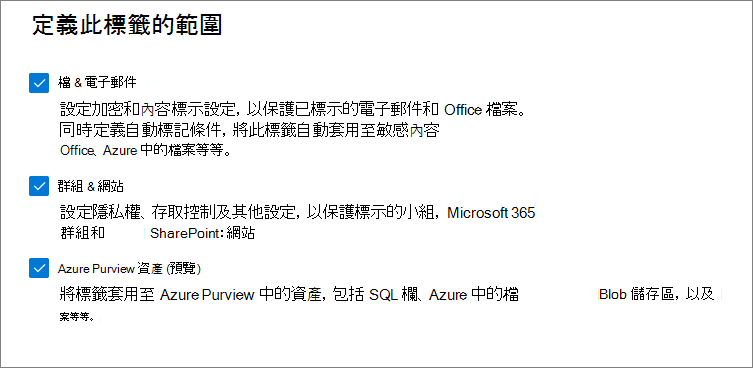
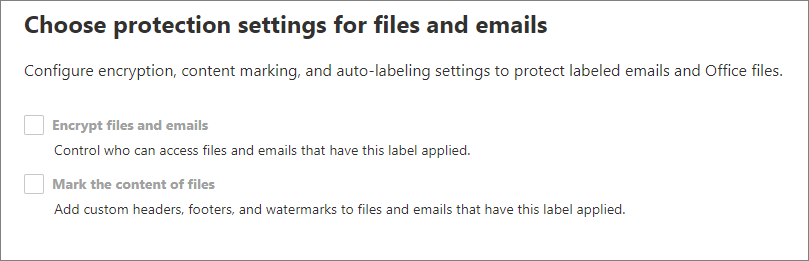
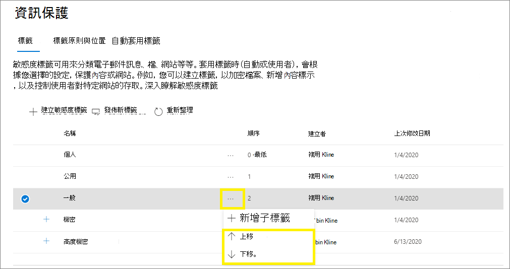
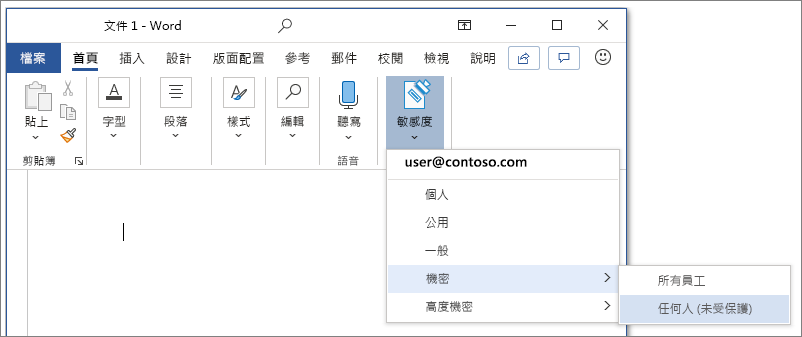
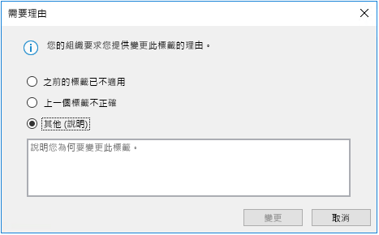
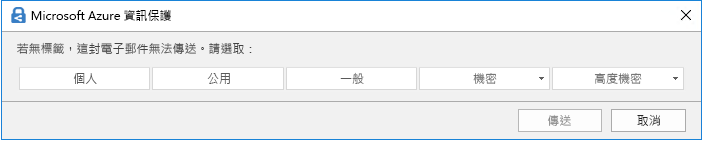
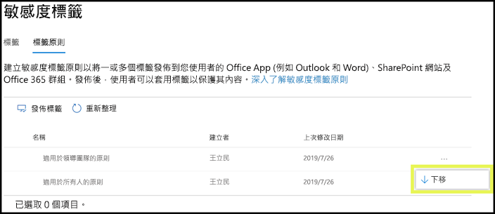

# 了解敏感度標籤Learn about sensitivity labels

>*[Microsoft 365 安全性與合規性的授權指引](https://aka.ms/ComplianceSD)。**[Microsoft 365 licensing guidance for security & compliance](https://aka.ms/ComplianceSD).*

> [!NOTE]
> 如果您要尋找在 Office 應用程式中看到的敏感度標籤相關資訊，請參閱[在 Office 中將敏感度標籤適用於您的檔案和電子郵件](https://support.microsoft.com/topic/apply-sensitivity-labels-to-your-files-and-email-in-office-2f96e7cd-d5a4-403b-8bd7-4cc636bae0f9)。If you're looking for information about sensitivity labels that you see in your Office apps, see [Apply sensitivity labels to your files and email in Office](https://support.microsoft.com/topic/apply-sensitivity-labels-to-your-files-and-email-in-office-2f96e7cd-d5a4-403b-8bd7-4cc636bae0f9).
>
> 此頁面上的資訊適用於可建立及設定這些標籤的 IT 系統管理員。The information on this page is for IT administrators who can create and configure those labels.

為了完成其工作，組織中的人員會與組織內外的其他人員共同合作。這表示內容不再會停留在防火牆後，它會漫遊在裝置、應用程式和服務的各處。而當內容漫遊時，您會希望以符合組織的商務及合規性原則的安全、受保護的方式漫遊。To get their work done, people in your organization collaborate with others both inside and outside the organization. This means that content no longer stays behind a firewall—it can roam everywhere, across devices, apps, and services. And when it roams, you want it to do so in a secure, protected way that meets your organization's business and compliance policies.

來自 Microsoft 資訊保護解決方案的敏感度標籤可讓您分類及保護組織的資料，同時確保使用者生產效率和共同作業能力不受影響。Sensitivity labels from the Microsoft Information Protection solution let you classify and protect your organization's data, while making sure that user productivity and their ability to collaborate isn't hindered.

顯示 Excel 中可用敏感度標籤的範例，從功能區上的 [首頁 **]** 索引標籤。Example showing available sensitivity labels in Excel, from the **Home** tab on the Ribbon. 在此範例中，已套用的標籤會顯示在狀態列上：In this example, the applied label displays on the status bar:

若要套用敏感度標籤，使用者必須使用 Microsoft 365 公司或學校帳戶登入。To apply sensitivity labels, users must be signed in with their Microsoft 365 work or school account.

> [!NOTE]
> 美國政府租使用者 (GCC 和 GCC-H) 剛開始支援敏感度標籤。Sensitivity labels are newly supported For US Government tenants (GCC and GCC-H). 如需詳細資訊，請參閱 Microsoft 365 Apps 企業版版本資訊， [版本2101：1 月 26 日](https://docs.microsoft.com/officeupdates/current-channel#version-2101-january-26)。For more information, see the release notes for Microsoft 365 Apps for enterprise, [Version 2101: January 26](https://docs.microsoft.com/officeupdates/current-channel#version-2101-january-26).
>
> 如需 Azure 資訊保護的整合式標記用戶端和掃描器，請參閱 [Azure 資訊保護優質政府服務描述](https://docs.microsoft.com/enterprise-mobility-security/solutions/ems-aip-premium-govt-service-description)。For the Azure Information Protection unified labeling client and scanner, see [Azure Information Protection Premium Government Service Description](https://docs.microsoft.com/enterprise-mobility-security/solutions/ems-aip-premium-govt-service-description).

您可以使用敏感度標籤來：You can use sensitivity labels to:
  
- **提供包含加密和內容標記的保護設定。****Provide protection settings that include encryption and content markings.** 例如，將「機密」標籤套用至文件或電子郵件，而該標籤會將內容加密並套用「機密」浮水印。For example, apply a "Confidential" label to a document or email, and that label encrypts the content and applies a "Confidential" watermark. 內容標記包括頁首、頁尾以及浮水印，而加密也可以限制授權人員可對內容採取的動作。Content markings include headers and footers as well as watermarks, and encryption can also restrict what actions authorized people can take on the content.

- **保護不同平台和裝置之間 Office 應用程式中的內容。****Protect content in Office apps across different platforms and devices.** Word、Excel、PowerPoint 和 Office 桌面應用程式和 Office 網頁版 Outlook 皆支援該功能。Supported by Word, Excel, PowerPoint, and Outlook on the Office desktop apps and Office on the web. 支援 Windows、macOS、iOS 和 Android。Supported on Windows, macOS, iOS, and Android.

- 使用 Microsoft Cloud App Security **保護第三方應用程式和服務中的內容**。**Protect content in third-party apps and services** by using Microsoft Cloud App Security. 使用 Cloud App Security，您可以偵測、分類、標記並保護協力廠商應用程式和服務中的內容，例如 SalesForce、Box 或 DropBox，即使協力廠商應用程式或服務無法讀取或支援敏感度標籤亦然。With Cloud App Security, you can detect, classify, label, and protect content in third-party apps and services, such as SalesForce, Box, or DropBox, even if the third-party app or service does not read or support sensitivity labels.

- **保護容器**，其中包括 Teams、Microsoft 365 群組和 SharePoint 網站。**Protect containers** that include Teams, Microsoft 365 Groups, and SharePoint sites. 例如，設定隱私權設定、外部使用者存取和外部共用，以及從未受管理的裝置存取。For example, set privacy settings, external user access and external sharing, and access from unmanaged devices.

- **將敏感度標籤延伸至 Power BI**：當您開啟此功能時，您可以套用和查看 Power BI 標籤，並在資料儲存在服務以外時加以保護。**Extend sensitivity labels to Power BI**: When you turn on this capability, you can apply and view labels in Power BI, and protect data when it's saved outside the service.

- **將敏感度標籤延伸至 Azure Purview 中的資產**：開啟目前處於預覽的此功能時，您可以將敏感度標籤套用至資產，例如 SQL 資料行、Azure Blob 儲存體中的檔案等等。**Extend sensitivity labels to assets in Azure Purview**: When you turn on this capability, currently in preview, you can apply your sensitivity labels to assets such as SQL columns, files in Azure Blob Storage, and more. 

- **將敏感度標籤延伸至第三方應用程式和服務。****Extend sensitivity labels to third-party apps and services.** 使用 Microsoft 資訊保護 SDK，第三方應用程式就可以讀取敏感度標籤以及套用保護設定。Using the Microsoft Information Protection SDK, third-party apps can read sensitivity labels and apply protection settings.

- **不使用任何保護設定而將內容分類。****Classify content without using any protection settings.** 您也可以直接指派標籤，以分類內容。You can also simply assign a label as a result of classifying the content. 這可讓使用者以視覺方式將分類對應到貴組織的標籤名稱，而且可以使用標籤來產生使用狀況報告，並查看您機密內容的活動資料。This provides users with a visual mapping of classification to your organization's label names, and can use the labels to generate usage reports and see activity data for your sensitive content. 根據這項資訊，您一律可以選擇稍後套用保護設定。Based on this information, you can always choose to apply protection settings later.

在上述情況下，Microsoft 365 中的敏感度標籤可協助您對正確的內容採取適當的動作。In all these cases, sensitivity labels in Microsoft 365 can help you take the right actions on the right content. 您可以運用敏感度標籤分類組織的資料，並根據該分類強制執行保護設定。With sensitivity labels, you can classify data across your organization, and enforce protection settings based on that classification.

如需有關這些和敏感度標籤支援之其他案例的詳細資訊，請參閱 [敏感度標籤的常見案例](get-started-with-sensitivity-labels.md#common-scenarios-for-sensitivity-labels)。For more information about these and other scenarios that are supported by sensitivity labels, see [Common scenarios for sensitivity labels](get-started-with-sensitivity-labels.md#common-scenarios-for-sensitivity-labels). 我們目前正在開發支援敏感度標籤的新功能，因此您可能會認為 [Microsoft 365 藍圖](https://aka.ms/MIPC/Roadmap) 參照資料非常有用。New features are being developed all the time that support sensitivity labels, so you might also find it useful to reference the [Microsoft 365 roadmap](https://aka.ms/MIPC/Roadmap).

## 敏感度標籤是什麼What a sensitivity label is

當您將敏感度標籤指派給內容時，它就像一個套用的戳記，並且是：When you assign a sensitivity label to content, it's like a stamp that's applied and is:

- **可自訂。****Customizable.** 針對貴組織和商務需求，您可以針對組織中的不同敏感度內容之層級建立類別。Specific to your organization and business needs, you can create categories for different levels of sensitive content in your organization. 例如，個人、公開、一般、機密和高度機密。For example, Personal, Public, General, Confidential, and Highly Confidential.

- **純文字。****Clear text.** 由於標籤會以純文字形式儲存在檔案和電子郵件的中繼資料中，因此第三方應用程式和服務可以讀取它，然後套用自己的保護動作 (如必要)。Because a label is stored in clear text in the metadata for files and emails, third-party apps and services can read it and then apply their own protective actions, if required.

- **持續性。****Persistent.** 由於標籤會儲存在檔案和電子郵件的中繼資料中，因此無論儲存位置或存放處為何，標籤都會與內容相伴儲存。Because the label is stored in metadata for files and emails, the label roams with the content, no matter where it's saved or stored. 唯一的標籤識別碼會成為套用並強制執行您設定之原則的基礎。The unique label identification becomes the basis for applying and enforcing the policies that you configure.

當使用者進行查看時，敏感度標籤會以標籤形式顯示在所使用的應用程式上，並可輕鬆整合至現有的工作流程。When viewed by users, a sensitivity label appears like a tag on apps that they use and can be easily integrated into their existing workflows.

支援敏感度標籤的每個項目都可以套用單一敏感度標籤。Each item that supports sensitivity labels can have a single sensitivity label applied to it. 文件和電子郵件可以同時套用敏感度標籤和[保留標籤](retention.md#retention-labels)。Documents and emails can have both a sensitivity label and a [retention label](retention.md#retention-labels) applied to them.

> [!div class="mx-imgBorder"]
> 

## 敏感度標籤的功能What sensitivity labels can do

將敏感度標籤套用至電子郵件或文件後，將會對內容強制執行為該標籤設定的保護設定。After a sensitivity label is applied to an email or document, any configured protection settings for that label are enforced on the content. 您可以設定敏感度標籤以：You can configure a sensitivity label to:

- **加密** 電子郵件和文件，以防止未經授權的人員存取此資料。**Encrypt** emails and documents to prevent unauthorized people from accessing this data. 您可以另行選擇哪些使用者或群組可以擁有權限來執行哪些動作，以及執行多久。You can additionally choose which users or group have permissions to perform which actions and for how long. 例如，您可以選擇允許貴組織中的所有使用者修改文件，而另一個組織中的特定群組只能瀏覽該文件。For example, you can choose to allow all users in your organization to modify a document while a specific group in another organization can only view it. 或者，可以讓使用者在套用標籤時，指派權限給內容，而不要使用系統管理員定義的權限。Alternatively, instead of administrator-defined permissions, you can allow your users to assign permissions to the content when they apply the label. 
    
    如需建立或編輯敏感度標籤時 **加密** 設定的詳細資訊，請參閱 [使用敏感度標籤中的加密來限制內容的存取](encryption-sensitivity-labels.md)。For more information about the **Encryption** settings when you create or edit a sensitivity label, see [Restrict access to content by using encryption in sensitivity labels](encryption-sensitivity-labels.md).

- 將浮水印、頁首或頁尾新增至已套用標籤的電子郵件或文件，以在使用 Office 應用程式時 **標記內容**。**Mark the content** when you use Office apps, by adding watermarks, headers, or footers to email or documents that have the label applied. 浮水印可以套用至文件 (而非電子郵件)。Watermarks can be applied to documents but not email. 頁首和浮水印範例：Example header and watermark:
    
    
    
    需要檢查何時套用內容標記？Need to check when content markings are applied? 請參閱 [Office 應用程式何時套用內容標記和加密](sensitivity-labels-office-apps.md#when-office-apps-apply-content-marking-and-encryption)。See [When Office apps apply content marking and encryption](sensitivity-labels-office-apps.md#when-office-apps-apply-content-marking-and-encryption).
    
    某些 (但並非全部) 應用程式會使用變數來支援動態標記。Some, but not all apps support dynamic markings by using variables. 例如，將標籤名稱或文件名稱插入頁首、頁尾或浮水印。For example, insert the label name or document name into the header, footer, or watermark. 如需詳細資訊，請參閱[使用變數動態標記](sensitivity-labels-office-apps.md#dynamic-markings-with-variables)。For more information, see [Dynamic markings with variables](sensitivity-labels-office-apps.md#dynamic-markings-with-variables).
    
    字串長度：浮水印限制為 255 個字元。String lengths: Watermarks are limited to 255 characters. 頁首和頁尾均受限於 1024 個字元，但 Excel 除外。Headers and footers are limited to 1024 characters, except in Excel. 對於頁首及頁尾，Excel 的總限制為 255 個字元，但此限制包含看不見的字元，例如格式代碼。Excel has a total limit of 255 characters for headers and footers but this limit includes characters that aren't visible, such as formatting codes. 如果達到該限制，您輸入的字串就不會顯示在 Excel 中。If that limit is reached, the string you enter is not displayed in Excel.

- 當您啟用功能，以 [在 Microsoft Teams、Microsoft 365 群組和 SharePoint 網站中使用敏感度標籤](sensitivity-labels-teams-groups-sites.md)時，**保護容器中的內容，例如網站和群組**。**Protect content in containers such as sites and groups** when you enable the capability to [use sensitivity labels with Microsoft Teams, Microsoft 365 groups, and SharePoint sites](sensitivity-labels-teams-groups-sites.md).
    
    您無法設定群組和網站的保護設定，除非您啟用此功能。You can't configure protection settings for groups and sites until you enable this capability. 此標籤設定並不會導致文件或電子郵件自動加標籤，相反的，標籤設定會透過控制可儲存內容所在容器的存取權，以保護內容。This label configuration doesn't result in documents or emails being automatically labeled but instead, the label settings protect content by controlling access to the container where content can be stored. 這些設定包括設定隱私權設定、外部使用者存取和外部共用，以及從未受管理的裝置存取。These settings include privacy settings, external user access and external sharing, and access from unmanaged devices.

- **在檔案和電子郵件中自動套用標籤，或建議標籤。****Apply the label automatically to files and emails, or recommend a label.** 選擇如何辨識您要標記的敏感資訊，這樣就可以自動套用標籤，或提示使用者套用您建議的標籤。Choose how to identify sensitive information that you want labeled, and the label can be applied automatically, or you can prompt users to apply the label that you recommend. 如果您建議使用某個標籤，提示會顯示您選擇的任何文字。If you recommend a label, the prompt displays whatever text you choose. 例如：For example:
    
    
    
    如需有關當您建立或編輯敏感度標籤時 **自動標籤檔案和電子郵件** 設定的詳細資訊，請參閱針對 Office 應用程式 [自動將敏感度標籤套用到內容](apply-sensitivity-label-automatically.md)，和 [自動標籤您在 Azure Purview 的資料](https://docs.microsoft.com/azure/purview/create-sensitivity-label)。For more information about the **Auto-labeling for files and emails** settings when you create or edit a sensitivity label, see [Apply a sensitivity label to content automatically](apply-sensitivity-label-automatically.md) for Office apps, and [Automatically label your data in Azure Purview](https://docs.microsoft.com/azure/purview/create-sensitivity-label).

### 標籤範圍Label scopes

建立敏感度標籤時，系統會要求您設定標籤的範圍，其可決定兩個項目：When you create a sensitivity label, you're asked to configure the label's scope which determines two things:
- 您可以針對該標籤設定的標籤設定Which label settings you can configure for that label
- 標籤將向使用者顯示的位置Where the label will be visible to users

此範圍設定可讓您有僅適用文件和電子郵件的敏感度標籤，而無法為容器選取。This scope configuration lets you have sensitivity labels that are just for documents and emails and can't be selected for containers. 同樣地，僅適用容器的敏感度標籤，亦無法為文件和電子郵件選取。And similarly, sensitivity labels that are just for containers and can't be selected for documents and emails. 新增且目前處於預覽的功能，您也可以選取 Azure Purview 資產的範圍：New, and currently in preview, you can also select the scope for Azure Purview assets:

預設會一律選取 [檔案和電子郵件 **]** 範圍。By default, the **Files & emails** scope is always selected. 其他範圍則是在為您的租用戶啟用功能時預設選取：The other scopes are selected by default when the features are enabled for your tenant:

- **群組和網站**：[為容器啟用敏感度標籤以及同步處理標籤](sensitivity-labels-teams-groups-sites.md#how-to-enable-sensitivity-labels-for-containers-and-synchronize-labels)**Groups & sites**: [Enable sensitivity labels for containers and synchronize labels](sensitivity-labels-teams-groups-sites.md#how-to-enable-sensitivity-labels-for-containers-and-synchronize-labels)

- **Azure Purview 資產 (預覽)**：[在 Azure Purview 中自動為您的內容加上標籤](https://go.microsoft.com/fwlink/?linkid=2148989)**Azure Purview assets (preview)**: [Automatically label your content in Azure Purview](https://go.microsoft.com/fwlink/?linkid=2148989)

如果您變更預設值，使得並未選取所有範圍，則會看到您未選取範圍之組態設定的第一頁，但您無法進行設定。If you change the defaults so not all scopes are selected, you see the first page of the configuration settings for scopes you haven't selected, but you can't configure the settings. 例如，如果未選取檔案和電子郵件的範圍，您就無法在下一頁選取選項：For example, if the scope for files and emails is not selected, you can't select the options on the next page:

針對有無法使用選項的這些頁面，請選取 [下一步 **]** 以繼續。For these pages that have unavailable options, select **Next** to continue. 或者，選取 [上一步 **]** 來變更標籤的範圍。Or, select **Back** to change the label's scope.

### 標籤優先順序 (順序很重要)Label priority (order matters)

在您的系統管理中心中建立敏感度標籤時，它們會顯示在 [標籤] 頁面的 [敏感度] 索引標籤上的清單中。When you create your sensitivity labels in your admin center, they appear in a list on the **Sensitivity** tab on the **Labels** page. 在此清單中，標籤的順序很重要，因為它反映的是其優先順序。In this list, the order of the labels is important because it reflects their priority. 您想要讓最具限制性的敏感度標籤，例如 [高度機密性]，顯示在清單的最 **底端**，以及最不具限制性的敏感度標籤，例如公用，顯示在最 **上方**。You want your most restrictive sensitivity label, such as Highly Confidential, to appear at the **bottom** of the list, and your least restrictive sensitivity label, such as Public, to appear at the **top**.

您只能將一個敏感度標籤套用至一個項目，例如文件、電子郵件或容器。You can apply just one sensitivity label to an item such as a document, email, or container. 如果您設定一個選項，要求使用者提供將標籤變更為較低分類的理由，則此清單的順序會識別分類下限。If you set an option that requires your users to provide a justification for changing a label to a lower classification, the order of this list identifies the lower classifications. 不過，此選項不適用子標籤。However, this option does not apply to sublabels.

不過，子標籤的排序會搭配[自動標記](apply-sensitivity-label-automatically.md)使用。The ordering of sublabels is used with [automatic labeling](apply-sensitivity-label-automatically.md), though. 將標籤設定為自動套用或建議時，可能對多個標籤造成相符項目。When you configure labels to be applied automatically or as a recommendation, multiple matches can result for more than one label. 若要判斷要套用或建議的標籤，會使用標籤順序：選取最後一個敏感度標籤，然後在適用時使用最後一個子標籤。To determine the label to apply or recommend, the label ordering is used: The last sensitive label is selected, and then if applicable, the last sublabel.

### 子標籤 (分組標籤)Sublabels (grouping labels)

您可以使用子標籤將一或多個標籤分組在 Office 應用程式中的使用者可看到的上層標籤之下。With sublabels, you can group one or more labels below a parent label that a user sees in an Office app. 例如，在 [機密文件] 下，您的組織可能會使用不同的標籤來標示該分類的特定類型。For example, under Confidential, your organization might use several different labels for specific types of that classification. 在此範例中，上層標籤 [機密文件] 只是沒有任何保護設定的文字標籤，且因為它有子標籤，所以無法套用至內容。In this example, the parent label Confidential is simply a text label with no protection settings, and because it has sublabels, it can't be applied to content. 相反地，使用者必須選擇 [機密文件] 來查看子標籤，然後再選擇要套用到內容的子標籤。Instead, users must choose Confidential to view the sublabels, and then they can choose a sublabel to apply to content.

子標籤是以邏輯群組方式向使用者呈現標籤的一個簡單方式。Sublabels are simply a way to present labels to users in logical groups. 子標籤不繼承其上層標籤的任何設定。Sublabels don't inherit any settings from their parent label. 當您發佈使用者的子標籤時，該使用者就可以將該子標籤套用到內容，但不能只套用上層標籤。When you publish a sublabel for a user, that user can then apply that sublabel to content but can't apply just the parent label.

請勿將上層籤選為預設標籤，或將上層標籤設定為自動套用 (或建議使用)。Don't choose a parent label as the default label, or configure a parent label to be automatically applied (or recommended). 如果這麼做，系統就不會將上層標籤套用至內容。If you do, the parent label won't be applied to content.

子標籤如何對使用者顯示的範例：Example of how sublabels display for users:

### 編輯或刪除敏感度標籤Editing or deleting a sensitivity label

如果您從系統管理中心刪除敏感度標籤，此標籤並未從內容中自動移除，且所有保護設定都會繼續在套用該標籤的內容上強制執行。If you delete a sensitivity label from your admin center, the label is not automatically removed from content, and any protection settings continue to be enforced on content that had that label applied.

如果您編輯敏感度標籤，則當初套用至內容的標籤版本會在內容上強制執行。If you edit a sensitivity label, the version of the label that was applied to content is what's enforced on that content.

## 標籤原則的功能What label policies can do

建立敏感度標籤之後，您必須發佈這些標籤，才能讓其可供組織中的人員和服務使用。After you create your sensitivity labels, you need to publish them, to make them available to people and services in your organization. 然後可以將敏感度標籤套用至 Office 文件和電子郵件，以及支援敏感度標籤的其他項目。The sensitivity labels can then be applied to Office documents and emails, and other items that support sensitivity labels. 

與會發佈到所有 Exchange 信箱之類位置的保留標籤不同，敏感度標籤會對使用者或群組發佈。Unlike retention labels, which are published to locations such as all Exchange mailboxes, sensitivity labels are published to users or groups. 支援敏感度標籤的應用程式之後可以將這些標籤，以已套用的標籤或可套用的標籤形式向這些使用者和群組顯示。Apps that support sensitivity labels can then display them to those users and groups as applied labels, or as labels that they can apply.

當您設定標籤原則時，您可以：When you configure a label policy, you can:

- **選擇可看見標籤的使用者和群組。****Choose which users and groups see the labels.** 可以在 Azure AD 中將標籤發佈到任何特定的使用者或啟用電子郵件功能的安全性群組、通訊群組或 Microsoft 365 群組 (可以有 [動態成員資格](https://docs.microsoft.com/azure/active-directory/users-groups-roles/groups-create-rule))。Labels can be published to any specific user or email-enabled security group, distribution group, or Microsoft 365 group (which can have [dynamic membership](https://docs.microsoft.com/azure/active-directory/users-groups-roles/groups-create-rule)) in Azure AD.

- **套用預設標籤** 至由標籤原則中包含的所有使用者和群組所建立的新文件和電子郵件，以及將相同或不同的預設標籤套用至容器 (如果您 [已為 Microsoft Teams、Microsoft 365 群組和 SharePoint 網站啟用敏感度標籤](sensitivity-labels-teams-groups-sites.md))。**Apply a default label** to all new documents and emails created by the users and groups included in the label policy, and the same or different default label to containers (if you've [enabled sensitivity labels for Microsoft Teams, Microsoft 365 groups, and SharePoint sites](sensitivity-labels-teams-groups-sites.md)). 如果使用者的文件或電子郵件不是正確的標籤，使用者可以隨時變更預設標籤。Users can always change the default label if it's not the right label for their document or email. 
    
    請考慮使用預設標籤來設定您想套用到所有內容中的基本保護設定等級。Consider using a default label to set a base level of protection settings that you want applied to all your content. 不過，若沒有使用者訓練和其他控制項，這項設定也可能導致不正確的標記。However, without user training and other controls, this setting can also result in inaccurate labeling. 選取將套用加密作為對文件之預設標籤的標籤並不是個好主意。It's usually not a good idea to select a label that applies encryption as a default label to documents. 例如，許多組織需要將文件傳送與共用給外部使用者，而這些使用者可能沒有支援加密的應用程式，或可能不會使用可授權的帳戶。For example, many organizations need to send and share documents with external users who might not have apps that support the encryption or they might not use an account that can be authorized. 如需此案例的詳細資訊，請參閱 [與外部使用者共用加密檔](sensitivity-labels-office-apps.md#sharing-encrypted-documents-with-external-users)。For more information about this scenario, see [Sharing encrypted documents with external users](sensitivity-labels-office-apps.md#sharing-encrypted-documents-with-external-users).

- **需要變更標籤的理由。****Require a justification for changing a label.** 如果使用者嘗試移除標籤，或以較低順序編號的標籤取代其，您可以要求使用者提供理由來執行此動作。If a user tries to remove a label or replace it with a label that has a lower-order number, you can require the user provides a justification to perform this action. 例如，使用者開啟標示為 [機密] (順序編號 3) 的文件，並將該標籤取代為 [公開] (順序編號 1)。For example, a user opens a document labeled Confidential (order number 3) and replaces that label with one named Public (order number 1). 系統管理員可以閱讀 [活動瀏覽器](data-classification-activity-explorer.md) 中的理由及標籤變更。Administrators can read the justification reason along with the label change in [activity explorer](data-classification-activity-explorer.md).

    

- **要求使用者套用標籤**，一個選項用於電子郵件和文件，另一個用於容器。**Require users to apply a label** with one option for email and documents, and another for containers. 這些選項也稱為強制標籤，可確保使用者必須先套用標籤才能儲存文件和傳送電子郵件以及建立新群組或網站。Also known as mandatory labeling, these options ensure a label must be applied before users can save documents and send emails, and create new groups or sites.
    
    若為文件和電子郵件，使用者可手動指派標籤、根據您設定的條件而自動指派，或依預設指派 (如上所述的預設標籤選項)。For documents and emails, a label can be assigned manually by the user, automatically as a result of a condition that you configure, or be assigned by default (the default label option previously described). 當使用者需要指派標籤時，Outlook 中顯示的提示範例：An example prompt shown in Outlook when a user is required to assign a label:

    
    
    > [!NOTE]
    > 並非所有應用程式或所有平台都提供文件及電子郵件適用的強制標籤。Mandatory labeling for documents and emails isn't available for all apps or all platforms. 如需詳細資訊，請參閱[要求使用者在電子郵件和文件中套用標籤](sensitivity-labels-office-apps.md#require-users-to-apply-a-label-to-their-email-and-documents) (部分機器翻譯)。For more information, see [Require users to apply a label to their email and documents](sensitivity-labels-office-apps.md#require-users-to-apply-a-label-to-their-email-and-documents).
    
    若為容器，您必須在建立群組或網站時指派標籤。For containers, a label must be assigned at the time the group or site is created.
    
    請考慮使用此選項來協助增加您的標記涵蓋範圍。Consider using this option to help increase your labeling coverage. 不過，若沒有使用者訓練，這些設定可能導致不正確的標記。However, without user training, these settings can result in inaccurate labeling. 此外，除非您也設定對應的預設標籤，否則強制標籤的常見提示可能會讓使用者感到無益。In addition, unless you also set a corresponding default label, mandatory labeling can frustrate your users with the frequent prompts.

- **提供自訂說明頁面的說明連結。****Provide help link to a custom help page.** 如果使用者不確定敏感度標籤代表的意義或使用方式，您可以提供顯示在 Office 應用程式中 **[敏感度標籤]** 功能表底部的 [深入了解] URL：If your users aren't sure what your sensitivity labels mean or how they should be used, you can provide a Learn More URL that appears at the bottom of the **Sensitivity label** menu in the Office apps:

    ![功能區中 [敏感度] 按鈕上的「深入了解」連結](../media/Sensitivity-label-learn-more.png)

建立可將新敏感度標籤指派給使用者和群組的標籤原則之後，使用者會開始在他們的 Office 應用程式中看到這些標籤。After you create a label policy that assigns new sensitivity labels to users and groups, users start to see those labels in their Office apps. 最多可獲得 24 小時的時間，在您的整個組織中複製最新的變更。Allow up to 24 hours for the latest changes to replicate throughout your organization.

您可以建立並發佈的敏感度標籤數量沒有任何限制，但有一個例外：如果標籤套用加密，則您可建立的標籤數上限為 500。There is no limit to the number of sensitivity labels that you can create and publish, with one exception: If the label applies encryption, there is a maximum of 500 labels that you can create. 不過，為了降低系統管理負擔並為使用者減少複雜度，最佳做法是試著保持最少的標籤數量。However, as a best practice to lower admin overheads and reduce complexity for your users, try to keep the number of labels to a minimum. 實際情況的部署已證明，當使用者擁有五個以上的主要標籤，或每個主要標籤有超過五個子標籤時，效果會明顯地降低。Real-world deployments have proved effectiveness to be noticeably reduced when users have more than five main labels or more than five sublabels per main label.

### 標籤原則優先順序 (順序很重要)Label policy priority (order matters)

您會在敏感度標籤原則中發佈敏感度標籤，以將其提供給使用者使用，而標籤會顯示在 [標籤原則] 頁面上 [敏感度原則] 索引標籤的清單中。You make your sensitivity labels available to users by publishing them in a sensitivity label policy that appears in a list on the **Sensitivity policies** tab on the **Label policies** page. 正如同敏感度標籤 (請參閱[標籤原則優先順序 (順序很重要)](#label-priority-order-matters))，敏感度標籤原則的順序非常重要，因為順序反映的是優先順序。Just like sensitivity labels (see [Label priority (order matters)](#label-priority-order-matters)), the order of the sensitivity label policies is important because it reflects their priority. 優先順序最低的標籤原則會顯示在 **上方**，而優先順序最高的標籤原則會顯示在 **下方**。The label policy with lowest priority is shown at the **top**, and the label policy with the highest priority is shown at the **bottom**.

標籤原則包含：A label policy consists of:

- 一組標籤。A set of labels.
- 將獲指派具有標籤之原則的使用者和群組。The users and groups that will be assigned the policy with labels.
- 該範圍的原則和原則設定的範圍 (例如檔案和電子郵件的預設標籤)。The scope of the policy and policy settings for that scope (such as default label for files and emails).

您可以將使用者包含在多個標籤原則中，該使用者即會看到來自這些原則的所有敏感度標籤。You can include a user in multiple label policies, and the user will see all the sensitivity labels from those policies. 不過，使用者只會取得來自具有最高優先順序標籤原則的原則設定。However, a user gets the policy settings from only the label policy with the highest priority.

如果您沒有看到使用者或群組應有的標籤或標籤原則設定，請檢查敏感度標籤原則的順序。If you're not seeing the label or label policy setting that you expect for a user or group, check the order of the sensitivity label policies. 若要重新排序標籤原則，請選取 [敏感度標籤原則] > 選擇右側的省略符號 > **[下移]** 或 **[上移]**。To reorder the label policies, select a sensitivity label policy > choose the ellipsis on the right > **Move down** or **Move up**.

如果您除了使用敏感度標籤，還使用了保留標籤，請務必記住優先順序對於敏感度標籤原則，但對於[保留標籤原則](retention.md#the-principles-of-retention-or-what-takes-precedence)則否。If you use retention labels in addition to sensitivity labels, it's important to remember that priority matters for sensitivity label policies, but not for [retention labels](retention.md#the-principles-of-retention-or-what-takes-precedence).

## 敏感度標籤和 Azure 資訊保護Sensitivity labels and Azure Information Protection

如果您已使用 Azure 資訊保護部署標籤，請在開始使用敏感度標籤之前，先使用下列各節中的指引。If you have deployed labels with Azure Information Protection, use the following sections for guidance before you start to use sensitivity labels.

### Azure 資訊保護標籤Azure Information Protection labels

> [!NOTE]
> Azure 入口網站中 Azure 資訊保護標籤的標籤管理功能即將在 **2021 年 3 月 31 日** 淘汰。Label management for Azure Information Protection labels in the Azure portal is being deprecated **March 31, 2021**. 請透過官方的[淘汰聲明](https://techcommunity.microsoft.com/t5/azure-information-protection/announcing-timelines-for-sunsetting-label-management-in-the/ba-p/1226179)深入了解。Learn more from the official [deprecation notice](https://techcommunity.microsoft.com/t5/azure-information-protection/announcing-timelines-for-sunsetting-label-management-in-the/ba-p/1226179).

如果您因為您的租用戶尚不在[整合標籤平台](https://docs.microsoft.com/azure/information-protection/faqs#how-can-i-determine-if-my-tenant-is-on-the-unified-labeling-platform)中而使用 Azure 資訊保護標籤，建議您在您啟用整合標籤前，避免建立敏感度標籤。If you are using Azure Information Protection labels because your tenant isn't yet on the [unified labeling platform](https://docs.microsoft.com/azure/information-protection/faqs#how-can-i-determine-if-my-tenant-is-on-the-unified-labeling-platform), we recommend that you avoid creating sensitivity labels until you activate unified labeling. 在此情況下，您在 Azure 入口網站中看到的標籤是 Azure 資訊保護標籤，而不是敏感度標籤。In this scenario, the labels you see in the Azure portal are Azure Information Protection labels rather than sensitivity labels. 這些標籤可由 Windows 電腦上的 Azure 資訊保護用戶端 (傳統) 使用，但不能由執行 macOS、iOS 或 Android 的裝置使用。These labels can be used by the Azure Information Protection client (classic) on Windows computers, but can't be used by devices running macOS, iOS, or Android. 若要解決此問題，請[將這些標籤遷移](/azure/information-protection/configure-policy-migrate-labels)至敏感度標籤。To resolve this, [migrate these labels](/azure/information-protection/configure-policy-migrate-labels) to sensitivity labels. 

這兩組標籤所套用的中繼資料彼此相容，因此您不須在完成移轉時，重新標記文件和電子郵件。The metadata applied by both sets of labels are compatible, so you don't need to relabel documents and emails when the migration is complete.

### Azure 資訊保護用戶端Azure Information Protection clients

當您在 Windows 電腦上的 Microsoft 365 Apps 企業版應用程式中使用敏感度標籤時，您可以選擇使用 Azure 資訊保護用戶端，或使用 Office 內建的標記功能。When you use sensitivity labels in Microsoft 365 Apps for enterprise apps on Windows computers, you have a choice of using an Azure Information Protection client, or use labeling that's built into Office.

根據預設，安裝 Azure 資訊保護用戶端時，這些應用程式中的內建標記功能會關閉。By default, built-in labeling is turned off in these apps when the Azure Information Protection client is installed. 如需詳細資訊，包括如何變更此預設行為，請參閱 [Office 內建標籤用戶端和 Azure 資訊保護用戶端](sensitivity-labels-office-apps.md#office-built-in-labeling-client-and-the-azure-information-protection-client)。For more information, including how to change this default behavior, see [Office built-in labeling client and the Azure Information Protection client](sensitivity-labels-office-apps.md#office-built-in-labeling-client-and-the-azure-information-protection-client).

即使是在 Office 應用程式中使用內建標籤時，也可以為下列項目使用 Azure 資訊保護的整合標籤用戶端，搭配敏感度標籤：Even when you use built-in labeling in Office apps, you can also use the Azure Information Protection unified labeling client with sensitivity labels for the following:

- 掃描器，以探索儲存在內部部署的敏感性資訊，然後選擇性為該內容加上標籤A scanner to discover sensitive information that's stored on-premises, and then optionally, label that content

- 檔案總管中的右鍵選項，讓使用者對所有檔案類型套用標籤Right-click options in File Explorer for users to apply labels to all file types

- 檢視器，以顯示文字、影像或 PDF 文件的加密檔案A viewer to display encrypted files for text, images, or PDF documents

- PowerShell 模組，以探索內部部署檔案中的敏感性資訊，並對這些檔案套用或移除標籤和加密。A PowerShell module to discover sensitive information in files on premises, and apply or remove labels and encryption from these files.

如果您是 Azure 資訊保護的新使用者，或您是剛轉移標籤的現有 Azure 資訊保護客戶，請參閱來自 Azure 資訊保護文件的[選擇要用於 Windows 電腦的標籤用戶端](https://docs.microsoft.com/azure/information-protection/rms-client/use-client#choose-your-windows-labeling-solution)。If you are new to Azure Information Protection, or if you are an existing Azure Information Protection customer who has recently migrated your labels, see [Choose your Windows labeling solution](https://docs.microsoft.com/azure/information-protection/rms-client/use-client#choose-your-windows-labeling-solution) from the Azure Information Protection documentation.

## 敏感性標籤和 Microsoft Cloud App SecuritySensitivity labels and Microsoft Cloud App Security

您可以使用 Cloud App Security (CAS) 來探索、分類、加標籤，以及保護內容的第三方服務和應用程式 (例如 SalesForce、Box 或 Dropbox) 中的內容。By using Cloud App Security (CAS), you can discover, classify, label, and protect content in third-party services and apps, such as SalesForce, Box, or Dropbox. 

Cloud App Security 適用於 Azure 資訊保護標籤和敏感度標籤：Cloud App Security works with both Azure Information Protection labels and sensitivity labels:

- 如果標籤系統管理中心已將一或多個敏感度標籤[發佈](create-sensitivity-labels.md#publish-sensitivity-labels-by-creating-a-label-policy)給至少一個使用者：使用敏感度標籤。If the labeling admin centers have one or more sensitivity labels [published](create-sensitivity-labels.md#publish-sensitivity-labels-by-creating-a-label-policy) to at least one user: Sensitivity labels are used.

- 如果標籤系統管理中心未發佈敏感度標籤：使用 Azure 資訊保護標籤。If the labeling admin centers don't have sensitivity labels published: Azure Information Protection labels are used.

如需有關使用 Cloud App Security 搭配這些標籤的指示，請參閱 [Azure 資訊保護整合](https://docs.microsoft.com/cloud-app-security/azip-integration)。For instructions to use Cloud App Security with these labels, see [Azure Information Protection integration](https://docs.microsoft.com/cloud-app-security/azip-integration).

## 敏感度標籤和 Microsoft 資訊保護 SDKSensitivity labels and the Microsoft Information Protection SDK

由於敏感度標籤是以純文字儲存在文件的中繼資料中，因此協力廠商的應用程式和服務都可讀取和寫入此標籤中繼資料，以補充您的標籤部署。Because a sensitivity label is stored as clear text in the metadata of a document, third-party apps and services can read from and write to this labeling metadata to supplement your labeling deployment. 此外，軟體開發人員可以使用 [Microsoft 資訊保護 SDK](https://docs.microsoft.com/information-protection/develop/overview#microsoft-information-protection-sdk)，完全支援跨多個平臺的標籤和加密功能。Additionally, software developers can use the [Microsoft Information Protection SDK](https://docs.microsoft.com/information-protection/develop/overview#microsoft-information-protection-sdk) to fully support labeling and encryption capabilities across multiple platforms. 若要深入了解，請參閱[技術社群部落格上的正式版本公告](https://techcommunity.microsoft.com/t5/Microsoft-Information-Protection/Microsoft-Information-Protection-SDK-Now-Generally-Available/ba-p/263144)。To learn more, see the [General Availability announcement on the Tech Community blog](https://techcommunity.microsoft.com/t5/Microsoft-Information-Protection/Microsoft-Information-Protection-SDK-Now-Generally-Available/ba-p/263144). 

您也可以了解[與 Microsoft 資訊保護整合的合作夥伴解決方案](https://techcommunity.microsoft.com/t5/Azure-Information-Protection/Microsoft-Information-Protection-showcases-integrated-partner/ba-p/262657)。You can also learn about [partner solutions that are integrated with Microsoft Information Protection](https://techcommunity.microsoft.com/t5/Azure-Information-Protection/Microsoft-Information-Protection-showcases-integrated-partner/ba-p/262657).

## 部署指導方針Deployment guidance

如需部署規劃和指導方針，其中包含授權資訊、權限、部署策略，以及支援的案例和使用者文件的清單，請參閱[開始使用敏感度標籤](get-started-with-sensitivity-labels.md)。For deployment planning and guidance that includes licensing information, permissions, deployment strategy, a list of supported scenarios, and end-user documentation, see [Get started with sensitivity labels](get-started-with-sensitivity-labels.md).
