# 敏感度標籤概觀Overview of sensitivity labels

為了完成其工作，組織中的人員會與組織內外的其他人員共同合作。這表示內容不總是在防火牆後，它會漫遊在裝置、應用程式和服務的各處。而您希望內容以符合組織的商務及合規性原則的安全、受保護的方式漫遊。To get their work done, people in your organization collaborate with others both inside and outside the organization. This means that content no longer stays behind a firewall — it can roam everywhere, across devices, apps, and services. And when it roams, you want it to do so in a secure, protected way that meets your organization’s business and compliance policies.

使用敏感度標籤，您可以分類並協助保護敏感性內容，不會阻礙人員的生產力與共同作業能力。With sensitivity labels, you can classify and help protect your sensitive content, without hindering your people’s productivity and ability to collaborate.

顯示敏感度標籤的範例：Example showing sensitivity labels:

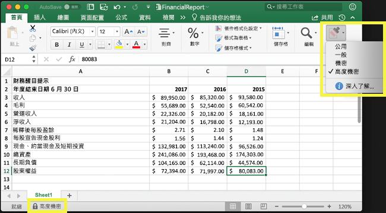

只有全域 (公開) 雲端的租用戶才支援敏感度標籤。Sensitivity labels are supported for tenants in the global (public) cloud only. 目前，其他雲端 (例如[國家/地區雲端](https://docs.microsoft.com/azure/active-directory/develop/authentication-national-cloud)) 中的租用戶不支援敏感度標籤。Currently, sensitivity labels aren't supported for tenants in other clouds such as [national clouds](https://docs.microsoft.com/azure/active-directory/develop/authentication-national-cloud).

若要套用敏感度標籤，使用者必須使用公司或學校帳戶登入 Office。To apply sensitivity labels, users must be signed in to Office with their work or school account.

您可以使用敏感度標籤來：You can use sensitivity labels to:
  
- **在標記的內容上強制執行保護設定，例如加密或浮水印。** 例如，使用者可以將「機密」標籤套用至文件或電子郵件，該標籤即可加密內容，並套用「機密」浮水印。**Enforce protection settings such as encryption or watermarks on labeled content.** For example, your users can apply a Confidential label to a document or email, and that label can encrypt the content and apply a Confidential watermark.

- **保護不同平台和裝置之間 Office 應用程式中的內容。****Protect content in Office apps across different platforms and devices.** 如需受支援應用程式的清單，請參閱 [Office App 中的敏感度標籤](sensitivity-labels-office-apps.md)。For a list of supported apps, see [Sensitivity labels in Office apps](sensitivity-labels-office-apps.md).

- **防止敏感內容離開組織執行 Windows 的裝置**，方式是使用 Microsoft Intune 的端點保護。敏感度標籤套用至位於 Windows 裝置上的內容後，端點保護可以防止該內容複製到協力廠商應用程式，例如 Twitter 或 Gmail，或複製到卸除式儲存空間，如 USB 磁碟機。**Prevent sensitive content from leaving your organization on devices running Windows**, by using endpoint protection in Microsoft Intune. After a sensitivity label has been applied to content that resides on a Windows device, endpoint protection can prevent that content from being copied to a third-party app, such as Twitter or Gmail, or being copied to removable storage, such as a USB drive.

- **使用 Microsoft Cloud App Security 保護協力廠商應用程式和服務中的內容。****Protect content in third-party apps and services**, by using Microsoft Cloud App Security. 使用 Cloud App Security，您可以偵測、分類、標記並保護協力廠商應用程式和服務中的內容，例如 SalesForce、Box 或 DropBox，即使協力廠商應用程式或服務無法讀取或支援敏感度標籤亦然。With Cloud App Security, you can detect, classify, label, and protect content in third-party apps and services, such as SalesForce, Box, or DropBox, even if the third-party app or service does not read or support sensitivity labels.

- **將敏感度標籤擴充至協力廠商應用程式和服務。** 使用 Microsoft 資訊保護 SDK，[這些平台](https://docs.microsoft.com/information-protection/develop/overview#microsoft-information-protection-sdk)上的協力廠商應用程式就可以讀取敏感度標籤，並且套用保護設定。**Extend sensitivity labels to third-party apps and services.** With the Microsoft Information Protection SDK, third-party apps on [these platforms](https://docs.microsoft.com/information-protection/develop/overview#microsoft-information-protection-sdk) can read sensitivity labels and apply protection settings.

- **不使用任何保護設定而將內容分類。****Classify content without using any protection settings.** 您也可以直接將分類指派給內容 (例如貼圖)，該分類會在使用和共用時隨著內容保存和漫遊。You can also simply assign a classification to content (like a sticker) that persists and roams with the content as it's used and shared. 您可以使用這個分類來產生使用情況報告，並且查看敏感性內容的活動資料。You can use this classification to generate usage reports and see activity data for your sensitive content. 根據這項資訊，您一律可以選擇稍後套用保護設定。Based on this information, you can always choose to apply protection settings later.

在上述情況下，Office 365 中的敏感度標籤可協助您對正確的內容採取適當的動作。In all these cases, sensitivity labels in Office 365 can help you take the right actions on the right content. 您可以運用敏感度標籤分類組織的資料，並根據該分類強制執行保護設定。With sensitivity labels, you can classify data across your organization and enforce protection settings based on that classification.
  
當您在 Microsoft 365 合規性中心、Microsoft 365 安全性中心或是 Office 365 安全性與合規性中心底下的 [分類]\*\*\*\* >  [敏感度標籤]\*\*\*\* 建立敏感度標籤時，可以使用自動標籤設定。You create sensitivity labels in the Microsoft 365 compliance center, Microsoft 365 security center, or Office 365 Security & Compliance Center under **Classification** > **Sensitivity labels**. 這些敏感度標籤可供 Azure 資訊保護、Office 應用程式和 Office 365 服務使用。These sensitivity labels can be used by Azure Information Protection, Office apps, and Office 365 services.

針對 Azure 資訊保護客戶，您可以使用其他系統管理中心的 Azure 資訊保護標籤，而如果您選擇執行額外或進階組態，標籤就會與 Azure 入口網站同步處理。For Azure Information Protection customers, you can use your Azure Information Protection labels in the other admin centers, and your labels will be synced with the Azure portal in case you choose to perform additional or advanced configuration. Azure 資訊保護標籤和 Office 365 敏感度標籤彼此相容，這表示，如果您的內容具有 Azure 資訊保護標籤，則不需要重新分類或重新標籤您的內容。For Azure Information Protection customers, you can use your Azure Information Protection labels in the Security & Compliance center, and your labels will be synced with the Azure portal in case you choose to perform additional or advanced configuration. Azure Information Protection labels and Office 365 sensitivity labels are fully compatible with each other. This means, for example, if you have content labeled by Azure Information Protection, you won’t need to reclassify or relabel your content.

## 敏感度標籤是什麼What a sensitivity label is

當您將敏感度標籤指派給文件或電子郵件，它就像一個戳記套用在內容上，並且是：When you assign a sensitivity label to a document or email, it’s simply like a tag that is:

- **可自訂。** 您可以為組織中不同等級的敏感內容建立類別，例如個人、公用、一般、機密、高度機密。**Customizable.** You can create categories for different levels of sensitive content in your organization, such as Personal, Public, General, Confidential, and Highly Confidential.

- **純文字。****Clear text.** 由於標籤會以純文字形式儲存在內容的中繼資料中，因此第三方應用程式和服務可以讀取它，然後套用自己的保護動作 (如必要)。Because the label is stored in clear text in the content's metadata, third-party apps and services can read it and then apply their own protective actions, if required.

- **持續性。****Persistent.** 將敏感度標籤套用至內容後，該標籤就會保存在該電子郵件或文件的中繼資料中。After you apply a sensitivity label to content, the label persists in the metadata of that email or document. 這表示標籤會隨著內容 (包括保護設定) 漫遊，而此資料就變成套用和強制執行原則的基礎。This means the label roams with the content, including the protection settings, and this data becomes the basis for applying and enforcing policies.

在 Office 應用程式中，敏感度標籤就像是在電子郵件或文件上讓使用者看的標記。In Office apps, a sensitivity label simply appears as a tag on an email or document.

內容中的每個項目皆可套用單一敏感度標籤。項目可以同時套用單一敏感度標籤和單一[保留標籤](labels.md)。Each item of content can have a single sensitivity label applied to it. An item can have both a single sensitivity label and a single [retention label](labels.md) applied to it.

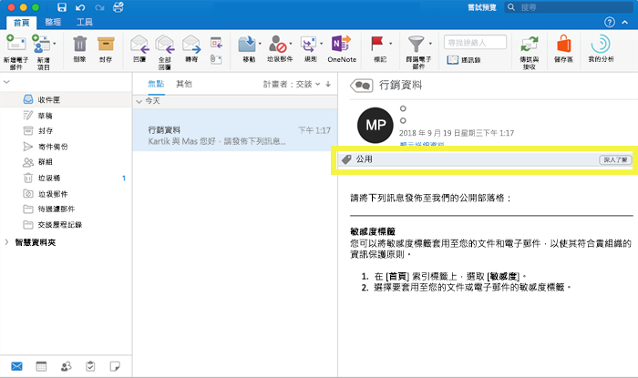

## 敏感度標籤的功能What sensitivity labels can do

除了電子郵件和文件之外，在多個公開預覽版中也提供敏感度標籤。In addition to email and documents, sensitivity labels are available in multiple public preview releases. 如需如何可將敏感度標籤搭配檔案、團隊、群組及網站使用的詳細資訊，請參閱下列文章：For more information about how sensitivity labels can be used for files, teams, groups, and sites, see these articles:

- [對 SharePoint 和 OneDrive 中的 Office 檔案啟用敏感度標籤 (公開預覽)Enable sensitivity labels for Office files in SharePoint and OneDrive (public preview)](sensitivity-labels-sharepoint-onedrive-files.md)

- [對 Microsoft Teams、Office 365 群組和 SharePoint 網站使用敏感度標籤 (公開預覽)Use sensitivity labels with Microsoft Teams, Office 365 groups, and SharePoint sites (public preview)](sensitivity-labels-teams-groups-sites.md)

將敏感度標籤套用至電子郵件或文件後，將會對內容強制執行為該標籤設定的保護設定。After a sensitivity label is applied to an email or document, any configured protection settings for that label are enforced on the content. 您可以使用敏感度標籤：With a sensitivity label, you can:

- 只**加密**電子郵件或電子郵件和文件。**Encrypt** email only or both email and documents. 您可以選擇哪些使用者或群組可以擁有權限來執行哪些動作，以及執行多久。You can choose which users or group have permissions to perform which actions and for how long. 例如，您可以選擇允許組織外部特定網域中的使用者有權在標記內容後的 7 天內查看內容。For example, you can choose to allow users in a specific domain outside your organization to have permissions to review the content for only 7 days after the content is labeled. 或者，不要自行指派權限，而是可以讓使用者在套用標籤時，指派權限給內容。Alternatively, instead of assigning permissions yourself, you can allow your users to assign permissions to the content when they apply the label. 如需詳細資訊，請參閱[使用敏感度標籤中的加密來限制內容的存取](encryption-sensitivity-labels.md)。For more information, see [Restrict access to content by using encryption in sensitivity labels](encryption-sensitivity-labels.md).

- **標記內容**，將自訂浮水印、頁首或頁尾新增至已套用標籤的電子郵件或文件。**Mark the content** by adding custom watermarks, headers, or footers to email or documents that have the label applied. 您只能將浮水印套用至文件 (而非電子郵件)，且限制為 255 個字元。You only apply watermarks to documents, not email, and they're limited to 255 characters. 此外，頁首及頁尾限制為 1024 個字元 (Excel 中除外，在 Excel 中的限制為 255 個字元或較少，取決於文件是否包含其他頁首或頁尾以及其他因素)。Also, headers and footers are limited to 1024 characters (except in Excel, where they're limited to 255 characters or fewer, depending on whether the document contains other headers or footers and other factors.)

    

- 在 Intune 中開啟端點保護，**防止資料外洩**。**Prevent data loss** by turning on endpoint protection in Intune. 如果已下載敏感性內容，您可以協助防止 Windows 裝置的資料遺失。If sensitive content gets downloaded, you can help prevent the loss of data from Windows devices. 例如，您無法將標籤的內容複製到 Dropbox、Gmail 或 USB 磁碟機。For example, you can’t copy labeled content into Dropbox, Gmail, or a USB drive. 在敏感度標籤能夠使用 Windows 資訊保護 (WIP) 之前，您必須先在 Azure 入口網站中建立應用程式保護原則。Before your sensitivity labels can use Windows Information Protection (WIP), you first need to create an app protection policy in the Azure portal. 如需詳細資訊，請參閱 [Windows 資訊保護如何使用敏感度標籤保護檔案](https://docs.microsoft.com/windows/security/information-protection/windows-information-protection/how-wip-works-with-labels?branch=vsts17546553)。For more information, see [How Windows Information Protection protects files with a sensitivity label](https://docs.microsoft.com/windows/security/information-protection/windows-information-protection/how-wip-works-with-labels?branch=vsts17546553).

- **自動將標籤套用到包含敏感性資訊的內容。** 您可以選擇想要將標籤套用到哪些類型的敏感性資訊，以及自動套用標籤或您建議使用者套用標籤的提示。如果您有建議的標籤，提示會顯示您選擇的任何文字。如需詳細資訊，請參閱[自動將敏感度標籤套用到內容](apply-sensitivity-label-automatically.md)。**Apply the label automatically to content that contains sensitive information.** You can choose what types of sensitive information that you want labeled, and the label can either be applied automatically, or you can prompt users to apply the label that you recommend. If you recommend a label, the prompt displays whatever text you choose. For more information, see [Apply a sensitivity label to content automatically](apply-sensitivity-label-automatically.md).

    

在您建立敏感度標籤時，這所有選項都可供使用：All these options are available when you create a sensitivity label:

### 標籤優先順序 (順序很重要)Label priority (order matters)

在您的系統管理中心中建立敏感度標籤時，它們會顯示在 [標籤]\*\*\*\* 頁面的 [敏感度]\*\*\*\* 索引標籤上的清單中。When you create your sensitivity labels in your admin center, they appear in a list on the **Sensitivity** tab on the **Labels** page. 在此清單中，標籤的順序很重要，因為它反映的是其優先順序。In this list, the order of the labels is important because it reflects their priority. 您想要讓最具限制性的敏感度標籤，例如 [高度機密性]，顯示在清單的最**底端**，以及最不具限制性的敏感度標籤，例如公用，顯示在最**上方**。You want your most restrictive sensitivity label, such as Highly Confidential, to appear at the **bottom** of the list, and your least restrictive sensitivity label, such as Public, to appear at the **top**.

您只能將一個敏感度標籤套用至文件或電子郵件。You can apply just one sensitivity label to a document or email. 如果您要求使用者提供將標籤變更為較低分類的理由，則此清單的順序會識別分類下限。If you require your users to provide a justification for changing the label to a lower classification, the order of this list identifies the lower classifications.

標籤優先順序也適用子標籤。Label priority also applies to sublabels.

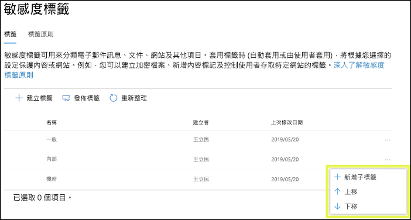

### 子標籤 (分組標籤)Sublabels (grouping labels)

您可以使用子標籤將一或多個標籤分組在 Office 應用程式中的使用者可看到的上層標籤之下。With sublabels, you can group one or more labels below a parent label that a user sees in an Office app. 例如，在 [機密文件] 下，您的組織可能會使用不同的標籤來標示該分類的特定類型。For example, under Confidential, your organization might use several different labels for specific types of that classification. 在此範例中，上層標籤 [機密文件] 只是沒有任何保護設定的文字標籤，且因為它有子標籤，所以無法套用至內容。In this example, the parent label Confidential is simply a text label with no protection settings, and because it has sublabels, it can’t be applied to content. 相反地，使用者必須選擇 [機密文件] 來查看子標籤，然後再選擇要套用到內容的子標籤。Instead, users must choose Confidential to view the sublabels, and then they can choose a sublabel to apply to content.

子標籤是以邏輯群組方式向使用者呈現標籤的一個簡單方式。Sublabels are simply a way to present labels to users in logical groups. 子標籤不繼承其上層標籤的任何設定。Sublabels don’t inherit any settings from their parent label. 當您發佈使用者的子標籤時，該使用者就可以將該子標籤套用到內容，但不能只套用上層標籤。When you publish a sublabel for a user, that user can then apply that sublabel to content but can't apply just the parent label.

請勿選擇上層標籤作為預設標籤，或將上層標籤設定為自動套用或建議的選項，因為上層標籤無法套用至使用 Azure 資訊保護整合標籤用戶端的 Office 應用程式中的內容。Don't choose a parent label as the default label, or configure a parent label to be auto-applied or recommended, because the parent label won't be applied to content in Office apps that use the Azure Information Protection unified labeling client.

子標籤如何對使用者顯示的範例：Example of how sublabels display for users:

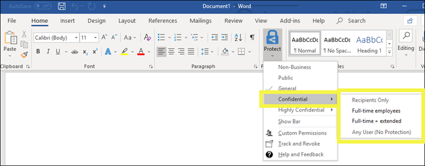

### 編輯或刪除敏感度標籤Editing or deleting a sensitivity label

如果您刪除敏感度標籤，該標籤不會從內容中移除，且會繼續對內容強制執行任何保護設定。If you delete a sensitivity label, the label is not removed from content, and any protection settings continue to be enforced on the content.

如果您編輯敏感度標籤，則會對內容強制執行當初套用至內容的標籤版本。If you edit a sensitivity label, the version of the label that was applied to content is what’s enforced on that content.

## 標籤原則的功能What label policies can do

建立敏感度標籤後，您需要發佈標籤，以供組織中的人員使用，這些人員可以接著將標籤套用至內容。與發佈到位置 (例如所有 Exchange 信箱) 的保留標籤不同，敏感度標籤會發佈給使用者或群組。敏感度標籤接著會為這些使用者和群組顯示在 Office 應用程式中。After you create your sensitivity labels, you need to publish them, to make them available to people in your organization, who can then apply the labels to content. Unlike retention labels, which are published to locations, such as all Exchange mailboxes, sensitivity labels are published to users or groups. Sensitivity labels then appear in Office apps for those users and groups.

使用標籤原則，您可以：With a label policy, you can:

- **選擇哪些使用者和群組可以看見標籤。** 標籤可以發佈到任何電子郵件啟用的安全性群組、通訊群組、Office 365 群組或動態通訊群組。**Choose which users and groups see the labels.** Labels can be published to any email-enabled security group, distribution group, Office 365 group, or dynamic distribution group.

- **套用預設標籤**至所有新文件和電子郵件，這些是由標籤原則中包含的使用者和群組所建立。此預設標籤可以設定您想要套用到所有內容的基礎層級保護設定。**Apply a default label** to all new documents and email created by the users and groups included in the label policy. This default label can set a base level of protection settings that you want applied to all your content.

- **需要變更標籤的理由。****Require a justification for changing a label.** 如果已將內容標示為「機密」，且使用者想要移除該標籤，或以較低的分類 (例如名為「公用」的標籤) 取代，您可以要求使用者在執行此動作時提供理由。If content is marked Confidential and a user wants to remove that label or replace it with a lower classification, such as a label named Public, you can require that the user provide a justification when performing this action. 目前，理由尚未傳送到 [標籤分析](label-analytics.md) 以供系統管理員檢閱。Currently, the justification reason isn't sent to [label analytics](label-analytics.md) for the admin to review. 不過 [Azure 資訊保護整合標籤用戶端](https://docs.microsoft.com/azure/information-protection/rms-client/aip-clientv2)會將此資訊傳送至 [Azure 資訊保護分析](https://docs.microsoft.com/azure/information-protection/reports-aip)。However, the [Azure Information Protection unified labeling client](https://docs.microsoft.com/azure/information-protection/rms-client/aip-clientv2) sends this information to [Azure Information Protection analytics](https://docs.microsoft.com/azure/information-protection/reports-aip).

    

- **要求使用者將標籤套用到他們的電子郵件和文件。** 如果您想要將所有使用者的內容套用標籤，您可以要求必須將標籤套用到所有已儲存的文件和傳送的電子郵件。基於自動或預設 (預設標籤選項如上所述) 指派的條件，使用者可以手動指派標籤。當使用者需要指派標籤時，Outlook 中會顯示提示。**Require users to apply a label to their email and documents.** If you want all of a user's content to be labeled, you can require that a label must be applied to all of their saved documents and sent emails. The label can be assigned manually by the user, automatically as a result of a condition, or be assigned by default (the default label option described above). Here's the prompt shown in Outlook when a user is required to assign a label.

    > [!NOTE]
    > 強制標籤需要具備 Azure 資訊保護訂閱。Mandatory labeling requires an Azure Information Protection subscription. 若要使用此功能，您必須下載並安裝 [Azure 資訊保護用戶端](https://www.microsoft.com/download/details.aspx?id=53018) 或較新版本的 [Azure 資訊保護統一標籤用戶端](https://docs.microsoft.com/azure/information-protection/rms-client/install-unifiedlabelingclient-app)。To use this feature, you must download and install either the [Azure Information Protection client](https://www.microsoft.com/download/details.aspx?id=53018) or the later [Azure Information Protection unified labeling client](https://docs.microsoft.com/azure/information-protection/rms-client/install-unifiedlabelingclient-app). 此外，用戶端僅能在 Windows 上執行，因此 Mac、iOS 和 Android 上尚不支援此功能。Also, the client runs only on Windows, so this feature is not yet supported on Mac, iOS, and Android.

    

- **提供自訂說明頁面的說明連結。****Provide help link to a custom help page.** 如果使用者不確定敏感度標籤代表的意義或使用方式，您可以提供「深入了解」URL，其顯示在 Office 應用程式中 [敏感度標籤]\*\*\*\* 功能表的底部。If your users aren’t sure what your sensitivity labels mean or how they should be used, you can provide a Learn More URL that appears at the bottom of the **Sensitivity label** menu in the Office apps.

    ![功能區中 [敏感度] 按鈕上的「深入了解」連結](media/Sensitivity-label-learn-more.png)

建立標籤原則並將敏感度標籤指派給使用者和群組之後，這些人會在一小時內在 Office 應用程式中看到這些標籤。After you create a label policy and assign sensitivity labels to users and groups, those people will see those labels available in the Office apps in an hour or less.

您可以建立並發佈的敏感度標籤數量沒有任何限制，但有一個例外：如果標籤套用加密，則上限為 500 個標籤。There is no limit to the number of sensitivity labels that you can create and publish, with one exception: If the label applies encryption, there is a maximum of 500 labels. 不過，為了降低系統管理負擔並為使用者減少複雜度，最佳做法是試著保持最少的標籤數量。However, as a best practice to minimize admin overheads and reduce complexity for your users, try to keep the number of labels to a minimum. 實際情況的部署已證明，當使用者擁有五個以上的主要標籤，或每個主要標籤有超過五個子標籤時，效果會明顯地降低。Real-word deployments have proved effectiveness to be reduced when users have more than five main labels and more than five sublabels per main label.

### 標籤原則優先順序 (順序很重要)Label policy priority (order matters)

您會在敏感度標籤原則中發佈敏感度標籤，以將其提供給使用者使用，而標籤會顯示在 [標籤原則]\*\*\*\* 頁面上 [敏感度原則]\*\*\*\* 索引標籤的清單中。You make your sensitivity labels available to users by publishing them in a sensitivity label policy that appears in a list on the **Sensitivity policies** tab on the **Label policies** page. 正如同敏感度標籤 (請參閱[標籤原則優先順序 (順序很重要)](#label-priority-order-matters))，敏感度標籤原則的順序非常重要，因為順序反映的是優先順序。Just like sensitivity labels (see [Label priority (order matters)](#label-priority-order-matters)), the order of the sensitivity label policies is important because it reflects their priority. 優先順序最低的標籤原則會顯示在**上方**，而優先順序最高的標籤原則會顯示在**下方**。The label policy with lowest priority is shown at the **top**, and the label policy with the highest priority is shown at the **bottom**.

標籤原則包含：A label policy consists of:

- 一組標籤。A set of labels.
- 標籤原則的範圍，表示原則中包含的使用者和群組。The scope of the label policy, meaning the users and groups included in the policy.
- 以上所述標籤原則的設定 (預設標籤、對齊、強制標籤和說明連結)。The settings of the label policy described above (default label, justification, mandatory label, and help link).

您可以將使用者包含在多個標籤原則中，該使用者即會看到來自這些原則的所有敏感度標籤。You can include a user in multiple label policies, and the user will see all the sensitivity labels from those policies. 不過，使用者只會看到來自具有最高優先順序標籤原則的原則設定。However, a user will see the policy settings from only the label policy with the highest priority.

如果您的組織中的使用者或群組看不到您需要的標籤原則中的選項，例如預設標籤或強制標籤，請檢查敏感度標籤原則的順序。If a user or group in your organization is not seeing an option in the label policy that you intended, such as a default or mandatory label, check the order of the sensitivity label policies. 若要重新排序標籤原則，請選取 [敏感度標籤原則 > 選擇右側的省略符號 > [下移]\*\*\*\* 或 [上移]\*\*\*\*。To re-order the label policies, select a sensitivity label policy > choose the ellipsis on the right > **Move down** or **Move up**.

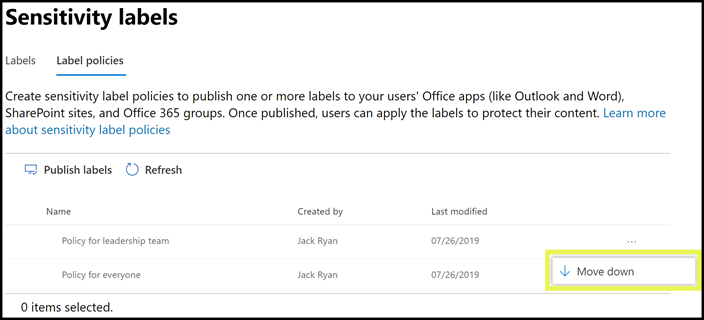

雖然敏感度標籤原則的優先順序很重要，對保留標籤原則而言，它卻**不**重要。While priority matters for sensitivity label policies, it does **not** matter for retention label policies. 如[保留原則，哪一個優先？](labels.md#the-principles-of-retention-or-what-takes-precedence)中所述，內容可能會受限於多個保留原則。As explained in [The principles of retention, or what takes precedence?](labels.md#the-principles-of-retention-or-what-takes-precedence), content can be subject to multiple retention policies.

## 如何開始使用敏感度標籤How to get started with sensitivity labels

開始使用敏感度標籤的程序很快：Getting started with sensitivity labels is a quick process:

1. **定義標籤。****Define the labels.** 首先，您要建立用於定義不同敏感度層級內容的分類法。First, you want to establish your taxonomy for defining different sensitivity levels of content. 使用對您的使用者有意義的一般名稱或字詞。Use common names or terms that make sense to your users. 例如，您可以從個人、公開、一般、機密和高度機密等標籤開始。For example, you can start with labels such as Personal, Public, General, Confidential, and Highly Confidential. 您可以使用子標籤，依類別將類似的標籤群組。You can use sublabels to group similar labels by category. 此外，建立標籤時會需要工具提示，它會在使用者將滑鼠指標移至功能區上的標籤選項時在 Office 應用程式中顯示。Also, when you create a label, a tool tip is required, which appears in the Office apps when a user hovers over a label option on the Ribbon.

2. **定義每個標籤的功能。****Define what each label can do.** 然後設定您想要與每個標籤相關聯的保護設定。Then, configure the protection settings you want associated with each label. 例如，較低的敏感度內容 (如「一般」標籤) 可能只有套用頁首或頁尾，而較高敏感度內容 (如「機密」標籤) 可能會套用浮水印、加密及 WIP，以協助確保只有特殊權限使用者可以存取。For example, lower sensitivity content (such as a “General” label) might simply have a header or footer applied to it, while higher sensitivity content (such as a “Confidential” label) may have a watermark, encryption, and WIP applied to it, to help ensure that only privileged users can access it.

3. **定義誰可以看到標籤。** 定義組織的標籤後，您會在標籤原則中發佈標籤，此原則可控制哪些使用者和群組會看到這些標籤。單一標籤可重複使用 – 定義一次後，即可將標籤包含在指派給不同使用者的數個標籤原則中。但為了讓標籤可指派給內容，您必須先發佈該標籤，才能在 Office 應用程式及其他服務中使用。剛開始時，您可以先指定給一小部分人員以試驗您的敏感度標籤。**Define who gets the labels.** After you define your organization’s labels, you publish them in a label policy that controls which users and groups see those labels. A single label is reusable – you define it once, and then you can include it in several label policies assigned to different users. But in order for a label to be assigned to content, you must first publish that label so that it’s available in Office apps and other services. When just starting out, you can pilot your sensitivity labels by assigning them to just a few people.

以下是系統管理員、使用者和 Office 應用程式執行項目以讓敏感度標籤運作的基本流程。Here’s the basic flow of what the admin, user, and Office app do to make sensitivity labels work.

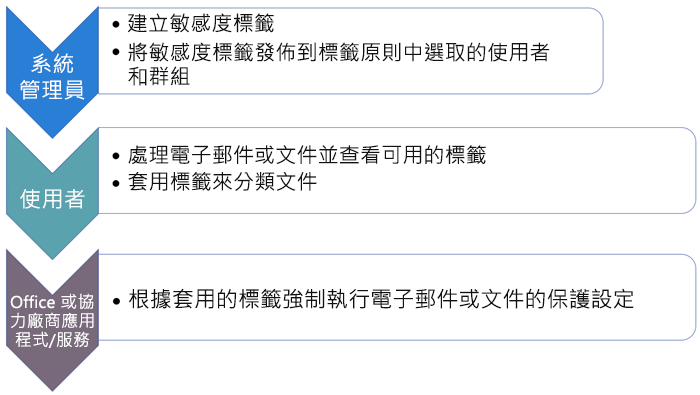

## 敏感度標籤會顯示的位置Where sensitivity labels can appear

敏感度標籤會顯示在 Office 應用程式的 UI 中。Sensitivity labels appear in the UI of Office apps. 若要檢視特定應用程式和平台內建標籤的目前狀態，請使用下列表格：To view the current availability for built-in labeling for specific apps and platforms, use the following tables:

- [在 Word、Excel 和 PowerPoint 中支援敏感度標籤功能Support for sensitivity label capabilities in Word, Excel, and PowerPoint](sensitivity-labels-office-apps.md#support-for-sensitivity-label-capabilities-in-word-excel-and-powerpoint)

- [在 Outlook 中支援敏感度標籤功能Support for sensitivity label capabilities in Outlook](sensitivity-labels-office-apps.md#support-for-sensitivity-label-capabilities-in-outlook)

如果您使用 Windows 電腦的 Azure 資訊保護整合標籤用戶端，則有其他功能可供敏感度標籤使用。If you use the Azure Information Protection unified labeling client for your Windows computers, additional features are available for sensitivity labels. 如需詳細資訊，請參閱[比較 Windows 電腦的標籤用戶端](https://docs.microsoft.com/azure/information-protection/rms-client/use-client#compare-the-labeling-clients-for-windows-computers)。For more information, see [Compare the labeling clients for Windows computers](https://docs.microsoft.com/azure/information-protection/rms-client/use-client#compare-the-labeling-clients-for-windows-computers).

### Windows 上的 Office 應用程式Office apps on Windows

在執行 Windows 裝置上的 Office 應用程式中，敏感度標籤會顯示在功能區上 [常用]\*\*\*\* 索引標籤的 [敏感度]\*\*\*\* 按鈕中。In Office apps on devices running Windows, sensitivity labels appear on the **Sensitivity** button, on the **Home** tab on the Ribbon. 

當您使用內建的標籤時，套用的標籤也會出現在視窗底部的狀態列中：When you use built-in labeling, the label applied also appears in the Status bar at the bottom of the window:

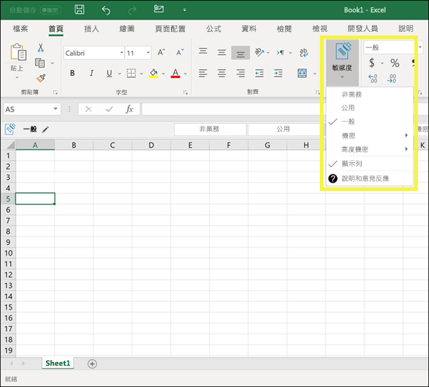

### Office 網頁版應用程式Office apps on the web

如需如何搭配敏感度標籤使用 Office 網頁版應用程式的詳細資訊，請參閱[在 Office 網頁版中將敏感度標籤套用至文件和電子郵件](https://support.office.com/article/2f96e7cd-d5a4-403b-8bd7-4cc636bae0f9)。For information about using sensitivity labels with Office apps on the web, see [Apply sensitivity labels to your documents and email within Office - Web](https://support.office.com/article/2f96e7cd-d5a4-403b-8bd7-4cc636bae0f9).

### Mac 上的 Office 應用程式Office apps on Mac

在 Mac 裝置上的 Office 應用程式中，敏感度標籤會顯示在功能區上 [常用]\*\*\*\* 索引標籤的 [敏感度]\*\*\*\* 按鈕中。In Office apps on Mac devices, sensitivity labels appear on the **Sensitivity** button, on the **Home** tab on the Ribbon. 套用的標籤也會出現在視窗底部的狀態列中：The label applied also appears in the Status bar at the bottom of the window:

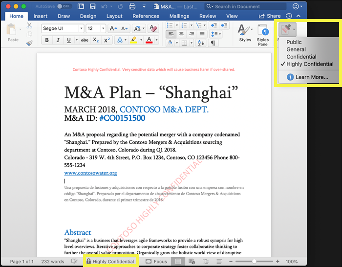

### iOS 上的 Office 應用程式Office apps on iOS

在 iOS 裝置上的 Office 應用程式中，敏感度標籤會顯示在功能區上 [常用]\*\*\*\* 索引標籤的 [敏感度]\*\*\*\* 按鈕中。In Office apps on iOS devices, sensitivity labels appear on the **Sensitivity** button, on the **Home** tab on the Ribbon. 套用的標籤也會出現在視窗底部的狀態列中：The label applied also appears in the Status bar at the bottom of the window:

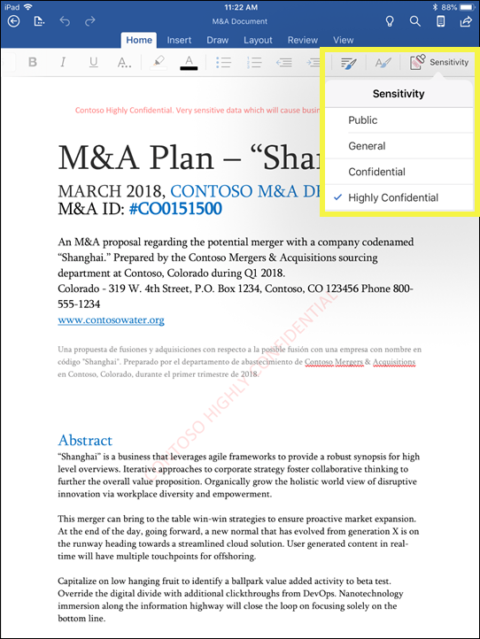

### Android 上的 Office 應用程式Office apps on Android

在 Android 裝置上的 Office 應用程式中，敏感度標籤會顯示在功能區上 [常用]\*\*\*\* 索引標籤的 [敏感度]\*\*\*\* 按鈕中。In Office apps on Android devices, sensitivity labels appear on the **Sensitivity** button, on the **Home** tab on the Ribbon. 套用的標籤也會出現在視窗底部的狀態列中：The label applied also appears in the Status bar at the bottom of the window:

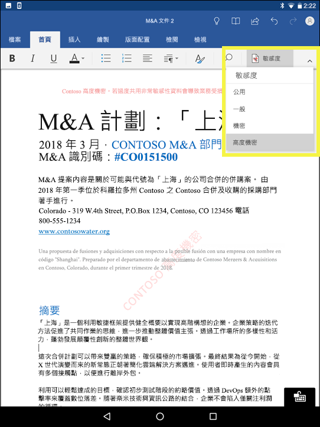

### Office 應用程式中敏感度標籤的詳細資訊More information on sensitivity labels in Office apps

- [在 Office 中將敏感度標籤套用至您的文件和電子郵件Apply sensitivity labels to your documents and email within Office](https://support.office.com/article/apply-sensitivity-labels-to-your-documents-and-email-within-office-2f96e7cd-d5a4-403b-8bd7-4cc636bae0f9)
- [將敏感度標籤套用至 Office 檔案的已知問題Known issues when you apply sensitivity labels to your Office files](https://support.office.com/article/known-issues-when-you-apply-sensitivity-labels-to-your-office-files-b169d687-2bbd-4e21-a440-7da1b2743edc)
- [Office 應用程式中的敏感度標籤Sensitivity labels in Office apps](sensitivity-labels-office-apps.md)

## 敏感度標籤如何搭配使用現有的 Azure 資訊保護標籤How sensitivity labels work with existing Azure Information Protection labels

Azure 資訊保護使用者可以使用 Azure 資訊保護整合標籤用戶端，在 Windows 上分類和標記內容。Azure Information Protection users can classify and label content on Windows by using the Azure Information Protection unified labeling client. 現有的 Azure 資訊保護標籤可與新的敏感度標籤 (也稱為整合標籤) 緊密配合。Existing Azure Information Protection labels work seamlessly with new sensitivity labels, also known as unified labels. 這表示您可以：This means you can:

- 在文件和電子郵件上保留現有的 Azure 資訊保護標籤。Keep your existing Azure Information Protection labels on documents and email.
- 保留現有的 Azure 資訊保護標籤設定。Keep your existing Azure Information Protection label configuration.

如果您因為您的租用戶尚不在[整合標籤平台](https://docs.microsoft.com/azure/information-protection/faqs#how-can-i-determine-if-my-tenant-is-on-the-unified-labeling-platform)中而使用 Azure 資訊保護標籤，建議您避免在其他系統管理中心中建立新標籤，直到您啟用整合標籤為止。If you are using Azure Information Protection labels because your tenant isn't yet on the [unified labeling platform](https://docs.microsoft.com/azure/information-protection/faqs#how-can-i-determine-if-my-tenant-is-on-the-unified-labeling-platform), we recommend that you avoid creating new labels in other admin centers until you activate unified labeling. 如需此程序的詳細資訊，請參閱[如何將 Azure 資訊保護標籤移轉至整合敏感度標籤](https://docs.microsoft.com/azure/information-protection/configure-policy-migrate-labels)。For more information about this process, see [How to migrate Azure Information Protection labels to unified sensitivity labels](https://docs.microsoft.com/azure/information-protection/configure-policy-migrate-labels).

## 敏感度標籤和 Azure 資訊保護用戶端Sensitivity labels and the Azure Information Protection client

如果已安裝 Azure 資訊保護用戶端，則 Office 365 專業增強版應用程式會自動關閉 Office Windows 應用程式中的敏感度標籤。Office 365 ProPlus apps automatically turn off built-in labeling for sensitivity labels in Office Windows apps if the Azure Information Protection client is installed.
若要變更此預設行為，以便使用內建的標籤，請參閱[關於 Office 內建標籤用戶端](sensitivity-labels-office-apps.md#about-the-office-built-in-labeling-client)。To change this default behavior so that you can use built-in labeling, see [About the Office built-in labeling client](sensitivity-labels-office-apps.md#about-the-office-built-in-labeling-client).

## 使用 Microsoft Intune 中的端點保護來保護 Windows 裝置上的內容Protect content on Windows devices by using endpoint protection in Microsoft Intune

建立敏感度標籤時，您可以選擇告知 Windows：當含有此標籤的檔案儲存在 Windows 裝置上時，需要保護此內容不遭受資料外洩。When you create a sensitivity label, you have the option to tell Windows that files with this label need to be protected against data leakage when this content is stored on Windows devices. 此選項可協助您確保使用這個標籤的內容只能共用或複製到獲批准的位置，甚至是在端點上儲存時。This option can help ensure that content with this label can be shared or copied only to sanctioned locations, even when it’s stored on an endpoint. 實際上，對敏感度標籤開啟此選項，會告知 Windows 這是極為重要的資料，需要提供額外的使用限制。In essence, turning on this option for a sensitivity label tells Windows that this is extra critical data that warrants additional usage constraints.

當您開啟此選項，Windows 可以讀取、了解及對文件中的敏感度標籤採取動作，並自動對內容套用 Windows 資訊保護 (WIP)，不論其如何觸及受管理的 Windows 裝置。在無論是否套用加密的情況下，這有助於防止標記的檔案發生意外洩漏。When you turn on this option, Windows can read, understand, and act on sensitivity labels in documents and automatically apply Windows Information Protection (WIP) on content, no matter how it reaches a managed Windows device. This helps protect labeled files from accidental leakage, with or without applying encryption.

比方說，Windows 可了解位於使用者電腦上的 Word 文件已套用「機密」標籤，且 WIP 可套用應用程式保護原則，以避免將資料複製或共用到該裝置的任何非工作位置 (例如個人 OneDrive、個人電子郵件帳戶、社群媒體或 USB 磁碟機)。For example, Windows can understand that a Word document residing on a user’s machine has a Confidential label applied to it, and WIP can apply an app protection policy to prevent the copying or sharing of the data to any non-work location from that device (such as a personal OneDrive, personal email accounts, social media, or USB drives).

如果使用者嘗試將已標記的內容上傳到個人 Gmail 帳戶，他們會看到這則訊息。If a user attempts to upload labeled content to a personal Gmail account, they see this message.

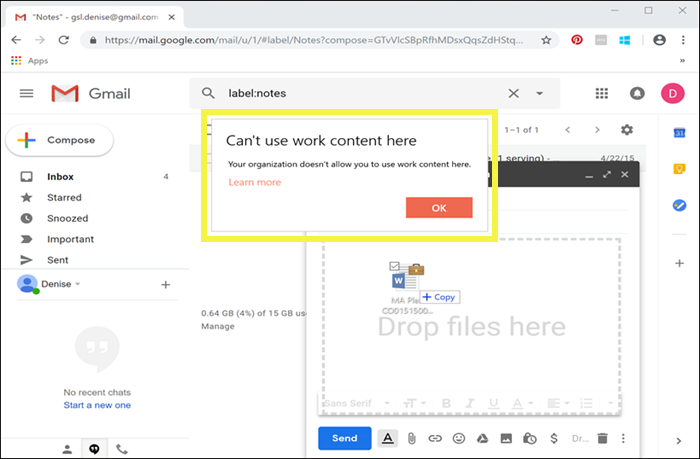

而如果使用者嘗試將已標記的內容儲存到 USB 磁碟機，他們會看到下列訊息：And if a user attempts to save labeled content to a USB drive, they see the following message:

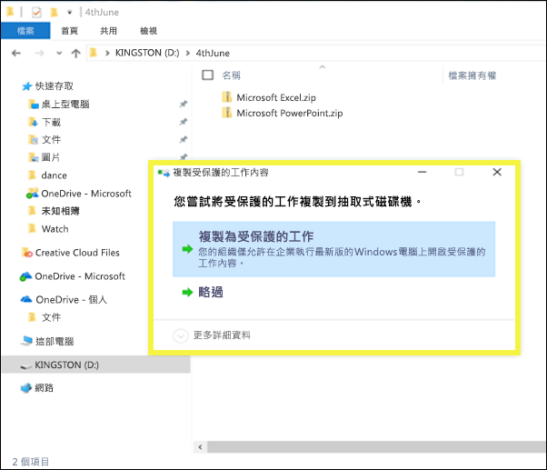

### 使用 WIP 的重要先決條件Important prerequisites for using WIP

在敏感度標籤可使用 WIP 之前，您必須先執行下文所述的先決條件：[Windows 資訊保護如何保護具有敏感度標籤的檔案](https://docs.microsoft.com/windows/security/information-protection/windows-information-protection/how-wip-works-with-labels?branch=vsts17546553)。本主題將說明下列先決條件：Before your sensitivity labels can use WIP, you first need to do the prerequisites described here: [How Windows Information Protection protects files with a sensitivity label](https://docs.microsoft.com/windows/security/information-protection/windows-information-protection/how-wip-works-with-labels?branch=vsts17546553). This topic describes the following prerequisites:

- 請確定您執行的是 Windows 10，版本 1809 或更新版本。Make sure you're running Windows 10, version 1809 or later.
- [設定 Microsoft Defender 進階威脅防護 (Microsoft Defender ATP)](https://docs.microsoft.com/windows/security/threat-protection/)，這會掃描標籤內容，並套用對應的 WIP 保護。[Set up Microsoft Defender Advanced Threat Protection (Microsoft Defender ATP)](https://docs.microsoft.com/windows/security/threat-protection/), which scans content for a label and applies the corresponding WIP protection. ATP 執行某些獨立於 WIP 的動作，例如報告異常狀況。ATP performs some actions independently from WIP, such as reporting anomalies.
- 建立可套用至端點裝置的 Windows 資訊保護 (WIP) 原則。您可以在下列任何位置執行此作業：Create a Windows Information Protection (WIP) policy that applies to endpoint devices. You can do this in either of these locations:

  - [為 Microsoft Intune 使用 Azure 入口網站透過 MDM 建立 Windows 資訊保護 (WIP) 原則Create a Windows Information Protection (WIP) policy with MDM using the Azure portal for Microsoft Intune](https://docs.microsoft.com/windows/security/information-protection/windows-information-protection/create-wip-policy-using-intune-azure)
  - [使用 System Center Configuration Manager 建立及部署 Windows 資訊保護 (WIP) 原則Create and deploy a Windows Information Protection (WIP) policy using System Center Configuration Manager](https://docs.microsoft.com/windows/security/information-protection/windows-information-protection/create-wip-policy-using-sccm)

## 使用 Microsoft Cloud App Security 保護協力廠商應用程式和服務中的內容Protect content in third-party apps and services by using Microsoft Cloud App Security

使用 Cloud App Security (CAS) 保護協力廠商應用程式和服務中的內容。Protect content in third-party apps and services by using Cloud App Security (CAS). 您可以使用 CAS 來偵測、分類、加標籤，以及保護內容的第三方服務和應用程式 (例如 SalesForce、Box 或 Dropbox) 中的內容。With CAS, you can detect, classify, label, and protect content in third-party services and apps, such as SalesForce, Box, or Dropbox. 例如，Dropbox 可能無法了解敏感度標籤，但 CAS 可以取得並保護該位置中加標籤的內容。For example, Dropbox might not understand a sensitivity label, but CAS can reach out and protect labeled content in that location.

如需詳細資訊，請參閱[自動套用 Azure 資訊保護分類標籤](https://docs.microsoft.com/cloud-app-security/use-case-information-protection)。For more information, see [Automatically apply Azure Information Protection classification labels](https://docs.microsoft.com/cloud-app-security/use-case-information-protection).

### 使用 CAS 的重要先決條件Important prerequisites for using CAS

在敏感度標籤可使用 CAS 之前，您必須先執行下文所述的先決條件：[自動套用 Azure 資訊保護分類標籤](https://docs.microsoft.com/cloud-app-security/use-case-information-protection)。Before your sensitivity labels can use CAS, you first need to do the prerequisites described here: [Automatically apply Azure Information Protection classification labels](https://docs.microsoft.com/cloud-app-security/use-case-information-protection). 本主題說明下列先決條件：This topic describes the following prerequisites:

- 為您的租用戶[啟用 Cloud App Security 和 Azure 資訊保護](https://docs.microsoft.com/cloud-app-security/azip-integration)。[Enable Cloud App Security and Azure Information Protection](https://docs.microsoft.com/cloud-app-security/azip-integration) for your tenant.
- [將應用程式連線](https://docs.microsoft.com/cloud-app-security/enable-instant-visibility-protection-and-governance-actions-for-your-apps)至 Cloud App Security。[Connect the app](https://docs.microsoft.com/cloud-app-security/enable-instant-visibility-protection-and-governance-actions-for-your-apps) to Cloud App Security.

## 使用 Microsoft 資訊保護 SDK 將敏感度標籤擴充至協力廠商應用程式和服務Extend sensitivity labels to third-party apps and services by using the Microsoft Information Protection SDK

由於敏感度標籤在文件的中繼資料內保存為純文字，協力廠商應用程式和服務可以選擇支援識別及保護含有這類標籤的內容。其他應用程式和服務的支援已展開。Because a sensitivity label is persisted as clear text in the metadata of a document, third-party apps and services can choose to support identifying and protecting content that contains such a label. Support in other apps and services is always expanding.

有了 [Microsoft 資訊防護 SDK](https://docs.microsoft.com/information-protection/develop/)，協力廠商應用程式和服務就可以讀取敏感度標籤和保護，並將其套用到文件。With the [Microsoft Information Protection SDK](https://docs.microsoft.com/information-protection/develop/), third-party apps and services can read and apply sensitivity labels and protection to documents. SDK 支援[這些平台](https://docs.microsoft.com/information-protection/develop/overview#microsoft-information-protection-sdk)上的應用程式。The SDK supports apps on [these platforms](https://docs.microsoft.com/information-protection/develop/overview#microsoft-information-protection-sdk).

使用 SDK，您可以標記及保護內容，並搭配其他 Microsoft 資訊保護應用程式和服務，如 Office 應用程式、Office 365 服務、Azure 資訊保護掃描器、Microsoft Cloud App Security，以及多種其他的合作夥伴解決方案。例如，深入了解 [Adobe Acrobat 中敏感度標籤的支援](https://techcommunity.microsoft.com/t5/Azure-Information-Protection/Starting-October-use-Adobe-Acrobat-Reader-for-PDFs-protected-by/ba-p/262738)。Using the SDK, you can label and protect content in a way that works with other Microsoft Information Protection apps and services, such as Office apps, Office 365 services, the Azure Information Protection scanner, Microsoft Cloud App Security, and several other partner solutions. For example, learn more about [support for sensitivity labels in Adobe Acrobat](https://techcommunity.microsoft.com/t5/Azure-Information-Protection/Starting-October-use-Adobe-Acrobat-Reader-for-PDFs-protected-by/ba-p/262738).

若要深入了解 Microsoft 資訊保護 SDK，請參閱[技術社群部落格上的公告](https://techcommunity.microsoft.com/t5/Microsoft-Information-Protection/Microsoft-Information-Protection-SDK-Now-Generally-Available/ba-p/263144)。您也可以了解[與 Microsoft 資訊保護整合的合作夥伴解決方案](https://techcommunity.microsoft.com/t5/Azure-Information-Protection/Microsoft-Information-Protection-showcases-integrated-partner/ba-p/262657)。To learn more about the Microsoft Information Protection SDK, see the [announcement on the Tech Community blog](https://techcommunity.microsoft.com/t5/Microsoft-Information-Protection/Microsoft-Information-Protection-SDK-Now-Generally-Available/ba-p/263144). You can also learn about [partner solutions that are integrated with Microsoft Information Protection](https://techcommunity.microsoft.com/t5/Azure-Information-Protection/Microsoft-Information-Protection-showcases-integrated-partner/ba-p/262657).

## 建立敏感度標籤所需的權限Permissions required to create sensitivity labels

合規性小組成員會建立敏感度標籤，這些成員需要 Microsoft 365 合規性中心、Microsoft 365 安全性中心或 Office 365 安全性與合規性中心的權限。Members of your compliance team who will create sensitivity labels need permissions to the Microsoft 365 compliance center, Microsoft 365 security center, or Office 365 Security & Compliance Center. 根據預設，您的租用戶系統管理員可以存取這些系統管理中心，並且授與法務人員和其他人員存取權限，而不需授與他們租用戶系統管理員的所有權限。如需這個委派的受限系統管理員存取權，請移至其中一個系統管理中心的 [權限]\*\*\*\* 頁面，然後將成員新增至 [合規性系統管理員]\*\*\*\* 或 [安全性系統系統管理員]\*\*\*\* 角色群組。By default, your tenant admin has access to these admin centers and can give compliance officers and other people access, without giving them all of the permissions of a tenant admin. For this delegated limited admin access, go to the **Permissions** page of one of these admin centers, and then add members to the **Compliance Administrator** or **Security Administrator** role group.

如需詳細資訊，請參閱[授與使用者存取 Office 365 安全性與合規性中心的權限](https://docs.microsoft.com/microsoft-365/security/office-365-security/grant-access-to-the-security-and-compliance-center)。For more information, see [Give users access to the Office 365 Security & Compliance Center](https://docs.microsoft.com/microsoft-365/security/office-365-security/grant-access-to-the-security-and-compliance-center).

需要這些權限才能建立及套用標籤和標籤原則。原則強制執行不需要內容的存取權。These permissions are required only to create and apply labels and a label policy. Policy enforcement does not require access to the content.