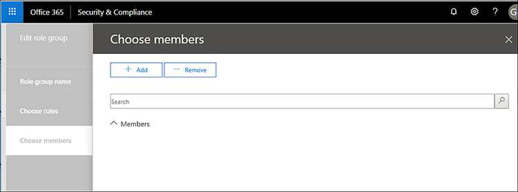

# 安全性 & 規範中心的服務保證

使用安全性 & 合規性中心的服務保證來存取描述各種主題的檔，包括： 
  
- Microsoft 在 Office 365 中儲存的客戶資料的安全性作法。 
    
- 獨立于 Office 365 的協力廠商審計報告。 
    
- Office 365 用來保護您資料的安全性、隱私權及合規性控制措施的執行和測試細節。 
    
您也可以瞭解 Office 365 可如何協助客戶遵循各行業的標準、法律和法規，例如：
  
-  國際標準組織（ISO）27001和27018 
    
- 1996 年美國醫療保險轉移與責任法案 (HIPAA)
    
- 聯邦風險與授權管理計畫 (FedRAMP)
    
## 誰可以存取 Office 365 服務擔保，以及如何？

 **新客戶及評估 Microsoft 線上服務的客戶**可以存取 Office 365 企業版 E3 和 E5 方案（試用和付費訂閱）隨附的服務保證。 如果您沒有上述方案之一，但想要嘗試服務保證，您可以[註冊 Office 365 企業版 E5 的試用版](https://go.microsoft.com/fwlink/p/?LinkID=698279)。 
  
 **Microsoft 商務用365的現有客戶**可以存取服務擔保。 如果您是組織的全域系統管理員（有時稱為「公司管理員」），您就可以存取服務保障，也可以將其他人放在一起。 如果您不是組織的全域系統管理員，且需要存取服務保證，請要求您的系統管理員將您新增至 [服務保證] 使用者角色群組。 
  
 在您的訂閱中未實施服務保證角色型存取時， **O365 訂閱成員**可以存取 Office365 Protection Center 中的服務保證區段（預設值）。 服務保證會針對儲存在 Office 365 中的客戶資料，提供描述 Microsoft 安全性做法的報告和文件。 此外，這個區段也會提供 Office 365 的獨立第三方稽核報告。 
  
> [!NOTE]
> 如果貴公司已在 Microsoft 365 訂閱中實施服務保證角色型存取（可能是因為您的組織已提供存取自訂報告的許可權），而且您需要存取服務保證，但未包含在安全性 & 合規性中心的左窗格中，請要求您的 Office 365 管理員將您新增至 [**許可權**] 頁面上的 [服務保證] 使用者角色群組。 如需詳細資訊，請參閱其他板載服務擔保使用者或群組。 
  
 **服務保證角色型存取**已布建使用者如果貴公司已實施服務保證角色型存取，您可以針對所有的安全性和合規性人員提供服務保證存取，包括資訊安全性、風險管理、規範，以及組織內的審計小組和人員。 如需詳細資訊，請參閱[其他板載服務擔保使用者或群組](service-assurance.md#addother)。
  
服務保證可透過安全性 & 規範中心來存取。 以下是取得的方式。
  
1. 請移至 [https://protection.office.com](https://protection.office.com)。
    
2. 使用您的公司或學校帳戶登入。 
    
3. 在左窗格中，選取 [**服務保證**]。 接下來，[選擇您的行業和區域設定](service-assurance.md#Chooseyourindustryregional)，以及[其他的服務擔保使用者或群組](service-assurance.md#addother)。
    
    > [!NOTE]
    > 如果您需要存取服務保證，但未包含在安全性 & 合規性中心的左窗格中，請諮詢您的 Office 365 管理員，將您新增至 [**許可權**] 頁面上的 [服務保證] 使用者角色群組。 
  
## 選擇您的行業和區域設定

當您第一次存取服務擔保時，第一步是設定您的行業和區域設定。 您可以隨時變更這些設定。 設定這些設定可讓服務擔保為您提供與貴組織最相關的內容。 設定您的行業及地區設定：
  
1. 在您存取服務保證後，請選取 [**設定**] 和 [地區及工業設定] 頁面隨即顯示，如下列螢幕擷取畫面所示。 
    
    ![顯示 [保護中心設定] 頁面。](../media/101716e8-9c0a-4839-a2c0-f6aacf64eb9d.png)
  
2. 在 [**設定**] 頁面上，選取 [**地區**] 旁邊的向下箭號，並檢查組織的適當地區。 
    
3. 選取 [**工業**] 旁邊的向下箭號，並檢查您組織的適當行業。 
    
4. 選取地區和行業後，請選取 [**儲存**]。
    
## 尋找、審閱及下載規範和信任內容

若要複查及下載內容，請從功能窗格中選取一個選項：
  
- **符合性報告**可查看 Office 365 和其他 Microsoft 雲端服務的獨立審核和評估，如下列螢幕擷取畫面所示。 
    
    
  
- **信任檔**，以查看 Microsoft 如何運作 Office 365 的資訊，如下列螢幕擷取畫面所示。 
    
    
  
- 經過**審核的控制項**，可查看有關 Office 365 控制如何符合安全性、規範和隱私權需求的資訊，如下列螢幕擷取畫面所示。 
    
    
  
選取您要下載的報表，然後選取 [**儲存**]，將其下載至您的電腦。 若為已審核的控制項，請選取您想要的報表，然後選取 [**下載**]。 下表說明您可以在每個服務保證頁面上找到的報告。 
  
> [!NOTE]
> 服務保證報告和檔可在發佈後的12個月內下載，或在新的檔版本可供下載。 
  
|**服務保證頁面**|**內容可用**|**描述**|
|:-----|:-----|:-----|
|規範報告    | FedRamp     GRC 評估     ISO     SOC/SSAE    |使用服務相容性報告，檢查由協力廠商獨立審計員執行的 Office 365 Service 傳遞作業的審計評估。    |
|信任文件    | 常見問題解答和白皮書     風險管理報告    |使用本文所提供的白皮書、FAQs、年末報告和其他 Microsoft 機密資源，您可以在您的評論/風險評估條款下使用保密協定。    |
|已審核控制項    |Office 365 已執行的全球標準與法規。    | 當您在評估、上架或使用 Office 365 服務時，可協助您進行風險評估。 找出：     -Office 365 控制項如何符合安全性、規範和隱私權的需求。   -關於 Office 365 中的控制項測試、這些測試的結果，以及它們完成的時間。    |
   
視您的特定設定而定，您的視圖中包含的選項可能有一些差異。
  
## 其他板載服務保障使用者或群組

若要存取一般在所有 Microsoft 雲端訂閱中可用的預設報告，您不需要執行服務保證角色型訪問模型，而且可以略過此步驟。 不過，如果您的組織已提供存取自訂報告，請將其他使用者或群組新增至服務保證角色。 若要新增其他使用者或群組：
  
1. 在 [安全性 & 規範中心] 中，選取左窗格中的 [**許可權**]，如下列螢幕擷取畫面所示。 
    
    
  
2. 在右窗格中，選取 [**服務保證使用者**]，然後選取 [**編輯角色群組**]，然後在 [**成員**] 區段下，選取 [**編輯**]，以新增成員至服務擔保使用者角色，如下列螢幕擷取畫面所示。 
    
    
  
3. 在 [下一個] 對話方塊中，搜尋並選擇需要查看服務保證符合性報告和信任資源的個人或群組，然後針對每個選取範圍選取 [**新增**]，然後在完成時，按一下窗格右上角的**X** 。 
    
    
  
4. 您新增至服務保證使用者角色的每個使用者或群組，現在都可以在安全性 & 合規性中心尋找服務擔保及下載報表及其他檔。
    
隨時回到 [**許可權**] 頁面，以新增更多使用者或移除現有的使用者。 
  
## 取得服務保障的協助

[支援商務產品的支援-系統管理](https://support.office.com/article/32a17ca7-6fa0-4870-8a8d-e25ba4ccfd4b)說明。
  
## 常見問題集

 **為什麼我會收到錯誤訊息，指出服務保證中的檔遭到損毀？**
  
大部分的服務保證檔都是 PDF 格式。 選擇 [**儲存**]，將檔案儲存至，然後從本機電腦開啟檔案。 
