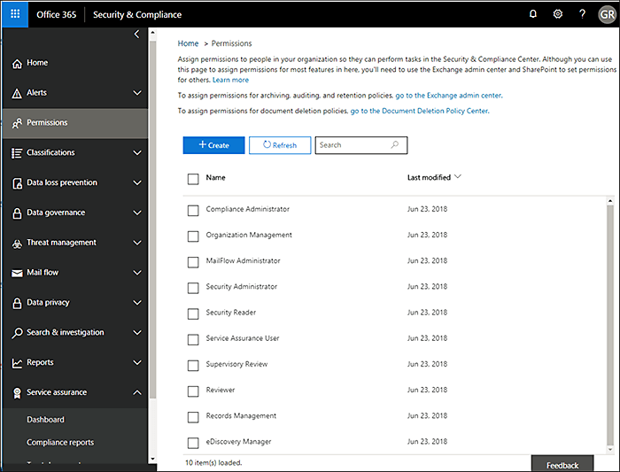
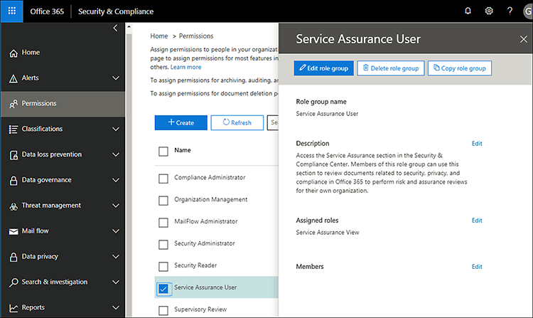

# 安全性 & 規範中心的服務保證Service assurance in the Security & Compliance Center

使用安全性 & 合規性中心的服務保證來存取描述各種主題的檔，包括：Use Service assurance in the Security & Compliance Center to access documents that describe a variety of topics, including: 
  
- Microsoft 在 Office 365 中儲存的客戶資料的安全性作法。Microsoft security practices for customer data that is stored in Office 365. 
    
- 獨立于 Office 365 的協力廠商審計報告。Independent third-party audit reports of Office 365. 
    
- Office 365 用來保護您資料的安全性、隱私權及合規性控制措施的執行和測試細節。Implementation and testing details for security, privacy, and compliance controls that Office 365 uses to protect your data. 
    
您也可以瞭解 Office 365 可如何協助客戶遵循各行業的標準、法律和法規，例如：You can also find out how Office 365 can help customers comply with standards, laws, and regulations across industries, such as the:
  
-  國際標準組織（ISO）27001和27018International Organization for Standardization (ISO) 27001 and 27018 
    
- 1996 年美國醫療保險轉移與責任法案 (HIPAA)Health Insurance Portability and Accountability Act of 1996 (HIPAA)
    
- 聯邦風險與授權管理計畫 (FedRAMP)Federal Risk and Authorization Management Program (FedRAMP)
    
## 誰可以存取 Office 365 服務擔保，以及如何？Who can access Office 365 Service assurance, and how?

 **新客戶及評估 Microsoft 線上服務的客戶**可以存取 Office 365 企業版 E3 和 E5 方案（試用和付費訂閱）隨附的服務保證。**New customers, and customers evaluating Microsoft online services** can access Service assurance which is included with Office 365 Enterprise E3 and E5 plans (both trial and paid subscriptions). 如果您沒有上述方案之一，但想要嘗試服務保證，您可以[註冊 Office 365 企業版 E5 的試用版](https://go.microsoft.com/fwlink/p/?LinkID=698279)。If you don't have one of these plans and want to try Service assurance, you can [sign-up for a trial of Office 365 Enterprise E5](https://go.microsoft.com/fwlink/p/?LinkID=698279). 
  
 **Microsoft 商務用365的現有客戶**可以存取服務擔保。**Existing customers of Microsoft 365 for business** can access Service assurance. 如果您是組織的全域系統管理員（有時稱為「公司管理員」），您就可以存取服務保障，也可以將其他人放在一起。If you're the global admin (sometimes called company administrator) for your organization, you'll already have access to Service assurance, and you can onboard others. 如果您不是組織的全域系統管理員，且需要存取服務保證，請要求您的系統管理員將您新增至 [服務保證] 使用者角色群組。If you're not the global admin for your organization, and you need access to Service assurance, ask your admin to add you to the Service Assurance User role group. 
  
 在您的訂閱中未實施服務保證角色型存取時， **O365 訂閱成員**可以存取 Office365 Protection Center 中的服務保證區段（預設值）。**O365 Subscription Members** can access the Service assurance section in the Office365 Protection Center by default if Service assurance roles-based access has not been implemented in your subscription. 服務保證會針對儲存在 Office 365 中的客戶資料，提供描述 Microsoft 安全性做法的報告和文件。Service assurance provides reports and documents that describe Microsoft's security practices for customer data that's stored in Office 365. 此外，這個區段也會提供 Office 365 的獨立第三方稽核報告。It also provides independent third-party audit reports on Office 365. 
  
> [!NOTE]
> 如果貴公司已在 Microsoft 365 訂閱中實施服務保證角色型存取（可能是因為您的組織已提供存取自訂報告的許可權），而且您需要存取服務保證，但未包含在安全性 & 合規性中心的左窗格中，請要求您的 Office 365 管理員將您新增至 [**許可權**] 頁面上的 [服務保證] 使用者角色群組。If your company has implemented Service Assurance Roles-Based Access in your Microsoft 365 Subscription (which could be if your organization has been provided access to custom reports), and you need access to Service assurance but it is not included in the left pane of the Security & Compliance Center, ask your Office 365 administrator to add you to the Service Assurance User role group on the **Permissions** page. 如需詳細資訊，請參閱其他板載服務擔保使用者或群組。For more information, see Onboard other Service assurance users or groups. 
  
 **服務保證角色型存取**已布建使用者如果貴公司已實施服務保證角色型存取，您可以針對所有的安全性和合規性人員提供服務保證存取，包括資訊安全性、風險管理、規範，以及組織內的審計小組和人員。**Service assurance roles-based access-provisioned users** If your company has implemented Service assurance roles-based access, you can provide Service assurance access to all security and compliance personnel including information security, risk management, compliance, and audit teams and personnel within your organization. 如需詳細資訊，請參閱[其他板載服務擔保使用者或群組](service-assurance.md#addother)。For details, see [Onboard other Service assurance users or groups](service-assurance.md#addother).
  
服務保證可透過安全性 & 規範中心來存取。Service assurance is accessible by using the Security & Compliance Center. 以下是取得的方式。Here's how to get to there.
  
1. 請移至 [https://protection.office.com](https://protection.office.com)。Go to [https://protection.office.com](https://protection.office.com).
    
2. 使用您的公司或學校帳戶登入。Sign in using your work or school account. 
    
3. 在左窗格中，選取 [**服務保證**]。In the left pane, select **Service assurance**. 接下來，[選擇您的行業和區域設定](service-assurance.md#Chooseyourindustryregional)，以及[其他的服務擔保使用者或群組](service-assurance.md#addother)。Next, [Choose your industry and regional settings](service-assurance.md#Chooseyourindustryregional) and [Onboard other Service assurance users or groups](service-assurance.md#addother).
    
    > [!NOTE]
    > 如果您需要存取服務保證，但未包含在安全性 & 合規性中心的左窗格中，請諮詢您的 Office 365 管理員，將您新增至 [**許可權**] 頁面上的 [服務保證] 使用者角色群組。If you need access to Service assurance, and it's not included in the left pane of the Security & Compliance Center, ask your Office 365 administrator to add you to the Service Assurance User role group on the **Permissions** page. 
  
## 選擇您的行業和區域設定Choose your industry and regional settings

當您第一次存取服務擔保時，第一步是設定您的行業和區域設定。When you access Service assurance for the first time, the first step is to configure your industry and regional settings. 您可以隨時變更這些設定。You can change these settings at any time. 設定這些設定可讓服務擔保為您提供與貴組織最相關的內容。Configuring these settings enables Service assurance to provide you with content that is most relevant to your organization. 設定您的行業及地區設定：To configure your industry and region settings:
  
1. 在您存取服務保證後，請選取 [**設定**] 和 [地區及工業設定] 頁面隨即顯示，如下列螢幕擷取畫面所示。After you access Service assurance, select **Settings** and the Region and industry settings page displays as shown in the following screenshot. 
    
    ![顯示 [保護中心設定] 頁面。](../media/101716e8-9c0a-4839-a2c0-f6aacf64eb9d.png)
  
2. 在 [**設定**] 頁面上，選取 [**地區**] 旁邊的向下箭號，並檢查組織的適當地區。On the **Settings** page, select the down arrow next to **Region** and check the appropriate regions for your organization. 
    
3. 選取 [**工業**] 旁邊的向下箭號，並檢查您組織的適當行業。Select the down arrow next to **Industry** and check the appropriate industries for your organization. 
    
4. 選取地區和行業後，請選取 [**儲存**]。Once you have selected regions and industries, select **Save**.
    
## 尋找、審閱及下載規範和信任內容Find, review, and download compliance and trust content

若要複查及下載內容，請從功能窗格中選取一個選項：To review and download content, select an option from the navigation pane:
  
- **符合性報告**可查看 Office 365 和其他 Microsoft 雲端服務的獨立審核和評估，如下列螢幕擷取畫面所示。**Compliance reports** to view independent audits and assessments of Office 365 and other Microsoft cloud services as shown in the following screen shot. 
    
    
  
- **信任檔**，以查看 Microsoft 如何運作 Office 365 的資訊，如下列螢幕擷取畫面所示。**Trust documents** to view information about how Microsoft operates Office 365 as shown in the following screen shot. 
    
    
  
- 經過**審核的控制項**，可查看有關 Office 365 控制如何符合安全性、規範和隱私權需求的資訊，如下列螢幕擷取畫面所示。**Audited controls** to view information about how Office 365 controls meet security, compliance, and privacy requirements, as shown in the following screen shot. 
    
    
  
選取您要下載的報表，然後選取 [**儲存**]，將其下載至您的電腦。Select the report you want to download, and select **Save** to download it to your computer. 若為已審核的控制項，請選取您想要的報表，然後選取 [**下載**]。For Audited controls, select the report you want and then select **Download**. 下表說明您可以在每個服務保證頁面上找到的報告。The table below describes the reports you can find on each Service assurance page. 
  
> [!NOTE]
> 服務保證報告和檔可在發佈後的12個月內下載，或在新的檔版本可供下載。Service assurance reports and documents are available to download for at least twelve months after publishing or until a new version of the document becomes available. 
  
|**服務保證頁面****Service assurance page**|**內容可用****Content available**|**描述****Description**|
|:-----|:-----|:-----|
|規範報告Compliance reports    | FedRampFedRamp     GRC 評估GRC Assessment     ISOISO     SOC/SSAESOC/SSAE    |使用服務相容性報告，檢查由協力廠商獨立審計員執行的 Office 365 Service 傳遞作業的審計評估。Use service compliance reports to review audit assessments performed by third-party independent auditors of Office 365 Service Delivery Operations.    |
|信任文件Trust documents    | 常見問題解答和白皮書FAQ and White Papers     風險管理報告Risk Management Reports    |使用本文所提供的白皮書、FAQs、年末報告和其他 Microsoft 機密資源，您可以在您的評論/風險評估條款下使用保密協定。Use white papers, FAQs, end-of-year reports and other Microsoft Confidential resources that are made available to you under non-disclosure agreement for your review / risk assessments.    |
|已審核控制項Audited controls    |Office 365 已執行的全球標準與法規。Global standards and regulations that Office 365 has implemented.    | 當您在評估、上架或使用 Office 365 服務時，可協助您進行風險評估。Help with risk-assessment when you're evaluating, onboarding, or using Office 365 services. 找出：Find out:     -Office 365 控制項如何符合安全性、規範和隱私權的需求。- How Office 365 controls meet security, compliance, and privacy requirements.   -關於 Office 365 中的控制項測試、這些測試的結果，以及它們完成的時間。-  About testing of controls in Office 365, results of these tests, and when they were completed.    |
   
視您的特定設定而定，您的視圖中包含的選項可能有一些差異。Depending on your specific set-up, options included in your view might have some differences.
  
## 其他板載服務保障使用者或群組Onboard other Service assurance users or groups

若要存取一般在所有 Microsoft 雲端訂閱中可用的預設報告，您不需要執行服務保證角色型訪問模型，而且可以略過此步驟。For accessing default reports that are generally available across all Microsoft Cloud subscriptions, you don't need to implement the Service Assurance roles-based access model and you can skip this step. 不過，如果您的組織已提供存取自訂報告，請將其他使用者或群組新增至服務保證角色。However, if your organization has been provided access to custom reports then please add other users or groups to the Service Assurance roles. 若要新增其他使用者或群組：To add other users or groups:
  
1. 在 [安全性 & 規範中心] 中，選取左窗格中的 [**許可權**]，如下列螢幕擷取畫面所示。In the Security & Compliance Center, select **Permissions** in the left pane as shown in the following screenshot. 
    
    
  
2. 在右窗格中，選取 [**服務保證使用者**]，然後選取 [**編輯角色群組**]，然後在 [**成員**] 區段下，選取 [**編輯**]，以新增成員至服務擔保使用者角色，如下列螢幕擷取畫面所示。In the right pane, select **Service Assurance User**, and then select **Edit Role Group**, and under the **Members** section, select **Edit** to add members to the Service Assurance User role as shown in the following screenshot. 
    
    
  
3. 在 [下一個] 對話方塊中，搜尋並選擇需要查看服務保證符合性報告和信任資源的個人或群組，然後針對每個選取範圍選取 [**新增**]，然後在完成時，按一下窗格右上角的**X** 。In the next dialog box, search for and choose individuals or groups that need to view Service assurance compliance reports and trust resources, then select **Add** for each selection you make and click the **X** in the upper right corner of the pane when you're finished. 
    
    
  
4. 您新增至服務保證使用者角色的每個使用者或群組，現在都可以在安全性 & 合規性中心尋找服務擔保及下載報表及其他檔。Every user or group that you added to the Service Assurance User role can now find Service assurance and download reports and other documents in the Security & Compliance Center.
    
隨時回到 [**許可權**] 頁面，以新增更多使用者或移除現有的使用者。Return to the **Permissions** page at any time to add more users, or remove existing ones. 
  
## 取得服務保障的協助Get help with Service assurance

[支援商務產品的支援-系統管理](https://support.office.com/article/32a17ca7-6fa0-4870-8a8d-e25ba4ccfd4b)說明。[Contact support for business products - Admin Help](https://support.office.com/article/32a17ca7-6fa0-4870-8a8d-e25ba4ccfd4b).
  
## 常見問題集Frequently Asked Questions

 **為什麼我會收到錯誤訊息，指出服務保證中的檔遭到損毀？****Why am I getting an error saying that documents from Service assurance are corrupted?**
  
大部分的服務保證檔都是 PDF 格式。Most Service assurance documents are in PDF format. 選擇 [**儲存**]，將檔案儲存至，然後從本機電腦開啟檔案。Choose **Save** to save these files to, and then open them up from, your local computer. 
