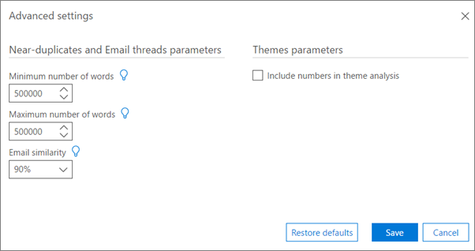

# 設定高級 eDiscovery 中的 [分析高級設定]

> [!NOTE]
> 進階電子文件探索需要具有進階合規性附加元件的 Office 365 E3，或適用於您組織的 E5 訂閱。如果您沒有該方案，且想要嘗試進階電子文件探索，您可以[註冊 Office 365 企業版 E5 試用版](https://go.microsoft.com/fwlink/p/?LinkID=698279)。 
  
Advanced eDiscovery 提供用於分析模組設定的預設高級參數。 下列程式說明可指定的設定。
  
1. 在 [ **準備 \> 分析 \> 設定** ] 索引標籤中，按一下頁面底部的 [ **高級設定** (]) 。 隨即顯示下列面板。 
    
    
  
2. 在 [ **臨近副本] 和 [電子郵件執行緒] 參數** 中，視需要選取下列各值：
    
  - **字數的最小數目**：不會將檔案送出以進行近乎重複的分析的字數下限。 
    
  - **字數上限**：不會將檔案送出至近期重複分析的字以上的最大數目。
    
  - **電子郵件相似性**：兩封電子郵件視為類似的最小 resemblance 層級。 值一定等於或大於檔相似性。 預設值為90%。
    
3. 在 [ **主題參數**] 中，選取 [ **包含在主題分析中的數位** ] 核取方塊，以在分析期間包含主題處理過程中的數位。 
    
4. 按一下 **[儲存]**。 
    
## 相關主題

[Office 365 進階電子文件探索 (傳統版)](office-365-advanced-ediscovery.md)
  
[瞭解檔相似性](understand-document-similarity-in-advanced-ediscovery.md)
  
[設定分析選項](set-analyze-options-in-advanced-ediscovery.md)
  
[設定忽略文字](set-ignore-text-in-advanced-ediscovery.md)
  
[查看分析結果](view-analyze-results-in-advanced-ediscovery.md)

