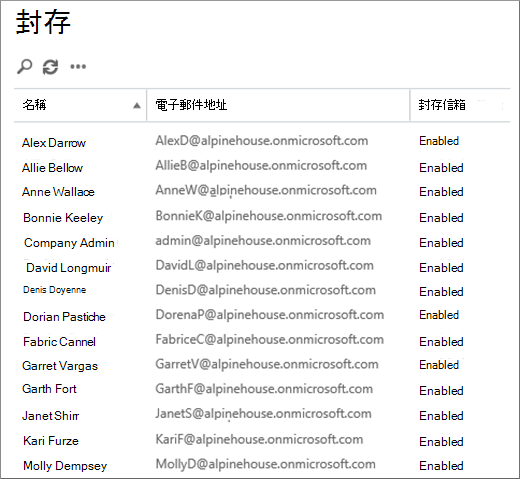
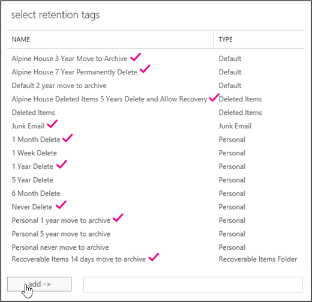

# <a name="set-up-an-archive-and-deletion-policy-for-mailboxes-in-your-organization"></a>設定組織中的信箱封存和刪除原則

 在 Microsoft 365 中，系統管理員可以建立封存和刪除原則，以自動將專案移至使用者的封存信箱，並自動刪除信箱中的專案。 系統管理員會建立指派給信箱的保留原則，並在一段時間後將專案移至使用者的封存信箱，並在達到特定保留時限後，刪除信箱中的郵件。 決定要移動或刪除哪些專案，以及發生該問題的實際規則稱為保留標記。 保留標記會連結到保留原則，而該保留原則又會指派給使用者的信箱。 保留標記會將保留設定套用至使用者信箱中的個別郵件和資料夾。 它會定義郵件保留在信箱中的時間長度，以及當郵件達到指定的保留時間時採取的動作。 當郵件到達保留天數時，它會移至使用者的封存信箱，或已被刪除。 
  
本文中的步驟會針對名為高山房屋的虛擬組織，設定封存和保留原則。 設定此原則包含下列工作：
  
- 為組織中的每位使用者啟用封存信箱。 這可讓使用者新增信箱儲存空間，並必須讓保留原則將專案移至封存信箱。 它也讓使用者將專案移至封存信箱，以儲存封存資訊。 
    
- 建立三個執行下列動作的自訂保留標記： 
    
  - 自動將3年以前的專案移至使用者的封存信箱。 將專案移至封存信箱可釋放使用者主要信箱中的空間。
    
  - 會自動從 [刪除的郵件] 資料夾中刪除5年以前的專案。 這樣也可釋放使用者主要信箱中的空間。 若有必要，使用者將有機會復原這些專案。 如需詳細資訊，請參閱[more information](#more-information)一節中的註腳。 
    
  - 自動（和永久）從主要和封存信箱中刪除7年以前的專案。 由於法規遵從性規定，某些組織必須在一段時間內保留電子郵件。 這個時段到期後，組織可能會想要永久移除這些專案使用者信箱。 
    
- 建立新的保留原則，並將新的自訂保留標記新增至其中。 此外，您也會將內建保留標記新增至新的保留原則。 這包括使用者可指派給其信箱中的專案的個人標記。 您也會新增保留標記，將使用者主要信箱中 [可復原的專案] 資料夾中的專案，移至其封存信箱中的 [可復原的專案] 資料夾。 這有助於在使用者的信箱處於保留狀態時，釋放使用者的 [可復原的專案] 資料夾中的空間。
    
您可以遵循本文中的部分或所有步驟，為您自己組織中的信箱設定封存和刪除原則。 建議您先在一些信箱上測試此程式，然後再對組織中的所有信箱執行這項程式。
  
## <a name="before-you-set-up-an-archive-and-deletion-policy"></a>在您設定封存與刪除原則之前

- 您必須是組織中的全域系統管理員，才可執行本主題中的步驟。 
    
-  當您建立新的使用者帳戶並指派 Exchange Online 授權給使用者時，系統會自動為使用者建立信箱。 建立信箱時，會自動將其指派為預設保留原則，名稱為 [預設 MRM 原則]。 在本文中，您將建立新的保留原則，然後將其指派給使用者信箱，取代預設的 MRM 原則。 一個信箱一次只能有一個指派給它的保留原則。
    
- 若要深入瞭解 Exchange Online 中的保留標記和保留原則，請參閱[保留標記和保留原則](https://go.microsoft.com/fwlink/p/?LinkId=404424)。
    
## <a name="step-1-enable-archive-mailboxes-for-users"></a>步驟1：啟用使用者的封存信箱

第一步是為組織中的每位使用者啟用封存信箱。 必須啟用使用者的封存信箱，這樣，具有「移至封存」保留動作的保留標記可以在保留天數到期後移動專案。 
  
> [!NOTE]
> 在此程式中，您可以隨時啟用封存信箱，只要在您完成此程式之前已經啟用封存信箱即可。 如果未啟用封存信箱，則不會對任何已指派封存原則的專案採取任何動作。 
  
1. 請移至 [https://protection.office.com](https://protection.office.com)。
    
2. 使用您的全域系統管理員帳戶登入。
    
    
3. 在 [安全性 & 規範中心] 中，移至 [**資訊管理**] 封存 \> ** **。
    
    您組織中的信箱清單會顯示，以及對應的封存信箱是啟用還是停用。 
    
4. 按一下清單中的第一個信箱，按住**Shift**鍵，然後按一下清單中的最後一個，以選取所有信箱。 
    
    > [!TIP]
    > 這個步驟假設未啟用任何封存信箱。 如果您有任何信箱啟用封存，請按住**Ctrl**鍵，然後按一下每個具有已停用封存信箱的信箱。 或者，您可以按一下 [封存**信箱**] 欄標頭，根據是否已啟用或停用封存信箱，來排序列，以簡化選取信箱。 
  
5. 在 [詳細資料] 窗格的 [**大量編輯**] 下，按一下 [**啟用**]。
    
    隨即顯示一則警告，指出超過兩年的專案會移至新的封存信箱。 這是因為建立新使用者信箱的預設保留原則，具有保留天數為2年的封存預設原則標記。 您將在步驟2中建立的自訂封存預設原則標記的保留天數為3年。 這表示3年或更舊的專案會移至封存信箱。
    
6. 按一下 **[是]** 以關閉警告訊息，並啟動此程式以啟用每個所選信箱的封存信箱。 
    
7. 當程式完成時 **，按一下**[重新整理]  以更新 [封存] **Archive**頁面上的清單。 
    
    組織中的所有使用者都可以啟用封存信箱。
    
    
  
8. 讓安全性 & 規範中心保持開啟狀態。 您會在下一個步驟中使用它。
    
## <a name="step-2-create-new-retention-tags-for-the-archive-and-deletion-policies"></a>步驟2：建立封存和刪除原則的新保留標記

在這個步驟中，您將建立先前所述的三個自訂保留標記。
  
- 高山房屋3年移至封存（自訂封存原則）
    
- 高山房屋7年永久刪除（自訂刪除原則）
    
- 高山房屋刪除的專案5年刪除並允許復原（「刪除的郵件」資料夾的自訂標記）
    
若要建立新的保留標記，您可以使用 Exchange Online 組織中的 Exchange 系統管理中心（EAC）。
  
1. 在 [安全性 & 規範中心] 中，按一下左上角的應用程式啟動器，然後按一下 [系統**管理**] 磚。 
    
2. 在 Microsoft 365 系統管理中心的左功能窗格中，按一下 [系統**管理中心**]，然後按一下 [ **Exchange**]。
    
    ![螢幕擷取畫面顯示在 [系統管理中心] 選項展開和 Exchange 選取的 Microsoft 365 系統管理中心。](../media/47399df2-0bc4-42e2-b183-07750a46bc68.png)
  
3. 在 EAC 中，移至 [**規範管理**] [ \> **保留標記**]
    
    隨即會顯示您組織的保留標記清單。
    
### <a name="create-a-custom-archive-default-policy-tag"></a>建立自訂封存預設原則標記
  
首先，您會建立自訂封存預設原則標記（DPT），將專案移至封存信箱的3年之後。 
  
1. 在 [**保留標記**] 頁面上，按一下 [**新增標記**] [ ![ 新增圖示] ](../media/457cd93f-22c2-4571-9f83-1b129bcfb58e.gif) ，然後選取 **[自動套用至整個信箱（預設值）**]。 
    
2. 在 [**自動套用到整個信箱（預設值）的新標記**上] 頁面上，完成下欄欄位： 
    
    
  
1. **名稱**輸入新保留標記的名稱。 
    
2. **保留動作**選取 [**移至**封存]，當保留期間到期時，將專案移至封存信箱。 
    
3. **保留期間**選取 **[專案何時到達下列時間（天）**]，然後輸入保留期間的持續時間。 在此案例中，會在1095天（3年）後將專案移至封存信箱。
    
4. **批註**（選用）輸入批註，以說明自訂保留標記的目的。 
    
3. 按一下 [**儲存**] 以建立自訂封存 DPT。 
    
    新的封存 DPT 會顯示在保留標記清單中。
    
### <a name="create-a-custom-deletion-default-policy-tag"></a>建立自訂刪除預設原則標記
  
接下來，您將建立另一個自訂 DPT，但這會是一個刪除原則，可在7年後永久刪除專案。
  
1. 在 [**保留標記**] 頁面上，按一下 [**新增標記**] [ ![ 新增圖示] ](../media/457cd93f-22c2-4571-9f83-1b129bcfb58e.gif) ，然後選取 **[自動套用至整個信箱（預設值）**]。 
    
2. 在 [**自動套用到整個信箱（預設值）的新標記**上] 頁面上，完成下欄欄位： 
    
    
  
1. **名稱**輸入新保留標記的名稱。 
    
2. **保留動作**選取 [**永久刪除**]，當保留期間到期時，清除信箱中的專案。 
    
3. **保留期間**選取 **[專案何時到達下列時間（天）**]，然後輸入保留期間的持續時間。 在此案例中，會在2555天（7年）後清除專案。
    
4. **批註**（選用）輸入批註，以說明自訂保留標記的目的。 
    
3. 按一下 [**儲存**] 以建立自訂刪除 DPT。 
    
    新的刪除 DPT 會顯示在保留標記清單中。
    
### <a name="create-a-custom-retention-policy-tag-for-the-deleted-items-folder"></a>為 [刪除的郵件] 資料夾建立自訂保留原則標記
  
您要建立的最後一個保留標記是「刪除的郵件」資料夾的自訂保留原則標記（RPT）。 這個標記會在5年後刪除 [刪除的郵件] 資料夾中的專案，並在使用者可以使用 [復原刪除的郵件] 工具來復原專案時，提供復原週期。
  
1. 在 [**保留標記**] 頁面上，按一下 [**新增標記**] [ ![ 新增圖示] ](../media/457cd93f-22c2-4571-9f83-1b129bcfb58e.gif) ，然後選取 [**自動套用至預設資料夾**]。 
    
2. 在 [**自動套用至預設資料夾**] 頁面上的 [新增標記] 中，完成下欄欄位： 
    
    ![為 [刪除的郵件] 資料夾建立新的保留原則標記的設定](../media/6f3104bd-5edb-48ac-884d-5fe13d81dd1d.png)
  
1. **名稱**輸入新保留標記的名稱。 
    
2. **將此標記套用至下列預設資料夾**在下拉式清單中，選取 [**刪除的專案**]。
    
3. **保留動作**在保留期間到期時，選取 [**刪除並允許**復原] 刪除專案，但是允許使用者在刪除的專案保留期間內復原刪除的專案（預設為14天）。 
    
4. **保留期間**選取 **[專案何時到達下列時間（天）**]，然後輸入保留期間的持續時間。 在此案例中，會在1825天（5年）之後刪除專案。
    
5. **批註**（選用）輸入批註，以說明自訂保留標記的目的。 
    
3. 按一下 [**儲存**]，以建立「刪除的郵件」資料夾的自訂 RPT。 
    
    新的 RPT 會顯示在保留標記清單中。

## <a name="step-3-create-a-new-retention-policy"></a>步驟3：建立新的保留原則

在您建立自訂保留標記之後，下一步是建立新的保留原則，並新增保留標記。 您將新增您在步驟2中建立的三個自訂保留標記，以及第一個區段中所述的內建標記。 在步驟4中，您會將此新的保留原則指派給使用者信箱。
  
1. 在 EAC 中，移至 [**規範管理**] [ \> **保留原則**]。
    
2. 在 [**保留原則**] 頁面上，按一下 [**新增** ![ 新圖示] ](../media/457cd93f-22c2-4571-9f83-1b129bcfb58e.gif) 。
    
3. 在 [**名稱**] 方塊中，輸入新保留原則的名稱;例如，**高山房屋封存和刪除原則**。 
    
4. 在 [**保留標記**] 底下 **，按一下 [** ![ 新增圖示] ](../media/457cd93f-22c2-4571-9f83-1b129bcfb58e.gif) 。
    
    您組織中的保留標記清單隨即顯示。 附注會顯示您在步驟2中建立的自訂標記。
    
5. 新增下列螢幕擷取畫面中已反白顯示的9保留標記（[詳細資訊](#more-information)一節將詳細說明這些標記）。 若要新增保留標記，請選取它，然後按一下 [**新增**]。 
    
    
  
    > [!TIP]
    > 您可以按住**Ctrl**鍵，然後按一下每個標記，以選取多個保留標記。 
  
6. 在您新增保留標記之後，請按一下 **[確定]**。
    
7. 在 [**新增保留原則**] 頁面上，按一下 [**儲存**] 以建立新的原則。 
    
    新的保留原則會顯示在清單中。 選取它，以在詳細資料窗格中顯示與其連結的保留標記。
    
    
  
## <a name="step-4-assign-the-new-retention-policy-to-user-mailboxes"></a>步驟4：將新的保留原則指派給使用者信箱

建立新的信箱時，預設會指派名為「預設 MRM 原則」的保留原則。 在這個步驟中，您會將您在步驟3中建立的新保留原則指派給組織中的使用者信箱，以取代此保留原則（因為信箱只能有一個指派的保留原則）。 這個步驟假設您要將新的原則指派給組織中的所有信箱。
  
1. 在 EAC 中，**移至 [** 收件者] [ \> **信箱**]。
    
    隨即會顯示您組織中所有使用者信箱的清單。 
    
2. 按一下清單中的第一個信箱，按住**Shift**鍵，然後按一下清單中的最後一個，以選取所有信箱。 
    
3. 在 EAC 右側的 [詳細資料] 窗格中，按一下 [**大量編輯**] 下的 [**其他選項**]。
    
4. 在 [保留原則]**** 下方，按一下 [更新]****。
    
5. 在 [**大量指派保留原則**] 頁面上，于 [**選取保留原則**] 下拉式清單中，選取您在步驟3中建立的保留原則;例如，**高山房屋封存和保留原則**。
    
6. 按一下 [**儲存**]，以儲存新的保留原則指派。 
    
7. 若要確認是否已將新的保留原則指派給信箱，您可以執行下列動作：在 [信箱] 頁面上選取信箱，然後按一下 [編輯]。 
    
1. 在 [**信箱**] 頁面上選取信箱，然後按一下 [**編輯** ![ 編輯] ](../media/d7dc7e5f-17a1-4eb9-b42d-487db59e2e21.png) 。 
    
2. 在選取之使用者的信箱屬性頁面上，按一下 [**信箱功能**]。
    
    指派給信箱的新原則名稱會顯示在 [**保留原則**] 下拉式清單中。 

## <a name="optional-step-5-run-the-managed-folder-assistant-to-apply-the-new-settings"></a>選步驟5：執行受管理的資料夾助理以套用新的設定

在步驟4中對信箱套用新的保留原則之後，最多可能需要7天的 Exchange Online 才能將新的保留設定套用至信箱。 這是因為稱為「受管理的資料夾助理」的處理常式每隔7天處理一次信箱。 您可以在 Exchange Online PowerShell 中執行**Start-ManagedFolderAssistant** Cmdlet，強制執行此動作，而不是等待受管理的資料夾助理執行。 
  
 **當您執行受管理的資料夾助理時會發生什麼情況？** 它會檢查信箱中的專案，並決定是否服從保留原則，以套用保留原則中的設定。 然後使用適當的保留標記來標記要保留的專案，然後對超過保留天數的專案採取指定的保留動作。 
  
以下是連接至 Exchange Online PowerShell 的步驟，然後在組織中的每個信箱上執行受管理的資料夾助理。

1. [連線至 Exchange Online PowerShell](https://go.microsoft.com/fwlink/p/?LinkId=517283)。
  
2. 執行下列兩個命令，以啟動組織中所有使用者信箱的受管理的資料夾助理。
    
    ```powershell
    $Mailboxes = Get-Mailbox -ResultSize Unlimited -Filter {RecipientTypeDetails -eq "UserMailbox"}
    ```

    ```powershell
    $Mailboxes.Identity | Start-ManagedFolderAssistant
    ```

這就對了！ 您已為高山房屋組織設定封存和刪除原則。
  
## <a name="optional-step-6-make-the-new-retention-policy-the-default-for-your-organization"></a>選步驟6：將新的保留原則設定為您組織的預設值

在步驟4中，您必須將新的保留原則指派給現有的信箱。 不過，您可以設定 Exchange Online，讓新的保留原則指派給未來建立的新信箱。 您可以使用 Exchange Online PowerShell 來更新組織的預設信箱計畫。 *信箱方案*是一種範本，可自動設定新信箱的屬性。  在此選用的步驟中，您可以使用您在步驟3中建立的保留原則，取代指派給信箱計畫的目前保留原則（預設為預設 MRM 原則）。 在您更新信箱計畫之後，新的保留原則將會指派給新的信箱。

1. [連線至 Exchange Online PowerShell](https://go.microsoft.com/fwlink/p/?LinkId=517283)。

2. 執行下列命令，以顯示組織中信箱計畫的相關資訊。

    ```powershell
    Get-MailboxPlan | Format-Table DisplayName,RetentionPolicy,IsDefault
    ```
    
    請注意設定為預設的信箱計畫。

3. 執行下列命令，將您在步驟3中建立的新保留原則（例如，**高山房屋封存和保留原則**）指派給預設的信箱計畫。 本範例假設預設信箱計畫的名稱是**ExchangeOnlineEnterprise**。

    ```powershell
    Set-MailboxPlan "ExchangeOnlineEnterprise" -RetentionPolicy "Alpine House Archive and Retention Policy"
    ```

4. 您可以在步驟2中重新執行命令，以驗證指派給預設信箱計畫的保留原則已變更。

## <a name="more-information"></a>詳細資訊

- 保留存留期的計算方式？ 信箱專案的保留天數會從傳遞日期或專案建立的日期開始計算，例如未傳送但由使用者建立的草稿郵件。 當受管理的資料夾助理員處理信箱中的項目時，它會針對其保留標記具有 [刪除並允許復原] 或 [永久刪除] 保留動作的所有項目，加上開始日期和到期日的戳記。 具有封存標籤的專案會以移動日期標記。 
    
- 下表提供使用本主題中的步驟所建立之每個保留標記的詳細資訊，其新增保留原則。
    
    |**保留標記**|**這個標記的功能**|**內建或自訂的？**|**類型**|
    |:-----|:-----|:-----|:-----|
    |高山房屋3年移至封存  <br/> |將1095天（3年）的專案移至封存信箱。  <br/> |自訂（請參閱[步驟2：建立封存和刪除原則的新保留標記](#step-2-create-new-retention-tags-for-the-archive-and-deletion-policies)）  <br/> |預設原則標記（封存）;這個標記會自動套用至整個信箱。  <br/> |
    |高山房屋7年（永久刪除）  <br/> |當主要信箱或封存信箱中的專案有七年後，永久刪除該信箱中的專案。  <br/> |自訂（請參閱[步驟2：建立封存和刪除原則的新保留標記](#step-2-create-new-retention-tags-for-the-archive-and-deletion-policies)）  <br/> |預設原則標記（刪除）;這個標記會自動套用至整個信箱。  <br/> |
    |高山房屋刪除的專案5年刪除並允許復原  <br/> |會刪除5歲的「刪除的郵件」資料夾中的專案。 使用者可在刪除後的14天內復原這些專案。<sup>\*</sup> <br/> |自訂（請參閱[步驟2：建立封存和刪除原則的新保留標記](#step-2-create-new-retention-tags-for-the-archive-and-deletion-policies)）  <br/> |保留原則標記（刪除的專案）;這個標記會自動套用至 [刪除的郵件] 資料夾中的專案。  <br/> |
    |可復原的專案14天移至封存  <br/> |將 [可復原的專案] 資料夾中的專案，移至封存信箱中的 [可復原的專案] 資料夾14天。  <br/> |內建  <br/> |保留原則標記（可復原的專案）;這個標記會自動套用至 [可復原的專案] 資料夾中的專案。  <br/> |
    |垃圾郵件  <br/> |永久刪除 [垃圾郵件] 資料夾中30天內的專案。 使用者可在刪除後的14天內復原這些專案。<sup>\*</sup> <br/> |內建  <br/> |保留原則標記（垃圾郵件）;這個標記會自動套用至 [垃圾郵件] 資料夾中的專案。  <br/> |
    |1 個月刪除  <br/> |永久刪除30天的專案。 使用者可在刪除後的14天內復原這些專案。<sup>\*</sup> <br/> |內建  <br/> |自己使用者可以套用此標記。  <br/> |
    |1 年刪除  <br/> |永久刪除365天內的專案。 使用者可在刪除後的14天內復原這些專案。<sup>\*</sup> <br/> |內建  <br/> |自己使用者可以套用此標記。  <br/> |
    |永不刪除  <br/> |此標記會防止保留原則刪除專案。  <br/> |內建  <br/> |自己使用者可以套用此標記。  <br/> |
    |個人 1 年移至封存  <br/> |在1年後將專案移至封存信箱。  <br/> |內建  <br/> |自己使用者可以套用此標記。  <br/> |
   
    > <sup>\*</sup>使用者可以使用 Outlook 和網頁版 Outlook （先前稱為 Outlook Web App）中的 [復原刪除的專案] 工具，在已刪除專案的保留期間內復原已刪除的專案，在 Exchange Online 中，預設為14天。 系統管理員可以使用 Windows PowerShell 將刪除的專案保留期間增加至最長30天。 如需詳細資訊，請參閱：[復原 Windows Outlook 中已刪除的郵件](https://support.office.com/article/49e81f3c-c8f4-4426-a0b9-c0fd751d48ce)，以及[變更 Exchange Online 中信箱的已刪除專案保留期間](https://www.microsoft.com/?ref=go)
  
- 使用**可復原的專案14天移至**封存保留標記有助於在使用者主要信箱的 [可復原的專案] 資料夾中釋放儲存空間。 當使用者的信箱處於保留狀態時，這是很有用的，這表示永遠不會永久刪除使用者的信箱。 在不將專案移至封存信箱時，可能會到達主要信箱中 [可復原的專案] 資料夾的儲存配額。 如需這項功能及其避免方式的詳細資訊，請參閱[增加保留信箱的可復原專案配額](https://go.microsoft.com/fwlink/p/?LinkId=786479)。
