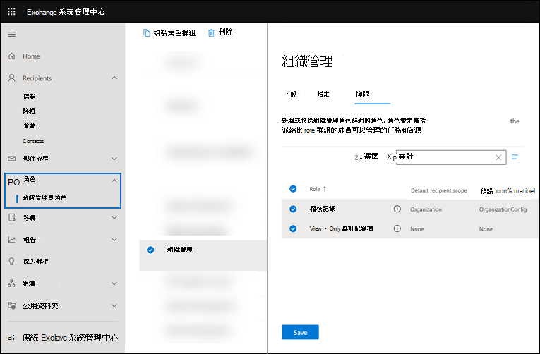

# 在 Microsoft 365 中設定基本審核

Microsoft 365 的基本審核可讓您搜尋使用者和系統管理員在不同 Microsoft 365 服務中執行之活動的審計記錄。 因為對於大多數的 Microsoft 365 和 Office 365 組織而言，預設會啟用基本審核，所以組織中的其他人可以搜尋審核記錄之前，只需要做一些事情。

本文討論設定基本審核所需的下列步驟。

這些步驟包括確定適當的組織訂閱和使用者授權，以產生及保留審計記錄，並將安全性作業、IT、規範和法律團隊的許可權指派給小組成員，以便搜尋審核記錄。

如需詳細資訊，請參閱[Microsoft 365 中的基本審核](auditing-solutions-overview.md#basic-auditing)。

## 步驟1：確認組織訂閱和使用者授權

授權進行基本審核需要適當的組織訂閱，以提供記錄及保留審計記錄所需之審核記錄搜尋工具和每個使用者授權的存取權。

當使用者或系統管理員執行稽核的活動時，稽核記錄會隨即產生，並儲存在您組織的稽核記錄中。 在基本審核中，審計記錄會保留在90天的審計記錄中並可供搜尋。

如需基本審核的訂閱與授權需求清單，請參閱[Microsoft 365 中的審計方案](auditing-solutions-overview.md#licensing-requirements)。

## 步驟2：指派許可權以搜尋審核記錄

管理員和調查小組成員必須獲 Exchange Online 中的「View-Only 審計記錄」或「審計記錄」角色，才可搜尋審計記錄。 根據預設，這些角色會在 Exchange 系統管理員中心的 **[權限]** 頁面上，指派給 [法務遵循管理] 和 [組織管理] 角色群組。 Office 365 和 Microsoft 365 中的全域系統管理員會自動新增為 Exchange Online 中的「組織管理」角色群組的成員。 若要提供讓使用者能夠搜尋稽核記錄的最低權限等級，您可以在 Exchange Online 中建立自訂角色群組、新增 [僅限檢視稽核記錄] 或 [稽核記錄] 角色，然後將使用者加入這個新的角色群組成為其中的成員。 如需詳細資訊，請參閱[管理 Exchange Online 中的角色群組](/Exchange/permissions-exo/role-groups)。

下列螢幕擷取畫面顯示在 Exchange 系統管理中心中指派給組織管理角色群組的兩個與審核相關的角色。

## 步驟3：搜尋審核記錄檔

現在，您已準備好在 Microsoft 365 規範中心搜尋審核記錄。

1. 移至 <https://compliance.microsoft.com> 並使用已獲指派適當的「審核」許可權的帳戶登入。

2. 在 Microsoft 365 規範中心的左功能窗格中，按一下 [**全部顯示**]，然後按一下 [**審計**]。

3. 在 [ **審計** ] 頁面上的 [ **搜尋] 索引** 標籤上，使用下列條件設定搜尋。 

   

   1. **日期和時間範圍**。 選取日期和時間範圍，以顯示該期間內已發生的事件。 日期和時間以當地時間顯示。 預設會選取最後七天。
  
   2. **活動**。 選取要搜尋的活動。 使用 [搜尋] 方塊來搜尋要新增至清單的活動。 如需已審核活動的部分清單，請參閱已 [審核的活動](search-the-audit-log-in-security-and-compliance.md#audited-activities)。 將此方塊保留空白可傳回所有已審核活動的專案。
  
   3. **使用者**。  在此方塊中按一下並開始輸入使用者名稱，以顯示的搜尋結果。 您在此方塊中選取之使用者執行之選取活動的「審計記錄專案」會顯示在結果清單中。 若要傳回貴組織中所有使用者 (及服務帳戶) 的項目，請將此方塊保留空白。
  
   4. **檔、資料夾或網站**。 輸入部分或所有檔案或資料夾名稱，以搜尋與包含指定關鍵字之資料夾檔案相關的活動。 您也可以指定檔案或資料夾的 URL。 如果您使用的是檔案或資料夾的 URL，請確定輸入完整的 URL 路徑，或者，如果您輸入 URL 的一部分，請勿包含任何特殊字元或空格。 若要傳回貴組織中所有檔案和資料夾的項目，請將此方塊保留空白。

4. 按一下 [ **搜尋** ] 以執行搜尋。

顯示 [正在執行審核記錄] 搜尋的新頁面。 當搜尋完成時，就會在頁面上顯示審計記錄。 按一下記錄以顯示具有詳細內容的飛出頁面。

如需詳細指示，請參閱 [在規範中心搜尋審核記錄](search-the-audit-log-in-security-and-compliance.md)檔。
