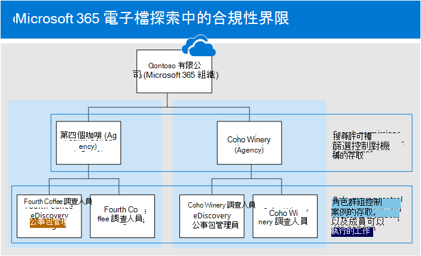
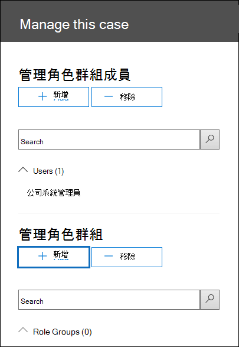

# <a name="set-up-compliance-boundaries-for-ediscovery-investigations"></a><span data-ttu-id="b61f5-103">設定 eDiscovery 調查的合規性界限</span><span class="sxs-lookup"><span data-stu-id="b61f5-103">Set up compliance boundaries for eDiscovery investigations</span></span>

<span data-ttu-id="b61f5-104">使用核心 eDiscovery 或高級 eDiscovery 來管理調查時，可以套用本文中的指導方針。</span><span class="sxs-lookup"><span data-stu-id="b61f5-104">The guidance in this article can be applied when using either Core eDiscovery or Advanced eDiscovery to manage investigations.</span></span>

<span data-ttu-id="b61f5-105">規範界限會在組織內建立邏輯界限，以控制使用者內容位置 (例如，可 eDiscovery 管理員可搜尋的信箱、SharePoint 網站和 OneDrive 帳戶) 。</span><span class="sxs-lookup"><span data-stu-id="b61f5-105">Compliance boundaries create logical boundaries within an organization that control the user content locations (such as mailboxes, SharePoint sites, and OneDrive accounts) that eDiscovery managers can search.</span></span> <span data-ttu-id="b61f5-106">此外，合規性界限控制誰可以存取 eDiscovery 案例，以用於管理組織內的法律、人力資源或其他調查。</span><span class="sxs-lookup"><span data-stu-id="b61f5-106">Also, compliance boundaries control who can access eDiscovery cases used to manage the legal, human resources, or other investigations within your organization.</span></span> <span data-ttu-id="b61f5-107">對於必須遵守地理 boarders 及法規及政府（通常分為不同的代理商）的跨國公司，必須使用規範界限。</span><span class="sxs-lookup"><span data-stu-id="b61f5-107">The need for compliance boundaries is often necessary for multi-national corporations that have to respect geographical boarders and regulations and for governments, which are often divided into different agencies.</span></span> <span data-ttu-id="b61f5-108">在 Microsoft 365 中，相容性界限可協助您在使用 eDiscovery 案例執行內容搜尋及管理調查時符合這些需求。</span><span class="sxs-lookup"><span data-stu-id="b61f5-108">In Microsoft 365, compliance boundaries help you meet these requirements when performing content searches and managing investigations with eDiscovery cases.</span></span>
  
<span data-ttu-id="b61f5-109">我們會使用下圖中的範例，說明規範界限的運作方式。</span><span class="sxs-lookup"><span data-stu-id="b61f5-109">We use the example in the following illustration to explain how compliance boundaries work.</span></span>
  

  
<span data-ttu-id="b61f5-111">在此範例中，Contoso 有限公司是由兩個分公司、第四個咖啡和 Coho Winery 所組成的組織。</span><span class="sxs-lookup"><span data-stu-id="b61f5-111">In this example, Contoso LTD is an organization that consists of two subsidiaries, Fourth Coffee and Coho Winery.</span></span> <span data-ttu-id="b61f5-112">業務要求 eDiscovery mangers 和調查人員只能在其代理人中搜尋 Exchange 信箱、OneDrive 帳戶及 SharePoint 網站。</span><span class="sxs-lookup"><span data-stu-id="b61f5-112">The business requires that eDiscovery mangers and investigators can only search the Exchange mailboxes, OneDrive accounts, and SharePoint sites in their agency.</span></span> <span data-ttu-id="b61f5-113">此外，eDiscovery 管理員和調查人員只會查看其代理人中的 eDiscovery 案例，而且只能存取他們隸屬的案例。</span><span class="sxs-lookup"><span data-stu-id="b61f5-113">Also, eDiscovery managers and investigators can only see eDiscovery cases in their agency, and they can only access the cases that they're a member of.</span></span> <span data-ttu-id="b61f5-114">以下是規範界限如何符合這些需求。</span><span class="sxs-lookup"><span data-stu-id="b61f5-114">Here's how compliance boundaries meet these requirements.</span></span>
  
- <span data-ttu-id="b61f5-115">內容搜尋中的搜尋許可權篩選功能會控制 eDiscovery 管理員和調查人員可搜尋的內容位置。</span><span class="sxs-lookup"><span data-stu-id="b61f5-115">The search permissions filtering functionality in Content Search controls the content locations that eDiscovery managers and investigators can search.</span></span> <span data-ttu-id="b61f5-116">這表示第四個咖啡機關中的 eDiscovery 管理員和調查人員，只能在第四個咖啡店中搜尋內容位置。</span><span class="sxs-lookup"><span data-stu-id="b61f5-116">This means eDiscovery managers and investigators in the Fourth Coffee agency can only search content locations in the Fourth Coffee subsidiary.</span></span> <span data-ttu-id="b61f5-117">這種限制適用于 Coho Winery 子公司。</span><span class="sxs-lookup"><span data-stu-id="b61f5-117">The same restriction applies to the Coho Winery subsidiary.</span></span>

    <span data-ttu-id="b61f5-118">角色群組控制誰可以查看安全性 & 合規性中心內的 eDiscovery 案例。</span><span class="sxs-lookup"><span data-stu-id="b61f5-118">Role groups control who can see the eDiscovery cases in the Security & Compliance Center.</span></span> <span data-ttu-id="b61f5-119">這表示 eDiscovery 管理員和調查人員只能查看其代理人中的 eDiscovery 案例。</span><span class="sxs-lookup"><span data-stu-id="b61f5-119">This means that eDiscovery managers and investigators can only see the eDiscovery cases in their agency.</span></span>

- <span data-ttu-id="b61f5-120">角色群組也會控制誰可以指派成員至 eDiscovery 案例。</span><span class="sxs-lookup"><span data-stu-id="b61f5-120">Role groups also control who can assign members to an eDiscovery case.</span></span> <span data-ttu-id="b61f5-121">這表示 eDiscovery 管理員和調查人員只能將成員指派給他們本身是其成員的情況。</span><span class="sxs-lookup"><span data-stu-id="b61f5-121">This means eDiscovery managers and investigators can only assign members to cases that they themselves are a member of.</span></span>

<span data-ttu-id="b61f5-122">以下是設定規范界限的程式：</span><span class="sxs-lookup"><span data-stu-id="b61f5-122">Here's the process for setting up compliance boundaries:</span></span>
  
[<span data-ttu-id="b61f5-123">步驟1：識別使用者屬性以定義您的機構</span><span class="sxs-lookup"><span data-stu-id="b61f5-123">Step 1: Identify a user attribute to define your agencies</span></span>](#step-1-identify-a-user-attribute-to-define-your-agencies)

[<span data-ttu-id="b61f5-124">步驟2：以 Microsoft 支援檔作為要求來同步處理使用者屬性與 OneDrive 帳戶</span><span class="sxs-lookup"><span data-stu-id="b61f5-124">Step 2: File a request with Microsoft Support to synchronize the user attribute to OneDrive accounts</span></span>](#step-2-file-a-request-with-microsoft-support-to-synchronize-the-user-attribute-to-onedrive-accounts)

[<span data-ttu-id="b61f5-125">步驟3：建立每個代理人的角色群組</span><span class="sxs-lookup"><span data-stu-id="b61f5-125">Step 3: Create a role group for each agency</span></span>](#step-3-create-a-role-group-for-each-agency)

[<span data-ttu-id="b61f5-126">步驟4：建立搜尋許可權篩選以強制執行規范界限</span><span class="sxs-lookup"><span data-stu-id="b61f5-126">Step 4: Create a search permissions filter to enforce the compliance boundary</span></span>](#step-4-create-a-search-permissions-filter-to-enforce-the-compliance-boundary)

[<span data-ttu-id="b61f5-127">步驟5：建立內部公司調查的 eDiscovery 案例</span><span class="sxs-lookup"><span data-stu-id="b61f5-127">Step 5: Create an eDiscovery case for an intra-agency investigations</span></span>](#step-5-create-an-ediscovery-case-for-intra-agency-investigations)

## <a name="step-1-identify-a-user-attribute-to-define-your-agencies"></a><span data-ttu-id="b61f5-128">步驟1：識別使用者屬性以定義您的機構</span><span class="sxs-lookup"><span data-stu-id="b61f5-128">Step 1: Identify a user attribute to define your agencies</span></span>

<span data-ttu-id="b61f5-129">第一步是選擇要使用的 Azure Active Directory 屬性，以定義您的機構。</span><span class="sxs-lookup"><span data-stu-id="b61f5-129">The first step is to choose an Azure Active Directory attribute to use that will define your agencies.</span></span> <span data-ttu-id="b61f5-130">此屬性是用來建立「搜尋許可權」篩選，它會限制 eDiscovery 管理員只搜尋指派此屬性之特定值之使用者的內容位置。</span><span class="sxs-lookup"><span data-stu-id="b61f5-130">This attribute is used to create the search permissions filter that limits an eDiscovery manager to search only the content locations of users who are assigned a specific value for this attribute.</span></span> <span data-ttu-id="b61f5-131">例如，假設 Contoso 決定使用 [ **部門** ] 屬性。</span><span class="sxs-lookup"><span data-stu-id="b61f5-131">For example, let's say Contoso decides to use the **Department** attribute.</span></span> <span data-ttu-id="b61f5-132">此屬性的值為第四個咖啡分公司中的使用者，則為  `FourthCoffee`  Coho Winery 子公司中的使用者的值 `CohoWinery` 。</span><span class="sxs-lookup"><span data-stu-id="b61f5-132">The value for this attribute for users in the Fourth Coffee subsidiary would be  `FourthCoffee`  and the value for users in Coho Winery subsidiary would be `CohoWinery`.</span></span> <span data-ttu-id="b61f5-133">在步驟4中，您可以使用這一  `attribute:value`  對 (例如， *部門： FourthCoffee*) 來限制 eDiscovery 管理員可搜尋的使用者內容位置。</span><span class="sxs-lookup"><span data-stu-id="b61f5-133">In Step 4, you use this  `attribute:value`  pair (for example, *Department:FourthCoffee*) to limit the user content locations that eDiscovery managers can search.</span></span> 
  
<span data-ttu-id="b61f5-134">以下是 Azure Active Directory 使用者屬性的清單，您可以用於符合性界限：</span><span class="sxs-lookup"><span data-stu-id="b61f5-134">Here's a list of Azure Active Directory user attributes that you can use for compliance boundaries:</span></span>
  
- <span data-ttu-id="b61f5-135">Company</span><span class="sxs-lookup"><span data-stu-id="b61f5-135">Company</span></span>

- <span data-ttu-id="b61f5-136">CustomAttribute1 CustomAttribute15</span><span class="sxs-lookup"><span data-stu-id="b61f5-136">CustomAttribute1 - CustomAttribute15</span></span>

- <span data-ttu-id="b61f5-137">部門</span><span class="sxs-lookup"><span data-stu-id="b61f5-137">Department</span></span>

- <span data-ttu-id="b61f5-138">辦公室</span><span class="sxs-lookup"><span data-stu-id="b61f5-138">Office</span></span>

- <span data-ttu-id="b61f5-139">C (兩個字母的國家代碼) </span><span class="sxs-lookup"><span data-stu-id="b61f5-139">C (Two letter Country Code)</span></span>

<span data-ttu-id="b61f5-140">雖然有其他使用者屬性可供使用（特別是針對 Exchange 信箱），但以上所列的屬性是目前 OneDrive 支援的屬性。</span><span class="sxs-lookup"><span data-stu-id="b61f5-140">Although more user attributes are available, particularly for Exchange mailboxes, the attributes listed above are the only ones currently supported by OneDrive.</span></span>
  
## <a name="step-2-file-a-request-with-microsoft-support-to-synchronize-the-user-attribute-to-onedrive-accounts"></a><span data-ttu-id="b61f5-141">步驟2：以 Microsoft 支援檔作為要求來同步處理使用者屬性與 OneDrive 帳戶</span><span class="sxs-lookup"><span data-stu-id="b61f5-141">Step 2: File a request with Microsoft Support to synchronize the user attribute to OneDrive accounts</span></span>

<span data-ttu-id="b61f5-142">下一步是以 Microsoft 支援檔為要求，將您在步驟1中所選擇的 Azure Active Directory 屬性同步處理至組織中的所有 OneDrive 帳戶。</span><span class="sxs-lookup"><span data-stu-id="b61f5-142">The next step is to file a request with Microsoft Support to synchronize the Azure Active Directory attribute that you chose in Step 1 to all OneDrive accounts in your organization.</span></span> <span data-ttu-id="b61f5-143">進行此同步處理之後，您在步驟1中所選擇的屬性 (及其值) 會對應至名為的隱藏 managed 屬性 `ComplianceAttribute` 。</span><span class="sxs-lookup"><span data-stu-id="b61f5-143">After this synchronization occurs, the attribute (and its value) that you chose in Step 1 will be mapped to a hidden managed property named `ComplianceAttribute`.</span></span> <span data-ttu-id="b61f5-144">您可以在步驟4中使用此屬性為 OneDrive 建立搜尋許可權篩選。</span><span class="sxs-lookup"><span data-stu-id="b61f5-144">You use this attribute to create the search permissions filter for OneDrive in Step 4.</span></span>
  
<span data-ttu-id="b61f5-145">當您將要求提交給 Microsoft 支援時包含下列資訊：</span><span class="sxs-lookup"><span data-stu-id="b61f5-145">Include the following information when you submit the request to Microsoft support:</span></span>
  
- <span data-ttu-id="b61f5-146">組織的預設網功能變數名稱稱</span><span class="sxs-lookup"><span data-stu-id="b61f5-146">The default domain name of your organization</span></span>

- <span data-ttu-id="b61f5-147">步驟1中 (的 Azure Active Directory 屬性名稱) </span><span class="sxs-lookup"><span data-stu-id="b61f5-147">The name of the Azure Active Directory attribute (from Step 1)</span></span>

- <span data-ttu-id="b61f5-148">以下是支援要求目的的標題或描述：「啟用相容性安全性篩選器的商務同步處理與 Azure Active Directory 的 OneDrive。</span><span class="sxs-lookup"><span data-stu-id="b61f5-148">The following title or description of the purpose of the support request: "Enable OneDrive for Business Synchronization with Azure Active Directory for Compliance Security Filters".</span></span> <span data-ttu-id="b61f5-149">這有助於將要求路由傳送至實現要求的 eDiscovery 工程團隊。</span><span class="sxs-lookup"><span data-stu-id="b61f5-149">This helps route the request to the eDiscovery engineering team who implements the request.</span></span>

<span data-ttu-id="b61f5-150">在進行工程變更，並將屬性同步處理至 OneDrive 後，Microsoft 支援將會向您傳送所做變更的組建編號，以及預估的部署日期。</span><span class="sxs-lookup"><span data-stu-id="b61f5-150">After the engineering change is made and the attribute is synchronized to OneDrive, Microsoft Support will send you the build number that the change was made in and an estimated deployment date.</span></span> <span data-ttu-id="b61f5-151">在您提交支援要求後，部署程式通常需要4–6周。</span><span class="sxs-lookup"><span data-stu-id="b61f5-151">The deployment process usually takes 4–6 weeks after you submit the support request.</span></span>
  
> [!IMPORTANT]
> <span data-ttu-id="b61f5-152">您可以在部署此屬性變更之前，先完成步驟3到步驟5。</span><span class="sxs-lookup"><span data-stu-id="b61f5-152">You can complete Step 3 through Step 5 before this attribute change is deployed.</span></span> <span data-ttu-id="b61f5-153">但是執行內容搜尋時，將不會從搜尋許可權篩選中指定的 OneDrive 網站傳回檔，直到部署變更為止。</span><span class="sxs-lookup"><span data-stu-id="b61f5-153">But running content searches won't return documents from OneDrive sites specified in the search permissions filter until after the change is deployed.</span></span>
  
## <a name="step-3-create-a-role-group-for-each-agency"></a><span data-ttu-id="b61f5-154">步驟3：建立每個代理人的角色群組</span><span class="sxs-lookup"><span data-stu-id="b61f5-154">Step 3: Create a role group for each agency</span></span>

<span data-ttu-id="b61f5-155">下一步是在安全性 & 規範中心建立角色群組，以與您的機構相符。</span><span class="sxs-lookup"><span data-stu-id="b61f5-155">The next step is to create the role groups in the Security & Compliance Center that will align with your agencies.</span></span> <span data-ttu-id="b61f5-156">建議您在建立角色群組時，您可以複製內建的 eDiscovery 管理員群組、新增適當的成員，以及移除可能不適合您需求的角色。</span><span class="sxs-lookup"><span data-stu-id="b61f5-156">We recommend that you create a role group by copying the built-in eDiscovery Managers group, adding the appropriate members, and removing roles that may not be applicable to your needs.</span></span> <span data-ttu-id="b61f5-157">如需有關 eDiscovery 相關角色的詳細資訊，請參閱 [在 Office 365 Security & 合規性中心指派 eDiscovery 許可權](assign-ediscovery-permissions.md)。</span><span class="sxs-lookup"><span data-stu-id="b61f5-157">For more information about eDiscovery-related roles, see [Assign eDiscovery permissions in the Office‍ 365 Security & Compliance Center](assign-ediscovery-permissions.md).</span></span>
  
<span data-ttu-id="b61f5-158">若要建立角色群組，請移至 [安全性 & 規範中心] 中的 [ **許可權** ] 頁面，為每個代理人中每個小組建立角色群組，以使用規範界限和 eDiscovery 案例來管理調查。</span><span class="sxs-lookup"><span data-stu-id="b61f5-158">To create the role groups, go to the **Permissions** page in the Security & Compliance Center and create a role group for each team in each agency that will use compliance boundaries and eDiscovery cases to manage investigations.</span></span> 
  
<span data-ttu-id="b61f5-159">使用 Contoso 相容性邊界案例，必須建立四個角色群組，並將適當的成員新增至每一個群組。</span><span class="sxs-lookup"><span data-stu-id="b61f5-159">Using the Contoso compliance boundaries scenario, four role groups need to be created and the appropriate members added to each one.</span></span>
  
- <span data-ttu-id="b61f5-160">第四個咖啡 eDiscovery 管理員</span><span class="sxs-lookup"><span data-stu-id="b61f5-160">Fourth Coffee eDiscovery Managers</span></span>

- <span data-ttu-id="b61f5-161">第四個咖啡調查人員</span><span class="sxs-lookup"><span data-stu-id="b61f5-161">Fourth Coffee Investigators</span></span>

- <span data-ttu-id="b61f5-162">Coho Winery eDiscovery 管理員</span><span class="sxs-lookup"><span data-stu-id="b61f5-162">Coho Winery eDiscovery Managers</span></span>

- <span data-ttu-id="b61f5-163">Coho Winery 調查人員</span><span class="sxs-lookup"><span data-stu-id="b61f5-163">Coho Winery Investigators</span></span>
  
## <a name="step-4-create-a-search-permissions-filter-to-enforce-the-compliance-boundary"></a><span data-ttu-id="b61f5-164">步驟4：建立搜尋許可權篩選以強制執行規范界限</span><span class="sxs-lookup"><span data-stu-id="b61f5-164">Step 4: Create a search permissions filter to enforce the compliance boundary</span></span>

<span data-ttu-id="b61f5-165">在您為每個代理商建立角色群組之後，下一步是建立搜尋許可權篩選器，將每個角色群組關聯至特定的代理人，並定義規範界限本身。</span><span class="sxs-lookup"><span data-stu-id="b61f5-165">After you've created role groups for each agency, the next step is to create the search permissions filters that associate each role group to its specific agency and defines the compliance boundary itself.</span></span> <span data-ttu-id="b61f5-166">您必須為每個代理人建立一個搜尋許可權篩選。</span><span class="sxs-lookup"><span data-stu-id="b61f5-166">You need to create one search permissions filter for each agency.</span></span> <span data-ttu-id="b61f5-167">如需建立安全性許可權篩選的詳細資訊，請參閱 [設定內容搜尋的許可權篩選](permissions-filtering-for-content-search.md)。</span><span class="sxs-lookup"><span data-stu-id="b61f5-167">For more information about creating security permissions filters, see [Configure permissions filtering for Content Search](permissions-filtering-for-content-search.md).</span></span>
  
<span data-ttu-id="b61f5-168">以下是用來建立搜尋許可權篩選以用於規範界限的語法。</span><span class="sxs-lookup"><span data-stu-id="b61f5-168">Here's the syntax that's used to create a search permissions filter used for compliance boundaries.</span></span>

```powershell
New-ComplianceSecurityFilter -FilterName <name of filter> -Users <role groups> -Filters "Mailbox_<ComplianceAttribute>  -eq '<AttributeVale> '", "Site_<ComplianceAttribute>  -eq '<AttributeValue>' -or Site_Path -like '<SharePointURL>*'" -Action <Action >
```

<span data-ttu-id="b61f5-169">以下是命令中每個參數的描述：</span><span class="sxs-lookup"><span data-stu-id="b61f5-169">Here's a description of each parameter in the command:</span></span>
  
- <span data-ttu-id="b61f5-170">`FilterName`：指定篩選器的名稱。</span><span class="sxs-lookup"><span data-stu-id="b61f5-170">`FilterName`: Specifies the name of the filter.</span></span> <span data-ttu-id="b61f5-171">使用描述或識別篩選所用的代理人的名稱。</span><span class="sxs-lookup"><span data-stu-id="b61f5-171">Use a name that describes or identifies the agency that the filter is used in.</span></span>

- <span data-ttu-id="b61f5-172">`Users`：指定套用此篩選器的使用者或群組，這些使用者或群組會套用到其執行的內容搜尋動作。</span><span class="sxs-lookup"><span data-stu-id="b61f5-172">`Users`: Specifies the users or groups who get this filter applied to the Content Search actions they perform.</span></span> <span data-ttu-id="b61f5-173">針對相容性界限，此參數會指定您在建立篩選的代理人中，您在步驟 3) 中所建立的角色群組 (。</span><span class="sxs-lookup"><span data-stu-id="b61f5-173">For compliance boundaries, this parameter specifies the role groups (that you created in Step 3) in the agency that you're creating the filter for.</span></span> <span data-ttu-id="b61f5-174">附注這是多重值參數，因此您可以包含一或多個角色群組，以逗號分隔。</span><span class="sxs-lookup"><span data-stu-id="b61f5-174">Note this is a multi-value parameter so you can include one or more role groups, separated by commas.</span></span>

- <span data-ttu-id="b61f5-175">`Filters`：指定篩選的搜尋準則。</span><span class="sxs-lookup"><span data-stu-id="b61f5-175">`Filters`: Specifies the search criteria for the filter.</span></span> <span data-ttu-id="b61f5-176">針對規範界限，您可以定義下列篩選器。</span><span class="sxs-lookup"><span data-stu-id="b61f5-176">For the compliance boundaries, you define the following filters.</span></span> <span data-ttu-id="b61f5-177">每個套用至內容位置。</span><span class="sxs-lookup"><span data-stu-id="b61f5-177">Each one applies to a content location.</span></span> 

    - <span data-ttu-id="b61f5-178">`Mailbox`：指定參數中定義的角色群組  `Users` 可以搜尋的信箱。</span><span class="sxs-lookup"><span data-stu-id="b61f5-178">`Mailbox`: Specifies the mailboxes that the role groups defined in the  `Users` parameter can search.</span></span> <span data-ttu-id="b61f5-179">針對符合性界限，  *ComplianceAttribute*  是您在步驟1中識別的相同屬性，而  *AttributeValue*  會指定該代理人。</span><span class="sxs-lookup"><span data-stu-id="b61f5-179">For compliance boundaries,  *ComplianceAttribute*  is the same attribute that you identified in Step 1 and  *AttributeValue*  specifies the agency.</span></span> <span data-ttu-id="b61f5-180">此篩選器允許角色群組的成員只搜尋特定機構中的信箱。例如， `"Mailbox_Department -eq 'FourthCoffee'"` 。</span><span class="sxs-lookup"><span data-stu-id="b61f5-180">This filter allows members of the role group to search only the mailboxes in a specific agency; for example, `"Mailbox_Department -eq 'FourthCoffee'"`.</span></span> 

    - <span data-ttu-id="b61f5-181">`Site`：指定參數中定義的角色群組可以搜尋的 OneDrive 帳戶 `Users` 。</span><span class="sxs-lookup"><span data-stu-id="b61f5-181">`Site`: Specifies the OneDrive accounts that the role groups defined in the `Users` parameter can search.</span></span> <span data-ttu-id="b61f5-182">若為 OneDrive 篩選，請使用實際的字串  `ComplianceAttribute` 。</span><span class="sxs-lookup"><span data-stu-id="b61f5-182">For the OneDrive filter, use the actual string  `ComplianceAttribute`.</span></span> <span data-ttu-id="b61f5-183">這會對應至您在步驟1中所識別的相同屬性，而該屬性會因您在步驟2中提交的支援要求而同步處理至 OneDrive 帳戶; *AttributeValue*  指定的代理人。</span><span class="sxs-lookup"><span data-stu-id="b61f5-183">This maps to the same attribute that you identified in Step 1 and that's synchronized to OneDrive accounts as a result of the support request that you submitted in Step 2; *AttributeValue*  specifies the agency.</span></span> <span data-ttu-id="b61f5-184">此篩選器允許角色群組的成員只搜尋特定機構內的 OneDrive 帳戶;例如，  `"Site_ComplianceAttribute -eq 'FourthCoffee'"` 。</span><span class="sxs-lookup"><span data-stu-id="b61f5-184">This filter allows members of the role group to search only the OneDrive accounts in a specific agency; for example,  `"Site_ComplianceAttribute -eq 'FourthCoffee'"`.</span></span>

    - <span data-ttu-id="b61f5-185">`Site_Path`：指定參數中定義的角色群組  `Users` 可以進行搜尋的 SharePoint 網站。</span><span class="sxs-lookup"><span data-stu-id="b61f5-185">`Site_Path`: Specifies the SharePoint sites that the role groups defined in the  `Users` parameter can search.</span></span> <span data-ttu-id="b61f5-186">*SharePointURL*會指定該角色群組的成員可以搜尋的代理人中的網站。</span><span class="sxs-lookup"><span data-stu-id="b61f5-186">The  *SharePointURL*  specifies the sites in the agency that members of the role group can search.</span></span> <span data-ttu-id="b61f5-187">例如，  `"Site_Path -like 'https://contoso.sharepoint.com/sites/FourthCoffee*'"`。</span><span class="sxs-lookup"><span data-stu-id="b61f5-187">For example,  `"Site_Path -like 'https://contoso.sharepoint.com/sites/FourthCoffee*'"`.</span></span> <span data-ttu-id="b61f5-188">請注意 `Site` ， `Site_Path` 篩選器是由 **-或** 運算子所連接。</span><span class="sxs-lookup"><span data-stu-id="b61f5-188">Notice the `Site` and `Site_Path` filters are connected by an **-or** operator.</span></span>

     > [!NOTE]
     > <span data-ttu-id="b61f5-189">參數的語法 `Filters` 包含 *篩選器清單*。</span><span class="sxs-lookup"><span data-stu-id="b61f5-189">The syntax for the `Filters` parameter includes a *filters list*.</span></span> <span data-ttu-id="b61f5-190">篩選清單是一個包含信箱篩選器和以逗號分隔之網站篩選的篩選器。</span><span class="sxs-lookup"><span data-stu-id="b61f5-190">A filters list is a filter that includes a mailbox filter and a site filter separated by a comma.</span></span> <span data-ttu-id="b61f5-191">在上面的範例中，請注意，逗號分隔 **Mailbox_ComplianceAttribute** 和 **Site_ComplianceAttribute**： `-Filters "Mailbox_<ComplianceAttribute>  -eq '<AttributeVale> '", "Site_ComplianceAttribute  -eq '<AttributeValue>' -or Site_Path -like '<SharePointURL>*'"` 。</span><span class="sxs-lookup"><span data-stu-id="b61f5-191">In the previous example, notice that a comma separates **Mailbox_ComplianceAttribute** and **Site_ComplianceAttribute**: `-Filters "Mailbox_<ComplianceAttribute>  -eq '<AttributeVale> '", "Site_ComplianceAttribute  -eq '<AttributeValue>' -or Site_Path -like '<SharePointURL>*'"`.</span></span> <span data-ttu-id="b61f5-192">在執行內容搜尋時處理此篩選器時，會從 [篩選] 清單中建立兩個搜尋許可權篩選：一個信箱篩選器和一個網站篩選器。</span><span class="sxs-lookup"><span data-stu-id="b61f5-192">When this filter is processed during the running of a content search, two search permissions filters are created from the filters list: one mailbox filter and one site filter.</span></span> <span data-ttu-id="b61f5-193">使用篩選器清單的另一種方法是，為每個代理人建立兩個個別的「搜尋許可權」篩選：信箱屬性的單一搜尋許可權篩選，以及網站屬性的一個篩選器。</span><span class="sxs-lookup"><span data-stu-id="b61f5-193">An alternative to using a filters list would be to create two separate search permissions filters for each agency: one search permissions filter for the mailbox attribute and one filter for the site attributes.</span></span> <span data-ttu-id="b61f5-194">在任何情況下，結果都是相同的。</span><span class="sxs-lookup"><span data-stu-id="b61f5-194">In either case, the results will be the same.</span></span> <span data-ttu-id="b61f5-195">使用篩選清單或建立個別的「搜尋許可權」篩選是很重要的考慮。</span><span class="sxs-lookup"><span data-stu-id="b61f5-195">Using a filters list or creating separate search permissions filters is a matter of preference.</span></span>

- <span data-ttu-id="b61f5-196">`Action`：指定篩選所套用之符合性搜尋動作的類型。</span><span class="sxs-lookup"><span data-stu-id="b61f5-196">`Action`: Specifies the type of Compliance Search action that the filter is applied to.</span></span> <span data-ttu-id="b61f5-197">例如，  `-Action Search` 只有當參數中定義的角色群組的成員執行內容搜尋時，才會套用篩選器 `Users` 。</span><span class="sxs-lookup"><span data-stu-id="b61f5-197">For example,  `-Action Search` would only apply the filter when members of the role group defined in the `Users` parameter run a content search.</span></span> <span data-ttu-id="b61f5-198">在此情況下，匯出搜尋結果時不會套用篩選器。</span><span class="sxs-lookup"><span data-stu-id="b61f5-198">In this case, the filter wouldn't be applied when exporting search results.</span></span> <span data-ttu-id="b61f5-199">針對規範界限，請使用，  `-Action All` 篩選器會套用到所有的搜尋動作。</span><span class="sxs-lookup"><span data-stu-id="b61f5-199">For compliance boundaries, use  `-Action All` so the filter applies to all search actions.</span></span> 

    <span data-ttu-id="b61f5-200">如需內容搜尋動作的清單，請參閱 [設定內容搜尋的許可權篩選](permissions-filtering-for-content-search.md#new-compliancesecurityfilter)中的「New-ComplianceSecurityFilter」一節。</span><span class="sxs-lookup"><span data-stu-id="b61f5-200">For a list of the Content Search actions, see the "New-ComplianceSecurityFilter" section in [Configure permissions filtering for Content Search](permissions-filtering-for-content-search.md#new-compliancesecurityfilter).</span></span>

<span data-ttu-id="b61f5-201">以下是兩個搜尋許可權篩選的範例，將建立這些篩選以支援 Contoso 規範界限案例。</span><span class="sxs-lookup"><span data-stu-id="b61f5-201">Here are examples of the two search permissions filters that would be created to support the Contoso compliance boundaries scenario.</span></span> <span data-ttu-id="b61f5-202">這兩個範例都包含以逗號分隔的篩選清單，其中的信箱和網站篩選會包含在相同的搜尋許可權篩選中，並以逗號分隔。</span><span class="sxs-lookup"><span data-stu-id="b61f5-202">Both of these examples include a comma-separated filters list, in which the mailbox and site filters are included in the same search permissions filter and are separated by a comma.</span></span>
  
### <a name="fourth-coffee"></a><span data-ttu-id="b61f5-203">第四個咖啡</span><span class="sxs-lookup"><span data-stu-id="b61f5-203">Fourth Coffee</span></span>

```powershell
New-ComplianceSecurityFilter -FilterName "Fourth Coffee Security Filter" -Users "Fourth Coffee eDiscovery Managers", "Fourth Coffee Investigators" -Filters "Mailbox_Department -eq 'FourthCoffee'", "Site_ComplianceAttribute -eq 'FourthCoffee' -or Site_Path -like 'https://contoso.sharepoint.com/sites/FourthCoffee*'" -Action ALL
```

### <a name="coho-winery"></a><span data-ttu-id="b61f5-204">Coho Winery</span><span class="sxs-lookup"><span data-stu-id="b61f5-204">Coho Winery</span></span>

```powershell
New-ComplianceSecurityFilter -FilterName "Coho Winery Security Filter" -Users "Coho Winery eDiscovery Managers", "Coho Winery Investigators" -Filters "Mailbox_Department -eq 'CohoWinery'", "Site_ComplianceAttribute -eq 'CohoWinery' -or Site_Path -like 'https://contoso.sharepoint.com/sites/CohoWinery*'" -Action ALL
```

## <a name="step-5-create-an-ediscovery-case-for-intra-agency-investigations"></a><span data-ttu-id="b61f5-205">步驟5：建立內部公司調查的 eDiscovery 案例</span><span class="sxs-lookup"><span data-stu-id="b61f5-205">Step 5: Create an eDiscovery case for intra-agency investigations</span></span>

<span data-ttu-id="b61f5-206">最後一個步驟是在安全性 & 合規性中心建立 eDiscovery 案例，然後將您在步驟3中建立的角色群組新增為案例成員。</span><span class="sxs-lookup"><span data-stu-id="b61f5-206">The final step is to create a eDiscovery case in the Security & Compliance Center and then add the role group that you created in Step 3 as a member of the case.</span></span> <span data-ttu-id="b61f5-207">這會產生使用規範界限的兩個重要特徵：</span><span class="sxs-lookup"><span data-stu-id="b61f5-207">This results in two important characteristics of using compliance boundaries:</span></span>
  
- <span data-ttu-id="b61f5-208">只有新增至案例之角色群組的成員，才能夠在安全性 & 規範中心中查看和存取案例。</span><span class="sxs-lookup"><span data-stu-id="b61f5-208">Only members of the role group added to the case will be able to see and access the case in the Security & Compliance Center.</span></span> <span data-ttu-id="b61f5-209">例如，如果第四個「咖啡調查人員」角色群組是案例的唯一成員，則第四個咖啡 eDiscovery 管理員角色群組的成員 (或任何其他角色群組的成員) 將無法查看或存取此案例。</span><span class="sxs-lookup"><span data-stu-id="b61f5-209">For example, if the Fourth Coffee Investigators role group is the only member of a case, then members of the Fourth Coffee eDiscovery Managers role group (or members of any other role group) won't be able to see or access the case.</span></span>

- <span data-ttu-id="b61f5-210">當指派給案例的角色群組成員執行與案例相關聯的搜尋時，他們只能夠搜尋其組織內的內容位置， (由您在步驟4中建立的「搜尋許可權」篩選所定義。 ) </span><span class="sxs-lookup"><span data-stu-id="b61f5-210">When a member of the role group assigned to a case runs a search associated with the case, they will only be able to search the content locations within their agency (which is defined by the search permissions filter that you created in Step 4.)</span></span>

<span data-ttu-id="b61f5-211">若要建立案例並指派成員：</span><span class="sxs-lookup"><span data-stu-id="b61f5-211">To create a case and assign members:</span></span>

1. <span data-ttu-id="b61f5-212">前往安全性 & 規範中心內的 **eDiscovery** 或 **Advanced ediscovery** 頁面，並建立案例。</span><span class="sxs-lookup"><span data-stu-id="b61f5-212">Go to the **eDiscovery** or **Advanced eDiscovery** page in the Security & Compliance Center and create a case.</span></span>

2. <span data-ttu-id="b61f5-213">在 eDiscovery 案例清單中，按一下您建立的案例名稱。</span><span class="sxs-lookup"><span data-stu-id="b61f5-213">In the list of eDiscovery cases, click the name of the case you created.</span></span>

3. <span data-ttu-id="b61f5-214">在 [ **管理此案例** 飛入] 頁面的 [ **管理角色群組**] 底下，按一下 [  **新增**]。</span><span class="sxs-lookup"><span data-stu-id="b61f5-214">In the **Manage this case** flyout page, under **Manage role groups**, click  **Add**.</span></span>

    
  
4. <span data-ttu-id="b61f5-216">在角色群組的清單中，選取您在步驟3中建立的其中一個角色群組，然後按一下 [ **新增**]。</span><span class="sxs-lookup"><span data-stu-id="b61f5-216">In the list of role groups, select one of the role groups that you created in Step 3, and click **Add**.</span></span>

5. <span data-ttu-id="b61f5-217">按一下 [**管理此案例**] 浮出控制項上的 [**儲存**] 以儲存變更。</span><span class="sxs-lookup"><span data-stu-id="b61f5-217">Click **Save** on the **Manage this case** flyout to save the change.</span></span>

## <a name="searching-and-exporting-content-in-multi-geo-environments"></a><span data-ttu-id="b61f5-218">在多地理位置環境中搜尋和匯出內容</span><span class="sxs-lookup"><span data-stu-id="b61f5-218">Searching and exporting content in Multi-Geo environments</span></span>

<span data-ttu-id="b61f5-219">搜尋許可權篩選也可讓您控制要匯出內容的位置，以及在 [SharePoint 多地理位置環境](https://go.microsoft.com/fwlink/?linkid=860840)中搜尋內容位置時可搜尋的資料中心。</span><span class="sxs-lookup"><span data-stu-id="b61f5-219">Search permissions filters also let you control where content is routed for export and which datacenter can be searched when searching content locations in a [SharePoint Multi-Geo environment](https://go.microsoft.com/fwlink/?linkid=860840).</span></span>
  
- <span data-ttu-id="b61f5-220">**匯出搜尋結果：** 您可以從特定資料中心的 Exchange 信箱、SharePoint 網站和 OneDrive 帳戶匯出搜尋結果。</span><span class="sxs-lookup"><span data-stu-id="b61f5-220">**Export search results:** You can export the search results from Exchange mailboxes, SharePoint sites, and OneDrive accounts from a specific datacenter.</span></span> <span data-ttu-id="b61f5-221">這表示您可以指定要從中匯出搜尋結果的資料中心位置。</span><span class="sxs-lookup"><span data-stu-id="b61f5-221">This means that you can specify the datacenter location that search results will be exported from.</span></span>

    <span data-ttu-id="b61f5-222">使用**New-ComplianceSecurityFilter**或**Set-ComplianceSecurityFilter** Cmdlet 的**Region**參數，來建立或變更匯出將透過哪一個資料中心進行路由傳送。</span><span class="sxs-lookup"><span data-stu-id="b61f5-222">Use the **Region** parameter for **New-ComplianceSecurityFilter** or **Set-ComplianceSecurityFilter** cmdlets to create or change which datacenter the export will be routed through.</span></span>
  
    |<span data-ttu-id="b61f5-223">**參數值**</span><span class="sxs-lookup"><span data-stu-id="b61f5-223">**Parameter value**</span></span>|<span data-ttu-id="b61f5-224">**資料中心位置**</span><span class="sxs-lookup"><span data-stu-id="b61f5-224">**Datacenter location**</span></span>|
    |:-----|:-----|
    |<span data-ttu-id="b61f5-225">NAM</span><span class="sxs-lookup"><span data-stu-id="b61f5-225">NAM</span></span>  <br/> |<span data-ttu-id="b61f5-226">北美 (資料中心是在美國) </span><span class="sxs-lookup"><span data-stu-id="b61f5-226">North American (datacenters are in the US)</span></span>  <br/> |
    |<span data-ttu-id="b61f5-227">EUR</span><span class="sxs-lookup"><span data-stu-id="b61f5-227">EUR</span></span>  <br/> |<span data-ttu-id="b61f5-228">歐洲</span><span class="sxs-lookup"><span data-stu-id="b61f5-228">Europe</span></span>  <br/> |
    |<span data-ttu-id="b61f5-229">APC</span><span class="sxs-lookup"><span data-stu-id="b61f5-229">APC</span></span>  <br/> |<span data-ttu-id="b61f5-230">亞太地區</span><span class="sxs-lookup"><span data-stu-id="b61f5-230">Asia Pacific</span></span>  <br/> |
    |<span data-ttu-id="b61f5-231">CAN</span><span class="sxs-lookup"><span data-stu-id="b61f5-231">CAN</span></span> <br/> |<span data-ttu-id="b61f5-232">加拿大</span><span class="sxs-lookup"><span data-stu-id="b61f5-232">Canada</span></span>|
    |||

- <span data-ttu-id="b61f5-233">**路由內容搜尋：** 您可以將 SharePoint 網站和 OneDrive 帳戶的內容搜尋路由傳送至附屬資料中心。</span><span class="sxs-lookup"><span data-stu-id="b61f5-233">**Route content searches:** You can route the content searches of SharePoint sites and OneDrive accounts to a satellite data center.</span></span> <span data-ttu-id="b61f5-234">這表示您可以指定將執行搜尋的資料中心位置。</span><span class="sxs-lookup"><span data-stu-id="b61f5-234">This means you can specify the datacenter location where searches will be run.</span></span>

    <span data-ttu-id="b61f5-235">使用 **Region** 參數的下列其中一個值，控制搜尋會在搜尋 SharePoint 網站和 OneDrive 帳戶時所執行的資料中心位置。</span><span class="sxs-lookup"><span data-stu-id="b61f5-235">Use one of the following values for the **Region** parameter to control the datacenter location that searches will run in when searching SharePoint sites and OneDrive accounts.</span></span> 
  
    |<span data-ttu-id="b61f5-236">**參數值**</span><span class="sxs-lookup"><span data-stu-id="b61f5-236">**Parameter value**</span></span>|<span data-ttu-id="b61f5-237">**SharePoint 的資料中心路由位置**</span><span class="sxs-lookup"><span data-stu-id="b61f5-237">**Datacenter routing locations for SharePoint**</span></span>|
    |:-----|:-----|
    |<span data-ttu-id="b61f5-238">NAM</span><span class="sxs-lookup"><span data-stu-id="b61f5-238">NAM</span></span>  <br/> |<span data-ttu-id="b61f5-239">我們</span><span class="sxs-lookup"><span data-stu-id="b61f5-239">US</span></span>  <br/> |
    |<span data-ttu-id="b61f5-240">EUR</span><span class="sxs-lookup"><span data-stu-id="b61f5-240">EUR</span></span>  <br/> |<span data-ttu-id="b61f5-241">歐洲</span><span class="sxs-lookup"><span data-stu-id="b61f5-241">Europe</span></span>  <br/> |
    |<span data-ttu-id="b61f5-242">APC</span><span class="sxs-lookup"><span data-stu-id="b61f5-242">APC</span></span>  <br/> |<span data-ttu-id="b61f5-243">亞太地區</span><span class="sxs-lookup"><span data-stu-id="b61f5-243">Asia Pacific</span></span>  <br/> |
    |<span data-ttu-id="b61f5-244">CAN</span><span class="sxs-lookup"><span data-stu-id="b61f5-244">CAN</span></span>  <br/> |<span data-ttu-id="b61f5-245">我們</span><span class="sxs-lookup"><span data-stu-id="b61f5-245">US</span></span>  <br/> |
    |<span data-ttu-id="b61f5-246">AUS</span><span class="sxs-lookup"><span data-stu-id="b61f5-246">AUS</span></span>  <br/> |<span data-ttu-id="b61f5-247">亞太地區</span><span class="sxs-lookup"><span data-stu-id="b61f5-247">Asia Pacific</span></span>  <br/> |
    |<span data-ttu-id="b61f5-248">KOR</span><span class="sxs-lookup"><span data-stu-id="b61f5-248">KOR</span></span>  <br/> |<span data-ttu-id="b61f5-249">組織的預設資料中心</span><span class="sxs-lookup"><span data-stu-id="b61f5-249">The organization's default datacenter</span></span>  <br/> |
    |<span data-ttu-id="b61f5-250">GBR</span><span class="sxs-lookup"><span data-stu-id="b61f5-250">GBR</span></span>  <br/> |<span data-ttu-id="b61f5-251">歐洲</span><span class="sxs-lookup"><span data-stu-id="b61f5-251">Europe</span></span>  <br/> |
    |<span data-ttu-id="b61f5-252">JPN</span><span class="sxs-lookup"><span data-stu-id="b61f5-252">JPN</span></span>  <br/> |<span data-ttu-id="b61f5-253">亞太地區</span><span class="sxs-lookup"><span data-stu-id="b61f5-253">Asia Pacific</span></span>  <br/> |
    |<span data-ttu-id="b61f5-254">IND</span><span class="sxs-lookup"><span data-stu-id="b61f5-254">IND</span></span>  <br/> |<span data-ttu-id="b61f5-255">亞太地區</span><span class="sxs-lookup"><span data-stu-id="b61f5-255">Asia Pacific</span></span>  <br/> |
    |<span data-ttu-id="b61f5-256">議員</span><span class="sxs-lookup"><span data-stu-id="b61f5-256">LAM</span></span>  <br/> |<span data-ttu-id="b61f5-257">我們</span><span class="sxs-lookup"><span data-stu-id="b61f5-257">US</span></span>  <br/> |
    |||

   <span data-ttu-id="b61f5-258">如果您未指定「搜尋許可權」篩選的 **Region** 參數，則會搜尋該組織的預設 SharePoint 區域。</span><span class="sxs-lookup"><span data-stu-id="b61f5-258">If you don't specify the **Region** parameter for a search permissions filter, the organization's default SharePoint region will be searched.</span></span> <span data-ttu-id="b61f5-259">搜尋結果會匯出至最接近的資料中心。</span><span class="sxs-lookup"><span data-stu-id="b61f5-259">Search results are exported to the closest datacenter.</span></span>

   <span data-ttu-id="b61f5-260">為了簡化概念， **Region** 參數會控制用來搜尋 SharePoint 和 OneDrive 中內容的資料中心。</span><span class="sxs-lookup"><span data-stu-id="b61f5-260">To simplify the concept, the **Region** parameter controls the datacenter that is used to search for content in SharePoint and OneDrive.</span></span> <span data-ttu-id="b61f5-261">這不適用於搜尋 Exchange 中的內容，因為 Exchange 內容搜尋不會受資料中心地理位置的限制。</span><span class="sxs-lookup"><span data-stu-id="b61f5-261">This doesn't apply to searching for content in Exchange because Exchange content searches aren't bound by the geographic location of datacenters.</span></span> <span data-ttu-id="b61f5-262">此外，相同的 **Region** 參數值也可能會規定匯出所傳送的資料中心。</span><span class="sxs-lookup"><span data-stu-id="b61f5-262">Also, the same **Region** parameter value may also dictate the datacenter that exports are routed through.</span></span> <span data-ttu-id="b61f5-263">這通常是必要的方式，以跨地理 boarders 控制資料的移動。</span><span class="sxs-lookup"><span data-stu-id="b61f5-263">This is often necessary to control the movement of data across geographic boarders.</span></span>

> [!NOTE]
> <span data-ttu-id="b61f5-264">如果您使用的是 Advanced eDiscovery，則 **region** 參數不會控制匯出資料的區域。</span><span class="sxs-lookup"><span data-stu-id="b61f5-264">If you're using Advanced eDiscovery, the **Region** parameter doesn't control the region that data is exported from.</span></span> <span data-ttu-id="b61f5-265">此外，搜尋 SharePoint 和 OneDrive 中的內容並不受資料中心地理位置的限制。</span><span class="sxs-lookup"><span data-stu-id="b61f5-265">Also, searching for content in SharePoint and OneDrive isn't bound by the geographic location of datacenters.</span></span> <span data-ttu-id="b61f5-266">會搜尋所有資料中心。</span><span class="sxs-lookup"><span data-stu-id="b61f5-266">All datacenters are searched.</span></span> <span data-ttu-id="b61f5-267">如需有關高級 eDiscovery 的詳細資訊，請參閱 [Microsoft 365 中的 [高級 eDiscovery 解決方案一覽](overview-ediscovery-20.md)。</span><span class="sxs-lookup"><span data-stu-id="b61f5-267">For more information about Advanced eDiscovery, see [Overview of the Advanced eDiscovery solution in Microsoft 365](overview-ediscovery-20.md).</span></span>

<span data-ttu-id="b61f5-268">以下是在建立規範界限之搜尋許可權篩選時使用 **Region** 參數的範例。</span><span class="sxs-lookup"><span data-stu-id="b61f5-268">Here are examples of using the **Region** parameter when creating search permission filters for compliance boundaries.</span></span> <span data-ttu-id="b61f5-269">這假設第四個咖啡分公司位於北美，且 Coho Winery 位於歐洲。</span><span class="sxs-lookup"><span data-stu-id="b61f5-269">This assumes that the Fourth Coffee subsidiary is located in North America and that Coho Winery is in Europe.</span></span> 
  
```powershell
New-ComplianceSecurityFilter -FilterName "Fourth Coffee Security Filter" -Users "Fourth Coffee eDiscovery Managers", "Fourth Coffee Investigators" -Filters "Mailbox_Department -eq 'FourthCoffee'", "Site_Department -eq 'FourthCoffee' -or Site_Path -like 'https://contoso.sharepoint.com/sites/FourthCoffee*'" -Action ALL -Region NAM
```

```powershell
New-ComplianceSecurityFilter -FilterName "Coho Winery Security Filter" -Users "Coho Winery eDiscovery Managers", "Coho Winery Investigators" -Filters "Mailbox_Department -eq 'CohoWinery'", "Site_Department -eq 'CohoWinery' -or Site_Path -like 'https://contoso.sharepoint.com/sites/CohoWinery*'" -Action ALL -Region EUR
```

<span data-ttu-id="b61f5-270">在多地理位置環境中搜尋和匯出內容時，請牢記下列事項。</span><span class="sxs-lookup"><span data-stu-id="b61f5-270">Keep the following things in mind when searching and exporting content in multi-geo environments.</span></span>
  
- <span data-ttu-id="b61f5-271">**[地區]** 參數不會控制 Exchange 信箱的搜尋。</span><span class="sxs-lookup"><span data-stu-id="b61f5-271">The **Region** parameter doesn't control searches of Exchange mailboxes.</span></span> <span data-ttu-id="b61f5-272">當您搜尋信箱時，將會搜尋所有資料中心。</span><span class="sxs-lookup"><span data-stu-id="b61f5-272">All data centers will be searched when you search mailboxes.</span></span> <span data-ttu-id="b61f5-273">若要限制搜尋的 Exchange 信箱範圍，請在建立或變更搜尋許可權篩選時使用 **Filters** 參數。</span><span class="sxs-lookup"><span data-stu-id="b61f5-273">To limit the scope of which Exchange mailboxes are searched, use the **Filters** parameter when creating or changing a search permissions filter.</span></span> 

- <span data-ttu-id="b61f5-274">若要讓 eDiscovery 管理員在多個 SharePoint 區域中進行搜尋，您需要為該 eDiscovery 管理員建立不同的使用者帳戶，以在「搜尋許可權」篩選中使用，以指定 SharePoint 網站或 OneDrive 帳戶所在的地區。</span><span class="sxs-lookup"><span data-stu-id="b61f5-274">If it's necessary for an eDiscovery Manager to search across multiple SharePoint regions, you need to create a different user account for that eDiscovery manager to use in the search permissions filter to specify the region where the SharePoint sites or OneDrive accounts are located.</span></span> <span data-ttu-id="b61f5-275">如需有關設定此功能的詳細資訊，請參閱 [內容搜尋](content-search.md#searching-for-content-in-a-sharepoint-multi-geo-environment)中的「搜尋 SharePoint 多地理位置環境中的內容」一節。</span><span class="sxs-lookup"><span data-stu-id="b61f5-275">For more information about setting this up, see the "Searching for content in a SharePoint Multi-Geo environment" section in [Content Search](content-search.md#searching-for-content-in-a-sharepoint-multi-geo-environment).</span></span>

- <span data-ttu-id="b61f5-276">當您在 SharePoint 和 OneDrive 中搜尋內容時， **Region** 參數會將搜尋指引至 ediscovery Manager 執行 ediscovery 調查的主要或衛星位置。</span><span class="sxs-lookup"><span data-stu-id="b61f5-276">When searching for content in SharePoint and OneDrive, the **Region** parameter directs searches to either the main or satellite location where the eDiscovery manager will conduct eDiscovery investigations.</span></span> <span data-ttu-id="b61f5-277">[！注意] 如果 eDiscovery 管理員搜尋 SharePoint 和 OneDrive 「搜尋許可權」篩選中指定之區域以外的網站，將不會傳回任何搜尋結果。</span><span class="sxs-lookup"><span data-stu-id="b61f5-277">If an eDiscovery manager searches SharePoint and OneDrive sites outside of the region that's specified in the search permissions filter, no search results are returned.</span></span>

- <span data-ttu-id="b61f5-278">當您匯出搜尋結果時，所有內容 (位置的內容（包括 Exchange、商務用 Skype、SharePoint、OneDrive，以及您可以使用內容搜尋工具進行搜尋) 的其他服務）都會上傳至 **Region** 參數所指定的資料中心內的 Azure 儲存位置。</span><span class="sxs-lookup"><span data-stu-id="b61f5-278">When exporting search results, content from all content locations (including Exchange, Skype for Business, SharePoint, OneDrive, and other services that you can search by using the Content Search tool) are uploaded to the Azure Storage location in the datacenter that's specified by the **Region** parameter.</span></span> <span data-ttu-id="b61f5-279">這可協助組織在法規遵從性的情況中，不允許透過可控框線匯出內容。</span><span class="sxs-lookup"><span data-stu-id="b61f5-279">This helps organizations stay within compliance by not allowing content to be exported across controlled borders.</span></span> <span data-ttu-id="b61f5-280">如果 [搜尋許可權] 篩選中未指定任何區域，則會將內容上傳至組織的預設區域。</span><span class="sxs-lookup"><span data-stu-id="b61f5-280">If no region is specified in the search permissions filter, content is uploaded to the organization's default region.</span></span>

- <span data-ttu-id="b61f5-281">您可以執行下列命令來編輯現有的「搜尋許可權」篩選，以新增或變更區域：</span><span class="sxs-lookup"><span data-stu-id="b61f5-281">You can edit an existing search permissions filter to add or change the region by running the following command:</span></span>

    ```powershell
    Set-ComplianceSecurityFilter -FilterName <Filter name>  -Region <Region>
    ```

## <a name="using-compliance-boundaries-for-sharepoint-hub-sites"></a><span data-ttu-id="b61f5-282">使用 SharePoint hub 網站的規範界限</span><span class="sxs-lookup"><span data-stu-id="b61f5-282">Using compliance boundaries for SharePoint hub sites</span></span>

<span data-ttu-id="b61f5-283">[SharePoint hub 網站](https://docs.microsoft.com/sharepoint/dev/features/hub-site/hub-site-overview) 通常會與 eDiscovery 相容性邊界遵循的相同地理位置或代理商界限對齊。</span><span class="sxs-lookup"><span data-stu-id="b61f5-283">[SharePoint hub sites](https://docs.microsoft.com/sharepoint/dev/features/hub-site/hub-site-overview) often align with the same geographical or agency boundaries that eDiscovery compliance boundaries follow.</span></span> <span data-ttu-id="b61f5-284">這表示您可以使用 hub 網站的 site ID 屬性來建立符合性界限。</span><span class="sxs-lookup"><span data-stu-id="b61f5-284">That means you can use the site ID property of the hub site to create a compliance boundary.</span></span> <span data-ttu-id="b61f5-285">若要這麼做，請在 SharePoint Online PowerShell 中使用 [SPOHubSite 指令程式](https://docs.microsoft.com/powershell/module/sharepoint-online/get-spohubsite?view=sharepoint-ps#examples) ，以取得 hub 網站的 SiteId，然後使用 [部門 ID] 屬性的此值建立搜尋許可權篩選。</span><span class="sxs-lookup"><span data-stu-id="b61f5-285">To do this, use the [Get-SPOHubSite](https://docs.microsoft.com/powershell/module/sharepoint-online/get-spohubsite?view=sharepoint-ps#examples) cmdlet in SharePoint Online PowerShell to obtain the SiteId for the hub site and then use this value for the department ID property to create a search permissions filter.</span></span>

<span data-ttu-id="b61f5-286">使用下列語法為 SharePoint hub 網站建立搜尋許可權篩選：</span><span class="sxs-lookup"><span data-stu-id="b61f5-286">Use the following syntax to create a search permissions filter for a SharePoint hub site:</span></span>

```powershell
New-ComplianceSecurityFilter -FilterName <Filter Name> -Users <User or Group> -Filters "Site_Departmentid -eq '{SiteId of hub site}'" -Action ALL
```

<span data-ttu-id="b61f5-287">以下是為 Coho Winery agency 的 hub 網站建立搜尋許可權篩選的範例：</span><span class="sxs-lookup"><span data-stu-id="b61f5-287">Here's an example of creating a search permissions filter for a hub site for the Coho Winery agency:</span></span>

```powershell
New-ComplianceSecurityFilter -FilterName "Coho Winery Hub Site Security Filter" -Users "Coho Winery eDiscovery Managers", "Coho Winery Investigators" -Filters "Site_Departmentid -eq '44252d09-62c4-4913-9eb0-a2a8b8d7f863'" -Action ALL
```

## <a name="compliance-boundary-limitations"></a><span data-ttu-id="b61f5-288">規範界限限制</span><span class="sxs-lookup"><span data-stu-id="b61f5-288">Compliance boundary limitations</span></span>

<span data-ttu-id="b61f5-289">在管理使用性範圍的 eDiscovery 案例和調查時，請牢記下列限制。</span><span class="sxs-lookup"><span data-stu-id="b61f5-289">Keep the following limitations in mind when managing eDiscovery cases and investigations that use of compliance boundaries.</span></span>
  
- <span data-ttu-id="b61f5-290">在建立和執行搜尋時，您可以選取您的代理人以外的內容位置。</span><span class="sxs-lookup"><span data-stu-id="b61f5-290">When creating and running a search, you can select content locations that are outside of your agency.</span></span> <span data-ttu-id="b61f5-291">不過，由於搜尋許可權篩選，來自這些位置的內容不會包含在搜尋結果中。</span><span class="sxs-lookup"><span data-stu-id="b61f5-291">However, because of the search permissions filter, content from those locations isn't included in the search results.</span></span>

- <span data-ttu-id="b61f5-292">合規性界限不適用於 eDiscovery 案例中的保留。</span><span class="sxs-lookup"><span data-stu-id="b61f5-292">Compliance boundaries don't apply to holds in eDiscovery cases.</span></span> <span data-ttu-id="b61f5-293">這表示一個機構中的 eDiscovery 管理員可以將使用者放在不同的代理人中。</span><span class="sxs-lookup"><span data-stu-id="b61f5-293">That means an eDiscovery manager in one agency can place a user in a different agency on hold.</span></span> <span data-ttu-id="b61f5-294">不過，如果 eDiscovery 管理員搜尋置於保留狀態之使用者的內容位置，就會強制執行規范界限。</span><span class="sxs-lookup"><span data-stu-id="b61f5-294">However, the compliance boundary will be enforced if the eDiscovery manager searches the content locations of the user who was placed on hold.</span></span> <span data-ttu-id="b61f5-295">這表示 eDiscovery 管理員無法搜尋使用者的內容位置，即使他們可以將使用者保留。</span><span class="sxs-lookup"><span data-stu-id="b61f5-295">That means the eDiscovery manager won't be able search the user's content locations, even though they were able to place the user on hold.</span></span>

    <span data-ttu-id="b61f5-296">此外，保留統計資料只會套用至代理人中的內容位置。</span><span class="sxs-lookup"><span data-stu-id="b61f5-296">Also, hold statistics will only apply to content locations in the agency.</span></span>

- <span data-ttu-id="b61f5-297">搜尋許可權篩選不適用於 Exchange 公用資料夾。</span><span class="sxs-lookup"><span data-stu-id="b61f5-297">Search permissions filters aren't applied to Exchange public folders.</span></span>

## <a name="frequently-asked-questions"></a><span data-ttu-id="b61f5-298">常見問題集</span><span class="sxs-lookup"><span data-stu-id="b61f5-298">Frequently asked questions</span></span>

<span data-ttu-id="b61f5-299">**誰可以使用 New-ComplianceSecurityFilter 和 Set-ComplianceSecurityFilter Cmdlet) 來建立及管理搜尋許可權篩選 (？**</span><span class="sxs-lookup"><span data-stu-id="b61f5-299">**Who can create and manage search permissions filters (using New-ComplianceSecurityFilter and Set-ComplianceSecurityFilter cmdlets)?**</span></span>
  
<span data-ttu-id="b61f5-300">若要建立、查看及修改搜尋許可權篩選，您必須是 Security & 合規性中心內「組織管理」角色群組的成員。</span><span class="sxs-lookup"><span data-stu-id="b61f5-300">To create, view, and modify search permissions filters, you have to be a member of the Organization Management role group in the Security & Compliance Center.</span></span>
  
<span data-ttu-id="b61f5-301">**若將 eDiscovery 管理員指派給跨越多個機關的一個以上角色群組，他們會如何在一個機構或另一個機構搜尋內容？**</span><span class="sxs-lookup"><span data-stu-id="b61f5-301">**If an eDiscovery manager is assigned to more than one role group that spans multiple agencies, how do they search for content in one agency or the other?**</span></span>
  
<span data-ttu-id="b61f5-302">EDiscovery 管理員可以將參數新增至其搜尋查詢，將搜尋限制在特定的代理人。</span><span class="sxs-lookup"><span data-stu-id="b61f5-302">The eDiscovery manager can add parameters to their search query that restrict the search to a specific agency.</span></span> <span data-ttu-id="b61f5-303">例如，如果組織已將 **CustomAttribute10** 屬性指定給不同的機構，他們可以在搜尋查詢中附加下列專案，以在特定機構中搜尋信箱和 OneDrive 帳戶：  `CustomAttribute10:<value> AND Site_ComplianceAttribute:<value>` 。</span><span class="sxs-lookup"><span data-stu-id="b61f5-303">For example, if an organization has specified the **CustomAttribute10** property to differentiate agencies, they can append the following to their search query to search mailboxes and OneDrive accounts in a specific agency:  `CustomAttribute10:<value> AND Site_ComplianceAttribute:<value>`.</span></span>
  
<span data-ttu-id="b61f5-304">**若在搜尋許可權篩選中做為符合性屬性的屬性值已變更，會發生什麼事？**</span><span class="sxs-lookup"><span data-stu-id="b61f5-304">**What happens if the value of the attribute that's used as the compliance attribute in a search permissions filter is changed?**</span></span>
  
<span data-ttu-id="b61f5-305">搜尋許可權篩選會花三天的時間，以在篩選中所使用之屬性的值變更時，強制執行規范界限。</span><span class="sxs-lookup"><span data-stu-id="b61f5-305">It takes up to three days for a search permissions filter to enforce the compliance boundary if the value of the attribute that's used in the filter is changed.</span></span> <span data-ttu-id="b61f5-306">例如，在 Contoso 案例中，第四個咖啡機關中的使用者會轉接至 Coho Winery agency。</span><span class="sxs-lookup"><span data-stu-id="b61f5-306">For example, in the Contoso scenario let's say that a user in the Fourth Coffee agency is transferred to the Coho Winery agency.</span></span> <span data-ttu-id="b61f5-307">因此，使用者物件上的 **部門** 屬性值會從 *FourthCoffee* 變更為 *CohoWinery*。</span><span class="sxs-lookup"><span data-stu-id="b61f5-307">As a result, the value of the **Department** attribute on the user object is changed from *FourthCoffee* to *CohoWinery*.</span></span> <span data-ttu-id="b61f5-308">在此情況下，第四個咖啡 eDiscovery 和投資者會在屬性變更後的三天內，取得該使用者的搜尋結果。</span><span class="sxs-lookup"><span data-stu-id="b61f5-308">In this situation, Fourth Coffee eDiscovery and investors will get search results for that user for up three days after the attribute is changed.</span></span> <span data-ttu-id="b61f5-309">同樣地，在 Coho Winery eDiscovery 管理員和調查人員取得使用者的搜尋結果之前，最多需要花三天。</span><span class="sxs-lookup"><span data-stu-id="b61f5-309">Similarly, it takes up to three days before Coho Winery eDiscovery managers and investigators get search results for the user.</span></span>
  
<span data-ttu-id="b61f5-310">**EDiscovery 管理員可以從兩個不同的規範界限查看內容嗎？**</span><span class="sxs-lookup"><span data-stu-id="b61f5-310">**Can an eDiscovery manager see content from two separate compliance boundaries?**</span></span>
  
<span data-ttu-id="b61f5-311">是的，您可以在搜尋 Exchange 信箱時，將 eDiscovery 管理員新增至雙方可看到這兩個機構的角色群組進行。</span><span class="sxs-lookup"><span data-stu-id="b61f5-311">Yes, this can be done when searching Exchange mailboxes by adding the eDiscovery manager to role groups that have visibility to both agencies.</span></span> <span data-ttu-id="b61f5-312">不過，當搜尋 SharePoint 網站和 OneDrive 帳戶時，只有當機構位於相同地區或地理位置時，eDiscovery 管理員才能搜尋不同規範界限中的內容。</span><span class="sxs-lookup"><span data-stu-id="b61f5-312">However when searching SharePoint sites and OneDrive accounts, an eDiscovery manager can search for content in different compliance boundaries only if the agencies are in the same region or geo location.</span></span> <span data-ttu-id="b61f5-313">**附注：** 這種網站限制不適用於「高級 eDiscovery」，因為搜尋 SharePoint 中的內容，而且 OneDrive 並未依地理位置系結。</span><span class="sxs-lookup"><span data-stu-id="b61f5-313">**Note:** This limitation for sites doesn't apply in Advanced eDiscovery because searching for content in SharePoint and OneDrive isn't bound by geographic location.</span></span>
  
<span data-ttu-id="b61f5-314">**搜尋許可權篩選器適用于 eDiscovery 案例保留、Microsoft 365 保留原則或 DLP？**</span><span class="sxs-lookup"><span data-stu-id="b61f5-314">**Do search permissions filters work for eDiscovery case holds, Microsoft 365 retention policies, or DLP?**</span></span>
  
<span data-ttu-id="b61f5-315">否，但目前未這麼做。</span><span class="sxs-lookup"><span data-stu-id="b61f5-315">No, not at this time.</span></span>
  
<span data-ttu-id="b61f5-316">**如果我指定區域來控制匯出內容的位置，但我在該地區沒有 SharePoint 組織，仍然可以搜尋 SharePoint 嗎？**</span><span class="sxs-lookup"><span data-stu-id="b61f5-316">**If I specify a region to control where content is exported, but I don't have a SharePoint organization in that region, can I still search SharePoint?**</span></span>
  
<span data-ttu-id="b61f5-317">如果組織中的「搜尋許可權」篩選中所指定的地區不存在，則會搜尋預設區域。</span><span class="sxs-lookup"><span data-stu-id="b61f5-317">If the region specified in the search permissions filter doesn't exist in your organization, the default region will be searched.</span></span>
  
<span data-ttu-id="b61f5-318">**組織中可以建立的「搜尋許可權」篩選的數目上限為何？**</span><span class="sxs-lookup"><span data-stu-id="b61f5-318">**What is the maximum number of search permissions filters that can be created in an organization?**</span></span>
  
<span data-ttu-id="b61f5-319">可在組織中建立的「搜尋許可權」篩選的數目沒有限制。</span><span class="sxs-lookup"><span data-stu-id="b61f5-319">There is no limit to the number of search permissions filters that can be created in an organization.</span></span> <span data-ttu-id="b61f5-320">不過，當搜尋許可權篩選超過100時，搜尋效能會受到影響。</span><span class="sxs-lookup"><span data-stu-id="b61f5-320">However, search performance will be impacted when there are more than 100 search permissions filters.</span></span> <span data-ttu-id="b61f5-321">若要盡可能使組織中的「搜尋許可權」篩選的數目盡可能小，請盡可能建立篩選，將 Exchange、SharePoint 及 OneDrive 的規則結合成單一搜尋許可權篩選。</span><span class="sxs-lookup"><span data-stu-id="b61f5-321">To keep the number of search permissions filters in your organization as small as possible, create filters that combine rules for Exchange, SharePoint, and OneDrive into a single search permissions filter whenever possible.</span></span>
