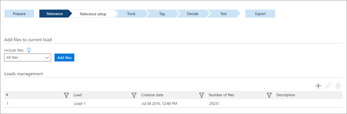

# 在 [Advanced eDiscovery （傳統）] 中設定載入匯入檔案的負載

> [!NOTE]
> 進階電子文件探索需要具有進階合規性附加元件的 Office 365 E3，或適用於您組織的 E5 訂閱。如果您沒有該方案，且想要嘗試進階電子文件探索，您可以[註冊 Office 365 企業版 E5 試用版](https://go.microsoft.com/fwlink/p/?LinkID=698279)。 
  
在 [Advanced eDiscovery] 中，load 是新增至案例的新批次檔案。 依預設，會定義一個負載，並新增所有匯入的檔案。 在執行相關性訓練之前，必須先將匯入的檔案新增到負載中。 
  
請考量下列案例：
  
- 新檔案已知類似先前載入至案例資料庫的檔案，或先前的檔案載入是從檔案集合隨機設定。 在此範例中，將匯入的檔案新增至目前的檔案負載。
    
- 新檔案與舊版不同（例如，從不同的來源），或是先前的負載很類似或不同于先前的負載。 在此案例中，將匯入的檔案新增至新的檔負載。 「高級 eDiscovery」會將這視為滾動負載案例、呼叫追趕程式、鎖定相關性訓練和批次計算，直到完成追趕，而且新的負載已整合且訓練有素。 
    
## 將匯入檔新增至目前的負載

所有匯入的檔案必須新增至要在高級 eDiscovery 中處理的負載。 匯入的檔案會新增至最後定義的負載。 如果您稍後匯入其他檔案，也必須將其新增至負載。
  
1. 在 [**相關性 \> 關聯性設定**] 索引標籤中，選取 [**載入**]。
    
    
  
2. **包含**檔案：選取要包含的檔案選項。 根據預設，將檔案新增至目前的負載是以「所有檔案」的人口。
    
    > [!TIP]
    > 將所有可用的 culled 檔案載入至關聯性。 如果您計畫只載入可用檔案的子集，請先諮詢支援人員，因為載入子集可能會對相關性訓練產生負面影響。 
  
3. 在 [**載入管理**] 中，選取負載。
    
4. 按一下 [**新增**檔案]。 隨即會在載入中新增檔案，並顯示確認訊息。 
    
5. 按一下 [確定]****。
    
您現在可以在高級 eDiscovery 相關性中處理檔案，以進行檔訓練。
  
## 編輯案例內的負載名稱

若要變更載入名稱，建議使用對此案例很重要的名稱。
  
1. 在 [**相關性 \> 關聯性設定**] 索引標籤中，選取 [**載入**]。
    
2. 從 [**載入管理**] 清單中，選取負載，然後按一下 [**編輯**] 圖示。 隨即會顯示 [編輯載入] 視窗。 
    
3. 輸入變更，然後按一下 **[確定]**。
    
## 將匯入的檔案新增至新的負載

開始相關性訓練或執行批次計算之後，您可能會想要匯入並處理一組額外的檔案。 
  
在追趕過程中，您可以建立、標記和分析追趕集。 「高級 eDiscovery」會比較其對新負載中的相關和非相關檔案對先前的負載的評估。 根據結果，系統會提示您進行追趕決策（如有必要），以及高級 eDiscovery 根據累計相關性資訊提供建議。 
  
滾動負載和追趕功能的變化如下： 
  
- 當您在批次計算後匯入新的檔案時，高級 eDiscovery 會決定檔屬於下列其中一個類別：
    
  - 類似（同類）：不需要新的自訂舍入訓練，而且從先前的負載累算的知識也可以套用至新的負載。 
    
  - Distinct （異類）：需要新的自訂舍入訓練，且無法套用來自上一個負載的知識。 
    
    這些字詞是指的是各載入間的檔相似性層級，而不是在負載內。 
    
- 在相關性訓練期間匯入新的檔載入時（批次計算之前），追趕可讓您在美國檔組上繼續相關訓練。 「高級 eDiscovery」不會估計新的負載與先前的負載是否類似或不同。 它只會收集有關新負載的資訊，並啟用相關性訓練，以繼續執行新的和前一組檔案。 
    
- 當相關性訓練中有多個問題和批次計算後的問題，針對所有問題都會執行一次追趕處理常式，並針對每個問題計算及顯示結果。
    
> [!NOTE]
> 追趕範例的大小可能會有所不同。 這取決於新負載的大小與上一個負載的相對，以及在新增新的負載之前所完成的範例數目。 此追趕範例通常是一組200到2000的檔案，來自新的負載。 
  
> [!TIP]
> 追趕會停止任何其他工作，並且需要個別的檔標記和審閱。 因此，您可以在大量批次新增檔案時降低系統開銷。 
  
## 使用追趕和滾動負載新增新的檔載入

1. 在 [**相關性 \> 關聯性設定**] 索引標籤中，選取 [**載入**]。
    
2. 在 [**載入管理**] 底下，按一下 **+** 圖示以新增負載。 隨即顯示確認訊息。 
    
3. 按一下 **[是]** 以繼續。 隨即會顯示 [**新增載入**] 對話方塊。 
    
    > [!NOTE]
    > 只有在先前的負載中執行動作時，才可以加入新的負載。 
  
4. 在 [**新增負載**] 對話方塊的 [**載入名稱**與**描述**] 中輸入資訊，然後按一下 **[確定]**。 「高級 eDiscovery」會新增新的負載。
    
5. 若要匯入新的載入檔案，請按一下 [**新增**檔案]。 所有新檔案都會新增至此負載。 在高級 eDiscovery 匯入檔之後，它會辨識「滾動負載」案例，並指出做為下一個步驟。
    
6. 按一下對話方塊底部的 [**追趕**] 以執行案例。 
    
    單一的追趕集（一般會包含200至2000檔來自新的負載）是針對所有允許同時進行檔標記的問題而建立的。
    
    會提供詳細資料，告知載入是類似還是截然不同，是否要自動合併或分割負載，以及在下一個步驟中處理的相關資訊。
    
    然後您就可以標記檔案並執行計算作業。 標記可讓相關性判斷載入是否類似或截然不同，可讓您繼續處理一組新的檔案。
    
7. 檢查追趕集之後，請查看追趕結果的**相關性 \> 追蹤**。 
    
1. 如果在相關性訓練期間新增新的檔案負載（也就是說，此問題尚未透過批次計算出），則請**繼續訓練**為下一個步驟，不論追趕的結果為何。 
    
    新的和先前的負載會隨著一次的負載和關聯性訓練進行處理，繼續進行。 您現在已完成此程式，可以繼續相關訓練。 
    
2. 如果新的負載是在批次計算後新增的，請繼續執行下列步驟。
    
8. 針對在批次計算後新增的負載，高級 eDiscovery 會判斷新的負載與先前的負載是否類似或截然不同，如下所示：
    
1. 如果發現負載類似：無需進行其他相關性訓練。 儀表板顯示建議的下一步是執行 * * 批次計算 * *，以計算新負載的相關性分數。 已發現負載類似，所以可以在新的檔案上執行先前的分類器分析。 
    
2. 若發現負載截然不同：有必要進行相關訓練，下一步是追趕決定。 請選取下列專案的追趕決策：
    
    如果您選取 [**合併載入**]，Advanced eDiscovery 便會合並訓練集的先前和新負載。 雖然第一次載入是透過成批計算，但需要進行更多訓練。 繼續訓練新的和先前的負載。 然後再執行批次計算，並且應該忽略先前的批次計算分數。 當可重新計算現有負載的相關性分數時（例如，當審閱現有的檔載入尚未開始時），請選擇此選項。
    
    如果您選取 [**分割載入**]，只會在新的負載上繼續相關性訓練。 在此情況下，先前批次計算分數會維持原樣。 當現有負載的現有相關性分數無法重新計算時（例如，如果已開始審核現有的負載），請選擇此選項。 相關性分數會獨立于此點向前管理，而且無法合併。
    
3. 按一下 [**繼續訓練**]。
    
## 請參閱

[Office 365 進階電子文件探索 (傳統版)](office-365-advanced-ediscovery.md)
  
[定義問題並指派使用者](define-issues-and-assign-users.md)
  
[定義反白顯示的關鍵字和進階選項](define-highlighted-keywords-and-advanced-options.md)

